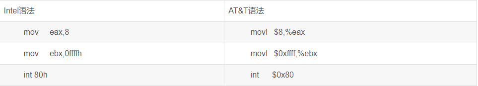

<!-- START doctoc generated TOC please keep comment here to allow auto update -->
<!-- DON'T EDIT THIS SECTION, INSTEAD RE-RUN doctoc TO UPDATE -->
**Table of Contents**  *generated with [DocToc](https://github.com/thlorenz/doctoc)*

- [8086](#8086)
  - [地址](#%E5%9C%B0%E5%9D%80)
    - [物理地址](#%E7%89%A9%E7%90%86%E5%9C%B0%E5%9D%80)
    - [段地址](#%E6%AE%B5%E5%9C%B0%E5%9D%80)
  - [寄存器](#%E5%AF%84%E5%AD%98%E5%99%A8)
    - [通用寄存器](#%E9%80%9A%E7%94%A8%E5%AF%84%E5%AD%98%E5%99%A8)
      - [AX](#ax)
      - [BX](#bx)
      - [CX](#cx)
      - [DX](#dx)
    - [段寄存器](#%E6%AE%B5%E5%AF%84%E5%AD%98%E5%99%A8)
      - [CS和IP](#cs%E5%92%8Cip)
      - [DS和DX](#ds%E5%92%8Cdx)
      - [SS和SP](#ss%E5%92%8Csp)
      - [ES](#es)
- [x86](#x86)
  - [指令集](#%E6%8C%87%E4%BB%A4%E9%9B%86)
    - [数据传输指令](#%E6%95%B0%E6%8D%AE%E4%BC%A0%E8%BE%93%E6%8C%87%E4%BB%A4)
      - [通用数据传送指令](#%E9%80%9A%E7%94%A8%E6%95%B0%E6%8D%AE%E4%BC%A0%E9%80%81%E6%8C%87%E4%BB%A4)
      - [输入输出端口传送指令](#%E8%BE%93%E5%85%A5%E8%BE%93%E5%87%BA%E7%AB%AF%E5%8F%A3%E4%BC%A0%E9%80%81%E6%8C%87%E4%BB%A4)
      - [目的地址传送指令](#%E7%9B%AE%E7%9A%84%E5%9C%B0%E5%9D%80%E4%BC%A0%E9%80%81%E6%8C%87%E4%BB%A4)
      - [标志传送指令](#%E6%A0%87%E5%BF%97%E4%BC%A0%E9%80%81%E6%8C%87%E4%BB%A4)
    - [算术运算指令](#%E7%AE%97%E6%9C%AF%E8%BF%90%E7%AE%97%E6%8C%87%E4%BB%A4)
    - [逻辑运算指令](#%E9%80%BB%E8%BE%91%E8%BF%90%E7%AE%97%E6%8C%87%E4%BB%A4)
    - [串指令](#%E4%B8%B2%E6%8C%87%E4%BB%A4)
    - [程序转移指令](#%E7%A8%8B%E5%BA%8F%E8%BD%AC%E7%A7%BB%E6%8C%87%E4%BB%A4)
      - [无条件转移指令 (长转移)](#%E6%97%A0%E6%9D%A1%E4%BB%B6%E8%BD%AC%E7%A7%BB%E6%8C%87%E4%BB%A4-%E9%95%BF%E8%BD%AC%E7%A7%BB)
      - [条件转移指令 (短转移)](#%E6%9D%A1%E4%BB%B6%E8%BD%AC%E7%A7%BB%E6%8C%87%E4%BB%A4-%E7%9F%AD%E8%BD%AC%E7%A7%BB)
      - [循环控制指令(短转移)](#%E5%BE%AA%E7%8E%AF%E6%8E%A7%E5%88%B6%E6%8C%87%E4%BB%A4%E7%9F%AD%E8%BD%AC%E7%A7%BB)
      - [中断指令](#%E4%B8%AD%E6%96%AD%E6%8C%87%E4%BB%A4)
      - [处理器控制指令](#%E5%A4%84%E7%90%86%E5%99%A8%E6%8E%A7%E5%88%B6%E6%8C%87%E4%BB%A4)
    - [伪指令](#%E4%BC%AA%E6%8C%87%E4%BB%A4)
    - [处理机控制指令：标志处理指令](#%E5%A4%84%E7%90%86%E6%9C%BA%E6%8E%A7%E5%88%B6%E6%8C%87%E4%BB%A4%E6%A0%87%E5%BF%97%E5%A4%84%E7%90%86%E6%8C%87%E4%BB%A4)
  - [浮点运算指令集](#%E6%B5%AE%E7%82%B9%E8%BF%90%E7%AE%97%E6%8C%87%E4%BB%A4%E9%9B%86)
    - [控制指令](#%E6%8E%A7%E5%88%B6%E6%8C%87%E4%BB%A4)
    - [数据传送指令](#%E6%95%B0%E6%8D%AE%E4%BC%A0%E9%80%81%E6%8C%87%E4%BB%A4)
    - [比较指令](#%E6%AF%94%E8%BE%83%E6%8C%87%E4%BB%A4)
    - [运算指令](#%E8%BF%90%E7%AE%97%E6%8C%87%E4%BB%A4)
- [x64](#x64)
  - [分类](#%E5%88%86%E7%B1%BB)
  - [基本知识](#%E5%9F%BA%E6%9C%AC%E7%9F%A5%E8%AF%86)
    - [寄存器和内存](#%E5%AF%84%E5%AD%98%E5%99%A8%E5%92%8C%E5%86%85%E5%AD%98)
  - [寄存器](#%E5%AF%84%E5%AD%98%E5%99%A8-1)
    - [通用寄存器](#%E9%80%9A%E7%94%A8%E5%AF%84%E5%AD%98%E5%99%A8-1)
      - [RAX](#rax)
      - [RBX](#rbx)
      - [RCX](#rcx)
      - [RDX](#rdx)
  - [指令集](#%E6%8C%87%E4%BB%A4%E9%9B%86-1)
    - [mov](#mov)
    - [call](#call)
    - [lea](#lea)
    - [ret](#ret)
    - [运算指令](#%E8%BF%90%E7%AE%97%E6%8C%87%E4%BB%A4-1)
      - [add](#add)
      - [sub](#sub)
      - [inc](#inc)
      - [dec](#dec)
      - [xor](#xor)
    - [比较指令](#%E6%AF%94%E8%BE%83%E6%8C%87%E4%BB%A4-1)
      - [cmp](#cmp)
    - [跳转指令](#%E8%B7%B3%E8%BD%AC%E6%8C%87%E4%BB%A4)
      - [jmp](#jmp)
      - [jne](#jne)

<!-- END doctoc generated TOC please keep comment here to allow auto update -->

# 8086

16位的CPU

## 地址

### 物理地址

+ [很赞的说明](https://blog.csdn.net/fly_wt/article/details/121435502)

8086CPU有20位地址总线，可以传送20位地址，寻址能力为1MB。但是CPU是16位的，只能送出16位的地址，表现出来的寻址能力只有64KB，所以采用两个16位的进行加法运算得到20位地址。

物理地址=段地址*16+偏移地址

### 段地址

在编程中根据需要，将若干地址连续的内存单元看作一个段，用段地址*16定义段的起始地址（基础地址），用偏移地址定位段得得内存单元。

## 寄存器

所有寄存器都是16位。

### 通用寄存器

8086上一代CPU的寄存器都是8位的，为了保持兼容性，使原来基于上代CPU编写的程序稍加修改就能运行在8086上，8086的AX、BX、CX、DX这四个寄存器可分为两个独立的8位的寄存器来使用。

#### AX

AX=AH+AL

#### BX

BX=BH+BL

#### CX

CX=CH+CL

#### DX

DX=DH+DL

### 段寄存器

4个段寄存器，CS、DS、SS、ES。当8086CPU要访问内存时由这4个段寄存器提供内存单元的段地址。

#### CS和IP

CS为代码段寄存器，IP为指令指针寄存器。8086CPU中，任何时刻，假设CS的值为M，IP的内容为N，8086CPU将从内存M*16+N单元开始，读取一条指令并执行。

#### DS和DX

DS寄存器存储数据段的段地址，多数情况下用DX存放数据段的偏移长度

#### SS和SP

SS寄存器存储堆栈段的段地址，SP寄存器存放堆栈段的偏移长度

#### ES

# x86

## 寄存器

### 通用寄存器
#### EAX
#### EBX
#### ECX
#### EDX
#### ESP
#### EBP
#### ESI
#### EDI

### 标志寄存器
#### EFLAGS

### 控制寄存器
5个，分别为CR0-CR4

### 调试寄存器
8个，分别为DR0-DR7

### 系统地址寄存器
4个，GDTR、IDTR、LDTR和TR

## 指令集

### 数据传输指令

#### mov
```
例子1:
int a=1;
mov dword ptr [a],1  dword表示4字节,将1放到a的地址里面

例子2:
int b = 2;
mov  dword ptr [b],2  
long d = b;    # 汇编不允许内存直接到内存
mov  eax,dword ptr [b]  # 先将b地址里面的值放到eax寄存器中
mov  dword ptr [d],eax  # 再将寄存器eax的中的值放到地址d中
```

#### 通用数据传送指令

```汇编
MOV     传送字或字节.  
MOVSX   先符号扩展,再传送.  
MOVZX   先零扩展,再传送.  
PUSH    把字压入堆栈.  
POP     把字弹出堆栈.  
PUSHA   把AX,CX,DX,BX,SP,BP,SI,DI依次压入堆栈.  
POPA    把DI,SI,BP,SP,BX,DX,CX,AX依次弹出堆栈.  
PUSHAD  把EAX,ECX,EDX,EBX,ESP,EBP,ESI,EDI依次压入堆栈.  
POPAD   把EDI,ESI,EBP,ESP,EBX,EDX,ECX,EAX依次弹出堆栈.  
BSWAP   交换32位寄存器里字节的顺序  
XCHG    交换字或字节.(至少有一个操作数为寄存器,段寄存器不可作为操作数)  
CMPXCHG 比较并交换操作数.(第二个操作数必须为累加器AL/AX/EAX)  
XADD    先交换再累加.(结果在第一个操作数里)  
XLAT    字节查表转换.----BX指向一张256字节的表的起点,AL为表的索引值(0-255,即0-FFH);返回AL为查表结果.([BX+AL]->AL)  
```

#### 输入输出端口传送指令

```
IN      I/O端口输入. ( 语法: IN   累加器,    {端口号│DX} )  
OUT     I/O端口输出. ( 语法: OUT {端口号│DX},累加器 )输入输出端口由立即方式指定时,    其范围是 0-255; 由寄存器 DX 指定时,其范围是    0-65535.  
```

#### 目的地址传送指令

```
LEA     装入有效地址.例: LEA DX,string ;把偏移地址存到DX.  
LDS     传送目标指针,把指针内容装入DS.例: LDS SI,string   ;把段地址:偏移地址存到DS:SI.  
LES     传送目标指针,把指针内容装入ES.例: LES DI,string   ;把段地址:偏移地址存到ES:DI.  
LFS     传送目标指针,把指针内容装入FS.例: LFS DI,string   ;把段地址:偏移地址存到FS:DI.  
LGS     传送目标指针,把指针内容装入GS.例: LGS DI,string   ;把段地址:偏移地址存到GS:DI.  
LSS     传送目标指针,把指针内容装入SS.例: LSS DI,string   ;把段地址:偏移地址存到SS:DI.  
```

#### 标志传送指令

```
LAHF    标志寄存器传送,把标志装入AH.  
SAHF    标志寄存器传送,把AH内容装入标志寄存器.  
PUSHF   标志入栈.  
POPF    标志出栈.  
PUSHD   32位标志入栈.  
POPD    32位标志出栈.  
```

### 算术运算指令

```
ADC     带进位加法.  
INC     加 1.  
AAA     加法的ASCII码调整.  
DAA     加法的十进制调整.  
SUB     减法.  
SBB     带借位减法.  
DEC     减 1.  
NEG     求反(以    0 减之).  
CMP     比较.(两操作数作减法,仅修改标志位,不回送结果).  
AAS     减法的ASCII码调整.  
DAS     减法的十进制调整.  
MUL     无符号乘法.结果回送AH和AL(字节运算),或DX和AX(字运算),  
IMUL    整数乘法.结果回送AH和AL(字节运算),或DX和AX(字运算),  
AAM     乘法的ASCII码调整.  
DIV     无符号除法.结果回送:商回送AL,余数回送AH, (字节运算);或 商回送AX,余数回送DX, (字运算).  
IDIV    整数除法.结果回送:商回送AL,余数回送AH, (字节运算);或 商回送AX,余数回送DX, (字运算).  
AAD     除法的ASCII码调整.  
CBW     字节转换为字. (把AL中字节的符号扩展到AH中去)  
CWD     字转换为双字. (把AX中的字的符号扩展到DX中去)  
CWDE    字转换为双字. (把AX中的字符号扩展到EAX中去)  
CDQ     双字扩展. (把EAX中的字的符号扩展到EDX中去)  
```

### 逻辑运算指令

```
AND     与运算.  
OR      或运算.  
XOR     异或运算.  
NOT     取反.  
TEST    测试.(两操作数作与运算,仅修改标志位,不回送结果).  
SHL     逻辑左移.  
SAL     算术左移.(=SHL)  
SHR     逻辑右移.  
SAR     算术右移.(=SHR)  
ROL     循环左移.  
ROR     循环右移.  
RCL     通过进位的循环左移.  
RCR     通过进位的循环右移.  
          以上八种移位指令,其移位次数可达255次.  
          移位一次时, 可直接用操作码. 如 SHL AX,1.  
          移位>1次时, 则由寄存器CL给出移位次数.  
          如 MOV CL,04   SHL AX,CL  
```

### 串指令

```
          DS:SI 源串段寄存器 :源串变址.  
          ES:DI 目标串段寄存器:目标串变址.  
          CX 重复次数计数器.  
          AL/AX 扫描值.  
          D标志   0表示重复操作中SI和DI应自动增量; 1表示应自动减量.  
          Z标志   用来控制扫描或比较操作的结束.  
MOVS    串传送.( MOVSB 传送字符. MOVSW 传送字. MOVSD 传送双字. )  
CMPS    串比较.( CMPSB 比较字符. CMPSW 比较字. )  
SCAS    串扫描.把AL或AX的内容与目标串作比较,比较结果反映在标志位.  
LODS    装入串.把源串中的元素(字或字节)逐一装入AL或AX中.( LODSB 传送字符. LODSW 传送字.    LODSD 传送双字. )  
STOS    保存串.是LODS的逆过程.  
REP         当CX/ECX<>0时重复.  
REPE/REPZ   当ZF=1或比较结果相等,且CX/ECX<>0时重复.  
REPNE/REPNZ 当ZF=0或比较结果不相等,且CX/ECX<>0时重复.  
REPC        当CF=1且CX/ECX<>0时重复.  
REPNC       当CF=0且CX/ECX<>0时重复.  
```

### 程序转移指令

#### 无条件转移指令 (长转移)

```
JMP         无条件转移指令  
CALL        过程调用  
RET/RETF    过程返回.  
```

#### 条件转移指令 (短转移)

-128到+127的距离内)( 当且仅当(SF XOR OF)=1时,OP1<OP2

```
JA/JNBE     不小于或不等于时转移.  
JAE/JNB     大于或等于转移.  
JB/JNAE     小于转移.  
JBE/JNA     小于或等于转移.  
    以上四条,测试无符号整数运算的结果(标志C和Z).  
JG/JNLE     大于转移.  
JGE/JNL     大于或等于转移.  
JL/JNGE     小于转移.  
JLE/JNG     小于或等于转移.  
    以上四条,测试带符号整数运算的结果(标志S,O和Z).  
JE/JZ       等于转移.  
JNE/JNZ     不等于时转移.  
JC          有进位时转移.  
JNC         无进位时转移.  
JNO         不溢出时转移.  
JNP/JPO     奇偶性为奇数时转移.  
JNS         符号位为 "0" 时转移.  
JO          溢出转移.  
JP/JPE      奇偶性为偶数时转移.  
JS          符号位为 "1" 时转移.  
```

#### 循环控制指令(短转移)

```
LOOP            CX不为零时循环.  
LOOPE/LOOPZ     CX不为零且标志Z=1时循环.  
LOOPNE/LOOPNZ   CX不为零且标志Z=0时循环.  
JCXZ            CX为零时转移.  
JECXZ           ECX为零时转移.  
```

#### 中断指令

```
INT         中断指令  
INTO        溢出中断  
IRET        中断返回  
```

#### 处理器控制指令

```
HLT         处理器暂停,  直到出现中断或复位信号才继续.  
WAIT        当芯片引线TEST为高电平时使CPU进入等待状态.  
ESC         转换到外处理器.  
LOCK        封锁总线.  
NOP         空操作.  
STC         置进位标志位.  
CLC         清进位标志位.  
CMC         进位标志取反.  
STD         置方向标志位.  
CLD         清方向标志位.  
STI         置中断允许位.  
CLI         清中断允许位.  
```

### 伪指令

```
DW          定义字(2字节).  
PROC        定义过程.  
ENDP        过程结束.  
SEGMENT     定义段.  
ASSUME      建立段寄存器寻址.  
ENDS        段结束.  
END         程序结束.  
```

### 处理机控制指令：标志处理指令

```
CLC     进位位置0指令  
CMC     进位位求反指令  
STC     进位位置为1指令  
CLD     方向标志置1指令  
STD     方向标志位置1指令  
CLI     中断标志置0指令  
STI     中断标志置1指令  
NOP     无操作  
HLT     停机  
WAIT    等待  
ESC     换码  
LOCK    封锁  
```

##  浮点运算指令集

### 控制指令

带9B的控制指令前缀F变为FN时浮点不检查，机器码去掉9B

```
FINIT                 初始化浮点部件                  机器码  9B DB E3  
FCLEX                 清除异常                         机器码  9B DB E2  
FDISI                 浮点检查禁止中断                 机器码  9B DB E1  
FENI                  浮点检查禁止中断二            机器码  9B DB E0  
WAIT                  同步CPU和FPU                    机器码  9B  
FWAIT                 同步CPU和FPU                    机器码  D9 D0  
FNOP                  无操作                          机器码  DA E9  
FXCH                  交换ST(0)和ST(1)                机器码  D9 C9  
FXCH ST(i)            交换ST(0)和ST(i)                机器码  D9 C1iii  
FSTSW ax              状态字到ax                       机器码  9B DF E0  
FSTSW   word ptr mem  状态字到mem                      机器码  9B DD mm111mmm  
FLDCW   word ptr mem  mem到状态字                      机器码  D9 mm101mmm  
FSTCW   word ptr mem  控制字到mem                      机器码  9B D9 mm111mmm  

FLDENV  word ptr mem  mem到全环境                      机器码  D9 mm100mmm  
FSTENV  word ptr mem  全环境到mem                      机器码  9B D9 mm110mmm  
FRSTOR  word ptr mem  mem到FPU状态                    机器码  DD mm100mmm  
FSAVE   word ptr mem  FPU状态到mem                    机器码  9B DD mm110mmm  

FFREE ST(i)           标志ST(i)未使用                   机器码  DD C0iii  
FDECSTP               减少栈指针1->0 2->1             机器码  D9 F6  
FINCSTP               增加栈指针0->1 1->2             机器码  D9 F7  
FSETPM                浮点设置保护                       机器码  DB E4  
```

### 数据传送指令

```
FLDZ                  将0.0装入ST(0)                  机器码  D9 EE  
FLD1                  将1.0装入ST(0)                  机器码  D9 E8  
FLDPI                 将π装入ST(0)                    机器码  D9 EB  
FLDL2T                将ln10/ln2装入ST(0)             机器码  D9 E9  
FLDL2E                将1/ln2装入ST(0)                机器码  D9 EA  
FLDLG2                将ln2/ln10装入ST(0)             机器码  D9 EC  
FLDLN2                将ln2装入ST(0)                  机器码  D9 ED  

FLD    real4 ptr mem  装入mem的单精度浮点数             机器码  D9 mm000mmm  
FLD    real8 ptr mem  装入mem的双精度浮点数             机器码  DD mm000mmm  
FLD   real10 ptr mem  装入mem的十字节浮点数             机器码  DB mm101mmm  

FILD    word ptr mem  装入mem的二字节整数              机器码  DF mm000mmm  
FILD   dword ptr mem  装入mem的四字节整数              机器码  DB mm000mmm  
FILD   qword ptr mem  装入mem的八字节整数              机器码  DF mm101mmm  

FBLD   tbyte ptr mem  装入mem的十字节BCD数            机器码  DF mm100mmm  

FST    real4 ptr mem  保存单精度浮点数到mem             机器码  D9 mm010mmm  
FST    real8 ptr mem  保存双精度浮点数到mem             机器码  DD mm010mmm  

FIST    word ptr mem  保存二字节整数到mem              机器码  DF mm010mmm  
FIST   dword ptr mem  保存四字节整数到mem              机器码  DB mm010mmm  

FSTP   real4 ptr mem  保存单精度浮点数到mem并出栈      机器码  D9 mm011mmm  
FSTP   real8 ptr mem  保存双精度浮点数到mem并出栈      机器码  DD mm011mmm  
FSTP  real10 ptr mem  保存十字节浮点数到mem并出栈      机器码  DB mm111mmm  

FISTP   word ptr mem  保存二字节整数到mem并出栈           机器码  DF mm011mmm  
FISTP  dword ptr mem  保存四字节整数到mem并出栈           机器码  DB mm011mmm  
FISTP  qword ptr mem  保存八字节整数到mem并出栈           机器码  DF mm111mmm  

FBSTP  tbyte ptr mem  保存十字节BCD数到mem并出栈     机器码  DF mm110mmm  

FCMOVB                ST(0),ST(i) <时传送              机器码  DA C0iii  
FCMOVBE               ST(0),ST(i) <=时传送             机器码  DA D0iii  
FCMOVE                ST(0),ST(i) =时传送             机器码  DA C1iii  
FCMOVNB               ST(0),ST(i) >=时传送             机器码  DB C0iii  
FCMOVNBE              ST(0),ST(i) >时传送              机器码  DB D0iii  
FCMOVNE               ST(0),ST(i) !=时传送            机器码  DB C1iii  
FCMOVNU               ST(0),ST(i) 有序时传送        机器码  DB D1iii  
FCMOVU                ST(0),ST(i) 无序时传送        机器码  DA D1iii  
```

### 比较指令

```
FCOM                  ST(0)-ST(1)                      机器码  D8 D1  
FCOMI                 ST(0),ST(i)  ST(0)-ST(1)         机器码  DB F0iii  
FCOMIP                ST(0),ST(i)  ST(0)-ST(1)并出栈   机器码  DF F0iii  
FCOM   real4 ptr mem  ST(0)-实数mem                      机器码  D8 mm010mmm  
FCOM   real8 ptr mem  ST(0)-实数mem                      机器码  DC mm010mmm  

FICOM   word ptr mem  ST(0)-整数mem                      机器码  DE mm010mmm  
FICOM  dword ptr mem  ST(0)-整数mem                      机器码  DA mm010mmm  
FICOMP  word ptr mem  ST(0)-整数mem并出栈               机器码  DE mm011mmm  
FICOMP dword ptr mem  ST(0)-整数mem并出栈               机器码  DA mm011mmm  

FTST                  ST(0)-0                          机器码  D9 E4  
FUCOM  ST(i)          ST(0)-ST(i)                      机器码  DD E0iii  
FUCOMP ST(i)          ST(0)-ST(i)并出栈                   机器码  DD E1iii  
FUCOMPP               ST(0)-ST(1)并二次出栈             机器码  DA E9  
FXAM                  ST(0)规格类型                    机器码  D9 E5  
```

### 运算指令

```
FADD                  把目的操作数 (直接接在指令后的变量或堆栈缓存器) 与来源操作数 (接在目的操作数后的变量或堆栈缓存器)  相加，并将结果存入目的操作数  
FADDP  ST(i),ST       这个指令是使目的操作数加上 ST  缓存器，并弹出 ST 缓存器，而目的操作数必须是堆栈缓存器的其中之一，最后不管目的操作数为何，经弹出一次后，目的操作数会变成上一个堆栈缓存器了  
FIADD                 FIADD 是把 ST   加上来源操作数，然后再存入 ST 缓存器，来源操作数必须是字组整数或短整数形态的变数  

FSUB                  减  
FSUBP  
FSUBR                 减数与被减数互换  
FSUBRP  
FISUB  
FISUBR  

FMUL                  乘  
FMULP  
FIMUL  

FDIV                  除  
FDIVP  
FDIVR  
FDIVRP  
FIDIV  
FIDIVR  

FCHS                  改变 ST 的正负值  

FABS                  把 ST  之值取出，取其绝对值后再存回去。  

FSQRT                 将 ST  之值取出，开根号后再存回去。  

FSCALE                这个指令是计算 ST*2^ST(1)之值，再把结果存入 ST 里而 ST(1)   之值不变。ST(1)  必须是在 -32768 到 32768 (-215 到 215 )之间的整数，如果超过这个范围计算结果无法确定，如果不是整数 ST(1)    会先向零舍入成整数再计算。所以为安全起见，最好是由字组整数载入到 ST(1) 里。  

FRNDINT               这个指令是把 ST 的数值舍入成整数，FPU    提供四种舍入方式，由 FPU 的控制字组(control    word)中的 RC 两个位决定  
                          RC    舍入控制  
                          00    四舍五入  
                          01    向负无限大舍入  
                          10    向正无限大舍入  
                          11    向零舍去  
```

# x64

## 分类

+ intel（Windows）
+ AT&T（Macos）



## 基本知识

### 寄存器和内存

通常，CPU会将内存中的数据存储到寄存器中，然后再对寄存器的值进行计算。

## 寄存器

一个寄存器存储八字节，R开头的是64位的，占8字节，E开头的是32位的，占4字节

### 通用寄存器

#### RAX

#### RBX

#### RCX

#### RDX

## 指令集

### mov

```
mov dist,src //将src的内容赋值给dist类似于dist=src

[地址值]  //[]括号里面放的都是地址

word 是2字节 dword 是4字节（double word） qword是8字节（quard word）

int a=3;  //c++
mov dword ptr [1128h],3   //汇编代码，ptr指明单位的固定写法，3要4个字节存储，存到地址1128h中。

mov eax,dword ptr [1128h] //取出1128h地址对应的存储空间取出四个字节给eax寄存器
```

### call

```
call [函数地址] //调用函数，call 之前的push指令都是传参
```

### lea

```
lea dest ,[地址值]  //将地址值赋值给dest，类似于dest=地址值
lea eax,[1128h]  //将1128h地址值赋值给eax 等同于 move eax,1128h
```

### ret

```
//函数返回
```

### 运算指令

#### add

```
add op1,op2  //类似于op1=op1+op2
```

#### sub

```
sub op1,op2  //类似于op1=op1-op2
```

#### inc

```
inc op //自增，类似于op=op+1
```

#### dec

```
dec op //自减,类似于op=op-1
```

#### xor

```
xor op1,op2  //将op1和op2的异或的结果赋值给op1,类似于op1=op1^op2
```

### 比较指令

#### cmp

```
cmp eax,dword ptx [1128h]   //从1128h地址取出四个字节的值和eax寄存器内的值比较是否相等
```

### 跳转指令

#### jmp

```
jmp 内存地址  //跳转到这个内存地址的汇编代码开始执行,j开头的一般是跳转指令,大多数是带条件的跳转,一般和test,cmp等指令配合使用
```

#### jne

```
相当于 jump not equal  //比较结果不相等跳转
```
