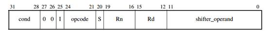
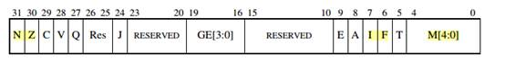

# ARM

## 指令格式

### ARM架构


### ARM编码格式



mov a1,#2  //将立即数2放到a1寄存器中,a1为寄存器r0的别名,详见APCS

内存中表示的16进制的机器码 0x0200A0E3

ARM小端，所以正确的十六进制机器码0xE3A00002

二进制：‭‭1110 00 1 1101 0 0000 0000 000000000010‬

1110:条件码，无条件位1110

00:保留位

1:表示源操作数是立即数还是寄存器,0表示寄存器,1表示立即数

1101:表示mov指令的机器码

0:S位表示没有S标志

0000:

0000:目的操作数,是r0,所以为0000

000000000010:源操作数,前四位表示移位信息位,用来扩展立即数的大小.后八位表示立即数的数值,如果为寄存器,按照目的操作数的格式即可.

## Thumb

```
ARM状态（执行32位对齐指令的ARM指令）
Thumb状态（执行16位对齐的Thumb指令）
```

## [寄存器](https://www.cnblogs.com/wrjvszq/p/4199682.html)

### 通用寄存器（31个）

#### 不分组寄存器（R0—R7）

+ 在所有的运行模式下都使用同一个物理寄存器，它们未被系统用作特殊的用途。
+ R0-R3作为函数参数，大于4个用堆栈存储
+ R0通常作为函数返回值

#### 分组寄存器（R8—R14）

+ 对于R8~R12，当使用FIQ(快速中断模式)时访问寄存器R8_fiq~R12_fiq，当使用除FIQ模式以外的其他模式时,访问寄存器R8~R12

+ 对于R13,R14来说,每个寄存器对应6个不同的物理寄存器，其中一个是用户模式与系统模式共用（图中的R13，R14），另外5个物理寄存器对应其他5种不同的运行模式，并采用以下记号来区分不同的物理寄存器分别为fiq,irq,svc,abt,und.（如上图）

​          i.R13在ARM指令中常用作堆栈指针SP

​            特别注意：由于每一种模式都有自己的R13，所以我们在自己初始化的时候一般都要初始化每种模式下的R13，使其指向该运行模式的栈空间。

​         ii. R14称为子程序链接寄存器LR(Link Register)

​         有两个特殊功能，一种是每一种模式下都可以用于保存函数的返回地址，另外就是异常处理后的返回地址，如中断。

#### PC指针（R15）

+ R15用作程序计数器(PC)对应一个物理寄存器，由于ARM体系结构采用了多级流水线技术（不了解多级流水线的可以访问这个[博客](http://blog.csdn.net/abclixu123/article/details/7471822)，博主讲的不错），对于ARM指令集而言，PC总是指向当前指令的下两条指令的地址,即PC的值为当前指令的地址值加8个字节程序状态寄存器。

### 状态寄存器（6个）

 #### CPSR（1个）

+ 下面介绍其中几个比较重要的位，其他位，大家可以参考官方手册：

  - N: 当两个表示的有符号整数运算时，1表示运算结果为负数，0表示结果为正或零。
  - Z：1表示运算的结果为零，0表示运算的结果不为零。对于CMP指令，1表示进行比较的两个数大小相等。
  - C:   下面分四种情况讨论C的设置方法：
    1. 加法运算（包括比较指令CMN）：当运算产生了进位时（无符号数溢出），C=1，否则C=0。
    2. 减法运算（包括比较指令CMP）：当运算时产生了借位（无符号数溢出），C=0，否则C=1。
    3. 对于包含移位操作的非加/减运算指令，C为移出值的最后一位。
    4. 对于其他的非加/减运算指令，C的值通常不改变。
  - V:下面分两种情况讨论V的设置方法
    1. 对于加/减法运算指令，当操作数和运算结果为二进制的补码表示的带符号数时，V=1表示符号位溢出。
    2. 对于其他的非加/减运算指令，C的值通常不改变。
  - I：1 表示禁止外部（硬件）中断（IRQ）
  - F：1 表示禁止快速中断（FIQ）
  - T：1表示为thumb状态0为arm状态
  - M[4:0]：用来设置处理器的工作模式具体数据见本文开始的介绍。

  

 #### SPSR（5个）

+ SPSR 除usr、sys外，对应用于异常保护的CPSR的备份，异常时，保存CPSR值，异常退出时，将该值恢复到CPSR，以保证程序的正常运行，每一中异常运行模式（除usr和sys）有各自的物理寄存器。

### 寄存器寻址

```
7种，只说常见的5种
立即寻址：MOV R0,#1234 R0=0X1234
寄存器寻址：MOV R0,R1 R0=R1
寄存器移位寻址：MOV R0,R1,LSL #2 	R0=R1*4
寄存器间接寻址：LDR R0,[R1] 将R1寄存器中的值作为地址，取出地址中的值赋予R0
寄存器间接基址偏移寻址：LDR R0,[R1，#-4]将R1寄存器的值-0x4的值作为地址，取出地址中的值给R0

对int a =0 这一句简单高级语言的汇编理解，首先会开辟一个内存存储单元，然后把0x0这个数放入R0寄存器，然后再把R0寄存器的数据放入内存存储单元。所以：
MOV R0,#0
STR R0，[R11,#0x14+var_20]
变量要看存储单元地址，不要以为是寄存器，简单时可以这么看，但试想，如果寄存器是变量，那得要多少寄存器。寄存器就是一个桥梁，和存储器即存储单元地址交互的东西。
```

## 机器码、伪码和条件码

### 32位机器码各个位的意义

+ 28~31bits（cond）:是条件码，就是表明这条语句里是否有大于、等于、非零等的条件判断，这4bits共有16种状态。

+ 25bit（I）是用来区别shifer_operand域是采用立即数寻址方式还是寄存器寻址方式，该bit为0表示寄存器寻址方式，为1表示立即数寻址方式。

+ 21~24bits（opcode）是指令码，用来表明这条指令是什么指令。

+ 12~15bits（Rd）是指令中的目的寄存器，存放寄存器的4bits编号

+ 0~11bits（shifter_operand）指令的操作数。

我们可以看到指令的操作数最多只能为12位（其实中间还有4位用作别的用途，因此只有8位来表示立即数或者寄存器），难以解决多余8位的数，因此引入伪指令来解决。

###  伪指令解析：

伪指令主要在编译的时候起作用，它本身不产生机器码，而是在编译的时候起作用，告诉编译器如何编译，另一种作用就是转换为其他的实际的指令。

下面介绍几个常见的GNU风格的伪指令（一般会在前面加一个点’.’）：

1. global：把一个符号定义为全局的。
2. data：用来定义数据段。
3. ascii：字符串类型的数据。
4.  byte：字节型数据
5.  word：子数据
6. equ：类似于C语言的宏定义
7. align：控制对齐。加在需要被对齐（被调整）的标号（地址/指令）之前

### 协处理器指令

+ 什么是协处理器

​       用于执行特定的任务，减轻处理器核的负担。一共可以支持16个协处理器，cp15是最重要的一个协处理器。

+ CP15的作用

​        系统控制协处理器，提供了很多额外的寄存器，通过这些寄存器我们可以控制和配置cache，MMU，时钟系统等。访问他主要是访问他的寄存器，从而达到对系统的控制。

+ CP15的寄存器访问

      1. mcr：从通用寄存器到协处理器的寄存器
        
      2. mrc：从协处理器的寄存器到通用寄存器

### 条件码


## 指令集

关于函数传递：ARM遵循ATPCS规则，前四个参数使用R0-R3传递，其余均通过堆栈传递

+ LR寄存器

1.保存子程序返回地址

+ SP寄存器

1.将一些临时变量存储在堆栈中

+ PC寄存器

1.PC寄存器总是指向下一条指令所在的位置

### 程序状态寄存器指令

#### MRS

#### MSR

### 寄存器装载和存储指令

存储器是指主存和内存

寄存器中放的数据：可以是字符串，可以是数，也可以是一个地址，它可以放各种类型的数据 
存储地址单元：地址（如0x00004000）与地址中存在的值

#### LDM

```
将存储器的数据加载到一个寄存器列表 →
LDM R0,｛R1-R3｝将R0指向的存储单元的数据依次加载到R1,R2,R3寄存器
```

#### STM

```
将一个寄存器列表的数据存储到指定的存储器
```

#### LDR

```
从存储器中加载数据到寄存器 ← Load
LDR{条件} 目的寄存器 <存储器地址>
作用：将 存储器地址 所指地址处连续的4个字节（1个字）的数据传送到目的寄存器中。
#LDR R0，[R1]
将存储器地址为R1的字数据读入寄存器R0.
#LDR R0，[R1，R2] 
将存储器地址为R1+R2的字数据读入寄存器R0.
#LDR R0，[R1，#8]
将存储器地址为R1+8的字数据读入寄存器R0.
#LDR R0，[R1],R2
将存储器地址为R1的字数据读入寄存器R0，然后R1=R1+8.
#LDR R0，[R1],#8
将存储器地址为R1的字数据读入寄存器R0.并将R1+8的值R1
#LDR R0，[R1，R2]!
将存储器地址为R1+R2的字数据读入寄存器R0，并将R1+R2的值存入R1.
#LDR R0，[R1，LSL #3]
将存储器地址为R18的字数据读入寄存器R0.
#LDR R0，[R1，R2，LSL #2]
将存储器地址为R1+R24的字数据读入寄存器R0.
#LDR R0，[R1,,R2，LSL #2]！
将存储器地址为R1+R24的字数据读入寄存器R0，并将R1+R24的值存入R1.
#LDR R0，[R1],R2，LSL #2 
将存储器地址为R1的字数据读入寄存器R0，并将R1+R2*4的值存入R1。
#LDR R0，=0xff
这里的LDR不是arm指令，而是伪指令。这个时候与MOVE很相似，只不过MOV指令后的立即数是有限制的。这个立即数必须是0X00-0XFF范围内的数经过偶数次右移得到的数，所以MOV用起来比较麻烦，因为有些数不那么容易看出来是否合法。
```

#### STR

```
将寄存器的数据存储到存储器 → Store
STR指令的格式为：
STR{条件}  源寄存器，<存储器地址>
STR指令用于从源寄存器中将一个32位的字数据传送到存储器中
#STR R0，[R1]，＃8             
将R0中的字数据写入以R1为地址的存储器中，并将新地址R1＋8写入R1。
#STR R0，[R1，＃8]
将R0中的字数据写入以R1＋8为地址的存储器中.
#STR R1, [R0]
将R1寄存器的值，传送到地址值为R0的（存储器）内存中
```

#### SWP

```
将寄存器与存储器之间的数据进行交换
SWP R1, R1 [R0] 将R1寄存器与R0指向的存储单元的内容进行交换
```

#### PUSH

```
将寄存器值推入堆栈
```

#### POP

```
将堆栈值推出到寄存器
```

### 算数和逻辑指令

#### ADC

#### ADD

```
加法运算
#ADD R0，R1，R2 
寄存器R1和R2的值相加后传送到R0
#ADD R0，R1，#5 
寄存器R1的值加上5后传送到R0
#ADD R0，R1，R2，LSL #2
寄存器R2左移两位后与R1相加，得到的结果传送到R0
#ADD R0，R1，R2，LSL R3 
寄存器R2左移R3后与R1相加，得到的a结果传送到R0
```

#### SUB

```
减法运算
#SUB R0，R1，R2
寄存器R1和R2的值相减后传送到R0
#SUB R0，R1，#6
寄存器R1的值减6后传送到R0
#SUB R0，R1，R2，LSL #1
R1与寄存器R2左移一位后的值相减，得到的结果传送到R0
```

#### MUL

```
乘法运算
```

#### DIV

```
除法运算
```

#### AND

#### BIC

#### EOR

#### MOV

```
MOV：将立即数或寄存器的数据传送到目标寄存器 ←
MOV R0, #8 R0=0x8
```

#### MVN

#### ORR

#### RSB

#### RSC

#### SBC

### 移位操作

#### LSL

#### ASL

#### LSR

#### ASR

#### ROR

#### RRX

### 比较指令

#### CMN

#### CMP

```
CMP：比较
CMP R0 #0 		R0寄存器中的值与0比较
标志位：如z位，这个都可以在动态调试时，寄存器窗口看到
```

#### TEQ

#### TST

### 跳转指令

B或BL指令引起处理器转移到“子程序名”处开始执行。两者的不同之处在于BL指令在转移到子程序执行之前，将其下一条指令的地址拷贝到R14（LR,链 接寄存器）。由于BL指令保存了下条指令的地址，因此使用指令“MOV PC ,LR”即可实现子程序的返回。而B指令则无法实现子程序的返回，只能实现单纯的跳转。用户在编程的时候，可根据具体应用选用合适的子程序调用语句

#### B

```
B常用于不返回的跳转，比如跳到某个标号处，无条件跳转
B. （注意B后面的“.”）这个“.”是指定当前的地址，如果使用 B.这条指令，其实就是死循环
```

#### BL

```
带链接的无条件跳转，类似C语言中的goto， 也可以调用函数用
BL则用于子程序跳转(要返回，返回地地存于LR)
```

#### BX

```
带状态切换的无条件跳转
```

#### BLX

```
带链接和状态切换的无条件跳转
```

#### 条件执行指令（BNE和NEQ）

```
BNE: 数据跳转指令，标志寄存器中Z标志位不等于零时, 跳转到BNE后标签处
BEQ: 数据跳转指令，标志寄存器中Z标志位等于零时, 跳转到BEQ后标签处

//例子
CMP R0,#0      //比较R0标记是不是为0
BNE loc_F62    //如果为0,继续向下走，如果不为0，执行loc_F62标签
```

### 浮点指令

### 其他指令

#### SWT

```
//切换用户模式
```

#### DCB

```
//伪指令
```

