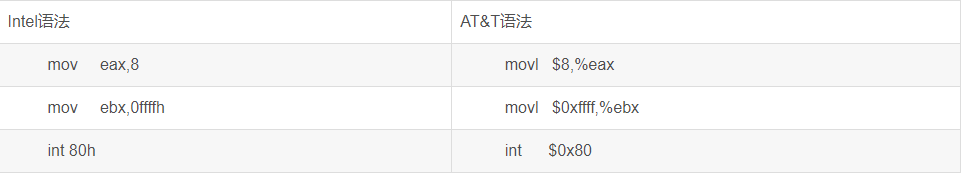

# x64

## 分类

+ intel（Windows）
+ AT&T（Macos）



## 基本知识

### 寄存器和内存

通常，CPU会将内存中的数据存储到寄存器中，然后再对寄存器的值进行计算。

## 寄存器

一个寄存器存储八字节，R开头的是64位的，占8字节，E开头的是32位的，占4字节

### 通用寄存器

#### RAX

#### RBX

#### RCX

#### RDX

## 指令集

### mov

```
mov dist,src //将src的内容赋值给dist类似于dist=src

[地址值]  //[]括号里面放的都是地址

word 是2字节 dword 是4字节（double word） qword是8字节（quard word）

int a=3;  //c++
mov dword ptr [1128h],3   //汇编代码，ptr指明单位的固定写法，3要4个字节存储，存到地址1128h中。

mov eax,dword ptr [1128h] //取出1128h地址对应的存储空间取出四个字节给eax寄存器
```

### call

```
call [函数地址] //调用函数，call 之前的push指令都是传参
```

### lea

```
lea dest ,[地址值]  //将地址值赋值给dest，类似于dest=地址值
lea eax,[1128h]  //将1128h地址值赋值给eax 等同于 move eax,1128h
```

### ret

```
//函数返回
```

### 运算指令

#### add

```
add op1,op2  //类似于op1=op1+op2
```

#### sub

```
sub op1,op2  //类似于op1=op1-op2
```

#### inc

```
inc op //自增，类似于op=op+1
```

#### dec

```
dec op //自减,类似于op=op-1
```

#### xor

```
xor op1,op2  //将op1和op2的异或的结果赋值给op1,类似于op1=op1^op2
```

### 比较指令

#### cmp

```
cmp eax,dword ptx [1128h]   //从1128h地址取出四个字节的值和eax寄存器内的值比较是否相等
```

### 跳转指令

#### jmp

```
jmp 内存地址  //跳转到这个内存地址的汇编代码开始执行,j开头的一般是跳转指令,大多数是带条件的跳转,一般和test,cmp等指令配合使用
```

#### jne

```
相当于 jump not equal  //比较结果不相等跳转
```

