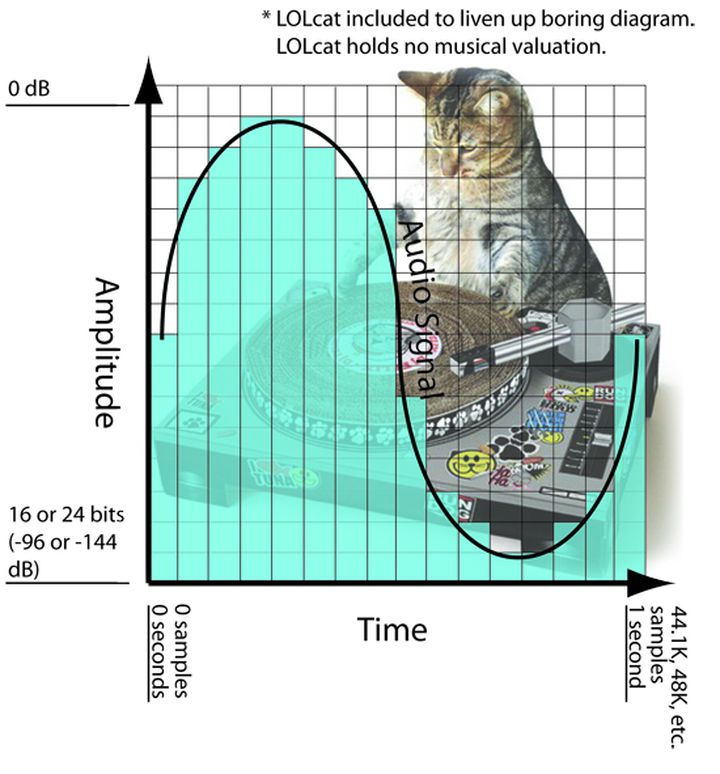

# 音频
## 声音
+ 振幅
  从平衡位置到最大位移位置之间的距离，叫做振幅（Amplitude）
+ 周期
  空气分子完全来回振动一次所花费的时间，叫做周期（Period），单位是秒（s）。
+ 频率
  物体每秒来回振动的次数，叫做频率（Frequency），也就是周期分之一。单位为秒分之一（1/s），也称为赫兹（Hz）、频率用来表示物体振动的快慢、
  人类的发声频率是85Hz ~ 1100Hz，人类只能听见20Hz ~ 20000Hz之间的声音。
  次声波（低于20Hz）
  超声波（高于20000Hz）

### 声音三要素

+ 音调（pitch）
  声音的高低（高音、低音），由“频率”（frequency）决定，频率越高音调越高（频率单位Hz（hertz），赫兹rl，人耳听觉范围20～20000Hz。20Hz以下称为次声波，20000Hz以上称为超声波）例如，低音端的声音或更高的声音，如细弦声。

+ 响度（loudness）
  人主观上感觉声音的大小（俗称音量），由“振幅”（amplitude）和人离声源的距离决定，振幅越大响度越大，人和声源的距离越小，响度越大。人对声音感受的响度不是一个常数，不同的人，不同的特定频率，在不同的声压级（单位：分贝）环境下所感受响度的量级有明显不同结果。（单位：方）

+ 音色（Timbre）
  又称音品，波形决定了声音的音色。声音因不同物体材料的特性而具有不同特性，音色本身是一种抽象的东西，但波形是把这个抽象直观的表现。音色不同，波形则不同。典型的音色波形有方波，锯齿波，正弦波，脉冲波等。不同的音色，通过波形，完全可以分辨的。

## 音频基本概念

将音频数字化的常见技术方案是脉冲编码调制（PCM，Pulse Code Modulation），主要过程是：采样 → 量化 → 编码。

### 采样

模拟信号的波形是无限光滑的，可以看成由无数个点组成，由于存储空间是相对有限的，数字编码过程中，必须要对波形的点进行采样。采样（Sampling）：每隔一段时间采集一次模拟信号的样本，是一个在时间上将模拟信号离散化（把连续信号转换成离散信号）的过程。

+ 采样率
  每秒采集的样本数量，称为采样率（采样频率，采样速率，Sampling Rate）。比如，采样率44.1kHz表示1秒钟采集44100个样本。
+ 采样定理
  根据[采样定理](https://zh.wikipedia.org/wiki/采样定理)（奈奎斯特–香农采样定理，Nyquist-Shannon sampling theorem）得知：只有当采样率高于声音信号最高频率的2倍时，才能把采集的声音信号唯一地还原成原来的声音。人耳能够感觉到的最高声音频率为20000Hz，因此为了满足人耳的听觉要求，需要至少每秒进行40000次采样（40kHz采样率）。这就是为什么常见的CD的采样率为44.1kHz。电话、无线对讲机、无线麦克风等的采样率是8kHZ。

### 量化

量化（Quantization）：将每一个采样点的样本值数字化。

+ 位深度
  位深度（采样精度，采样大小，Bit Depth）：使用多少个二进制位来存储一个采样点的样本值。位深度越高，表示的振幅越精确。常见的CD采用16bit的位深度，能表示65536（2的16次方）个不同的值。DVD使用24bit的位深度，大多数电话设备使用8bit的位深度。
  假设对一个波进行8次采样，采样点分别对应的能量值分别为A1-A8，但我们只使用2bit的采样大小，结果我们只能保留A1-A8中4个点的值而舍弃另外4个。如果我们进行3bit的采样大小，则刚好记录下8个点的所有信息。采样率和采样大小的值越大，记录的波形更接近原始信号。
  
  

### 编码

将采样和量化后的数字数据转成二进制码流。

### 其他概念

+ 声道（Channel）
  单声道产生一组声波数据，双声道（立体声）产生两组声波数据。

  ```
  采样率44.1kHZ、位深度16bit的1分钟立体声PCM数据有多大？
  采样率 * 位深度 * 声道数 * 时间
  44100 * 16 * 2 * 60 / 8 ≈ 10.34MB
  
  1分钟10.34MB，这对于大部分用户来说是不能接受的。要想在不改变音频时长的前提下，降低音频数据的大小，只有2种方法：降低采样指标、压缩。降低采样指标是不可取的，会导致音频质量下降，用户体验变差，因此专家们研发了各种压缩方案。
  ```

+ 比特率
  比特率（Bit Rate），指单位时间内传输或处理的比特数量，单位是：比特每秒（bit/s或bps），还有：千比特每秒（Kbit/s或Kbps）、兆比特每秒（Mbit/s或Mbps）、吉比特每秒（Gbit/s或Gbps）、太比特每秒（Tbit/s或Tbps）。

  ```
  采样率44.1kHZ、位深度16bit的立体声PCM数据的比特率是多少？
  采样率 * 位深度 * 声道数
  44100 * 16 * 2 = 1411.2Kbps
  
  通常，采样率、位深度越高，数字化音频的质量就越好。从比特率的计算公式可以看得出来：比特率越高，数字化音频的质量就越好。
  ```

+ 信噪比
  信噪比（Signal-to-noise ratio，SNR，S/N，讯噪比），指信号与噪声的比例，用于比较所需信号的强度与背景噪声的强度，以分贝（dB）为单位。位深度限制了信噪比的最大值。

  ```
  位深度
  4	   24.08
  8	   48.16
  11	   66.22
  12	   72.24
  16	   96.33
  18	   108.37
  20	   120.41
  24	   144.49
  32	   192.66
  48	   288.99
  64	   385.32
  ```

## 编码与解码

### 编码（Encode）

PCM数据可以理解为是：未经压缩的原始音频数据，体积比较大，为了更便于存储和传输，一般都会使用某种音频编码对它进行编码压缩，然后再存成某种音频文件格式。


### 解码（Decode）

当需要播放音频时，得先解码（解压缩）出PCM数据，然后再进行播放。


压缩分为无损压缩和有损压缩。

- 无损

  压缩

  - 解压后可以完全还原出原始数据
  - 压缩比小，体积大

- 有损

  压缩

  - 解压后不能完全还原出原始数据，会丢失一部分信息
  - 压缩比大，体积小
  - 压缩比越大，丢失的信息就越多，还原后的信号失真就会越大
  - 一般是通过舍弃原始数据中对人类听觉不重要的部分，达成压缩成较小文件的目的

- 压缩比 = 未压缩大小 / 压缩后大小

## 音频编码

```
//无损
Monkey's Audio
Monkey's Audio，是一种无损的音频编码和文件格式，文件扩展名为.ape，压缩率一般在55%左右。

FLAC
FLAC（Free Lossless Audio Codec），是一种无损的音频编码和文件格式，文件扩展名为.flac。虽然压缩率稍有不及Monkey's Audio，但FLAC技术更先进，占用资源更低，有更多的平台及硬件产品支持FLAC。

ALAC
ALAC（Apple Lossless Audio Codec），是由Apple开发的一种无损的音频编码，文件扩展名为.m4a、.caf。

//有损
MP3
MP3（MPEG Audio Layer III），是非常流行的一种有损音频编码和文件格式，文件扩展名为.mp3。

第1版是：MPEG-1 Audio Layer III，属于国际标准ISO/IEC 11172-3
第2版是：MPEG-2 Audio Layer III，属于国际标准ISO/IEC 13818-3
第3版是：MPEG-2.5 Audio Layer III，并不是由MPEG官方开发的，不是公认的标准

WMA
WMA（Windows Media Audio），是由Microsoft开发的音频编码和文件格式，文件扩展名为.wma。包括4种类型：
WMA：原始的WMA编解码器，作为MP3的竞争者，属于有损音频编码
WMA Pro：支持更多声道和更高质量的音频，属于有损音频编码
WMA Lossless：属于无损音频编码
WMA Voice：属于有损音频编码

AAC
AAC（Advanced Audio Coding），是由Fraunhofer IIS、杜比实验室、AT&T、Sony、Nokia等公司共同开发的有损音频编码和文件格式，压缩比通常为18:1。
AAC被设计为MP3格式的后继产品，通常在相同的比特率下可以获得比MP3更高的声音质量，是iPhone、iPod、iPad、iTunes的标准音频格式。
AAC编码的文件扩展名主要有3种：
.acc：传统的AAC编码，使用MPEG-2 Audio Transport Stream（ADTS）容器
.mp4：使用了MPEG-4 Part 14的简化版即3GPP Media Release 6 Basic（3gp6）进行封装的AAC编码
.m4a：为了区别纯音频MP4文件和包含视频的MP4文件而由Apple公司使用的扩展名
Apple iTunes对纯音频MP4文件采用了.m4a文件扩展名
M4A的本质和音频MP4相同，故音频MP4文件可以直接更改文件扩展名为.m4a

Vorbis
Vorbis，是由Xiph.Org基金会开发的一种有损音频编码。通常以Ogg作为容器格式，所以常合称为Ogg Vorbis，文件扩展名为.ogg。

Speex
Speex，是由Xiph.Org基金会开发的一种有损音频编码和文件格式，文件扩展名为.spx。

Opus
Opus，是由Xiph.Org基金会开发的一种有损音频编码和文件格式，文件扩展名为.opus。用以取代Vorbis和Speedx。经过多次盲听测试，在任何给定的比特率下都比其他标准音频格式具有更高的质量，包括MP3、AAC
```

## 音频格式

+ Ogg
  Ogg是一种多媒体文件格式，由Xiph.Org基金会所维护，可以纳入各式各样的音视频编码（音频、视频都可以），文件扩展名常为.ogg。

+ WAV
  WAV（Waveform Audio File Format），是由IBM和Microsoft开发的音频文件格式，扩展名是.wav，通常采用PCM编码，常用于Windows系统中。

  [WAV的文件格式](http://soundfile.sapp.org/doc/WaveFormat/)如下图所示，前面有44个字节的文件头，紧跟在后面的就是音频数据（比如PCM数据）。

  ```
  NumChannels：声道数
  SampleRate：采样率（Hz）
  ByteRate：每秒多少个字节（Byte/s）
  BitsPerSample：位深度
  ```

+ AIFF
  AIFF（Audio Interchange File Format），由Apple开发的音频文件格式，扩展名是.aiff、.aif。跟WAV一样，通常采用PCM编码，常用于Mac系统中。
