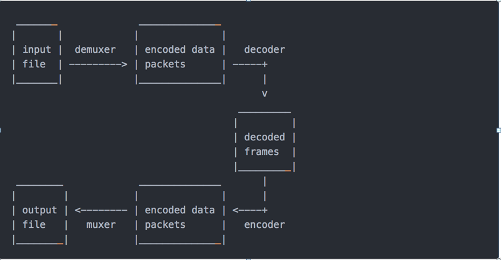

# FFmpeg

## 基本知识

### 源码目录

+ libavcodec：提供了一系列编码器的实现。

+ libavformat：实现在流协议，容器格式及其本IO访问。

+ libavutil：包括了hash器，解码器和各利工具函数。

+ libavfilter：提供了各种音视频过滤器。

+ libavdevice：提供了访问捕获设备和回放设备的接口。

+ libswresample：实现了混音和重采样。

+ libswscale：实现了色彩转换和缩放工能。

### 编解码流程



然后将编码的数据包传送给解码器（除非为数据流选择了流拷贝，请参阅进一步描述）。解码器产生未压缩的帧（原始视频/ PCM音频/ ...），可以通过滤波进一步处理（见下一节）。在过滤之后，帧被传递到编码器，编码器并输出编码的数据包。最后，这些传递给复用器，将编码的数据包写入输出文件。

默认情况下，ffmpeg只包含输入文件中每种类型（视频，音频，字幕）的一个流，并将其添加到每个输出文件中。它根据以下标准挑选每一个的“最佳”：对于视频，它是具有最高分辨率的流，对于音频，它是具有最多channel的流，对于字幕，是第一个字幕流。在相同类型的几个流相等的情况下，选择具有最低索引的流。

您可以通过使用-vn / -an / -sn / -dn选项来禁用某些默认设置。要进行全面的手动控制，请使用-map选项，该选项禁用刚描述的默认设置。

## 编译

```
//拉取源代码
git clone https://git.ffmpeg.org/ffmpeg.git
```

+ [官网各平台编译方法](https://www.ffmpeg.org/platform.html)
+ [官网下载地址](https://ffmpeg.org/download.html)

### Windows

#### msys2编译

1. 下载安装[msys2](https://www.msys2.org/)

   msys2是一个在windows上模拟linux环境的软件，在msys2上可以使用大多数的shell命令

2. 安装之后，进入安装目录，打开msys2_shell.cmd，当前终端中安装gcc和yasm

3. 安装gcc和yasm命令

   ```
   //安装yasm
   pacman -S make yasm diffutils pkg-config
   
   //安装gcc
   32位：pacman -S mingw-w64-i686-gcc
   64位：pacman -S mingw-w64-x86_64-gcc
   ```

4. 编译

   ```
   1、在dos下面进入mysys2终端
   msys2_shell.cmd -mingw32  //进入32位编译的终端
   msys2_shell.cmd -mingw64  //进入64位编译的终端
   
   2、在mysys2终端切到当前ffmpeg目录下,执行
   /**
   --enable-shared 编译动态库
   --enable-static 编译静态库
   --arch=x86_32 编译的平台,x86_64指64位
   --prefix=/usr/local/ffmpeg 编译输出的位置
   **/
   ./configure --enable-shared --enable-static --arch=x86_32 --prefix=/usr/local/ffmpeg 
   
   3、make
   //等待时间较长
   4、make install
   //等待时间较长
   ```

5. 使用

   由于用msys2生成的库有依赖，比如生成的32位库依赖于msys64\mingw32\bin下的dll库，所以我们将msys64\mingw32\bin下的所有dll都拷贝到msys64\usr\local\ffmpeg\bin下。这样我们就能使用生成的ffmpeg.exe和库了。

6. 参考文章

   + [msys2编译FFmpeg全网最详细步骤](https://www.codenong.com/cs106431994/)

### Android

#### mac下编译

+ [在mac上 使用ndk r21b 编译 ffmpeg 4.3.1 的so](https://gist.github.com/CaiJingLong/feefa3b63e5b94f5ad1807825861e0e0)

#### windows下编译

```shell
1、下载安装msys2，安装依赖pacman -S make yasm diffutils pkg-config
2、编写脚本，放在ffmepg目录下
android_build.sh如下

#!/bin/bash

#set temp path
export TMPDIR=`dirname $0`/tmpdir

#set ffmpeg source path
export SRC_PATH=E:/project/ffmpeg

#set ndk path
#NDK=E:/tools/Android/SDK/android-ndk-r21d
NDK=E:/tools/Android/SDK/ndk/21.3.6528147
#set api version
API=29
# arm aarch64 i686 x86_64
#ARCH=aarch64

#linux-x86_64 windows-x86_64
#host is windows 64 bit
HOST_TAG=windows-x86_64

TOOLCHAIN=$NDK/toolchains/llvm/prebuilt/$HOST_TAG/bin
SYSROOT=$NDK/sysroot


CFLAG="-D__ANDROID_API__=$API -U_FILE_OFFSET_BITS -DBIONIC_IOCTL_NO_SIGNEDNESS_OVERLOAD -Os -fPIC -DANDROID -D__thumb__ -mthumb -Wfatal-errors -Wno-deprecated -mfloat-abi=softfp -marm"

#create tmep directory
mkdir -p $TMPDIR

#support configure armeabi-v7a and arm64-v8a
configure()
{
    echo "NDK = $NDK"
    #get the parameter
    TARGET_CPU=$1
    mkdir -p `dirname $0`/Android/$TARGET_CPU
    if [ "$TARGET_CPU" == "armeabi-v7a" ];then
        echo "build 32bit lib"
        ARCH=arm
        TARGET=armv7a-linux-androideabi
        CROSS_PREFIX=$TOOLCHAIN/arm-linux-androideabi-
        CC=$TOOLCHAIN/$TARGET$API-clang
        CXX=$TOOLCHAIN/$TARGET$API-clang++
        #translate the cpu string
        CPU="armv7-a"
    else
        echo "build 64bit lib"
        ARCH=aarch64
        TARGET=aarch64-linux-android
        CROSS_PREFIX=$TOOLCHAIN/aarch64-linux-android-
        CC=$TOOLCHAIN/$TARGET$API-clang
        CXX=$TOOLCHAIN/$TARGET$API-clang++
        #translate the cpu string
        CPU="armv8-a"
    fi
    PREFIX=`dirname $0`/Android/$TARGET_CPU
    echo "try configure $TARGET_CPU and prefix is $PREFIX"
    ./configure \
    --ln_s="cp -rf" \
    --prefix=$PREFIX \
    --cc=$CC \
    --cxx=$CXX \
    --ld=$CC \
    --target-os=android \
    --arch=$ARCH \
    --cpu=$CPU \
    --cross-prefix=$CROSS_PREFIX \
    --disable-x86asm \
    --disable-asm \
    --enable-cross-compile \
    --enable-shared \
    --disable-static \
    --enable-runtime-cpudetect \
    --disable-doc \
    --disable-ffmpeg \
    --disable-ffplay \
    --disable-ffprobe \
    --disable-symver \
    --enable-small \
    --enable-gpl --enable-nonfree --enable-version3 --disable-iconv \
    --enable-jni \
    --enable-mediacodec \
    --disable-decoders --enable-decoder=vp9 --enable-decoder=h264 --enable-decoder=mpeg4 --enable-decoder=aac \
    --disable-encoders --enable-encoder=vp9_vaapi --enable-encoder=h264_nvenc --enable-encoder=h264_v4l2m2m --enable-encoder=hevc_nvenc \
    --disable-demuxers --enable-demuxer=rtsp --enable-demuxer=rtp --enable-demuxer=flv --enable-demuxer=h264 \
    --disable-muxers --enable-muxer=rtsp --enable-muxer=rtp --enable-muxer=flv --enable-muxer=h264 \
    --disable-parsers --enable-parser=mpeg4video --enable-parser=aac --enable-parser=h264 --enable-parser=vp9 \
    --disable-protocols --enable-protocol=rtmp --enable-protocol=rtp --enable-protocol=tcp --enable-protocol=udp \
    --disable-bsfs \
    --disable-indevs --enable-indev=v4l2 \
    --disable-outdevs \
    --disable-filters \
    --disable-postproc \
    --extra-cflags="$CFLAG" \
    --extra-ldflags="-marm"
}

build_one()
{
    TARGET_CPU=$1
    echo "configure $TARGET_CPU"
    configure $TARGET_CPU
    echo "build $TARGET_CPU"
    #need to call make clean if you want to build for more than one target
    make clean
    make -j32
    echo "build $TARGET_CPU done"
    make install
    echo "install $TARGET_CPU done"
}

#the entry
build_all()
{
    build_one armeabi-v7a
    build_one arm64-v8a
}

#call the entry
build_all
```

+ 参考文章
  - [Window7 64bit上为Android NDK配置FFmpeg4.3.1编译 - MSYS2](https://blog.csdn.net/free555/article/details/107576760)
  - [Compile the latest version of FFmpeg under windows system](https://www.programmersought.com/article/25194845340/)

## 命令

### 基本命令查询

```
-version	显示版本。
-formats	显示可用的格式（包括设备）。
-demuxers	显示可用的demuxers。
-muxers	显示可用的muxers。
-devices	显示可用的设备。
-codecs	显示libavcodec已知的所有编解码器。
-decoders	显示可用的解码器。
-encoders	显示所有可用的编码器。
-bsfs	显示可用的比特流filter。
-protocols	显示可用的协议。
-filters	显示可用的libavfilter过滤器。
-pix_fmts	显示可用的像素格式。
-sample_fmts	显示可用的采样格式。
-layouts	显示channel名称和标准channel布局。
-colors	显示识别的颜色名称。

//ffmpeg通过 -i选项读取输任意数量的输入“文件”（可以是常规文件，管道，网络流，抓取设备等，并写入任意数量的输出“文件”
ffmpeg [global_options] {[input_file_options] -i input_url} ...
                         {[output_file_options] output_url} ...

//处理音视频常用参数
-f fmt（输入/输出）	强制输入或输出文件格式。格式通常是自动检测输入文件，并从输出文件的文件扩展名中猜测出来，所以在大多数情况下这个选项是不需要的。
-i url（输入）	输入文件的网址
-y（全局参数）	覆盖输出文件而不询问。
-n（全局参数）	不要覆盖输出文件，如果指定的输出文件已经存在，请立即退出。
-c [：stream_specifier] codec（输入/输出，每个流）	选择一个编码器（当在输出文件之前使用）或解码器（当在输入文件之前使用时）用于一个或多个流。codec 是解码器/编码器的名称或 copy（仅输出）以指示该流不被重新编码。如：ffmpeg -i INPUT -map 0 -c:v libx264 -c:a copy OUTPUT
-codec [：stream_specifier]编解码器（输入/输出，每个流）	同 -c
-t duration（输入/输出）	当用作输入选项（在-i之前）时，限制从输入文件读取的数据的持续时间。当用作输出选项时（在输出url之前），在持续时间到达持续时间之后停止输出。
-ss位置（输入/输出）	当用作输入选项时（在-i之前），在这个输入文件中寻找位置。请注意，在大多数格式中，不可能精确搜索，因此ffmpeg将在位置之前寻找最近的搜索点。当转码和-accurate_seek被启用时（默认），搜索点和位置之间的这个额外的分段将被解码和丢弃。当进行流式复制或使用-noaccurate_seek时，它将被保留。当用作输出选项（在输出url之前）时，解码但丢弃输入，直到时间戳到达位置。
-frames [：stream_specifier] framecount（output，per-stream）	停止在帧计数帧之后写入流。
-filter [：stream_specifier] filtergraph（output，per-stream）	创建由filtergraph指定的过滤器图，并使用它来过滤流。filtergraph是应用于流的filtergraph的描述，并且必须具有相同类型的流的单个输入和单个输出。在过滤器图形中，输入与标签中的标签相关联，标签中的输出与标签相关联。有关filtergraph语法的更多信息，请参阅ffmpeg-filters手册。

//视频参数
-vframesnum（输出）	设置要输出的视频帧的数量。对于-frames：v，这是一个过时的别名，您应该使用它。
-r [：stream_specifier] fps（输入/输出，每个流）	设置帧率（Hz值，分数或缩写）。作为输入选项，忽略存储在文件中的任何时间戳，根据速率生成新的时间戳。这与用于-framerate选项不同（它在FFmpeg的旧版本中使用的是相同的）。如果有疑问，请使用-framerate而不是输入选项-r。作为输出选项，复制或丢弃输入帧以实现恒定输出帧频fps。
-s [：stream_specifier]大小（输入/输出，每个流）	设置窗口大小。作为输入选项，这是video_size专用选项的快捷方式，由某些分帧器识别，其帧尺寸未被存储在文件中。作为输出选项，这会将缩放视频过滤器插入到相应过滤器图形的末尾。请直接使用比例过滤器将其插入到开头或其他地方。格式是'wxh'（默认 - 与源相同）。
-aspect [：stream_specifier] 宽高比（输出，每个流）	设置方面指定的视频显示宽高比。aspect可以是浮点数字符串，也可以是num：den形式的字符串，其中num和den是宽高比的分子和分母。例如“4：3”，“16：9”，“1.3333”和“1.7777”是有效的参数值。如果与-vcodec副本一起使用，则会影响存储在容器级别的宽高比，但不会影响存储在编码帧中的宽高比（如果存在）。
-vn（输出）	禁用视频录制。
-vcodec编解码器（输出）	设置视频编解码器。这是-codec：v的别名。
-vffiltergraph（输出）	创建由filtergraph指定的过滤器图，并使用它来过滤流。

//音频参数
-aframes（输出）	设置要输出的音频帧的数量。这是-frames：a的一个过时的别名。
-ar [：stream_specifier] freq（输入/输出，每个流）	设置音频采样频率。对于输出流，它默认设置为相应输入流的频率。对于输入流，此选项仅适用于音频捕获设备和原始分路器，并映射到相应的分路器选件。
-ac [：stream_specifier]通道（输入/输出，每个流）	设置音频通道的数量。对于输出流，它默认设置为输入音频通道的数量。对于输入流，此选项仅适用于音频捕获设备和原始分路器，并映射到相应的分路器选件。
-an（输出）	禁用录音。
-acodec编解码器（输入/输出）	设置音频编解码器。这是-codec的别名：a。
-sample_fmt [：stream_specifier] sample_fmt（输出，每个流）	设置音频采样格式。使用-sample_fmts获取支持的样本格式列表。
-affiltergraph（输出）	创建由filtergraph指定的过滤器图，并使用它来过滤流。
```

### 录屏

```
mac：
ffmpeg -f avfoundation -list_devices true -i "" //查看一下 mac 上都有哪些设备

//f 指定使用avfoundation采集数据。
//-i指定从哪儿采集数据，它是一个文件索引号。在我的MAC上，1代表桌面（可以通过上面的命令查询设备索引号）。
//-r 指定帧率。按ffmpeg官方文档说-r与-framerate作用相同，但实际测试时发现不同。-framerate 用于限制输入，而-r用于限制输出。
ffmpeg -f avfoundation -i 1 -r 30 out.yuv //录屏

//-i 1:0 冒号前面的 "1" 代表的屏幕索引号。冒号后面的"0"代表的声音索相号。
//-c:v与参数 -vcodec一样，表示视频编码器。c 是 codec 的缩写，v 是video的缩写。
//-crf是 x264 的参数。 0 表式无损压缩。
//-c:a与参数 -acodec一样，表示音频编码器。
//-profile 是fdk_aac的参数。 aac_he_v2 表式使用 AAC_HE v2 压缩数据。
//-b:a指定音频码率。 b 是 bitrate的缩写, a是 audio的缩与。
ffmpeg -f avfoundation -i 1:0 -r 29.97 -c:v libx264 -crf 0 -c:a libfdk_aac -profile:aaac_he_v2 -b:a 32 kout.flv  //录屏+声音

//-framerate 限制视频的采集帧率。这个必须要根据提示要求进行设置，如果不设置就会报错。
//-f 指定使用avfoundation采集数据。
//-i指定视频设备的索引号。
fmpeg -framerate 30 -f avfoundation -i 0 out.mp4 //录视频

ffmpeg -framerate 30 -f avfoundation-i 0:0 out.mp4 //视频+音频

ffmpeg -f avfoundation -i :0 out.wav //录音

ffmpeg -f avfoundation -i :0 -ar 44100 -fs16le out.pcm //录制音频裸数据

windows:
必须安装 screen capture recorder(https://sourceforge.net/projects/screencapturer/files/)否则不能正确录音

ffmpeg -list_devices true -f dshow -i dummy  //查看以下 windows 都有哪些设备

ffmpeg -f dshow -i audio="virtual-audio-capturer" -acodec libmp3lame window.mp3  //只录制音频
//只录制视频
ffmpeg -f dshow -i video="screen-capture-recorder" -r 5 -vcodec libx264 -preset:v ultrafast -tune:v zerolatency out.mp4
```

### 分解和复用

```
//acodec: 指定音频编码器，copy 指明只拷贝，不做编解码。vn: v 代表视频，n 代表 no 也就是无视频的意思
ffmpeg -i input.mp4 -acodec copy -vn out.aac //从mp4文件中只抽取acc音频

//vcodec: 指定视频编码器，copy 指明只拷贝，不做编解码。an: a 代表视频，n 代表 no 也就是无音频的意思。
ffmpeg -i input.mp4 -vcodec copy -an out.h264 //从mp4文件中只抽取h264的视频

//是音频、视频都直接 copy，只是将 mp4 的封装格式转成了flv
ffmpeg -iout.mp4 -vcodec copy -acodec copy out.flv  //将mp4格式转换位flv格式

//音视频合并
ffmpeg -i out.h264 -i out.aac -vcodec copy -acode ccopy out.mp4 //将h264视频和aac音频合并成mp4
```

### 处理原始数据

```
//-c:v rawvideo 指定将视频转成原始数据（转换编码方式）  -pixel_format yuv420p 指定转换格式为yuv420p像素格式
ffmpeg -i input.mp4 -an -c:v rawvideo -pixel_format yuv420p out.yuv //提取原始yuv数据
ffplay -s wxh out.yuv  //必须填写长*宽,w代表长,h代表宽  

//YUV转H264  
ffmpeg -f rawvideo -pix_fmt yuv420p -s 320x240 -r 30 -i out.yuv -c:v libx264 -f rawvideo out.h264

//ar 采样率 ac 采样声道（2表示双声道） f：抽取的pcm的数据格式
//s16le 有符号的16进制小端
ffmpeg -i out.mp4 -vn -ar 44100 -ac 2 -f s16le out.pcm
ffplay -ar 44100 -ac 2 -f s16le -i out.pcm //播放音频,需要和抽取的格式参数一样

//PCM转WAV
ffmpeg -f s16be -ar 8000 -ac 2 -acodec pcm_s16be -i input.raw out put.wav
```

### 音视频裁剪

```
//-ss指定裁剪的开始时间，精确到秒
//-t 被裁剪后的时长。
ffmpeg -i out.mp4 -ss 00:00:00 -t 10 out 1.mp4 //裁剪从开始持续10秒的视频

//视频拼接
首先创建一个 inputs.txt 文件，文件内容如下：
file '1.flv'
file '2.flv'
file '3.flv'
//concat 拼接
ffmpeg -f concat -i inputs.txt -ccopy output.flv //执行命令合并

//-strict -2 指明音频使有AAC。
//-f hls转成 m3u8 格式。
ffmpeg -i out.mp4 -c:v libx264 -c:a libfdk_aac -strict -2 -f hls out.m3u8 //hls切片

//-i : 指定输入文件
//-r : 帧数 1
//-f : 指定格式化的格式为image2
ffmpeg -i test.flv -r 1 -f image2 image-%3d.jpeg //视频转图片

ffmpeg -i out.mp4 -ss 00:00:00 -t 10 out.gif  //视频转gif

ffmpeg -f image2 -i image-%3d.jpeg images.mp4 //图片转视频
```

### 直播

```
// -re 帧率放慢 -c 音视频编解码 -f 指定文件格式
ffmpeg -re -i out.mp4 -c copy -f flv rtmp://server/live/streamName  //直播推流

ffmpeg -i rtmp://server/live/streamName -c copy dump.flv //直播拉流保存

ffmpeg -i rtmp://server/live/originalStream -c:a copy -c:v copy -f flv rtmp://server/live/h264Stream //转流

ffmpeg -framerate 15 -f avfoundation -i "1" -s 1280x720 -c:v libx264  -f  flv rtmp://localhost:1935/live/room //实时推流
```

