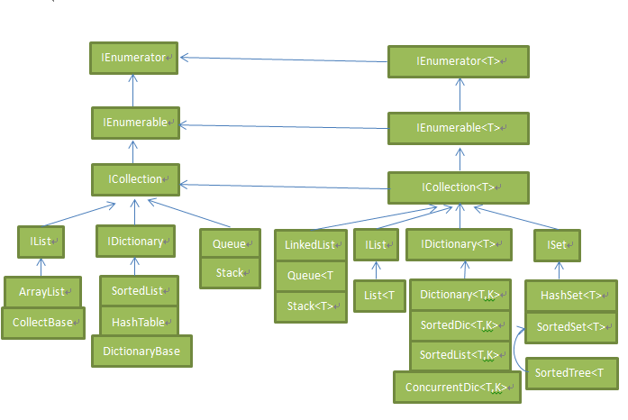
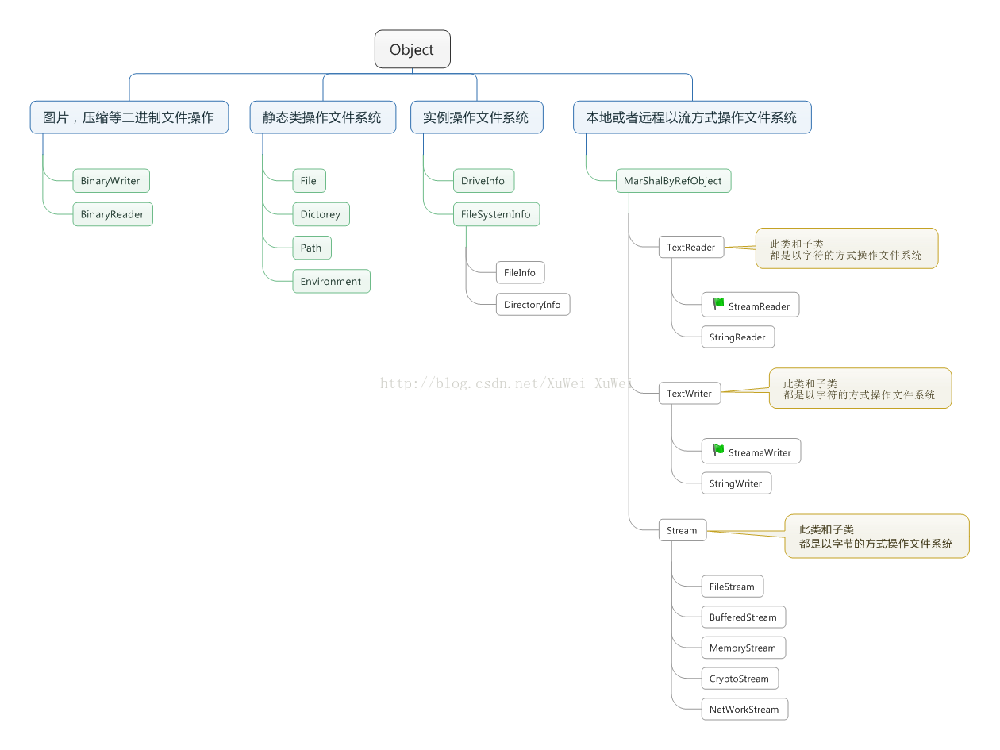

# 基础

## 输出

```c#
Console.WriteLine()   //输出
```

## const和static关键字

```c#
/**
C#中的static 和Java中的static
简单，两者用法完全是一致的。从两方面讨论：
1. 变量是属于类的，不是实例级别的。只能通过类名调用，不能通过实例调用。
2. 如果在定义时就赋值了，那么在类初始化的时候，最先完成所有静态变量的赋值。但是要注意，所有静态变量的初始化顺序是无法确定的。

C# 中的const 和Java中的finnal
很长一段时间我一直认为两者是相同的作用，无非是变量初始化后不能更改，即只能在定义时或者构造函数中赋值。然而这仅仅只是片面的，下面将为大家详细分析：
1.修饰变量
准确的说C#中的const 等价于 Java中的static final，也就是说，Java中final不具有static的功能。而C#中的const具有static的功能。因此在C#中 public static const string 等将于 public const string。
2.修饰类和方法
此时Java中的final类似C#中的sealed，就是说，final修饰的类不能被继承，final修饰的方法不能被覆盖。
而C#中的const不能修饰类和方法。
**/
```

# 数据类型

## 整型

| 类型    | 描述                                 | 范围                                                    | 默认值 |
| ------- | ------------------------------------ | ------------------------------------------------------- | ------ |
| decimal | 128 位精确的十进制值，28-29 有效位数 | (-7.9 x 1028 到 7.9 x 1028) / 100 到 28                 | 0.0M   |
| int     | 32 位有符号整数类型                  | -2,147,483,648 到 2,147,483,647                         | 0      |
| long    | 64 位有符号整数类型                  | -9,223,372,036,854,775,808 到 9,223,372,036,854,775,807 | 0L     |
| sbyte   | 8 位有符号整数类型                   | -128 到 127                                             | 0      |
| short   | 16 位有符号整数类型                  | -32,768 到 32,767                                       | 0      |
| uint    | 32 位无符号整数类型                  | 0 到 4,294,967,295                                      | 0      |
| ulong   | 64 位无符号整数类型                  | 0 到 18,446,744,073,709,551,615                         | 0      |
| ushort  | 16 位无符号整数类型                  | 0 到 65,535                                             | 0      |

## 浮点型

| 类型   | 描述              | 范围                                  | 默认值 |
| ------ | ----------------- | ------------------------------------- | ------ |
| double | 64 位双精度浮点型 | (+/-)5.0 x 10-324 到 (+/-)1.7 x 10308 | 0.0D   |
| float  | 32 位单精度浮点型 | -3.4 x 1038 到 + 3.4 x 1038           | 0.0F   |

## 布尔型

```c#
//bool	默认为False
```

## 字符型

```c#
//char	16 位 Unicode 字符	U +0000 到 U +ffff	默认为'\0'
```

## 字符串

```c#
//可以使用string或者String来修饰变量表示字符串
```

### 相关方法

```c#
/**
1	public static int Compare( string strA, string strB )
比较两个指定的 string 对象，并返回一个表示它们在排列顺序中相对位置的整数。该方法区分大小写。
2	public static int Compare( string strA, string strB, bool ignoreCase )
比较两个指定的 string 对象，并返回一个表示它们在排列顺序中相对位置的整数。但是，如果布尔参数为真时，该方法不区分大小写。
3	public static string Concat( string str0, string str1 )
连接两个 string 对象。
4	public static string Concat( string str0, string str1, string str2 )
连接三个 string 对象。
5	public static string Concat( string str0, string str1, string str2, string str3 )
连接四个 string 对象。
6	public bool Contains( string value )
返回一个表示指定 string 对象是否出现在字符串中的值。
7	public static string Copy( string str )
创建一个与指定字符串具有相同值的新的 String 对象。
8	public void CopyTo( int sourceIndex, char[] destination, int destinationIndex, int count )
从 string 对象的指定位置开始复制指定数量的字符到 Unicode 字符数组中的指定位置。
9	public bool EndsWith( string value )
判断 string 对象的结尾是否匹配指定的字符串。
10	public bool Equals( string value )
判断当前的 string 对象是否与指定的 string 对象具有相同的值。
11	public static bool Equals( string a, string b )
判断两个指定的 string 对象是否具有相同的值。
12	public static string Format( string format, Object arg0 )
把指定字符串中一个或多个格式项替换为指定对象的字符串表示形式。
13	public int IndexOf( char value )
返回指定 Unicode 字符在当前字符串中第一次出现的索引，索引从 0 开始。
14	public int IndexOf( string value )
返回指定字符串在该实例中第一次出现的索引，索引从 0 开始。
15	public int IndexOf( char value, int startIndex )
返回指定 Unicode 字符从该字符串中指定字符位置开始搜索第一次出现的索引，索引从 0 开始。
16	public int IndexOf( string value, int startIndex )
返回指定字符串从该实例中指定字符位置开始搜索第一次出现的索引，索引从 0 开始。
17	public int IndexOfAny( char[] anyOf )
返回某一个指定的 Unicode 字符数组中任意字符在该实例中第一次出现的索引，索引从 0 开始。
18	public int IndexOfAny( char[] anyOf, int startIndex )
返回某一个指定的 Unicode 字符数组中任意字符从该实例中指定字符位置开始搜索第一次出现的索引，索引从 0 开始。
19	public string Insert( int startIndex, string value )
返回一个新的字符串，其中，指定的字符串被插入在当前 string 对象的指定索引位置。
20	public static bool IsNullOrEmpty( string value )
指示指定的字符串是否为 null 或者是否为一个空的字符串。
21	public static string Join( string separator, string[] value )
连接一个字符串数组中的所有元素，使用指定的分隔符分隔每个元素。
22	public static string Join( string separator, string[] value, int startIndex, int count )
连接接一个字符串数组中的指定位置开始的指定元素，使用指定的分隔符分隔每个元素。
23	public int LastIndexOf( char value )
返回指定 Unicode 字符在当前 string 对象中最后一次出现的索引位置，索引从 0 开始。
24	public int LastIndexOf( string value )
返回指定字符串在当前 string 对象中最后一次出现的索引位置，索引从 0 开始。
25	public string Remove( int startIndex )
移除当前实例中的所有字符，从指定位置开始，一直到最后一个位置为止，并返回字符串。
26	public string Remove( int startIndex, int count )
从当前字符串的指定位置开始移除指定数量的字符，并返回字符串。
27	public string Replace( char oldChar, char newChar )
把当前 string 对象中，所有指定的 Unicode 字符替换为另一个指定的 Unicode 字符，并返回新的字符串。
28	public string Replace( string oldValue, string newValue )
把当前 string 对象中，所有指定的字符串替换为另一个指定的字符串，并返回新的字符串。
29	public string[] Split( params char[] separator )
返回一个字符串数组，包含当前的 string 对象中的子字符串，子字符串是使用指定的 Unicode 字符数组中的元素进行分隔的。
30	public string[] Split( char[] separator, int count )
返回一个字符串数组，包含当前的 string 对象中的子字符串，子字符串是使用指定的 Unicode 字符数组中的元素进行分隔的。int 参数指定要返回的子字符串的最大数目。
31	public bool StartsWith( string value )
判断字符串实例的开头是否匹配指定的字符串。
32	public char[] ToCharArray()
返回一个带有当前 string 对象中所有字符的 Unicode 字符数组。
33	public char[] ToCharArray( int startIndex, int length )
返回一个带有当前 string 对象中所有字符的 Unicode 字符数组，从指定的索引开始，直到指定的长度为止。
34	public string ToLower()
把字符串转换为小写并返回。
35	public string ToUpper()
把字符串转换为大写并返回。
36	public string Trim()
移除当前 String 对象中的所有前导空白字符和后置空白字符
**/
```

## 类型转换

```c#
/**
以转换为double类型举例,其他类型类似
Convert.ToDouble 与 Double.Parse 的区别。实际上 Convert.ToDouble 与 Double.Parse 较为类似，实际上 Convert.ToDouble内部调用了 Double.Parse：
(1)对于参数为null的时候：
 Convert.ToDouble参数为 null 时，返回 0.0；
 Double.Parse 参数为 null 时，抛出异常。
(2)对于参数为""的时候：
 Convert.ToDouble参数为 "" 时，抛出异常；
 Double.Parse 参数为 "" 时，抛出异常。
(3)其它区别：
 Convert.ToDouble可以转换的类型较多；
 Double.Parse 只能转换数字类型的字符串。
 Double.TryParse 与 Double.Parse 又较为类似，但它不会产生异常，转换成功返回 true，转换失败返回 false。最后一个参数为输出值，如果转换失败，输出值为 0.0。
**/
```

## 结构体

```c#
//定义结构体
struct Books
{
   public string title;
   public string author;
   public string subject;
   public int book_id;
}; 
//调用结构体
Books book；
book.title="标题"；
```

### 特点

+ C# 中的结构与传统的 C 或 C++ 中的结构不同。

+ 结构可带有方法、字段、索引、属性、运算符方法和事件。

+ 结构可定义构造函数，但不能定义析构函数。但是，您不能为结构定义默认的构造函数。默认的构造函数是自动定义的，且不能被改变。

+ 与类不同，结构不能继承其他的结构或类。

+ 结构不能作为其他结构或类的基础结构。

+ 结构可实现一个或多个接口。

+ 结构成员不能指定为 abstract、virtual 或 protected。

+ 当您使用 New 操作符创建一个结构对象时，会调用适当的构造函数来创建结构。与类不同，结构可以不使用 New 操作符即可被实例化。

+ 如果不使用 New 操作符，只有在所有的字段都被初始化之后，字段才被赋值，对象才被使用。

### 结构和类的适用场合分析

+ 当堆栈的空间很有限，且有大量的逻辑对象时，创建类要比创建结构好一些；

+ 对于点、矩形和颜色这样的轻量对象，假如要声明一个含有许多个颜色对象的数组，则CLR需要为每个对象分配内存，在这种情况下，使用结构的成本较低；

+ 在表现抽象和多级别的对象层次时，类是最好的选择，因为结构不支持继承。

+ 大多数情况下，目标类型只是含有一些数据，或者以数据为主。

## 枚举

```c#
//使用enum关键字
//定义和调用
//枚举列表中的每个符号代表一个整数值，一个比它前面的符号大的整数值。默认情况下，第一个枚举符号的值是 0
//定义：
 enum Days { Sun, Mon, tue, Wed, thu, Fri, Sat };
//调用
int WeekdayStart = (int)Days.Mon;    //返回1
```

## 引用类型

### 对象类型

+ （基类为System.Object类）

### 动态类型

+ var是C# 3中引入的，其实它仅仅只是一个语法糖. 
+ var本身并不是一种类型, 其它两者object和dynamic是类型。
+ var声明的变量在赋值的那一刻，就已经决定了它是什么类型。

+ object之所以能够被赋值为任意类型的原因，其实都知道，因为所有的类型都派生自object. 所以它可以赋值为任何类型

+ dynamic是C# 4引入的新类型，它的特点是申明为dynamic类型的变量，不是在编译时候确定实际类型的, 而是在运行时。

+ 可以调用JS(需引入Microsoft.JScript.dll)，以及python的方法

### 指针类型（与C和C++指针类似）

# 集合



## 泛型与非泛型集合类的分析

+ 泛型集合是类型安全的，基于固定的泛型T,运行时不需要像非泛型的执行Object和具体类型的类型转换。

+ 泛型集合的效率相对较高。

+ 两者都能实现数据存储，不同的是泛型只能存放T类型数据，有运行时检测，而非泛型的都转化为Object存储，能存储任意类型，包括值类型，会带来装箱拆箱的性能损耗，同时都是Object类型（弱类型）编译时无法类型检测，运行时会导致类型不一致的安全性问题。

## 使用场景


## 线程安全的集合

+ ConcurrentQueue 线程安全版本的Queue 

+ ConcurrentStack线程安全版本的Stack 

+ ConcurrentBag线程安全的对象集合 

+ ConcurrentDictionary线程安全的Dictionary 

+ BlockingCollection

## 动态数组（ArrayList）

```c#
/**
属性：
Capacity	获取或设置 ArrayList 可以包含的元素个数。
Count	获取 ArrayList 中实际包含的元素个数。
IsFixedSize	获取一个值，表示 ArrayList 是否具有固定大小。
IsReadOnly	获取一个值，表示 ArrayList 是否只读。
IsSynchronized	获取一个值，表示访问 ArrayList 是否同步（线程安全）。
Item[Int32]	获取或设置指定索引处的元素。
SyncRoot	获取一个对象用于同步访问 ArrayList。

方法:
1	public virtual int Add( object value );
在 ArrayList 的末尾添加一个对象。
2	public virtual void AddRange( ICollection c );
在 ArrayList 的末尾添加 ICollection 的元素。
3	public virtual void Clear();
从 ArrayList 中移除所有的元素。
4	public virtual bool Contains( object item );
判断某个元素是否在 ArrayList 中。
5	public virtual ArrayList GetRange( int index, int count );
返回一个 ArrayList，表示源 ArrayList 中元素的子集。
6	public virtual int IndexOf(object);
返回某个值在 ArrayList 中第一次出现的索引，索引从零开始。
7	public virtual void Insert( int index, object value );
在 ArrayList 的指定索引处，插入一个元素。
8	public virtual void InsertRange( int index, ICollection c );
在 ArrayList 的指定索引处，插入某个集合的元素。
9	public virtual void Remove( object obj );
从 ArrayList 中移除第一次出现的指定对象。
10	public virtual void RemoveAt( int index );
移除 ArrayList 的指定索引处的元素。
11	public virtual void RemoveRange( int index, int count );
从 ArrayList 中移除某个范围的元素。
12	public virtual void Reverse();
逆转 ArrayList 中元素的顺序。
13	public virtual void SetRange( int index, ICollection c );
复制某个集合的元素到 ArrayList 中某个范围的元素上。
14	public virtual void Sort();
对 ArrayList 中的元素进行排序。
15	public virtual void TrimToSize();
设置容量为 ArrayList 中元素的实际个数。
**/
```

## 哈希表（Hashtable）

```c#
/**
Hashtable 类代表了一系列基于键的哈希代码组织起来的键/值对。它使用键来访问集合中的元素。
当您使用键访问元素时，则使用哈希表，而且您可以识别一个有用的键值。哈希表中的每一项都有一个键/值对。键用于访问集合中的项目

属性：
Count	获取 Hashtable 中包含的键值对个数。
IsFixedSize	获取一个值，表示 Hashtable 是否具有固定大小。
IsReadOnly	获取一个值，表示 Hashtable 是否只读。
Item	获取或设置与指定的键相关的值。
Keys	获取一个 ICollection，包含 Hashtable 中的键。
Values	获取一个 ICollection，包含 Hashtable 中的值。

方法：
1	public virtual void Add( object key, object value );
向 Hashtable 添加一个带有指定的键和值的元素。
2	public virtual void Clear();
从 Hashtable 中移除所有的元素。
3	public virtual bool ContainsKey( object key );
判断 Hashtable 是否包含指定的键。
4	public virtual bool ContainsValue( object value );
判断 Hashtable 是否包含指定的值。
5	public virtual void Remove( object key );
从 Hashtable 中移除带有指定的键的元素。

**/
```

## 排序列表（SortedList）

```c#
/**
SortedList 类代表了一系列按照键来排序的键/值对，这些键值对可以通过键和索引来访问。
排序列表是数组和哈希表的组合。它包含一个可使用键或索引访问各项的列表。如果您使用索引访问各项，则它是一个动态数组（ArrayList），如果您使用键访问各项，则它是一个哈希表（Hashtable）。集合中的各项总是按键值排序。

属性：
Capacity	获取或设置 SortedList 的容量。
Count	获取 SortedList 中的元素个数。
IsFixedSize	获取一个值，表示 SortedList 是否具有固定大小。
IsReadOnly	获取一个值，表示 SortedList 是否只读。
Item	获取或设置与 SortedList 中指定的键相关的值。
Keys	获取 SortedList 中的键。
Values	获取 SortedList 中的值。

方法：
1	public virtual void Add( object key, object value );
向 SortedList 添加一个带有指定的键和值的元素。
2	public virtual void Clear();
从 SortedList 中移除所有的元素。
3	public virtual bool ContainsKey( object key );
判断 SortedList 是否包含指定的键。
4	public virtual bool ContainsValue( object value );
判断 SortedList 是否包含指定的值。
5	public virtual object GetByIndex( int index );
获取 SortedList 的指定索引处的值。
6	public virtual object GetKey( int index );
获取 SortedList 的指定索引处的键。
7	public virtual IList GetKeyList();
获取 SortedList 中的键。
8	public virtual IList GetValueList();
获取 SortedList 中的值。
9	public virtual int IndexOfKey( object key );
返回 SortedList 中的指定键的索引，索引从零开始。
10	public virtual int IndexOfValue( object value );
返回 SortedList 中的指定值第一次出现的索引，索引从零开始。
11	public virtual void Remove( object key );
从 SortedList 中移除带有指定的键的元素。
12	public virtual void RemoveAt( int index );
移除 SortedList 的指定索引处的元素。
13	public virtual void TrimToSize();
设置容量为 SortedList 中元素的实际个数。
**/
```

## 堆栈（Stack）

```c#
/**
堆栈（Stack）代表了一个后进先出的对象集合。当您需要对各项进行后进先出的访问时，则使用堆栈。当您在列表中添加一项，称为推入元素，当您从列表中移除一项时，称为弹出元素。

属性：
Count	获取 Stack 中包含的元素个数。

方法：
1	public virtual void Clear();
从 Stack 中移除所有的元素。
2	public virtual bool Contains( object obj );
判断某个元素是否在 Stack 中。
3	public virtual object Peek();
返回在 Stack 的顶部的对象，但不移除它。
4	public virtual object Pop();
移除并返回在 Stack 的顶部的对象。
5	public virtual void Push( object obj );
向 Stack 的顶部添加一个对象。
6	public virtual object[] ToArray();
复制 Stack 到一个新的数组中。
**/
```

## 队列（Queue）

```c#
/**
队列（Queue）代表了一个先进先出的对象集合。当您需要对各项进行先进先出的访问时，则使用队列。当您在列表中添加一项，称为入队，当您从列表中移除一项时，称为出队。

属性：
Count	获取 Queue 中包含的元素个数。

方法：
1	public virtual void Clear();
从 Queue 中移除所有的元素。
2	public virtual bool Contains( object obj );
判断某个元素是否在 Queue 中。
3	public virtual object Dequeue();
移除并返回在 Queue 的开头的对象。
4	public virtual void Enqueue( object obj );
向 Queue 的末尾添加一个对象。
5	public virtual object[] ToArray();
复制 Queue 到一个新的数组中。
6	public virtual void TrimToSize();
设置容量为 Queue 中元素的实际个数。
**/
```

## 点阵列（BitArray）

```c#
/**
BitArray 类管理一个紧凑型的位值数组，它使用布尔值来表示，其中 true 表示位是开启的（1），false 表示位是关闭的（0）。
当您需要存储位，但是事先不知道位数时，则使用点阵列。您可以使用整型索引从点阵列集合中访问各项，索引从零开始。

属性：
Count	获取 BitArray 中包含的元素个数。
IsReadOnly	获取一个值，表示 BitArray 是否只读。
Item	获取或设置 BitArray 中指定位置的位的值。
Length	获取或设置 BitArray 中的元素个数。

方法：
1	public BitArray And( BitArray value );
对当前的 BitArray 中的元素和指定的 BitArray 中的相对应的元素执行按位与操作。
2	public bool Get( int index );
获取 BitArray 中指定位置的位的值。
3	public BitArray Not();
把当前的 BitArray 中的位值反转，以便设置为 true 的元素变为 false，设置为 false 的元素变为 true。
4	public BitArray Or( BitArray value );
对当前的 BitArray 中的元素和指定的 BitArray 中的相对应的元素执行按位或操作。
5	public void Set( int index, bool value );
把 BitArray 中指定位置的位设置为指定的值。
6	public void SetAll( bool value );
把 BitArray 中的所有位设置为指定的值。
7	public BitArray Xor( BitArray value );
对当前的 BitArray 中的元素和指定的 BitArray 中的相对应的元素执行按位异或操作。
**/
```

# 流

## 关系图



## DirectoryInfo和FileInfo

### DirectoryInfo

```c#
/**
DirectoryInfo 类派生自 FileSystemInfo 类。它提供了各种用于创建、移动、浏览目录和子目录的方法。该类不能被继承。

属性：
1	Attributes
获取当前文件或目录的属性。
2	CreationTime
获取当前文件或目录的创建时间。
3	Exists
获取一个表示目录是否存在的布尔值。
4	Extension
获取表示文件存在的字符串。
5	FullName
获取目录或文件的完整路径。
6	LastAccessTime
获取当前文件或目录最后被访问的时间。
7	Name
获取该 DirectoryInfo 实例的名称。

方法：
1	public void Create()
创建一个目录。
2	public DirectoryInfo CreateSubdirectory( string path )
在指定的路径上创建子目录。指定的路径可以是相对于 DirectoryInfo 类的实例的路径。
3	public override void Delete()
如果为空的，则删除该 DirectoryInfo。
4	public DirectoryInfo[] GetDirectories()
返回当前目录的子目录。
5	public FileInfo[] GetFiles()
**/
```

### FileInfo

```c#
/**
FileInfo 类派生自 FileSystemInfo 类。它提供了用于创建、复制、删除、移动、打开文件的属性和方法，且有助于 FileStream 对象的创建。该类不能被继承

属性：
1	Attributes
获取当前文件的属性。
2	CreationTime
获取当前文件的创建时间。
3	Directory
获取文件所属目录的一个实例。
4	Exists
获取一个表示文件是否存在的布尔值。
5	Extension
获取表示文件存在的字符串。
6	FullName
获取文件的完整路径。
7	LastAccessTime
获取当前文件最后被访问的时间。
8	LastWriteTime
获取文件最后被写入的时间。
9	Length
获取当前文件的大小，以字节为单位。
10	Name
获取文件的名称。

方法：
1	public StreamWriter AppendText()
创建一个 StreamWriter，追加文本到由 FileInfo 的实例表示的文件中。
2	public FileStream Create()
创建一个文件。
3	public override void Delete()
永久删除一个文件。
4	public void MoveTo( string destFileName )
移动一个指定的文件到一个新的位置，提供选项来指定新的文件名。
5	public FileStream Open( FileMode mode )
以指定的模式打开一个文件。
6	public FileStream Open( FileMode mode, FileAccess access )
以指定的模式，使用 read、write 或 read/write 访问，来打开一个文件。
7	public FileStream Open( FileMode mode, FileAccess access, FileShare share )
以指定的模式，使用 read、write 或 read/write 访问，以及指定的分享选项，来打开一个文件。
8	public FileStream OpenRead()
创建一个只读的 FileStream。
9	public FileStream OpenWrite()
创建一个只写的 FileStream。
**/
```

## Path和Environment

```c#
//文件和文件夹的路径操作都在Path类中。另外还可以用Environment类，里面包含环境和程序的信息。
string dirPath = @"D:\TestDir";
string filePath = @"D:\TestDir\TestFile.txt";
Console.WriteLine("<<<<<<<<<<<{0}>>>>>>>>>>", "文件路径");
//获得当前路径
Console.WriteLine(Environment.CurrentDirectory);
//文件或文件夹所在目录
Console.WriteLine(Path.GetDirectoryName(filePath));     //D:\TestDir
Console.WriteLine(Path.GetDirectoryName(dirPath));      //D:\
//文件扩展名
Console.WriteLine(Path.GetExtension(filePath));         //.txt
//文件名
Console.WriteLine(Path.GetFileName(filePath));          //TestFile.txt
Console.WriteLine(Path.GetFileName(dirPath));           //TestDir
Console.WriteLine(Path.GetFileNameWithoutExtension(filePath)); //TestFile
//绝对路径
Console.WriteLine(Path.GetFullPath(filePath));          //D:\TestDir\TestFile.txt
Console.WriteLine(Path.GetFullPath(dirPath));           //D:\TestDir  
//更改扩展名
Console.WriteLine(Path.ChangeExtension(filePath, ".jpg"));//D:\TestDir\TestFile.jpg
//根目录
Console.WriteLine(Path.GetPathRoot(dirPath));           //D:\      
//生成路径
Console.WriteLine(Path.Combine(new string[] { @"D:\", "BaseDir", "SubDir", "TestFile.txt" })); //D:\BaseDir\SubDir\TestFile.txt
//生成随即文件夹名或文件名
Console.WriteLine(Path.GetRandomFileName());
//创建磁盘上唯一命名的零字节的临时文件并返回该文件的完整路径
Console.WriteLine(Path.GetTempFileName());
//返回当前系统的临时文件夹的路径
Console.WriteLine(Path.GetTempPath());
//文件名中无效字符
Console.WriteLine(Path.GetInvalidFileNameChars());
//路径中无效字符
Console.WriteLine(Path.GetInvalidPathChars()); 
```

## Stream（都是以字节进行操作）

### FileStream（文件流）

```c#
/**
FileStream类主要用于读写磁盘文件。常用于向磁盘存储数据或读取配置文件。
FileStream <object_name> = new FileStream( <file_name>,<FileMode Enumerator>, <FileAccess Enumerator>, <FileShare Enumerator>);

FileMode	
FileMode 枚举定义了各种打开文件的方法。FileMode 枚举的成员有：
Append：打开一个已有的文件，并将光标放置在文件的末尾。如果文件不存在，则创建文件。
Create：创建一个新的文件。如果文件已存在，则删除旧文件，然后创建新文件。
CreateNew：指定操作系统应创建一个新的文件。如果文件已存在，则抛出异常。
Open：打开一个已有的文件。如果文件不存在，则抛出异常。
OpenOrCreate：指定操作系统应打开一个已有的文件。如果文件不存在，则用指定的名称创建一个新的文件打开。
Truncate：打开一个已有的文件，文件一旦打开，就将被截断为零字节大小。然后我们可以向文件写入全新的数据，但是保留文件的初始创建日期。如果文件不存在，则抛出异常。

FileAccess	
FileAccess 枚举的成员有：Read、ReadWrite 和 Write。

FileShare	
FileShare 枚举的成员有：
Inheritable：允许文件句柄可由子进程继承。Win32 不直接支持此功能。
None：谢绝共享当前文件。文件关闭前，打开该文件的任何请求（由此进程或另一进程发出的请求）都将失败。
Read：允许随后打开文件读取。如果未指定此标志，则文件关闭前，任何打开该文件以进行读取的请求（由此进程或另一进程发出的请求）都将失败。但是，即使指定了此标志，仍可能需要附加权限才能够访问该文件。
ReadWrite：允许随后打开文件读取或写入。如果未指定此标志，则文件关闭前，任何打开该文件以进行读取或写入的请求（由此进程或另一进程发出）都将失败。但是，即使指定了此标志，仍可能需要附加权限才能够访问该文件。
Write：允许随后打开文件写入。如果未指定此标志，则文件关闭前，任何打开该文件以进行写入的请求（由此进程或另一进过程发出的请求）都将失败。但是，即使指定了此标志，仍可能需要附加权限才能够访问该文件。
Delete：允许随后删除文件。
**/

//文件流：读取
FileStream fileStream = File.Open(@"D:\test.txt", FileMode.Open);//初始化文件流
byte[] array = new byte[fileStream.Length];//初始化字节数组，用来暂存读取到的字节
fileStream.Read(array, 0, array.Length);//读取流中数据，写入到字节数组中
fileStream.Close(); //关闭流
string str = Encoding.Default.GetString(array);//将字节数组内容转化为字符串
Response.Write(str);

//文件流：写入
FileStream fileStream = File.Open(@"D:\test.txt",FileMode.Append);//初始化文件流
byte[] array = Encoding.Default.GetBytes("哈哈123abc");//给字节数组赋值
fileStream.Write(array, 0, array.Length);//将字节数组写入文件流
fileStream.Close();//关闭流
```

### **NetWorkStream（网络流**）

```c#
//NetWorkStream类是专门用来处理服务器与客户端通信的流。它在网络编程中经常使用，主要是用来处理类似Socket、TcpClient和TcpListener这些类中得到的流。
//服务器：
TcpListener lis=new TcpListener(5000); //服务器监听
lis.Start();//启动
Socket sock=lis.AcceptSocket();//阻塞，直到有客户端连接

NetworkStream networkStream = new NetworkStream(sock);//得到Socket中的流
if (netStream.DataAvailable)   //如果客户端发送了消息
{
   byte[] data = new byte[1024];   //定义一个字节数组，用来存放接收的数据
   int len = netStream.Read(data, 0, data.Length);  //从位置开始，读取到字节数组末尾
   string line = Encoding.Default.GetString(data, 0, len);  //把收到的字节转换为字符串
}

//客户端：
TcpClient client = new TcpClient();//客户端tcp对象
client.Connect("127.0.0.1", 5000);//连接服务器
NetworkStream myStream = client.GetStream();//得到网络流
                
byte[] data = Encoding.Default.GetBytes("Hi，你好");  //首先把输入的字符串消息转换为字节
myStream .Write(data, 0, data.Length);  //向myStream 里写入数据
myStream .Flush();  //刷新流中的数据
myStream .Close();
```

### MemoryStream（内存流）

```c#
//MemoryStream类主要用于操作内存中的数据。比如说网络中传输数据时可以用流的形式，当我们收到这些流数据时就可以声明MemoryStream类来存储并且处理它们。
//操作字符串：
string str = "Hi!你好！";
byte[] array = Encoding.UTF8.GetBytes(str);//将字符串转化为字节数组
MemoryStream memory = new MemoryStream(array);//初始化MemoryStream类
byte[] arrayNew = memory.ToArray();//将内存中的数据转换为字节数组
string strNew = Encoding.UTF8.GetString(arrayNew);//将字节数组转换为字符串
```

