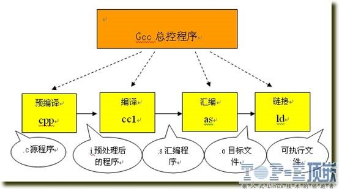
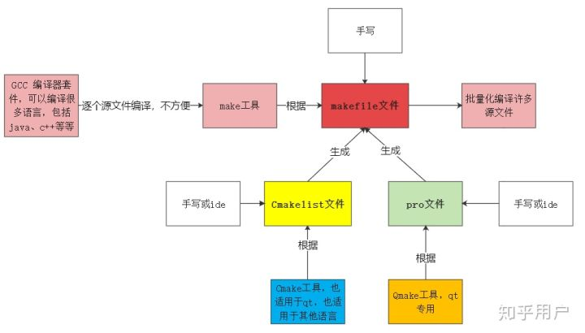
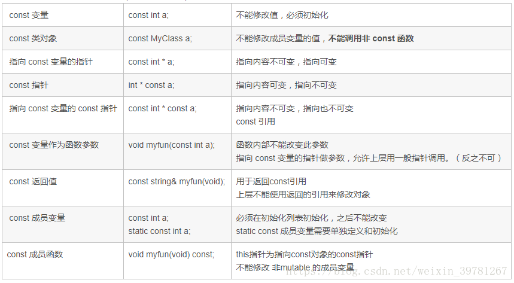

<!-- START doctoc generated TOC please keep comment here to allow auto update -->
<!-- DON'T EDIT THIS SECTION, INSTEAD RE-RUN doctoc TO UPDATE -->
**Table of Contents**  *generated with [DocToc](https://github.com/thlorenz/doctoc)*

- [知识储备](#%E7%9F%A5%E8%AF%86%E5%82%A8%E5%A4%87)
  - [开发工具](#%E5%BC%80%E5%8F%91%E5%B7%A5%E5%85%B7)
  - [MinGW、Cygwin、MSVC区别](#mingwcygwinmsvc%E5%8C%BA%E5%88%AB)
  - [编译过程](#%E7%BC%96%E8%AF%91%E8%BF%87%E7%A8%8B)
  - [make、Makefile、cmake、qmake](#makemakefilecmakeqmake)
  - [GCC、Clang和LLVM](#gccclang%E5%92%8Cllvm)
  - [C和C++对比](#c%E5%92%8Cc%E5%AF%B9%E6%AF%94)
- [基础](#%E5%9F%BA%E7%A1%80)
  - [输入输出](#%E8%BE%93%E5%85%A5%E8%BE%93%E5%87%BA)
  - [预处理器](#%E9%A2%84%E5%A4%84%E7%90%86%E5%99%A8)
  - [异常处理](#%E5%BC%82%E5%B8%B8%E5%A4%84%E7%90%86)
  - [关键字](#%E5%85%B3%E9%94%AE%E5%AD%97)
    - [asm（C++ 程序中嵌入汇编代码）](#asmc-%E7%A8%8B%E5%BA%8F%E4%B8%AD%E5%B5%8C%E5%85%A5%E6%B1%87%E7%BC%96%E4%BB%A3%E7%A0%81)
    - [const和static](#const%E5%92%8Cstatic)
    - [extern](#extern)
    - [typedef](#typedef)
    - [namespce（命名空间）](#namespce%E5%91%BD%E5%90%8D%E7%A9%BA%E9%97%B4)
- [数据类型](#%E6%95%B0%E6%8D%AE%E7%B1%BB%E5%9E%8B)
  - [整型](#%E6%95%B4%E5%9E%8B)
    - [sizeof运算符](#sizeof%E8%BF%90%E7%AE%97%E7%AC%A6)
    - [limits头文件](#limits%E5%A4%B4%E6%96%87%E4%BB%B6)
    - [无符号类型](#%E6%97%A0%E7%AC%A6%E5%8F%B7%E7%B1%BB%E5%9E%8B)
    - [十六进制和八进制表示](#%E5%8D%81%E5%85%AD%E8%BF%9B%E5%88%B6%E5%92%8C%E5%85%AB%E8%BF%9B%E5%88%B6%E8%A1%A8%E7%A4%BA)
  - [字符型](#%E5%AD%97%E7%AC%A6%E5%9E%8B)
  - [布尔型](#%E5%B8%83%E5%B0%94%E5%9E%8B)
  - [浮点型](#%E6%B5%AE%E7%82%B9%E5%9E%8B)
  - [auto关键字](#auto%E5%85%B3%E9%94%AE%E5%AD%97)
  - [字符串（c++的string类，c风格的见C语言）](#%E5%AD%97%E7%AC%A6%E4%B8%B2c%E7%9A%84string%E7%B1%BBc%E9%A3%8E%E6%A0%BC%E7%9A%84%E8%A7%81c%E8%AF%AD%E8%A8%80)
  - [结构体](#%E7%BB%93%E6%9E%84%E4%BD%93)
  - [共用体](#%E5%85%B1%E7%94%A8%E4%BD%93)
  - [枚举](#%E6%9E%9A%E4%B8%BE)
- [数据类型（二）](#%E6%95%B0%E6%8D%AE%E7%B1%BB%E5%9E%8B%E4%BA%8C)
  - [数组](#%E6%95%B0%E7%BB%84)
    - [c类型数组（不建议使用）](#c%E7%B1%BB%E5%9E%8B%E6%95%B0%E7%BB%84%E4%B8%8D%E5%BB%BA%E8%AE%AE%E4%BD%BF%E7%94%A8)
    - [模板类vector动态数组](#%E6%A8%A1%E6%9D%BF%E7%B1%BBvector%E5%8A%A8%E6%80%81%E6%95%B0%E7%BB%84)
    - [模板类array固定数组（c++11）](#%E6%A8%A1%E6%9D%BF%E7%B1%BBarray%E5%9B%BA%E5%AE%9A%E6%95%B0%E7%BB%84c11)
  - [map](#map)
- [数据类型（三）对象[重点]](#%E6%95%B0%E6%8D%AE%E7%B1%BB%E5%9E%8B%E4%B8%89%E5%AF%B9%E8%B1%A1%E9%87%8D%E7%82%B9)
  - [类](#%E7%B1%BB)
  - [继承](#%E7%BB%A7%E6%89%BF)
  - [运算符重载](#%E8%BF%90%E7%AE%97%E7%AC%A6%E9%87%8D%E8%BD%BD)
  - [拷贝构造函数](#%E6%8B%B7%E8%B4%9D%E6%9E%84%E9%80%A0%E5%87%BD%E6%95%B0)
  - [隐式构造和explicit](#%E9%9A%90%E5%BC%8F%E6%9E%84%E9%80%A0%E5%92%8Cexplicit)
  - [友原（friend关键字）](#%E5%8F%8B%E5%8E%9Ffriend%E5%85%B3%E9%94%AE%E5%AD%97)
  - [多态](#%E5%A4%9A%E6%80%81)
  - [抽象和接口](#%E6%8A%BD%E8%B1%A1%E5%92%8C%E6%8E%A5%E5%8F%A3)
- [函数](#%E5%87%BD%E6%95%B0)
  - [函数重载](#%E5%87%BD%E6%95%B0%E9%87%8D%E8%BD%BD)
  - [内联函数（inline）](#%E5%86%85%E8%81%94%E5%87%BD%E6%95%B0inline)
    - [宏和内联函数](#%E5%AE%8F%E5%92%8C%E5%86%85%E8%81%94%E5%87%BD%E6%95%B0)
- [高级](#%E9%AB%98%E7%BA%A7)
  - [文件处理](#%E6%96%87%E4%BB%B6%E5%A4%84%E7%90%86)
  - [模板（template）](#%E6%A8%A1%E6%9D%BFtemplate)
  - [智能指针（Smart Point）](#%E6%99%BA%E8%83%BD%E6%8C%87%E9%92%88smart-point)
  - [信号处理（signal）](#%E4%BF%A1%E5%8F%B7%E5%A4%84%E7%90%86signal)
  - [多线程](#%E5%A4%9A%E7%BA%BF%E7%A8%8B)
    - [thread](#thread)
    - [pthread_create](#pthread_create)

<!-- END doctoc generated TOC please keep comment here to allow auto update -->

# 知识储备

## 开发工具

+ [Dev C++](https://sourceforge.net/projects/dev-cpp/)

  Dev C++是一款用于C和C++语言开发的不错的IDE，它是一个开源的IDE，但只支持Windows平台，而不支持Linux和OS X。下载完就可以用，比较方便。

+ [CLion](https://www.jetbrains.com/clion/)

  CLion支持多平台，Window下需要配置环境，MinGW、Cygwin、MSVC、远程LInux服务器都可以进行配置

+ [Visual Studio](https://visualstudio.microsoft.com/)

  自带MSVC编译器

+ Qt

  和CLion有点类似			

## MinGW、Cygwin、MSVC区别

+ MinGW

  MinGW是指是Minimalist GNU on Windows的缩写。它是一个可自由使用和自由发布的Windows特定头文件和使用GNU工具集导入库的集合，允许你在GNU/Linux和Windows平台生成本地的Windows程序而不需要第三方C运行时库

+ Cygwin

  Cygwin 提供完整的类Unix 环境，Windows 用户不仅可以使用GNU 工具，理论上Linux 上的程序只要用Cygwin 重新编译，就可以在Windows 上运行

+ MSVC

  MSVC是指微软的VC编译器

## 编译过程




1. 预编译

   将.c 文件转化成 .i文件

   使用的gcc命令是：gcc –E

   对应于预处理命令cpp

2. 编译

   将.c/.h文件转换成.s文件

   使用的gcc命令是：gcc –S

   对应于编译命令 cc –S

3. 汇编

   将.s 文件转化成 .o文件

   使用的gcc 命令是：gcc –c

   对应于汇编命令是 as

4. 链接

   将.o文件转化成可执行程序

   使用的gcc 命令是： gcc

   对应于链接命令是 ld

   总结起来编译过程就上面的四个过程：预编译处理(.c) －－> 编译、优化程序（.s、.asm）－－> 汇编程序(.obj、.o、.a、.ko) －－> 链接程序（.exe、.elf、.axf等）

## make、Makefile、cmake、qmake



autotools,cmake,qmake 用来生成Makefile。make用来执行Makefile

+ make和Makefile

  make 是用来执行Makefile的

  Makefile是类unix环境下(比如Linux)的类似于批处理的"脚本"文件。其基本语法是: **目标+依赖+命令**，只有在**目标**文件不存在，或**目标**比**依赖**的文件更旧，**命令**才会被执行。由此可见，Makefile和make可适用于任意工作，不限于编程。比如，可以用来管理latex

+ cmake

  cmake是跨平台项目管理工具，它用更抽象的语法来组织项目。它CMakeLists.txt文件（学名：组态档）去生成makefile。

+ qmake

  qmake是Qt专用的项目管理工具，对应的工程文件是*.pro

## GCC、Clang和LLVM

+ GCC

​        GCC（GNU Compiler Collection，GNU编译器套装），是一套由 GNU 开发的编程语言编译器。

+ Clang

​        一种编译器，类似于GCC，但编译Objective-C语言时，比GCC快3倍之多！支持C家族语言：C,C++,Objective-C, Objective-C++等。

+ LLVM

(low level virtual machine)优化代码，优化：编译时间，链接时间，运行时间，空闲优化。 它是构架编译器的框架系统，用于优化使用任何语言编写的程序。

LLVM是一个project ,包含许多组件。 包含许多把中间代码转为obj文件的工具、库、头文件。 包含汇编器、反汇编器、bitcode分析器和bitcode优化器。也包含基本的回归测试。

- 相关性：

Clang编译C家族语言到LLVM bitcode , 然后再用LLVM转为obj文件。

非常酷的一点，支持任何平台！！！


## C和C++对比

1. C++有三种编程方式：过程性，面向对象，泛型编程。
2. C++函数符号由 函数名+参数类型 组成，C只有函数名。所以，C没有函数重载的概念。
3. C++ 在 C的基础上增加了封装、继承、多态的概念
4. C++增加了泛型编程
5. C++增加了异常处理，C没有异常处理
6. C++增加了bool型
7. C++允许无名的函数形参（如果这个形参没有被用到的话）
8. C允许main函数调用自己
9. C++支持默认参数，C不支持
10. C语言中，局部变量必须在函数开头定义，不允许类似for(int a = 0; ;;)这种定义方法。
11. C++增加了引用
12. C允许变长数组，C++不允许
13. C中函数原型可选，C++中在调用之前必须声明函数原型
14. C++增加了STL标准模板库来支持数据结构和算法

# 基础

## 输入输出

```c++
#include <iostream>  //C++输入输出的库,没有.h后缀，与c的区别
using namespace std;  //使用输入输出的命名空间

int main() {
    int a;
    cin >> a;  //cin为输入函数
    cout << "输入的数为：" << a << endl;   //cout为输出函数，endl为换行符
    return 0;
}
```

## 预处理器

## 异常处理

```c++
//关键字try catch throw

try
{
   // 保护代码
}catch( ExceptionName e1 )
{
   // catch 块
}catch( ExceptionName e2 )
{
   // catch 块
}catch( ExceptionName eN )
{
   // catch 块
}

//Integer division by zero不是c++的异常,可以使用下面方法来捕捉
#include <iostream>
using namespace std;
 
double division(int a, int b)
{
   if( b == 0 )
   {
      throw "Division by zero condition!";
   }
   return (a/b);
}
 
int main ()
{
   int x = 50;
   int y = 0;
   double z = 0;
 
   try {
     z = division(x, y);
     cout << z << endl;
   }catch (const char* msg) {
     cerr << msg << endl;
   }
 
   return 0;
}
```

## 关键字

### asm（C++ 程序中嵌入汇编代码）

```c++
#include <iostream>

int main() {
    int a, b, c;
    a = 12;
    b = 24;
    //第一种实现方式
//    __asm{
//    mov eax, a
//    mov ebx, b
//    add eax, ebx
//    mov c, eax
//    }

    //第二种实现方式
    __asm mov eax, a;
    __asm mov ebx, b;
    __asm add eax, ebx;
    __asm mov c, eax;
    std::cout << c << std::endl;
    return 0;
}
```

### const和static



```
const 常量：定义时就初始化，以后不能更改。可以代替define使用
const 形参：func(const int a){};该形参在函数里不能改变
const修饰类成员函数：该函数对成员变量只能进行只读操作
可以作为重载函数  void  func(Test  * const this(默认的)) const ---------=>void  func(const  Test * const this):这个函数只具有读的功能,不能对对其变量进行修改
　　　　因为this指针为常量,不能变化,它和static成员函数类似,普通函数可以访问常成员函数,反之则不成立.常成员函数只能访问常成员变量
　　　　
函数(static 里面不包含this指针)
a.静态函数只能访问静态成员变量(不需要this指针)
b.静态函数不能访问普通成员函数,反之成立(静态成员函数没有this指针)
2. 存储方式-------------->共有的(它的值会被保存,下次调用仍保持上一次数值)
a.局部变量 : 在该函数执行变量结束后,该变量不会被释放,继续保存
b.全局变量 : 表示当变量在全局内都可以访问
c.类成员变量 : 表示这个变量为全类所有的(所有对象都公用这个变量,它不是某一个对象的私有的)

不同点
const定义的常量在超出其作用域之后其空间会被释放，而static定义的静态常量在函数执行后不会释放其存储空间。
static : 为静态变量,只和类有关系,和对象无关,即使没有对象也可以调用静态函数和变量.
数据类型 类名::静态数据成员名=值    int Test::a = 10;
const : 初始化必须有构造函数初始化,不同对象const的数值不一样.
```

### extern

```c++
//1、修饰声明全局变量或函数，其声明的变量和函数可以在其它模块（文件）中使用，注意，这只是一个声明而不是定义，具体的定义要在具体的模块中完成
外部文件
Test.h
extern int a;  //向外暴露该变量（方法也可）
Test.cpp
int a=10; //给变量赋值
main.cpp（调用a变量）
#include <iostream>
//方法一,引入头文件
#include "Test.h"
int main(){
std::cout<<a<<endl;  //可以直接使用a了
}
//方法二，引入变量a
extern int a;
nt main(){
std::cout<<a<<endl;  //也可以直接使用a了
}

//c++调用c代码
//比如说你用C 开发了一个DLL 库，为了能够让C ++语言也能够调用你的DLL 输出(Export) 的函数，你需要用extern "C" 来强制编译器不要修改你的函数名
#ifdef __cplusplus  
extern "C" {  
#endif  
  
/**** some declaration or so *****/  
  
#ifdef __cplusplus  
}  
#endif

//c++里面调用c，方法一，引入头文件
extern "C" {  
#include "test_extern_c.h"  
} 

//c++里面调用c，方法一，引入具体函数和变量
extern "C"{  
int ThisIsTest(int, int);            
} 
```

### typedef

```
//重定义
```

### namespce（命名空间）

```
//定义命名空间
namespace LJ{
   int a=10;
   
   class Test{
   
   }
}

int a=100;   //（如果我想使用using的方式，会和LJ里面的a冲突，这时可以使用全局命名空间）

//使用
1、using namespce LJ;  //第一种
2、LJ::a;  //第二种

//全局命名空间,
int main()
{
    using namespace LJ;
    ::a = 19999;  //使用全局命名空间,这个赋值是外面的a=100的
    LJ::a=1000;   //给命名空间里面的a赋值
}
```

## <u>_</u><u>_</u>attribute<u>_</u><u>_</u>机制

+ [define AB_EXTERN extern "C" __attribute__((visibility ("default")))](https://blog.csdn.net/u012496940/article/details/46953607)
+ [Linux下__attribute__((visibility ("default")))的使用](https://blog.csdn.net/fengbingchun/article/details/78898623)
+ [__attribute__((visibility("default")))](https://www.jianshu.com/p/1e6315145fcf)

# 数据类型

## 整型

short、int、long、long long

- short至少16位
- int至少与short一样长
- long至少32位，至少与int一样长
- long long至少64位，至少与long一样长

### sizeof运算符

可对类型名或者变量名使用sizeof运算符，输出字节数。

```c++
int a = 0;
cout << sizeof(a) << endl;  
//输出4，表示变量a占四个字节
```

### limits头文件

包含当前操作系统下的最大值和最小值

```c++
#include <limits>   //头文件

using namespace std;  //使用输入输出的命名空间

int main() {
    cout << INT_MAX << endl;  //输出int类型在当前的最大值
    return 0;
}
```

### 无符号类型

无符号类型只有在非负数情况下才可以使用

unsigned short、unsigned（表示无符号int整形）、unsigned long、unsigned long long

### 十六进制和八进制表示

```c++
int a=0x16;   //这边的16为十六进制
int b=016;    //这边的16为八进制
```

## 字符型

存储0~128个ASCII码

c++11 新增char16_t和char32_t

## 布尔型

true和false。true为1，false为0

## 浮点型

float、double、long double

## auto关键字

```c++
auto a = 'a';   //不显示的指明类型，使用auto关键字系统会自动识别
```

## 字符串（c++的string类，c风格的见C语言）

```c++
#include <iostream>  //C++输入输出的库,没有.h后缀，与c的区别
#include <string>  //c++风格的字符串头文件

using namespace std;  //使用输入输出的命名空间

int main() {
    string str1 = "Hello";  //c++的字符串类使用小写的string表示
    string str2 = "World";
    string str3;
    int  len ;

    str3 = str1;  //字符串的复制
    cout << "str3 : " << str3 << endl;

    str3 = str1 + str2;  //字符串的拼接
    cout << "str1 + str2 : " << str3 << endl;

    len = str3.size();  //字符串的长度
    cout << "str3.size() :  " << len << endl;
}
```

## 结构体

## 共用体

## 枚举

# 数据类型（二）

## 数组

```c++
共同点
（1.）都和数组相似，都可以使用标准数组的表示方法来访问每个元素（array和vector都对下标运算符[ ]进行了重载）
（2.）三者的存储都是连续的，可以进行随机访问
不同点
（0.）数组是不安全的，array和vector是比较安全的（有效的避免越界等问题）
（1.）array对象和数组存储在相同的内存区域（栈）中，vector对象存储在自由存储区（堆）
（2.）array可以将一个对象赋值给另一个array对象，但是数组不行
（3.）vector属于变长的容器，即可以根据数据的插入和删除重新构造容器容量；但是array和数组属于定长容器
（4.）vector和array提供了更好的数据访问机制，即可以使用front()和back()以及at()（at()可以避免a[-1]访问越界的问题）访问方式，使得访问更加安全。而数组只能通过下标访问，在写程序中很容易出现越界的错误
（5.）vector和array提供了更好的遍历机制，即有正向迭代器和反向迭代器
（6.）vector和array提供了size()和Empty()，而数组只能通过sizeof()/strlen()以及遍历计数来获取大小和是否为空
（7.）vector和array提供了两个容器对象的内容交换，即swap()的机制，而数组对于交换只能通过遍历的方式逐个交换元素
（8.）array提供了初始化所有成员的方法fill（）
（9.）由于vector的动态内存变化的机制，在插入和删除时，需要考虑迭代的是否有效问题
（10.）vector和array在声明变量后，在声明周期完成后，会自动地释放其所占用的内存。对于数组如果用new[ ]/malloc申请的空间，必须用对应的delete[ ]和free来释放内存
```

### c类型数组（不建议使用）

```c++
#include <iostream>  //C++输入输出的库,没有.h后缀，与c的区别
using namespace std;  //使用输入输出的命名空间

int main() {
    int n[10]; // n 是一个包含 10 个整数的数组

    // 初始化数组元素
    for (int i = 0; i < 10; i++) {
        n[i] = i + 100; // 设置元素 i 为 i + 100
        cout << n[i] << endl;
    }
}
```

### 模板类vector动态数组

```c++
/**
有点类似于Java的ArrayList集合类

1.push_back 在数组的最后添加一个数据
2.pop_back 去掉数组的最后一个数据
3.at 得到编号位置的数据
4.begin 得到数组头的指针
5.end 得到数组的最后一个单元+1的指针
6．front 得到数组头的引用
7.back 得到数组的最后一个单元的引用
8.max_size 得到vector最大可以是多大
9.capacity 当前vector分配的大小
10.size 当前使用数据的大小
11.resize 改变当前使用数据的大小，如果它比当前使用的大，者填充默认值
12.reserve 改变当前vecotr所分配空间的大小
13.erase 删除指针指向的数据项
14.clear 清空当前的vector
15.rbegin 将vector反转后的开始指针返回(其实就是原来的end-1)
16.rend 将vector反转构的结束指针返回(其实就是原来的begin-1)
17.empty 判断vector是否为空
18.swap 与另一个vector交换数据
**/
#include <iostream>  //C++输入输出的库,没有.h后缀，与c的区别
#include <vector>  //vector的头文件

using namespace std;  //使用输入输出的命名空间

int main() {
    vector<int> obj; //创建一个向量存储容器 int
    for (int i = 0; i < 10; i++)  // push_back(elem)在数组最后添加数据
    {
        obj.push_back(i);
        cout << obj[i] << ",";
    }
    for (int i = 0; i < 5; i++)//去掉数组最后一个数据
    {
        obj.pop_back();
    }
    cout << "\n" << endl;
    for (int i = 0; i < obj.size(); i++) //size()容器中实际数据个数
    {
        cout << obj[i] << ",";
    }
    return 0;
}
```

### 模板类array固定数组（c++11）

```c++
#include <array>    //array类头文件

using namespace std;  //使用array需要包含该命名空间

int main() {
    array<int, 5> ai{};    // create array object of 5 ints
    array<double, 4> ad = {1.2, 2.1, 3.43, 4.3};    // 使用普通方式进行初始化
    array<double, 4> ad2{1.2, 2.1, 3.43, 4.3};    // 使用列表的方式进行初始化
}
```

## map

```c++
//头文件
#include<map>

map<int, string> ID_Name;

// 使用{}赋值是从c++11开始的，因此编译器版本过低时会报错，如visual studio 2012
map<int, string> ID_Name = {
                { 2015, "Jim" },
                { 2016, "Tom" },
                { 2017, "Bob" } };

//方法一插入
map<int, string> ID_Name;
// 如果已经存在键值2015，则会作赋值修改操作，如果没有则插入
ID_Name[2015] = "Tom";

//方法二插入
// 插入单个键值对，并返回插入位置和成功标志，插入位置已经存在值时，插入失败
pair<iterator,bool> insert (const value_type& val);
//在指定位置插入，在不同位置插入效率是不一样的，因为涉及到重排
iterator insert (const_iterator position, const value_type& val);
// 插入多个
void insert (InputIterator first, InputIterator last);
//c++11开始支持，使用列表插入多个   
void insert (initializer_list<value_type> il);

#include <iostream>
#include <map>

int main()
{
    std::map<char, int> mymap;

    // 插入单个值
    mymap.insert(std::pair<char, int>('a', 100));
    mymap.insert(std::pair<char, int>('z', 200));

    //返回插入位置以及是否插入成功
    std::pair<std::map<char, int>::iterator, bool> ret;
    ret = mymap.insert(std::pair<char, int>('z', 500));
    if (ret.second == false) {
        std::cout << "element 'z' already existed";
        std::cout << " with a value of " << ret.first->second << '\n';
    }

    //指定位置插入
    std::map<char, int>::iterator it = mymap.begin();
    mymap.insert(it, std::pair<char, int>('b', 300));  //效率更高
    mymap.insert(it, std::pair<char, int>('c', 400));  //效率非最高

    //范围多值插入
    std::map<char, int> anothermap;
    anothermap.insert(mymap.begin(), mymap.find('c'));

    // 列表形式插入
    anothermap.insert({ { 'd', 100 }, {'e', 200} });

    return 0;
    
//取值
//Map中元素取值主要有at和[ ]两种操作，at会作下标检查，而[]不会。
map<int, string> ID_Name;

//ID_Name中没有关键字2016，使用[]取值会导致插入
//因此，下面语句不会报错，但打印结果为空
cout<<ID_Name[2016].c_str()<<endl;

//使用at会进行关键字检查，因此下面语句会报错
ID_Name.at(2016) = "Bob";

//容量查询
// 查询map是否为空
bool empty();
// 查询map中键值对的数量
size_t size();
// 查询map所能包含的最大键值对数量，和系统和应用库有关。
// 此外，这并不意味着用户一定可以存这么多，很可能还没达到就已经开辟内存失败了
size_t max_size();
// 查询关键字为key的元素的个数，在map里结果非0即1
size_t count( const Key& key ) const; //

//迭代器
map<int,int>::iterator it;
map<int,int> mmap;
const map<int,int> const_mmap;

it = mmap.begin(); //iterator
mmap.cbegin(); //const_iterator

const_mmap.begin(); //const_iterator
const_mmap.cbegin(); //const_iterator
    
//删除和交换
// 删除迭代器指向位置的键值对，并返回一个指向下一元素的迭代器
iterator erase( iterator pos )
// 删除一定范围内的元素，并返回一个指向下一元素的迭代器
iterator erase( const_iterator first, const_iterator last );
// 根据Key来进行删除， 返回删除的元素数量，在map里结果非0即1
size_t erase( const key_type& key );
// 清空map，清空后的size为0
void clear();

// 就是两个map的内容互换
void swap( map& other );
    
//顺序比较
// 比较两个关键字在map中位置的先后  key_compare key_comp() const;
map<char,int> mymap;
map<char,int>::key_compare mycomp = mymap.key_comp();

mymap['a']=100;
mymap['b']=200;
mycomp('a', 'b');  // a排在b前面，因此返回结果为true
    
//查找
// 关键字查询，找到则返回指向该关键字的迭代器，否则返回指向end的迭代器
// 根据map的类型，返回的迭代器为 iterator 或者 const_iterator
iterator find (const key_type& k);
const_iterator find (const key_type& k) const;

std::map<char,int> mymap;
std::map<char,int>::iterator it;

mymap['a']=50;
mymap['b']=100;
mymap['c']=150;
mymap['d']=200;

it = mymap.find('b');
if (it != mymap.end())
    mymap.erase (it); // b被成功删除
```


# 数据类型（三）对象[重点]

##  类

```c++
/**
掌握目标：
1、构造函数/析构函数
2、复制构造函数
3、this指针
4、类指针
5、友元函数(有啥用？？？？)
6、内联函数
7、静态成员static关键字

//特殊成员变量初始化
常量变量：必须通过构造函数参数列表进行初始化。
引用变量：必须通过构造函数参数列表进行初始化。
普通静态变量：要在类外通过"::"初始化。
静态整型常量：可以直接在定义的时候初始化。
静态非整型常量：不能直接在定义的时候初始化。要在类外通过"::"初始化
**/
//头文件
#include <iostream>

#ifndef TWOC_PERSON_H
#define TWOC_PERSON_H

using namespace std;

class Person {
public:   //     公有的数据成员和成员函数
    static int count;   //记录构造函数次数,构造static变量

    Person();   //无参构造函数
    ~Person();  //析构函数，
    Person(string food);  //有参构造函数
    Person(string food, string time);

    Person(const Person &person);   //复制构造函数，复制对象用的,深拷贝和浅拷贝
    void eat();   //成员函数

    static int getCount();    //静态函数

private:   //私有的数据成员和成员函数
    string foodName;
    string currentTime;

protected:  //保护的数据成员和和成员函数
};
#endif //TWOC_PERSON_H

//实现文件
#include "Person.h"

int Person::count = 0;   // 初始化类 Box 的静态成员，其实是定义并初始化的过程(必须在类外进行)

void Person::eat() {
    cout << "我正在吃:" << foodName << endl;
}

//初始化列表来进行初始化数据,可以使用默认参数
Person::Person(string food, string time = "now") : foodName(food), currentTime(time) {
    count++;
}

Person::Person(const Person &person) {

}

Person::~Person() {
    cout << "~Person()" << endl;
}

Person::Person() {
    cout << "Person()" << endl;
}

int Person::getCount() {
    return count;
}

//调用
#include <iostream>
#include "Person.h"
#include <string>
int main(int argc, const char * argv[]) {

    
    Person *person1=new Person("汉堡包");   //堆上面分配内存
    person1->eat();
    delete person1;   //需要主动释放内存，会调用析构函数
    
    Person person("薯条");   //栈上面创建对象，程序结束会自动回收内存，然后自动调用析构函数
    person.eat();
    cout << "Total objects: " << Person::count << endl;        //输出2
    cout << "Total objects: " << Person::getCount() << endl;   //输出2

    return 0;
}
```

## 继承

```c++
/**
子类继承了父类所有方法（public和protected）下列除外
基类的构造函数、析构函数和拷贝构造函数。
基类的重载运算符。
基类的友元函数。
**/

//父类
#ifndef TWOC_SHAPE_H
#define TWOC_SHAPE_H
class Shape {
public:
    void setWidth(int w);

    void setHeight(int h);

protected:
    int width;
    int height;
};
#endif //TWOC_SHAPE_H

#include "Shape.h"

void Shape::setWidth(int w) {
    width = w;
}

void Shape::setHeight(int h) {
    height = h;
}

//子类
#ifndef TWOC_RECTANGLE_H
#define TWOC_RECTANGLE_H
#include "Shape.h"

class Rectangle : public Shape {

public:
    int getArea();
};
#endif //TWOC_RECTANGLE_H

#include "Rectangle.h"

int Rectangle::getArea() {
    return (width * height);
}

//main方法
#include <iostream>
#include "Rectangle.h"

using namespace std;

int main() {

    Rectangle Rect;

    Rect.setWidth(5);
    Rect.setHeight(7);
    cout << "Total area: " << Rect.getArea() << endl;   //输出35
    return 0;
}
```

## 运算符重载

```c++
/**
Box operator+(const Box&);  //成员函数定义
Box operator+(const Box&, const Box&);  //非成员函数定义

可重载的运算符
双目算术运算符	+ (加)，-(减)，*(乘)，/(除)，% (取模)
关系运算符	==(等于)，!= (不等于)，< (小于)，> (大于>，<=(小于等于)，>=(大于等于)
逻辑运算符	||(逻辑或)，&&(逻辑与)，!(逻辑非)
单目运算符	+ (正)，-(负)，*(指针)，&(取地址)
自增自减运算符	++(自增)，--(自减)
位运算符	| (按位或)，& (按位与)，~(按位取反)，^(按位异或),，<< (左移)，>>(右移)
赋值运算符	=, +=, -=, *=, /= , % = , &=, |=, ^=, <<=, >>=
空间申请与释放	new, delete, new[ ] , delete[]
其他运算符	()(函数调用)，->(成员访问)，,(逗号)，[](下标)
**/

#include <iostream>

using namespace std;

class Box {
public:

    double getVolume(void) {
        return length * breadth * height;
    }

    void setLength(double len) {
        length = len;
    }

    void setBreadth(double bre) {
        breadth = bre;
    }

    void setHeight(double hei) {
        height = hei;
    }

    // 重载 + 运算符，用于把两个 Box 对象相加
    Box operator+(const Box &b) {
        Box box;
        box.length = this->length + b.length;
        box.breadth = this->breadth + b.breadth;
        box.height = this->height + b.height;
        return box;
    }

private:
    double length;      // 长度
    double breadth;     // 宽度
    double height;      // 高度
};

// 程序的主函数
int main() {
    Box Box1;                // 声明 Box1，类型为 Box
    Box Box2;                // 声明 Box2，类型为 Box
    Box Box3;                // 声明 Box3，类型为 Box
    double volume = 0.0;     // 把体积存储在该变量中

    Box1.setLength(6.0);
    Box1.setBreadth(7.0);
    Box1.setHeight(5.0);

    Box2.setLength(12.0);
    Box2.setBreadth(13.0);
    Box2.setHeight(10.0);

    volume = Box1.getVolume();
    cout << "Volume of Box1 : " << volume << endl;  //输出210

    volume = Box2.getVolume();
    cout << "Volume of Box2 : " << volume << endl;  //输出1560

    Box3 = Box1 + Box2;    //使用重载运算符将两个对象相加,执行operator+方法
    volume = Box3.getVolume();
    cout << "Volume of Box3 : " << volume << endl;  //输出5400

    return 0;
}
```

## 拷贝构造函数

```
//深拷贝和浅拷贝 默认拷贝构造函数可以完成对象的数据成员简单的复制,这也称为浅拷贝。对象的数据资源是由指针指向的堆时,默认的拷贝构造函数只是将指针复制。

class Test
{
private:
    int* p;
public:
    Test(int x)
    {
        this->p=new int(x);
        cout << "对象被创建" << endl;
    }
    ~Test()
    {
        if (p != NULL)
        {
            delete p;
        }
        cout << "对象被释放" << endl;
    }
    int getX() { return *p; }
    //深拷贝(拷贝构造函数)
    Test(const Test& a)
    {
        this->p = new int(*a.p);
        cout << "对象被创建" << endl;
    }
    //浅拷贝(拷贝构造函数)
    //Test(const Test& a)
    //{
    //  this->p = a.p;
    //  cout << "对象被创建" << endl;
    //}
};

int main()
{
    Test a(10);
    //我们手动的写拷贝构造函数,C++编译器会调用我们手动写的
    Test b = a;
    return 0;
}
```

## 隐式构造和explicit

```
//默认每个构造函数都有隐式构造,如果不允许隐式构造,使用explicit关键字

#include <iostream>
using namespace std;

class Test {

public:

    explicit Test(int age) {  //加上explicit关键字,下面的代码会报错
        cout << "Test(int age)" << endl;
    }

};

Test display() {
    return 30;  //相当于return Test(30);
}

int main()
{
    Test test1=30;   //隐式构造,相当于Test test1(30);
   // std::cout << test2.age;
}
```

## 友原（friend关键字）

```
class对象中的成员分为public类与private类，前者可以定义class变量后直接访问，而后者则不可以访问
通过引入友元（friend）达到访问private类的成员

```

## 多态

```c++
/**
默认情况下,编译器指挥根据指针类型调用对应的函数,不存在多态。
C++中的多态使用虚函数来实现,
虚函数：被virtual修饰的成员函数
只要在父类中声明为虚函数,子类中重写的函数自动变成虚函数（也就是说子类可以省略virtual）

虚表
虚函数的实现是虚表,这个虚表里面存储着最终需要调用的虚函数地址,这个虚表也叫虚函数表
**/
```

## 抽象和接口

```
/**
纯虚函数：  virtual double area() = 0;   //不定义任何方法体

抽象类：
其实，在c++中并没有抽象类的概念，要实现抽象类则需要通过纯虚函数实现。纯虚函数指的是只定义函数原型的成员函数。在c++的类中，只要存在纯虚函数，那么该类就变成抽象类。

 (1) 每个具体图形的求面积算法不一样，所以加上virtual关键字，表明该函数是虚函数，在子类中重写时可以发生多态； 
 (2) 为对Shape类求面积无意义，所以加上”= 0”表明该函数声明为纯虚函数，不需要定义函数体。 
 (3) 抽象类不能生成对象，只能用作父类被继承，子类必须实现纯虚函数的具体功能，在子类中，父类的纯虚函数被实现后就变成虚函数，当然，如果子类没有实现父类的纯虚函数，那么子类也是抽象类一个

接口：
c++中接口也是一种抽象类，需要满足： 
 (1) 类中没有定义任何成员变量 
 (2) 类中所有成员函数都是公有且都是纯虚函数
**/
```

# 函数

## 函数重载

```
C++ 不允许变量重名，但是允许多个函数取相同的名字，只要参数表不同即可，这叫作函数的重载（读“虫载”，不读“众载”，其英文是 overload）。重载就是装载多种东西的意思，即同一个事物能完成不同功能。

//编译器使用了namemanger,到了编译器，名字其实不一样的
```

## 内联函数（inline）

```
//关键字使用inline修饰

/**
 *   特性：
 *   1、编译器会将函数调用直接展开为函数体代码、
 *   2、可以减少函数调用的开销（普通函数调用每次都需要开辟栈间,结束释放空间）
 *   3、会增大代码体积
 *   注意：
 *   尽量不要内联超过十行的代码
 *   有些函数即使声明为内联，也不一定会被编译器内联，比如递归
 */
```

### 宏和内联函数

1. 内联函数在运行时可以调试，而宏定义不行
2. 编译器会对内联函数的参数类型做安全检查，或自动类型转换，而宏定义则不会
3. 内联函数可以访问类的成员变量，而宏定义则不能
4. 宏只是在预处理的地方把代码展开，不需要额外的空间和时间方面的开销，所以调用一个宏比调用一个函数更有效率  。

# 高级

## 文件处理

```c++
/**
ofstream	该数据类型表示输出文件流，用于创建文件并向文件写入信息。
ifstream	该数据类型表示输入文件流，用于从文件读取信息。
fstream	该数据类型通常表示文件流，且同时具有 ofstream 和 ifstream 两种功能，这意味着它可以创建文件，向文件写入信息，从文件读取信息。

void open(const char *filename, ios::openmode mode);   //打开文件标准模式

mode:
ios::app	追加模式。所有写入都追加到文件末尾。
ios::ate	文件打开后定位到文件末尾。
ios::in	打开文件用于读取。
ios::out	打开文件用于写入。
ios::trunc	如果该文件已经存在，其内容将在打开文件之前被截断，即把文件长度设为 0。

void close();  //关闭文件
**/
//读写文件需要用到的
#include <fstream>
#include <iostream>

//<io.h>中的_access可以判断文件是否存在
#include <io.h>
//<direct.h>中的_mkdir可以创建文件
#include <direct.h>

using namespace std;

int main() {

    char data[100];

    string path = R"(C:\Users\jacky\Desktop\sd)";    //字符串前面加个R表示不需要转义,文件不存在则会创建，默认为写入模式,覆盖模式
    if (_access(path.c_str(), 0) == -1)    //如果文件夹不存在
        _mkdir(path.c_str());                //则创建
    // 以写模式打开文件
    ofstream outfile;
    outfile.open(R"(C:\Users\jacky\Desktop\sd\a.txt)");

    cout << "Writing to the file" << endl;
    cout << "Enter your name: ";
    cin.getline(data, 100);

    // 向文件写入用户输入的数据
    outfile << data << endl;

    cout << "Enter your age: ";
    cin >> data;
    cin.ignore();

    // 再次向文件写入用户输入的数据
    outfile << data << endl;

    // 关闭打开的文件
    outfile.close();

    // 以读模式打开文件
    ifstream infile;
    infile.open(R"(C:\Users\jacky\Desktop\sd\a.txt)");

    cout << "Reading from the file" << endl;
    infile >> data;

    // 在屏幕上写入数据
    cout << data << endl;

    // 再次从文件读取数据，并显示它
    infile >> data;
    cout << data << endl;

    // 关闭打开的文件
    infile.close();

    return 0;
}
```

## 模板（template）

```c++
//泛型,是一种将数据类型参数化以达到代码复用的技术,C++中使用模板来实现泛型

//模板格式
template <typename/class T>
    
//函数模板例子
//声明一个模板方法,模板类型是T,add前面是返回值类型    
template <typename T>T add (T a,T b){
    return a+b;
}

//<>里面可以定义不同类型给后面的函数的入参和返回值使用
template <typename T,typename A>T add(T a,A b){
    return a+b;
}

template <typename T>
T add(T a, T b) {
	return a + b;
}

int main()
{
	string d = "22";
	string f = "33";
	int a = add(1, 3);

	string c = add(d, f);

	cout << a << endl;
	cout << c << endl;
   
	return 0;
   // std::cout << test2.age;
}

//类模板例子
template <typename T>
class Test {
public:
	T add(T a, T b) {
		return a + b;
	}
};
```

## 智能指针（Smart Point）

+ [例子详解](https://www.cnblogs.com/WindSun/p/11444429.html)

```c++
//C++里面的四个智能指针: auto_ptr, unique_ptr,shared_ptr, weak_ptr 其中后三个是C++11支持，并且第一个已经被C++11弃用。
/**
 *  传统指针存在的问题
 *  1、需要手动管理内存
 *  2、容易发生内存泄漏（忘记释放、出现异常）
 *  3、可能出现野指针
 */

//auto_ptr（C++98的方案，C++11已经抛弃）采用所有权模式。
//此时不会报错，p2剥夺了p1的所有权，但是当程序运行时访问p1将会报错。所以auto_ptr的缺点是：存在潜在的内存崩溃问题！
auto_ptr<string> p1 (new string ("I reigned lonely as a cloud.")); 
auto_ptr<string> p2; 
p2 = p1; //auto_ptr不会报错.

//unique_ptr （替换auto_ptr）unique_ptr实现独占式拥有或严格拥有概念，保证同一时间内只有一个智能指针可以指向该对象。它对于避免资源泄露(例如“以new创建对象后因为发生异常而忘记调用delete”)特别有用。
```

## 信号处理（signal）

```c++
#include <iostream>
#include <windows.h>
#include <signal.h>  //信号处理的头文件

using namespace std;

/*
注册了某个信号后，当系统收到这个信号，就会调用回调函数。

系统给出的信号：
#define SIGINT	2	中断
#define SIGILL	4	非法指令-无效函数镜像
#define SIGFPE	8	错误的算术运算，比如除以零或导致溢出的操作
#define SIGSEGV	11	非法访问内存
#define SIGTERM	15	通过kill发送到本进程的终止信号
#define SIGBREAK	21	Ctrl-Break sequence
#define SIGABRT	22	程序的异常终止，如调用 abort。
#define SIGABRT_COMPAT	6	SIGABRT 兼容其它平台, 类似于 SIGABRT
 */

void testSignal(int i) {
	
	cout << "recive signal : " << i << endl;

}


int main()
{
	signal(SIGINT, testSignal);   //注册信号

	while (1) {
		Sleep(500);
		raise(SIGINT);  //主动发起信号
	}
	return 0;
   // std::cout << test2.age;
}
```

## 多线程

### thread

```c++
//c++ 11 的多线程库

#include <iostream>
#include <thread>   //线程的头文件
#include <windows.h>  //Windows的Sleep方法的头文件

#include <unistd.h>   //Linux的Sleep方法的头文件
using namespace std;

//线程使用的方法
void testThread(int i) {
	
	cout << this_thread::get_id() << endl;  //获取当前线程的id
	cout << i << endl;
}

int main()
{
	
	for (size_t i = 0; i < 10; i++)
	{
		thread t(testThread,i);  //初始化参数传入一个线程执行的方法,然后后面跟方法的入参
		t.detach();   //立即执行
        t.join();  //等当前线程执行完了再去执行主线程
	}
	Sleep(10000);
	return 0;
}

```

### pthread_create

```c++
#include <pthread.h>  //头文件
int pthread_create(pthread_t *tidp,const pthread_attr_t *attr,(void*)(*start_rtn)(void*) ,void *arg);
 
//第一个参数为指向线程标识符的指针。
//第二个参数用来设置线程属性。
//第三个参数是线程运行函数的起始地址。
//第四个参数是运行函数的参数。
//pthread_create() 在调用成功完成之后返回零。其他任何返回值都表示出现了错误。

//例子

void* thread( void* ){
	int i;
	for( int i=0; i<3; i++ ){
		cout << " This is a thread " << endl;
	}
}
int main( int arg, char** argv ){
	pthread_t id;
	int i, ret;
	ret = pthread_create( &id, NULL, thread, NULL);
	if( ret != 0 ) {
		cout << " Create thread error!" << endl;
		exit(1);
	}
	cout << "This is the main process" << endl;
	pthread_join( id, NULL );
	return(0);
}
```

