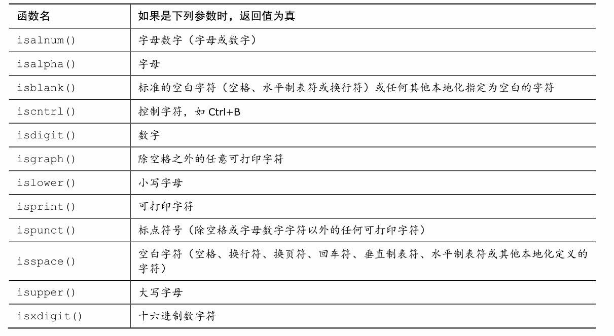
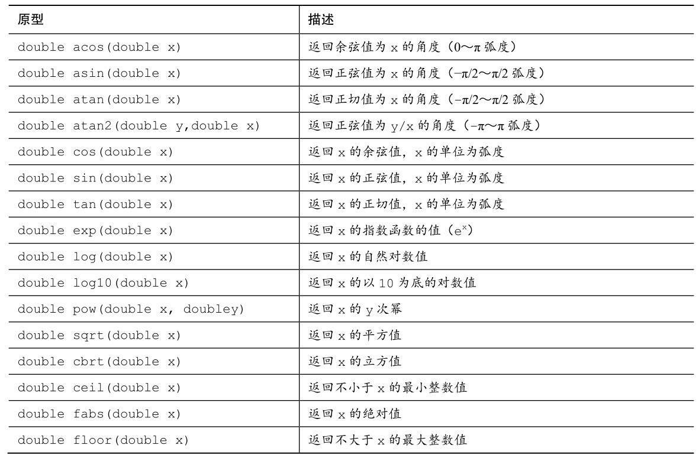

<!-- START doctoc generated TOC please keep comment here to allow auto update -->
<!-- DON'T EDIT THIS SECTION, INSTEAD RE-RUN doctoc TO UPDATE -->
**Table of Contents**  *generated with [DocToc](https://github.com/thlorenz/doctoc)*

- [编译过程](#%E7%BC%96%E8%AF%91%E8%BF%87%E7%A8%8B)
  - [预处理](#%E9%A2%84%E5%A4%84%E7%90%86)
  - [编译](#%E7%BC%96%E8%AF%91)
  - [汇编](#%E6%B1%87%E7%BC%96)
  - [链接](#%E9%93%BE%E6%8E%A5)
- [基础](#%E5%9F%BA%E7%A1%80)
  - [输入输出](#%E8%BE%93%E5%85%A5%E8%BE%93%E5%87%BA)
  - [常量](#%E5%B8%B8%E9%87%8F)
    - [define预处理](#define%E9%A2%84%E5%A4%84%E7%90%86)
    - [const关键字](#const%E5%85%B3%E9%94%AE%E5%AD%97)
  - [存储类](#%E5%AD%98%E5%82%A8%E7%B1%BB)
    - [auto关键字](#auto%E5%85%B3%E9%94%AE%E5%AD%97)
    - [regeister关键字](#regeister%E5%85%B3%E9%94%AE%E5%AD%97)
    - [static关键字](#static%E5%85%B3%E9%94%AE%E5%AD%97)
    - [extern关键字](#extern%E5%85%B3%E9%94%AE%E5%AD%97)
- [运算符](#%E8%BF%90%E7%AE%97%E7%AC%A6)
  - [sizeof运算符和size_t类型](#sizeof%E8%BF%90%E7%AE%97%E7%AC%A6%E5%92%8Csize_t%E7%B1%BB%E5%9E%8B)
- [循环](#%E5%BE%AA%E7%8E%AF)
- [分支和跳转](#%E5%88%86%E6%94%AF%E5%92%8C%E8%B7%B3%E8%BD%AC)
  - [getchar()和putchar()](#getchar%E5%92%8Cputchar)
- [数据类型](#%E6%95%B0%E6%8D%AE%E7%B1%BB%E5%9E%8B)
  - [typedef关键字](#typedef%E5%85%B3%E9%94%AE%E5%AD%97)
  - [整数类型](#%E6%95%B4%E6%95%B0%E7%B1%BB%E5%9E%8B)
  - [浮点类型](#%E6%B5%AE%E7%82%B9%E7%B1%BB%E5%9E%8B)
  - [复数和虚数类型](#%E5%A4%8D%E6%95%B0%E5%92%8C%E8%99%9A%E6%95%B0%E7%B1%BB%E5%9E%8B)
  - [布尔类型](#%E5%B8%83%E5%B0%94%E7%B1%BB%E5%9E%8B)
  - [字符串类型](#%E5%AD%97%E7%AC%A6%E4%B8%B2%E7%B1%BB%E5%9E%8B)
  - [结构体](#%E7%BB%93%E6%9E%84%E4%BD%93)
    - [定义结构体](#%E5%AE%9A%E4%B9%89%E7%BB%93%E6%9E%84%E4%BD%93)
    - [结构体的初始化](#%E7%BB%93%E6%9E%84%E4%BD%93%E7%9A%84%E5%88%9D%E5%A7%8B%E5%8C%96)
    - [访问结构成员](#%E8%AE%BF%E9%97%AE%E7%BB%93%E6%9E%84%E6%88%90%E5%91%98)
    - [结构作为函数参数](#%E7%BB%93%E6%9E%84%E4%BD%9C%E4%B8%BA%E5%87%BD%E6%95%B0%E5%8F%82%E6%95%B0)
    - [指向结构的指针](#%E6%8C%87%E5%90%91%E7%BB%93%E6%9E%84%E7%9A%84%E6%8C%87%E9%92%88)
  - [共用体](#%E5%85%B1%E7%94%A8%E4%BD%93)
    - [与结构体区别](#%E4%B8%8E%E7%BB%93%E6%9E%84%E4%BD%93%E5%8C%BA%E5%88%AB)
    - [共用体定义](#%E5%85%B1%E7%94%A8%E4%BD%93%E5%AE%9A%E4%B9%89)
    - [访问共用体成员](#%E8%AE%BF%E9%97%AE%E5%85%B1%E7%94%A8%E4%BD%93%E6%88%90%E5%91%98)
- [指针（核心）](#%E6%8C%87%E9%92%88%E6%A0%B8%E5%BF%83)
- [文件读写](#%E6%96%87%E4%BB%B6%E8%AF%BB%E5%86%99)
  - [EOF](#eof)
  - [文件打开](#%E6%96%87%E4%BB%B6%E6%89%93%E5%BC%80)
  - [文件关闭](#%E6%96%87%E4%BB%B6%E5%85%B3%E9%97%AD)
  - [文件写入](#%E6%96%87%E4%BB%B6%E5%86%99%E5%85%A5)
  - [文件读取](#%E6%96%87%E4%BB%B6%E8%AF%BB%E5%8F%96)
  - [二进制的读写](#%E4%BA%8C%E8%BF%9B%E5%88%B6%E7%9A%84%E8%AF%BB%E5%86%99)
- [内存申请](#%E5%86%85%E5%AD%98%E7%94%B3%E8%AF%B7)
  - [内存申请相关的函数](#%E5%86%85%E5%AD%98%E7%94%B3%E8%AF%B7%E7%9B%B8%E5%85%B3%E7%9A%84%E5%87%BD%E6%95%B0)
- [头文件](#%E5%A4%B4%E6%96%87%E4%BB%B6)
  - [limits.h和float.h](#limitsh%E5%92%8Cfloath)
  - [ctype.h](#ctypeh)
  - [math.h](#mathh)

<!-- END doctoc generated TOC please keep comment here to allow auto update -->

# 编译过程

## 预处理

预处理用于将所有的#include头文件以及宏定义替换成其真正的内容，预处理之后得到的仍然是文本文件，但文件体积会大很多。

```c
gcc -E 文件名   //进行预处理
```

## 编译

这里的编译不是指程序从源文件到二进制程序的全部过程，而是指将经过预处理之后的程序转换成特定汇编代码(assembly code)的过程

```c
gcc -S 文件名  //进行编译到汇编代码
```

## 汇编

汇编过程将上一步的汇编代码转换成机器码(machine code)，这一步产生的文件叫做目标文件，是二进制格式

```c
gcc -c 文件名  //将汇编代码转换为机器码
```

## 链接

链接过程将多个目标文件以及所需的库文件(.so等)链接成最终的可执行文件(executable file)。

```c
ld -o    //转换为目标文件
```

# 基础

## 输入输出

```c
int a;
scanf("%d",&a); // scanf 的“输入参数”中，前面的取地址符&记住
printf("%d/n",a); //printf输出函数

%d 十进制显示数字
%o 八进制显示数字
%x 十六进制显示数字，要显示各进制数的前缀0、0x和0X， 必须分别使用%#o、%#x、%#X
%u 无符号整型数字,打印unsigned int类型的数据
%ld 打印long类型的数据
    
```

## 常量

### define预处理

```c
#include <stdio.h>
 
#define LENGTH 10   
#define WIDTH  5
#define NEWLINE '\n'
 
int main()
{
   int area;  
   area = LENGTH * WIDTH;
   printf("value of area : %d", area);
   printf("%c", NEWLINE);
 
   return 0;
}

//输出
value of area : 50
```

### const关键字

const用于限定一个变量为只读

```c
#include <stdio.h>
 
int main()
{
   const int  LENGTH = 10;
   const int  WIDTH  = 5;
   const char NEWLINE = '\n';
   int area;  
   
   area = LENGTH * WIDTH;
   printf("value of area : %d", area);
   printf("%c", NEWLINE);
 
   return 0;
}

//输出
value of area : 50
```

## 存储类

### auto关键字

auto只能修饰局部变量，且默认变量都是auto的，使用较少。

### regeister关键字

```c
/**
register 存储类用于定义存储在寄存器中而不是 RAM 中的局部变量
寄存器只用于需要快速访问的变量，比如计数器。还应注意的是，定义 'register' 并不意味着变量将被存储在寄存器中，它意味着变量可能存储在寄存器中，这取决于硬件和实现的限制
**/

{
   register int  miles;
}
```

### static关键字

```c
/**
static 存储类指示编译器在程序的生命周期内保持局部变量的存在，而不需要在每次它进入和离开作用域时进行创建和销毁。
因此，使用 static 修饰局部变量可以在函数调用之间保持局部变量的值。

static 修饰符也可以应用于全局变量。当 static 修饰全局变量时，会使变量的作用域限制在声明它的文件内。
全局声明的一个 static 变量或方法可以被任何函数或方法调用，只要这些方法出现在跟 static 变量或方法同一个文件中。
**/

#include <stdio.h>
 
/* 函数声明 */
void func1(void);
 
static int count=10;        /* 全局变量 - static 是默认的 */
 
int main()
{
  while (count--) {
      func1();
  }
  return 0;
}
 
void func1(void)
{
/* 'thingy' 是 'func1' 的局部变量 - 只初始化一次
 * 每次调用函数 'func1' 'thingy' 值不会被重置。
 */                
  static int thingy=5;
  thingy++;
  printf(" thingy 为 %d ， count 为 %d\n", thingy, count);
}

//输出
 thingy 为 6 ， count 为 9
 thingy 为 7 ， count 为 8
 thingy 为 8 ， count 为 7
 thingy 为 9 ， count 为 6
 thingy 为 10 ， count 为 5
 thingy 为 11 ， count 为 4
 thingy 为 12 ， count 为 3
 thingy 为 13 ， count 为 2
 thingy 为 14 ， count 为 1
 thingy 为 15 ， count 为 0
```

### extern关键字

```c
/**
1、extern 存储类用于提供一个全局变量的引用，全局变量对所有的程序文件都是可见的。当您使用 extern 时，对于无法初始化的变量，会把变量名指向一个之前定义过的存储位置
2、当您有多个文件且定义了一个可以在其他文件中使用的全局变量或函数时，可以在其他文件中使用 extern 来得到已定义的变量或函数的引用。可以这么理解，extern 是用来在另一个文件中声明一个全局变量或函数。
3、extern 修饰符通常用于当有两个或多个文件共享相同的全局变量或函数的时候
**/

//main.c
#include <stdio.h>
 
int count ;
extern void write_extern();
 
int main()
{
   count = 5;
   write_extern();
}

//support.c
#include <stdio.h>
 
extern int count;
 
void write_extern(void)
{
   printf("count is %d\n", count);
}

//输出
5
```

# 运算符

## sizeof运算符和size_t类型

sizeof运算符以一个字节为对象返回运算对象的大小。

size_t是unsigned int或unsigned long的别名

# 循环

for、while和do.....while.....

# 分支和跳转

if...else...、switch、continue、break、case  

## getchar()和putchar()

```c
ch=getchar();  //读取下一个字符输入,并把该字符的值赋给ch

putchar(ch);  //把ch的值打印出来
```


# 数据类型

## typedef关键字

为现有类型创建别名。

```c
typedef double real;   //为double类型创建一个别名

real deal;  //定义deal变量
```

## 整数类型

```c
//int 为整型的基本类型
//long、short、unsigned(无符号的)、signed(C90新增，有符号的)都是用于基本整型的变式。
//如unsigned short int ，long long int。
```

## 浮点类型

```c
//float、double、long double表示带小数点的数
```

##  复数和虚数类型

```c
//_Complex和_Imaginary分别表示复数和虚数，C99新增
```

## 布尔类型

```c
//_Bool 表示布尔类型（true或false）C99新增
```

## 字符串类型

在 C 语言中，字符串实际上是使用 **null** 字符 '\0' 终止的一维字符数组

```c
//初始化字符数组
char greeting[] = "Hello";
//或者
char *greeting="Hello";  //使用指针来表示字符串 
//相关方法
#include <stdio.h>
#include <string.h>    //字符串函数所需要的头文件
 
int main ()
{
   char str1[12] = "Hello";
   char str2[12] = "World";
   char str3[12];
   int  len ;
 
   /* 复制 str1 到 str3 */
   strcpy(str3, str1);
   printf("strcpy( str3, str1) :  %s\n", str3 );
 
   /* 连接 str1 和 str2 */
   strcat( str1, str2);
   printf("strcat( str1, str2):   %s\n", str1 );
 
   /* 连接后，str1 的总长度 */
   len = strlen(str1);
   printf("strlen(str1) :  %d\n", len );
 
   return 0;
}
```

## 结构体

### 定义结构体

```c
//此声明声明了拥有3个成员的结构体，分别为整型的a，字符型的b和双精度的c
//同时又声明了结构体变量s1
//这个结构体并没有标明其标签
struct 
{
    int a;
    char b;
    double c;
} s1;
 
//此声明声明了拥有3个成员的结构体，分别为整型的a，字符型的b和双精度的c
//结构体的标签被命名为SIMPLE,没有声明变量
struct SIMPLE
{
    int a;
    char b;
    double c;
};
//用SIMPLE标签的结构体，另外声明了变量t1、t2、t3
struct SIMPLE t1, t2[20], *t3;
 
//也可以用typedef创建新类型,进行重命名
typedef struct
{
    int a;
    char b;
    double c; 
} Simple2;
//现在可以用Simple2作为类型声明新的结构体变量
Simple2 u1, u2[20], *u3;

//此结构体的声明包含了其他的结构体
struct COMPLEX
{
    char string[100];
    struct SIMPLE a;
};
 
//此结构体的声明包含了指向自己类型的指针，可以创建链表之类的数据结构
struct NODE
{
    char string[100];
    struct NODE *next_node;
};

//如果两个结构体互相包含，则需要对其中一个结构体进行不完整声明，如下所示：
struct B;    //对结构体B进行不完整声明
//结构体A中包含指向结构体B的指针
struct A
{
    struct B *partner;
    //other members;
};
//结构体B中包含指向结构体A的指针，在A声明完后，B也随之进行声明
struct B
{
    struct A *partner;
    //other members;
};
```

### 结构体的初始化

```c
#include <stdio.h>
 
struct Books
{
   char  title[50];
   char  author[50];
   char  subject[100];
   int   book_id;
} book = {"C 语言", "RUNOOB", "编程语言", 123456};
 
int main()
{
    printf("title : %s\nauthor: %s\nsubject: %s\nbook_id: %d\n", book.title, book.author, book.subject, book.book_id);
}

//输出
title : C 语言
author: RUNOOB
subject: 编程语言
book_id: 123456
```

### 访问结构成员

```c
#include <stdio.h>
#include <string.h>
 
struct Books
{
   char  title[50];
   char  author[50];
   char  subject[100];
   int   book_id;
};
 
int main( )
{
   struct Books Book1;        /* 声明 Book1，类型为 Books */
   struct Books Book2;        /* 声明 Book2，类型为 Books */
 
   /* Book1 详述 */
   strcpy( Book1.title, "C Programming");
   strcpy( Book1.author, "Nuha Ali"); 
   strcpy( Book1.subject, "C Programming Tutorial");
   Book1.book_id = 6495407;
 
   /* Book2 详述 */
   strcpy( Book2.title, "Telecom Billing");
   strcpy( Book2.author, "Zara Ali");
   strcpy( Book2.subject, "Telecom Billing Tutorial");
   Book2.book_id = 6495700;
 
   /* 输出 Book1 信息 */
   printf( "Book 1 title : %s\n", Book1.title);
   printf( "Book 1 author : %s\n", Book1.author);
   printf( "Book 1 subject : %s\n", Book1.subject);
   printf( "Book 1 book_id : %d\n", Book1.book_id);
 
   /* 输出 Book2 信息 */
   printf( "Book 2 title : %s\n", Book2.title);
   printf( "Book 2 author : %s\n", Book2.author);
   printf( "Book 2 subject : %s\n", Book2.subject);
   printf( "Book 2 book_id : %d\n", Book2.book_id);
 
   return 0;
}

//输出
Book 1 title : C Programming
Book 1 author : Nuha Ali
Book 1 subject : C Programming Tutorial
Book 1 book_id : 6495407
Book 2 title : Telecom Billing
Book 2 author : Zara Ali
Book 2 subject : Telecom Billing Tutorial
Book 2 book_id : 6495700
```

### 结构作为函数参数

```c
#include <stdio.h>
#include <string.h>
 
struct Books
{
   char  title[50];
   char  author[50];
   char  subject[100];
   int   book_id;
};
 
/* 函数声明 */
void printBook( struct Books book );
int main( )
{
   struct Books Book1;        /* 声明 Book1，类型为 Books */
   struct Books Book2;        /* 声明 Book2，类型为 Books */
 
   /* Book1 详述 */
   strcpy( Book1.title, "C Programming");
   strcpy( Book1.author, "Nuha Ali"); 
   strcpy( Book1.subject, "C Programming Tutorial");
   Book1.book_id = 6495407;
 
   /* Book2 详述 */
   strcpy( Book2.title, "Telecom Billing");
   strcpy( Book2.author, "Zara Ali");
   strcpy( Book2.subject, "Telecom Billing Tutorial");
   Book2.book_id = 6495700;
 
   /* 输出 Book1 信息 */
   printBook( Book1 );
 
   /* 输出 Book2 信息 */
   printBook( Book2 );
 
   return 0;
}
void printBook( struct Books book )
{
   printf( "Book title : %s\n", book.title);
   printf( "Book author : %s\n", book.author);
   printf( "Book subject : %s\n", book.subject);
   printf( "Book book_id : %d\n", book.book_id);
}
```

### 指向结构的指针

```c
#include <stdio.h>
#include <string.h>
 
struct Books
{
   char  title[50];
   char  author[50];
   char  subject[100];
   int   book_id;
};
 
/* 函数声明 */
void printBook( struct Books *book );
int main( )
{
   struct Books Book1;        /* 声明 Book1，类型为 Books */
   struct Books Book2;        /* 声明 Book2，类型为 Books */
 
   /* Book1 详述 */
   strcpy( Book1.title, "C Programming");
   strcpy( Book1.author, "Nuha Ali"); 
   strcpy( Book1.subject, "C Programming Tutorial");
   Book1.book_id = 6495407;
 
   /* Book2 详述 */
   strcpy( Book2.title, "Telecom Billing");
   strcpy( Book2.author, "Zara Ali");
   strcpy( Book2.subject, "Telecom Billing Tutorial");
   Book2.book_id = 6495700;
 
   /* 通过传 Book1 的地址来输出 Book1 信息 */
   printBook( &Book1 );
 
   /* 通过传 Book2 的地址来输出 Book2 信息 */
   printBook( &Book2 );
 
   return 0;
}
void printBook( struct Books *book )
{
   printf( "Book title : %s\n", book->title);
   printf( "Book author : %s\n", book->author);
   printf( "Book subject : %s\n", book->subject);
   printf( "Book book_id : %d\n", book->book_id);
}
```

## 共用体

### 与结构体区别

+ 结构体（struct）打包几个字段时可以让它们共存，也就是一起装进去；

+ 联合体/共用体（union）在定义类型时声明的几个字段只能用其中一个，也就是多选一。

+ 虽然 union 可以重复赋予不同的值，但最好只初始化一次或者始终使用最后赋予的值，以免出现一些奇奇怪怪的问题。

### 共用体定义

```c
#include <stdio.h>
#include <string.h>
 
union Data
{
   int i;
   float f;
   char  str[20];
};
 
int main( )
{
   union Data data;        
   printf( "Memory size occupied by data : %d\n", sizeof(data));
   return 0;
}

//输出20
```

### 访问共用体成员

```c
//示例1
#include <stdio.h>
#include <string.h>
 
union Data
{
   int i;
   float f;
   char  str[20];
};
 
int main( )
{
   union Data data;        
   data.i = 10;
   data.f = 220.5;
   strcpy( data.str, "C Programming"); 
   printf( "data.i : %d\n", data.i);
   printf( "data.f : %f\n", data.f);
   printf( "data.str : %s\n", data.str);
   return 0;
}

//输出，前两个有损坏，只有最后一个是好的，说明只能使用一个变量
data.i : 1917853763
data.f : 4122360580327794860452759994368.000000
data.str : C Programming  
  
//示例2
#include <stdio.h>
#include <string.h>
 
union Data
{
   int i;
   float f;
   char  str[20];
};
 
int main( )
{
   union Data data;        
   data.i = 10;
   printf( "data.i : %d\n", data.i);
   data.f = 220.5;
   printf( "data.f : %f\n", data.f);   
   strcpy( data.str, "C Programming");
   printf( "data.str : %s\n", data.str); 
   return 0;
}

//输出
data.i : 10
data.f : 220.500000
data.str : C Programming
```

# 指针（核心）

```c
//指针存储的是地址
int a=10
    
int *p = &a   //通过&符号来获取变量的地址    
int c=*p  //通过*关键字来获取地址的值    
    
//指针可以做加减法，单位当前的数据类型个位
char *str = "1222";
printf("%c\n", *(str));    //数组的首地址位置
printf("%c\n", *(str + 1));   //移动到下个数组的位置
```


# 文件读写

## EOF

读取文件时，检测到文件结尾时将返回一个特殊的值，就是EOF（end of file）。EOF定义在stdio.h文件中： # define EOF (-1)

## 文件打开

```c
/**
filename：文件名
mode：r 打开一个已有的文本文件，允许读取文件。
      w	打开一个文本文件，允许写入文件。如果文件不存在，则会创建一个新文件。在这里，您的程序会从文件的开头写入内容。如果文件存在，则该会被截断为零长度，重新写入。
      a	打开一个文本文件，以追加模式写入文件。如果文件不存在，则会创建一个新文件。在这里，您的程序会在已有的文件内容中追加内容
      r+	打开一个文本文件，允许读写文件
      w+	打开一个文本文件，允许读写文件。如果文件已存在，则文件会被截断为零长度，如果文件不存在，则会创建一个新文件
      a+	打开一个文本文件，允许读写文件。如果文件不存在，则会创建一个新文件。读取会从文件的开头开始，写入则只能是追加模式
      
 访问二进制文件，则需使用下面的访问模式来取代上面的访问模式：
 "rb", "wb", "ab", "rb+", "r+b", "wb+", "w+b", "ab+", "a+b"
**/
FILE *fopen( const char * filename, const char * mode );
```

## 文件关闭

```c
int fclose( FILE *fp );  //如果成功关闭文件，fclose( ) 函数返回零，如果关闭文件时发生错误，函数返回 EOF
```

## 文件写入

```c
//写入字符，函数 fputc() 。如果写入成功，它会返回写入的字符，如果发生错误，则会返回 EOF
int fputc( int c, FILE *fp ); 
//写入字符串，如果写入成功，它会返回一个非负值，如果发生错误，则会返回 EOF
int fputs( const char *s, FILE *fp ); 或者 int fprintf(FILE *fp,const char *format, ...) 

#include <stdio.h>
 
int main()
{
   FILE *fp = NULL;
   fp = fopen("/tmp/test.txt", "w+");
   fprintf(fp, "This is testing for fprintf...\n");
   fputs("This is testing for fputs...\n", fp);
   fclose(fp);
}  
```

## 文件读取

```c
//读取字符
int fgetc( FILE * fp );
//读取字符串，函数 fgets() 从 fp 所指向的输入流中读取 n - 1 个字符。它会把读取的字符串复制到缓冲区 buf，并在最后追加一个 null 字符来终止字符串。如果这个函数在读取最后一个字符之前就遇到一个换行符 '\n' 或文件的末尾 EOF
char *fgets( char *buf, int n, FILE *fp );
//读取字符串，函数来从文件中读取字符串，但是在遇到第一个空格和换行符时，它会停止读取
int fscanf(FILE *fp, const char *format, ...) 

#include <stdio.h>
int main()
{
   FILE *fp = NULL;
   char buff[255];
   fp = fopen("/tmp/test.txt", "r");
   fscanf(fp, "%s", buff);
   printf("1: %s\n", buff );
 
   fgets(buff, 255, (FILE*)fp);
   printf("2: %s\n", buff );
   
   fgets(buff, 255, (FILE*)fp);
   printf("3: %s\n", buff );
   fclose(fp);
}  

//输出
1: This
2: is testing for fprintf...

3: This is testing for fputs...
```

## 二进制的读写

```c
size_t fread(void *ptr, size_t size_of_elements, 
             size_t number_of_elements, FILE *a_file);
              
size_t fwrite(const void *ptr, size_t size_of_elements, 
             size_t number_of_elements, FILE *a_file);
```

# 内存申请

## 内存申请相关的函数

```c
/**
1. alloca是向栈申请内存,因此无需释放.
2. malloc分配的内存是位于堆中的,并且没有初始化内存的内容,因此基本上malloc之后,调用函数memset来初始化这部分的内存空间.
3. calloc则将初始化这部分的内存,设置为0.
4. realloc则对malloc申请的内存进行大小的调整.
5. 申请的内存最终需要通过函数free来释放.
当程序运行过程中malloc了,但是没有free的话,会造成内存泄漏.一部分的内存没有被使用,但是由于没有free,因此系统认为这部分内存还在使用,造成不断的向系统申请内存,使得系统可用内存不断减少.但是内存泄漏仅仅指程序在运行时,程序退出时,OS将回收所有的资源.因此,适当的重起一下程序,有时候还是有点作用.

三个申请内存的函数：（都在stdlib.h函数库内，它们的返回值都是请求系统分配的地址,如果请求失败就返回NULL.）
//在内存的动态存储区中分配一块长度为size字节的连续区域，参数size为需要内存空间的长度，返回该区域的首地址.
void* malloc(unsigned size);

//与malloc相似,参数sizeOfElement为申请地址的单位元素长度,numElements为元素个数，即在内存中申请numElements*sizeOfElement字节大小的连续地址空间.
void* realloc(void* ptr, unsigned newsize);  

//给一个已经分配了地址的指针重新分配空间,参数ptr为原有的空间地址,newsize是重新申请的地址长度.
void* calloc(size_t numElements, size_t sizeOfElement); 
**/
```


# 头文件

## limits.h和float.h

分别提供了与整型类型和浮点类型大小相关的详细信息。每个头文件都定义了一系列供实现使用的明示常量。

## ctype.h

C 有一系列专门处理字符的函数，ctype.h头文件包含了这些函数的原型。这些函数接受一个字符作为参数，如果该字符属于某特殊的类别，就返回一个非零值（真）；否则，返回0（假）。例如，如果isalpha()函数的参数是一个字母，则返回一个非零值。



## math.h

数学库中包含许多有用的数学函数


