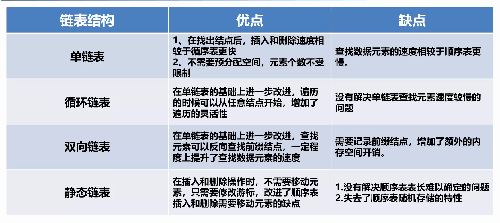

# 数据结构

## 线性表

### 顺序存储（数组）

```
优缺点：
优点：
1、构建简单；
2、能在O(1)时间里根据数组的下标(index)查询某个元素。

缺点：
1、构建时必须分配一段连续的空间；
2、查询某个元素是否存在时需要遍历整个数组，耗费O(n)的时间（其中n为元素的个数）；
3、删除或添加某个元素时，同样也要花费O(n)的时间。
```

### 链式存储（链表）

```
优点：
1、可以灵活分配内存空间；
2、能在O(1)时间内删除或添加元素，前提是该元素的前一个元素已知。也与是单链表还是双链表有关，双链表如果已知该元素的后一个元素时间就为O(1)。

缺点：
1、不能像数组一样通过下标获取元素，每次要从链表头开始一个一个读取；
2、查询第k个元素需要O(k)时间。

注意：索引某个元素和查询某个元素是否存在的区别
```

#### 几种链表的优缺点



#### 单链表

```java
class SingleList<T> {

    private Node head;
    private int length;

    private class Node {
        private T value;
        private Node next;
    }

    /**
     * 向头部添加数据
     *
     * @param value 需要插入的数据
     */
    public void addFirst(T value) {
        Node node = new Node();
        node.next = head;
        node.value = value;
        head = node;
    }

    /**
     * 默认方法
     * 向尾部插入数据
     *
     * @param value 需要插入的数据
     */
    public void add(T value) {
        add(value, length);
    }

    /**
     * 插入具体位置
     *
     * @param value 需要插入的数据
     * @param index 插入的位置
     */
    public void add(T value, int index) {
        if (index < 0 || index > length) {  //插入的位置大于当前长度或者位置小于0抛出异常
            throw new ArithmeticException("index is error");
        }
        if (index == 0 || head == null) {
            addFirst(value);
        } else {
            Node pre = head;
            for (int i = 0; i < index - 1; i++) {
                pre = pre.next;  //获取需要插入位置的前一个节点
            }
            Node node = new Node();
            node.value = value;
            node.next = pre.next;
            pre.next = node;
        }
        length++;
    }

    /**
     * 默认方法，移除最后一个元素
     * 移除数据
     */
    public void remove() {
        remove(length - 1);
    }

    /**
     * 移除元素
     *
     * @param index 移除的位置
     */
    public void remove(int index) {
        if (index < 0 || index > length) {  //插入的位置大于当前长度或者位置小于0抛出异常
            throw new ArithmeticException("index is error");
        }
        if (length == 0) {
            throw new ArithmeticException("length is zero,remove fail");
        }
        Node pre = head;
        for (int i = 0; i < index - 1; i++) {
            pre = pre.next;  //获取需要插入位置的前一个节点
        }
        //上一个节点指向当前节点的下个节点
        Node indexNode = pre.next;
        pre.next = indexNode.next;
        length--;
    }

    public boolean isContains(T value) {
        if (length == 0) {
            return false;
        }
        Node node = head;
        while (node != null) {
            if (node.value.equals(value)) {
                return true;
            }
            node = node.next;
        }
        return false;
    }

    public int length() {
        return length;
    }

    @Override
    public String toString() {
        StringBuffer stringBuffer = new StringBuffer();
        Node node = head;
        while (node != null) {
            stringBuffer.append(node.value + ",");
            node = node.next;
        }
        return stringBuffer.toString();
    }
}
```

#### 循环链表

```java
/**
 * 循环链表
 *
 * @param <T>
 */
class SingleList<T> {

    private Node head;  //头节点
    private Node tail; //尾节点
    private int length;

    private class Node {
        private T value;
        private Node next;
        //private Node pre;

        @Override
        public String toString() {
            return "Node{" +
                    "value=" + value + "}";
        }
    }

    /**
     * 向头部添加数据
     *
     * @param value 需要插入的数据
     */
    public void addFirst(T value) {
        Node node = new Node();
        node.value = value;
        if (length == 0) {
            head = tail = node;
        } else {
            tail.next = node;
            head = node;
            head.next = tail;
        }
        length++;
    }


    /**
     * 默认方法
     * 向尾部插入数据
     *
     * @param value 需要插入的数据
     */
    public void add(T value) {
        add(value, length);
    }

    /**
     * 插入具体位置
     *
     * @param value 需要插入的数据
     * @param index 插入的位置
     */
    public void add(T value, int index) {
        if (index < 0 || index > length) {  //插入的位置大于当前长度或者位置小于0抛出异常
            throw new ArithmeticException("index is error");
        }
        if (index == 0 || head == null) {
            addFirst(value);
        } else {
            Node pre = head;
            //0.1.2.3.4  4 3
            for (int i = 0; i < index - 1; i++) {
                pre = pre.next;  //获取需要插入位置的前一个节点
            }
            Node node = new Node();
            node.value = value;
            //如果插入的位置在最后，改变尾节点
            if (index == length) {
                node.next = tail.next;
                pre.next = node;
                node.next = head;
                tail = node;
            } else {
                node.next = pre.next;
                pre.next = node;
            }
            length++;
        }
    }

    /**
     * 默认方法，移除最后一个元素
     * 移除数据
     */
    public void remove() {
        remove(length - 1);
    }

    /**
     * 移除元素
     *
     * @param index 移除的位置
     */
    public void remove(int index) {
        if (index < 0 || index > length) {  //插入的位置大于当前长度或者位置小于0抛出异常
            throw new ArithmeticException("index is error");
        }
        if (length == 0) {
            throw new ArithmeticException("length is zero,remove fail");
        }
        if (length == 1) {
            head = tail = null;
            length--;
            return;
        }
        Node pre = head;
        for (int i = 0; i < index - 1; i++) {
            pre = pre.next;  //获取需要删除位置的前一个节点
        }
        //上一个节点指向当前节点的下个节点
        Node indexNode = pre.next;
        pre.next = indexNode.next;
        length--;
    }

    public boolean isContains(T value) {
        if (length == 0) {
            return false;
        }
        Node node = head;
        while (length > 1 && node.next != head) {
            if (node.value.equals(value)) {
                return true;
            }
            node = node.next;
        }
        return node.value.equals(value);
    }

    public int length() {
        return length;
    }

    @Override
    public String toString() {
        if (length == 0) {
            return "";
        }
        StringBuffer stringBuffer = new StringBuffer();
        Node node = head;
        while (length > 1 && node.next != head) {
            stringBuffer.append(node.toString());
            node = node.next;
        }
        stringBuffer.append(node.toString());

        return stringBuffer.toString();
    }
}
```

#### 双向链表

```java
/**
 * 双向链表
 *
 * @param <T>
 */
class DoubleList<T> {

    private Node head;  //头节点
    private Node tail; //尾节点
    private int length;

    private class Node {
        private T value;
        private Node next;  //下一个节点
        private Node pre;  //上一个节点

        @Override
        public String toString() {
            return "Node{" +
                    "value=" + value + "}";
        }
    }

    /**
     * 向头部添加数据
     *
     * @param value 需要插入的数据
     */
    public void addFirst(T value) {
        Node node = new Node();
        node.value = value;
        if (length == 0) {
            head = tail = node;
        } else if (length == 1) {
            tail.pre = node;
            node.next = head;
            head = node;
        } else {
            node.next = head;
            head = node;
        }
        length++;
    }


    /**
     * 默认方法
     * 向尾部插入数据
     *
     * @param value 需要插入的数据
     */
    public void add(T value) {
        add(value, length);
    }

    /**
     * 插入具体位置
     *
     * @param value 需要插入的数据
     * @param index 插入的位置
     */
    public void add(T value, int index) {
        if (index < 0 || index > length) {  //插入的位置大于当前长度或者位置小于0抛出异常
            throw new ArithmeticException("index is error");
        }
        if (index == 0 || head == null) {
            addFirst(value);
        } else {
            Node pre = head;
            //0.1.2.3.4  4 3
            for (int i = 0; i < index - 1; i++) {
                pre = pre.next;  //获取需要插入位置的前一个节点
            }
            Node node = new Node();
            node.value = value;
            //如果插入的位置在最后，改变尾节点
            if (index == length) {
                node.pre = tail;
                tail.next = node;
                tail = node;
            } else {
                Node nextNode = pre.next;
                pre.next = node;
                nextNode.pre = node;
                node.pre = pre;
                node.next = nextNode;
            }
            length++;
        }
    }

    /**
     * 默认方法，移除最后一个元素
     * 移除数据
     */
    public void remove() {
        remove(length - 1);
    }

    /**
     * 移除元素
     *
     * @param index 移除的位置
     */
    public void remove(int index) {
        if (index < 0 || index > length) {  //插入的位置大于当前长度或者位置小于0抛出异常
            throw new ArithmeticException("index is error");
        }
        if (length == 0) {
            throw new ArithmeticException("length is zero,remove fail");
        }
        if (length == 1) {
            head = tail = null;
            length--;
            return;
        }
        if (index == length - 1) {
            tail.pre.next = null;
            return;
        }
        Node pre = head;
        for (int i = 0; i < index - 1; i++) {
            pre = pre.next;  //获取需要删除位置的前一个节点
        }
        //上一个节点指向当前节点的下个节点
        Node indexNodeNext = pre.next;

        pre.next = indexNodeNext.next;
        indexNodeNext.next.pre = pre;
        length--;
    }

    public boolean isContains(T value) {
        if (length == 0) {
            return false;
        }
        Node node = head;
        while (node != null) {
            if (node.value.equals(value)) {
                return true;
            }
            node = node.next;
        }
        return false;
    }

    public int length() {
        return length;
    }

    @Override
    public String toString() {
        if (length == 0) {
            return "";
        }
        StringBuffer stringBuffer = new StringBuffer();
        Node node = head;
        while (node.next != null) {
            stringBuffer.append(node.toString());
            node = node.next;
        }
        stringBuffer.append(node.toString());

        return stringBuffer.toString();
    }
}
```

#### 双向循环链表

增加最后一个节点的尾指针指向最开始的节点，增加第一个节点的头指针指向

### 栈

栈是限定仅在进行表尾插入和删除的线性表

#### 顺序存储栈

```java
/**
 * 栈(利用数组实现)
 *
 * @param <T>
 */
public class Stack<T> {

    private Object[] datas;

    private final int maxStackLength;  //栈内可以容纳最多的元素个数
    private int topLength = 0;  //栈顶当前位置

    public Stack(int size) {
        maxStackLength = size;
        datas = new Object[size];
    }

    public boolean isFull() {
        return topLength == maxStackLength;
    }

    public boolean isEmpty() {
        return topLength == 0;
    }

    /**
     * 压栈
     *
     * @param value 存入栈的值
     */
    public void push(T value) {
        if (isFull()) {
            throw new ArithmeticException("Stack is Full");
        }
        datas[topLength] = value;
        topLength++;
    }

    /**
     * 出栈
     * <p>
     * 顶上的出栈
     */
    public boolean pop() {
        if (isEmpty()) {
            return false;
        }
        datas[topLength] = null;
        topLength--;
        return true;
    }

    /**
     * 出栈
     * 栈上面的数据都要出栈
     *
     * @param value 需要出栈的数据
     */
    public boolean pop(T value) {
        if (isEmpty()) {
            return false;
        }
        for (int i = topLength - 1; i >= 0; i--) {
            if (datas[i].equals(value)) {
                topLength = i;
            }
        }
        //datas[topLength] = null;
        //topLength--;
        return true;
    }

    /**
     * 返回栈顶数据，不出栈
     *
     * @return
     */
    public T peek() {
        if (isEmpty()) {
            return null;
        }
        return (T) datas[topLength - 1];
    }

    public void clearStack() {
        datas = null;
        datas = new Object[maxStackLength];
        topLength = 0;
    }

    public void printStack() {
        for (int i = 0; i < topLength; i++) {
            System.out.println((T) datas[i]);
        }
    }
}
```

#### 链式存储栈

### 队列

队列是只能在一端进行插入，在另一端进行删除的线性表

#### 顺序存储队列（循环队列）

```java
/**
 * 队列
 * 利用双向队列+数组的方式来实现
 * 用头指针和尾指针
 */
public class Queue {

    /**
     * 队列管道，当管道中存放的数据大于队列的长度时将不会再offer数据，直至从队列中poll数据后
     */
    private Object[] queue;
    //队列的头部，获取数据时总是从头部获取
    private int head;
    //队列尾部，push数据时总是从尾部添加
    private int tail;
    //队列长度
    private int size;
    //数组中能存放数据的最大容量
    private final static int MAX_CAPACITY = 1<<30;
    //数组长度
    private int capacity;
    //最大下标
    private int maxIndex;

    public Queue(int initialCapacity){
        if (initialCapacity > MAX_CAPACITY)
            throw new OutOfMemoryError("initialCapacity too large");
        if (initialCapacity <= 0)
            throw new IndexOutOfBoundsException("initialCapacity must be more than zero");
        queue = new Object[initialCapacity];
        capacity = initialCapacity;
        maxIndex = initialCapacity - 1;
        head = tail = -1;
        size = 0;
    }
    public Queue(){
        queue = new Object[16];
        capacity = 16;
        head = tail = -1;
        size = 0;
        maxIndex = 15;
    }

    /**
     * 往队列尾部添加数据
     * @param object 数据
     */
    public void offer(Object object){
        if (size >= capacity){
            System.out.println("queue's size more than or equal to array's capacity");
            return;
        }
        if (++tail > maxIndex){
            tail = 0;
        }
        queue[tail] = object;
        size++;
    }

    /**
     * 从队列头部拉出数据
     * @return 返回队列的第一个数据
     */
    public Object poll(){
        if (size <= 0){
            System.out.println("the queue is null");
            return null;
        }
        if (++head > maxIndex){
            head = 0;
        }
        size--;
        Object old = queue[head];
        queue[head] = null;
        return old;
    }

    /**
     * 查看第一个数据
     * @return
     */
    public Object peek(){
        return queue[head + 1];
    }

    /**
     * 队列中存储的数据量
     * @return
     */
    public int size(){
        return size;
    }

    /**
     * 队列是否为空
     * @return
     */
    public boolean isEmpty(){
        return size == 0;
    }

    /**
     * 清空队列
     */
    public void clear(){
        for (int i = 0; i < queue.length; i++) {
            queue[i] = null;
        }
        tail = head = -1;
        size = 0;
    }

    @Override
    public String toString() {
        if (size <= 0) return "{}";
        StringBuilder builder = new StringBuilder(size + 8);
        builder.append("{");
        int h = head;
        int count = 0;
        while (count < size){
            if (++h > maxIndex) h = 0;
            builder.append(queue[h]);
            builder.append(", ");
            count++;
        }
        return builder.substring(0,builder.length()-2) + "}";
    }
}
```

#### 链式存储队列（链队列）

```java
/**
 * 链队列
 * 使用链表的方式来实现
 * 定义头指针和尾指针，添加数据，修改头指针对象，删除数据，修改尾指针对象
 */
public class Queue<T> {

    static class Node<T> {
        // 存储的数据
        private T data;
        // 下一个节点的引用
        private Node<T> next;

        public Node(T data) {
            this.data = data;
        }

        public T getData() {
            return data;
        }

        public void setData(T data) {
            this.data = data;
        }

        public Node<T> getNext() {
            return next;
        }

        public void setNext(Node<T> next) {
            this.next = next;
        }

    }

    // 队头
    private Node<T> front;
    // 队尾
    private Node<T> rear;
    // 元素个数
    private int size;

    /**
     * 创建队列
     */
    public Queue() {
        rear = front = null;
    }

    /**
     * 入队列
     *
     * @param data 入队列的数据
     */
    public void enQueue(T data) {
        Node<T> node = new Node<T>(data);
        if (isEmpty()) {
            front = rear = node;
        } else {
            rear.setNext(node);
            rear = node;
        }
        size++;
    }

    /**
     * 出队列
     *
     * @return 返回数据
     */
    public T deQueue() {
        if (isEmputy()) {
            throw new RuntimeException("队列为空");
        }

        Node<T> delete = front;
        front = delete.getNext();
        delete.setNext(null);
        ; // help GC
        size--;

        if (size == 0) {
            // 删除掉最后一个元素时，front值已经为null，但rear还是指向该节点，需要将rear置为null
            // 最后一个结点front和rear两个引用都没指向它，帮助GC处理该节点对象
            rear = front;
        }

        return (T) delete.getData();
    }

    /**
     * 判断队列是否为空
     *
     * @return 队列是否为空
     */
    public boolean isEmpty() {
        return front == null && rear == null;
    }

    /**
     * 获取队列的元素个数
     *
     * @return 队列长度
     */
    public int size() {
        return this.size;
    }
}
```

### 树

#### 二叉树

##### 性质

+ 在二叉树的第n层至多有2的n-1次方个节点
+ 深度为k的二叉树至多有2的k次方-1个节点

##### 顺序存储二叉树

```java
/**
 * 用数组实现二叉树
 * 实用性不是很强
 * @param <T> 泛型
 */
public class ArrayTree<T> {

    private Object[] data;
    private int deep;    //树的深度
    private int maxSize; //数组的最大容量
    private int size = 0; //数组的长度

    public ArrayTree(T value) {
        this(5, value);
    }

    public ArrayTree(int deep, T value) {
        this.deep = deep;
        //根据二叉树的深度计算元素的最大个数
        maxSize = (int) Math.pow(2, deep) - 1;
        data = new Object[maxSize];

        data[0] = value;
        size++;
    }

    /**
     * @param value 添加的节点的值
     * @param index 父节点的索引
     * @param left  是否添加到左节点，否则为右节点
     */
    public void add(T value, int index, boolean left) {
        if (data[index] == null) {
            throw new RuntimeException(index + ": null");
        }
        if (2 * index + 1 >= maxSize) {
            throw new RuntimeException("array full");
        }
        if (left) {
            data[2 * index + 1] = value;
        } else {
            data[2 * index + 2] = value;
        }
        size++;
    }

    //根据根节点是否为空判断二叉树是否为空
    public boolean isEmpty() {
        return data[0] == null;
    }

    //二叉树中元素的个数
    public int size() {
        return this.size;
    }

    //打印二叉树
    public String toString() {
        String str = "";
        for (int i = 0; i < maxSize; i++) {
            str = str + data[i] + " ";
        }
        return str;
    }
}
```

##### 链式存储二叉树

```java
import java.util.LinkedList;
import java.util.Queue;
import java.util.Stack;

/**
 * 用链表实现二叉树
 *
 * @param <T> 泛型
 */
public class NodeTree<T> {
    static class Node<T> {
        public Node<T> left;//左子树
        public Node<T> right;//右子树
        public T data;

        //二叉树的每个节点
        public Node(T data) {
            this.data = data;
            this.left = null;
            this.right = null;
        }

        public Node() {
        }
    }

    private Node<T> root = null;
    private int size = 0;

    /**
     * 初始化二叉树的根节点
     *
     * @param value 根节点的值
     */
    public NodeTree(T value) {
        if (value == null) {
            throw new RuntimeException("头节点为空");
        }
        this.root = new Node<T>(value);
        size++;
    }

    /**
     * 获取根节点
     *
     * @return 返回根节点root
     */
    public Node<T> getRoot() {
        if (root == null) {
            throw new RuntimeException("头节点为空");
        }
        return this.root;
    }

    /**
     * 判断二叉树是否为空
     *
     * @return 是否为空
     */
    public boolean isEmpty() {
        return root == null;
    }

    /**
     * 返回二叉树中元素的个数
     *
     * @return 树的元素个数
     */
    public int size() {
        return size;
    }

    /**
     * 添加节点
     *
     * @param n     父节点
     * @param value 添加节点的元素值
     * @param left  是否为左节点
     * @return 返回添加的新节点
     */
    public Node<T> add(Node<T> n, T value, boolean left) {
        if (value == null) {
            throw new RuntimeException("子节点为空");
        }
        if (n == null) {
            throw new RuntimeException("父节点为空");
        }
        Node<T> newNode = new Node<T>(value);
        if (left) {
            if (n.left != null) {
                throw new RuntimeException("已有左子节点");
            }
            n.left = newNode;
        } else {
            if (n.right != null) {
                throw new RuntimeException("已有右子节点");
            }
            n.right = newNode;
        }
        size++;
        return newNode;
    }

    /**
     * 获取树的深度
     *
     * @return 树的深度
     */
    public int depth() {
        if (root == null)
            return 0;
        return height(root, 0);
    }

    private int height(Node<T> root, int depth) {
        if (root == null)
            return depth;
        int left = height(root.left, depth + 1);
        int right = height(root.right, depth + 1);
        return Math.max(left, right);
    }

    /**
     * 前序遍历（递归实现）
     * 访问顺序：先根节点，再左子树，最后右子树
     *
     * @param root 根节点
     */
    public void preOrderTraverse(Node<T> root) {
        if (root != null) {
            System.out.print(root.data + "->");
            preOrderTraverse(root.left);
            preOrderTraverse(root.right);
        }
    }

    /**
     * 前序遍历（非递归实现）
     *
     */
    public void preOrderTraverse2() {
        Stack<Node<T>> stack = new Stack<>();
        Node<T> node = root;
        while (node != null || !stack.empty()) {
            if (node != null) {
                System.out.print(node.data + "->");
                stack.push(node);
                node = node.left;
            } else {
                Node<T> item = stack.pop();
                node = item.right;
            }
        }
    }

    /**
     * 中序遍历（递归实现）
     * 访问顺序：先左子树，再根节点，最后右子树
     *
     * @param root 根节点
     */
    public void inOrderTraverse(Node<T> root) {
        if (root != null) {
            inOrderTraverse(root.left);
            System.out.print(root.data + "->");
            inOrderTraverse(root.right);
        }
    }

    /**
     * 中序遍历（非递归实现）
     *
     */
    public void inOrderTraverse2() {
        Stack<Node<T>> stack = new Stack<>();
        Node<T> node = root;
        while (node != null || !stack.isEmpty()) {
            if (node != null) {
                stack.push(node);
                node = node.left;
            } else {
                Node<T> tem = stack.pop();
                System.out.print(tem.data + "->");
                node = tem.right;
            }
        }
    }

    /**
     * 后序遍历（递归实现）
     * 访问顺序：先左子树，再右子树，最后根节点
     *
     * @param root 根节点
     */
    public void postOrderTraverse(Node<T> root) {
        if (root != null) {
            postOrderTraverse(root.left);
            postOrderTraverse(root.right);
            System.out.print(root.data + "->");
        }
    }

    /**
     * 后序遍历（非递归实现）
     *
     */
    public void postOrderTraverse2() {
        Node<T> cur, pre = null;
        Stack<Node<T>> stack = new Stack<>();
        stack.push(root);
        while (!stack.empty()) {
            cur = stack.peek();
            if ((cur.left == null && cur.right == null) || (pre != null && (pre == cur.left || pre == cur.right))) {
                System.out.print(cur.data + "->");
                stack.pop();
                pre = cur;
            } else {
                if (cur.right != null)
                    stack.push(cur.right);
                if (cur.left != null)
                    stack.push(cur.left);
            }
        }
    }

    /**
     * 层次遍历（从根节点，从上往下，从左往右）
     *
     */
    public void levelOrderTraverse() {
        if (root == null) {
            return;
        }
        Queue<Node<T>> queue = new LinkedList<Node<T>>();
        queue.add(root);
        while (!queue.isEmpty()) {
            Node<T> node = queue.poll();
            System.out.print(node.data + "->");
            if (node.left != null) {
                queue.add(node.left);
            }
            if (node.right != null) {
                queue.add(node.right);
            }
        }
    }
}

//测试类
public class Main {

    public static void main(String[] args) {
        // write your code here

        NodeTree<String> nodeTree = new NodeTree<>("G");
        NodeTree.Node<String> node1 = nodeTree.add(nodeTree.getRoot(), "D", true);
        NodeTree.Node<String> node2 = nodeTree.add(nodeTree.getRoot(), "M", false);
        NodeTree.Node<String> node3 = nodeTree.add(node1, "A", true);
        NodeTree.Node<String> node4 = nodeTree.add(node1, "F", false);
        NodeTree.Node<String> node5 = nodeTree.add(node2, "H", true);
        NodeTree.Node<String> node6 = nodeTree.add(node2, "Z", false);

        NodeTree.Node<String> node7 = nodeTree.add(node4, "E", true);


        System.out.println(nodeTree.depth());
        //nodeTree.preOrderTraverse(nodeTree.getRoot());
        //nodeTree.inOrderTraverse(nodeTree.getRoot());
        //nodeTree.postOrderTraverse(nodeTree.getRoot());
        nodeTree.levelOrderTraverse();
    }
}
```

