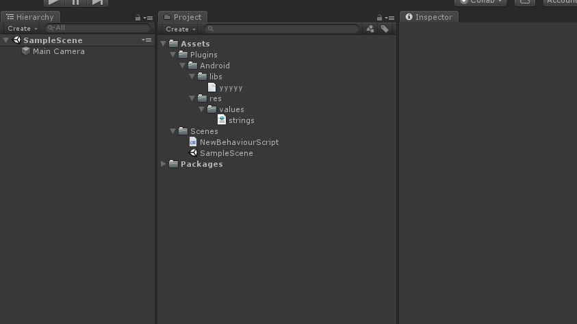

# Unity3d

## 入门

+ [C#（重要）](../C#.md)
+ [官方文档](https://docs.unity3d.com/cn/2019.2/Manual/index.html)
+ [第三方学习文档](http://c.biancheng.net/unity3d/)

## Android

### 参考文章

+ [Unity通过NDK、JNI实现C#、java、C/C++之间的相互调用](https://linxinfa.blog.csdn.net/article/details/108642977)
+ [真机调试Unity3D App](https://blog.csdn.net/seikenwu/article/details/81025964)
+ [Unity3d Android SDK接入](https://blog.csdn.net/yang8456211/article/details/51331358)

### 接入方式（2种）

+ 一种是把Unity的工程导出google project的形式进行接入
+ 另一种是通过把Android的工程做成Plugins的形式进行接入

| 类别（形式） | google project                                   | U3d Plugins                      |
| ------------ | ------------------------------------------------ | -------------------------------- |
| 优点         | 容易理解、方便接入原生SDK、几乎所有SDK都可以接入 | 接入方便、容易在Unity中          |
| 缺点         | 接入比较繁琐，对U3d项目不友好                    | 不是所有SDK都提供U3d Plugins形式 |
| apk导出      | Android IDE导出                                  | Unity 导出                       |

### 安卓Java层交互（第二种接入方式）

+ 安卓Java层需要打包成jar或者aar文件提供给unity3D层。

+ 资源目录如下

  

  - Plugins：assets 下的根目录(下面可能有Android或者IOS) 
  - Android：主目录 
  - bin：放中间件的工程（我们没有建立MyActivity的中间件，如果有的话放在这里） 
  - libs：放所有jar包或者arr包（目前推荐使用aar包，也可以直接放在Android目录下）
  - res：放所需要的资源

#### Java代码（安卓层）

```java
package com.lucky.u3dlearn;

import android.app.Activity;
import android.app.AlertDialog;
import android.content.Context;
import android.content.DialogInterface;
import android.widget.Toast;

/**
关于UnityPlayer对象，需要从unity3D中拿到class.jar引入到当前目录下，该包下面还有UnityPlayerActivity

Unity版本为5.0之前时，classes.jar的路径：
unity的安装路径\Editor\Data\PlaybackEngines\androidplayer\bin下的classes.jar
Unity版本为5.0及其之后时，classes.jar的路径：
unity的安装路径\Editor\Data\PlaybackEngines\AndroidPlayer\Variations\mono
\Release\Classes
**/
import com.unity3d.player.UnityPlayer;

public class CallMethod {
    private static Context unityContext;
    private static Activity unityActivity;
    private static AlertDialog.Builder alert;

    //init方法，用来传入上下文
    public static void init(Context paramContext) {
        unityContext = paramContext.getApplicationContext();
        unityActivity = (Activity) paramContext;
    }

    //传入两个数返回他们的和
    public static int add(int arg0, int arg1) {
        sendMsgToUnity3D();   //回复消息给Unity3D
        return arg0 + arg1;
    }

    //传入msg，弹出一个Toast提示（unity3D线程，子线程）
    public static void showMessage(final String msg) {

        unityActivity.runOnUiThread(new Runnable() {
            public void run() {
                Toast.makeText(unityContext, msg, Toast.LENGTH_LONG).show();
            }
        });

    }

    //弹出一个提示窗口，窗口需要的文字信息从strings.xml里面获取，点击确认关闭（unity3D线程，子线程）
    public static void showAlertView() {
        alert = new AlertDialog.Builder(unityActivity).setTitle("弹出窗口").setMessage(unityContext.getResources().getIdentifier("msgAlert", "string", unityContext.getPackageName())).setPositiveButton("确认", new DialogInterface.OnClickListener() {
            @Override
            public void onClick(DialogInterface arg0, int arg1) {
                // TODO Auto-generated method stub
                unityActivity.finish();
            }
        });


        unityActivity.runOnUiThread(new Runnable() {
            public void run() {
                alert.show();
            }
        });
    }

    /**
    回复消息给Unity3D
    UnitySendMessage（“string”，“string”， ***），这是方法，我们至少需要传入两个参数，第一个参数为unity中的一个gameobject名称，第二个参数为这个gameobject身上捆绑的脚本中的一个方法，而第三参数事实上是这个对应方法上的参数，有没有参数就看你了。
    **/
    private static void sendMsgToUnity3D() {
        UnityPlayer.UnitySendMessage("Main Camera", "AndroidCallBack", "计算完成,我是Android层的消息");
    }
}
```

#### C#代码（Unity3D层）

```c#
using System.Collections;
using System.Collections.Generic;
using UnityEngine;

public class NewBehaviourScript : MonoBehaviour
{
    void Awake()
    {
        Debug.Log("Awake");
    }

    AndroidJavaClass unityPlayer;
    AndroidJavaObject currentActivity;
    AndroidJavaClass androidCall;

    void Start()
    {
        //获取unityplayer类
        unityPlayer = new AndroidJavaClass("com.unity3d.player.UnityPlayer");   
        //获取当前Activity，GetStatic相当于获取静态变量
        currentActivity = unityPlayer.GetStatic<AndroidJavaObject>("currentActivity");  
        //获取Java层的CallMethod类
        androidCall = new AndroidJavaClass("com.lucky.u3dlearn.CallMethod");  
        //调用Java层的CallMethod对象的init方法。第一个方法名，第二个为入参,CallStatic相当于获取静态方法
        androidCall.CallStatic("init", currentActivity);  
    }

    // Update is called once per frame
    void Update()
    {
        Debug.Log("Update");
    }

    private void OnDestroy()
    {
        Debug.Log("OnDestroy");
    }

    private void OnApplicationQuit()
    {
        Debug.Log("OnApplicationQuit");
    }

    void OnGUI()
    {
        if (GUILayout.Button("加法", GUILayout.Height(200),GUILayout.Width(300)))   //按钮
        {
            int sum = androidCall.CallStatic<int>("add", 1, 2);
            Debug.Log("sum is " + sum);
        }
        if (GUILayout.Button("吐司", GUILayout.Height(200), GUILayout.Width(300)))
        {
            androidCall.CallStatic("showMessage","我调用安卓的吐司");
        }
        if (GUILayout.Button("弹窗", GUILayout.Height(200), GUILayout.Width(300)))
        {
            androidCall.CallStatic("showAlertView");
        }
    }

    //Java层回调Unity层的代码
    public void AndroidCallBack(string message) {
        Debug.Log(message);  
    }
}
```

#### 回调接口（AndroidJavaProxy）

```c#
//Android端，定义接口
package com.example.android;
public interface PluginCallback {
    public void onSuccess(String videoPath);
    public void onError(String errorMessage);
}

//Android端，入参方法
package com.example.android.MyPlugin;
public void myPluginMethod(PluginCallback callback) {
    // Do something
    callback.onSuccess("onSuccess");
    // Do something horrible
    callback.onError("onError");
}

//在unity中c#脚本中实现android接口
class AndroidPluginCallback : AndroidJavaProxy
    {
//android接口包名不能出错：com.example.android.PluginCallback
        public AndroidPluginCallback() : base("com.example.android.PluginCallback") { }

        public void onSuccess(string videoPath) {
            Debug.Log("ENTER callback onSuccess: " + videoPath);
        }
        public void onError(string errorMessage)
        {
            Debug.Log("ENTER callback onError: " + errorMessage);
        }
    }

//在unity中调用android接口 untiy与android互相交互
AndroidJavaObject pluginClass = new AndroidJavaObject("com.example.android.MyPlugin");
pluginClass.Call("myPluginMethod", new AndroidPluginCallback());//c#中调用android接口
```

### 安卓Native层交互

#### C/C++（Android层）

```c++
/**
c语言中可以直接写
c++中需要用extern "C"{} 包住,因为c++中的方法会生成符号表,方法名可能会被改变
**/

//下面是cpp代码
#include <jni.h>

using namespace std;

//测试代码
extern "C"
JNIEXPORT jstring JNICALL
Java_com_lucky_aardemo_HelloWorld_helloWorld2(JNIEnv *env, jobject thiz) {
    // TODO: implement helloWorld2()
    return env->NewStringUTF("hello,world2");
}

//测试代码
extern "C"
JNIEXPORT jstring JNICALL
Java_com_lucky_aardemo_HelloWorld_helloWorld(JNIEnv *env, jobject thiz) {
    // TODO: implement helloWorld()
    return env->NewStringUTF("Hello,World");
}

//暴露给Unity层的方法，Unity可以调用该方法
extern "C" {
int getAndroidData() {
    return 10;
}    
}

//以下是Unity3D调用该方法，然后回调给Unity层
extern "C"{
typedef struct Parameter {
    int a;
    int b;
} Param;


typedef void (*CallBack)(Param* p);

//Unity可以调用该方法，然后回调给unity层
void TestFunc(CallBack cb){
    Param p;
    p.a = 10;
    p.b = 20;
    //LOGE("a = %d ; b =  %d\n",p.a,p.b);
    cb(&p);
}
}
```

#### C#（Unity层）

```c#
using AOT;
using System;
using System.Runtime.InteropServices;
using UnityEngine;

public class NewBehaviourScript : MonoBehaviour
{
    void Awake()
    {
        Debug.Log("Awake");
    }

    void OnGUI()
    {
        if (GUILayout.Button("调用C++代码", GUILayout.Height(200), GUILayout.Width(300)))
        {
            Debug.Log("Android C++ " + getAndroidData());   //调用安卓so中的getAndroidData方法
        }
        if (GUILayout.Button("回调方法", GUILayout.Height(200), GUILayout.Width(300)))
        {
            TestFunc(CallBackFunc);   //调用安卓so中的TestFunc用来触发回调方法CallBackFunc
        }
    }

    public void AndroidCallBack(string message) {
        Debug.Log(message);
    }

    [DllImport("u3d")]   //导入so库，so库为libu3d.so
    public static extern int getAndroidData();   //

    [StructLayout(LayoutKind.Sequential)]
    struct Parameter
    {
        public int a;
        public int b;
    }

    delegate void CallBack(IntPtr param);

    [DllImport("u3d")]
    static extern void TestFunc(CallBack cb);

    [MonoPInvokeCallback(typeof(CallBack))]   //回调方法
    static void CallBackFunc(IntPtr param)
    {
        Parameter p = (Parameter)Marshal.PtrToStructure(param, typeof(Parameter));
        Debug.Log("a:" + p.a + " b:" + p.b);
    }
}
```

