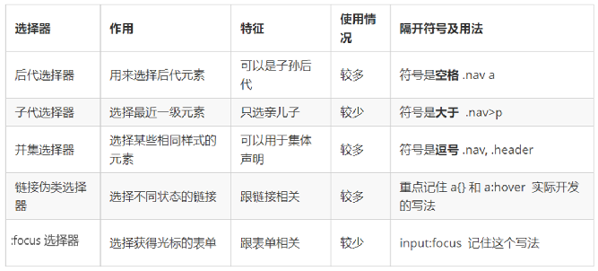
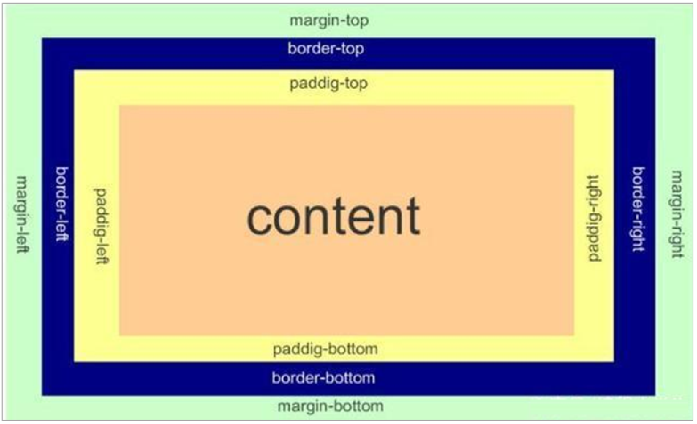

<!-- START doctoc generated TOC please keep comment here to allow auto update -->
<!-- DON'T EDIT THIS SECTION, INSTEAD RE-RUN doctoc TO UPDATE -->
**Table of Contents**  *generated with [DocToc](https://github.com/thlorenz/doctoc)*

- [HTML](#html)
  - [常用标签](#%E5%B8%B8%E7%94%A8%E6%A0%87%E7%AD%BE)
    - [例子](#%E4%BE%8B%E5%AD%90)
  - [表格标签](#%E8%A1%A8%E6%A0%BC%E6%A0%87%E7%AD%BE)
  - [列表标签](#%E5%88%97%E8%A1%A8%E6%A0%87%E7%AD%BE)
    - [无序列表（重要）](#%E6%97%A0%E5%BA%8F%E5%88%97%E8%A1%A8%E9%87%8D%E8%A6%81)
      - [例子](#%E4%BE%8B%E5%AD%90-1)
    - [有序列表（理解）](#%E6%9C%89%E5%BA%8F%E5%88%97%E8%A1%A8%E7%90%86%E8%A7%A3)
      - [例子](#%E4%BE%8B%E5%AD%90-2)
    - [自定义列表（重点）](#%E8%87%AA%E5%AE%9A%E4%B9%89%E5%88%97%E8%A1%A8%E9%87%8D%E7%82%B9)
      - [例子](#%E4%BE%8B%E5%AD%90-3)
  - [表单标签](#%E8%A1%A8%E5%8D%95%E6%A0%87%E7%AD%BE)
    - [input标签](#input%E6%A0%87%E7%AD%BE)
      - [例子](#%E4%BE%8B%E5%AD%90-4)
    - [label标签](#label%E6%A0%87%E7%AD%BE)
      - [例子](#%E4%BE%8B%E5%AD%90-5)
    - [select标签](#select%E6%A0%87%E7%AD%BE)
      - [例子](#%E4%BE%8B%E5%AD%90-6)
    - [textarea标签](#textarea%E6%A0%87%E7%AD%BE)
      - [例子](#%E4%BE%8B%E5%AD%90-7)
- [CSS](#css)
  - [入门](#%E5%85%A5%E9%97%A8)
  - [引入方式](#%E5%BC%95%E5%85%A5%E6%96%B9%E5%BC%8F)
    - [内部样式表（嵌入式）](#%E5%86%85%E9%83%A8%E6%A0%B7%E5%BC%8F%E8%A1%A8%E5%B5%8C%E5%85%A5%E5%BC%8F)
      - [例子](#%E4%BE%8B%E5%AD%90-8)
    - [行内样式表（行内式）](#%E8%A1%8C%E5%86%85%E6%A0%B7%E5%BC%8F%E8%A1%A8%E8%A1%8C%E5%86%85%E5%BC%8F)
      - [例子](#%E4%BE%8B%E5%AD%90-9)
    - [外部样式表（链接式）](#%E5%A4%96%E9%83%A8%E6%A0%B7%E5%BC%8F%E8%A1%A8%E9%93%BE%E6%8E%A5%E5%BC%8F)
      - [例子](#%E4%BE%8B%E5%AD%90-10)
  - [基础选择器](#%E5%9F%BA%E7%A1%80%E9%80%89%E6%8B%A9%E5%99%A8)
    - [标签选择器](#%E6%A0%87%E7%AD%BE%E9%80%89%E6%8B%A9%E5%99%A8)
      - [例子](#%E4%BE%8B%E5%AD%90-11)
    - [类选择器](#%E7%B1%BB%E9%80%89%E6%8B%A9%E5%99%A8)
      - [例子](#%E4%BE%8B%E5%AD%90-12)
    - [id选择器](#id%E9%80%89%E6%8B%A9%E5%99%A8)
      - [例子](#%E4%BE%8B%E5%AD%90-13)
    - [通配符选择器](#%E9%80%9A%E9%85%8D%E7%AC%A6%E9%80%89%E6%8B%A9%E5%99%A8)
  - [复合选择器](#%E5%A4%8D%E5%90%88%E9%80%89%E6%8B%A9%E5%99%A8)
    - [后代选择器（重要）](#%E5%90%8E%E4%BB%A3%E9%80%89%E6%8B%A9%E5%99%A8%E9%87%8D%E8%A6%81)
      - [例子](#%E4%BE%8B%E5%AD%90-14)
    - [子选择器（重要）](#%E5%AD%90%E9%80%89%E6%8B%A9%E5%99%A8%E9%87%8D%E8%A6%81)
      - [例子](#%E4%BE%8B%E5%AD%90-15)
    - [并集选择器（重要）](#%E5%B9%B6%E9%9B%86%E9%80%89%E6%8B%A9%E5%99%A8%E9%87%8D%E8%A6%81)
      - [例子](#%E4%BE%8B%E5%AD%90-16)
    - [伪类选择器](#%E4%BC%AA%E7%B1%BB%E9%80%89%E6%8B%A9%E5%99%A8)
      - [链接伪类选择器](#%E9%93%BE%E6%8E%A5%E4%BC%AA%E7%B1%BB%E9%80%89%E6%8B%A9%E5%99%A8)
        - [例子](#%E4%BE%8B%E5%AD%90-17)
      - [foucs伪类选择器](#foucs%E4%BC%AA%E7%B1%BB%E9%80%89%E6%8B%A9%E5%99%A8)
        - [例子](#%E4%BE%8B%E5%AD%90-18)
    - [总结](#%E6%80%BB%E7%BB%93)
  - [属性](#%E5%B1%9E%E6%80%A7)
    - [字体属性](#%E5%AD%97%E4%BD%93%E5%B1%9E%E6%80%A7)
      - [例子](#%E4%BE%8B%E5%AD%90-19)
    - [文本属性](#%E6%96%87%E6%9C%AC%E5%B1%9E%E6%80%A7)
      - [例子](#%E4%BE%8B%E5%AD%90-20)
    - [背景属性](#%E8%83%8C%E6%99%AF%E5%B1%9E%E6%80%A7)
      - [例子](#%E4%BE%8B%E5%AD%90-21)
  - [Emmet语法](#emmet%E8%AF%AD%E6%B3%95)
    - [快速生成HTML结构](#%E5%BF%AB%E9%80%9F%E7%94%9F%E6%88%90html%E7%BB%93%E6%9E%84)
    - [快速生成CSS样式](#%E5%BF%AB%E9%80%9F%E7%94%9F%E6%88%90css%E6%A0%B7%E5%BC%8F)
  - [元素显示模式](#%E5%85%83%E7%B4%A0%E6%98%BE%E7%A4%BA%E6%A8%A1%E5%BC%8F)
    - [块元素](#%E5%9D%97%E5%85%83%E7%B4%A0)
      - [例子](#%E4%BE%8B%E5%AD%90-22)
    - [行内元素](#%E8%A1%8C%E5%86%85%E5%85%83%E7%B4%A0)
      - [例子](#%E4%BE%8B%E5%AD%90-23)
    - [行内块元素](#%E8%A1%8C%E5%86%85%E5%9D%97%E5%85%83%E7%B4%A0)
      - [例子](#%E4%BE%8B%E5%AD%90-24)
    - [元素显示模式转换](#%E5%85%83%E7%B4%A0%E6%98%BE%E7%A4%BA%E6%A8%A1%E5%BC%8F%E8%BD%AC%E6%8D%A2)
      - [例子](#%E4%BE%8B%E5%AD%90-25)
  - [三大特性](#%E4%B8%89%E5%A4%A7%E7%89%B9%E6%80%A7)
    - [层叠性](#%E5%B1%82%E5%8F%A0%E6%80%A7)
      - [例子](#%E4%BE%8B%E5%AD%90-26)
    - [继承性](#%E7%BB%A7%E6%89%BF%E6%80%A7)
      - [例子](#%E4%BE%8B%E5%AD%90-27)
    - [优先级](#%E4%BC%98%E5%85%88%E7%BA%A7)
      - [例子](#%E4%BE%8B%E5%AD%90-28)
  - [盒子模型](#%E7%9B%92%E5%AD%90%E6%A8%A1%E5%9E%8B)
    - [网页布局的本质](#%E7%BD%91%E9%A1%B5%E5%B8%83%E5%B1%80%E7%9A%84%E6%9C%AC%E8%B4%A8)
    - [盒子模型的组成](#%E7%9B%92%E5%AD%90%E6%A8%A1%E5%9E%8B%E7%9A%84%E7%BB%84%E6%88%90)
      - [边框](#%E8%BE%B9%E6%A1%86)
        - [例子](#%E4%BE%8B%E5%AD%90-29)
      - [内边距](#%E5%86%85%E8%BE%B9%E8%B7%9D)
        - [例子](#%E4%BE%8B%E5%AD%90-30)
      - [外边距](#%E5%A4%96%E8%BE%B9%E8%B7%9D)
        - [例子](#%E4%BE%8B%E5%AD%90-31)
      - [清除内外边距](#%E6%B8%85%E9%99%A4%E5%86%85%E5%A4%96%E8%BE%B9%E8%B7%9D)
        - [例子](#%E4%BE%8B%E5%AD%90-32)
    - [圆角边框（重点）](#%E5%9C%86%E8%A7%92%E8%BE%B9%E6%A1%86%E9%87%8D%E7%82%B9)
      - [例子](#%E4%BE%8B%E5%AD%90-33)
    - [盒子阴影（重点）](#%E7%9B%92%E5%AD%90%E9%98%B4%E5%BD%B1%E9%87%8D%E7%82%B9)
      - [例子](#%E4%BE%8B%E5%AD%90-34)
    - [文字阴影（了解）](#%E6%96%87%E5%AD%97%E9%98%B4%E5%BD%B1%E4%BA%86%E8%A7%A3)
      - [例子](#%E4%BE%8B%E5%AD%90-35)

<!-- END doctoc generated TOC please keep comment here to allow auto update -->


# HTML
+ [MDN](https://developer.mozilla.org/zh-CN/)
+ [W3CSchool离线文档](W3CSchool.chm)
## 常用标签

```html
<!--
1.<!DOCTYPE> 	定义文档类型。
2.<html>	定义 HTML 文档。
3.<title>	定义文档的标题。
4.<body>	定义文档的主体。
5.<h1> to <h6>	定义 HTML 标题。
6.<p>	定义段落。
7.<br>	定义简单的折行。(是一个独目标记)
8.<hr>	定义水平线。(是一个独目标记)
9.<strong>和<b> 都是加粗标签,更推荐使用strong,语义更强烈
10.<em>和<i> 都是倾斜标签,更推荐使用em,语义更强烈
11.<del>和<s> 都是删除线标签,更推荐使用del,语义更强烈
12.<ins>和<u> 都是下划线标签,更推荐使用ins,语义更强烈
13.<div>和<span> 是没有语意的,他们就是一个盒子,用来装东西的,div标签用来布局的,但是一个div独占一行,大盒子
span标签也是用来布局的,可以一行放多个,小盒子

14.图像标签  格式：
src为图像的属性,必须属性
其他属性：
alt 文本  替换文本,图像不能显示展示的文本
title 文本  提示文本,鼠标放在图像上面显示的文字
width 像素 设置图像的宽度
height 像素 设置图像的高度
border 像素 设置图像的边框粗细

15.超链接标签 （重要） 格式： <a href="跳转目标" target="目标窗口的弹出方式">文本或者图像</a>
href为必须属性,链接目标的url地址,即可以是内部链接也可以是外部链接
traget 为目标 _self为默认值（当前页面打开）,_blank为在新窗口中的打开方式
链接分类：
外部链接 <a href="https://www.baidu.com">百度</a>
内部链接 <a href="index.html">首页</a>  打开当前路径下的index.html
空链接  <a href="#">首页</a>  当前没有确定链接目标
下载链接 如果链接是个文件或者压缩包时,会下载这个文件
网页元素链接 在网页中的各个网页元素,如文本、图像、视频、表格、音频都可以加链接
锚点链接  点击链接,可以快速定位到当前页面的某个位置
锚点链接实现步骤：
步骤一：在链接href属性中,设置属性值为#名字的形式,如<a href="#two">第二集</a>
步骤二：找到目标位置标签,里面添加一个id属性. 如<h3 id="two">第二集介绍></h3>

16.特殊字符
&nbsp;  空格
&lt;  <
&gt;  >
-->
```

### 例子

```html
<!--
<html> 元素是 HTML 页面的根元素
<head> 元素包含了文档的元（meta）数据，如 <meta charset="utf-8"> 定义网页编码格式为 utf-8。
<title> 元素描述了文档的标题
<body> 元素包含了可见的页面内容
 -->
<!DOCTYPE html>   <!--这句代码表示当前页面使用的是HTML5来显示网页,必须放在最上面,他是文档声明标签-->
<html lang="en">  <!--定义当前文档显示的语言,en表示英文,zh-CN表示中文-->
<head>
    <meta charset="UTF-8">   <!--规定HTML文档应该使用哪种字符编码-->
    <title>文档的标题</title>
</head>
<body>
  <h1>我是一级标题</h1>  <!--h标签是head的缩写-->
  <p>我是一个<br />段落</p>  <!--p标签是paragraph的缩写-->   <!--br标签（强制换行）是break的缩写,是个单标签,只有一个-->
  我是一个<strong>加粗</strong>文字  <!--strong标签是个文字加粗标签-->
  我是一个<em>倾斜</em>文字  <!--em标签是个文字倾斜标签-->
  我是一个<del>删除线</del>  <!--del标签是个删除线标签-->
  我是一个<ins>下划线</del>  <!--ins标签是个下划线标签-->

  <div>我是div</div>  <!--div标签是division的缩写,表示分割、分区-->
  <span>我是span</span>  <!--span意思为跨距跨度的意思-->
    第一个HTML
</body>
</html>
```

## 表格标签
```html
<!--
基本语法：
<table>
   <tr>
     <th>姓名</th>
   </tr>
   <tr> 
     <td>小李</td>
   </tr>
</table>

1.<table></table> 用于定义表格的标签
2.<tr></tr>标签用于定义表格中的行,必须嵌套在<table></table>中
3.<td></td>标签用于定义表格中的单元格,必须嵌套在<tr></tr>中
4.<th></th>标签一般用于表格的第一行第一列的单元格,与td单元格的区别是内容加粗居中显示

table标签属性:(实际开发不常用,一般使用CSS来设置,了解即可)
align   left、center、right  规定表格相对周围元素的对齐方式
border  1或者""  规定表格单元是否有边框,默认为"",没有边框
cellpadding  像素值  规定单元边沿与其内容之间的空白,默认1像素
cellspacing  像素值  规定单元格之间的空白,默认2像素
width   像素值或百分比  规定表格的宽度


<table>
  <thead>
   <tr>
     <th>姓名</th>
   <tr>
  <thead>
  <tbody>  
   <tr>   
     <td>小李</td>
   </tr>
  <tbody> 
</table>

1.<thead></thead> 用于定义表格的头部区域,内部必须拥有tr标签,位于第一行
2.<tbody></tbody> 用于定义表格的主体区域,主要用来存放数据本体


合并单元格：
跨行合并（rowspan="合并单元格个数"）
跨列合并（colspan="合并单元格个数"）
步骤：
1.先确定是跨行还是跨列
2.找到目标单元格,写上合并方式=合并的单元格数量. 比如<td colspan="2">  </td>
3.删除多余的单元格
-->
```

## 列表标签

### 无序列表（重要）
```html
<ul>
  <li>第一项</li>
  <li>第二项</li>
  <li>第三项</li>
</ul>

<!--
<ul></ul> 标签表示无序列表
<li></li> 标签表示列表项

1.无序列表的各个列表项之间没有顺序级别之分,是并列的
2.<ul></ul>只能嵌套<li></li>,直接在<ul></ul>标签中输入其他标签或者文字的做法是不允许的
3.<li></li>之间相当于一个容器,可容纳所有元素
-->
```

#### 例子
```html
<!DOCTYPE html>
<html lang="en">
<head>
    <meta charset="UTF-8">
    <meta name="viewport" content="width=device-width, initial-scale=1.0">
    <meta http-equiv="X-UA-Compatible" content="ie=edge">
    <title>无序列表</title>
</head>
<body>
    <h4>您喜欢的食物?</h4>
    <ul>
        <li>榴莲</li>
        <li>臭豆腐</li>
        <li>鲱鱼罐头</li>
        <li>
            <p>123</p>
        </li>
    </ul>
</body>
</html>
```

### 有序列表（理解）
```html
<ol>
  <li>第一项</li>
  <li>第二项</li>
  <li>第三项</li>
</ol>

<!--
  和无序列表差不多
-->
```

#### 例子
```html
<!DOCTYPE html>
<html lang="en">
<head>
    <meta charset="UTF-8">
    <meta name="viewport" content="width=device-width, initial-scale=1.0">
    <meta http-equiv="X-UA-Compatible" content="ie=edge">
    <title>有序列表(理解)</title>
</head>
<body>
    <h4>粉丝排行榜</h4>
    <ol>
        <li>刘德华 10000</li>
        <li>刘若英 1000</li>
        <li>pink老师 1</li>
    </ol>
</body>
</html>
```

### 自定义列表（重点）
```html
<dl>
  <dt>名词1</dt>
  <dd>名词1解释1</dd>
  <dd>名词1解释2</dd>
</dl>

<!--
<dl></dl> 标签表示自定义列表
<dt></dt> 标签表示定义项目或者名字
<dd></dd> 标签表示描述每一个项目/名字  
-->
```

#### 例子
```html
<!DOCTYPE html>
<html lang="en">
<head>
    <meta charset="UTF-8">
    <meta name="viewport" content="width=device-width, initial-scale=1.0">
    <meta http-equiv="X-UA-Compatible" content="ie=edge">
    <title>自定义列表(重点)</title>
</head>
<body>
    <dl>
        <dt>关注我们</dt>
        <dd>新浪微博</dd>
        <dd>官方微信</dd>
        <dd>联系我们</dd>
        <dt>关注我们</dt>
        <dd>新浪微博</dd>
        <dd>官方微信</dd>
        <dd>联系我们</dd>
    </dl>
</body>
</html>
```

## 表单标签
```html
<!--
表单=表单域+表单控件+提示信息（三个组成）

一、表单域
<form>标签用于定义表单域,以实现用户信息的收集和传递。<form>会把范围内的表单元素信息提交给服务器

<form action="url地址"  method="提交方式"  name="表单域名称">
   ....各种表单控件
</form>    

属性：
action  url地址  用于指定接收和处理表单数据的服务器url地址
method  get/post 用于设置表单数据的提交方式
name  名称    用于指定表单的名称,以区分同一个页面的多个表单域
-->
```

### input标签
```html
<!--
表单元素<input>标签用于收集用户的信息

<input type="属性值">
type属性不同值用来指定不同的控件类型
type属性值：
text 定义单行的输入字段,用户可以在其中输入文本。默认20个字符
password 定义密码字段。该字段中的字符被掩码。
radio 定义单选按钮
checkbox 定义多选框
submit 定义提交按钮,提交按钮会把表单数据发送给服务器
reset 定义重置按钮,重置按钮会清除表单类的所有数据
button 定义可点击按钮（多数情况下,用于通过JavaScript启动脚本）
file  定义输入字段和浏览按钮,供文件上传.

input属性：（除type属性外）
name    由用户自定义  定义input元素的名称
value   由用户自定义  规定input元素的值
checked  checked     规定此input元素首次加载时应被选中
maxlength 正整数     规定输入的字段中的字符的最大整数
name和value是每个表单元素都有的属性值,主要给后台人员使用
name表单元素的名字,要求单选框和复选框要有相同的name值
-->
```

#### 例子
```html
<!DOCTYPE html>
<html lang="en">
<head>
    <meta charset="UTF-8">
    <meta name="viewport" content="width=device-width, initial-scale=1.0">
    <meta http-equiv="X-UA-Compatible" content="ie=edge">
    <title>input 表单元素</title>
</head>
<body>
    <form action="xxx.php" method="get">
         <!-- text 文本框 用户可以里面输入任何文字 -->
        用户名: <input type="text" name="username" value="请输入用户名" maxlength="6">   <br> 
        <!-- password 密码框 用户看不见输入的密码 -->
        密码: <input type="password" name="pwd" >  <br> 
        <!-- radio 单选按钮  可以实现多选一 -->
        <!-- name 是表单元素名字 这里性别单选按钮必须有相同的名字name 才可以实现多选1 -->
        <!-- 单选按钮和复选框可以设置checked 属性, 当页面打开的时候就可以默认选中这个按钮 -->
        性别: 男 <input type="radio" name="sex" value="男"> 女  <input type="radio" name="sex" value="女" checked="checked"> 人妖   <input type="radio" name="sex" value="人妖">   <br> 
        <!-- checkbox 复选框  可以实现多选 -->
        爱好: 吃饭 <input type="checkbox" name="hobby" value="吃饭"> 睡觉 <input type="checkbox" name="hobby">  打豆豆 <input type="checkbox" name="hobby" checked="checked"> 
        <br> 
        <!-- 点击了提交按钮,可以把 表单域 form 里面的表单元素 里面的值 提交给后台服务器 -->
        <input type="submit" value="免费注册">
        <!-- 重置按钮可以还原表单元素初始的默认状态 -->
        <input type="reset" value="重新填写">
        <!-- 普通按钮 button  后期结合js 搭配使用-->
        <input type="button" value="获取短信验证码"> <br>
        <!-- 文件域 使用场景 上传文件使用的 -->
        上传头像:  <input type="file" >
    </form>
</body>
</html>
```

### label标签
```html
<!--
<label>标签用于绑定一个表单元素,当点击<label>标签的文本时,浏览器会自动将焦点(光标)转到或者选择对应的表单元素上,用来增加用户体验  
语法：
<label for="名字">男</label>
<input type="radio" name="sex" id="名字">
for和id要一样才能建立连接
-->
```

#### 例子
```html
<!DOCTYPE html>
<html lang="en">
<head>
    <meta charset="UTF-8">
    <meta name="viewport" content="width=device-width, initial-scale=1.0">
    <meta http-equiv="X-UA-Compatible" content="ie=edge">
    <title>label标签</title>
</head>
<body>
   <label for="text"> 用户名:</label> <input type="text" id="text" >
   <input type="radio" id="nan" name="sex"> <label for="nan">男</label>
   <input type="radio" id="nv"  name="sex"> <label for="nv">女</label>
</body>
</html>
```

### select标签
```html
<!--
页面中,有多个选项让用户选择,并且想要节约页面空间,我们可以使用<select>标签控件来定义下拉框

语法：
<select>
   <option>选项1</option>
   <option>选项2</option>
   <option>选项3</option>
</select>
1.<select>至少包含一对<option>标签
2.在<option>中定义selecte="selected"时,当前项默认为选中项
-->
```

#### 例子
```html
<!DOCTYPE html>
<html lang="en">
<head>
    <meta charset="UTF-8">
    <meta name="viewport" content="width=device-width, initial-scale=1.0">
    <meta http-equiv="X-UA-Compatible" content="ie=edge">
    <title>select下拉表单</title>
</head>
<body>
    <form>
    籍贯: 
    <select>
        <option>山东</option>
        <option>北京</option>
        <option>天津</option>
        <option selected="selected">火星</option>
    </select>
</form>
</body>
</html>
```

### textarea标签
```html
<!--
当用户输入内容较多时,我们就不能使用文本框表单了,此时我们可以使用<textarea>标签.<textarea>标签用于定义多行文本输入的控件.
语法：(row和cols不需要记)
<textarea row="3" cols="20">
文本内容
</textarea>
-->
```

#### 例子
```html
<!DOCTYPE html>
<html lang="en">
<head>
    <meta charset="UTF-8">
    <meta name="viewport" content="width=device-width, initial-scale=1.0">
    <meta http-equiv="X-UA-Compatible" content="ie=edge">
    <title>textarea 文本域</title>
</head>
<body>
    <form>
        今日反馈:
        <textarea cols="50" rows="5">pink老师,我知道这个反馈留言是textarea来做的 </textarea>
    </form>
</body>
</html>
```

# CSS

## 入门
```css
/* css的基础 */

h1 {
  color: red; 
  font-size: 12px
}

/*
CSS规则主要由两部分组成：选择器以及一条或者多条声明

1.选择器用于指定CSS样式的HTML标签,花括号内是对该对象设置的具体样式
2.属性和属性值是以键值对的形式出现
3.属性是对指定对象设置的样式属性,例如字体大小,字体颜色等
4.属性和属性值之间用英文的":"隔开
5.多个键值对之间用英文的";"隔开
*/
```

## 引入方式

### 内部样式表（嵌入式）
```css
/*
内部样式表是写到html内部,是将所有CSS代码抽取出来,单独放到<style>标签中去

1.理论是可以放到HTML的任意位置,一般是放在<head>标签里面
2.此种方式,可以方便控制当前整个页面中的元素样式设置
3.代码结构清晰,但是结构和样式并没有完全分离
4.这种方式一般是练习时候使用,不推荐
*/
```

#### 例子
```css
<!DOCTYPE html>
<html lang="en">
<head>
    <meta charset="UTF-8">
    <title>内部样式表</title>
    <style>
            div {
                color: pink;
            }
     </style>
</head>
<body>
    <div>所谓内部样式表,就是在html页面内部写样式,但是是单独写到style标签内部.</div>
</body>
</html>
```

### 行内样式表（行内式）
```css
/*
行内样式表是在元素标签内部的style属性中设定CSS样式.适用于简单修改样式

1.style其实就是标签的属性
2.在双引号中间,写法要符合CSS样式
3.可以控制当前的标签设置样式
4.不推荐大量使用,只有对当前元素添加简单样式的时候,可以考虑使用
*/
```

#### 例子
```css
<!DOCTYPE html>
<html lang="en">
<head>
    <meta charset="UTF-8">
    <meta name="viewport" content="width=device-width, initial-scale=1.0">
    <meta http-equiv="X-UA-Compatible" content="ie=edge">
    <title>行内样式表</title>
</head>
<body>
        <p>夏天夏天悄悄过去留下小秘密</p>

        <p>压心底压心底不能告诉你</p>
        
        <p> 晚风吹过温暖我心底我又想起你</p>
        
        <p> 多甜蜜多甜蜜怎能忘记</p>
        
        <p>不能忘记你把你写在日记里</p>
        
        <p>不能忘记你心里想的还是你</p>
        
        <p>浪漫的夏季还有浪漫的一个你</p>
        
        <p style="color: pink; font-size: 20px;">给我一个粉红的回忆</p>
</body>
</html>
```

### 外部样式表（链接式）
```css
/*
实际开发都是外部样式表,核心是：样式单独写道CSS中,之后把CSS文件引入到HTML中使用

引入外部样式表步骤：
步骤一：新建一个后缀名为.css的样式文件,把所有CSS代码都放到此文件中
步骤二：在HTML页面中,使用<link>标签引入这个文件,
<link rel="stylesheet"  href="css路径">
*/
```

#### 例子
```css
<!DOCTYPE html>
<html lang="en">
<head>
    <meta charset="UTF-8">
    <meta name="viewport" content="width=device-width, initial-scale=1.0">
    <meta http-equiv="X-UA-Compatible" content="ie=edge">
    <title>外部样式表</title>
    <link rel="stylesheet" href="style.css">
</head>
<body>
    <div>来呀~快活呀,反正有大把时间...</div>
</body>
</html>

/* CSS文件 style.css*/
/* 这css文件里面只有样式没有标签 */
div {
    color:  pink;
}
```

## 基础选择器

### 标签选择器
```css
/*
标签选择器是指用HTML标签名称作为选择器,按标签名称分类,为页面中某一类标签指定统一的CSS格式

语法：
标签名{
  属性1：属性值1;
  属性2：属性值2;
  属性3：属性值3;
}
*/
```

#### 例子
```css
<!DOCTYPE html>
<html lang="en">
<head>
    <meta charset="UTF-8">
    <title>基础选择器之标签选择器</title>
    <style>
    /* 标签选择器 : 写上标签名 */
    p {
        color: green;
    }
    div {
        color: pink;
    }
    </style>
</head>
<body>
    <p>男生</p>
    <p>男生</p>
    <p>男生</p>
    <div>女生</div>
    <div>女生</div>
    <div>女生</div>
</body>
</html>
```

### 类选择器
```css
/*
类选择器是指可以选一个或多个标签
类选择器在HTML中以class属性表示,在CSS中,类选择器以一个点"."号显示

语法：
.类名{
  属性1：属性值1;
  属性2：属性值2;
}

注意：
1.类选择器使用"."来标识,后面紧跟类名（自定义的名称）
2.可以理解为给这个标签起一个名字
3.长名称或词组可以使用中横线为选择器命名
4.不要使用纯数字、中文等命名,尽量使用英文字母来表示
5.命名要有意义,尽量是别人一眼就能知道这个类名的含义.

类选择器(多类名)
<div class="red font">你好</div>
1.在属性class中写多个类名
2.多个类名中间使用空格隔开
使用场景：
1.可以把一些标签元素相同的的样式（共同的部分）放到一个类里面
2.这些标签都可以调用这个公共的类,然后再调用自己独有的类
*/
```

#### 例子
```css
<!DOCTYPE html>
<html lang="en">
<head>
    <meta charset="UTF-8">
    <title>基础选择器之类选择器</title>
    <style>
        /* 类选择器口诀: 样式点定义  结构类(class)调用  一个或多个 开发最常用*/
      .red {
          color: red;
      }
      .star-sing {
        color: green;
      }
      .memeda {  
         color: pink;
      }
    </style>
</head>
<body>
    <ul>
        <li class="red">冰雨</li>
        <li class="red">来生缘</li>
        <li>李香兰</li>
        <li class="memeda">生僻字</li>
        <li class="star-sing">江南style</li>
    </ul>
    <div class="red">我也想变红色</div>
</body>
</html>

/*  多类名的使用场景*/
<!DOCTYPE html>
<html lang="en">
<head>
    <meta charset="UTF-8">
    <meta name="viewport" content="width=device-width, initial-scale=1.0">
    <meta http-equiv="X-UA-Compatible" content="ie=edge">
    <title>利用类选择器画三个盒子</title>
    <style>
        .box {
            width: 150px;
            height: 100px;
            font-size: 30px;
        }
        .red {
        
            /* 背景颜色 */
            background-color: red;
        }
        .green {
           
            background-color: green;
        }
    </style>
</head>
<body>
    <div class="box red">红色</div>
    <div class="box green">绿色</div>
    <div class="box red">红色</div>
</body>
</html>
```

### id选择器
```css
/*
id选择器可以为标有特定id的HTML元素指定特定的样式
HTML元素以id属性来设置id选择器,CSS中id选择器以"#"来定义

语法：
#id名{
  属性:属性值;
  ......
}

id选择器和类选择器的区别：
1.类选择器好比人的名字,一个人可以有多个名字,同时一个名字可以被多个人使用
2.id选择器好比人的身份证号码,全中国是唯一的,不能重复.
3.id选择器和类选择器最大不同是在使用次数上.
4.类选择器在修改样式上使用的最多,id选择器一般用于唯一性的元素上,经常和JavaScript配合使用
*/
```

#### 例子
```css
<!DOCTYPE html>
<html lang="en">
<head>
    <meta charset="UTF-8">
    <title>基础选择器之id选择器</title>
    <style>
        /* id选择器的口诀: 样式#定义, 结构id调用, 只能调用一次, 别人切勿使用 */
      #pink {
          color: pink;
      }
    
    </style>
</head>
<body>
    <div id="pink">迈克尔·杰克逊</div>
    <div>pink老师</div>
</body>
</html>
```

### 通配符选择器
```css
/*
通配符选择器使用"*"定义,他表示获取页面所有元素(标签)

语法：
* {
  属性:属性值;
  ......
}
1.通配符不需要调用,自动就给所有元素使用样式
2.特殊情况下使用
*/
```

## 复合选择器
```css
/*
1.复合选择器是建立在基础选择器之上，对基本选择器进行组合形成的。 
​2.复合选择器是由两个或多个基础选择器，通过不同的方式组合而成的，可以更准确、更高效的选择目标元素（标签）
​3.常用的复合选择器包括：**后代选择器、子选择器、并集选择器、伪类选择器**等等
*/
```

### 后代选择器（重要）
```css
/*
后代选择器又称为包含选择器，可以选择父元素里面子元素。其写法就是把外层标签写在前面，内层标签写在后面，中间用空格分隔。当标签发生嵌套时，内层标签就成为外层标签的后代。

元素1 元素2{
   样式声明
}
1.上述语法表示选择元素1 里面的所有直接后代(子元素) 元素2。
2.元素1和元素2中间用空格隔开
3.元素1是父级,元素2是子集.最终选择的是元素2
4.元素2可以是儿子,也可以是孙子等,只要是元素1的后代就行
5.元素1和元素2可以是任意的基础选择器
*/
```

#### 例子
```css
<!DOCTYPE html>
<html lang="en">
<head>
    <meta charset="UTF-8">
    <title>复合选择器之后代选择器</title>
    <style>
        /* 我想要把ol里面的小li选出来改为pink */

        ol li {
            color: pink;
        }

        /* 中国 山东 济南 蓝翔 */
        ol li a {
            color: red;
        }

        .nav li a {
            color: yellow;
        }
    </style>
</head>
<body>
    <ol>
        变态写法
        <li>我是ol 的孩子</li>
        <li>我是ol 的孩子</li>
        <li>我是ol 的孩子</li>
        <li><a href="#">我是孙子</a></li>
    </ol>
    <ul>
        <li>我是ul 的孩子</li>
        <li>我是ul 的孩子</li>
        <li>我是ul 的孩子</li>
        <li><a href="#">不会变化的</a></li>
    </ul>
    <ul class="nav">
        <li>我是ul 的孩子</li>
        <li>我是ul 的孩子</li>
        <li>我是ul 的孩子</li>
        <li><a href="#">不会变化的</a></li>
        <li><a href="#">不会变化的</a></li>
        <li><a href="#">不会变化的</a></li>
        <li><a href="#">不会变化的</a></li>
    </ul>
</body>
</html>
```

### 子选择器（重要）
```css
/*
子元素选择器（子选择器）只能选择作为某元素的最近一级子元素。（简单理解就是选亲儿子元素）

元素1>元素2 { 样式声明 }
上述语法表示选择元素1 里面的所有直接后代(子元素) 元素2。

1.元素1 和 元素2 中间用 大于号 隔开
2.元素1 是父级，元素2 是子级，最终选择的是元素2
3.元素2 必须是亲儿子，其孙子、重孙之类都不归他管. 你也可以叫他 亲儿子选择器
*/
```

#### 例子
```css
<!DOCTYPE html>
<html lang="en">

<head>
    <meta charset="UTF-8">
    <title>复合选择器之子元素选择器</title>
    <style>
        .nav>a {
            color: red;
        }
    </style>
</head>
<body>
    <div class="nav">
        /* 只会选择这个 */
        <a href="#">我是儿子</a>
        <p>
            <a href="#">我是孙子</a>
        </p>
    </div>
</body>

</html>
```

### 并集选择器（重要）
```css
/*
并集选择器可以选择多组标签, 同时为他们定义相同的样式，通常用于集体声明。并集选择器是各选择器通过英文逗号（,）连接而成，任何形式的选择器都可以作为并集选择器的一部分。

元素1,元素2 { 声明样式 }
​上述语法表示选择元素1 和 元素2。

1. 元素1 和 元素2 中间用逗号隔开
2. 逗号可以理解为和的意思
3. 并集选择器通常用于集体声明
*/
```

#### 例子
```css
<!DOCTYPE html>
<html lang="en">

<head>
    <meta charset="UTF-8">
    <title>复合选择器之并集选择器</title>
    <style>
        /* 要求1: 请把熊大和熊二改为粉色 */
        /* div,
        p {
            color: pink;
        } */

        /* 要求2: 请把熊大和熊二改为粉色 还有 小猪一家改为粉色 */
        div,
        p,
        .pig li {
            color: pink;
        }

        /* 约定的语法规范,我们并集选择器喜欢竖着写 */
        /* 一定要注意,最后一个选择器 不需要加逗号 */
    </style>
</head>

<body>
    <div>熊大</div>
    <p>熊二</p>
    <span>光头强</span>
    <ul class="pig">
        <li>小猪佩奇</li>
        <li>猪爸爸</li>
        <li>猪妈妈</li>
    </ul>
</body>

</html>
```

### 伪类选择器
```css
/* 
伪类选择器用于向某些选择器添加特殊的效果，比如给链接添加特殊效果，或选择第1个，第n个元素。

伪类选择器书写最大的特点是用冒号（:）表示，比如 :hover 、 :first-child 。
*/
```

#### 链接伪类选择器
```css
/*
a:link	没有点击过的(访问过的)链接
​a:visited	点击过的(访问过的)链接
​a:hover	鼠标经过的那个链接
​a:active	鼠标正在按下还没有弹起鼠标的那个链接

链接伪类选择器注意事项
1.为了确保生效，请按照 LVHA 的循顺序声明 :link－:visited－:hover－:active。
2.记忆法：love hate 或者 lv 包包 hao 。
3.因为 a 链接在浏览器中具有默认样式，所以我们实际工作中都需要给链接单独指定样式。
*/
```

##### 例子
```css
<!DOCTYPE html>
<html lang="en">
<head>
    <meta charset="UTF-8">
    <title>复合选择器之链接伪类选择器</title>
    <style>
        /* 一定要按照下面的顺序来 */
        /* 1.未访问的链接 a:link  把没有点击过的(访问过的)链接选出来 */
        a:link {
            color: #333;
            text-decoration: none;
        }

        /*2. a:visited 选择点击过的(访问过的)链接 */
        a:visited {
            color: orange;
        }

        /*3. a:hover 选择鼠标经过的那个链接 */
        a:hover {
            color: skyblue;
        }

        /* 4. a:active 选择的是我们鼠标正在按下还没有弹起鼠标的那个链接 */
        a:active {
            color: green;
        }
    </style>
</head>
<body>
    <a href="#">小猪佩奇</a>
    <a href="http://www.xxxxxxxx.com">未知的网站</a>
</body>
</html>

/* 一般开发中使用的做法 */
<!DOCTYPE html>
<html lang="en">

<head>
    <meta charset="UTF-8">
    <title>复合选择器之链接伪类选择器</title>
    <style>
        body {
            color: red;

        }

        a {
            color: #333;
            text-decoration: none;
        }

        a:hover {
            color: #369;
            text-decoration: underline;
        }
    </style>
</head>

<body>
    <a href="#">小猪佩奇</a>
    <a href="http://www.xxxxxxxx.com">未知的网站</a>
</body>

</html>
```

#### foucs伪类选择器
```css
/*
:focus 伪类选择器用于选取获得焦点的表单元素。
焦点就是光标，一般情况 <input> 类表单元素才能获取,这个选择器是针对表单表单元素来说

input:focus {
  background-color: yellow;
}
*/
```

##### 例子
```css
<!DOCTYPE html>
<html lang="en">
<head>
    <meta charset="UTF-8">
    <title>focus伪类选择器</title>
    <style>
        /* // 把获得光标的input表单元素选取出来 */
        input:focus {
            background-color: pink;
            color: red;
        }
    </style>
</head>
<body>
    <input type="text">
    <input type="text">
    <input type="text">
</body>
</html>
```

### 总结


## 属性

### 字体属性
```css
/*

字体的复合属性：
body{
  font:font-style font-weight font-size/line-height font-family;
}
注意点：
1.使用font属性时,必须按照上面的语法格式的顺序书写,不能跟换顺序,并且各个属性间以空格隔开
2.不需要设置的属性可以省略,单必须保留font-size和font-family属性,否则font属性不起作用
*/
```

#### 例子
```css
/* 设置字体 */
<!DOCTYPE html>
<html lang="en">
<head>
    <meta charset="UTF-8">
    <title>CSS字体属性之字体系列</title>
    <style>
     h2 {
         font-family: '微软雅黑';
     }
     p {
        /* font-family: 'Microsoft YaHei', Arial, Helvetica, sans-serif; */
        font-family: 'Times New Roman', Times, serif;
     }
    </style>
</head>
<body>
    <h2>pink的秘密</h2>
    <p>那一抹众人中最漂亮的颜色,</p>
    <p>优雅,淡然,又那么心中清澈.</p>
    <p>前端总是伴随着困难和犯错,</p>
    <p>静心,坦然,攻克一个又一个.</p>
    <p>拼死也要克服它,</p>
    <p>这是pink的秘密也是老师最终的嘱托.</p>
</body>
</html>

/* 设置字体大小 */
<!DOCTYPE html>
<html lang="en">
<head>
    <meta charset="UTF-8">
    <title>CSS字体属性之字体大小</title>
    <style>
        body {
            font-size: 16px;
        }
        /* 标题标签比较特殊,需要单独指定文字大小 */
        h2 {
            font-size: 16px;
        }
    </style>
</head>
<body>
    <h2>pink的秘密</h2>
    <p>那一抹众人中最漂亮的颜色,</p>
    <p>优雅,淡然,又那么心中清澈.</p>
    <p>前端总是伴随着困难和犯错,</p>
    <p>静心,坦然,攻克一个又一个.</p>
    <p>拼死也要克服它,</p>
    <p>这是pink的秘密也是老师最终的嘱托.</p>
</body>
</html>

/* 设置字体粗细 */
<!DOCTYPE html>
<html lang="en">
<head>
    <meta charset="UTF-8">
    <title>CSS字体属性之字体大小</title>
    <style>
       .bold {
           /* font-weight: bold; */
           /* 这个700 的后面不要跟单位  等价于 bold 都是加粗的效果 */
           /* 实际开发中,我们跟提倡使用数字 表示加粗或者变细 */
           font-weight: 700;    
       }
       h2 {
           font-weight: 400;   
           /* font-weight: normal;    */
       }
    </style>
</head>
<body>
    <h2>pink的秘密</h2>
    <p>那一抹众人中最漂亮的颜色,</p>
    <p>优雅,淡然,又那么心中清澈.</p>
    <p>前端总是伴随着困难和犯错,</p>
    <p>静心,坦然,攻克一个又一个.</p>
    <p class="bold">拼死也要克服它,</p>
    <p>这是pink的秘密也是老师最终的嘱托.</p>
</body>
</html>

/* 设置字体风格（倾斜还是正常）*/
<!DOCTYPE html>
<html lang="en">
<head>
    <meta charset="UTF-8">
    <title>CSS字体属性之文字样式(风格)</title>
    <style>
      p {
          font-style: italic;
      }
      em {
          /* 让倾斜的字体不倾斜   就是赶紧脉动回来 */
          font-style: normal;
      }
    </style>
</head>
<body>
    <p>同学,上课时候的你</p>
    <em>下课时候的你</em>
</body>
</html>

/* 设置字体复合属性 */
<!DOCTYPE html>
<html lang="en">
<head>
    <meta charset="UTF-8">
    <title>CSS字体属性之复合属性</title>
    <style>
       /* 想要div文字变倾斜 加粗 字号设置为16像素 并且 是微软雅黑 */
       div {
           /* font-style: italic;
           font-weight: 700;
           font-size: 16px;
           font-family: 'Microsoft yahei'; */
           /* 复合属性: 简写的方式  节约代码 */
           /* font: font-style  font-weight  font-size/line-height  font-family; */
           /* font: italic 700 16px 'Microsoft yahei'; */
           font: 20px '黑体';
       }
    </style>
</head>
<body>
   <div>三生三世十里桃花,一心一意百行代码</div>
</body>
</html>
```

### 文本属性
```css
/*
文本属性可定义文本的外观,比如文本的颜色、对齐文本、装饰文本、文本缩进、行间距等
color 文本颜色
text-align 文本对齐属性
text-decoration 装饰器,可以给文本添加下划线、删除线、上划线等,设置none去除下划线
text-indent 文本缩进
line-geight 行间距
*/
```

#### 例子
```css
/* 文本颜色 */
<!DOCTYPE html>
<html lang="en">
<head>
    <meta charset="UTF-8">
    <title>CSS文本外观属性之颜色</title>
    <style>
       div {
           /* color: deeppink; */
           /* color: #cc00ff; */
           color: rgb(255, 0, 255);
       }
    </style>
</head>
<body>
   <div>听说喜欢pink色的男生,都喜欢男人</div>
</body>
</html>

/* 文本对齐 */
<!DOCTYPE html>
<html lang="en">
<head>
    <meta charset="UTF-8">
    <title>CSS文本外观之文字对齐</title>
    <style>
        h1 {
            /* 本质是让h1盒子里面的文字水平居中对齐 */
            /* text-align: center; */
            text-align: right;
        }
    </style>
</head>
<body>
    <h1>居中对齐的标题</h1>
</body>
</html>

/* 文本装饰 */
<!DOCTYPE html>
<html lang="en">
<head>
    <meta charset="UTF-8">
    <title>CSS文本外观之装饰文本</title>
    <style>
       div {
           /* 下划线 */
           /* text-decoration: underline;   */
         /* 删除线 */
           text-decoration: line-through;
           /* 上划线 */
           text-decoration: overline;

       }
       a {
           /* 取消a默认的下划线 */
           text-decoration: none;
           color: #333;
       }
    </style>
</head>
<body>
    <div>粉红色的回忆</div>
    <a href="#">粉红色的回忆</a>
</body>
</html>

/* 文本缩进 */
<!DOCTYPE html>
<html lang="en">
<head>
    <meta charset="UTF-8">
    <title>CSS文本外观之文本缩进</title>
    <style>
        p {
            font-size: 24px;
            /* 文本的第一行首行缩进 多少距离  */
            /* text-indent: 20px; */
            /* 如果此时写了2em 则是缩进当前元素 2个文字大小的距离  */
            text-indent: 2em;  
        }
    </style>
</head>
<body>
        <p>打开北京、上海与广州的地铁地图，你会看见三张纵横交错的线路网络，这代表了中国最成熟的三套城市轨道交通系统。</p>

       <p> 可即使这样，在北上广生活的人依然少不了对地铁的抱怨，其中谈及最多的问题便是拥挤——对很多人而言，每次挤地铁的过程，都像是一场硬仗。更何况，还都是败仗居多。</p>
        
       <p> 那么，当越来越多的二线甚至三线城市迎接来了自己的地铁，中国哪里的地铁是最拥挤的呢？</p>
</body>
</html>

/* 行间距 */
<!DOCTYPE html>
<html lang="en">
<head>
    <meta charset="UTF-8">
    <title>CSS文本外观之行间距</title>
    <style>
       div {
           line-height: 26px;
       }
       p {
           line-height: 25px;
       }
    </style>
</head>
<body>
    <div>中国人</div>
       <p>打开北京、上海与广州的地铁地图，你会看见三张纵横交错的线路网络，这代表了中国最成熟的三套城市轨道交通系统。</p>

       <p> 可即使这样，在北上广生活的人依然少不了对地铁的抱怨，其中谈及最多的问题便是拥挤——对很多人而言，每次挤地铁的过程，都像是一场硬仗。更何况，还都是败仗居多。</p>
        
       <p> 那么，当越来越多的二线甚至三线城市迎接来了自己的地铁，中国哪里的地铁是最拥挤的呢？</p>
</body>
</html>
```

### 背景属性
```css
/*
通过 CSS 背景属性，可以给页面元素添加背景样式。背景属性可以设置背景颜色、背景图片、背景平铺、背景图片位置、背景图像固定等。

背景颜色：
background-color 定义元素的背景颜色（元素背景颜色默认值是 transparent（透明））
语法：
background-color: 颜色值;

背景图片:
background-image  定义元素的背景图片
实际开发常见于 logo 或者一些装饰性的小图片或者是超大的背景图片, 优点是非常便于控制位置. (精灵图也是一种运用场景)
语法：
background-image: none | url (url)
注意：背景图片后面的地址，千万不要忘记加 URL， 同时里面的路径不要加引号。

背景平铺：
background-repeat 设置元素背景图像的平铺 
background-repeat：repeat | no-repeat | repeat-x | repeat-y

背景图片位置：
background-position 属性可以改变图片在背景中的位置
语法：
background-position: x y
参数代表的意思是：x 坐标和 y 坐标。 可以使用 方位名词 或者 精确单位
1、参数是方位名词
如果指定的两个值都是方位名词，则两个值前后顺序无关，比如 left  top 和 top  left 效果一致
如果只指定了一个方位名词，另一个值省略，则第二个值默认居中对齐
2、参数是精确单位
如果参数值是精确坐标，那么第一个肯定是 x 坐标，第二个一定是 y 坐标
如果只指定一个数值，那该数值一定是 x 坐标，另一个默认垂直居中
3、参数是混合单位
如果指定的两个值是精确单位和方位名词混合使用，则第一个值是 x 坐标，第二个值是 y 坐标

背景图片固定:
background-attachment 属性设置背景图像是否固定或者随着页面的其余部分滚动。
background-attachment 后期可以制作视差滚动的效果。
语法：
background-attachment : scroll | fixed
1.scroll 背景图像是随对象内容滚动
2.fixed 背景图像固定

背景样式合写：
background: 背景颜色 背景图片地址 背景平铺 背景图像滚动 背景图片位置;

背景半透明：
CSS3 提供了背景颜色半透明的效果。 
语法：
background: rgba(0,0,0,0.3)
1.最后一个参数是 alpha 透明度，取值范围在 0~1之间
2.我们习惯把 0.3 的 0 省略掉，写为 background: rgba(0, 0, 0, .3);

注意：
1.背景半透明是指盒子背景半透明，盒子里面的内容不受影响
2.CSS3 新增属性，是 IE9+ 版本浏览器才支持的，但是现在实际开发,我们不太关注兼容性写法了,可以放心使用
*/
```

#### 例子
```css
/* 背景颜色 */
<!DOCTYPE html>
<html lang="en">
<head>
    <meta charset="UTF-8">
    <title>背景颜色</title>
    <style>
        div {
            width: 200px;
            height: 200px;
            /* background-color: transparent;   透明的 清澈的  */
            /* background-color: red; */
            background-color: pink;
        }
    </style>
</head>
<body>
    <div></div>
</body>
</html>

/* 背景图片 */
<!DOCTYPE html>
<html lang="en">
<head>
    <meta charset="UTF-8">
    <title>背景图片</title>
    <style>
        div {
            width: 300px;
            height: 300px;
            /* 不要落下 url()   */
            background-image: url(images/logo.png);
        }
    </style>
</head>
<body>
    <div></div>
</body>
</html>

/* 背景平铺 */
<!DOCTYPE html>
<html lang="en">
<head>
    <meta charset="UTF-8">
    <title>背景图片平铺</title>
    <style>
        div {
            width: 300px;
            height: 300px;
            background-color: pink;
            background-image: url(images/logo.png);
            /* 1.背景图片不平铺 */
            /* background-repeat: no-repeat; */
            /* 2.默认的情况下,背景图片是平铺的 */
            /* background-repeat: repeat; */
            /* 3. 沿着x轴平铺 */
            /* background-repeat: repeat-x; */
            /* 4. 沿着Y轴平铺 */
            background-repeat: repeat-y;
            /* 页面元素既可以添加背景颜色也可以添加背景图片 只不过背景图片会压住背景颜色 */
        }
    </style>
</head>
<body>
    <div></div>
</body>
</html>

/* 背景图片方位名词 */
<!DOCTYPE html>
<html lang="en">
<head>
    <meta charset="UTF-8">
    <title>背景位置-方位名词</title>
    <style>
        div {
            width: 300px;
            height: 300px;
            background-color: pink;
            background-image: url(images/logo.png);
            background-repeat: no-repeat;
            /* background-position:  方位名词; */
            /* background-position: center top; */
            /* background-position: right center; */
            /* 如果是方位名词  right center 和 center right 效果是等价的 跟顺序没有关系 */
            /* background-position: center right; */
            /* 此时 水平一定是靠右侧对齐  第二个参数省略 y 轴是 垂直居中显示的 */
            /* background-position: right; */
            /* 此时 第一个参数一定是 top y轴 顶部对齐   第二个参数省略x  轴是 水平居中显示的 */
            background-position: top;
        }
    </style>
</head>
<body>
    <div></div>
</body>
</html>

/* 背景图片精确单位 */
<!DOCTYPE html>
<html lang="en">
<head>
    <meta charset="UTF-8">
    <title>背景位置-精确单位</title>
    <style>
        div {
            width: 300px;
            height: 300px;
            background-color: pink;
            background-image: url(images/logo.png);
            background-repeat: no-repeat;
            /* 20px 50px; x轴一定是 20  y轴一定是 50 */
            /* background-position: 20px 50px; */
            /* background-position: 50px 20px; */
            background-position: 20px;
        }
    </style>
</head>
<body>
    <div></div>
</body>
</html>

/* 背景图片混合模式 */
<!DOCTYPE html>
<html lang="en">
<head>
    <meta charset="UTF-8">
    <meta name="viewport" content="width=device-width, initial-scale=1.0">
    <meta http-equiv="X-UA-Compatible" content="ie=edge">
    <title>背景位置-混合单位</title>
    <style>
        div {
            width: 300px;
            height: 300px;
            background-color: pink;
            background-image: url(images/logo.png);
            background-repeat: no-repeat;
            /* 20px center  一定是x 为 20  y 是 center  等价于   background-position: 20px */
            /* background-position: 20px center; */
            /* 水平是居中对齐  垂直是 20 */
            background-position: center 20px;
        }
    </style>
</head>
<body>
    <div></div>
</body>
</html>

/* 背景图像固定 */
<!DOCTYPE html>
<html lang="en">
<head>
    <meta charset="UTF-8">
    <title>超大背景图片</title>
    <style>
        body {
            background-image: url(images/bg.jpg);
            background-repeat: no-repeat;
            background-position: center top;
            /* 把背景图片固定住 */
            background-attachment: fixed;
            color: #fff;
            font-size: 20px;
        }
    </style>
</head>
<body>
    <p>天王盖地虎, pink老师一米五</p>
    <p>天王盖地虎, pink老师一米五</p>
    <p>天王盖地虎, pink老师一米五</p>
    <p>天王盖地虎, pink老师一米五</p>
    <p>天王盖地虎, pink老师一米五</p>
    <p>天王盖地虎, pink老师一米五</p>
    <p>天王盖地虎, pink老师一米五</p>
    <p>天王盖地虎, pink老师一米五</p>
    <p>天王盖地虎, pink老师一米五</p>
    <p>天王盖地虎, pink老师一米五</p>
    <p>天王盖地虎, pink老师一米五</p>
    <p>天王盖地虎, pink老师一米五</p>
    <p>天王盖地虎, pink老师一米五</p>
    <p>天王盖地虎, pink老师一米五</p>
    <p>天王盖地虎, pink老师一米五</p>
    <p>天王盖地虎, pink老师一米五</p>
    <p>天王盖地虎, pink老师一米五</p>
    <p>天王盖地虎, pink老师一米五</p>
    <p>天王盖地虎, pink老师一米五</p>
    <p>天王盖地虎, pink老师一米五</p>
    <p>天王盖地虎, pink老师一米五</p>
    <p>天王盖地虎, pink老师一米五</p>
    <p>天王盖地虎, pink老师一米五</p>
    <p>天王盖地虎, pink老师一米五</p>
    <p>天王盖地虎, pink老师一米五</p>
    <p>天王盖地虎, pink老师一米五</p>
    <p>天王盖地虎, pink老师一米五</p>
    <p>天王盖地虎, pink老师一米五</p>
    <p>天王盖地虎, pink老师一米五</p>
    <p>天王盖地虎, pink老师一米五</p>
    <p>天王盖地虎, pink老师一米五</p>
    <p>天王盖地虎, pink老师一米五</p>
    <p>天王盖地虎, pink老师一米五</p>
    <p>天王盖地虎, pink老师一米五</p>
    <p>天王盖地虎, pink老师一米五</p>
    <p>天王盖地虎, pink老师一米五</p>
    <p>天王盖地虎, pink老师一米五</p>
    <p>天王盖地虎, pink老师一米五</p>
    <p>天王盖地虎, pink老师一米五</p>
    <p>天王盖地虎, pink老师一米五</p>
    <p>天王盖地虎, pink老师一米五</p>
    <p>天王盖地虎, pink老师一米五</p>
    <p>天王盖地虎, pink老师一米五</p>
    <p>天王盖地虎, pink老师一米五</p>
    <p>天王盖地虎, pink老师一米五</p>
    <p>天王盖地虎, pink老师一米五</p>
    <p>天王盖地虎, pink老师一米五</p>
</body>
</html>

/* 背景半透明 */
<!DOCTYPE html>
<html lang="en">
<head>
    <meta charset="UTF-8">
    <title>背景色透明写法</title>
    <style>
        div {
            width: 300px;
            height: 300px;
            /* background-color: black; */
            /* background: rgba(0, 0, 0, 0.3); */
            background: rgba(0, 0, 0, .3);
        }
    </style>
</head>
<body>
    <div>隐形的翅膀</div>
</body>
</html>
```

## Emmet语法

### 快速生成HTML结构
```css
/*
1.生成标签 直接输入标签名 按tab键即可   比如  div   然后tab 键， 就可以生成 <div></div>
2.如果想要生成多个相同标签  加上 * 就可以了 比如   div*3  就可以快速生成3个div
3.如果有父子级关系的标签，可以用 >  比如   ul > li就可以了
4.如果有兄弟关系的标签，用  +  就可以了 比如 div+p  
5.如果生成带有类名或者id名字的，  直接写  .demo  或者  #two   tab 键就可以了
6.如果生成的div 类名是有顺序的， 可以用 自增符号  $ 
7/如果想要在生成的标签内部写内容可以用  { }  表示
*/
```

### 快速生成CSS样式
```css
/*
CSS 基本采取简写形式即可
比如 w200   按tab  可以 生成  width: 200px;
比如 lh26px   按tab  可以生成  line-height: 26px;
*/
```

## 元素显示模式
```css
/*
元素显示模式就是元素（标签）以什么方式进行显示,比如<div>自己占一行,比如一行可以放多个<span>
HTML元素一般分为块元素和行内元素
*/
```

### 块元素
```css
/*
<h1>~<h6>、<p>、<div>、<ul>、<ol>、<li>、<div> 标签是最典型的块元素。
1.比较霸道，自己独占一行。
2.高度，宽度、外边距以及内边距都可以控制。
3.宽度默认是容器（父级宽度）的100%。
4.是一个容器及盒子，里面可以放行内或者块级元素。

注意点：
1.文字类的元素内不能使用块级元素
2.<p>标签主要存放文字,因此<p>里面不能放块级元素,特别是不能存放<div>
3.同理<h1>~<h6>等都是文字类块级元素,里面也不能放其他块级元素
*/
```

#### 例子
```css
<!DOCTYPE html>
<html lang="en">

<head>
    <meta charset="UTF-8">
    <title>显示模式之块级元素</title>
    <style>
        div {
            /* width: 200px; */
            height: 200px;
            background-color: pink;
        }
    </style>
</head>
<body>
    <div>比较霸道,自己独占一行</div> 瑟瑟发抖
    <p>
        <div>这里有问题</div>
    </p>
</body>

</html>
```

### 行内元素
```css
/*
<a>、<strong>、<b>、<em>、<i>、<del>、<s>、<ins>、<u>、<span>
<span> 标签是最典型的行内元素。有的地方也将行内元素称为内联元素。

特点：
1.相邻行内元素在一行上，一行可以显示多个。
2.高、宽直接设置是无效的。
3.默认宽度就是它本身内容的宽度。
4.行内元素只能容纳文本或其他行内元素。

注意点：
1.链接里面不能再放链接
2.特殊情况链接 <a> 里面可以放块级元素，但是给 <a> 转换一下块级模式最安全
*/
```

#### 例子
```css
<!DOCTYPE html>
<html lang="en">

<head>
    <meta charset="UTF-8">
    <title>显示模式之行内元素</title>
    <style>
        span {
            width: 100px;
            height: 100px;
            background-color: hotpink;
        }
    </style>
</head>

<body>
    <span>pink老师你怎么穿着品如的衣服呢</span> <strong>品如的衣服</strong>
    <span>pink老师</span> <strong>品如的衣服</strong>

    <a href="http://www.baidu.com">
    </a>
</body>

</html>
```

### 行内块元素
```css
/*
常见的行内块标签：
、<input />、<td>

​它们同时具有块元素和行内元素的特点。有些资料称它们为行内块元素。

行内块元素的特点：
1.和相邻行内元素（行内块）在一行上，但是他们之间会有空白缝隙。
2.一行可以显示多个（行内元素特点）。
3.默认宽度就是它本身内容的宽度（行内元素特点）。
4.高度，行高、外边距以及内边距都可以控制（块级元素特点）。
*/
```

#### 例子
```css
<!DOCTYPE html>
<html lang="en">

<head>
    <meta charset="UTF-8">
    <title>显示模式之行内块元素(特殊情况)</title>
    <style>
        input {
            width: 249px;
            height: 35px;
        }
    </style>
</head>

<body>
    <input type="text">
    <input type="text">
</body>

</html>
```

### 元素显示模式转换
```css
/*
1.一个模式的元素需要另外一种模式的特性,比如想要增加链接 <a> 的触发范围。   

转换方式
1.转换为块元素：display:block;
2.转换为行内元素：display:inline;
3.转换为行内块：display: inline-block;
*/
```

#### 例子
```css
<!DOCTYPE html>
<html lang="en">

<head>
    <meta charset="UTF-8">
    <title>元素显示模式转换</title>
    <style>
        a {
            width: 150px;
            height: 50px;
            background-color: pink;
            /* 把行内元素 a 转换为 块级元素 */
            display: block;
        }

        div {
            width: 300px;
            height: 100px;
            background-color: purple;
            /* 把 div 块级元素转换为行内元素 */
            display: inline;
        }

        span {
            width: 300px;
            height: 30px;
            background-color: skyblue;
            display: inline-block;
        }
    </style>
</head>

<body>
    <a href="#">金星阿姨</a>
    <a href="#">金星阿姨</a>
    <div>我是块级元素</div>
    <div>我是块级元素</div>
    <span>行内元素转换为行内块元素</span>
    <span>行内元素转换为行内块元素</span>
</body>

</html>
```

## 三大特性
```css
/*
CSS有三个非常重要的特性：层叠性、继承性、优先级
*/
```

### 层叠性
```css
/*
相同选择器设置相同样式,此时一个样式就会覆盖另一个冲突的样式。层叠性主要解决样式冲突的问题。
层叠性原则:
1.样式冲突,遵循的原则就是最近原则,哪个样式离结构近,就执行哪个样式.
2.样式不冲突,不会重叠.
*/
```

#### 例子
```css
<!DOCTYPE html>
<html lang="en">
<head>
    <meta charset="UTF-8">
    <title>CSS层叠性</title>
    <style>
       div {
           color: red;
           font-size: 12px;
       }
       div {
           /* 会使用这个color */
           color: pink;
       }
    </style>
</head>
<body>
    <div>长江后浪推前浪,前浪死在沙滩上</div>
</body>
</html>
```

### 继承性
```css
/*
CSS中的继承: 子标签会继承父标签的某些样式，如文本颜色和字号。
1.恰当地使用继承可以简化代码，降低 CSS 样式的复杂性。
2.子元素可以继承父元素的样式：（text-，font-，line-这些元素开头的可以继承，以及color属性）

特殊性：（行高）
body{
    font: 12px/1.5 Microsoft YaHei;
}
1.行高可以跟单位,也可以不跟单位
2.如果子元素没有设置行高,则会继承父元素的行高为1.5
3.此时子元素的行高是：当前子元素的文字大小*1.5
4.body行高1.5这样写法最大的优势就是里面子元素可以根据自己文字大小自动调整行高
*/
```

#### 例子
```css
/* 继承性 */
<!DOCTYPE html>
<html lang="en">
<head>
    <meta charset="UTF-8">
    <title>CSS继承性</title>
    <style>
        div {
            color: pink;
            font-size: 14px;
        }
    </style>
</head>
<body>
    <div>
        <p>龙生龙，凤生凤，老鼠生的孩子会打洞</p>
    </div>
</body>
</html>

/* 行高的继承性 */
<!DOCTYPE html>
<html lang="en">
<head>
    <meta charset="UTF-8">
    <title>行高的继承</title>
    <style>
        body {
            color: pink;
            /* font: 12px/24px 'Microsoft YaHei'; */
            font: 12px/1.5 'Microsoft YaHei';
        }
        div {
            /* 子元素继承了父元素 body 的行高 1.5 */
            /* 这个1.5 就是当前元素文字大小 font-size 的1.5倍   所以当前div 的行高就是21像素 */
            font-size: 14px; 
        }
        p {
            /* 1.5 * 16 =  24 当前的行高 */
            font-size: 16px;
        }
        /* li 么有手动指定文字大小  则会继承父亲的 文字大小  body 12px 所以 li 的文字大小为 12px 
        
        当前li 的行高就是  12 * 1.5  =  18
        */
    </style>
</head>
<body>
    <div>粉红色的回忆</div>
    <p>粉红色的回忆</p>
    <ul>
        <li>我没有指定文字大小</li>
    </ul>
</body>
</html>
```

### 优先级
```css
/*
同一个元素指定多个选择器,就会有优先级的产生
1.选择器相同,则执行重叠性
2.选择器不同,则根据选择器权重执行

选择器权重:
1. 权重是有4组数字组成,但是不会有进位。
2. 可以理解为类选择器永远大于元素选择器, id选择器永远大于类选择器,以此类推..
3. 等级判断从左向右，如果某一位数值相同，则判断下一位数值。
4. 可以简单记忆法:  通配符和继承权重为0, 标签选择器为1,类(伪类)选择器为 10, id选择器 100, 行内样式表为 1000, !important 无穷大.
5. 继承的权重是0， 如果该元素没有直接选中，不管父元素权重多高，子元素得到的权重都是 0。

权重叠加：
权重叠加：如果是复合选择器，则会有权重叠加，需要计算权重。
1. div ul  li   ------>      0,0,0,3
2. .nav ul li   ------>      0,0,1,2
3. a:hover      -----—>   0,0,1,1
4. .nav a       ------>      0,0,1,1
*/
```

#### 例子
```css
<!DOCTYPE html>
<html lang="en">
<head>
    <meta charset="UTF-8">
    <meta name="viewport" content="width=device-width, initial-scale=1.0">
    <meta http-equiv="X-UA-Compatible" content="ie=edge">
    <title>CSS优先级</title>
    <style>
       
        .test {
            color: red;
        }
        div {
            color: pink!important;
        }
        #demo {
            color: green;
        }
    </style>
</head>
<body>
    <div class="test" id="demo" style="color: purple">你笑起来真好看</div>
</body>
</html>
```

## 盒子模型

### 网页布局的本质
```css
/*
网页布局过程：

1. 先准备好相关的网页元素，网页元素基本都是盒子 Box 。
2. 利用 CSS 设置好盒子样式，然后摆放到相应位置。
3. 往盒子里面装内容
*/
```

### 盒子模型的组成
```css
/*
盒子模型：把 HTML 页面中的布局元素看作是一个矩形的盒子，也就是一个盛装内容的容器。
CSS 盒子模型本质上是一个盒子，封装周围的 HTML 元素，它包括：边框、外边距、内边距、和 实际内容
*/
```


#### 边框
```css
/*
1、border可以设置元素的边框。边框有三部分组成：边框宽度(粗细) 边框样式  边框颜色；
2、语法：
border : border-width || border-style || border-color;  
border-width 边框粗细,单位px
border-style 边框样式（可以设置虚线或者实线）
border-color 边框颜色

复合写法：
border: 1px solid red;  没有顺序
边框分开写法
border-top: 1px solid red;  只设置上边框
*/
```

##### 例子
```css
/* 边框的基本操作 */
<!DOCTYPE html>
<html lang="en">
<head>
    <meta charset="UTF-8">
    <title>盒子模型之边框</title>
    <style>
        div {
            width: 300px;
            height: 200px;
            /* border-width 边框的粗细  一般情况下都用 px */
            border-width: 5px;
            /* border-style 边框的样式  solid 实线边框   dashed 虚线边框  dotted 点线边框*/
            border-style: solid;
            /* border-style: dashed; */
            /* border-style: dotted; */
            /* border-color 边框的颜色  */
            border-color: pink;
        }
    </style>
</head>
<body>
    <div></div>
</body>
</html>

/* 边框的复合写法 */
<!DOCTYPE html>
<html lang="en">
<head>
    <meta charset="UTF-8">
    <title>边框的复合写法</title>
    <style>
     div {
            width: 300px;
            height: 200px;
            /* border-width: 5px;
            border-style: solid;
            border-color: pink; */
            /* 边框的复合写法 简写:  */
            /* border: 5px solid pink; */
            /* 上边框 */
            border-top: 5px solid pink;
            /* 下边框 */
            border-bottom: 10px dashed purple;
        }
    </style>
</head>
<body>
    <div></div>
</body>
</html>

/* 表格细线边框 */
<!DOCTYPE html>
<html lang="en">
<head>
    <meta charset="UTF-8">
    <title>今日小说排行榜</title>
    <style>
        table {
            width: 500px;
            height: 249px;
        }
        th {
            height: 35px;
        }
        table,
        td, th {
            border: 1px solid pink;
            /* 合并相邻的边框 */
            border-collapse: collapse;
            font-size: 14px;
            text-align: center;
        }
    </style>
</head>
<body>
    <table align="center" cellspacing="0">
    <thead>
        <tr>
            <th>排名</th>
            <th>关键词</th>
            <th>趋势</th>
            <th>进入搜索</th>
            <th>最近七日</th>
            <th>相关链接</th>
        </tr>
    </thead>
    <tbody>
        <tr>
            <td>1</td>
            <td>鬼吹灯</td>
            <td></td>
            <td>456</td>
            <td>123</td>
            <td> <a href="#">贴吧</a> <a href="#">图片</a> <a href="#">百科</a> </td>
        </tr>
        <tr>
                <td>1</td>
                <td>鬼吹灯</td>
                <td></td>
                <td>456</td>
                <td>123</td>
                <td> <a href="#">贴吧</a> <a href="#">图片</a> <a href="#">百科</a> </td>
        </tr>
        <tr>
                <td>3</td>
                <td>西游记</td>
                <td></td>
                <td>456</td>
                <td>123</td>
                <td> <a href="#">贴吧</a> <a href="#">图片</a> <a href="#">百科</a> </td>
        </tr>
        <tr>
                <td>1</td>
                <td>鬼吹灯</td>
                <td></td>
                <td>456</td>
                <td>123</td>
                <td> <a href="#">贴吧</a> <a href="#">图片</a> <a href="#">百科</a> </td>
        </tr>
        <tr>
                <td>1</td>
                <td>鬼吹灯</td>
                <td></td>
                <td>456</td>
                <td>123</td>
                <td> <a href="#">贴吧</a> <a href="#">图片</a> <a href="#">百科</a> </td>
        </tr>
        <tr>
                <td>1</td>
                <td>鬼吹灯</td>
                <td></td>
                <td>456</td>
                <td>123</td>
                <td> <a href="#">贴吧</a> <a href="#">图片</a> <a href="#">百科</a> </td>
        </tr>
    </tbody>           
    </table>
</body>
</html>
```

#### 内边距
```css
/*
padding属性用于设置内边距,即边框和内容之间的距离

padding-top    上内边距
paading-bottom 下内边距
padding-left   左内边距
padding-right  右内边距

复合属性：
padding: 5px   1个值,表示上下左右内边距都是5像素
padding: 5px 10px  2个值,表示上下内边距是5像素,左右内边距是10像素
padding: 5px 10px 20px  3个值,表示上内边距是5像素,左右是10像素的内边距,下内边距是20像素
padding: 5px 10px 20px  30px 4个值,表示上是5像素,右是10像素,左是20像素,右是30像素
*/
```

##### 例子
```css
/* 内边距 */
<!DOCTYPE html>
<html lang="en">
<head>
    <meta charset="UTF-8">
    <title>盒子模型之内边距</title>
    <style>
        div {
            width: 200px;
            height: 200px;
            background-color: pink;
            padding-left: 20px;
            padding-top: 30px;
        }
    </style>
</head>
<body>
    <div>
        盒子内容是content盒子内容是content盒子内容是content盒子内容是content
    </div>
</body>
</html>

/* 复合属性 */
<!DOCTYPE html>
<html lang="en">
<head>
    <meta charset="UTF-8">
    <meta name="viewport" content="width=device-width, initial-scale=1.0">
    <meta http-equiv="X-UA-Compatible" content="ie=edge">
    <title>盒子模型之内边距</title>
    <style>
        div {
            width: 200px;
            height: 200px;
            background-color: pink;
            /* padding-left: 5px;
            padding-top: 5px;
            padding-bottom: 5px;
            padding-right: 5px; */
            /* 内边距复合写法(简写) */
            /* padding: 5px; */
            /* padding: 5px 10px; */
            /* padding: 5px 10px 20px; */
            padding: 5px 10px 20px 30px;
        }
    </style>
</head>
<body>
    <div>
        盒子内容是content盒子内容是content盒子内容是content盒子内容是content
    </div>
</body>
</html>
```

#### 外边距
```css
/*
margin属性用于设置外边距,即盒子和盒子之间的距离

margin-top    上内边距
margin-bottom 下内边距
margin-left   左内边距
margin-right  右内边距

简写的意义和padding一样

外边距典型应用：
一、外边距可以让块级元素水平居中
必须满足的条件：
1.盒子必须指定宽度（width）
2.盒子的左右外边距都设置为auto

注意：以上方法是让块级元素水平居中，行内元素或者行内块元素水平居中给其父元素添加 text-align:center 即可。

外边距合并：
使用 margin 定义块元素的垂直外边距时，可能会出现外边距的合并。
主要有两种情况:
1、相邻块元素垂直外边距的合并
​		当上下相邻的两个块元素（兄弟关系）相遇时，如果上面的元素有下外边距 margin-bottom，下面的元素有上外边距 margin-top ，则他们之间的垂直间距不是 margin-bottom 与 margin-top 之和。取两个值中的较大者这种现象被称为相邻块元素垂直外边距的合并。
解决方案：
		尽量只给一个盒子添加 margin 值。

2、嵌套块元素垂直外边距的塌陷
​		对于两个嵌套关系（父子关系）的块元素，父元素有上外边距同时子元素也有上外边距，此时父元素会塌陷较大的外边距值。
解决方案：
        可以为父元素定义上边框。
        可以为父元素定义上内边距。
        可以为父元素添加 overflow:hidden。
*/
```

##### 例子
```css
<!DOCTYPE html>
<html lang="en">
<head>
    <meta charset="UTF-8">
    <title>内边距会影响盒子实际大小</title>
    <style>
            div {
                width: 160px;
                height: 160px;
                background-color: pink;
                padding: 20px;
            }
         
        </style>
    </head>
    <body>
        <div>
            padding会影响盒子实际大小padding会影响盒子实际大小padding会影响盒子实际大小padding会影响盒子实际大小
        </div>
</body>
</html>

/* 块级的盒子水平居中*/
<!DOCTYPE html>
<html lang="en">
<head>
    <meta charset="UTF-8">
    <title>块级盒子水平居中对齐</title>
    <style>
      .header {
          width: 900px;
          height: 200px;
          background-color: pink;
          margin: 0 auto;
      }
    </style>
</head>
<body>
    <div class="header"></div>
</body>
</html>

/* 行内元素/行内块元素水平居中对齐 */
<!DOCTYPE html>
<html lang="en">
<head>
    <meta charset="UTF-8">
    <meta name="viewport" content="width=device-width, initial-scale=1.0">
    <meta http-equiv="X-UA-Compatible" content="ie=edge">
    <title>行内元素/行内块元素水平居中对齐</title>
    <style>
      .header {
          width: 900px;
          height: 200px;
          background-color: pink;
          margin: 100px auto;
          text-align: center;
      }
      /* 行内元素或者行内块元素水平居中给其父元素添加 text-align:center 即可 */
    </style>
</head>
<body>
    <div class="header">
        <span>里面的文字</span>
    </div>
    <div class="header">
        
    </div>
</body>
</html>
```

#### 清除内外边距
```css
/*
网页元素很多都带有默认的内外边距，而且不同浏览器默认的也不一致。因此我们在布局前，首先要清除下网页元素的内外边距。

注意：行内元素为了照顾兼容性，尽量只设置左右内外边距，不要设置上下内外边距。但是转换为块级和行内块元素就可以了
*/

{
    padding:0;   /* 清除内边距 */
    margin:0;    /* 清除外边距 */
}
```

##### 例子
```css
<!DOCTYPE html>
<html lang="en">
<head>
    <meta charset="UTF-8">
    <title>清除内外边距</title>
    <style>
        /* 这句话也是我们css 的第一行代码 */
       * {
           margin: 0;
           padding: 0;
       }
       span {
           background-color: pink;
           margin: 20px;
       }
    </style>
</head>
<body>
   123
   <ul>
       <li>abcd</li>
   </ul>
   <span>行内元素尽量只设置左右的内外边距</span>
</body>
</html>
```

### 圆角边框（重点）
```css
/*
在CSS3中,新增了圆角边框样式,这样我们的盒子就可以变成圆角了.

语法：
border-radius: length;

1.参数值可以为数值或者百分比的形式
2.如果是正方形，想要设置为一个圆，把数值修改为高度或者宽度的一半即可，或者直接写为 50%
3.该属性是一个简写属性，可以跟四个值，分别代表左上角、右上角、右下角、左下角
4.分开写：border-top-left-radius、border-top-right-radius、border-bottom-right-radius 和border-bottom-left-radius
5.兼容性 ie9+ 浏览器支持, 但是不会影响页面布局,可以放心使用
*/
```

#### 例子
```css
<!DOCTYPE html>
<html lang="en">
<head>
    <meta charset="UTF-8">
    <title>圆角边框常用写法</title>
    <style>
        .yuanxing {
            width: 200px;
            height: 200px;
            background-color: pink;
            /* border-radius: 100px; */
            /* 50% 就是宽度和高度的一半  等价于 100px */
            border-radius: 50%;
        }
        .juxing {
            width: 300px;
            height: 100px;
            background-color: pink;
            /* 圆角矩形设置为高度的一半 */
            border-radius: 50px;
        }
        .radius {
            width: 200px;
            height: 200px;
            /* border-radius: 10px 20px 30px 40px; */
            /* border-radius: 10px 40px; */
            border-top-left-radius: 20px;
            background-color: pink;
        }
    </style>
</head>

<body>
    /*1. 圆形的做法:*/
    <div class="yuanxing"></div>
    /*2. 圆角矩形的做法:*/
    <div class="juxing"></div>
    /*3. 可以设置不同的圆角:*/
    <div class="radius"></div>
</body>
</html>
```

### 盒子阴影（重点）
```css
/*
CSS3中新增了盒子阴影,我们可以是呀box-shadow属性为盒子添加阴影
语法：
box-shadow: h-shadow v-shadow blur spread color inset;
h-shadow   必需 水平阴影的位置,允许负值
v-shadow   必需 垂直阴影的位置,允许负值
blur   可选,模糊距离
spread 可选,阴影的尺寸
color  可选,阴影的颜色
inset  可选,将外部阴影改为内部阴影

注意：
1. 默认的是外阴影(outset),但是不可以写这个单词,否则阴影无效.
2.盒子阴影不占用空间,不会影响其他盒子排列
*/
```

#### 例子
```css
<!DOCTYPE html>
<html lang="en">
<head>
    <meta charset="UTF-8">
    <title>盒子阴影</title>
    <style>
        div {
            width: 200px;
            height: 200px;
            background-color: pink;
            margin: 100px auto;
            /* box-shadow: 10px 10px; */
        }

        div:hover {
            box-shadow: 10px 10px 10px -4px rgba(0, 0, 0, .3);
        }

        /* 原先盒子没有影子,当我们鼠标经过盒子就添加阴影效果 */
    </style>
</head>
<body>
    <div></div>
</body>
</html>
```

### 文字阴影（了解）
```css
/*
CSS3中新增了文字阴影,我们可以是呀text-shadow属性为盒子添加阴影
语法：
text-shadow: h-shadow v-shadow blur color;
h-shadow   必需 水平阴影的位置,允许负值
v-shadow   必需 垂直阴影的位置,允许负值
blur   可选,模糊距离
color  可选,阴影的颜色
*/
```

#### 例子
```css
<!DOCTYPE html>
<html lang="en">

<head>
    <meta charset="UTF-8">
    <meta name="viewport" content="width=device-width, initial-scale=1.0">
    <meta http-equiv="X-UA-Compatible" content="ie=edge">
    <title>文字阴影</title>
    <style>
        div {
            font-size: 50px;
            color: orangered;
            font-weight: 700;
            text-shadow: 5px 5px 6px rgba(0, 0, 0, .3);

        }
    </style>
</head>

<body>
    <div>
        你是阴影,我是火影
    </div>
</body>
</html>
```

## 网页布局方式
```css
/*
网页布局第一准则：多个块级元素纵向排列找标准流,多个块级元素横向排列找浮动.

*/
```

### 标准流
```css
/*
所谓标准流：就是标签按照规定好默认方式排列

1. 块级元素会独占一行，从上向下顺序排列。常用元素：div、hr、p、h1~h6、ul、ol、dl、form、table
2. 行内元素会按照顺序，从左到右顺序排列，碰到父元素边缘则自动换行。常用元素：span、a、i、em 等 

以上都是标准流布局，我们前面学习的就是标准流，标准流是最基本的布局方式。
*/
```

### 浮动（float）
```css
/*
1. 如何让多个块级元素（div）水平排列成一行？

2. 如何实现两个盒子左右对齐？

有很多布局效果,标准流没法完成,此时就可以利用浮动来完成布局.因为浮动可以改变元素标签默认的排列方式.
浮动最典型的应用：可以让多个块级元素一行内排列显示.

什么是浮动？
float属性用于创建浮动框,将其移动到一边,直到左边缘或右边缘触及包含块或另一个浮动框的边缘.

语法：
选择器{
    float: 属性值;
}
属性值：
none  元素不浮动（默认值）
left  元素向左浮动
right 元素向右浮动

浮动特性（重难点）
加了浮动之后的元素,会具有很多特性,需要我们掌握的.
1.脱离标准普通流的控制(浮)移动到指定位置(动),(俗称脱标)
2.浮动的元素会一行内显示并且元素顶部对齐
如果多个盒子都设置了浮动,则他们会按照属性值一行内显示并且顶端对齐
3.浮动的元素会具有行内块元素的特性
任何元素都可以浮动,不管原先是什么模式的元素,添加浮动之后具有行内块元素的特性。
如果块级盒子没有设置宽度,默认宽度和父级一样宽,但是添加浮动后,他的大小根据内容来决定。
浮动的盒子中间是没有缝隙的,是紧挨在一起的。
行内元素同理。

浮动元素经常和标准流父级搭配使用：
先用标准流的父元素排列上下位置,之后内部子元素采取浮动排列左右位置,符合网页第一准则.

注意点：
1.浮动和标准的父盒子搭配
先用标准流的父元素排列上下位置,之后内部子元素采取浮动排列左右位置
2.一个元素抖动了,理论上其余的兄弟元素也要抖动
一个盒子里面有多个子盒子,如果其中一个盒子浮动了,那么其他兄弟也应该浮动,以防止引发问题.
浮动的盒子只会影响浮动盒子后面的标准流,不会影响前面的标准流.

清除浮动：
1.为什么需要清除浮动？
由于父级盒子很多情况下,不方便给高度,但是子盒子浮动又不占有位置,最后父级盒子高度为0时,就会影响下面的标准流盒子.
2.清除浮动本质
清除浮动的本质是清除浮动元素造成的影响
如果父盒子本身有高度,则不需清除浮动
清除浮动之后,父级就会根据浮动的子盒子自动检测高度,父级有了高度,就不会影响下面的标准流了.
语法：
选择器{
   clear: 属性值;
}
属性值：
left  不允许左侧有浮动元素（清除左侧浮动的影响）
right 不允许右侧有浮动元素（清除右侧浮动的影响）
both  同时清除两侧浮动的元素
实际开发中,一般只使用clear: both

清除浮动方法：
1.额外标签法也叫隔墙法,是W3C推荐的做法
2.父级添加overflow属性
3.父级添加atfer伪元素
4.父级添加双伪元素
*/
```

#### 例子
```css
/* 浮动特性：脱标 */
<!DOCTYPE html>
<html lang="en">
<head>
    <meta charset="UTF-8">
    <title>浮动特性1</title>
    <style>
        /* 设置了浮动（float）的元素会：
        1. 脱离标准普通流的控制（浮）移动到指定位置（动）。
        2.浮动的盒子不在保留原先的位置 */
        .box1 {
            float: left;
            width: 200px;
            height: 200px;
            background-color: pink;
        }

        .box2 {
            width: 300px;
            height: 300px;
            background-color: rgb(0, 153, 255);
        }
    </style>
</head>
<body>
    <div class="box1">浮动的盒子</div>
    <div class="box2">标准流的盒子</div>
</body>
</html>

/* 浮动特性：浮动的元素会一行内显示并且元素顶部对齐*/
<!DOCTYPE html>
<html lang="en">
<head>
    <meta charset="UTF-8">
    <title>浮动元素特性-浮动元素一行显示</title>
    <style>
        div {
            float: left;
            width: 200px;
            height: 200px;
            background-color: pink;
        }
        .two {
            background-color: purple;
            height: 249px;
        }
        .four {
            background-color: skyblue;
        }
    </style>
</head>
<body>
    <div>1</div>
    <div class="two">2</div>
    <div>3</div>
    <div class="four">4</div>
</body>
</html>

/* 浮动特性：浮动元素经常和标准流父级搭配使用*/
<!DOCTYPE html>
<html lang="en">
<head>
    <meta charset="UTF-8">
    <meta name="viewport" content="width=device-width, initial-scale=1.0">
    <meta http-equiv="X-UA-Compatible" content="ie=edge">
    <title>浮动元素搭配标准流父盒子1</title>
    <style>
        .box {
            width: 1200px;
            height: 460px;
            background-color: pink;
            margin: 0 auto;
        }
        .left {
            float: left;
            width: 230px;
            height: 460px;
            background-color: purple;
        }
        .right {
            float: left;
            width: 970px;
            height: 460px;
            background-color: skyblue;
        }
    </style>
</head>
<body>
    <div class="box">
        <div class="left">左侧</div>
        <div class="right">右侧</div>
    </div>
</body>
</html>
```

### 定位