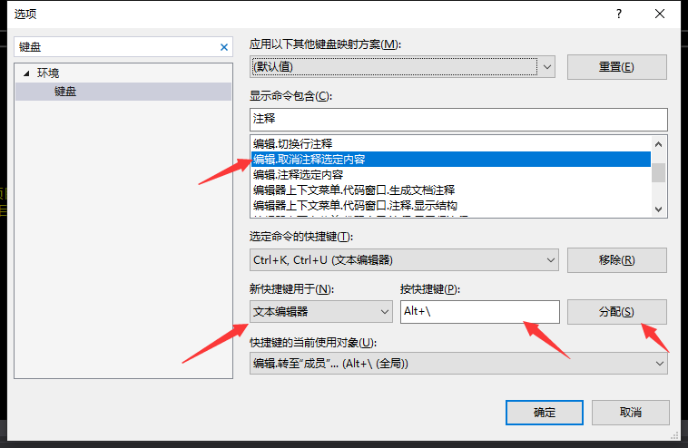

# Visual Studio

## 快捷键

反人类的快捷键

+ 代码格式化对齐：Ctrl+K+D
+ 代码多行注释：Ctrl+k再按Ctrl+c 
+ 代码多行注释取消：Ctrl+k再按Ctrl+u即可去掉
+ 智能提示：Ctrl+J
+ 选择和使用只能提示内容：Tab
+ 展开或折叠当前方法：Ctrl+M+M
+ 折叠所有方法：Ctrl+M+O
+ 展开所有方法：Ctrl+M+L

### 注释

+ F9 切换断点
+ Ctrl+F5 开始执行（不调试）
+ F5 开始调试、执行（跳过一个断点）
+ Shift+F5 停止调试
+ Ctrl+Shift+F5 重启调试
+ F10 step over
+ F11 step into
+ Shift + F11 step out     

### 修改快捷键

工具------->选项-------->键盘

+ 修改取消注释快捷键（注释快捷键修改注释选定内容）

  

## Debug和Release

+ Debug模式：很多调试信息，生成的可执行文件很臃肿

+ Release模式：去除调试信息，生成的可执行文件精简，高效，代码被优化处理

  移除Release的优化，项目右击，属性，然后选择C/C++，优化，选择禁用

## 密钥

+ 2019 Visual Studio

  ```
  官网下载地址：https://visualstudio.microsoft.com/zh-hans/downloads/
  分享一下专业版和企业版的激活密匙
  Professional产品密钥：NYWVH-HT4XC-R2WYW-9Y3CM-X4V3Y
  Enterprise产品密钥：BF8Y8-GN2QH-T84XB-QVY3B-RC4DF
  ```

  