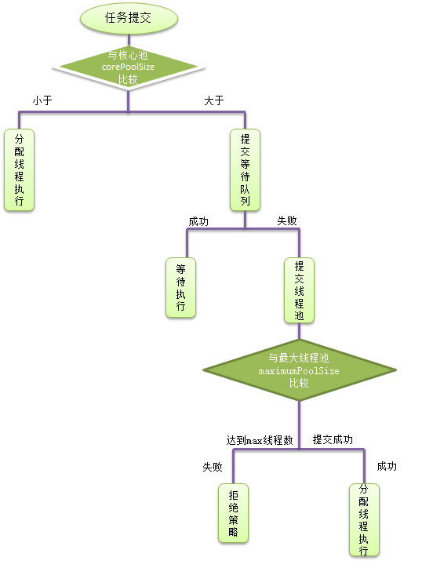
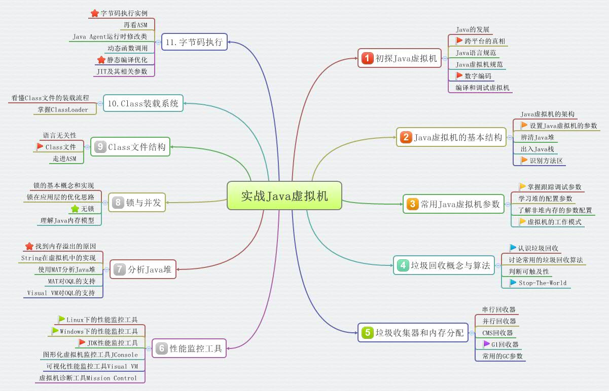

<!-- START doctoc generated TOC please keep comment here to allow auto update -->
<!-- DON'T EDIT THIS SECTION, INSTEAD RE-RUN doctoc TO UPDATE -->
**Table of Contents**  *generated with [DocToc](https://github.com/thlorenz/doctoc)*

- [基础](#%E5%9F%BA%E7%A1%80)
  - [入门简介和工具](#%E5%85%A5%E9%97%A8%E7%AE%80%E4%BB%8B%E5%92%8C%E5%B7%A5%E5%85%B7)
    - [发展历史](#%E5%8F%91%E5%B1%95%E5%8E%86%E5%8F%B2)
    - [classpath环境变量](#classpath%E7%8E%AF%E5%A2%83%E5%8F%98%E9%87%8F)
    - [JDK、JRE和JVM区别](#jdkjre%E5%92%8Cjvm%E5%8C%BA%E5%88%AB)
    - [工具](#%E5%B7%A5%E5%85%B7)
    - [JDK华为镜像下载地址](#jdk%E5%8D%8E%E4%B8%BA%E9%95%9C%E5%83%8F%E4%B8%8B%E8%BD%BD%E5%9C%B0%E5%9D%80)
  - [数据类型](#%E6%95%B0%E6%8D%AE%E7%B1%BB%E5%9E%8B)
    - [数组类型](#%E6%95%B0%E7%BB%84%E7%B1%BB%E5%9E%8B)
    - [字符串类型（String）](#%E5%AD%97%E7%AC%A6%E4%B8%B2%E7%B1%BB%E5%9E%8Bstring)
    - [基本数据包装类型](#%E5%9F%BA%E6%9C%AC%E6%95%B0%E6%8D%AE%E5%8C%85%E8%A3%85%E7%B1%BB%E5%9E%8B)
      - [包装类型](#%E5%8C%85%E8%A3%85%E7%B1%BB%E5%9E%8B)
      - [拆箱/装箱](#%E6%8B%86%E7%AE%B1%E8%A3%85%E7%AE%B1)
      - [equal和==](#equal%E5%92%8C)
    - [引用类型](#%E5%BC%95%E7%94%A8%E7%B1%BB%E5%9E%8B)
- [类](#%E7%B1%BB)
  - [三大特性](#%E4%B8%89%E5%A4%A7%E7%89%B9%E6%80%A7)
    - [封装](#%E5%B0%81%E8%A3%85)
    - [继承](#%E7%BB%A7%E6%89%BF)
    - [多态](#%E5%A4%9A%E6%80%81)
  - [类之抽象类和接口](#%E7%B1%BB%E4%B9%8B%E6%8A%BD%E8%B1%A1%E7%B1%BB%E5%92%8C%E6%8E%A5%E5%8F%A3)
  - [类之内部类和Lambda表达式](#%E7%B1%BB%E4%B9%8B%E5%86%85%E9%83%A8%E7%B1%BB%E5%92%8Clambda%E8%A1%A8%E8%BE%BE%E5%BC%8F)
- [基础类库](#%E5%9F%BA%E7%A1%80%E7%B1%BB%E5%BA%93)
  - [系统相关](#%E7%B3%BB%E7%BB%9F%E7%9B%B8%E5%85%B3)
  - [常用库](#%E5%B8%B8%E7%94%A8%E5%BA%93)
- [异常](#%E5%BC%82%E5%B8%B8)
  - [关键字throw和throws](#%E5%85%B3%E9%94%AE%E5%AD%97throw%E5%92%8Cthrows)
  - [Throwable对象](#throwable%E5%AF%B9%E8%B1%A1)
    - [Error（错误)](#error%E9%94%99%E8%AF%AF)
    - [Exception（异常）](#exception%E5%BC%82%E5%B8%B8)
  - [可查异常和不可查异常](#%E5%8F%AF%E6%9F%A5%E5%BC%82%E5%B8%B8%E5%92%8C%E4%B8%8D%E5%8F%AF%E6%9F%A5%E5%BC%82%E5%B8%B8)
    - [可查异常（编译器要求必须处置的异常）](#%E5%8F%AF%E6%9F%A5%E5%BC%82%E5%B8%B8%E7%BC%96%E8%AF%91%E5%99%A8%E8%A6%81%E6%B1%82%E5%BF%85%E9%A1%BB%E5%A4%84%E7%BD%AE%E7%9A%84%E5%BC%82%E5%B8%B8)
    - [不可查异常(编译器不要求强制处置的异常)](#%E4%B8%8D%E5%8F%AF%E6%9F%A5%E5%BC%82%E5%B8%B8%E7%BC%96%E8%AF%91%E5%99%A8%E4%B8%8D%E8%A6%81%E6%B1%82%E5%BC%BA%E5%88%B6%E5%A4%84%E7%BD%AE%E7%9A%84%E5%BC%82%E5%B8%B8)
- [注解](#%E6%B3%A8%E8%A7%A3)
- [集合](#%E9%9B%86%E5%90%88)
  - [Set](#set)
  - [List](#list)
  - [Queue](#queue)
    - [Deque(接口)](#deque%E6%8E%A5%E5%8F%A3)
      - [ArrayDeque(类)](#arraydeque%E7%B1%BB)
    - [PriorityQueue(类)](#priorityqueue%E7%B1%BB)
    - [效率比较](#%E6%95%88%E7%8E%87%E6%AF%94%E8%BE%83)
    - [BlockingQueue(接口)](#blockingqueue%E6%8E%A5%E5%8F%A3)
      - [LinkedBlockingQueue](#linkedblockingqueue)
      - [ArrayBlockingQueue](#arrayblockingqueue)
  - [Map](#map)
    - [LinkedHashMap](#linkedhashmap)
- [流](#%E6%B5%81)
  - [File和RandomAccessFile](#file%E5%92%8Crandomaccessfile)
  - [InputStream](#inputstream)
  - [OutputStream](#outputstream)
  - [Reader](#reader)
  - [Writer](#writer)
- [线程](#%E7%BA%BF%E7%A8%8B)
  - [相关方法](#%E7%9B%B8%E5%85%B3%E6%96%B9%E6%B3%95)
  - [创建线程（三种方式）](#%E5%88%9B%E5%BB%BA%E7%BA%BF%E7%A8%8B%E4%B8%89%E7%A7%8D%E6%96%B9%E5%BC%8F)
  - [线程池](#%E7%BA%BF%E7%A8%8B%E6%B1%A0)
    - [Java中的四类线程池（Executors的静态类）](#java%E4%B8%AD%E7%9A%84%E5%9B%9B%E7%B1%BB%E7%BA%BF%E7%A8%8B%E6%B1%A0executors%E7%9A%84%E9%9D%99%E6%80%81%E7%B1%BB)
    - [submit与execute的区别](#submit%E4%B8%8Eexecute%E7%9A%84%E5%8C%BA%E5%88%AB)
    - [shutdown 和 shutdownNow 的区别](#shutdown-%E5%92%8C-shutdownnow-%E7%9A%84%E5%8C%BA%E5%88%AB)
    - [手动创建线程池](#%E6%89%8B%E5%8A%A8%E5%88%9B%E5%BB%BA%E7%BA%BF%E7%A8%8B%E6%B1%A0)
  - [线程安全](#%E7%BA%BF%E7%A8%8B%E5%AE%89%E5%85%A8)
    - [同步](#%E5%90%8C%E6%AD%A5)
      - [synchronized和ReentrantLock](#synchronized%E5%92%8Creentrantlock)
      - [原子类（Atomic）](#%E5%8E%9F%E5%AD%90%E7%B1%BBatomic)
      - [ThreadLocal](#threadlocal)
    - [辅助类](#%E8%BE%85%E5%8A%A9%E7%B1%BB)
      - [CountDownLatch](#countdownlatch)
      - [Semaphore](#semaphore)
      - [CyclicBarrier](#cyclicbarrier)
      - [Phaser](#phaser)
      - [Exchanger](#exchanger)
  - [线程间通信](#%E7%BA%BF%E7%A8%8B%E9%97%B4%E9%80%9A%E4%BF%A1)
- [网络编程](#%E7%BD%91%E7%BB%9C%E7%BC%96%E7%A8%8B)
  - [基础类](#%E5%9F%BA%E7%A1%80%E7%B1%BB)
  - [Socket](#socket)
    - [简介](#%E7%AE%80%E4%BB%8B)
    - [基本操作](#%E5%9F%BA%E6%9C%AC%E6%93%8D%E4%BD%9C)
      - [使用TCP通信的Socket流程](#%E4%BD%BF%E7%94%A8tcp%E9%80%9A%E4%BF%A1%E7%9A%84socket%E6%B5%81%E7%A8%8B)
      - [使用 UDP 通信的 Socket 流程](#%E4%BD%BF%E7%94%A8-udp-%E9%80%9A%E4%BF%A1%E7%9A%84-socket-%E6%B5%81%E7%A8%8B)
- [反射](#%E5%8F%8D%E5%B0%84)
  - [基本方法](#%E5%9F%BA%E6%9C%AC%E6%96%B9%E6%B3%95)
    - [功能](#%E5%8A%9F%E8%83%BD)
  - [例子](#%E4%BE%8B%E5%AD%90)
  - [反射之集合泛型的本质](#%E5%8F%8D%E5%B0%84%E4%B9%8B%E9%9B%86%E5%90%88%E6%B3%9B%E5%9E%8B%E7%9A%84%E6%9C%AC%E8%B4%A8)
- [JVM](#jvm)
  - [学习路线](#%E5%AD%A6%E4%B9%A0%E8%B7%AF%E7%BA%BF)
  - [双亲委托机制](#%E5%8F%8C%E4%BA%B2%E5%A7%94%E6%89%98%E6%9C%BA%E5%88%B6)
  - [工作原理](#%E5%B7%A5%E4%BD%9C%E5%8E%9F%E7%90%86)

<!-- END doctoc generated TOC please keep comment here to allow auto update -->

# 基础

## 入门简介和工具

### 发展历史

- 1996年，Sun发布了JDK1.0，包含JDK和JRE
- 1997年，Sun发布了JDK1.1，增加JIT（即时翻译）编译器
- 1998年，Sun发布了JDK1.2，还包含Jsp/Serlvet，EJB等规范，并将Java分为JavaSE、JavaEE、JavaME三个版本
- 2002年，Sun发布了JDK1.4，开源框架SSH涌现，Java进入飞速发展阶段
- 2004年，Sun发布了JDK1.5，增加泛型、增强的for语句、可变数量的形参、注解、自动拆箱和装箱等功能
- 2006年，Sun发布了JDK1.6，2009年，Sun公司被Oracle收购
- 2011年，Oracle发布了JDK1.7，引入了二进制整数、字符串的switch、菱形语法、多异常捕捉、自动关闭异常的try语句等特性
- 2014年，Oracle发布了JDK1.8，带来了了全新的Lambda、流式编程等大量新特性
- 2017年，Oracle发布了JDK1.9，这次升级强化了Java的模块化系统、采用了更高效、更智能的G1垃圾回收器

### classpath环境变量
- 	如果没有设置，java解释器默认就在当前路径下搜索
- 	如果需要设置，记得加上点，代表当前路径
- 	其实jdk1.5以上，都是可以不需要设置的

### JDK、JRE和JVM区别
+ JDK 是java developmentkit

是java的开发工具包，里面包含了各种类库和工具。当然也包括了另外一个Jre. 那么为什么要包括另外一个Jre呢？而且jdk/jre/bin同时有client和server两个文件夹下都包含一个jvm.dll。说明是有两个虚拟机的。
+ JRE 是java runtime environment

是java程序的运行环境。既然是运行，当然要包含jvm，也就是大家熟悉的虚拟机啦，还有所有java类库的class文件，都在lib目录下打包成了jar。大家可以自己验证。至于在windows上的虚拟机是哪个文件呢？学过MFC的都知道什么是dll文件吧，那么大家看看jre/bin/client里面是不是有一个jvm.dll呢？那就是虚拟机。 

+ JVM是java virtual machine，是虚拟机

### 工具
- jdk1.9新增的工具，位于jdk的bin目录下，可以快速测试java的api
- javadoc生成帮助文档的工具
- jar.exe位于jdk的bin目录下，主要处理jar包

### JDK华为镜像下载地址
[JDK](https://repo.huaweicloud.com/java/jdk/)

## 数据类型

### 数组类型

工具类Arrays操作数组（jdk1.8出现的）

### 字符串类型（String）

```java
面试题：

一、new String(“abc”)和"abc"的区别

​    1、new出来的对象是先在常量池看是否有这个字符串内容，如果有直接在堆里面创建一个对象，存储这个字符串在常量池的地址，如果没有要现在常量池创建一个内存，存储这个字符串，然后再将这个地址存在内存中

​    2、字符串是直接存在常量池

二、浅谈一下String, StringBuffer，StringBuilder的区别？

String是不可变类，每当我们对String进行操作的时候，总是会创建新的字符串。操作String很耗资源,所以Java提供了两个工具类来操作String - StringBuffer和StringBuilder。

StringBuffer和StringBuilder是可变类，StringBuffer是线程安全的，StringBuilder则不是线程安全的。所以在多线程对同一个字符串操作的时候，我们应该选择用StringBuffer。由于不需要处理多线程的情况，StringBuilder的效率比StringBuffer高。

三、String的intern()方法

当intern()方法被调用，如果字符串池中含有一个字符串和当前调用方法的字符串eqauls相等，那么就会返回池中的字符串。如果池中没有的话，则首先将当前字符串加入到池中，然后返回引用。

四、String 为什么是不可变的？

String 不可变是因为在 JDK 中 String 类被声明为一个 final 类，且类内部的 value 字节数组也是 final 的，只有当字符串是不可变时字符串池才有可能实现，字符串池的实现可以在运行时节约很多 heap 空间，因为不同的字符串变量都指向池中的同一个字符串；如果字符串是可变的则会引起很严重的安全问题，譬如数据库的用户名密码都是以字符串的形式传入来获得数据库的连接，或者在 socket 编程中主机名和端口都是以字符串的形式传入，因为字符串是不可变的，所以它的值是不可改变的，否则黑客们可以钻到空子改变字符串指向的对象的值造成安全漏洞；因为字符串是不可变的，所以是多线程安全的，同一个字符串实例可以被多个线程共享，这样便不用因为线程安全问题而使用同步，字符串自己便是线程安全的；因为字符串是不可变的所以在它创建的时候 hashcode 就被缓存了，不变性也保证了 hash 码的唯一性，不需要重新计算，这就使得字符串很适合作为 Map 的键，字符串的处理速度要快过其它的键对象，这就是 HashMap 中的键往往都使用字符串的原因。
```

### 基本数据包装类型

#### 包装类型

+ byte -> Byte

+ short -> Short

+ int -> Integer

+ long -> Long

+ float -> Float

+ double -> Double

+ boolean -> Boolean

+ char -> Character

#### 拆箱/装箱

由基本类型向对应的包装类转换称为装箱，例如把 int 包装成 Integer 类的对象；（Integer i = Integer.valueOf(1); //手动装箱）

包装类向对应的基本类型转换称为拆箱，例如把 Integer 类的对象重新简化为 int。（Integer i0 = new Integer(1);int i2 = i0.intValue(); //手动拆箱）

#### equal和==

+ equal

  基本数据类型和包装类比较时，会先把基本数据类型包装成对应的包装类型，再进行比较。

+ ==

  基本数据类型和包装类型比较时，会先把包装类拆箱再进行值比较（和equals是反的）

  包装类型的缓存范围

  1. Integer类型有缓存-128-127的对象。缓存上限可以通过配置jvm更改
  2. Byte,Short,Long类型有缓存(-128-127)
  3. Character缓存0-127
  4. Boolean缓存TRUE、FALSE

  （注意，**只有valueOf方法构造对象时会用到缓存，缓存会返回同一个对象，new方法等不会使用缓存！**）

### [引用类型](https://www.jianshu.com/p/e66d03c3e614)

+ 强引用

​      强引用是指在程序代码中普遍存在的，类似“Object obj=new Object()”这类的引用，只要强引用还存在，垃圾收集器永远不会回收掉被引用的对象。

只要某个对象有强引用与之关联，JVM必定不会回收这个对象，即使在内存不足的情况下，JVM宁愿抛出OutOfMemory错误也不会回收这种对象

+ 软引用（SoftReference）

​      软引用是用来描述一些有用但并不是必需的对象。对于软引用关联着的对象，只有在内存不足的时候JVM才会回收该对象。因此，这一点可以很好地用来解决OOM的问题，并且这个特性很适合用来实现缓存：比如网页缓存、图片缓存等。JDK 1.2之后，提供了SoftReference类来实现软引用。

+ 弱引用（WeakReference）

​      弱引用也是用来描述非必需对象的，当JVM进行垃圾回收时，无论内存是否充足，都会回收被弱引用关联的对象

+ 虚引用（PhantomReference）

​      虚引用和前面的软引用、弱引用不同，它并不影响对象的生命周期。在java中用java.lang.ref.PhantomReference类表示。如果一个对象与虚引用关联，则跟没有引用与之关联一样，在任何时候都可能被垃圾回

# 类

## 三大特性

### 封装

+ 限定符

  public（公共访问权限）、protected（子类访问权限）、default（包访问权限）、private（当前类访问权限）

+ 属性声明

+ this关键字

+ 方法声明

  1. 参数可变的方法（JDK1.5以后出现的）
  2. 递归方法
  3. 方法重载（方法名一样，形参列表不同）

+ static关键字

+ final关键字（类似于C#的sealed关键字）

  1. 修饰属性（不可改变）
  2. 修饰方法（子类不可重写）
  3. 修饰类（不可以有子类）

+ import关键字

  1. import导入包名，可以省略写包名
  2. import static可以导入静态方法或者变量，可以省略写类名（JDK1.5新增）

### 继承

+ 方法重写（方法覆盖）

+ 子类重写或者覆盖父类的方法

+ super关键字

  1. 在子类方法中通过super关键字来调用父类被重写的方法

  2. 当调用子类构造器构造子类对象时，总是先调用父类的构造函数（如果父类没有默认的构造函数，必须显示的调用其其他构造函数），一直到Object类。

+ 继承和组合

+ 初始化块和静态初始化块

  执行步骤：父类的静态初始化块，初始化块，构造器，再执行自己的静态初始化块，初始化块，构造器。

### 多态

+ instanceof运算符

  前一个操作符是一个引用，后一个操作符是一个类，用来判断前面的是否为后面的子类，对象，或者引用。

+ 父类引用指向子类对象，则引发多态。

## 类之抽象类和接口

+ 抽象类和抽象方法
  使用关键字abstract来修饰抽象类和抽象方法，抽象类不可以创建实例

+ 接口
  接口定义不再使用clss关键字，使用interface关键字（支持多实现）

## 类之内部类和Lambda表达式

+ 成员内部类
  - 非静态内部类
    1. 内部类可以使用类.this.实例变量来访问外部类的实例变量，使用this.实例变量来访问非静态内部类的实例变量
    2. 外部类想要访问非静态内部类的实例变量，必须显示的创建非静态内部的对象来访问其实例变量
    3. 非静态内部类不允许有静态方法、静态变量、静态块
    4. 在外部类以外使用语法：OuterClass.InnerClass innerClass=new OuterClass().new InnerClass();
  - 静态内部类
    1. 使用static来修饰内部类，则这个类就属于外部类本身，叫做类内部类。
    2. 静态内部类不能访问外部类的实例成员，只能访问外部类的类成员（即使内部类的实例方法也不可以）。
    3. 外部类依然无法直接内部类的实例成员，可以通过类.实例变量来访问
    4. 在外部类以外使用语法：OuterClass.StaicInnerClass staicInnerClass=new OuterClass.StaicInnerClass();
+ 局部内部类
  - 方法内部类（将内部类定义在方法里面，只能在该方法使用，实际应用很少）

+ Lambda表达式（JDK1.8新增）
  - 语法：(parameters) -> expression或(parameters) ->{ statements; }

# 基础类库

## 系统相关

+ System类（标准输入，标准输出和错误输出的类变量，环境变量和系统属性的静态方法，以及加载文件和动态链接的方法）
  1. System.getenv()（获取环境变量）
  2. System.getProperties()（获取系统属性）
  3. System.identityHashCode(Object);（返回某个对象的hashcode值，根据地址计算的）
+ Runtime类（代表Java类的运行时环境）
  1. Runtime.getRuntime()（获取Runtime实例）
  2. gc方法
  3. load()和loadLibrary()来加载文件和动态链接库\
  4. 可以访问JVM信息，内存以及处理器数量
  5. exec()方法来启动其他程序

## 常用库

+ Object类（所有类的父类）
  1. equal方法（两个对象是否为同一个对象）
  2. finalize方法（当系统没有引用变量引用该对象时，垃圾回收器调用该方法回收资源）
  3. getClass方法（返回该对象的运行时类）
  4. hashCode方法（默认情况下，是根据地址来算，很多类重写了该方法，不再根据地址计算）
  5. toString方法
  6. 还有wait、notify、notifyAll方法
  7. clone方法（得到当前对象的一个副本，且完全隔离，是protected修饰的，必须要重写，先实现Cloneable接口）

+ Objects（jdk1.7新增的工具类 ，空指针安全）

+ Math类（来完成复杂运算，全是类方法）
+ Random和LocalThreadRandom（jdk1.7新增，随机数获取）
+ BigDecimal类（为了能精确表示和计算浮点数）
+ Date类和Calendar类（Date类很多方法都过时了，使用Calendar代替）
+ 日期时间类（jdk1.8新增，在java.time包下）Clock可以获取当前时间，代替System类获取时间
+ java.util.ResourceBundle（加载国家、语言资源包）
+ java.util.Locale（用于封装特定的国家/区域、语言环境）
+ java.text.MessageFormat（用于格式化带占位符的字符串）
+ NumberFormat（格式化数字）
+ DateFormat（格式化日期、时间）
+ SimpleDateFromat（格式化日期）

# 异常

## 关键字throw和throws

+ throw:throw关键字是人为的抛出异常，直接抛出异常的实例化对象

+ throws:在定义一个方法时，使用Throws关键字声明，表示此方法不处理异常，而是交给调用方法来处理

## Throwable对象

有两个重要的子类:Exception（异常）和 Error（错误），二者都是 Java 异常处理的重要子类，各自都包含大量子类。

### Error（错误)

Error是程序无法处理的错误，表示运行应用程序中较严重问题。大多数错误与代码编写者执行的操作无关，而表示代码运行时 JVM（Java 虚拟机）出现的问题。例如，Java虚拟机运行错误（Virtual MachineError），当 JVM 不再有继续执行操作所需的内存资源时，将出现 OutOfMemoryError。这些异常发生时，Java虚拟机（JVM）一般会选择线程终止。

这些错误表示故障发生于虚拟机自身、或者发生在虚拟机试图执行应用时，如Java虚拟机运行错误（Virtual MachineError）、类定义错误（NoClassDefFoundError）等。这些错误是不可查的，因为它们在应用程序的控制和处理能力之 外，而且绝大多数是程序运行时不允许出现的状况。对于设计合理的应用程序来说，即使确实发生了错误，本质上也不应该试图去处理它所引起的异常状况。在 Java中，错误通过Error的子类描述。

### Exception（异常）

Expection是程序本身可以处理的异常。

Exception 类有一个重要的子类 RuntimeException。RuntimeException 类及其子类表示“JVM 常用操作”引发的错误。例如，若试图使用空值对象引用、除数为零或数组越界，则分别引发运行时异常（NullPointerException、ArithmeticException）和 ArrayIndexOutOfBoundException。

## 可查异常和不可查异常

### 可查异常（编译器要求必须处置的异常）

正确的程序在运行中，很容易出现的、情理可容的异常状况。可查异常虽然是异常状况，但在一定程度上它的发生是可以预计的，而且一旦发生这种异常状况，就必须采取某种方式进行处理。除了RuntimeException及其子类以外，其他的Exception类及其子类都属于可查异常。这种异常的特点是Java编译器会检查它，也就是说，当程序中可能出现这类异常，要么用try-catch语句捕获它，要么用throws子句声明抛出它，否则编译不会通过。

### 不可查异常(编译器不要求强制处置的异常)

包括运行时异常（RuntimeException与其子类）和错误（Error）。

Exception 这种异常分两大类运行时异常和非运行时异常(编译异常)。程序中应当尽可能去处理这些异常。

运行时异常:都是RuntimeException类及其子类异常，如NullPointerException(空指针异常)、IndexOutOfBoundsException(下标越界异常)等，这些异常是不检查异常，程序中可以选择捕获处理，也可以不处理。这些异常一般是由程序逻辑错误引起的，程序应该从逻辑角度尽可能避免这类异常的发生。运行时异常的特点是Java编译器不会检查它，也就是说，当程序中可能出现这类异常，即使没有用try-catch语句捕获它，也没有用throws子句声明抛出它，也会编译通过。

非运行时异常 （编译异常）:是RuntimeException以外的异常，类型上都属于Exception类及其子类。从程序语法角度讲是必须进行处理的异常，如果不处理，程序就不能编译通过。如IOException、SQLException等以及用户自定义的Exception异常，一般情况下不自定义检查异常。

```java
示例1（Error）：

/**

 \* Error是Throwable的子类，一般都是些JVM内部的异常

 \* 以及一些无法预知的异常。

 \* 从代码来看是可以捕获的,并且捕获之后还可以继续运行其他代码

 */

public class ErrorTest{

​    public static void main(String[] args){
​        try {
​            TestError.get();
​        } catch (Error e) {
​            e.printStackTrace();
​            TestError.errAfterRun();
​        }
​    }
}

class TestError{

​    //使用递归让其发生栈内存溢出
​    public static void get(){
​        get();
​    }

​    public static void errAfterRun(){
​        System.out.println("我是发生了栈溢后执行的");
​    }
}

示例2（Exception）：
/**

 \* Exception是Throwable的子类

 \* 除了RuntimeException及其子类是运行时异常

 \* 其他异常JVM会强制try...catch....或者抛向上级，不然编译无法通过

 \* throws写在方法名后，表示要抛出的异常

 \* throw 表示要抛出的具体的异常对象实例

 */

public class ExceptionTest{

​    public static void main(String[] args){
​        try {
​            //必须使用try..catch..捕获
​            //不然编译通过不了
​            TestException.test1();   
​        } catch (Exception e) {
​            //TODO: handle exception
​        }finally{
​            //不管是否捕获到异常都会执行该方法
​        }
​        //以下代码异常为NumberFormatException，运行时异常
​        //即使不使用try...catch... 编译也能通过
​        //抛出异常没有处理会交给JVM处理，程序会中断。
​        Double.parseDouble("test");
​    }
}

class TestException{
​    //本身不想处理该异常，可以交给调用者去处理
​    public static void test1() throws InterruptedException{
​        throw new InterruptedException();
​    }
}
```

# 注解

- 什么是注解

注解就是Annontation，Annontation是Java5开始引入的新特征，中文名称叫做注解，它提供了一种安全的类似注释的机制，可以起到减少配置的成果，给程序起到辅助性的作用

- 注解的用处
  1. 注解可以生成文档
  2. 注解可以逐渐替代配置
  3. 在编译时进行格式检查

- 注解的原理

注解本质是一个继承了Annotation的特殊接口，其具体实现类是Java运行时生成的动态代理类。而我们通过反射获取注解时，返回的是Java运行时生成的动态代理对象$Proxy1。通过代理对象调用自定义注解（接口）的方法，会最终调用AnnotationInvocationHandler的invoke方法。该方法会从memberValues这个Map中索引出对应的值。而memberValues的来源是Java常量池。

# 集合


## Set

```java
Set（无序，且不可重复）

HashSet（可能无序，线程不安全，元素值可以为null）
HashSet判断两个元素是否相等，是通过equal先判断，如果相等，在判断hashCode，如果不等，则依据hashCode来存储元素的位置

LinkedHashSet（HashSet子类）
使用链表来维护元素的次序，这样使得元素是以插入的形式保存的，遍历数据时，可以按照插入顺序获取

TreeSet（SortedSet接口的子类）
可以确保元素处于排序状态

EnumSet（专为枚举类设计的集合）

各Set性能分析
1、HashSet性能总比TreeSet好，尤其添加、查询等操作，因为TreeSet需要额外的红黑树算法维来维护集合的次序。只有当需要一个排序的Set，才应该使用TreeSet，否则使用HashSet
2、对于普通的插入和删除操作，LinkedHashSet比HashSet稍慢一点，但是遍历会更快
3、都是线程不安全的
```

## List

```java
List（元素有序，可重复，每个元素都有其对应的索引）
listIterator方法，返回ListIterator对象，遍历数据

Vector（古老的集合，线程安全，尽量少用）

ArrayList（线程不安全）
ArrayList是基于数组实现的，最大长度不会超过数组的长度2147483647(最大值是int的最大值是,2的31次方减去1 ).如果业务中可能存在超过这个长度的数据,使用LinkedArrayList
ArrayList是基于索引的数据接口，它的底层是数组。它可以以O(1)时间复杂度对元素进行随机访问

LinkedList（既实现了List也实现了Deque接口,底层是双向链表）

ArrayList和LinkedList的区别？
1.、ArrayList是基于索引的数据接口，它的底层是数组。它可以以O(1)时间复杂度对元素进行随机访问。与此对应，LinkedList是以元素列表的形式存储它的数据，每一个元素都和它的前一个和后一个元素链接在一起，在这种情况下，查找某个元素的时间复杂度是O(n)。
2.、相对于ArrayList，LinkedList的插入，添加，删除操作速度更快，因为当元素被添加到集合任意位置的时候，不需要像数组那样重新计算大小或者是更新索引。
3、LinkedList比ArrayList更占内存，因为LinkedList为每一个节点存储了两个引用，一个指向前一个元素，一个指向下一个元素。

Array 和 ArrayList 有什么区别？
1、Array 可以包含基本类型和对象类型，ArrayList 只能包含对象类型。
2、Array 大小是固定的，ArrayList 的大小是动态变化的。
3、ArrayList 提供了更多的方法和特性，比如：addAll()，removeAll()，iterator() 等等。

ArrayList 和 Vector 的区别？
这两个类都实现了 List 接口（List 接口继承了 Collection 接口），他们都是有序集合，即存储在这两个集合中的元素位置都是有顺序的，相当于一种动态的数组，我们以后可以按位置索引来取出某个元素，并且其中的数据是允许重复的，这是与 HashSet 之类的集合的最大不同处，HashSet 之类的集合不可以按索引号去检索其中的元素，也不允许有重复的元素。

ArrayList 与 Vector 的区别主要包括两个方面：
1、同步性：
Vector 是线程安全的，也就是说它的方法之间是线程同步（加了synchronized 关键字）的，而 ArrayList 是线程不安全的，它的方法之间是线程不同步的。如果只有一个线程会访问到集合，那最好是使用 ArrayList，因为它不考虑线程安全的问题，所以效率会高一些；如果有多个线程会访问到集合，那最好是使用 Vector，因为不需要我们自己再去考虑和编写线程安全的代码。
2、数据增长：
ArrayList 与 Vector 都有一个初始的容量大小，当存储进它们里面的元素的个人超过了容量时，就需要增加 ArrayList 和 Vector 的存储空间，每次要增加存储空间时，不是只增加一个存储单元，而是增加多个存储单元，每次增加的存储单元的个数在内存空间利用与程序效率之间要去的一定的平衡。Vector 在数据满时（加载因子1）增长为原来的两倍（扩容增量：原容量的 2 倍），而 ArrayList 在数据量达到容量的一半时（加载因子 0.5）增长为原容量的 (0.5 倍 + 1) 个空间
```

## Queue
Queue实现了Collection接口（用于模拟队列这种数据结构，不允许随机访问队列中的元素）

### Deque(接口)
Deque实现了Queue接口,叫做双端队列，两个实现类分别是LinkedList和ArrayDeque

#### ArrayDeque(类)
ArrayDeque实现了Deque接口,双端循环队列,既可以当作栈也可以当作队列使用,线程不安全.

```
    1.添加元素
        addFirst(E e)在数组前面添加元素
        addLast(E e)在数组后面添加元素
        offerFirst(E e) 在数组前面添加元素，并返回是否添加成功
        offerLast(E e) 在数组后天添加元素，并返回是否添加成功

    2.删除元素
        removeFirst()删除第一个元素，并返回删除元素的值,如果元素为null，将抛出异常
        pollFirst()删除第一个元素，并返回删除元素的值，如果元素为null，将返回null
           removeLast()删除最后一个元素，并返回删除元素的值，如果为null，将抛出异常
        pollLast()删除最后一个元素，并返回删除元素的值，如果为null，将返回null
           removeFirstOccurrence(Object o) 删除第一次出现的指定元素
        removeLastOccurrence(Object o) 删除最后一次出现的指定元素
   

    3.获取元素
        getFirst() 获取第一个元素,如果没有将抛出异常
        getLast() 获取最后一个元素，如果没有将抛出异常
   

    4.队列操作
        add(E e) 在队列尾部添加一个元素
        offer(E e) 在队列尾部添加一个元素，并返回是否成功
        remove() 删除队列中第一个元素，并返回该元素的值，如果元素为null，将抛出异常(其实底层调用的是removeFirst())
           poll()  删除队列中第一个元素，并返回该元素的值,如果元素为null，将返回null(其实调用的是pollFirst())
           element() 获取第一个元素，如果没有将抛出异常
        peek() 获取第一个元素，如果返回null
      

    5.栈操作
        push(E e) 栈顶添加一个元素
        pop(E e) 移除栈顶元素,如果栈顶没有元素将抛出异常
        

    6.其他
        size() 获取队列中元素个数
        isEmpty() 判断队列是否为空
        iterator() 迭代器，从前向后迭代
        descendingIterator() 迭代器，从后向前迭代
        contain(Object o) 判断队列中是否存在该元素
        toArray() 转成数组
        clear() 清空队列
        clone() 克隆(复制)一个新的队列
```

### [PriorityQueue(类)](https://www.cnblogs.com/Elliott-Su-Faith-change-our-life/p/7472265.html)
PriorityQueue实现了Queue接口,叫做优先队列.优先队列的作用是能保证每次取出的元素都是队列中权值最小的.不允许放入null元素；其通过堆实现，具体说是通过完全二叉树（complete binary tree）实现的小顶堆（任意一个非叶子节点的权值，都不大于其左右子节点的权值），也就意味着可以通过数组来作为PriorityQueue的底层实现
```
常用方法:
    插入:
     add()和offer() 前者在插入失败时抛出异常，后则则会返回false
    删除:
     element()和peek() 都是获取但不删除队首元素,二者唯一的区别是当方法失败时前者抛出异常，后者返回null
     remove()和poll() 都是获取并删除队首元素,区别是当方法失败时前者抛出异常，后者返回null
```

### 效率比较

1. PriorityQueue可以作为堆使用，而且可以根据传入的Comparator实现大小的调整，会是一个很好的选择。
2. ArrayDeque通常作为栈或队列使用，但是栈的效率不如LinkedList高。
3. LinkedList通常作为栈或队列使用，但是队列的效率不如ArrayQueue高

### BlockingQueue(接口)

BlockingQueue即阻塞队列，它是基于ReentrantLock，它的实现类有ArrayBlockingQueue、DelayQueue、 LinkedBlockingDeque、LinkedBlockingQueue、PriorityBlockingQueue、SynchronousQueue等，它们的区别主要体现在存储结构上或对元素操作上的不同，但是对于take与put操作的原理，却是类似的、

#### LinkedBlockingQueue

LinkedBlockingQueue是BlockingQueue的一种使用Link List的实现，它对头和尾（取和添加操作）采用两把不同的锁，相对于ArrayBlockingQueue提高了吞吐量。它也是一种阻塞型的容器，适合于实现“消费者生产者”模式。

#### ArrayBlockingQueue

ArrayBlockingQueue是对BlockingQueue的一个数组实现，它使用一把全局的锁并行对queue的读写操作，同时使用两个Condition阻塞容量为空时的取操作和容量满时的写操作。

## Map

```java
Map（key不允许重复）
Map包含了一个keySet()方法，用于返回Map里面所有key的Set集合。
从Java源码来看，Java是先实现了Map，然后通过包装一个value全是null的Map就实现了Set
Map遍历方法：
1、entrySet方法（数据大时使用）
Set<Map.Entry<String, String>> entryseSet=map.entrySet();
for (Map.Entry<String, String> entry:entryseSet) {
    System.out.println(entry.getKey()+","+entry.getValue());
}
2、keySet方法（普遍使用）
Set<String> set = map.keySet();
for (String s:set) {
    System.out.println(s+","+map.get(s));
}

HashMap（线程不安全，运行key或者value为null）

HashTable（线程安全，不允许key或者value为null，少用）

LinkedHashMap
使用双向链表来维护key-value对的次序，与插入顺序保持一致

SortedMap接口和TreeMap接口

WeakHashMap

HashMap和Hashtable的区别（类似于ArrayList和Vector）
HashMap和Hashtable都实现了Map接口，并且都是key-value的数据结构。它们的不同点主要在三个方面：
1、Hashtable是Java1.1的一个类，它基于陈旧的Dictionary类。而HashMap是Java1.2引进的Map接口的一个实现。
2、Hashtable是线程安全的，也就是说是线程同步的，而HashMap是线程不安全的。也就是说在单线程环境下应该用HashMap，这样效率更高。
3、HashMap允许将null值作为key或value，但Hashtable不允许（会抛出NullPointerException）。
```

### LinkedHashMap

```
//通过维护一个运行于所有条目的双向链表 (doubly-linked list)，LinkedHashMap保证了元素迭代的顺序。该迭代顺序可以是插入顺序或者是访问顺序
1、LinkedHashMap可以认为是HashMap+LinkedList，即它既使用HashMap操作数据结构，又使用LinkedList维护插入元素的先后顺序。
2、LinkedHashMap的基本实现思想就是-多态。可以说，理解多态，再去理解LinkedHashMap原理会事半功倍；反之也是，对于LinkedHashMap原理的学习，也可以促进和加深对于多态的理解。
```

# 流

## File和RandomAccessFile

```java
File类（java.io下代表与平台无关的文件和目录）
/**
 * File类
 * 包含文件以及目录信息的所有操作
 * 如文件和目录的路径和名称，以及文件的状态，创建和删除,
 * 以及修改时间，文件长度
 */

RandomAccessFile类
功能丰富，可以从文件的任意位置进行存取（输入输出）操作；
/**
 * 类RandomAccessFile
 * 可写可读
 * 共有4种模式：“r”,"rw"，“rws”和“rwd”
 * 1.r 只读方式打开，调用write会抛出IOException
 * 2.rw以读写方式打开
 * 3.rws以读写方式打开，同时要求对文件的内容或元数据的每个更新都同步写到基础设备中
 * 4.rwd以读写方式打开，同时要求对文件的内容的每个更新都同步写到基础存储设备中
 * 方法:
 * void writeBytes(String s)   //不能写中文,自动丢弃高八位
 * 
 * void writeUTF(String str)   //写入UTF-8格式的字符串,写入内容前两个字节位写入的字节数量
 * void readUTF(String str)    //只能读取writeUTF格式的文件
 * 
 * void seek(long pos)    //文件指针指向的位置,写完文件指针指向文件末尾,
 *                          读取文件需要将指针指向开头seek(0)
 * long getFilePointer()  //得到文件指针的位置
 * void setLength(long newLength)   //设置文件的大小
 */
```

## InputStream

```java
InputStream
抽象类、基于字节的输入操作、是所有输入流的父类、定义了所有输入流都具有的共同特征。
常用字节输入流:
FileInputStream   文件输入节点流，用于读取文件内容
PipedInputStream   管道输入节点流（未研究）
ByteArrayInputStream  字节数组节点流，读取内存的字节数组
ObjectInputStream   对象处理流，可以读取对象
BufferedInputStream 缓存处理流，默认增加8K的缓存能力，速度更快
DataInputStream      数据处理流，可以读取基础数据类型
/**
 * 字节输入流
 * 读取时返回-1表示没有数据了。
 * read()方法：每次读取字节，返回的值为ASCII值
 * read(byte[] b):运行一次读取一定的数量的字节数.java会尽可能的读取b个字节,但也有可能读取少于b的字节数.至少读取一个字节
 * void mark(int readAheadLimit); 在记录指针当前位置记录一个标记（mark）。
 * boolean markSupported(); 判断此输入流是否支持mark()操作，即是否支持记录标记。
 * void reset(); 将此流的记录指针重新定位到上一次记录标记（mark）的位置。
 * long skip(long n); 记录指针向前移动n个字节/字符。
 * int available();  剩余的字节
 * 抽象类
 * 常用子类：
 * FileInputStream     //对文件进行读
 * FilterInputSteam    //装饰流
 * 
 * FilterInputSteam子类：
 * DataInputStream     //这个类使得我们可以直接从stream中读取int，String等类型
 * BufferInputStream   //这个类提供了一个缓存来加速我们从输入流的读取,默认为8K
 */

ByteArrayInputStream
    /**
     * 节点输入流 ByteArrayInputStream
     * 可以将字节数组转化为输入流
     * 一般通过输出流获取到内存的字节数组，
     * 然后使用输出流操作内存的字节数组，防止多次访问硬盘
     * @throws Exception
     */
    public static void ByteArrayInputStreamTest() throws Exception{

        byte[] buf=new byte[]{3,4,1,127,67,45,76,90,0,2};
        byte[] b=new byte[2];
        ByteArrayInputStream in=new ByteArrayInputStream(buf);
        int first=in.read();
        System.out.println("Read the first byte is: "+first);
        in.skip(2);
        System.out.println("Skip 2 bytes.");
        in.read(b,0,2);
        System.out.println("Read 2 bytes to byteArray.\nNow the byteArray b is "+Arrays.toString(b));
        System.out.println("After the operations above, the left bytes is: "+ in.available());
    }

BufferedInputStream
    /**
     * 处理输出流 BufferedInputStream
     * 必须要嵌套在InputStream的子类上，启动缓冲作用。
     * 原理：默认会写到内存去，当到达8K（可以修改构造函数第二个参数调整大小）
     * 才会写入到硬盘中，减少硬盘的写入
     * @param path
     * @throws Exception
     */
    public static void BufferInputStreamTest(String path) throws Exception{

        InputStream inputStream=new FileInputStream(path+"/"+"BufferOutputStream.txt");
        BufferedInputStream bufferedInputStream=new BufferedInputStream(inputStream);
        byte[] b=new byte[1024];
        while(bufferedInputStream.read(b)!=-1){
            System.out.println(new String(b));
        }
        bufferedInputStream.close();
    }

ObjectInputStream
    /**
     * 处理输入流 ObjectInputStream
     * 必须要嵌套在InputStream的子类上
     * 可以读取来获取对象实例
     * @param path
     * @throws Exception
     */
    public static void ObjectInputStreamTest(String path) throws Exception{

        InputStream inputStream=new FileInputStream(path+"/"+"ObjectOutputStream.txt");
        ObjectInputStream objectInputStream=new ObjectInputStream(inputStream);
        User user=(User)objectInputStream.readObject();
        System.out.println(user.toString());
        objectInputStream.close();
    }

ObjectInputStream
    /**
     * 处理输入流 ObjectInputStream
     * 必须要嵌套在InputStream的子类上
     * 只能读取基本数据类型,读取数据必须
     * 按照写入的类型顺序进行读取
     * @param path
     * @throws Exception
     */
    public static void DataInputStreamTest(String path) throws Exception{
        InputStream inputStream=new FileInputStream(path+"/"+"DataOutputStream.txt");
        DataInputStream dataInputStream=new DataInputStream(inputStream);
        // int a;
        // while((a=dataInputStream.read())!=-1){
        //     System.out.println(a);
        // }
        System.out.println(dataInputStream.readInt());
        System.out.println(dataInputStream.readBoolean());
        dataInputStream.close();
    }
}
```

## OutputStream

```java
OutputStream
抽象类、基于字节的输出操作、是所有输出流的父类、定义了所有输出流都具有的共同特征。
常用字节输出流:
FileOutputStream   文件输出节点流，用于写入文件内容
PipedOutputStream   管道输出节点流（未研究）
ByteArrayOutputStream  字节数组节点流，将字节数组写入内存
ObjectOutputStream   对象处理流，可以写入对象
BufferedOutputStream 缓存处理流，默认增加8K的缓存能力，速度更快
DataOutputStream      数据处理流，可以写入基础数据类型
/**
 * OutputStream
 * 输出流抽象类
 * 子类:        
 * ByteArrayOutputStream     该类实现了一个输出流，其数据被写入由byte数组充当的缓冲区，缓冲区会随着数据的不断写入而自动增长。 
 * FileOutputStream          该类实现了一个输出流，其数据写入文件。
 * ObjectOutputStream        该类将实现了序列化的对象序列化后写入指定地方。  
 * PipedOutputStream         管道的输出流，是管道的发送端。
 * 抽象方法:
 * close()                   关闭此输出流并释放相应资源
 * flush()                   刷新此输出流并强制写出所有缓冲的输出字节。
 * write(byte[])             将字节数组写入此输出流。
 * write(byte[],int,int)     将指定起始的若干字节写入此输出流。
 * write(int)                将指定单个字节写入此输出流。
 * 
 */

FileOutputStream
 /**
     * 节点输出流FileOutputStream
     * 写文件的字节流（注意编码问题,中文windows默认为GBK,和系统语言有关）
     * 构造函数传入路径或者File对象,第二个参数为true表示不覆盖上次内容
     * 文件如果不存在则会创建,但是文件目录一定要有
     * @param path    路径
     * @throws Exception  文件路径没找到以及没有写权限的异常
     */
    public static void FileOutputStreamTest(String path) throws Exception{

        OutputStream outputStream=new FileOutputStream(path+"/"+"FileOutputStream.txt");
        String value="你好123";
        outputStream.write(value.getBytes());
        outputStream.flush();
        outputStream.close();
    }

ByteArrayOutputStream
    /**
     * 节点输出流ByteArrayOutputStream
     * 写入数据到内存 捕获内存缓冲区的数据，转换成字节数组 (从数组写)
     * 默认缓冲区为32个字节数组,可以根据构造函数指定大小,随数据的增大缓冲区也会变大。
     * 一般用来减少读文件的次数,读取一次文件，将文件内容放到缓冲区。
     * 方法:
     * reset()   将此字节数组输出流的 count 字段重置为零，从而丢弃输出流中目前已累积的所有数据输出
     * toByteArray() 创建一个新分配的字节数组。数组的大小和当前输出流的大小，内容是当前输出流的拷贝
     * @param path
     * @throws Exception 
     */
    public static void ByteArrayOutputStreamTest() throws Exception{

         ByteArrayOutputStream outputStream=new ByteArrayOutputStream();
         String value="123456789";
         outputStream.write(value.getBytes());
         //outputStream.reset();
         byte[] b=outputStream.toByteArray();
         System.out.println(new String(b));
         outputStream.flush();
         outputStream.close();
    }

BufferedOutputStream
    /**
     * 处理输出流BufferedOutputStream
     * 必须要嵌套在OutputStream的子类上，启动缓冲作用。
     * 原理，默认会先从磁盘获取8K（构造函数第二个参数可以调整默认大小）的内容到缓冲区（内存）中
     * 然后节点流再从内存去读，减少磁盘的访问，访问内存速度更快。
     * BufferedOutputStream的每一次write其实是将内容写入到buffer数组中，当buffer容量到达上限（默认8K）时，会触发真正的磁盘写入
     * @param path
     * @throws Exception
     */
    public static void BufferOutputStreamTest(String path) throws Exception{
        OutputStream outputStream=new FileOutputStream(path+"/"+"BufferOutputStream.txt");
        BufferedOutputStream bufferedOutputStream=new BufferedOutputStream(outputStream);
        String value="123456789";
        bufferedOutputStream.write(value.getBytes());
        bufferedOutputStream.flush();
        bufferedOutputStream.close();
    }

ObjectOutputStream
    /**
     * 处理输出流ObjectOutputStream
     * 必须要嵌套在OutputStream的子类上
     * 可以将对象进行持久化,操作对象必须序列化（实现Serializable接口）
     * @param path
     * @throws Exception
     */
    public static void ObjectOutputStreamTest(String path) throws Exception{
        OutputStream outputStream=new FileOutputStream(path+"/"+"ObjectOutputStream.txt");
        ObjectOutputStream objectOutputStream=new ObjectOutputStream(outputStream);
        User user=new User("小李",12);
        objectOutputStream.writeObject(user);
        objectOutputStream.flush();
        objectOutputStream.close();
    }

DataOutputStream
    /**
     * 处理输出流DataOutputStream
     * 必须啊嵌套再InputStream的子类上
     * 只能处理基本类型的数据
     * @param path
     * @throws Exception
     */
    public static void DataOutputStreamTest(String path) throws Exception{
        OutputStream outputStream=new FileOutputStream(path+"/"+"DataOutputStream.txt");
        DataOutputStream objectOutputStream=new DataOutputStream(outputStream);
        objectOutputStream.writeInt(12345);
        objectOutputStream.writeBoolean(true);
        objectOutputStream.flush();
        objectOutputStream.close();
    }
}
```

## Reader

```java
Reader
抽象类、基于字符的输入操作；
常用字符输入流:
FileReader           文件输入字符流，用与读取文件内容
StringReader       字符串输入字符流，用于读取内存的字符串
CharArrayReader 字符数组输入字符流，用于读取内存的字符数组
PipedReader        管道字符输入字符流（未研究）
BufferedReader    缓存处理流，默认也是8K的缓存能力，速度快
InputStreamReader  转换处理流，将字节输入流转换为字符输入流，可以调整编码格式。
/**
 * Reader 字符输入流 抽象类
 * 基础方法
 * int read()               //一个字符一个字符读取,返回字符的int值
 * int read(char cbuf[])    //返回读取的字符量
 * int read(char cbuf[], int off, int len) //
 * long skip(long n)    //跳过n个字符
 * boolean ready()      //
 * boolean markSupported()  //判断是否支持标记
 * void mark(int readAheadLimit)  //标记的位置
 * void reset()  //标记重置
 * void close()  //关闭流
 * 
 */

FileReader
 /**
     * 节点输出字符流 FileReader
     * 读文件
     * 
     * @param path
     * @throws Exception
     */
    public static void FileReaderTest(String path) throws Exception{
        Reader reader=new FileReader(new File(path+File.separator+"FileWriter.txt"));
        char c[]=new char[1024];
        while((reader.read(c))!=-1){
            System.out.println(c);
        }
        reader.close();
    }

    public static void StringReaderTest() throws Exception{
        StringReader stringReader=new StringReader("StringReader");
        char[] c=new char[1024];
        while(stringReader.read(c)!=-1){
            System.out.println(c);
        }
    }

    public static void CharArrayReaderTest() throws Exception{
        CharArrayReader charArrayReader=new CharArrayReader("CharArrayReader".toCharArray());
        char[] c=new char[1024];
        while(charArrayReader.read(c)!=-1){
            System.out.println(c);
        }
    }

BufferReader
    /**
     * 处理输出流 BufferReader
     * 类似于BufferedInputStream
     * @param path
     * @throws Exception
     */
    public static void BufferReaderTest(String path) throws Exception{
        Reader reader=new FileReader(new File(path+File.separator+"BufferedWriter.txt"));
        BufferedReader bufferedReader=new BufferedReader(reader);
        char[] c=new char[1024];
        while(bufferedReader.read(c)!=-1){
            System.out.println(c);
        }
        bufferedReader.close();
    }

LineNumberReader
    /**
     * 处理输出流 LineNumberReader
     * 可以一行一行的读取也可以获取行号
     * 是BufferReader的子类
     * @param path
     * @throws Exception
     */
    public static void LineNumberReaderTest(String path) throws Exception{
        Reader reader=new FileReader(new File(path+File.separator+"BufferedWriter.txt"));
        LineNumberReader lineNumberReader=new LineNumberReader(reader);
        String line=null;
        while((line=lineNumberReader.readLine())!=null){
            System.out.println(line+lineNumberReader.getLineNumber());
        }
        lineNumberReader.close();
    }

    public static void InputStreamReaderTest(String path) throws Exception{
        InputStream inputStream=new FileInputStream(path+"/"+"OutputStreamWriter.txt");
        InputStreamReader inputStreamReader=new InputStreamReader(inputStream,"utf-8");
        char c[]=new char[1024];
        while(inputStreamReader.read(c)!=-1){
             System.out.println(c);
        }
        inputStreamReader.close();
    }
```

## Writer

```java
Writer
抽象类、基于字符的输出操作；
常用字符输出流:
FileWriter           文件输出字符流，用与写入文件内容
StringWriter       字符串输入字符流，用于将字符串写入内存
CharArrayWriter 字符数组输入字符流，用于将字符数组写入内存
PipedWriter       管道字符输入字符流（未研究）
BufferedWriter    缓存处理流，默认也是8K的缓存能力，速度快
InputStreamWriter  转换处理流，将字节输出流转换为字符输出流，可以调整编码格式。
/**
 * Writer 字符输出流 抽象类
 * 基础方法： 
 * void write(int c)：将参数c的低16位组成字符写入到流中。 
 * void write(char[] buffer)：将字符数组buffer中的字符写入到流中。 
 * void write(char[] buffer, int offset, int length)：将字符数组buffer中从offset开始的length个字符写入到流中。 
 * void write(String string)：将string字符串写入到流中。 
 * void write(String string, int offset, int length)：将字符string中从offset开始的length个字符写入到流中。
 * CharSequence为接口,CharBuffer、String、StringBuffer、StringBuilder实现该类
 * Writer append(CharSequence csq) 追加CharSequence对象
 * Writer append(CharSequence csq, int start, int end) 追加CharSequence对象从offset开始的length个字符写入到流中
 * Writer append(char c)  追加一个字符
 * 其他方法： 
 * void close()：和OutputStream的close方法类似。 
 * void flush()：和OutputStream的flush方法类似。
 * 子类:
 * 节点流:
 * FileWriter
 * StringWriter
 * CharArrayWriter 
 * PipedWriter
 * 处理流(必须套在节点流上面):
 * FilterWriter 
 * BufferedWriter 
 * PrintWriter
 * OutputStreamWriter 
 */

FileWriter
/**
     * 节点输出字符流 FileWriter
     * 写文件
     * 第二个参数为true表示文件追加,不写表示覆盖原文件
     * @param path
     * @throws Exception
     */
    public static void FileWriterTest(String path) throws Exception{
        Writer writer=new FileWriter(new File(path+File.separator+"FileWriter.txt"));
        String value="haha欢迎你";
        writer.write(value);
        writer.flush();
        writer.close();
    }

StringWriter
    /**
     * 节点输出字符流 StringWriter
     * 将字符串（字符）写入内存中
     * 类似于ByteArrayOutputStream(写入字节)
     * @throws Exception
     */
    public static void StringWriterTest() throws Exception{
        StringWriter stringWriter=new StringWriter();
        stringWriter.write("你好");
        System.out.println(stringWriter.toString());
    }

CharArrayWriter
    /**
     * 节点输出字符流 CharArrayWriter
     * 将字符数组写入内存中
     * 类似于ByteArrayOutputStream(写入字节)
     * 方法:
     * int size() 查看当前buf中字符总数
     * char[] toCharArray() 将buf中内容转换成char[]
     * String toString() 将buf中字符转换成String返回
     * @throws Exception
     */
    public static void CharArrayWriterTest() throws Exception{
        CharArrayWriter charArrayWriter=new CharArrayWriter();
        charArrayWriter.write("你好");
        System.out.println(charArrayWriter.toCharArray());
    }

BufferedWriter
    /**
     * 处理输出字符流 BufferedWriter
     * 提供一个缓冲通道
     * 类似于BufferedOutputStream
     * 内部也是8K的大小,只是这边为字符
     * @throws Exception
     */
    public static void BufferedWriterTest(String path) throws Exception{
        Writer writer=new FileWriter(new File(path+File.separator+"BufferedWriter.txt"));
        BufferedWriter bufferedWriter=new BufferedWriter(writer);
        bufferedWriter.write("忽然思考酷酷酷");
        bufferedWriter.close();
    }

PrintWriter
    /**
     * 处理输出字符流PrintWriter
     * 定义流输出的位置，并且此流可以正常的存储中文，减少乱码输出
     * 可以在写入同时对写入的数据进行格式化
     * PrintStream主要操作byte流，而PrintWriter用来操作字符流
     * @throws Exception
     */
    public static void PrintWriterTest(String path) throws Exception{
        Writer writer=new FileWriter(new File(path+File.separator+"PrintWriter.txt"));
        PrintWriter printWriter=new PrintWriter(writer);
        printWriter.write("你好hahah");
        printWriter.flush();
        printWriter.close();
    }

OutputStreamWriter
    /**
     * 处理输出字符流 OutputStreamWriter
     * 从字符流到字节流的桥接：使用指定的字符集将写入其中的字符编码为字节。
     * 它使用的字符集可以通过名称指定，也可以明确指定，或者可以接受平台的默认字符集。
     * 可以通过第二个参数指定编码格式
     * @param path
     * @throws Exception
     */
    public static void OutputStreamWriterTest(String path) throws Exception{
        OutputStream outputStream=new FileOutputStream(path+"/"+"OutputStreamWriter.txt");
        OutputStreamWriter outputStreamWriter=new OutputStreamWriter(outputStream,"utf-8");
        outputStreamWriter.write("呵护莫法");
        System.out.println(outputStreamWriter.getEncoding());
        outputStreamWriter.flush();
        outputStreamWriter.close();
    }
}
```

# 线程


+ 新建状态

使用 new 关键字和 Thread 类或其子类建立一个线程对象后，该线程对象就处于新建状态。它保持这个状态直到程序 start() 这个线程。

+ 就绪状态

当线程对象调用了start()方法之后，该线程就进入就绪状态。就绪状态的线程处于就绪队列中，要等待JVM里线程调度器的调度。

+ 运行状态

如果就绪状态的线程获取 CPU 资源，就可以执行 run()，此时线程便处于运行状态。处于运行状态的线程最为复杂，它可以变为阻塞状态、就绪状态和死亡状态。

+ 阻塞状态

如果一个线程执行了sleep（睡眠）、suspend（挂起）等方法，失去所占用资源之后，该线程就从运行状态进入阻塞状态。在睡眠时间已到或获得设备资源后可以重新进入就绪状态。可以分为三种：

等待阻塞：运行状态中的线程执行 wait() 方法，使线程进入到等待阻塞状态。

同步阻塞：线程在获取 synchronized 同步锁失败(因为同步锁被其他线程占用)。

其他阻塞：通过调用线程的 sleep() 或 join() 发出了 I/O 请求时，线程就会进入到阻塞状态。当sleep() 状态超时，join() 等待线程终止或超时，或者 I/O 处理完毕，线程重新转入就绪状态。

死亡状态:

一个运行状态的线程完成任务或者其他终止条件发生时，该线程就切换到终止状态。

## 相关方法

+ join方法（可带参数，指最长等待时间）

​     当某个线程调用join方法时，调用线程将会被阻塞，直到调用join方法的线程执行结束。（比如main线程调用了线程1的join方法，那么会执行完线程1，再去执行main）

+ setDaemon(true)方法（守护线程）

​      (1) thread.setDaemon(true)必须在thread.start()之前设置，否则会跑出一个IllegalThreadStateException异常。你不能把正在运行的常规线程设置为守护线程。

​     (2) 在Daemon线程中产生的新线程也是Daemon的。

​     (3) 守护线程应该永远不去访问固有资源，如文件、数据库，因为它会在任何时候甚至在一个操作的中间发生中断。

+ sleep方法（Thread的静态方法）

​      让当前线程暂停一段时间，进入阻塞状态，不释放锁

+ yied方法（线程让步，Thread的静态方法）

​      将该线程进入就绪状态，只有优先级与当前线程相同或者高的情况下，才有获得执行的机会。

+ setPriority方法（设置线程优先级）

​     优先级越高，越有机会执行。（1~10等级）

+ [wait和notify方法（都是object的方法）](https://blog.csdn.net/u014561933/article/details/58639411)

## 创建线程（三种方式）

+ 继承Tthread

+ 实现Runnable接口，以该实例作为Thread的target来创建对象

+ 使用Callable、Future和FutureTask（会阻塞当前线程）

  ```
       1、cancel方法用来取消任务，如果取消任务成功则返回true，如果取消任务失败则返回false。参数mayInterruptIfRunning表示是否允许取消正在执行却没有执行完毕的任务，如果设置true，则表示可以取消正在执行过程中的任务。如果任务已经完成，则无论mayInterruptIfRunning为true还是false，此方法肯定返回false，即如果取消已经完成的任务会返回false；如果任务正在执行，若mayInterruptIfRunning设置为true，则返回true，若mayInterruptIfRunning设置为false，则返回false；如果任务还没有执行，则无论mayInterruptIfRunning为true还是false，肯定返回true。
        2、isCancelled方法表示任务是否被取消成功，如果在任务正常完成前被取消成功，则返回 true。
        3、isDone方法表示任务是否已经完成，若任务完成，则返回true；
        4、get()方法用来获取执行结果，这个方法会产生阻塞，会一直等到任务执行完毕才返回；
        5、get(long timeout, TimeUnit unit)用来获取执行结果，如果在指定时间内，还没获取到结果，就直接返回null。
  　　也就是说Future提供了三种功能：
  　　1）判断任务是否完成；
  　　2）能够中断任务；
  　　3）能够获取任务执行结果。
  
  　1.使用Callable+Future获取执行结果
         ExecutorService executor = Executors.newCachedThreadPool();
          Task task = new Task();
          Future<Integer> result = executor.submit(task);
          executor.shutdown();
         
         class Task implements Callable<Integer>{
         @Override
          public Integer call() throws Exception {
          System.out.println("子线程在进行计算");
          Thread.sleep(3000);
          int sum = 0;
          for(int i=0;i<100;i++)
              sum += i;
          return sum;
      }
  }
  2、使用Callable+FutureTask获取执行结果
       //第一种方式
          ExecutorService executor = Executors.newCachedThreadPool();
          Task task = new Task();
          FutureTask<Integer> futureTask = new FutureTask<Integer>(task);
          executor.submit(futureTask);
          executor.shutdown();
           
          //第二种方式，注意这种方式和第一种方式效果是类似的，只不过一个使用的是ExecutorService，一个使用的是Thread
          /*Task task = new Task();
          FutureTask<Integer> futureTask = new FutureTask<Integer>(task);
          Thread thread = new Thread(futureTask);
          thread.start();*/
  ```

## 线程池

+ [Java线程池实现原理及其在美团业务中的实践](https://tech.meituan.com/2020/04/02/java-pooling-pratice-in-meituan.html)

### Java中的四类线程池（Executors的静态类）

   Android中最常见的四类具有不同特性的线程池分别为FixThreadPool、CachedThreadPool、ScheduleThreadPool以及SingleThreadExecutor。

+ FixThreadPool

​         （1）从配置参数来看，FixThreadPool只有核心线程，并且数量固定的，也不会被回收，所有线程都活动时，因为队列没有限制大小，新任务会等待执行。

​         （2）定长线程池的大小最好根据系统资源进行设置如Runtime.getRuntime().availableProcessors()。

​         （3）缺点：在线程池空闲时，即线程池中没有可运行任务时，它不会释放工作线程，还会占用一定的系统资源。

+ SingleThreadPool

​         （1）从配置参数可以看出，SingleThreadPool只有一个核心线程，确保所有任务都在同一线程中按顺序完成。因此不需要处理线程同步的问题。

+ CachedThreadPool

​         （1）CachedThreadPool只有非核心线程，最大线程数Interger. MAX_VALUE，所有线程都活动时，会为新任务创建新线程，否则利用空闲线程（60s空闲时间，过了就会被回收，所以线程池中有0个线程的可能）处理任务。

​         （2）任务队列SynchronousQueue相当于一个空集合，导致任何任务都会被立即执行。

​         （3）缺点：在使用CachedThreadPool时，一定要注意控制任务的数量，否则，由于大量线程同时运行，很有会造成系统瘫痪。

+ ScheduledThreadPool（4个里面唯一一个有延迟执行和周期重复执行的线程池）

​         （1）核心线程数固定，非核心线程（闲着没活干会被立即回收）数没有限制。

​         （2）从上面代码也可以看出，ScheduledThreadPool主要用于执行定时任务以及有固定周期的重复任务。

### submit与execute的区别

+ 如果提交的任务不需要一个结果的话直接用execute()会提升很多性能

+ 就是相当于说如果你传的任务是需要结果的，那你就使用你的类去继承Callable接口，然后告诉submit方法就行了，如果你只需要一个特定的结果，就把那个特定的结果告诉submit方法然后把你想要的特定结果也告诉他，它只是帮你完成以前使用Future模式的时候你自己需要做的那些步骤而已，如果你不需要一个结果，那么就老老实实使用execute，如果你需要的是一个空结果，那么submit(yourRunnable)与submit(yourRunnable,null)是等价的！

### shutdown 和 shutdownNow 的区别

- shutdown 设置状态为 SHUTDOWN，而 shutdownNow 设置状态为 STOP
- shutdown 只中断空闲的线程，已提交的任务可以继续被执行，而 shutdownNow 中断所有线程
- shutdown 无返回值，shutdownNow 返回任务队列中还未执行的任务

### 手动创建线程池



```java

/**
核心线程（corePool）：线程池最终执行任务的角色肯定还是线程，同时我们也会限制线程的数量，所以我们可以这样理解核心线程，有新任务提交时，首先检查核心线程数，如果核心线程都在工作，而且数量也已经达到最大核心线程数，则不会继续新建核心线程，而会将任务放入等待队列。

线程池最大线程数（maximumPoolSize）：当任务大小到达coreSize大小时，任务可以正常运行，当任务个数大于coreSize的大小时，任务就先会放在等待队列中，当等待队列也放满了，接下来才会创建线程，直到当前线程数等于maximumPoolSize，当队列也满了，也达到最大线程数了，新来的任务会使用RejectedExecutionHandler 进行处理；

等待队列 (workQueue)：等待队列用于存储当核心线程都在忙时，继续新增的任务，核心线程在执行完当前任务后，也会去等待队列拉取任务继续执行，这个队列一般是一个线程安全的阻塞队列，它的容量也可以由开发者根据业务来定制。

ArrayBlockingQueue是一个有边界的阻塞队列，它的内部实现是一个数组。有边界的意思是它的容量是有限的，我们必须在其初始化的时候指定它的容量大小，容量大小一旦指定就不可改变。

队列选择：
ArrayBlockingQueue
DelayQueue
LinkedBlockingQueue
PriorityBlockingQueue
SynchronousQueue

ArrayBlockingQueue是一个有边界的阻塞队列，它的内部实现是一个数组。有边界的意思是它的容量是有限的，我们必须在其初始化的时候指定它的容量大小，容量大小一旦指定就不可改变
DelayQueue阻塞的是其内部元素，DelayQueue中的元素必须实现 java.util.concurrent.Delayed接口，该接口只有一个方法就是long getDelay(TimeUnit unit)，返回值就是队列元素被释放前的保持时间，如果返回0或者一个负值，就意味着该元素已经到期需要被释放，此时DelayedQueue会通过其take()方法释放此对象，DelayQueue可应用于定时关闭连接、缓存对象，超时处理等各种场景。
LinkedBlockingQueue阻塞队列大小的配置是可选的，如果我们初始化时指定一个大小，它就是有边界的，如果不指定，它就是无边界的。说是无边界，其实是采用了默认大小为Integer.MAX_VALUE的容量 。它的内部实现是一个链表。
PriorityBlockingQueue是一个没有边界的队列，它的排序规则和 java.util.PriorityQueue一样。需要注意，PriorityBlockingQueue中允许插入null对象。所有插入PriorityBlockingQueue的对象必须实现 java.lang.Comparable接口，队列优先级的排序规则就是按照我们对这个接口的实现来定义的。
SynchronousQueue队列内部仅允许容纳一个元素。当一个线程插入一个元素后会被阻塞，除非这个元素被另一个线程消费。
使用的最多的应该是LinkedBlockingQueue，注意一般情况下要配置一下队列大小，设置成有界队列，否则JVM内存会被撑爆！

线程活动保持时间 (keepAliveTime)：线程空闲下来之后，保持存货的持续时间，超过这个时间还没有任务执行，该工作线程结束。

线程工厂(threadFactory)：主要用来创建线程，比如可以指定线程的名字；

饱和策略 (RejectedExecutionHandler)：当等待队列已满，线程数也达到最大线程数时，线程池会根据饱和策略来执行后续操作，默认的策略是抛弃要加入的任务。

几种饱和策略：
在默认的 ThreadPoolExecutor.AbortPolicy 中，处理程序遭到拒绝将抛出运行时RejectedExecutionException。
在 ThreadPoolExecutor.CallerRunsPolicy 中，线程调用运行该任务的execute 本身。此策略提供简单的反馈控制机制，能够减缓新任务的提交速度。
在 ThreadPoolExecutor.DiscardPolicy 中，不能执行的任务将被删除。
在 ThreadPoolExecutor.DiscardOldestPolicy 中，如果执行程序尚未关闭，则位于工作队列头部的任务将被删除，然后重试执行程序（如果再次失败，则重复此过程）
当然也可以自己实现处理策略类，继承RejectedExecutionHandler接口即可，该接口只有一个方法：
void rejectedExecution(Runnable r, ThreadPoolExecutor executor);
**/
public ThreadPoolExecutor(int corePoolSize, int maximumPoolSize, long keepAliveTime, TimeUnit unit, BlockingQueue<Runnable> workQueue, ThreadFactory threadFactory, RejectedExecutionHandler handler) {
.....
}
```

## 线程安全

### 同步

#### synchronized和ReentrantLock

```java
/**
synchronized关键字
1、同步代码块
synchronized(变量)    对某个变量作为同步监视器，当代码块执行完了，该线程会释放同步监视器的锁定。
2、同步方法
使用synchronized来同步整个方法
*/


/**
同步锁（Lock）
Lock、ReadWriteLock是提供的两个根接口
实现类分别为ReentrantLock和ReentrantReadWriteLock（jdk1.8新增StampedLock类，可以代替ReentrantReadWriteLock
*/
```

#### 原子类（Atomic）

```java
/**
基本类型 使用原子的方式更新基本类型
AtomicInteger：整形原子类
AtomicLong：长整型原子类
AtomicBoolean：布尔型原子类

数组类型 使用原子的方式更新数组里的某个元素
AtomicIntegerArray：整形数组原子类
AtomicLongArray：长整形数组原子类
AtomicReferenceArray：引用类型数组原子类

引用类型
AtomicReference：引用类型原子类
AtomicStampedReference：原子更新带有版本号的引用类型。该类将整数值与引用关联起来，可用于解决原子的更新数据和数据的版本号，可以解决使用 CAS 进行原子更新时可能出现的 ABA 问题。
AtomicMarkableReference ：原子更新带有标记位的引用类型

对象的属性修改类型
AtomicIntegerFieldUpdater：原子更新整形字段的更新器
AtomicLongFieldUpdater：原子更新长整形字段的更新器
AtomicReferenceFieldUpdater：原子更新引用类型字段的更新器
**/

/**
AtomicInteger 
常用方法：
public final int get() //获取当前的值
public final int getAndSet(int newValue)//获取当前的值，并设置新的值
public final int getAndIncrement()//获取当前的值，并自增
public final int getAndDecrement() //获取当前的值，并自减
public final int getAndAdd(int delta) //获取当前的值，并加上预期的值
boolean compareAndSet(int expect, int update) //如果输入的数值等于预期值，则以原子方式将该值设置为输入值（update）
public final void lazySet(int newValue)//最终设置为newValue,使用 lazySet 设置之后可能导致其他线程在之后的一小段时间内还是可以读到旧的值。
**/
//例子：
class AtomicIntegerTest {
    private AtomicInteger count = new AtomicInteger();
    //使用AtomicInteger之后，不需要对该方法加锁，也可以实现线程安全。
    public void increment() {
        count.incrementAndGet();
    }

    public int getCount() {
        return count.get();
    }
}
```

#### ThreadLocal

```java
//ThreadLocal类是用来提供线程内部的局部变量。让这些变量在多线程环境下访问（get/set）时能保证各个线程里的变量相对独立于其他线程内的变量
```

### 辅助类

#### CountDownLatch

```java
//一个同步辅助类，常用于某个条件发生后才能执行后续进程。给定计数初始化CountDownLatch，调用countDown(）方法，在计数到达零之前，await方法一直受阻塞。
//重要方法为countdown()与await()；
```

#### Semaphore 

```java
//信号量是一类经典的同步工具。信号量通常用来限制线程可以同时访问的（物理或逻辑）资源数量。
```

#### CyclicBarrier

```java
// 一种可重置的多路同步点，在某些并发编程场景很有用。它允许一组线程互相等待，直到到达某个公共的屏障点 (common barrier point)。在涉及一组固定大小的线程的程序中，这些线程必须不时地互相等待，此时 CyclicBarrier 很有用。因为该 barrier在释放等待线程后可以重用，所以称它为循环的barrier。
```

#### Phaser 

```java
//一种可重用的同步屏障，功能上类似于CyclicBarrier和CountDownLatch，但使用上更为灵活。非常适用于在多线程环境下同步协调分阶段计算任务（Fork/Join框架中的子任务之间需同步时，优先使用Phaser）
```

#### Exchanger

```java
//允许两个线程在某个汇合点交换对象，在某些管道设计时比较有用。Exchanger提供了一个同步点，在这个同步点，一对线程可以交换数据。每个线程通过exchange()方法的入口提供数据给他的伙伴线程，并接收他的伙伴线程提供的数据并返回。当两个线程通过Exchanger交换了对象，这个交换对于两个线程来说都是安全的。Exchanger可以认为是 SynchronousQueue 的双向形式，在运用到遗传算法和管道设计的应用中比较有用。
```

## 线程间通信

- 传统方式可以使用wait()、nofity()和nofityAll()方法
- 使用Condition控制线程通信
- 使用阻塞队列（BlockingQueue）控制线程通信

# 网络编程

## 基础类

+ InetAddress（代表IP信息的类，两个子类Inet4Address，Inet6Address）

+ URLDecoder和URLEncoder（字符转义）

  URL、URLConnection和URLPermission

  - URL对象代统一资源定位器，URL可由协议名、主机、端口和资源组成
    格式：protocol://host:port/resourceName

  - URLConnection和HttpURLConnection

    1. URLConnection表示应用程序和URL之间的通信连接

    2. HttpURLConnection表示应用程序和URL之间的HTTP连接
       程序可以通过URLConnection实例向该URL发送请求、读取URL引用的资源

  - URLPermission（jdk1.8新增）
    用于管理HttpURLConnection的权限问题，打开连接先要获取权限。

## Socket

### 简介

+ TCP 或者 UDP 的报文中，除了数据本身还包含了包的信息，比如目的地址和端口，包的源地址和端口，以及其他附加校验信息。
+ 由于包的长度有限，在传输的过程中还需要拆包，到达目的地后再重新组合。
+ 如果有丢失或者损坏的包还需要重传，有的在到达目的地后还需要重新排序。
+ 这些工作是复杂且与业务无关的，Socket 为我们封装了这些处理工作。
+ Socket 被称为“套接字”，它把复杂的 TCP/IP 协议簇隐藏在背后，为用户提供简单的客户端到服务端接口，让我们感觉这边输入数据，那边就直接收到了数据，像一个“管道”一样。

### 基本操作

1. 连接远程机器
2. 发送数据
3. 接收数据
4. 关闭连接
5. 绑定端口
6. 监听到达数据
7. 在绑定的端口上接受来自远程机器的连接

#### 使用TCP通信的Socket流程

+ 服务端

  1. 调用 ServerSocket(int port) 创建一个 ServerSocket，绑定到指定端口
  2. 调用 accept() 监听连接请求，如果客户端请求连接则接受，返回通信套接字
  3. 调用 Socket 类的 getOutputStream() 和 getInputStream() 获取输出和输入流，进行网络数据的收发
  4. 关闭套接字

+ 客户端

  1. 调用 Socket() 创建一个流套接字，连接到服务端
  2. 调用 Socket 类的 getOutputStream() 和 getInputStream() 获取输出和输入流，进行网络数据的收发
  3. 关闭套接字

  - 使用NIO实现非阻塞Socket通信（jdk1.4，提供了NIO API高性能）
  - 使用AIO实现非阻塞通信（jdk1.7）

#### 使用 UDP 通信的 Socket 流程

+ 服务端
  1. 调用 DatagramSocket(int port) 创建一个数据报套接字，绑定到指定端口
  2. 调用 DatagramPacket(byte[] buf, int length) 建立一个字节数组，以接受 UDP 包
  3. 调用 DatagramSocket 的 receive() 接收 UDP 包
  4. 调用 DatagramSocket.send() 发送 UDP 包
  5. 关闭数据报套接字
+ 客户端（使用MulticastSocket实现多点广播）
  1. 调用 DatagramSocket() 创建一个数据报套接字
  2. 调用 DatagramPacket(byte buf[], int offset, int length,InetAddress address, int port) 建立要发送的 UDP 包
  3. 调用 DatagramSocket 的 receive() 接收 UDP 包
  4. 调用 DatagramSocket.send() 发送 UDP 包
  5. 关闭数据报套接字

# 反射

## 基本方法

### 功能

1. 在运行时判断任意一个对象所属的类。
2. 在运行时构造任意一个类的对象。
3. 在运行时判断任意一个类所具有的成员变量和方法。
4. 在运行时调用任意一个对象的方法

```java
一、功能
     1.在运行时判断任意一个对象所属的类。
     2.在运行时构造任意一个类的对象。
     3.在运行时判断任意一个类所具有的成员变量和方法。
     4.在运行时调用任意一个对象的方法

二、常用方法
      1.Class对象
         Class<?> forName(String className)   //传入完整类（包含包名）
         Class<?> klass = int.class;      //直接获取某一对象的class
         Class<?> klass = 对象.getClass();  //通过对象的getClass方法来获取
         Object o =klass.newInstance()    //通过类对象的newInstance方法来创建实例
 
       2.Constructor对象（获取带有构造函数）
          Constructor getConstructor(Class[] params) -- 获得使用特殊的参数类型的公共构造函数， 
          Constructor[] getConstructors() -- 获得类的所有公共构造函数 
          Constructor getDeclaredConstructor(Class[] params) -- 获得使用特定参数类型的构造函数(与接入级别无关) 
          Constructor[] getDeclaredConstructors() -- 获得类的所有构造函数(与接入级别无关)
          constructor.newInstance(参数);    //调用Constructor对象的newInstance方法创建实例

        3.Field对象（字段）
           Field getField(String name) -- 获得public命名的公共字段 （包括父类字段，只能获取publc字段）
           Field[] getFields() -- 获得类的所有公共字段 
           Field getDeclaredField(String name) -- 获得类声明的命名的字段 （不包括父类，可以获取private、protected字段）
           Field[] getDeclaredFields() -- 获得类声明的所有字段
           field.setAccessible(true);   //使用Filed对象获取到的private字段，必须执行该操作，值为 true 则指示反射的对象在使用时应该取消 Java 语言访问检查。值为 false 则指示反射的对象应该实施 Java 语言访问检查。
           field.set(变量名,修改的值);    //使用Field对象的set方法可以修改值

         4.Method对象（方法）
            Method getMethod(String name, Class[] params) -- 使用特定的参数类型，获得命名的公共方法 参数意义（方法名，所有参数的Class对象）
            Method[] getMethods() -- 获得类的所有公共方法 
            Method getDeclaredMethod(String name, Class[] params) -- 使用特写的参数类型，获得类声明的命名的方法 
            Method[] getDeclaredMethods() -- 获得类声明的所有方法
            method.setAccessible(true);     //使用Method对象获取到的private方法
            method.invoke(实例对象,修改参数的Object数组值);      //使用Method对象的invoke方法来修改返回值，静态方法实例对象为null
```

## 例子

```java

package reflect;

public class Reflect {

    public Reflect(){

    }

    public Reflect(String name){
        System.out.println("我来自有参构造函数："+name);
    }

    private Reflect(String name,int age){
        System.out.println("我来自私有的有参构造函数："+name+",age:"+age);
    }

    private static int a=20;
    public static int b=20;
    private int c=20;
    public int d=20;

    public static int testA(){
        return a;
    }

    public  int testC(){
        return c;
    }
    /**
     * 静态方法
     */
    public static void a(){
        System.out.println("公有静态方法");
    }

    public static String b(String name){
        return name;
    }

    private static void c(){
        System.out.println("私有静态方法");
    }

    private static String d(String name){
        return name;
    }

    /**
     * 普通方法
     */
     public void a1(){
        System.out.println("公有方法");
    }

     public String b1(String name){
        return name;
    }

    private  void c1(){
        System.out.println("私有方法");
    }

    private  String d1(String name){
        return name;
    }
}


//Main方法
import reflect.Reflect;

import java.lang.reflect.Constructor;
import java.lang.reflect.Field;
import java.lang.reflect.InvocationTargetException;
import java.lang.reflect.Method;

public class Main {

    public static void main(String[] args) {
        /**
         * 测试反射
         */
        //三种通过反射获取类对象的方式
        Reflect reflect=new Reflect();
        Class<Reflect> cls1= Reflect.class;
        Class cls2=reflect.getClass();
        try {
            Class cls3=Class.forName("reflect.Reflect");   //通过完整路径名来获取

            //获取无参构造函数的实例
            Object o = cls3.newInstance();

            //获取构造函数并且实例化
            Constructor[] constructors = cls3.getConstructors();  //获取所有公有的构造函数
            Constructor[] declaredConstructors = cls3.getDeclaredConstructors();  //获取所有的构造函数（包含私有的）
            Constructor constructor1 = cls3.getConstructor(String.class);   //获取带有String类型的有参构造函数
            Object o1 = constructor1.newInstance("公有有参构造函数");//实例化有参构造函数
            Constructor declaredConstructor = cls3.getDeclaredConstructor(String.class, int.class);  //获取私有的有参构造函数
            declaredConstructor.setAccessible(true);  //获取私有的要忽略检查
            declaredConstructor.newInstance("私有有参构造函数",10);   //实例化私有的有参构造函数

            //反射变量
            Field[] fields = cls3.getFields();  //获取所有公有的变量
            for (Field field : fields) {
                System.out.print(field.getName()+",");
            }
            Field[] declaredFields = cls3.getDeclaredFields(); //获取所有变量（包含私有的,protected,以及default）
            for (Field field : declaredFields) {
                System.out.print(field.getName()+",");
            }
            Field b = cls3.getField("b");  //获取公有静态变量b
            b.set(o,30);   //修改值
            System.out.println();
            System.out.println(Reflect.b);

            Field d = cls3.getField("d"); //获取公有变量d
            d.set(o,30);
            Reflect reflect1= (Reflect) o;
            System.out.println(reflect1.d);

            Field a = cls3.getDeclaredField("a");//获取私有的静态变量a
            a.setAccessible(true);
            a.set(o,30);
            System.out.println(Reflect.testA());

            Field c = cls3.getDeclaredField("c");//获取私有的变量c
            c.setAccessible(true);
            c.set(o,30);
            Reflect reflect2= (Reflect) o;
            System.out.println(reflect2.testC());

            //反射方法
            Method[] methods = cls3.getMethods();  //获取所有公有方法
            Method[] declaredMethods = cls3.getDeclaredMethods();  //获取所有方法
            Method a1 = cls3.getMethod("a");  //获取公有无参静态方法
            a1.invoke(o); //调用该方法

            Method b1 = cls3.getMethod("b", String.class);  //获取公有有参静态方法
            System.out.println(b1.invoke(o,"静态有参方法"));

            Method a11 = cls3.getMethod("a1");  //获取公有方法
            a11.invoke(o);

            Method b11 = cls3.getMethod("b1", String.class);  //获取公有有参方法
            System.out.println(b11.invoke(o,"有参方法"));
        } catch (ClassNotFoundException e) {
            e.printStackTrace();
        } catch (IllegalAccessException e) {
            e.printStackTrace();
        } catch (InstantiationException e) {
            e.printStackTrace();
        } catch (NoSuchMethodException e) {
            e.printStackTrace();
        } catch (InvocationTargetException e) {
            e.printStackTrace();
        } catch (NoSuchFieldException e) {
            e.printStackTrace();
        }
    }
}

/**
输出
我来自有参构造函数：公有有参构造函数
我来自私有的有参构造函数：私有有参构造函数,age:10
b,d,a,b,c,d,
30
30
30
30
公有静态方法
静态有参方法
公有方法
有参方法
**/
```

## 反射之集合泛型的本质

```java
泛型本质
ArrayList list = new ArrayList();
ArrayList<String> list1 = new ArrayList<>();
//list1.add(20); //错误
Class c1 = list.getClass();
Class c2 = list1.getClass();
System.out.println(c1 == c2);
//反射都是在编译之后的操作
/**
 *   c1==c2 结果返回true说明集合的泛型在编译之后是去泛型化的
 *   Java中集合的泛型，是防止错误输入的，只在编译阶段有效
 *   绕过编译就无效了
 *   验证：我们可以通过反射来操作，来绕过编译
 */
try {
    Method method = c2.getMethod("add", Object.class);
    method.invoke(list1, 100);
    System.out.println(list1.toString());  //输出100说明绕过编译就能添加int类型的值
} catch (IllegalAccessException e) {
    e.printStackTrace();
} catch (InvocationTargetException e) {
    e.printStackTrace();
} catch (NoSuchMethodException e) {
    e.printStackTrace();
}

//输出
true
[100]
```

# JVM

## 学习路线



## 双亲委托机制

## [工作原理](https://www.cnblogs.com/zhanglei93/p/6590609.html)

