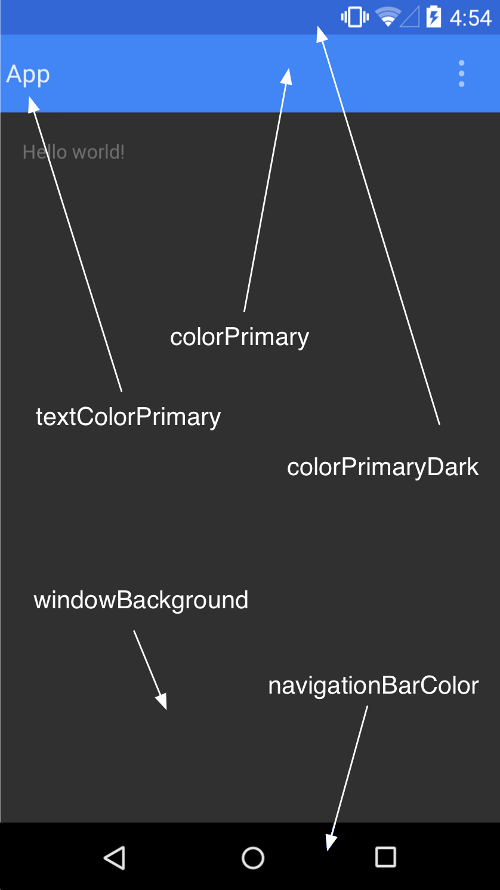

# Resource（资源）

+ [官方文档](https://developer.android.com/guide/topics/resources/providing-resources?hl=zh-cn)

## Theme（主题）



| 属性                       | 说明                                                         |
| -------------------------- | ------------------------------------------------------------ |
| colorPrimary               | 应用的主色调,ActionBar默认使用该颜色,ToolBar导航栏的底色     |
| colorPrimaryDark           | 应用的主要暗色调,StatusBar状态栏默认使用改颜色               |
| colorAccent                | 控件选中的默认颜色,如EditText 的闪动光标                     |
| android:colorControlNormal | 控件未选中时的默认颜色,如复选框                              |
| android:textColorPrimary   | 应用的主要文字颜色,ActionBar的标题文字默认颜色               |
| android:textColorSecondary | 辅助的文字颜色,一般比textColorPrimary的颜色弱一点,用于一些弱化的表示 |
| android:windowBackground   | 窗体背景颜色,必须用color.xml定义的颜色                       |
| android:navigationBarColor | 底部操作栏颜色 API>21                                        |

| 扩展属性                    | 扩展说明                                                  |
| --------------------------- | --------------------------------------------------------- |
| statusBarColor              | 状态栏颜色,默认使用colorPrimaryDark                       |
| colorForeground             | 应用的前景色,ListView的分割线，switch滑动区默认使用该颜色 |
| colorBackground             | 应用的背景色,popMenu的背景默认使用该颜色                  |
| colorControlHighlight       | 控件按压时的色调                                          |
| colorControlActivated       | 控件选中时的颜色，默认使用colorAccent                     |
| colorButtonNormal           | 默认按钮的背景颜色                                        |
| editTextColor               | 默认EditView输入框字体的颜色。                            |
| textColor                   | Button,textView的文字颜色                                 |
| textColorPrimaryDisableOnly | RadioButton,checkbox等控件的文字                          |
| colorSwitchThumbNormal      | switch thumbs 默认状态的颜色. (switch off)                |

### 基础知识

```xml
//代码抽取
使用Android Studio 的同学,可以直接在布局文件对应控件:
右键 -> Refactor -> Extract -> Style 抽取样式
右键 -> Refactor -> Extract -> Layout 抽取布局 include标签

//样式的方式有两种:
如果是对单个视图应用样式,在布局 XML 中的 View 元素添加 style 属性.
如果是对整个Activity或应用来应用样式,在 Android 清单中的或节点添加android:theme属性.

//系统自带的Theme and Style的标准属性文档
R.styleable.Theme该链接提供了系统自带的,可在主题(Theme)中使用的标准属性的列表
R.style该链接可查到系统自带的,在样式(Style)中使用的标准属性的列表
        
//Actvity或Application使用(Theme主题的使用)

```

### 主题的使用

+ 单个视图（View）使用

  ```xml
  1、在res/values/目录下自定义以节点的.xml文件(或直接在styles.xml也行)定义我们想要实现的样式
  <?xml version="1.0" encoding="utf-8"?>
  <resources>
      <style name="CodeFont" >
          <item name="android:layout_width">fill_parent</item>
          <item name="android:layout_height">wrap_content</item>
          <item name="android:textColor">#00FF00</item>
          <item name="android:typeface">monospace</item>
      </style>
  </resources>
  
  2、在对应的控件使用
  <TextView
          style="@style/CodeFont"
          android:text="Hello World!"
          />
  ```

  - 继承

    ```xml
    //继承系统的
    //.xml文件,@是说明系统已经定义过的，@android:style/  是必须带上的
        <style name="RedText" parent="@android:style/TextAppearance">
            <item name="android:textColor">#FF0000</item>
        </style>
    
      //控件
       <TextView
            style="@style/RedText"
            android:layout_width="wrap_content"
            android:layout_height="wrap_content"
            android:text="Hello World!"
            />
    
    //继承自定义的
    <style name="CodeFont.Blue">
            <item name="android:textColor">#0000FF</item>
        </style>
    
        <style name="CodeFont.Blue.Big">
            <item name="android:textColor">#0000FF</item>
            <item name="android:textSize">30sp</item>
        </style>
    ```

+ Actvity或Application使用(Theme主题的使用)

  ```xml
  1、声明样式
  <?xml version="1.0" encoding="utf-8"?>
  <resources>
   <style name="CustomTheme">
   <item name="android:windowNoTitle">true</item>
   <item name="windowFrame">@drawable/screen_frame</item>
   <item name="windowBackground">@drawable/screen_background_white</item>
   <item name="panelForegroundColor">#FF000000</item>
   <item name="panelBackgroundColor">#FFFFFFFF</item>
   <item name="panelTextColor">?panelForegroundColor</item>
   <item name="panelTextSize">14</item>
   <item name="menuItemTextColor">?panelTextColor</item>
   <item name="menuItemTextSize">?panelTextSize</item>
   </style>
  </resources>
  
  2、要为所有Activity设置主题,在AndroidManifest.xml清单文件中的节点,加入带样式名称的android:theme属性
  <application android:theme="@style/CustomTheme">
  <activity android:theme="@android:style/Theme.Dialog"> //（为某个Activity设置）系统的样式
  <activity android:theme="@style/CustomTheme"> //（为某个Activity设置）自定义的样式
  ```

  ```
  注意 : 我们用了@符号和?符号来应用资源.@符号表明了我们应用的资源是前边定义过的(或者在前一个项目中或者在Android 框架中).问号?表明了我们引用的资源的值在当前的主题当中定义过.通过引用在里边定义的名字可以做到(panelTextColor 用的颜色和panelForegroundColor中定义的一样)。这种技巧只能用在XML资源当中.
  ```

  - 继承

    ```xml
    <color name="custom_theme_color">#b0b0ff</color>
    <style name="CustomTheme" parent="android:Theme.Light">
        <item name="android:windowBackground">@color/custom_theme_color</item>
        <item name="android:colorBackground">@color/custom_theme_color</item>
    </style>
    ```

```
注意点：
1、句点链接名称的继承方式只适用于我们自定义的资源样式.无法继承Android内建样式,引用内建样式必须使用parent属性.
2、style属性不使用android:命名空间前缀 如:style=”@style/RedText”,style=..前
3、@符号表明了我们应用的资源是前边定义过的(或者在前一个项目中或者在Android 框架中)。问号？表明了我们引用的资源的值在当前的主题当中定义过。通过引用在里边定义的名字可以做到(panelTextColor 用的颜色和panelForegroundColor中定义的一样)。这中技巧只能用在XML资源当中。
4、style 和 Theme都具有继承属性,只是最终调用的位置不同而已
```

### 主题切换

#### 日夜切换（官方）

```Java
//在res/values/theme.xml下创建日间主题,在res/values-night/theme.xml创建夜间主题

//代码切换
//onCreate方法
if (savedInstanceState != null) {  //获取onSaveInstanceState的数据
            isNight = savedInstanceState.getBoolean("isNight");
        }

        /**
        setLocalNightMode的值的说明：
        MODE_NIGHT_NO： 使用亮色(light)主题，不使用夜间模式
        MODE_NIGHT_YES：使用暗色(dark)主题，使用夜间模式
        MODE_NIGHT_AUTO：根据当前时间自动切换 亮色(light)/暗色(dark)主题
        MODE_NIGHT_FOLLOW_SYSTEM(默认选项)：设置为跟随系统，通常为MODE_NIGHT_NO
        */
        findViewById(R.id.button).setOnClickListener((view) -> {
            if (!isNight) {
                getDelegate().setLocalNightMode(AppCompatDelegate.MODE_NIGHT_YES);//切换夜间模式
                isNight = true;
            } else {
                getDelegate().setLocalNightMode(AppCompatDelegate.MODE_NIGHT_NO);//切换日间模式
                isNight = false;
            }
            recreate();  //这句会使Activity重新创建
        });

//recreate方法之后会调用该方法
@Override
    protected void onSaveInstanceState( Bundle outState) {
        super.onSaveInstanceState(outState);
        outState.putBoolean("isNight", isNight);  //用于保存临时数据（最好还是保存到本地去，不然下次进来还是默认的日间模式）
    }
```

#### 换肤

```java
//自定义主题,通过setTheme方法手动设置主题,必须在setContentView之前
if (savedInstanceState != null) {
            isNight = savedInstanceState.getBoolean("isNight");
        }
        if (!isNight) {
            setTheme(R.style.Theme_Learn);
            isNight = true;
        } else {
            setTheme(R.style.Theme_Learn_OtherApp);
            isNight = false;
        }
setContentView(R.layout.activity_main);
```

### 全屏

```java
//theme设置
<style name="AppTheme" parent="AppBaseTheme">

        <!-- 设置无标题 -->
        <item name="android:windowNoTitle">true</item>
        <!-- 设置全屏 -->
        <item name="android:windowFullscreen">true</item>
    </style>
在AndroidManifest.xml中
<application
        android:allowBackup="true"
        android:icon="@drawable/ic_launcher"
        android:label="@string/app_name"
        android:theme="@style/AppTheme" >
。。。
</application>


//或者直接代码设置
//取消标题  
this.requestWindowFeature(Window.FEATURE_NO_TITLE);或
requestWindowFeature(R.style.AppTheme);  
//全屏  
this.getWindow().setFlags(WindowManager.LayoutParams.FLAG_FULLSCREEN,   
                    WindowManager.LayoutParams.FLAG_FULLSCREEN);  
```

### Activity切换黑屏、白屏

```xml
//1、设置背景图Theme  
<style name="Theme.AppStartLoad" parent="android:Theme">    
    <item name="android:windowBackground">@drawable/ipod_bg</item>    
    <item name="android:windowNoTitle">true</item>    
</style>  

//2、设置透明Theme  
<style name="Theme.AppStartLoadTranslucent" parent="android:Theme">    
    <item name="android:windowIsTranslucent">true</item>   
    <item name="android:windowNoTitle">true</item>    
</style>  
```

## Animation（动画）

### 帧动画

在res/drawable文件夹下创建

```java
//xml创建
<?xml version="1.0" encoding="utf-8"?>
<animation-list xmlns:android="http://schemas.android.com/apk/res/android"
    android:oneshot="false">// 是否只播放一次 false 循环播放
    <item
        android:drawable="@drawable/img01"
        android:duration="200" /> //持续时间
    <item
        android:drawable="@drawable/img02"
        android:duration="200" />
    <item
        android:drawable="@drawable/img03"
        android:duration="200" />
    <item
        android:drawable="@drawable/img04"
        android:duration="200" />
    <item
        android:drawable="@drawable/img05"
        android:duration="200" />
</animation-list>
<ImageView
        android:id="@+id/image"
        android:layout_width="200dp"
        android:layout_height="200dp"
        app:layout_constraintBottom_toBottomOf="parent"
        app:layout_constraintLeft_toLeftOf="parent"
        app:layout_constraintRight_toRightOf="parent"
        android:background="@drawable/animation_flower"
        app:layout_constraintTop_toBottomOf="@+id/button2" />
//开启动画和关闭动画
AnimationDrawable mAnimationDrawable;
mImageViewShow = findViewById(R.id.image);
// 获取动画对象
mAnimationDrawable = (AnimationDrawable) mImageViewShow.getBackground();
//开始动画
mAnimationDrawable.start();
//停止动画
mAnimationDrawable.stop();


//java代码创建
AnimationDrawable mAnimationDrawable;
mImageViewShow = findViewById(R.id.image);
// 获取动画对象
mAnimationDrawable =new AnimationDrawable();
mAnimationDrawable.addFrame(getResources().getDrawable(R.drawable.img01),200);
mAnimationDrawable.addFrame(getResources().getDrawable(R.drawable.img02),200);
mAnimationDrawable.addFrame(getResources().getDrawable(R.drawable.img03),200);
mAnimationDrawable.addFrame(getResources().getDrawable(R.drawable.img04),200);
mAnimationDrawable.addFrame(getResources().getDrawable(R.drawable.img05),200);
mAnimationDrawable.addFrame(getResources().getDrawable(R.drawable.img06),200);
mAnimationDrawable.setOneShot(false);//设置循环播放
mImageViewShow.setBackground(mAnimationDrawable);
//开始动画
mAnimationDrawable.start();
//停止动画
mAnimationDrawable.stop();
```

### 补间动画

在res/anim文件夹下创建

```
注意点：
补间动画执行之后并未改变View的真实布局属性。假设现在Activity中有一个 Button在屏幕上方，设置了平移动画移动到屏幕下方然后保持动画最后执行状态呆在屏幕下方。如果点击屏幕下方动画执行之后的Button是没有任何反应，而点击原来屏幕上方没有Button的地方却响应的是点击Button的事件，这一点是需要注意的
```

#### Translation（平移）

```java
//xml实现
<translate
     xmlns:android="http://schemas.android.com/apk/res/android"
     android:fromXDelta="0"
     android:fromYDelta="0"
     android:toYDelta="0"
     android:toXDelta="200"
     android:duration="500"
     android:fillAfter="true">
</translate>
 
//加载动画
Animation animation = AnimationUtils.loadAnimation(this, R.anim.animator_translate);
//执行动画
testBtn.startAnimation(animation);

//java实现
TranslateAnimation translateAnimation = new TranslateAnimation(0,200,0,0);
translateAnimation.setDuration(500);//动画执行时间
translateAnimation.setFillAfter(true);//动画执行完成后保持状态
//执行动画
testBtn.startAnimation(translateAnimation);


android:fromXDelta对应的就是TranslateAnimation(float fromXDelta, …) 起始点X轴坐标（数值、百分数、百分数p，譬如50表示以当前View左上角坐标加50px为初始点、50%表示以当前View的左上角加上当前View宽高的50%做为初始点、50%p表示以当前View的左上角加上父控件宽高的50%做为初始点）
android:fromYDelta对应的就是TranslateAnimation(…, float fromYDelta, …) 起始点Y轴从标，平移的规律同上
android:toXDelta对应的就是TranslateAnimation(…, float toXDelta, …) 结束点X轴坐标，平移的规律同上
android:toYDelta对应的就是TranslateAnimation(…, float toYDelta) 结束点Y轴坐标，平移的规律同上
```

#### Rotation（旋转）

```java
//xml实现
<?xml version="1.0" encoding="utf-8"?>
<rotate
     xmlns:android="http://schemas.android.com/apk/res/android"
     android:fromDegrees="0"
     android:toDegrees="90"
     android:pivotX="50%"
     android:pivotY="50%"
     android:duration="500"
     android:fillAfter="true">
</rotate>

//代码加载xml文件获取动画
Animation animation = AnimationUtils.loadAnimation(this, R.anim.animator_rotation);
testBtn.startAnimation(animation);

//代码方式实现
RotateAnimation rotateAnimation = new RotateAnimation(0,90,Animation.RELATIVE_TO_SELF,0.5f,Animation.RELATIVE_TO_SELF,0.5f);
rotateAnimation.setDuration(500);
rotateAnimation.setFillAfter(true);
testBtn.startAnimation(rotateAnimation);

android:fromDegrees对应的就是（RotateAnimation(float fromDegrees, …)）这个属性代表的是：旋转开始角度，正代表顺时针度数，负代表逆时针度数
android:toDegrees对应的就是（RotateAnimation(…, float toDegrees, …)）这个属性代表的是：旋转结束角度，正代表顺时针度数，负代表逆时针度数
android:pivotX对应的就是（RotateAnimation(…, float pivotX, …)）这个属性代表的是：缩放起点X坐标（数值、百分数、百分数p，譬如50表示以当前View左上角坐标加50px为初始点、50%表示以当前View的左上角加上当前View宽高的50%做为初始点、50%p表示以当前View的左上角加上父控件宽高的50%做为初始点）
android:pivotY对应的就是（RotateAnimation(…, float pivotY)）这个属性代表的是：缩放起点Y坐标
```

#### Scale（缩放）

```java
//xml实现
<?xml version="1.0" encoding="utf-8"?>
  <scale
      xmlns:android="http://schemas.android.com/apk/res/android"
      android:fromXScale="1"
      android:fromYScale="1"
      android:toYScale="2"
      android:toXScale="2"
      android:duration="500"
      android:pivotX="50%"
      android:pivotY="50%"
      android:fillAfter="true">
  </scale>

//代码加载xml文件获取动画
Animation animation = AnimationUtils.loadAnimation(this, R.anim.animator_scal);
testBtn.startAnimation(animation);

//代码方式实现
ScaleAnimation scaleAnimation = new ScaleAnimation(1,2,1,2,Animation.RELATIVE_TO_SELF,0.5f,Animation.RELATIVE_TO_SELF,0.5f);
scaleAnimation.setDuration(500);
scaleAnimation.setFillAfter(true);
testBtn.startAnimation(scaleAnimation);

android:fromXScale对应的就是（ScaleAnimation(float fromX, …)这个属性代表的是：初始X轴缩放比例，1.0表示无变化
android:toXScale对应的就是（ScaleAnimation(…, float toX, …)这个属性代表的是：结束X轴缩放比例
android:fromYScale对应的就是（ScaleAnimation(…, float fromY, …)这个属性代表的是：初始Y轴缩放比例
android:toYScale对应的就是（ScaleAnimation(…, float toY, …)这个属性代表的是：结束Y轴缩放比例
android:pivotX对应的就是（ScaleAnimation(…, float pivotX, …)这个属性代表的是：缩放起点X轴坐标（数值、百分数、百分数p，譬如50表示以当前View左上角坐标加50px为初始点、50%表示以当前View的左上角加上当前View宽高的50%做为初始点、50%p表示以当前View的左上角加上父控件宽高的50%做为初始点）
android:pivotY对应的就是（ScaleAnimation(…, float pivotY)这个属性代表的是：缩放起点Y轴坐标，同上规律
```

#### Alpha（透明度）

```java
//xml实现
<?xml version="1.0" encoding="utf-8"?>
 <alpha
     xmlns:android="http://schemas.android.com/apk/res/android"
     android:fromAlpha="1"
     android:toAlpha="0.2"
     android:duration="500"
     android:fillAfter="true">
 </alpha>

//代码加载xml文件获取动画
Animation animation = AnimationUtils.loadAnimation(this, R.anim.animator_alpha);
testBtn.startAnimation(animation);

//代码方式实现
AlphaAnimation alphaAnimation = new AlphaAnimation(1,0.2f);
alphaAnimation.setDuration(500);
alphaAnimation.setFillAfter(true);
testBtn.startAnimation(alphaAnimation);

android:fromAlpha对应的就是（AlphaAnimation(float fromAlpha, …) ）这个属性代表的是：动画开始的透明度（0.0到1.0，0.0是全透明，1.0是不透明）
android:toAlpha对应的就是（AlphaAnimation(…, float toAlpha)）这个属性代表的是：动画结束的透明度（0.0到1.0，0.0是全透明，1.0是不透明）
```

#### Set（组合动画）

```java
<?xml version="1.0" encoding="utf-8"?>
<set xmlns:android="http://schemas.android.com/apk/res/android"
    android:interpolator="@[package:]anim/interpolator_resource"
  >
    <alpha
        android:fromAlpha="float"
        android:toAlpha="float" />
    <scale
        android:fromXScale="float"
        android:toXScale="float"
        android:fromYScale="float"
        android:toYScale="float"
        android:pivotX="float"
        android:pivotY="float" />
    <translate
        android:fromXDelta="float"
        android:toXDelta="float"
        android:fromYDelta="float"
        android:toYDelta="float" />
    <rotate
        android:fromDegrees="float"
        android:toDegrees="float"
        android:pivotX="float"
        android:pivotY="float" />

</set>
            
ImageView view = (ImageView) findViewById(R.id.image);
Animation animationSet = AnimationUtils.loadAnimation(this, R.anim.aset);

//一些拓展API
//开始动画集
animationSet.start();
//取消动画集
animationSet.cancel();
//判断当前动画集是否开始
animationSet.hasStarted();
//判断当前动画集是否结束
animationSet.hasEnded();
//重新开始当前动画集
animationSet.reset();
view.startAnimation(animationSet);
```

#### Interpolator（插值器）

插值器的用处，用简单的来说，是处理动画执行变化率的。插值器可对现有的动画效果执行加速、减速、重复、退回等

```java
//xml设置
<?xml version="1.0" encoding="utf-8"?>
<translate xmlns:android="http://schemas.android.com/apk/res/android"
    android:duration="2000"
    android:interpolator="@android:anim/accelerate_interpolator"
    android:fillAfter="true"
    android:fromXDelta="0"
    android:fromYDelta="0"
    android:toXDelta="0"
    android:toYDelta="500" />

//也可以代码中设置：
animation.setInterpolator(new BounceInterpolator());

//Android提供的插值器
AccelerateDecelerateInterpolator	@android:anim/accelerate_decelerate_interpolator（默认的）
AccelerateInterpolator	@android:anim/accelerate_interpolator 速度随着时间流逝越来越大（加速运动）
DecelerateInterpolator	@android:anim/decelerate_interpolator 速度随着时间流逝越来越小（减速运动）
AnticipateInterpolator	@android:anim/anticipate_interpolator 开始时缓慢向前，后向后越来越快（类似弹射）
AnticipateOvershootInterpolator	@android:anim/anticipate_overshoot_interpolator 先向相反方向改变，再加速播放，会超出目标值然后缓慢移动至目标值，类似于弹簧回弹。
BounceInterpolator	@android:anim/bounce_interpolator 小球下落弹跳
CycleInterpolator	@android:anim/cycle_interpolator 动画循环一定次数，值的改变为一正弦函数：Math.sin(2 * mCycles * Math.PI * input)
LinearInterpolator	@android:anim/linear_interpolator 线性均匀改变
OvershootInterpolator	@android:anim/overshoot_interpolator 最后超出目标值然后缓慢改变到目标值
    
//自定义（实现Interpolator接口）
```

### 属性动画

在res/animator文件夹下创建

#### ValueAnimator

ValueAnimator实现动画的原理是通过不断控制值的变化，然后手动赋给对象的属性，从而实现动画效果。ValueAnimator的大致流程是，先指定将初始值以何种数值（整型、浮点型）的形式 过渡到结束值；接着，开发者手动将值，赋值给目标的属性值。

```java
/**
  * ValueAnimator创建对象姿势一：
  * 调用ofInt(int...)、ofFloat（float...）
  * 形参是可变参数、可传多个参数
  * 将传入的多个Int参数进行平滑过渡:假设此处传入0和3,表示将值从0平滑过渡到3
  * 以此类推如果传入了3个Int参数 a,b,c ,则是先从a平滑过渡到b,再从b平滑过渡到C，
*/
ValueAnimator animInt = ValueAnimator.ofInt(0, 3);
ValueAnimator animFoat = ValueAnimator.ofFloat(0, 3);

textView = findViewById(R.id.ob_text);
ValueAnimator animInt = ValueAnimator.ofInt(0, 3);
// 设置动画运行的时长
animInt.setDuration(500);
// 设置动画延迟播放时间
animInt.setStartDelay(500);
// 设置动画重复播放次数 = 重放次数+1
// 动画播放次数 = infinite时,动画无限重复
animInt.setRepeatCount(0);
// 设置重复播放动画模式
// ValueAnimator.RESTART(默认):正序重放
// ValueAnimator.REVERSE:倒序回放
animInt.setRepeatMode(ValueAnimator.RESTART);
animInt.addUpdateListener(new ValueAnimator.AnimatorUpdateListener() {
            @Override
            public void onAnimationUpdate(ValueAnimator animation) {
                float fraction = animation.getAnimatedFraction();
                float value = (float) animation.getAnimatedValue();  //获取属性值
                //在这里设置具体的动画属性值
                textView.setTranslationX(value);
            }
        });
 //开启动画
animInt.start();

/**
  * ValueAnimator实例化对象姿势二：
  * 参数一：TypeEvaluator 估值器
  * 参数二：Object... values 可变参数，可以传入具体的动画对象（开始-结束）
  */
ValueAnimator valueAnimator = ValueAnimator.ofObject(new TypeEvaluator() {
            @Override
            public Object evaluate(float fraction, Object startValue, Object endValue) {
                return null;
            }
},"","");


//xml标签（ValueAnimator对应的xml节点<animator>）
android:valueTo 必须的，目标值
android:valueFrom 必须的，起始值
android:duration 持续时间单位ms，默认值300ms
android:startOffset 调用start后延迟多少ms执行动画
android:repeatCount 重复次数，0表示不重复，1表示重复一次，-1表示无限循环
android:repeatMode reverse | restart 前者表示偶数次动画将动画起点当做终点，将终点当成起点，默认restart
android:valueType intType | floatType(default)，当value为颜色时，不要设置该值

<!--res/animator/animator_animator.xml-->
<?xml version="1.0" encoding="utf-8"?>
<animator xmlns:android="http://schemas.android.com/apk/res/android" android:valueFrom="0" android:valueTo="100" android:duration="1000" android:repeatMode="reverse" android:repeatCount="0" android:startOffset="1000"/>

ValueAnimator animator_object = (ValueAnimator) AnimatorInflater.loadAnimator(this, R.animator.animator_animator);
animator_object.addUpdateListener(new ValueAnimator.AnimatorUpdateListener() {
      @Override
      public void onAnimationUpdate(ValueAnimator animation) {
          Log.d(TAG, "onAnimationUpdate: " + animation.getAnimatedValue());
      }
});
animator_object.start();
```

#### ObjectAnimator

ObjectAnimator简单理解是直接对对象的属性值进行改变操作，从而实现动画效果。ObjectAnimator本质是通过不断控制值的变化，再不断自动赋给对象的属性，从而实现动画效果。

```java
//目标view  
TextView mTextView = findViewById(R.id.ob_text);
//平移动画
ObjectAnimator translationAnimator = ObjectAnimator.ofFloat(mTextView, "translationX", 200);
// 设置动画运行的时长
translationAnimator.setDuration(500);
// 设置动画延迟播放时间
translationAnimator.setStartDelay(500);
// 设置动画重复播放次数 = 重放次数+1 默认是0
// 动画播放次数 = infinite时,设置为 -1 动画无限重复
translationAnimator.setRepeatCount(-1);
// 设置重复播放动画模式
// ValueAnimator.RESTART(默认):正序重放
// ValueAnimator.REVERSE:倒序回放
translationAnimator.setRepeatMode(ValueAnimator.RESTART);
//开始动画
translationAnimator.start();
//旋转动画
ObjectAnimator rotation = ObjectAnimator.ofFloat(mTextView,"rotation",90);
rotation.setDuration(500);
rotation.start();
//缩放动画
ObjectAnimator scaleX = ObjectAnimator.ofFloat(mTextView,"scaleX",1.5f);
scaleX.setDuration(500);
scaleX.start();
//透明度动画
ObjectAnimator alpha = ObjectAnimator.ofFloat(mTextView,"alpha",0.2f);
alpha.setDuration(500);
alpha.start();

//ObjectAnimator来同时实现多个效果一起运行
PropertyValuesHolder holder1 = PropertyValuesHolder.ofFloat("translationX",200);
PropertyValuesHolder holder2 = PropertyValuesHolder.ofFloat("translationY",200) ;
PropertyValuesHolder holder3 = PropertyValuesHolder.ofFloat("rotation",90) ;
PropertyValuesHolder holder4 = PropertyValuesHolder.ofFloat("scaleX",1.5f) ;
PropertyValuesHolder holder5 = PropertyValuesHolder.ofFloat("alpha",0.2f) ;
//ObjectAnimator.ofPropertyValuesHolder（）
//参数一：目标view
//参数二：可变参数 支持多个PropertyValuesHolder
ObjectAnimator animator = ObjectAnimator.ofPropertyValuesHolder(mTextView, holder1, holder2,holder3,holder4,holder5);
animator.setDuration(500);
animator.start();

//xml标签（ObjectAnimator对应的xml节点<objectAnimator >）
android:propertyName 必须的，需要操作的属性
android:valueTo 必须的，目标值
android:valueFrom 起始值，如果不设置，会调用target的get方法，如果get方法不存在则会报错(可以使用装饰器模式)
android:duration 持续时间单位ms，默认值300ms
android:startOffset 调用start后延迟多少ms执行动画
android:repeatCount 重复次数，0表示不重复，1表示重复一次，-1表示无限循环
android:repeatMode reverse | restart 前者表示偶数次动画将动画起点当做终点，将终点当成起点，默认restart
android:valueType intType | floatType(default)，当value为颜色时，不要设置该值

<!--res/animator/animator_object.xml-->
<?xml version="1.0" encoding="utf-8"?>
<objectAnimator xmlns:android="http://schemas.android.com/apk/res/android" 
    android:propertyName="translationX" 
    android:valueTo="700f" android:duration="2000" 
    android:startOffset="1000" 
    android:repeatCount="-1" 
    android:repeatMode="reverse" />

Animator animator_object = AnimatorInflater.loadAnimator(this, R.animator.animator_object);
animator_object.setTarget(btn);
animator_object.start();
```

#### AnimatorSet（组合动画）

```java
/**
实现组合动画功能主要需要借助AnimatorSet这个类，这个类提供了一个play()方法，如果我们向这个方法中传入一个Animator对象(ValueAnimator或ObjectAnimator)将会返回一个AnimatorSet.Builder的实例，AnimatorSet.Builder中包括以下四个方法：
after(Animator anim)   将现有动画插入到传入的动画之后执行
after(long delay)   将现有动画延迟指定毫秒后执行
before(Animator anim)   将现有动画插入到传入的动画之前执行
with(Animator anim)   将现有动画和传入的动画同时执行
*/

ObjectAnimator moveIn = ObjectAnimator.ofFloat(textview, "translationX", -500f, 0f);
ObjectAnimator rotate = ObjectAnimator.ofFloat(textview, "rotation", 0f, 360f);
ObjectAnimator fadeInOut = ObjectAnimator.ofFloat(textview, "alpha", 1f, 0f, 1f);
AnimatorSet animSet = new AnimatorSet();
animSet.play(rotate).with(fadeInOut).after(moveIn);
animSet.setDuration(5000);
animSet.start();

//xml标签（AnimatorSet对应的xml节点<set>）
android:ordering 执行顺序 sequentially | together (default)，前者表示顺序执行，上个动画执行完了，下个动画才开始执行，如果上个动画repeatCount为-1则下个动画永远不可能执行，后者表示同时执行
<!--res/animator/animator_set.xml-->
<?xml version="1.0" encoding="utf-8"?>
<set android:ordering="together" xmlns:android="http://schemas.android.com/apk/res/android">
    <objectAnimator xmlns:android="http://schemas.android.com/apk/res/android" 
        android:propertyName="translationX" 
        android:valueTo="700f" 
        android:duration="2000"
        android:startOffset="1000"
        android:repeatCount="-1"
        android:repeatMode="reverse" />
    <objectAnimator xmlns:android="http://schemas.android.com/apk/res/android" 
        android:propertyName="backgroundColor" 
        android:valueTo="#000" 
        android:duration="2000" 
        android:startOffset="1000" 
        android:repeatCount="-1" 
        android:repeatMode="reverse" />
</set>

Animator animator_object = AnimatorInflater.loadAnimator(this, R.animator.animator_set);
animator_object.setTarget(btn);
animator_object.start();
```

#### Animator监听器

```java
//添加监听器
anim.addListener(new AnimatorListener() {
	@Override
	public void onAnimationStart(Animator animation) {
        //动画开始
	}
 
	@Override
	public void onAnimationRepeat(Animator animation) {
        //动画重复
	}
 
	@Override
	public void onAnimationEnd(Animator animation) {
        //动画结束
	}
 
	@Override
	public void onAnimationCancel(Animator animation) {
        //动画取消
	}
    
//可能我只想要监听动画结束这一个事件，那么每次都要将四个接口全部实现一遍就显得非常繁琐。没关系，为此Android提供了一个适配器类，AnimatorListenerAdapter，使用这个类就可以解决掉实现接口繁琐的问题了，如下所示：
anim.addListener(new AnimatorListenerAdapter() {
	@Override
	public void onAnimationEnd(Animator animation) {
	}
});
```

#### TypeEvaluator（估值器）

这个函数返回线性插值起始值和结束值的结果。其中参数fraction代表起始值和结束值之间的比例。简单的计算公式是：result = x0 + t * (x1 - x0);参数的具体是指：x0=startValue;x1=endValue;t=fraction最后，这个方法返回的是，在开始和结束值之间的线性插值，给定分数参数。

```java
 /**
   * TypeEvaluator里面的泛型可以根据业务去订制
   */
class MyEvaluator implements TypeEvaluator<Object>{

        @Override
        public Object evaluate(float fraction, Object startValue, Object endValue) {
            /**
             * 计算公式自己随意拓展
             */
            return null;
        }
}

//设置估值器
ValueAnimator valueAnimator = ValueAnimator.ofObject(new MyEvaluator())
```

#### Interpolator（插值器见补间动画）

## Drawable（可绘制对象资源）

位于res/drawable目录下

### 位图文件

位图图形文件（`.png`、`.jpg` 或 `.gif`）

```xml
//位图文件
//位图文件例子（res/drawable/myimage.png）
//xml中使用
<ImageView
    android:layout_height="wrap_content"
    android:layout_width="wrap_content"
    android:src="@drawable/myimage" />
    
//Java获取
Resources res = getResources();
Drawable drawable = ResourcesCompat.getDrawable(res, R.drawable.myimage, null);

//xml位图
<?xml version="1.0" encoding="utf-8"?>
<bitmap
    xmlns:android="http://schemas.android.com/apk/res/android"
    android:src="@[package:]drawable/drawable_resource"  //可绘制对象资源。必备。引用可绘制对象资源
    android:antialias=["true" | "false"] //布尔值。启用或停用抗锯齿。
    android:dither=["true" | "false"] //当位图的像素配置与屏幕不同时（例如：ARGB 8888 位图和 RGB 565 屏幕），启用或停用位图抖动。
    android:filter=["true" | "false"] //启用或停用位图过滤。当位图收缩或拉伸以使其外观平滑时使用过滤
    android:gravity=["top" | "bottom" | "left" | "right" | "center_vertical" |
                      "fill_vertical" | "center_horizontal" | "fill_horizontal" |
                      "center" | "fill" | "clip_vertical" | "clip_horizontal"] //定义位图的重力。重力指示当位图小于容器时，可绘制对象在其容器中放置的位置。
    android:mipMap=["true" | "false"] //启用或停用 mipmap 提示
    android:tileMode=["disabled" | "clamp" | "repeat" | "mirror"] //定义平铺模式。当平铺模式启用时，位图会重复。重力在平铺模式启用时将被忽略
        /> 
//xml位图例子
<?xml version="1.0" encoding="utf-8"?>
<bitmap xmlns:android="http://schemas.android.com/apk/res/android"
    android:src="@drawable/icon"
    android:tileMode="repeat" />
```

### 九宫图文件

具有可伸缩区域的 PNG 文件，支持根据内容调整图像大小 (`.9.png`)

### 状态列表（selector）

它会根据对象状态，使用多个不同的图像来表示同一个图形。例如，`Button` 微件可以是多种不同状态（按下、聚焦或这两种状态都不是）中的其中一种，并且您可利用状态列表可绘制对象，为每种状态提供不同的背景图片。

```xml
<?xml version="1.0" encoding="utf-8"?>
<selector xmlns:android="http://schemas.android.com/apk/res/android"  //selector必须的根元素
    android:constantSize=["true" | "false"] //如果可绘制对象报告的内部大小在状态变更时保持不变，则值为“true”（大小是所有状态的最大值）；如果大小根据当前状态而变化，则值为“false”。默认值为 false
    android:dither=["true" | "false"]  //值为“true”时，将在位图的像素配置与屏幕不同时
    android:variablePadding=["true" | "false"] //如果可绘制对象的内边距应根据选择的当前状态而变化，则值为“true”；如果内边距应保持不变（基于所有状态的最大内边距），则值为“false”。启用此功能要求您在状态变更时处理执行布局，这通常不受支持。默认值为 false。
          >
    <item
        android:drawable="@[package:]drawable/drawable_resource" //可绘制对象资源。必备。引用可绘制对象资源
        android:state_pressed=["true" | "false"]  //如果在按下对象（例如触摸/点按某按钮）时应使用此项目，则值为“true”；如果在默认的未按下状态时应使用此项目，则值为“false”
        android:state_focused=["true" | "false"]  //如果在对象具有输入焦点（例如当用户选择文本输入时）时应使用此项目，则值为“true”；如果在默认的非焦点状态时应使用此项目，则值为“false”。
        android:state_hovered=["true" | "false"]  //如果当光标悬停在对象上时应使用此项目，则值为“true”；如果在默认的非悬停状态时应使用此项目，则值为“false”。通常，这个可绘制对象可能与用于“聚焦”状态的可绘制对象相同
        android:state_selected=["true" | "false"] //如果在使用定向控件浏览（例如使用方向键浏览列表）的情况下对象为当前用户选择时应使用此项目，则值为“true”；如果在未选择对象时应使用此项目，则值为“false”。当焦点 (android:state_focused) 不充分（例如，列表视图有焦点但使用方向键选择其中的项目）时，使用所选状态
        android:state_checkable=["true" | "false"] //如果当对象可选中时应使用此项目，则值为“true”；如果当对象不可选中时应使用此项目，则值为“false”。（仅当对象可在可选中与不可选中小部件之间转换时才有用。）
        android:state_checked=["true" | "false"]  //如果当对象可选中时应使用此项目，则值为“true”；如果当对象不可选中时应使用此项目，则值为“false”。（仅当对象可在可选中与不可选中小部件之间转换时才有用。）
        android:state_enabled=["true" | "false"] //如果在对象启用（能够接收触摸/点击事件）时应使用此项目，则值为“true”；如果在对象停用时应使用此项目，则值为“false”。
        android:state_activated=["true" | "false"] //如果在对象激活作为持续选择（例如，在持续导航视图中“突出显示”之前选中的列表项）时应使用此项目，则值为“true”；如果在对象未激活时应使用此项目，则值为“false”。
        android:state_window_focused=["true" | "false"] /如果当应用窗口有焦点（应用在前台）时应使用此项目，则值为“true”；如果当应用窗口没有焦点（例如，通知栏下拉或对话框出现）时应使用此项目，则值为“false”
          />
</selector>

//例子
//1、xml文件
<?xml version="1.0" encoding="utf-8"?>
<selector xmlns:android="http://schemas.android.com/apk/res/android">
    <item android:state_pressed="true"
          android:drawable="@drawable/button_pressed" /> <!-- pressed -->
    <item android:state_focused="true"
          android:drawable="@drawable/button_focused" /> <!-- focused -->
    <item android:state_hovered="true"
          android:drawable="@drawable/button_focused" /> <!-- hovered -->
    <item android:drawable="@drawable/button_normal" /> <!-- default -->
</selector>

//2、xml使用
<Button
    android:layout_height="wrap_content"
    android:layout_width="wrap_content"
    android:background="@drawable/button" />
```

### 形状（shape）

简单图形绘制

```xml
<?xml version="1.0" encoding="utf-8"?>
<shape
    xmlns:android="http://schemas.android.com/apk/res/android"
    android:shape=["rectangle" | "oval" | "line" | "ring"] //矩形（默认）、椭圆、线、环形
       > 
    <corners //为形状产生圆角。仅当形状为矩形时适用。
        android:radius="integer" //尺寸。所有角的半径，以尺寸值或尺寸资源表示。对于每个角，这会被以下属性覆盖
        android:topLeftRadius="integer" // 左上角的半径
        android:topRightRadius="integer" //右上角的半径
        android:bottomLeftRadius="integer" //左下角的半径
        android:bottomRightRadius="integer" //右下角的半径
             />
    <gradient  //形状的渐变颜色
        android:angle="integer"  //渐变的角度（度）。0 为从左到右，90 为从上到上。必须是 45 的倍数。默认值为 0
        android:centerX="float"  //渐变中心的相对 X 轴位置 (0 - 1.0)
        android:centerY="float"  //渐变中心的相对 Y 轴位置 (0 - 1.0)
        android:centerColor="integer" //起始颜色与结束颜色之间的可选颜色，以十六进制值或颜色资源表示
        android:endColor="color"  //结束颜色，表示为十六进制值或颜色资源
        android:gradientRadius="integer" //渐变的半径。仅在 android:type="radial" 时适用
        android:startColor="color" //起始颜色，表示为十六进制值或颜色资源。
        android:type=["linear" | "radial" | "sweep"] //"linear"	线性渐变。这是默认值。"radial"	径向渐变。起始颜色为中心颜色。"sweep"	流线型渐变。
        android:useLevel=["true" | "false"] /> //
    <padding //要应用到包含视图元素的内边距（这会填充视图内容的位置，而非形状
        android:left="integer" //左内边距
        android:top="integer"  //上内边距
        android:right="integer" //右内边距
        android:bottom="integer" //下内边距
             />
    <size  //形状的大小
        android:width="integer"  //形状的宽度
        android:height="integer" //形状的高度
          />
    <solid //用于填充的颜色
        android:color="color" //描边 
           /> 
    <stroke //描边
        android:width="integer" //图像描边宽度
        android:color="color"   //图像描边颜色
        android:dashWidth="integer" //短划线的间距
        android:dashGap="integer" //每个短划线的大小
            />
</shape>

//例子
//1、定义
<?xml version="1.0" encoding="utf-8"?>
<shape xmlns:android="http://schemas.android.com/apk/res/android"
    android:shape="rectangle">
    <gradient
        android:startColor="#FFFF0000"
        android:endColor="#80FF00FF"
        android:angle="45"/>
    <padding android:left="7dp"
        android:top="7dp"
        android:right="7dp"
        android:bottom="7dp" />
    <corners android:radius="8dp" />
</shape>

//2、xml使用
<TextView
    android:background="@drawable/gradient_box"
    android:layout_height="wrap_content"
    android:layout_width="wrap_content" />

//3、Java使用
Resources res = getResources();
Drawable shape = ResourcesCompat.getDrawable(res, R.drawable.gradient_box, getTheme());
TextView tv = (TextView)findViewById(R.id.textview);
tv.setBackground(shape);
```

## 国际化

+ [AndroidLocalize](https://github.com/Airsaid/AndroidLocalizePlugin)

## 其他资源

### res/raw和assets

```java
/**
相同点：
    两个文件夹下的文件都不会被编译成二进制文件，都会被原封不动的放到apk中。

不同点：
    asset下的文件不会被映射到R文件中，raw下的文件会被映射到R文件中。
    因为raw文件可以映射到R文件中，所以可以使用R.raw.xxx的方法去引用资源。
    asset下可以有目录结构，raw下不能有目录结构。
**/

//raw
//1、获取文件的绝对路径
Uri uri=Uri.paese("android:resource://包名/"+R.raw.xxx);
//2、获取流
InputStream is=getResources().openRawResource(R.raw.XXX);

//assets
//1、加载网页（assets/下的index.html网页）
webView.loadUrl("file:///android_asset/index.html");

//2、加载图片
InputStream inputStream = getAssets().open("haha.jpg");
Bitmap bitmap = BitmapFactory.decodeStream(inputStream);
ivShow.setImageBitmap(bitmap);

//3、加载文本文件
InputStream is = getAssets().open("nicai.txt");
ByteArrayOutputStream baos = new ByteArrayOutputStream();
int len = -1;
byte[] buffer = new byte[1024];
while ((len = is.read(buffer)) != -1) {
     baos.write(buffer, 0, len);
}
String rel = baos.toString();
Log.d("xl", rel);
is.close();

//4、加载音乐
//打开指定音乐文件,获取assets目录下指定文件的AssetFileDescriptor对象
AssetFileDescriptor afd = getAssets().openFd("demo.mp3");
//使用MediaPlayer加载指定的声音文件。 
MediaPlayer mediaPlayer = new MediaPlayer();
mediaPlayer.setDataSource(afd.getFileDescriptor(), afd.getStartOffset(), afd.getLength());
mediaPlayer.prepare();
mediaPlayer.start();

//复制到SD卡去
InputStream is = getAssets().open("nicai.txt");
File newFile = new File(Environment.getExternalStorageDirectory().getAbsoluteFile(), "nicai.txt");
FileOutputStream fos = new FileOutputStream(newFile);
int len = -1;
byte[] buffer = new byte[1024];
while ((len = is.read(buffer)) != -1) {
    fos.write(buffer, 0, len);
}
fos.close();
is.close();
```

### res/values目录

将其他原始值定义为静态资源

#### colors.xml

```xml
//颜色使用 RGB 值和 alpha 通道指定。您可以在接受十六进制颜色值的任何地方使用颜色资源
//可接受的颜色类型：#RGB  #ARGB   #RRGGBB  #AARRGGBB

//例子
//1、定义
 <?xml version="1.0" encoding="utf-8"?>
    <resources>
       <color name="opaque_red">#f00</color>
       <color name="translucent_red">#80ff0000</color>
</resources>

//2、Java中使用
Resources res = getResources();
int color = res.getColor(R.color.opaque_red);

//3、xml中使用
 <TextView
        android:layout_width="fill_parent"
        android:layout_height="wrap_content"
        android:textColor="@color/translucent_red"
        android:text="Hello"/>
```

#### bools.xml

```xml
//在 XML 中定义的布尔值。

//例子
//1、定义
<?xml version="1.0" encoding="utf-8"?>
    <resources>
        <bool name="screen_small">true</bool>
        <bool name="adjust_view_bounds">true</bool>
</resources>

//2、Java中使用
Resources res = getResources();
boolean screenIsSmall = res.getBoolean(R.bool.screen_small);

//3、xml中使用
<ImageView
        android:layout_height="fill_parent"
        android:layout_width="fill_parent"
        android:src="@drawable/logo"
        android:adjustViewBounds="@bool/adjust_view_bounds" />
```

#### ids.xml

```xml
//在 XML 中定义的唯一资源 ID。Android 开发者工具可使用您在 <item> 元素中提供的名称，在您项目的 R.java 类中创建唯一的整数，供您用作应用资源（例如，界面布局中的 View）的标识符，或创建唯一的整数，供您在应用代码中使用（例如，作为对话框的 ID 或结果代码）

//例子
//1、定义
<?xml version="1.0" encoding="utf-8"?>
    <resources>
        <item type="id" name="button_ok" />
        <item type="id" name="dialog_exit" />
</resources>

//2、Java中使用
showDialog(R.id.dialog_exit);
    
protected Dialog onCreateDialog(int id) {
        Dialog dialog;
        switch(id) {
        case R.id.dialog_exit:
            ...
            break;
        default:
            dialog = null;
        }
        return dialog;
    }

//3、xml中使用
<Button android:id="@id/button_ok"
        style="@style/button_style" />
```

#### integers.xml

```xml
//在XML中定义的整数或者整型数组

//定义整数例子
//1、定义
<?xml version="1.0" encoding="utf-8"?>
    <resources>
        <integer name="max_speed">75</integer>
        <integer name="min_speed">5</integer>
 </resources>
    

//2、Java中使用
Resources res = getResources();
int maxSpeed = res.getInteger(R.integer.max_speed);

//定义整数数组例子
//1、定义
<?xml version="1.0" encoding="utf-8"?>
    <resources>
        <integer-array name="bits">
            <item>4</item>
            <item>8</item>
            <item>16</item>
            <item>32</item>
        </integer-array>
    </resources>
    

//2、Java中使用
Resources res = getResources();
int[] bits = res.getIntArray(R.array.bits);
```

#### arrays.xml

```xml
//在 XML 中定义的 TypedArray。您可以使用这种资源创建其他资源（例如可绘制对象）的数组。请注意，此类数组不要求所含的资源具有相同的类型，因此您可以创建混合资源类型的数组，但必须知道数组中有哪些数据类型及其位置，以便可以使用 TypedArray 的 get...() 方法正确获取每一项数据。

//例子
//1、定义
<?xml version="1.0" encoding="utf-8"?>
    <resources>
        <array name="icons">
            <item>@drawable/home</item>
            <item>@drawable/settings</item>
            <item>@drawable/logout</item>
        </array>
        <array name="colors">
            <item>#FFFF0000</item>
            <item>#FF00FF00</item>
            <item>#FF0000FF</item>
        </array>
    </resources>
    

//2、Java中使用
Resources res = getResources();
TypedArray icons = res.obtainTypedArray(R.array.icons);
Drawable drawable = icons.getDrawable(0);

TypedArray colors = res.obtainTypedArray(R.array.colors);
int color = colors.getColor(0,0);
```

#### strings.xml

```xml
//在XML中定义字符串或者字符串数组或者复数

//字符串例子
//1、定义
<?xml version="1.0" encoding="utf-8"?>
<resources>
    <string name="hello">Hello!</string>
</resources>

//2、Java中使用
String string = getString(R.string.hello);

//3、xml中使用
<TextView
    android:layout_width="fill_parent"
    android:layout_height="wrap_content"
    android:text="@string/hello" /
          
//字符串数组例子
//1、定义
<resources>
    <string-array name="planets_array">
        <item>Mercury</item>
        <item>Venus</item>
        <item>Earth</item>
        <item>Mars</item>
    </string-array>
</resources>

//2、Java中使用
Resources res = getResources();
String[] planets = res.getStringArray(R.array.planets_array);

//复数例子（plurals标签）
```

#### styles.xml

```xml
//样式
和theme.xml的相同点：
两者的定义相同、继承方式也相同
和theme.xml的不同点：
Theme 是用来设置应用全局主题风格的，对整个应用或某个Activity存在影响
Style 主要是用在View上的
如果一个应用使用了theme，同时应用下的view也使用了style，那么当theme与样式style发生冲突时，style的优先级高于主题

//1、定义
<?xml version="1.0" encoding="utf-8"?>
    <resources>
        <style name="CustomText" parent="@style/Text">
            <item name="android:textSize">20sp</item>
            <item name="android:textColor">#008</item>
        </style>
    </resources>

//2、xml中使用
将样式应用于 TextView 的 XML 文件（保存在 res/layout/ 中）：
<?xml version="1.0" encoding="utf-8"?>
<EditText
        style="@style/CustomText"
        android:layout_width="fill_parent"
        android:layout_height="wrap_content"
        android:text="Hello, World!" />
```

