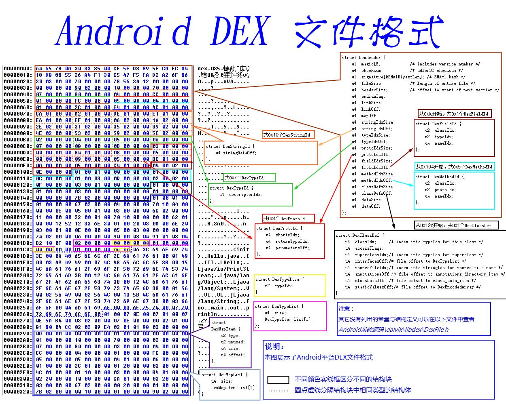
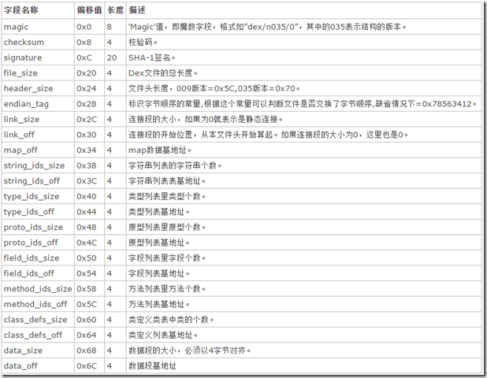
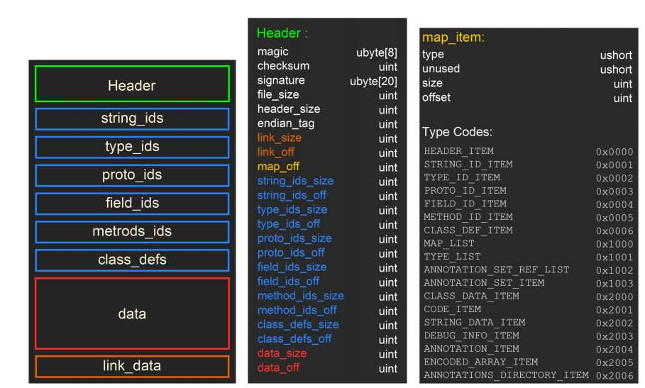

# Dex

+ [官网定义的结构](https://source.android.com/devices/tech/dalvik/dex-format#field-id-item)

## 文件结构



### 文件头

```
dex文件头一般固定为0x70个字节大小，包含标志、版本号、校验码、sha-1签名以及其他一些方法、类的数量和偏移地址等信息。如下图所示
```





### map_off

指定 DexMapList 结构体距离 Dex 头的偏移

```c++
// DexMapList 结构体：
struct  DexMapList  
{  
    u4     size;                                   // DexMapItem 的个数  
    DexMapItem     list[1];               // 一个 DexMapItem 结构体数组
};

//DexMapItem 结构体：

struct  DexMapItem  
{  
    u2     type;                    // kDexType 开头的类型  
    u2     unused;               // 未使用，用于对齐  
    u4     size;                     // 指定类型的个数  
    u4     offset;                 // 指定类型数据的文件偏移  
}; 

//type：一个枚举常量
enum  
{  
    kDexTypeHeaderItem = 0x0000,    // 对应 DexHeader       
    kDexTypeStringIdItem = 0x0001,  // 对应 stringIdsSize 与 stringIdsOff 字段       
    kDexTypeTypeIdItem = 0x0002,    // 对应 typeIdsSize 与 typeIdsOff 字段       
    kDexTypeProtoIdItem = 0x0003,   // 对应 protoIdsSize 与 protoIdsOff 字段       
    kDexTypeFieldIdItem = 0x0004,   // 对应 fieldIdsSize 与 fieldIdsOff 字段       
    kDexTypeMethodIdItem = 0x0005,  // 对应 methodIdsSize 与 methodIdsOff 字段       
    kDexTypeClassDefItem = 0x0006,  // 对应 classDefsSize 与 classDefsOff 字段       
    kDexTypeMapList = 0x1000,       
    kDexTypeTypeList = 0x1001,       
    kDexTypeAnnotationSetRefList = 0x1002,       
    kDexTypeAnnotationSetItem = 0x1003,       
    kDexTypeClassDataItem = 0x2000,       
    kDexTypeCodeItem = 0x2001,       
    kDexTypeStringDataItem = 0x2002,       
    kDexTypeDebugInfoItem = 0x2003,       
    kDexTypeAnnotationItem = 0x2004,      
    kDexTypeEncodeArrayItem = 0x2005,      
    kDexTypeAnnotationsDirectoryItem = 0x2006  
};
```

### string_ids_size和string_ids_off

string_ids_off指定DexStringId 结构体距离Dex的偏移

```c++
/**
MUTF-8 编码：
1、使用 1~3 字节编码长度
2、大于 16 位的 Unicode 编码 U+10000~U+10FFFF 使用 3 字节来编码
3、U+0000 采用 2 字节编码
4、采用空字符 null 作为结尾
5、第一个字节存放字节个数（不包含自已）
**/
typedef struct _DexStringId  
{  
    u4  stringDataOff;                  // 指向 MUTF-8 字符串的偏移  
}DexStringId, *PDexStringId; 
```

### type_ids_size 和 type_ids_off 

type_ids_off 指定DexTypeId 结构体距离Dex的偏移

```c++
//是一个类型结构体
typedef struct _DexTypeId  
{  
    u4     descriptorIdx;   // 指向 DexStringId 列表的索引，它对应的字符串代表了具体类的类型
}DexTypeId, *PDexTypeId; 
```

### proto_ids_size 与 proto_ids_off

proto_ids_off指定DexProtoId结构体距离Dex的偏移

```c++
//是一个方法声明结构体，方法声明 = 返回类型 + 参数列表
typedef struct _DexProtoId  
{  
    u4  shortyIdx;          // 方法声明字符串，指向 DexStringId 列表的索引  
    u4  returnTypeIdx;      // 方法返回类型字符串，指向 DexStringId 列表的索引  
    u4  parametersOff;      // 方法的参数列表，指向 DexTypeList 结构体的偏移  
}DexProtoId, *PDexProtoId; 

//DexTypeList 结构体：
typedef struct _DexTypeList  
{  
    u4  size;               // 接下来 DexTypeItem 的个数  
    DexTypeItem* list;      // 是一个 DexTypeItem 结构体数组 
}DexTypeList, *PDexTypeList;  

//DexTypeItem 结构体：
typedef struct _DexTypeItem  
{  
    u2  typeIdx;            // 指向 DexTypeId 列表的索引  
}DexTypeItem, *PDexTypeItem;
```

### field_ids_size 与 field_ids_off

field_ids_off指定DexFieldId 结构体距离Dex的偏移

```c++
//指明了字段所有的类、字段的类型以及字段名
typedef struct _DexFieldId  
{  
    u2  classIdx;           // 类的类型，指向 DexTypeId 列表的索引  类的类型
    u2  typeIdx;            // 字段的类型，指向 DexTypeId 列表的索引  字段的类型
    u4  nameIdx;            // 字段名，指向 DexStringId 列表的索引  字段名
}DexFieldId, *PDexFieldId;  
```

### method_ids_size 与 method_ids_off 

method_ids_off 指定DexMethodId 结构体距离Dex的偏移

```c++
//方法结构体
typedef struct _DexMethodId  
{  
    u2  classIdx;           // 类的类型，指向 DexTypeId 列表的索引  类的类型
    u2  protoIdx;           // 声明的类型，指向 DexProtoId 列表的索引  声明的类型
    u4  nameIdx;            // 方法名，指向 DexStringId 列表的索引  方法名
}DexMethodId, *PDexMethodId;
```

### class_defs_size 和 class_defs_off

class_defs_off指定DexClassDef 结构体距离Dex的偏移

```c++
//类结构体
/**
classIdx：类的类型，指向 DexTypeId 列表的索引
accessFlags：访问标志，它是以ACC_开头的枚举值
superclassIdx：父类类型，指向 DexTypeId 列表的索引
interfacesOff：接口，指向 DexTypeList 的偏移，如果没有，则为 0
sourceFileIdx：源文件名，指向 DexStringId 列表的索引
annotationsOff：注解，指向 DexAnnotationsDirectoryItem 结构，或者为 0
classDataOff：指向 DexClassData 结构的偏移，类的数据部分
staticValuesOff：指向 DexEncodeArray 结构的偏移，记录了类中的静态数据，没有则为 0
**/
typedef struct _DexClassDef  
{  
    u4     classIdx;                 // 类的类型，指向 DexTypeId 列表的索引  
    u4     accessFlags;              // 访问标志  
    u4     superclassIdx;            // 父类类型，指向 DexTypeId 列表的索引  
    u4     interfacesOff;            // 接口，指向 DexTypeList 的偏移，否则为0  
    u4     sourceFileIdx;            // 源文件名，指向 DexStringId 列表的索引  
    u4     annotationsOff;           // 注解，指向 DexAnnotationsDirectoryItem 结构，或者为 0  
    u4     classDataOff;             // 指向 DexClassData 结构的偏移，类的数据部分  
    u4     staticValuesOff;          // 指向 DexEncodedArray 结构的偏移，记录了类中的静态数据，主要是静态方法  
}DexClassDef, *PDexClassDef; 


//DexClassData 结构体：
/**
header：DexClassDataHeader 结构体，指定字段与方法的个数
staticFields：静态字段，DexField 结构体数组
instanceFields：实例字段，DexField 结构体数组
directMethods：直接方法，DexMthod 结构体数组
virtualMethods：虚方法，DexMethod 结构体数组
**/
typedef struct _DexClassData  
{  
    DexClassDataHeader      header;             // 指定字段与方法的个数  
    DexField*               staticFields;       // 静态字段，DexField 结构  
    DexField*               instanceFields;     // 实例字段，DexField 结构  
    DexMethod*              directMethods;      // 直接方法，DexMethod 结构  
    DexMethod*              virtualMethods;     // 虚方法，DexMethod 结构  
}DexClassData, *PDexClassData;


//DexClassDataHeader 结构体：
/**
staticFieldsSize：静态字段个数
instanceFieldsSize：实例字段个数
directMethodsSize：直接方法个数
virtualMethodsSize：虚方法个数
**/
typedef struct _DexClassDataHeader  
{  
    uleb128 staticFieldsSize;                   // 静态字段个数  
    uleb128 instanceFieldsSize;                 // 实例字段个数  
    uleb128 directMethodsSize;                  // 直接方法个数  
    uleb128 virtualMethodsSize;                 // 虚方法个数  
}DexClassDataHeader, *PDexClassDataHeader; 


//DexField 结构体：
/**
fieldIdx：字段描述，指向 DexFieldId 的索引
accessFlags：访问标志
**/
typedef struct _DexField  
{  
    uleb128 fieldIdx;           // 指向 DexFieldId 的索引  DexFieldId 的索引
    uleb128 accessFlags;        // 访问标志  
}DexField, *PDexField;  


//DexMethod 结构体：
/**
methodIdx：方法描述，指向 DexMethodId 的索引
accessFlags：访问标志
codeOff：指向 DexCode 结构的偏移
**/
typedef struct _DexMethod  
{  
    uleb128 methodIdx;          // 指向 DexMethodId 的索引  
    uleb128 accessFlags;        // 访问标志  
    uleb128 codeOff;            // 指向 DexCode 结构的偏移  
}DexMethod, *PDexMethod; 


//DexCode 结构体：
typedef struct _DexCode  
{  
    u2  registersSize;          // 使用的寄存器个数  
    u2  insSize;                // 参数个数  
    u2  outsSize;               // 调用其他方法时使用的寄存器个数  
    u2  triesSize;              // Try/Catch 个数  
    u4  debbugInfoOff;          // 指向调试信息的偏移  
    u4  insnsSize;              // 指令集个数，以 2 字节为单位  
    u2* insns;                  // 指令集  
}DexCode, *PDexCode;
```

## Odex

```
odex是优化版的dex。
在Android N之前，Dalvik虚拟机执行程序dex文件前，系统会对dex文件做优化，生成可执行文件odex，保存到data/dalvik-cache目录，最后把apk文件中的dex文件删除。

在Android O之后，odex是从vdex这个文件中 提取了部分模块生成的一个新的 可执行二进制码 文件 ， odex从vdex中提取后，vdex的大小就减少了。具体过程：
1.第一次开机就会生成在/system/app/<packagename>/oat/下
2.在系统运行过程中，虚拟机将其 从“/system/app”下 copy到 “/data/davilk-cache/”下
3.odex + vdex = apk的全部源码 （vdex并不是独立于odex的文件，odex + vdex才代表一个apk）
```

## Vdex

```
在讲odex之前，需要先讲vdex（Android O开始加入的）
package直接转化的 可执行二进制码 文件：
1.第一次开机就会生成在/system/app/<packagename>/oat/下；
2.在系统运行过程中，虚拟机将其 从“/system/app”下 copy到“/data/davilk-cache/”下

为何要搞出个vdex文件？
目的不是为了提升性能，而是为了避免不必要的验证Dex 文件合法性的过程，例如首次安装时进行dex2oat时会校验Dex 文件各个section的合法性，这时候使用的compiler filter 为了照顾安装速度等方面，并没有采用全量编译，当app盘启动后，运行一段时间后，收集了足够多的jit 热点方法信息，Android会在后台重新进行dex2oat, 将热点方法编译成机器代码，这时候就不用再重复做验证Dex文件的过程了
```

## Oat

```
ART虚拟机使用的是oat文件，oat文件是一种Android私有ELF文件格式，它不仅包含有从DEX文件翻译而来的本地机器指令，还包含有原来的DEX文件内容。APK在安装的过程中，会通过dex2oat工具生成一个OAT文件。对于APK来说，oat文件实际上就是对odex文件的包装，即oat=odex，而对于一些framework中的一些jar包，会生成相应的oat尾缀的文件，如system@framework@boot-telephony-common.oat。
```

## Dalvik和ART

### Dalvik

```
关于Dalvik虚拟机
Dalvik是Google公司自己设计用于Android平台的虚拟机，.dex格式是专为Dalvik设计的一种压缩格式，适合内存和处理器速度有限的系统。Dalvik 经过优化，允许在有限的内存中同时运行多个虚拟机的实例，并且每一个Dalvik 应用作为一个独立的Linux 进程执行。独立的进程可以防止在虚拟机崩溃的时候所有程序都被关闭。
很长时间以来，Dalvik虚拟机一直被用户指责为拖慢安卓系统运行速度不如IOS的根源。
2014年6月25日，Android L 正式亮相于召开的谷歌I/O大会，Android L 改动幅度较大，谷歌将直接删除Dalvik，代替它的是传闻已久的ART。
```

### ART

```
关于ART
Dalvik 使用 JIT（Just in time）编译，而 ART 使用 AOT（Ahead of time）编译。Android 7.0 向 ART 中添加了一个 just-in-time（JIT）编译器，这样就可以在应用运行时持续的提高其性能。
ART 和 Dalvik 一样使用的是相同的 DEX 字节码。编译好的应用如果使用 ART 在安装时需要额外的时间用于编译，同时还需要更多的空间用于存储编译后的代码。
由于 ART 直接运行的是应用的机器码（native execution），它所占用的 CPU 资源要少于 使用 JIT 编译的 Dalvik。由于占用较少的 CPU 资源也就消耗更少的电池资源。
```

### [JIT](https://source.android.google.cn/devices/tech/dalvik/jit-compiler?hl=zh-cn)

```
//运行时编译
使用 Dalvik JIT 编译器，每次应用在运行时，它实时的将一部分 Dalvik 字节码翻译成机器码。在程序的执行过程中，更多的代码被被编译并缓存。由于 JIT 只翻译一部分代码，它消耗的更少的内存，占用的更少的物理存储空间。
```

### AOT

```
//运行前编译
ART 内置了一个 Ahead-of-Time 编译器。在应用的安装期间，他就将 DEX 字节码翻译成机器码并存储在设备的存储器上。这个过程只在将应用安装到设备上时发生。由于不再需要 JIT 编译，代码的执行速度要快得多。
```

