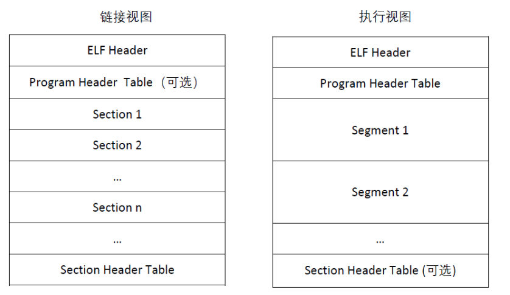
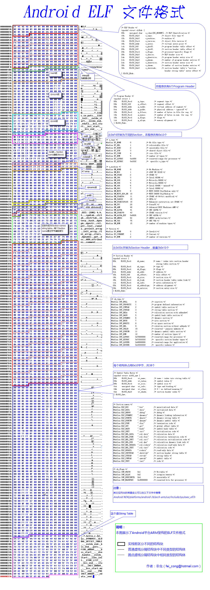

# ELF



+ Section：一般翻译为节，很多文章都与段等同了，但一般说的段指的是segment。每个节都定义了具体独立的功能，elf链接的时候，多个目标（.o）文件的节会合到一起。elf的通过节表来索引具体的节，每个节的解析方式都可能不一样，可以对照着文档解析与理解不同节的含义。
+ Segment：段是节的集合，一个段包含多个同属性（读、写、执行属性）的节，一般用在elf加载运行过程中，segment会指定地址范围，落在该地址范围的section，程序执行时，对应的section会加载该段里面。至于节和段的地址是怎么生成的，这都是ld链接程序确定的，ld命令参数非常多，甚至可以自定义segment中包含的节，同一份代码，不同平台生成的elf段和节的对应关系都可能不一样。
+ Program：程序表，elf中主要用来管理segment。

## 整体结构    



### ELF Header

```
ELF Header: 
Magic: 7f 45 4c 46 01 01 01 00 00 00 00 00 00 00 00 00 
Class: ELF32 
Data: 2's complement, little endian 
Version: 1 (current) 
OS/ABI: UNIX - System V 
ABI Version: 0 
Type: DYN (Shared object file) 
Machine: Intel 80386 
Version: 0x1 Entry point 
address: 0x550 
Start of program headers: 52 (bytes into file) //段头表的起始偏移地址
Start of section headers: 2768 (bytes into file) //节头表的起始偏移地址
Flags: 0x0 
Size of this header: 52 (bytes) //ELF头文件大小
Size of program headers: 32 (bytes) //段头表的大小
Number of program headers: 5  //段头表项
Size of section headers: 40 (bytes) //节头表的大小
Number of section headers: 27 //节头项
Section header string table index: 26 //节名称对应的索引值
```

### Section Header（节头表）

```
Section Headers: 
[Nr] Name Type Addr Off Size ES Flg Lk Inf Al 
[ 0] NULL 00000000 000000 000000 00 0 0 0 
[ 1] .gnu.hash GNU_HASH 000000d4 0000d4 00003c 04 A 2 0 4 
[ 2] .dynsym DYNSYM 00000110 000110 000120 10 A 3 1 4  //动态符号表
[ 3] .dynstr STRTAB 00000230 000230 000199     A 0 0 1 
[ 4] .gnu.version VERSYM 000003ca 0003ca 000024 02 A 2 0 2 
[ 5] .gnu.version_r VERNEED 000003f0 0003f0 000050 00 A 3 2 4 
[ 6] .rel.dyn REL 00000440 000440 0000b0 08 A 2 0 4 
[ 7] .rel.plt REL 000004f0 0004f0 000010 08 A 2 9 4 
[ 8] .init PROGBITS 00000500 000500 000017 00 AX 0 0 4 //程序初始化代码段
[ 9] .plt PROGBITS 00000518 000518 000030 04 AX 0 0 4 
[10] .text PROGBITS 00000550 000550 0001c4 00 AX 0 0 16  //包含程序可执行指令
[11] .fini PROGBITS 00000714 000714 00001c 00 AX 0 0 4  //程序终结代码段
[12] .rodata PROGBITS 00000730 000730 000006 00 A 0 0 1   //存放只读数据,比如字符串常量,全局const变量     
[13] .eh_frame_hdr PROGBITS 00000738 000738 00002c 00 A 0 0 4 
[14] .eh_frame PROGBITS 00000764 000764 000090 00 A 0 0 4 
[15] .ctors PROGBITS 000017f4 0007f4 00000c 00 WA 0 0 4 
[16] .dtors PROGBITS 00001800 000800 000008 00 WA 0 0 4 
[17] .jcr PROGBITS 00001808 000808 000004 00 WA 0 0 4 
[18] .data.rel.ro PROGBITS 0000180c 00080c 000004 00 WA 0 0 4 
[19] .dynamic DYNAMIC 00001810 000810 0000e0 08 WA 3 0 4   //动态链接信息
[20] .got PROGBITS 000018f0 0008f0 00000c 04 WA 0 0 4   //包含全局偏移表
[21] .got.plt PROGBITS 000018fc 0008fc 000014 04 WA 0 0 4 //动态链接的跳转表和全局入口表
[22] .bss NOBITS 00001910 000910 00000c 00 WA 0 0 4     //对未初始化的字段初始化
[23] .comment PROGBITS 00000000 000910 0000e6 00 0 0 1  //存放编译器版本信息
[24] .shstrtab STRTAB 00000000 0009f6 0000da 00 0 0 1   //Section String Table
[25] .symtab SYMTAB 00000000 000f08 000410 10 26 48 4  //符号表
[26] .strtab STRTAB 00000000 001318 000333 00 0 0 1 //字符串表,ELF用到的各种字符串

Key to Flags: W (write), A (alloc), X (execute), M (merge), S (strings) I (info), L (link order), G (group), x (unknown) O (extra OS processing required) o (OS specific), p (processor specific)
```

### Program Header（段头表）

```
Elf file type is DYN (Shared object file) 
Entry point 0x550 
There are 5 program headers, starting at offset 52 

Program Headers: 
Type Offset VirtAddr PhysAddr FileSiz MemSiz Flg Align 
LOAD 0x000000 0x00000000 0x00000000 0x007f4 0x007f4 R E 0x1000 //LOAD段真正被加载到内存中去的
LOAD 0x0007f4 0x000017f4 0x000017f4 0x0011c 0x00128 RW 0x1000 //LOAD段真正被加载到内存中去的
DYNAMIC 0x000810 0x00001810 0x00001810 0x000e0 0x000e0 RW 0x4 
GNU_EH_FRAME 0x000738 0x00000738 0x00000738 0x0002c 0x0002c R 0x4 
GNU_STACK 0x000000 0x00000000 0x00000000 0x00000 0x00000 RW 0x4 

Section to Segment mapping: //从节到段的映射

Segment Sections... 
00 .gnu.hash .dynsym .dynstr .gnu.version .gnu.version_r .rel.dyn .rel.plt .init .plt .text .fini .rodata 
.eh_frame_hdr .eh_frame //对应第一个LOAD映射的节会被加载内存
01 .ctors .dtors .jcr .data.rel.ro .dynamic .got .got.plt .bss //对应第二个LOAD映射的节会被加载内存
02 .dynamic 
03 .eh_frame_hdr 
04
```

## readelf命令

```
-a --all 显示全部信息,等价于 -h -l -S -s -r -d -V -A -I. -h 
--file-header 显示elf文件开始的文件头信息. 
-l --program-headers --segments 显示程序头（段头）信息(如果有的话)。
-S --section-headers --sections 显示节头信息(如果有的话)。 
-g --section-groups 显示节组信息(如果有的话)。 
-t --section-details 显示节的详细信息(-S的)。 
-s --syms --symbols 显示符号表段中的项（如果有的话）。 
-e --headers 显示全部头信息，等价于: -h -l -S -n --notes 显示note段（内核注释）的信息。 
-r --relocs 显示可重定位段的信息。 -u --unwind 显示unwind段信息。当前只支持IA64 ELF的unwind段信息。 
-d --dynamic 显示动态段的信息。 
-V --version-info 显示版本段的信息。 
-A --arch-specific 显示CPU构架信息。 
-D --use-dynamic 使用动态段中的符号表显示符号，而不是使用符号段。 
-x --hex-dump= 以16进制方式显示指定段内内容。number指定段表中段的索引,或字符串指定文件中的段名。 
-w[liaprmfFsoR] or --debug-dump[=line,=info,=abbrev,=pubnames,=aranges,=macro,=frames,=frames-interp,=str,=loc,=Ranges] 显示调试段中指定的内容。 
-I --histogram 显示符号的时候，显示bucket list长度的柱状图。 
-v --version 显示readelf的版本信息。 -H --help 显示readelf所支持的命令行选项。 
-W --wide 宽行输出。 @file 可以将选项集中到一个文件中，然后使用这个@file选项载入。
```

