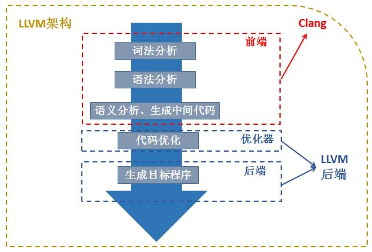

<!-- START doctoc generated TOC please keep comment here to allow auto update -->
<!-- DON'T EDIT THIS SECTION, INSTEAD RE-RUN doctoc TO UPDATE -->
**Table of Contents**  *generated with [DocToc](https://github.com/thlorenz/doctoc)*

- [前置知识](#%E5%89%8D%E7%BD%AE%E7%9F%A5%E8%AF%86)
  - [NDK](#ndk)
  - [ndk-build](#ndk-build)
  - [CMake](#cmake)
  - [两种生成so方式](#%E4%B8%A4%E7%A7%8D%E7%94%9F%E6%88%90so%E6%96%B9%E5%BC%8F)
  - [ABI](#abi)
  - [LLVM和Clang](#llvm%E5%92%8Cclang)
  - [动态库和静态库](#%E5%8A%A8%E6%80%81%E5%BA%93%E5%92%8C%E9%9D%99%E6%80%81%E5%BA%93)
- [基础](#%E5%9F%BA%E7%A1%80)
  - [JNIEnv类型](#jnienv%E7%B1%BB%E5%9E%8B)
  - [jobject参数obj](#jobject%E5%8F%82%E6%95%B0obj)
  - [jclass类型](#jclass%E7%B1%BB%E5%9E%8B)
  - [jfieldId和jmethodId](#jfieldid%E5%92%8Cjmethodid)
  - [jstring](#jstring)
  - [jni调用java代码](#jni%E8%B0%83%E7%94%A8java%E4%BB%A3%E7%A0%81)

<!-- END doctoc generated TOC please keep comment here to allow auto update -->

# 前置知识

## 基本概念

### NDK

​      NDK 工具包中提供了完整的一套将 c/c++ 代码编译成静态/动态库的工具，而 Android.mk 和 Application.mk 你可以认为是描述编译参数和一些配置的文件。比如指定使用c++11还是c++14编译，会引用哪些共享库，并描述关系等，还会指定编译的 abi。只有有了这些 NDK 中的编译工具才能准确的编译 c/c++ 代码。

### ndk-build

​      ndk-build 文件是 Android NDK r4 中引入的一个 shell 脚本。其用途是调用正确的 NDK 构建脚本。其实最终还是会去调用 NDK 自己的编译工具。

### CMake

​       c/c++ 的编译文件在不同平台是不一样的。Unix 下会使用 makefile 文件编译，Windows 下会使用 project 文件编译。而 CMake 则是一个跨平台的编译工具，它并不会直接编译出对象，而是根据自定义的语言规则（CMakeLists.txt）生成 对应 makefile 或 project 文件，然后再调用底层的编译。

### 两种生成so方式

​      在 Android Studio 2.2 之后你有2种选择来编译你写的 c/c++ 代码。

​      1、 ndk-build + Android.mk + Application.mk 组合

​      2、CMake + CMakeLists.txt 组合。

​      这2个组合与Android代码和c/c++代码无关，只是不同的构建脚本和构建命令。本篇文章主要会描述后者的组合。（也是Android现在主推的）

### ABI

​       ABI（Application binary interface）应用程序二进制接口。不同的CPU 与指令集的每种组合都有定义的 ABI (应用程序二进制接口)，一段程序只有遵循这个接口规范才能在该 CPU 上运行，所以同样的程序代码为了兼容多个不同的CPU，需要为不同的 ABI 构建不同的库文件。当然对于CPU来说，不同的架构并不意味着一定互不兼容

​       armeabi设备只兼容armeabi；

​       armeabi-v7a设备兼容armeabi-v7a、armeabi；

​       arm64-v8a设备兼容arm64-v8a、armeabi-v7a、armeabi；

​       X86设备兼容X86、armeabi；

​       X86_64设备兼容X86_64、X86、armeabi；

​       mips64设备兼容mips64、mips；

​       mips只兼容mips；

### LLVM和Clang

​       Android NDK从r13起，默认使用Clang进行编译。但是暂时也没有把GCC删掉，Google会一直等到libc++（Clang的c++标准库实现）足够稳定后删掉GCC。。。



### 动态库和静态库

​     1、静态库 

静态库即静态链接库（Windows 下的 .lib，Linux 和 Mac 下的 .a）。之所以叫做静态，是因为静态库在编译的时候会被直接拷贝一份，复制到目标程序里，这段代码在目标程序里就不会再改变了。 

静态库的好处很明显，编译完成之后，库文件实际上就没有作用了。目标程序没有外部依赖，直接就可以运行。当然其缺点也很明显，就是会使用目标程序的体积增大。 

​     2、动态库 

动态库即动态链接库（Windows 下的 .dll，Linux 下的 .so，Mac 下的 .dylib）。与静态库相反，动态库在编译时并不会被拷贝到目标程序中，目标程序中只会存储指向动态库的引用。等到程序运行时，动态库才会被真正加载进来。 

动态库的优点是，不需要拷贝到目标程序中，不会影响目标程序的体积，而且同一份库可以被多个程序使用（因为这个原因，动态库也被称作共享库）。同时，编译时才载入的特性，也可以让我们随时对库进行替换，而不需要重新编译代码。动态库带来的问题主要是，动态载入会带来一部分性能损失，使用动态库也会使得程序依赖于外部环境。如果环境缺少动态库或者库的版本不正确，就会导致程序无法运行（Linux 下喜闻乐见的 lib not found 错误）

## 相关知识

+ [NDK官方例子代码](https://developer.android.com/ndk/samples)
+ [C](../C.md)
+ [C++](../C++.md)
+ [Cmake](../BuildTool/Cmake.md)

# JNI

## so加载过程

### Java层

```
System.loadLibrary(libName)
                      ->Runtime.loadLibrary(...)
                      ->Runtime.doLoad(...)
                      ->Runtime.nativeLoad(...)
```

### Native层

## 添加C/C++支持的两种方式(cmake)

```
//一、新项目
创建工程的时候直接选择Natvie C++

//二、已有项目
1、创建jni目录,右击New->Floder->JNI Folder,然后在里面创建C/C++文件

2、创建CMakeLists.txt,和moudle的gradle的平级目录下创建。
cmake_minimum_required(VERSION 3.10.2) # 指定cmake的版本
add_library(main-jni SHARED
            src/main/jni/main.cpp)  # 指定so的名字,指定这是个共享库,指定文件的位置
            
3、配置gradle
android {
    compileSdkVersion 30
    ......
    externalNativeBuild {
        cmake {
            path "CMakeLists.txt"  //指定CMakeLists文件
        }
    }
}

4、在Java文件创建native方法,以及加载so
static {
        System.loadLibrary("main-jni"); //加载so,要和之前指定的so的名字一样
    }
 
public native String staticRegister();  //Java文件里面定义的native方法

5、在cpp文件中写代码（在C/C++文件中输入J,然后就有提示你注册的native方法,选择就ok了）
#include <jni.h>

extern "C"
JNIEXPORT jstring JNICALL
Java_com_lucky_learn_MainActivity_staticRegister(JNIEnv *env, jobject thiz) {
    // TODO: implement staticRegister()
    return env->NewStringUTF("Hello,World");
}

6、然后运行测试结果
```

## 函数注册和销毁（静态和动态）

```c++
//静态注册
//第一次调用调用java的native方法时，虚拟机会搜索对应的native函数，如果存在就会建立一个关联，以后再次调用，这部分操作就会由虚拟机完成
extern "C"
JNIEXPORT jstring JNICALL
Java_com_lucky_learn_MainActivity_staticRegister(JNIEnv *env, jobject thiz) {
    // TODO: implement staticRegister()
    return env->NewStringUTF("Hello,World");
}
规则：
Java+包名+类名+方法名
缺点：
1、名字太长
2、第一次调用需要搜索，影响效率

//动态注册
//需要我们手动建立联系，增加了代码量但提高效率，允许自己定义函数名字
public native String trendsRegister();  //Java的native方法    
/**
 * 名字随意起,对应Java里面的trendsRegister方法
 * @param env 当前的线程环境
 * @param objetc 对应Java的this指针
 * @return 返回值
 */
jstring native_trends_register(JNIEnv *env, jobject objetc) {
    return env->NewStringUTF("Hello,World,from trends");
}

/**
 * java层函数和native层函数的映射关系
 *
 * 第一个参数对应Java的函数名
 * 第二个参数对应Java的入参和返回值
 * 第三个参数对应native方法
 *
 * ()Ljava/lang/String; 表示入参为空,返回值为String
 */
static const JNINativeMethod nativeMethod[] = {
        {"trendsRegister", "()Ljava/lang/String;", (void *) native_trends_register}
};


/**
 * JNI_OnLoad()函数经常用来做一些初始化操作，动态注册就在RegisterNatives里面完成
 *  jint RegisterNatives(jclass clazz, const JNINativeMethod* methods,jint nMethods)
 * RegisterNatives 参数
 * 第一个参数：代表一个java类
 * 第二个参数：代表JNINativeMethod结构体数组，JNINativeMethod定义了java层函数和native层函数的映射关系
 * 第三个参数:代表第三个参数methods数组的大小
 * @param env
 * @return
 */
static int registerNativeMethod(JNIEnv *env) {
    int result = -1;
    jclass class_text = env->FindClass("com/lucky/learn/MainActivity");
    if (env->RegisterNatives(class_text, nativeMethod,
                             sizeof(nativeMethod) / sizeof(nativeMethod[0])) == JNI_OK) {
        result = 0;
    }
    return result;
}

/**
 * JNI最先加载的函数
 * 返回值代表，动态库需要的jni版本，如果虚拟机不能识别这个版本，那么就不可以加载这个动态库
目前的返回值有，JNI_VERSION_1_1, JNI_VERSION_1_2, JNI_VERSION_1_4, JNI_VERSION_1_6。
如果动态库没有提供 JNI_OnLoad()函数会默认使用JNI_VERSION_1_1版本，但是这个版本太老，很多新函数没有，最好返回版本
 * @param vm
 * @param reserved
 * @return
 */
jint JNI_OnLoad(JavaVM *vm, void *reserved) {
    JNIEnv *env = NULL;
    int result = -1;
    if (vm->GetEnv((void **) &env, JNI_VERSION_1_1) == JNI_OK) {
        if (registerNativeMethod(env) == JNI_OK) {
            result = JNI_VERSION_1_6;
        }
        return result;
    }
}

//注销函数
JNIEXPORT void JNI_OnUnload(JavaVM *vm, void *reserved) {
    JNIEnv *env = NULL;
    if (vm->GetEnv((void **) &env, JNI_VERSION_1_6) != JNI_OK)
        return;
    jclass HelloJniClazz = env->FindClass("com/lucky/learn/MainActivity");
    /* C */
    //jint r=(*env)->UnregisterNatives(env,HelloJniClazz);
    /* C++ */
    jint r = env->UnregisterNatives(HelloJniClazz);
    if (r == 0) {
        //注销native函数成功  
    } else {
        //注销native函数失败
    }
}
```

## 打印日志

```c
// 引入头文件
#include <android/log.h>
//预定义宏
#define LOGI(...) ((void)__android_log_print(ANDROID_LOG_INFO, kTAG, __VA_ARGS__)) 
#define LOGW(...) ((void)__android_log_print(ANDROID_LOG_WARN, kTAG, __VA_ARGS__))
#define LOGE(...) ((void)__android_log_print(ANDROID_LOG_ERROR, kTAG, __VA_ARGS__))

//调用
LOGI("test number=%d", number);
```

## 三种引用

### 局部引用（Local Reference）

```c++
//局部引用可以通过NewLocalRef和FindClass、NewObject、GetObjectClass和NewCharArray等方法进行创建，一般是在方法中使用并且值在创建它的方法内有效，它会增加引用计数从而阻止GC回收所引用的对象，但是一旦出了这个方法就变得无效了。也就是说它的生命周期只在创建该局部引用的方法内部。在用完局部引用之后可以选择不手动释放而是在本地方法执行完之后由JVM自动释放，还可以手动调用DeleteLocalRef释放。但是一般最好手动在刚用完之后就立刻释放，因为JNI会将创建的局部引用都存储在一个局部引用表中，如果这个表超过了最大容量限制（Android上的JNI局部引用表最大数量是512个），就会造成局部引用表溢出，从而导致程序崩溃。并且有可能在你申请并使用完局部引用之后的操作还需要比较大的空间，这时候如果不即使释放有可能导致OOM。在使用局部引用的时候还需要注意的是局部引用不能跨线程使用，只在创建它的线程有效。不要试图在一个线程中创建局部引用并存储到全局引用中，然后在另外一个线程中使用。
```

### 全局引用（Global Reference）

```c++
//与局部引用创建方式不同的是，全局变量只能通过NewGlobalRef方法创建。JVM不会自动释放它，而是需要我们手动释放才会失效，并且它可以跨方法，跨线程使用。

//c代码
 jstring  MyNewString(JNIEnv *env, jchar *chars, jint len) {
     static jclass stringClass = NULL;
     ...
     if (stringClass == NULL) {
         jclass localRefCls =
             (*env)->FindClass(env, "java/lang/String");
         if (localRefCls == NULL) {
             return NULL; /* exception thrown */
         }
         /* Create a global reference */
         stringClass = (*env)->NewGlobalRef(env, localRefCls);
         /* The local reference is no longer useful */
         (*env)->DeleteLocalRef(env, localRefCls);
         /* Is the global reference created successfully? */
         if (stringClass == NULL)  {
             return NULL; /* out of memory exception thrown */
         }
     }
     ...
 }
```

### 弱全局引用（Weak Global Reference）

```c++
//调用NewWeakGlobalRef基于局部引用或全局引用创建，不能增加引用计数，不会阻止GC回收所引用的对象，也就是说它对应的Java对象生命周期依然取决于虚拟机，这就导致即便弱全局引用没有被释放，其引用的Java对象有可能已经被释放，和全局引用一样可以跨方法、跨线程使用。引用不会自动释放，在JVM认为应该回收它的时候进行回收而被释放。或者调用DeleteWeakGlobalRef手动释放。

//c代码
JNIEXPORT void JNICALL Java_mypkg_MyCls_f(JNIEnv *env, jobject self) {
     static jclass myCls2 = NULL;
     if (myCls2 == NULL) {
         jclass myCls2Local =
             (*env)->FindClass(env, "mypkg/MyCls2");
         if (myCls2Local == NULL) {
             return; /* can't find class */
         }
         myCls2 = NewWeakGlobalRef(env, myCls2Local);
         if (myCls2 == NULL) {
             return; /* out of memory */
         }
     }
     ... /* use myCls2 */
 }
```

### 回收引用

```c++
//给定两个引用（不管是全局、局部还是弱全局引用），只需要调用IsSameObject就可以判断两个是否指向相同的对象
（*env)->IsSameObject(env, obj1, obj2)

//如果obj1和obj2指向相同的对象，则返回JNI_TRUE，否则返回JNI_FALSE。但是使用IsSameObject比较弱全局引用与NULL的时候，返回值的意义是有点特别的
jboolean isWeakRefGC = (*env)->IsSameObject(env,gw_obj_ref, NULL); //返回JNI_TRUE或者JNI_FALSE

//全局引用回收
env->DeleteGlobalRef(s);

//弱引用回收
env->DeleteLocalRef(dateLocalRef);

//回收弱全局引用
eleteGlobalRef(classGlobal);
```

## JNIEnv

​       JNIEnv类型实际代表了Java上下文环境，c++中可以使用JNIEnv* 指针就可以对Java端的代码进行操作。如，创建Java中的对象，调用Java的方法，获取Java的属性等。（**相关方法可以查看jni.h**）

```java
关于JNIEnv和JavaVM
JNIEnv是一个与线程相关的变量，不同线程的JNIEnv彼此独立。
JavaVM是虚拟机在JNI层的代表，在一个虚拟机进程中只有一个JavaVM，因此该进程的所有线程都可以使用这个JavaVM。当后台线程需要调用JNI native时，在native库中使用全局变量保存JavaVM尤为重要，这样使得后台线程能通过JavaVM获得JNIEnv。native程序中频繁使用JNIEnv*和JavaVM*。而C和C++代码使用JNIEnv*和JavaVM*这两个指针的做法是有区别的。

在C中：
env是一个两级指针，需要对env指针进行双重deferencing，而且须将env作为第一个参数传给jni函数
使用JNIEnv* env    (*env)->方法名(env,参数列表)
使用JavaVM* vm       (*vm)->方法名(vm,参数列表)

在C++中：
C++的定义中,env是个一级指针
使用JNIEnv* env     env->方法名(参数列表)
使用JavaVM* vm       vm->方法名(参数列表)

1.NewObject    创建Java的对象
2.NewString     创建Java中的字符串对象
3.New<Type>Array   创建类型为Type的数组对象
4.Get<Type>Field     获取类型为Type的字段
5.Set<Type>Field     设置类型为Type的字段
6.GetStatic<Type>Field  获取类型为Type的静态字段
7.SetStatic<Type>Field  设置类型为Type的静态字段
8.Call<Type>Method      调用类型为Type的方法
9.CallStatic<Type>Method   调用类型为Type的静态方法
10.CallNonbvirtualMethod   调用非虚方法（java多态默认都实现了虚方法，默认都会调用子类方法，这个方法实现多态下调用父类的方法）
```

## jobject

```java
表示Java的Object类型，创建Java对象

1.如果native方法不是static，obj就表示native方法的类实例

2.如果native方法是static，obj就代表native方法的类的class对象实例

第一种方法创建Java对象：
jobject  NewObject(jclass clazz，jmethodID methodID，.......)
clazz：Java对象Class对象
methodID：构造方法名（方法名始终为“<init>’）
第三个参数：构造函数参数签名    无参构造始终为（”()V“）
```

## jclass

```java
表示Java中的Class类
获取jclass
1.jclass FindClass(const char* clsName):通过类的名称（类的全名，这时候包名用/来区分）来获取
 如：jclass str=env->FindClass("java/lang/String")  //获取Java中的String对象
2.jclass GetObjectClass(Jobject obj):通过对象实例来获取jclass，相当于Java中的getClass方法
3.jcass  GetSuperClass(jclass obj):通过jclass可以其父类的jclass对象
```

## jfieldId和jmethodId

```java
需要调用Java方法的字段和方法，必须先获取Java属性的jfieldId和jmethodId
使用JNIEnv的如下方法：
GetFieldID/GetMethodID
GetStaticFieldID/GetStaticMethodID
GetFieldID方法：
jfieldID GetFieldID(jclass clazz, const char* name, const char* sig)
clazz：表示依赖的类对象的class对象
name：字段的名称
sign：字段/方法签名（查看签名 javap -s <options> className）
1.普通类型签名：
boolean Z
byte    B
char    C
short   S
long    L
float   F
double  D
void    V
2、引用类型签名
object     L开头，然后以/ 分隔包的完整类型，后面再加；   比如说String    签名就是   Ljava/lang/String;（后面必须跟分号）
Array      以[ 开头，在加上数组元素类型的签名，比如int[]   签名就是[I ，在比如int[][] 签名就是[[I ，object数组签名就是[Ljava/lang/Object;
3、方法签名
(参数1类型签名 参数2类型签名 参数3类型签名  .......)返回值类型签名
 还要注意，就算java构造器没返回值，也加上V签名
```

## jstring

```c++
Java中String对象是Unicode（UTF-16）码，每个字符无论是中文还是英文还是符号，一个字符总是占两个字节。
Java通过JNI接口可以将字符串转换为C/C++中的宽字符串(wchar_t*)，或传回一个UTF-8的字符串(char *)到C/C++，反过来也是一样的。
JNIEnv方法介绍：
1.获取字符串长度
jsize  GetStringLength(jstring j_msg)
2.将jstring对象拷贝到const jchar*指针字符串中
void GetStringRegion(jstring str, jsize start, jsize len, jchar* buf)       //拷贝Java字符串并以UTF-8编码传入jstr
void GetStringUTFRegion(jstring str, jsize start, jsize len, jchar* buf)   //拷贝Java字符串并以UTF-16编码传入jstr
3.生成jstring对象
jstring NewString(const jchar* jstr，int size)
```

## 数组

+ [推荐文章](https://blog.csdn.net/tkwxty/article/details/103665532)

```c++
//获取数组
GetBooleanArrayElements()	jbooleanArray	jboolean
GetByteArrayElements()	jbyteArray	jbyte
GetCharArrayElements()	jcharArray	jchar
GetShortArrayElements()	jshortArray	jshort
GetIntArrayElements()	jintArray	jint
GetLongArrayElements()	jlongArray	jlong
GetFloatArrayElements()	jfloatArray	jfloat
GetDoubleArrayElements()	jdoubleArray	jdouble
GetObjectArrayElement()       jobjectArray jobject

//例子
public native void stringArray(String []strArr);
public native void floatArray(float []fArray);
//string数组
JNIEXPORT void JNICALL Java_com_example_test_jnitest_MainActivity_stringArray
        (JNIEnv *env, jobject object, jobjectArray stringArray) {
    int count = env->GetArrayLength(stringArray);
    for (int i = 0; i < count; i++) {
        jobject item = env->GetObjectArrayElement(stringArray, i);
        const char *str = env->GetStringUTFChars((jstring) item, 0);
        LOG("index:%d string:%s", i, str);
        env->ReleaseStringUTFChars((jstring) item, str);
    }
}
//float数组
JNIEXPORT void JNICALL Java_com_example_test_jnitest_MainActivity_floatArray
  (JNIEnv *env, jobject, jfloatArray floatArray){ 
   jfloat * array = env->GetFloatArrayElements(floatArray,0);
    int count = env->GetArrayLength(floatArray);
    for(int i=0;i<count;i++){
        LOG("index:%d float:%f", i, array[i]);
    } 
    env->ReleaseFloatArrayElements(floatArray,array,0);
}

//返回数组
NewBooleanArray(jsize length)	jbooleanArray
NewByteArray(jsize length)	jbyteArray
NewCharArray(jsize length)	jcharArray
NewShortArray(jsize length)	jshorArray
NewIntArray(jsize length)	jintArray
NewLongArray(jsize length)	jlongArray
NewFloatArray(jsize length)	jfloatArray
NewDoubleArray(jsize length)	jdoubleArray
NewObjectArray(jsize length, jclass elementClass,
        jobject initialElement)  jobjectArray

//例子
public native int[] javaIntArray(int len);

JNIEXPORT jintArray  JNICALL Java_com_fly_TestJni_javaIntArray
(JNIEnv *env, jobject job, jint len){
	//jintArray(JNICALL *NewIntArray)(JNIEnv *env, jsize len);
	//第一个参数
	//第二个参数 创建数组的长度
	jintArray jntarray = env->NewIntArray(env, len); 
	//数组转化为 jint* 类型
	jint * jintp = env->GetIntArrayElements(env, jntarray, NULL); 
	for (int i = 0; i < len; i++)
	{   //jint 本质long 所以可以赋值
		jintp[i] = i * 10;
	} 
	//释放同步
	env->ReleaseIntArrayElements(env, jntarray, jintp, 0); 
	//返回
	return jntarray;
}

```

## 线程

+ [JNI 的多线程回调](https://zjuturtle.com/2020/01/25/jni-multithread-callback/)

## jni调用java代码

[数组变量调用](https://blog.csdn.net/riskychengallesgut/article/details/80465957)

```java
//调用java的静态方法
java代码
byte[] bytes = Base64.decode(all, Base64.NO_WRAP);
jni代码
//使用反射来获取java方法
jclass base64class = env->FindClass("android/util/Base64");
jmethodID base64methode = env->GetStaticMethodID(base64class, "decode",
                                                 "(Ljava/lang/String;I)[B");
jstring str = env->NewStringUTF(all);
//调用静态方法使用的是jclass，而不是jobject
jbyteArray jobject1 = (jbyteArray) env->CallStaticObjectMethod(base64class, base64methode, str,
                                                               2);
jsize jsize1 = env->GetArrayLength(jobject1);   //获取通过base64加密的字节数组的长度
jboolean isCopy = false;
char *dataNatives = (char *) env->GetByteArrayElements(jobject1,
                                                       &isCopy);  //获取通过base64加密的字节数组
```

​       