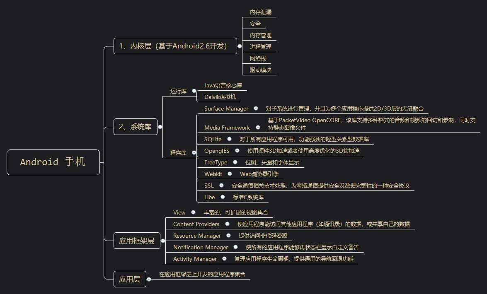
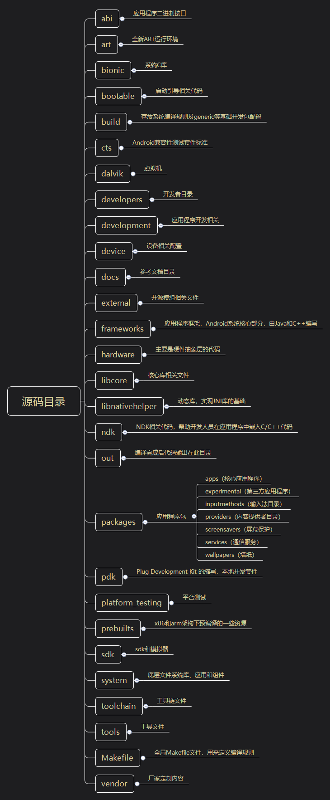
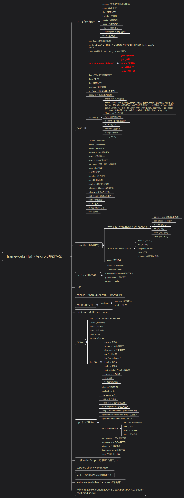

# 安卓源码

## 结构

### 安卓架构

### 安卓源码目录简单介绍（基于[8.0.0-r4](https://blog.csdn.net/nwpushuai/article/details/79255993)）

### framework目录结构

+ 目录在frameworks\base目录
+ [地址](https://github.com/aosp-mirror/platform_frameworks_base)

