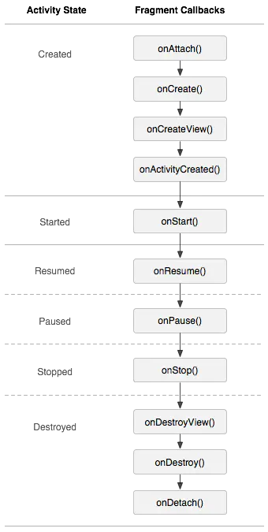
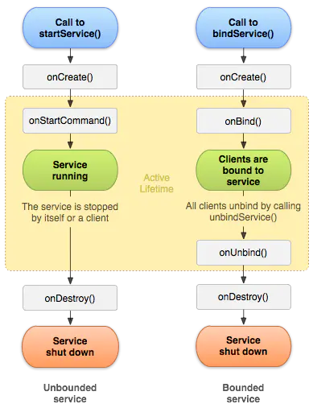
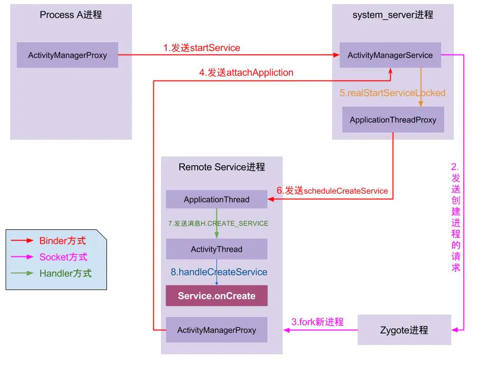

<!-- START doctoc generated TOC please keep comment here to allow auto update -->
<!-- DON'T EDIT THIS SECTION, INSTEAD RE-RUN doctoc TO UPDATE -->
**Table of Contents**  *generated with [DocToc](https://github.com/thlorenz/doctoc)*

- [Android面试](#android%E9%9D%A2%E8%AF%95)
  - [Java篇](#java%E7%AF%87)
    - [线程](#%E7%BA%BF%E7%A8%8B)
    - [集合](#%E9%9B%86%E5%90%88)
    - [JVM](#jvm)
  - [Kotlin篇](#kotlin%E7%AF%87)
    - [语法糖](#%E8%AF%AD%E6%B3%95%E7%B3%96)
    - [协程](#%E5%8D%8F%E7%A8%8B)
  - [Android](#android)
    - [Activity](#activity)
    - [Service](#service)
    - [BroadcastReceiver](#broadcastreceiver)
    - [ContentProvider](#contentprovider)
    - [AMS、WMS、PMS简述](#amswmspms%E7%AE%80%E8%BF%B0)
    - [动画](#%E5%8A%A8%E7%94%BB)
    - [View](#view)
    - [开源库](#%E5%BC%80%E6%BA%90%E5%BA%93)
    - [适配](#%E9%80%82%E9%85%8D)
    - [优化](#%E4%BC%98%E5%8C%96)
    - [JetPack组件](#jetpack%E7%BB%84%E4%BB%B6)
    - [组件化](#%E7%BB%84%E4%BB%B6%E5%8C%96)
    - [React和Flutter](#react%E5%92%8Cflutter)

<!-- END doctoc generated TOC please keep comment here to allow auto update -->

# Android面试

## Java篇

### 线程

+ [线程池](https://blog.csdn.net/Kurry4ever_/article/details/109294661)

+ [volatile关键字在单例模式中的应用](https://blog.csdn.net/qiushisoftware/article/details/102912395)

+ [volatile关键字详解](https://www.cnblogs.com/zhengbin/p/5654805.html)

+ [原子类](https://blog.csdn.net/qq_20960159/article/details/85069951?utm_medium=distribute.pc_relevant.none-task-blog-baidujs_title-1&spm=1001.2101.3001.4242)

+ [CountDownLatch](https://blog.csdn.net/u012637358/article/details/90288585)

+ [lock锁](https://blog.csdn.net/drdongshiye/article/details/85269808)

+ 集合的线程安全

  - ArrayList和HashMap为什么线程不安全

    插入数据的扩容非原子操作

  - 线程安全的集合

    1. Vector和HashTabe（不推荐）
    2. Collections包装方法
    3. java.util.concurrent包中的集合

### 集合

+ [HashMap原理](https://blog.csdn.net/qq_23609603/article/details/106673942)
  + jdk1.7时采用数组+链表的方式，jdk1.8时采用数组+红黑树的方式
  + Entry数组，数组默认为16，存储包含key，value以及hash，Entry类实际上是一个单向的链表结构，它具有Next指针，可以连接下一个Entry实体，用于解决hash冲突。
  + hash= （hashcode） ^ (hashcode >>> 16)，数组下标值=hash & (16-1) 或则 hash % 16。
  + 存值，先获取数组下标值，然后向当前链表头部插入，取值，先获取数组下标值，然后通过在链表中遍历比较key的值，存在就返回。如果为红黑树，则将K-V对插在红黑树对应的位置，如果为链表，遍历链表，如果为链表最后一个node ,则将新的node节点插入到链表尾。如果链表大于8，进行转换为红黑树。
  + hash冲突，冲突产生的原因就是不同的键值对 的键对象计算出的数组下标位置相同，就会产生 Hash 冲突。链表达到一定长度后，就会效率变慢。jdk1.8采用红黑树，链表长度大于8，将原来的链表数组的每一个链表分成奇偶两个子链表分别挂在新链表数组的散列位置，这样就减少了每个链表的长度，增加查找效率。
  + 扩容机制，默认情况下，数组大小为16，那么当HashMap中元素个数超过16乘0.75=12的时候，就把数组的大小扩展为 2乘16=32，即扩大一倍，然后重新计算每个元素在数组中的位置，扩容是需要进行数组复制的，复制数组是非常消耗性能的操作，所以如果我们已经预知HashMap中元素的个数，那么预设元素的个数能够有效的提高HashMap的性能
+ [ArrayList原理](https://blog.csdn.net/yt_19940616/article/details/90176865)
  + ArrayList类封装了一个动态的、允许再分配的Object[]数组，默认数组大小10，这个对象表明可以接收任何类型的数据，ArrayList对象使用initCapacity参数来设置该数组的长度，当向ArrayList集合中添加数据元素超过了该数组的长度时，它们的initCapacity会自动增加。自动增加的过程就是ArrayList扩容机制，底层实现是使用一个新的数组，将原数组的内容拷贝到新的数组中，并覆盖原有的数长度组的。扩容的长度是原来长度的1.5倍
  + 插入数据，先进行判断是否需要扩容，然后将值赋值给数组size+1的位置。删除数据，删除指定位置的元素，其他元素做相依的移动，并将最后一个元素置空，方便垃圾处理机制回收，防止内存泄露，并返回删除的元素值。
  + ArrayList底层是数组，数组是适合查询的，因为数组每个元素的内存空间是固定的，每次查询时，只需要去查询对应位置的内存空间，就可以很快找到相应的值。而数组不擅长的是添加和删除。试想，集合长度是100000，而我们在第2个位置添加了一个元素，导致的结果是从第3个开始后面每一个元素都要往后串一个元素内存空间那么大的位置。删除刚好相反，是向前串一个位置，这样的效率是很低的，元素越多，效率越低。而频繁的添加和删除，适用链表——LinkedList
+ [LinkedList]()
  - LinkedList类是List接口的实现类，它是一个集合，可以根据索引来随机的访问集合中的元素，还实现了Deque接口，它还是一个队列，可以被当成双端队列来使用。虽然LinkedList是一个List集合，但是它的实现方式和ArrayList是完全不同的，ArrayList的底层是通过一个动态的Object[]数组来实现的，而LinkedList的底层是通过链表来实现的，因此它的随机访问速度是比较差的，但是它的删除，插入操作会很快。

### JVM

+ JVM内存分哪几个区，每个区的作用是什么?

  ```
  java虚拟机主要分为以下一个区:
  
  方法区：
  1. 有时候也成为永久代，在该区内很少发生垃圾回收，但是并不代表不发生GC，在这里进行的GC主要是对方法区里的常量池和对类型的卸载
  2. 方法区主要用来存储已被虚拟机加载的类的信息、常量、静态变量和即时编译器编译后的代码等数据。
  3. 该区域是被线程共享的。
  4. 方法区里有一个运行时常量池，用于存放静态编译产生的字面量和符号引用。该常量池具有动态性，也就是说常量并不一定是编译时确定，运行时生成的常量也会存在这个常量池中。
  
  虚拟机栈:
  1. 虚拟机栈也就是我们平常所称的栈内存,它为java方法服务，每个方法在执行的时候都会创建一个栈帧，用于存储局部变量表、操作数栈、动态链接和方法出口等信息。
  2. 虚拟机栈是线程私有的，它的生命周期与线程相同。
  3. 局部变量表里存储的是基本数据类型、returnAddress类型（指向一条字节码指令的地址）和对象引用，这个对象引用有可能是指向对象起始地址的一个指针，也有可能是代表对象的句柄或者与对象相关联的位置。局部变量所需的内存空间在编译器间确定
  4.操作数栈的作用主要用来存储运算结果以及运算的操作数，它不同于局部变量表通过索引来访问，而是压栈和出栈的方式
  5.每个栈帧都包含一个指向运行时常量池中该栈帧所属方法的引用，持有这个引用是为了支持方法调用过程中的动态连接.动态链接就是将常量池中的符号引用在运行期转化为直接引用。
  
  本地方法栈
  本地方法栈和虚拟机栈类似，只不过本地方法栈为Native方法服务。
  
  堆
  java堆是所有线程所共享的一块内存，在虚拟机启动时创建，几乎所有的对象实例都在这里创建，因此该区域经常发生垃圾回收操作。
  ```

+ 如何判断一个对象是否存活?(或者GC对象的判定方法)

  ```
  判断一个对象是否存活有两种方法:
  1. 引用计数法
  所谓引用计数法就是给每一个对象设置一个引用计数器，每当有一个地方引用这个对象时，就将计数器加一，引用失效时，计数器就减一。当一个对象的引用计数器为零时，说明此对象没有被引用，也就是“死对象”,将会被垃圾回收.
  引用计数法有一个缺陷就是无法解决循环引用问题，也就是说当对象A引用对象B，对象B又引用者对象A，那么此时A,B对象的引用计数器都不为零，也就造成无法完成垃圾回收，所以主流的虚拟机都没有采用这种算法。
  
  2.可达性算法(引用链法)
  该算法的思想是：从一个被称为GC Roots的对象开始向下搜索，如果一个对象到GC Roots没有任何引用链相连时，则说明此对象不可用。
  在java中可以作为GC Roots的对象有以下几种:
  
  虚拟机栈中引用的对象
  方法区类静态属性引用的对象
  方法区常量池引用的对象
  本地方法栈JNI引用的对象
  虽然这些算法可以判定一个对象是否能被回收，但是当满足上述条件时，一个对象比不一定会被回收。当一个对象不可达GC Root时，这个对象并
  不会立马被回收，而是出于一个死缓的阶段，若要被真正的回收需要经历两次标记
  如果对象在可达性分析中没有与GC Root的引用链，那么此时就会被第一次标记并且进行一次筛选，筛选的条件是是否有必要执行finalize()方法。当对象没有覆盖finalize()方法或者已被虚拟机调用过，那么就认为是没必要的。
  如果该对象有必要执行finalize()方法，那么这个对象将会放在一个称为F-Queue的对队列中，虚拟机会触发一个Finalize()线程去执行，此线程是低优先级的，并且虚拟机不会承诺一直等待它运行完，这是因为如果finalize()执行缓慢或者发生了死锁，那么就会造成F-Queue队列一直等待，造成了内存回收系统的崩溃。GC对处于F-Queue中的对象进行第二次被标记，这时，该对象将被移除”即将回收”集合，等待回收。
  ```

+ 简述java垃圾回收机制?

  ```
  在java中，程序员是不需要显示的去释放一个对象的内存的，而是由虚拟机自行执行。在JVM中，有一个垃圾回收线程，它是低优先级的，在正常情况下是不会执行的，只有在虚拟机空闲或者当前堆内存不足时，才会触发执行，扫面那些没有被任何引用的对象，并将它们添加到要回收的集合中，进行回收。
  ```

+ java中垃圾收集的方法有哪些?

  ```
  标记-清除:
  这是垃圾收集算法中最基础的，根据名字就可以知道，它的思想就是标记哪些要被回收的对象，然后统一回收。这种方法很简单，但是会有两个主要问题：1.效率不高，标记和清除的效率都很低；2.会产生大量不连续的内存碎片，导致以后程序在分配较大的对象时，由于没有充足的连续内存而提前触发一次GC动作。
  
  复制算法:
  为了解决效率问题，复制算法将可用内存按容量划分为相等的两部分，然后每次只使用其中的一块，当一块内存用完时，就将还存活的对象复制到第二块内存上，然后一次性清楚完第一块内存，再将第二块上的对象复制到第一块。但是这种方式，内存的代价太高，每次基本上都要浪费一般的内存。
  于是将该算法进行了改进，内存区域不再是按照1：1去划分，而是将内存划分为8:1:1三部分，较大那份内存交Eden区，其余是两块较小的内存区叫Survior区。每次都会优先使用Eden区，若Eden区满，就将对象复制到第二块内存区上，然后清除Eden区，如果此时存活的对象太多，以至于Survivor不够时，会将这些对象通过分配担保机制复制到老年代中。(java堆又分为新生代和老年代)
  
  标记-整理
  该算法主要是为了解决标记-清除，产生大量内存碎片的问题；当对象存活率较高时，也解决了复制算法的效率问题。它的不同之处就是在清除对象的时候现将可回收对象移动到一端，然后清除掉端边界以外的对象，这样就不会产生内存碎片了。
  
  分代收集
  现在的虚拟机垃圾收集大多采用这种方式，它根据对象的生存周期，将堆分为新生代和老年代。在新生代中，由于对象生存期短，每次回收都会有大量对象死去，那么这时就采用复制算法。老年代里的对象存活率较高，没有额外的空间进行分配担保，所以可以使用标记-整理 或者 标记-清除。
  ```

+ [Java内存模型](https://www.infoq.cn/article/java-memory-model-1/)

+ java类加载过程?

  ```
  ava类加载需要经历一下7个过程：
  加载
  加载时类加载的第一个过程，在这个阶段，将完成一下三件事情：
  1. 通过一个类的全限定名获取该类的二进制流。
  2. 将该二进制流中的静态存储结构转化为方法去运行时数据结构。
  3. 在内存中生成该类的Class对象，作为该类的数据访问入口。
  
  验证
  验证的目的是为了确保Class文件的字节流中的信息不回危害到虚拟机.在该阶段主要完成以下四钟验证:
  1. 文件格式验证：验证字节流是否符合Class文件的规范，如主次版本号是否在当前虚拟机范围内，常量池中的常量是否有不被支持的类型.
  2. 元数据验证:对字节码描述的信息进行语义分析，如这个类是否有父类，是否集成了不被继承的类等。
  3. 字节码验证：是整个验证过程中最复杂的一个阶段，通过验证数据流和控制流的分析，确定程序语义是否正确，主要针对方法体的验证。如：方法中的类型转换是否正确，跳转指令是否正确等。
  4. 符号引用验证：这个动作在后面的解析过程中发生，主要是为了确保解析动作能正确执行。
  
  准备
  准备阶段是为类的静态变量分配内存并将其初始化为默认值，这些内存都将在方法区中进行分配。准备阶段不分配类中的实例变量的内存，实例变量将会在对象实例化时随着对象一起分配在Java堆中。
  
  解析
  该阶段主要完成符号引用到直接引用的转换动作。解析动作并不一定在初始化动作完成之前，也有可能在初始化之后。
  
  初始化
  初始化时类加载的最后一步，前面的类加载过程，除了在加载阶段用户应用程序可以通过自定义类加载器参与之外，其余动作完全由虚拟机主导和控制。到了初始化阶段，才真正开始执行类中定义的Java程序代码。
  ```

+ 双亲委托模型

+ 类加载器

## Kotlin篇

### 语法糖

+ let
+ apply
+ run
+ also
+ with

### 协程

+ [协程的基础知识](https://www.jianshu.com/p/6e6835573a9c)

## Android

### Activity

+ 生命周期（home，back，dialog）

+ 启动模式

+ fragment

  - 生命周期

    

  - 和Activity如何数据交互

    ```
    Activity->Fragment
    Activity中通过setArguments()方法传递给bundle对象，通过getArguments()方法获取bundle对象，然后获取bundle对象中的数据信息
    
    Fragment->Activity
    回调方式
    
    Fragment->Fragment
    
    EventBus
    ```

+ Activity如何创建的（源码分析）
  
  - [启动过程](https://blog.csdn.net/u013263323/article/details/60871350?utm_medium=distribute.pc_relevant.none-task-blog-baidujs_baidulandingword-4&spm=1001.2101.3001.4242)
  
  - ZygoteInit的main方法
  
    一，开启DDMS功能；二，创建一个Server端的Socket，作用是当Zygote进程将SystemServer进程启动后，就会在这个Socket上来等待ActivityManagerService请求，即请求创建我们自己APP应用程序进程；三，预加载类和资源，包括颜色啊，R文件，drawable等；四，启动system_server进程，这是上层framework的运行载体，ActivityManagerService就是运行在这个进程里面的；五，开启一个循环，等待着接收ActivityManagerService的请求，随时待命，当接收到创建新进程的请求时立即唤醒并执行相应工作；六，通过捕获异常的方式，执行SystemServer的main方法
  
  - 

### Service

+ 生命周期

  

+ 两种启动方式的区别

  **startService**只是启动Service，启动它的组件（如Activity）和Service并没有关联，只有当Service调用stopSelf或者其他组件调用stopService服务才会终止。

  **bindService**方法启动Service，其他组件可以通过回调获取Service的代理对象和Service交互，而这两方也进行了绑定，当启动方销毁时，Service也会自动进行unBind操作，当发现所有绑定都进行了unBind时才会销毁Service

+ Service如何创建的（源码分析）

  

### BroadcastReceiver

+ 广播的注册方式

  静态广播：通过AndroidManifeset.xml的标签来注册BroadcastReceiver。

  动态广播：通过AMS.registeredReceiver方式注册BroadcastReceiver，动态注册相对静态注册更加的灵活，在不需要时通过unregisteredReceiver来取消注册。

+ 广播有哪几种（普通广播，有序广播，黏性广播，本地广播）

  普通广播：完全异步的广播，在广播发出之后，所有的广播接收器几乎在同一时刻接收到这条广播消息，接收的先后顺序是随机的。通过Context.sendBroadcast发送。

  有序广播：同步执行的广播。在广播发出去之后，同一时刻只有一个广播接收器能够收到这条广播消息，当这个广播接收器中的逻辑处理完成后，广播才可以继续传递。这种广播的接收顺序通过优先级(priority)设置，高的优先级先会收到广播。有序广播可以被接收者截断，使得后面的广播无法收到它。通过Context.sendOrderedBroadcast发送。

  粘性广播：这种广播会一直滞留，当有匹配该广播的接收器被注册后，该接收器就会收到这个广播。粘性广播如果被销毁，下一次重建时会重新接收到消息数据。这种方式一般用来确保重要状态改变后的信息被持久的保存，并且能随时广播给新的广播接收器，比如：耗电量的改变。通过Context.sendStickyBroadcast发送。Android系统已经 @Deprecated该广播方式。

  本地广播：发送处理的广播只能够在应用程序的内部进行传递，并且广播接收器也只能接收本应用程序发出的广播。通过LocalBroadcastManager.sendBroadcast发送。（基本原理是Handler，所以在AMS中没有本地广播的处理）

+ BroadcastReceiver如何创建的（源码分析）

  [静态和动态广播过程](https://blog.csdn.net/zhangyongfeiyong/article/details/51980348)

  静态注册：PMS进行扫描xml，将广播添加到队列中，

  动态注册：会通过binder添加到队列中

### ContentProvider

+ [基础知识](https://www.jianshu.com/p/ea8bc4aaf057)
+ [原理](https://blog.csdn.net/Tencent_Bugly/article/details/78257093)

### AMS、WMS、PMS简述

- AMS 主要用于管理所有应用程序的Activity
- WMS 管理各个窗口，隐藏，显示等
- PMS 用来管理跟踪所有应用APK，安装，解析，控制权限等.

### [动画](https://www.jianshu.com/p/16e0d4e92bb2)

+ Property Animation（属性动画）

  属性动画本质是通过改变对象的属性(例如：x,y等属性)，来实现动画的，所以基本上是无所不能的，只要对象有这个属性，就能实现动画效果

+ Drawable Animation（帧动画）

  类似gif动态图片的，别使用大图片，容易造成OOM

+ View Animation（视图动画/补间动画）

  平移动画，缩放动画，旋转动画，透明度动画

### View

+ 事件分发机制（责任链模式）

+ 滑动冲突

  + [ScrollView嵌套ScrollView的滑动冲突](https://www.jianshu.com/p/eedc98eecf02)

+ 自定义View

  onMeasure()、onDraw()、onTouchEvent()、onLayout()

+ RecyleView和ListView的区别和优化

+ 约束布局

### 开源库

+ OkHttp

  - 设计模式

    责任链模式（拦截器）、建造者模式、工厂模式、观察者模式（WebSocket）、单例模式

  - [拦截器](https://blog.csdn.net/a394268045/article/details/83029524)

    ```
    addInterceptor(Interceptor)，这是由开发者设置的，会按照开发者的要求，在所有的拦截器处理之前进行最早的拦截处理，比如一些公共参数，Header都可以在这里添加。
    
    RetryAndFollowUpInterceptor，这里会对连接做一些初始化工作，以及请求失败的充实工作，重定向的后续请求工作。跟他的名字一样，就是做重试工作还有一些连接跟踪工作。
    
    BridgeInterceptor，这里会为用户构建一个能够进行网络访问的请求，同时后续工作将网络请求回来的响应Response转化为用户可用的Response，比如添加文件类型，content-length计算添加，gzip解包。
    
    CacheInterceptor，这里主要是处理cache相关处理，会根据OkHttpClient对象的配置以及缓存策略对请求值进行缓存，而且如果本地有了可⽤的Cache，就可以在没有网络交互的情况下就返回缓存结果。
    
    ConnectInterceptor，这里主要就是负责建立连接了，会建立TCP连接或者TLS连接，以及负责编码解码的HttpCodec
    
    networkInterceptors，这里也是开发者自己设置的，所以本质上和第一个拦截器差不多，但是由于位置不同，所以用处也不同。这个位置添加的拦截器可以看到请求和响应的数据了，所以可以做一些网络调试。
    ```

  - 流程

     （1）、当我们通过OkhttpClient创立一个Call，并发起同步或者异步请求时；
     （2）、okhttp会通过Dispatcher对我们所有的RealCall（Call的具体实现类）进行统一管理，并通过execute()及enqueue()方法对同步或者异步请求进行解决；
     （3）、execute()及enqueue()这两个方法会最终调用RealCall中的getResponseWithInterceptorChain()方法，从阻拦器链中获取返回结果；
     （4）、阻拦器链中，依次通过RetryAndFollowUpInterceptor（重定向阻拦器）、BridgeInterceptor（桥接阻拦器）、CacheInterceptor（缓存阻拦器）、ConnectInterceptor（连接阻拦器）、CallServerInterceptor（网络阻拦器）对请求依次解决，与服务的建立连接后，获取返回数据，再经过上述阻拦器依次解决后，最后将结果返回给调用方。

+ RxJava

  - 设计模式

    观察者模式、

  - 操作符

+ Glide

  - 优点

    使用简单，链式调用、占用内存小，RGB_565、支持gif、缓存优化

### 适配

**toc应用基本都会问道**

+ [今日头条适配方案](https://www.jianshu.com/p/76f060a9cbae)

### 优化

**基本都会问到**

+ [性能优化](https://www.jianshu.com/p/88d1f9d7a8d3)
+ 启动优化
  1. [冷启动app为啥会黑屏或者白屏及解决方案](https://blog.csdn.net/yanzhenjie1003/article/details/52201896)
+ 布局和卡顿优化
  1. 减少嵌套的层级（可使用约束布局）,减少嵌套层级可加快加载效率
  2. include、merge、viewstub标签
  3. [BlockCanary分析android卡顿](https://blog.csdn.net/bazhongren/article/details/51125113)
  4. [rabbit-client分析android卡顿](https://gitee.com/lalalap/rabbit-client)
  5. 打开手机是否过度绘制工具
+ 图片优化
  1. 图片未使用时，及时recycle
  2. 使用三级缓存
  3. 将大图片进行压缩处理再放到内存中，用到BitmapFactory类
  4. 尽量不在Button上使用selector来设置点击与正常时背景图，因为在button初始化时会将选中状态与正常状态的两张图都加载都内存中，无疑在无意中加大了内存的占用，可xml中设置正常的背景，在setOnTouchListener监听中通过代码动态改变,在按下时显示选中状态北京，抬起恢复
  5. 使用RGB_565格式的解码率
+ 内存优化
  1. 内存溢出：就是oom
  2. 内存抖动：短时间内大量对象被创建然后马上被释放
  3. 内存泄漏：当程序不再使用到的内存时，释放内存失败而产生了无用的内存消耗
  4. 资源型对象未关闭: Cursor,File
  5. 注册对象未销毁: 广播，回调监听
  6. 类的静态变量持有大数据对象
  7. 非静态内部类的静态实例
  8. Handler 临时性内存泄漏: 使用静态 + 弱引用，退出即销毁
  9. 容器中的对象没清理造成的内存泄漏
  10. WebView: 使用单独进程
+ 网络优化
+ 电量优化
+ 体积优化
+ [ANR]()
+ [Crash]()

### JetPack组件

+ DataBinding
+ ViewModel
+ LiveData
+ ROOM

### 组件化和模块化

### 热修复

### React Native和Flutter


