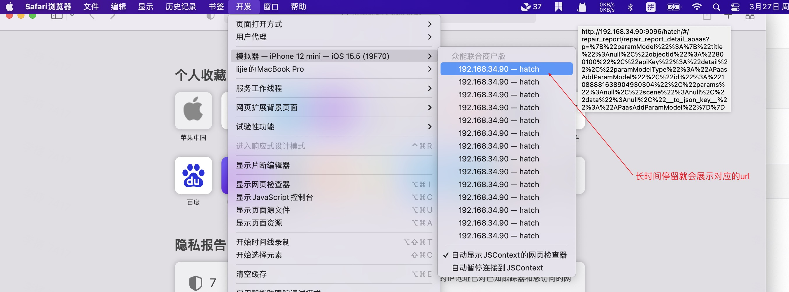

# 调试

## H5

### Chrome调试H5

[ios-webkit-debug-proxy](https://github.com/google/ios-webkit-debug-proxy/releases)

首先打开手机的Safari浏览器的Web检查器（设置/Safari浏览器/高级/网页检查器）

####  Windows

1. 下载对应的release包
2. 执行ios_webkit_debug_proxy -f chrome-devtools://devtools/bundled/inspector.html
3. 在chrome浏览其中打开 location:9221

##### 问题点：

1. device_listener: connect function failed with  error 10061 No device found, is it plugged in?
   下载Itunes，确保电脑和手机连上
2. Unable to attach abddec8eb6da9b05f07348cc4c82998d3584b55f inspector
   好像是数据线没插紧

#### Mac

1. brew install ios-webkit-debug-proxy

2. ios_webkit_debug_proxy -f chrome-devtools://devtools/bundled/inspector.html

3. IOS12以上（详细查看github）
   ```shell
   brew update
   brew reinstall --HEAD usbmuxd
   brew reinstall --HEAD libimobiledevice
   brew reinstall -s ios-webkit-debug-proxy
   ```

##### 问题点：

1. Could not connect to lockdownd. Exiting.: Permission denied
   ```shell
   sudo chmod +x /var/db/lockdown
   brew upgrade libimobiledevice --HEAD
   ```

### Safari调试H5（Mac）

1. 首先打开苹果手机/苹果模拟器的Safari浏览器的Web检查器（设置/Safari浏览器/高级/网页检查器）

2. 打开Mac电脑的开发菜单（Safari浏览器/偏好设置/高级/在菜单栏显示开发菜单打勾）

3. 打开h5页面就可以在调试了

   + 如果展示的页面过多，可以来回悬浮，查看那个页面才是当前h5页面
   + 有时候会失效，重启Mac的Safria浏览器

   