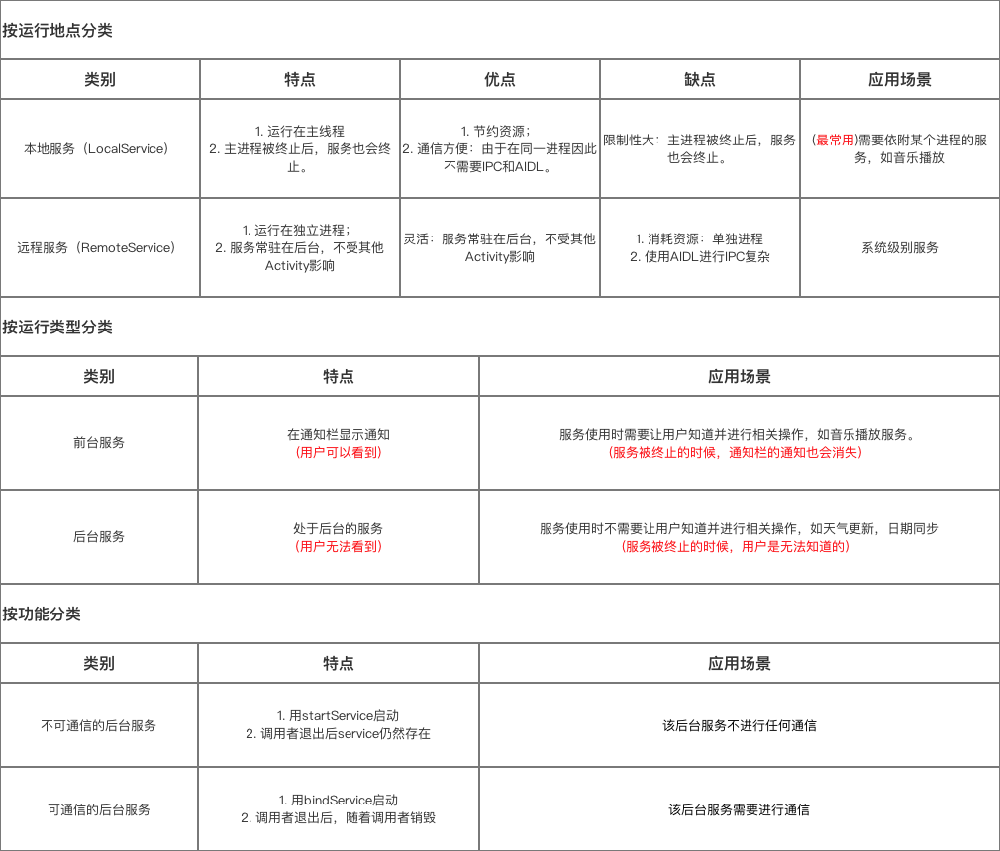

# Service

+ [官网学习](https://developer.android.com/guide/components/services?hl=zh-cn)

## 生命周期


```
onStartCommand() 
   当另一个组件（如 Activity）通过调用 startService() 请求启动服务时，系统将调用此方法。一旦执行此方法，服务即会启动并可在后台无限期运行。 如果您实现此方法，则在服务工作完成后，需要由您通过调用 stopSelf() 或 stopService() 来停止服务。（如果您只想提供绑定，则无需实现此方法。）
   
onBind() 
当另一个组件想通过调用 bindService() 与服务绑定（例如执行 RPC）时，系统将调用此方法。在此方法的实现中，您必须通过返回 IBinder 提供一个接口，供客户端用来与服务进行通信。请务必实现此方法，但如果您并不希望允许绑定，则应返回 null。

onCreate() 
首次创建服务时，系统将调用此方法来执行一次性设置程序（在调用 onStartCommand() 或 onBind() 之前）。如果服务已在运行，则不会调用此方法

onDestroy() 
当服务不再使用且将被销毁时，系统将调用此方法。服务应该实现此方法来清理所有资源，如线程、注册的侦听器、接收器等。 这是服务接收的最后一个调用。
```

### 服务分类



## 前台服务


## AIDL

## service标签

```xml
<service android:enabled=["true" | "false"]
    android:exported=["true" | "false"]
    android:icon="drawable resource"
    android:isolatedProcess=["true" | "false"]
    android:label="string resource"
    android:name="string"
    android:permission="string"
    android:process="string" >
    . . .
</service>

android:exported：代表是否能被其他应用隐式调用，其默认值是由service中有无intent-filter决定的，如果有intent-filter，默认值为true，否则为false。为false的情况下，即使有intent-filter匹配，也无法打开，即无法被其他应用隐式调用。
android:name：对应Service类名
android:permission：是权限声明
android:process：是否需要在单独的进程中运行,当设置为android:process=”:remote”时，代表Service在单独的进程中运行。注意“：”很重要，它的意思是指要在当前进程名称前面附加上当前的包名，所以“remote”和”:remote”不是同一个意思，前者的进程名称为：remote，而后者的进程名称为：App-packageName:remote。
android:isolatedProcess ：设置 true 意味着，服务会在一个特殊的进程下运行，这个进程与系统其他进程分开且没有自己的权限。与其通信的唯一途径是通过服务的API(bind and start)。
android:enabled：是否可以被系统实例化，默认为 true因为父标签 也有 enable 属性，所以必须两个都为默认值 true 的情况下服务才会被激活，否则不会激活。
```

## 源码

+ [Android Service超详细解析](https://blog.csdn.net/chenshengfa/article/details/62042784)