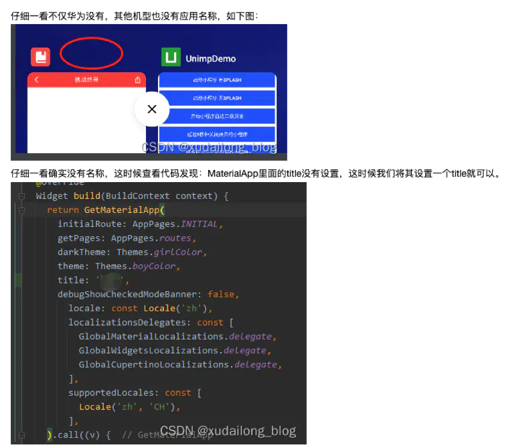
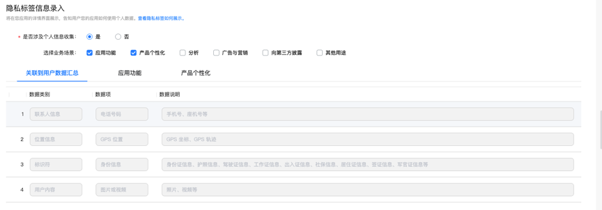

#  安卓上架整理

材料准备：

1. 软著（提前准备）
2. 32位和64位的安卓包
3. 隐私协议（协议里面的名字必须和软著app包里面的名字一样，协议里面的公司名称必须和软著里面的公司以及当前公司主体一样）
4. 用户协议（协议里面的名字必须和软著app包里面的名字一样，协议里面的公司名称必须和软著里面的公司以及当前公司主体一样）
5. 应用介绍，应用展示位截图（最少四张）
6. ICP备案信息截图。

## 华为

审核严格

### 问题点

1. 您的应用存在隐藏最近任务列表名称的行为，不符合华为应用市场审核标准。（flutter应用）

   需要添加title，见下图例子：

   

2. 您提交的隐私标签与实际情况不符，不符合华为应用市场审核标准。 ­修改建议：请根据应用收集的个人信息项和个人信息使用目的，如实填写隐私标签。 ­详细信息请咨询互动中心或参考《AppGallery隐私标签服务说明》。

   在上架的时候在隐私标签信息录入中填入信息，见下图标签位置：

   

3. 权限需要在具体业务场景使用的才能弹出。（不可以在一开始一次性弹出）

## VIVO

审核适中

1. 应用名字不能大于8个汉字。

2. vivo承诺函是必须要写的

## 小米和OPPO

审核简单

