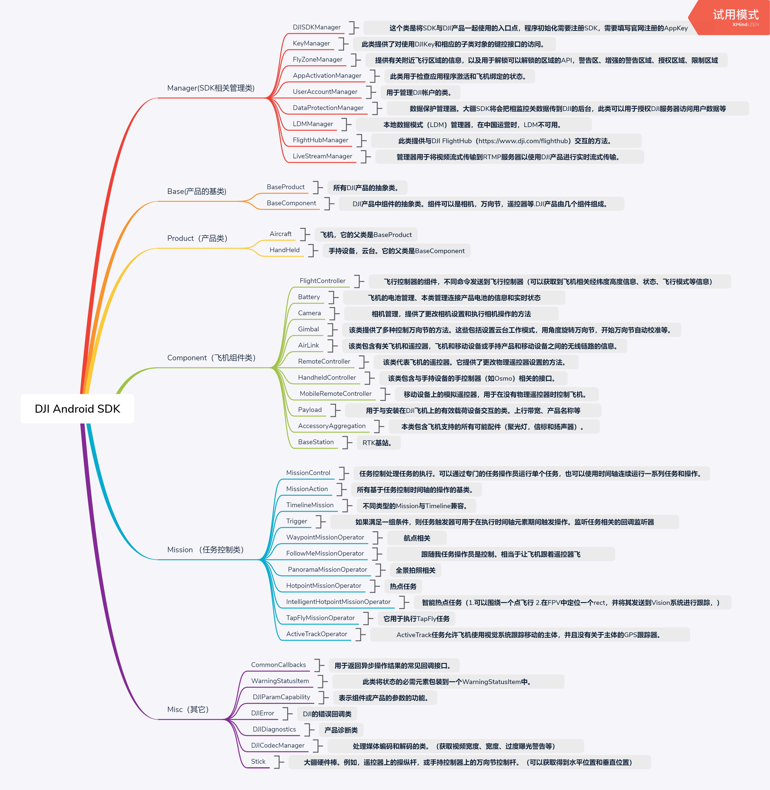
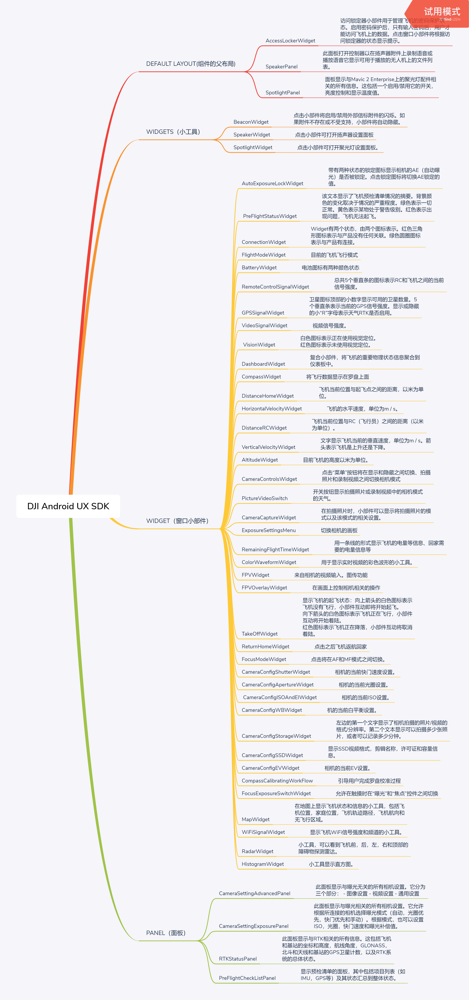

# 梳理

## 1、Android_SDK梳理



## 2、Android_UX_SDK梳理



# 集成

## 1、build.gradle配置

```java
apply plugin: 'com.android.application'

android {
    compileSdkVersion 29
    buildToolsVersion "30.0.2"

    useLibrary 'org.apache.http.legacy'


    defaultConfig {
        applicationId "com.webrtc.android.dj"
        minSdkVersion 19
        targetSdkVersion 29
        versionCode 1
        versionName "1.0"

        testInstrumentationRunner "androidx.test.runner.AndroidJUnitRunner"

        packagingOptions {
            //解决编译时com.android.builder.merge.DuplicateRelativeFileException: More than one file was found with OS independent path 'META-INF/rxjava.properties'这个错误
            exclude 'META-INF/rxjava.properties'
        }

        multiDexEnabled true     //支持dex分包
        ndk {
            // On x86 devices that run Android API 23 or above, if the application is targeted with API 23 or
            // above, FFmpeg lib might lead to runtime crashes or warnings.
            abiFilters 'armeabi-v7a', 'x86', 'arm64-v8a'
        }
    }

    //大疆设置的这些动态库不要压缩
    packagingOptions {
        doNotStrip "*/*/libdjivideo.so"
        doNotStrip "*/*/libSDKRelativeJNI.so"
        doNotStrip "*/*/libFlyForbid.so"
        doNotStrip "*/*/libduml_vision_bokeh.so"
        doNotStrip "*/*/libyuv2.so"
        doNotStrip "*/*/libGroudStation.so"
        doNotStrip "*/*/libFRCorkscrew.so"
        doNotStrip "*/*/libUpgradeVerify.so"
        doNotStrip "*/*/libFR.so"
        doNotStrip "*/*/libDJIFlySafeCore.so"
        doNotStrip "*/*/libdjifs_jni.so"
        doNotStrip "*/*/libsfjni.so"
        doNotStrip "*/*/libDJICommonJNI.so"
        doNotStrip "*/*/libDJICSDKCommon.so"
        doNotStrip "*/*/libDJIUpgradeCore.so"
        doNotStrip "*/*/libDJIUpgradeJNI.so"
        doNotStrip "*/*/libDJIWaypointV2Core.so"
        doNotStrip "*/*/libAMapSDK_MAP_v6_9_2.so"
        doNotStrip "*/*/libDJIMOP.so"
        exclude 'META-INF/rxjava.properties'
        exclude 'assets/location_map_gps_locked.png'
        exclude 'assets/location_map_gps_3d.png'
    }


    compileOptions {
        //解决编译出现的Error: Invoke-customs are only supported starting with Android O (--min-api 26)
        //同时支持lambda表达式
        sourceCompatibility JavaVersion.VERSION_1_8
        targetCompatibility JavaVersion.VERSION_1_8
    }

    buildTypes {
        release {
            minifyEnabled false
            proguardFiles getDefaultProguardFile('proguard-android-optimize.txt'), 'proguard-rules.pro'
        }
    }

}

dependencies {
    implementation fileTree(dir: 'libs', include: ['*.jar'])


    implementation 'androidx.appcompat:appcompat:1.2.0'
    implementation 'androidx.constraintlayout:constraintlayout:2.0.1'
    testImplementation 'junit:junit:4.12'
    androidTestImplementation 'androidx.test.ext:junit:1.1.2'
    androidTestImplementation 'androidx.test.espresso:espresso-core:3.3.0'

    //大疆SDK需要的依赖
    implementation 'androidx.recyclerview:recyclerview:1.1.0'
    implementation 'androidx.lifecycle:lifecycle-extensions:2.2.0'
    implementation 'androidx.multidex:multidex:2.0.1'
    implementation 'com.dji:dji-sdk:4.13.1'
    compileOnly 'com.dji:dji-sdk-provided:4.13.1'

    //高德地图SDK
    //2D地图so及jar
    implementation 'com.amap.api:map2d:6.0.0'
    //定位功能
    implementation 'com.amap.api:location:4.7.0'
    //搜索功能
    implementation 'com.amap.api:search:6.9.2'
    //3D地图
    implementation 'com.amap.api:3dmap:6.9.2'
}
```

## 2、创建MApplication类

```java
package com.example.ljdjsdk;

import android.app.Application;
import android.content.Context;

import androidx.multidex.MultiDex;

import com.secneo.sdk.Helper;

import dji.sdk.base.BaseProduct;
import dji.sdk.camera.Camera;
import dji.sdk.mission.MissionControl;
import dji.sdk.products.Aircraft;
import dji.sdk.products.HandHeld;
import dji.sdk.sdkmanager.DJISDKManager;


//发烫的飞机  MAVIC PRO(域 PRO 白金版)
public class MApplication extends Application {

    private static Application application;
    private static BaseProduct mProduct;
    private static MissionControl mControl;


    @Override
    protected void attachBaseContext(Context base) {
        super.attachBaseContext(base);
        MultiDex.install(this);         //分包
        Helper.install(MApplication.this);  //大疆的初始化，加载so操作
    }


    @Override
    public void onCreate() {
        super.onCreate();
        application = this;
    }

    public static Context getApplication() {
        return application;
    }

    //获取大疆摄像头对象，保证全局唯一
    public static Camera getCamera() {
        if (getBaseProduct() == null) return null;
        Camera camera = null;
        if (getBaseProduct() instanceof Aircraft) {
            camera = ((Aircraft) getBaseProduct()).getCamera();
        } else if (getBaseProduct() instanceof HandHeld) {
            camera = ((HandHeld) getBaseProduct()).getCamera();
        }
        return camera;
    }

    //获取大疆产品对象
    public static BaseProduct getBaseProduct() {
        if (null == mProduct) {
            mProduct = DJISDKManager.getInstance().getProduct();
        }
        return mProduct;
    }

    //获取大疆飞行控制对象
    public static MissionControl getMissionControl() {
        if (null == mControl) {
            mControl = DJISDKManager.getInstance().getMissionControl();
        }
        return mControl;
    }
}

```

## 3、AndroidManifest.xml配置

```xml
权限：
<uses-permission android:name="android.permission.BLUETOOTH" />
    <uses-permission android:name="android.permission.BLUETOOTH_ADMIN" />
    <uses-permission android:name="android.permission.VIBRATE" />
    <uses-permission android:name="android.permission.INTERNET" />
    <uses-permission android:name="android.permission.ACCESS_WIFI_STATE" />
    <uses-permission android:name="android.permission.WAKE_LOCK" />
    <uses-permission android:name="android.permission.ACCESS_COARSE_LOCATION" />
    <uses-permission android:name="android.permission.ACCESS_NETWORK_STATE" />
    <uses-permission android:name="android.permission.ACCESS_FINE_LOCATION" />
    <uses-permission android:name="android.permission.CHANGE_WIFI_STATE" />
    <uses-permission android:name="android.permission.MOUNT_UNMOUNT_FILESYSTEMS" />
    <uses-permission android:name="android.permission.WRITE_EXTERNAL_STORAGE" />
    <uses-permission android:name="android.permission.READ_EXTERNAL_STORAGE" />
    <uses-permission android:name="android.permission.SYSTEM_ALERT_WINDOW" />
    <uses-permission android:name="android.permission.READ_PHONE_STATE" />

    <uses-feature android:name="android.hardware.camera" />
    <uses-feature android:name="android.hardware.camera.autofocus" />
    <uses-feature
        android:name="android.hardware.usb.host"
        android:required="false" />
    <uses-feature
        android:name="android.hardware.usb.accessory"
        android:required="true" />
        
key:
 <!--大疆SDK申请的key-->
        <meta-data
            android:name="com.dji.sdk.API_KEY"
            android:value="" />

        <!--高德SDK申请的key-->
        <meta-data
            android:name="com.amap.api.v2.apikey"
            android:value="" />

        <activity android:name=".activity.MainActivity">
            <intent-filter>
                <action android:name="android.intent.action.MAIN" />

                <category android:name="android.intent.category.LAUNCHER" />
            </intent-filter>
        </activity>
        <activity
            android:name="dji.sdk.sdkmanager.DJIAoaControllerActivity"
            android:theme="@android:style/Theme.Translucent">
            <intent-filter>
                <action android:name="android.hardware.usb.action.USB_ACCESSORY_ATTACHED" />
            </intent-filter>

            <meta-data
                android:name="android.hardware.usb.action.USB_ACCESSORY_ATTACHED"
                android:resource="@xml/accessory_filter" />
        </activity>
```

# 准备动作

## 1、动态权限申请（略）

## 2、检测key是否合法

```java
        //大疆向其服务器发送网络请求校验key，校验bundle id
        //飞机开启会主动和遥控器进行连接，不需要调用方法去进行连接
        DJISDKManager.getInstance().registerApp(MainActivity.this.getApplicationContext(),new DJISDKManager.SDKManagerCallback()                    {
                    @Override
                    public void onRegister(DJIError djiError) {
                        if (djiError == DJISDKError.REGISTRATION_SUCCESS) {
                            showToast("Register Success");
                            DJISDKManager.getInstance().startConnectionToProduct();   //开始连接遥控器，成功会回调onProductConnect
                        } else {
                            showToast("Register sdk fails, please check the bundle id and network connection!");
                        }
                    }

                    @Override
                    public void onProductDisconnect() {
                        showToast("onProductDisconnect");   //与遥控器失去连接
                    }

                    @Override
                    public void onProductConnect(BaseProduct baseProduct) {
                        showToast("onProductConnect");     //与遥控器连接上了
                    }

                    @Override
                    public void onProductChanged(BaseProduct baseProduct) {
                        showToast("onProductChanged");  //飞机失去连接会进行回调，
                    }

                    @Override
                    public void onComponentChange(BaseProduct.ComponentKey componentKey, BaseComponent baseComponent, BaseComponent baseComponent1) {
                        showToast("onComponentChange");
                    }

                    @Override
                    public void onInitProcess(DJISDKInitEvent djisdkInitEvent, int i) {
                        showToast("onInitProcess");    //初始化进度，i变量表示进度，从0到100
                    }

                    @Override
                    public void onDatabaseDownloadProgress(long l, long l1) {
                        showToast("onDatabaseDownloadProgress");
                    }
                });

```

## 3、登录大疆账号

```java
//大疆SDK必须登录账号，不然限制飞行50米
    /**
     * 弹出登录对话框
     */
    private void startLogin() {
        UserAccountManager.getInstance().logIntoDJIUserAccount(MainActivity.this,
                new CommonCallbacks.CompletionCallbackWith<UserAccountState>() {
                    @Override
                    public void onSuccess(final UserAccountState userAccountState) {
                        showToast("Login Success");
                    }

                    @Override
                    public void onFailure(DJIError error) {
                        showToast("Login Error:"
                                + error.getDescription());
                    }
                });
    }

//登出当前账号
public void logout(DjiLoginListener djiLoginListener) {
        UserAccountManager.getInstance().loginOut(djiError -> {
            if (djiError != null) {
                LogUtil.d(djiError.getDescription());
            }
        });
    }
```

# 照相机

## 1、展示照相机视频

```java
/**
将照相机的视频流数据展示到TextureView上面去
重要的类:
DJICodecManager   //视频流解码器
VideoFeeder
VideoFeeder.VideoDataListener  //照相机视频流接收监听器
**/
protected VideoFeeder.VideoDataListener mReceivedVideoDataListener = null;   //接收视频数据的监听器
private DJICodecManager djiCodecManager;   //视频解码器
        //实例化视频流监听器
        mReceivedVideoDataListener = (bytes, i) -> {  //接收到的是H264裸码流
            djiCodecManager.sendDataToDecoder(bytes, i);   //开始解码
        };

    //TextureView可达的时候调用可以做一些初始化操作
    @Override
    public void onSurfaceTextureAvailable(SurfaceTexture surface, int width, int height) {
        if (djiCodecManager == null) {
            djiCodecManager = new DJICodecManager(this, surface, width, height);   //初始化解码器
        }
    }

    //TextureView大小发生变化时调用，可能是横竖屏切换的时候
    @Override
    public void onSurfaceTextureSizeChanged(SurfaceTexture surface, int width, int height) {

    }

    //TextureView销毁是调用
    @Override
    public boolean onSurfaceTextureDestroyed(SurfaceTexture surface) {
        return false;
    }

    @Override
    public void onSurfaceTextureUpdated(SurfaceTexture surface) {

    }

    //绑定照相机视频流到监听器上去
    BaseProduct product = MApplication.getBaseProduct();
        if (product == null || !product.isConnected()) {
            showToast("未连接");
        } else {
            if (null != tv_Media) {
                tv_Media.setSurfaceTextureListener(this);
            }
            if (!product.getModel().equals(Model.UNKNOWN_AIRCRAFT)) {
                //将飞机的第第一个摄像头绑定到监听器上面
                VideoFeeder.getInstance().getPrimaryVideoFeed().addVideoDataListener(mReceivedVideoDataListener);
                //如果飞机有第二个摄像头,也可以获取到第二个摄像头的视频流
                VideoFeeder.getInstance().getSecondaryVideoFeed();   
            }
        }
```

## 2、拍照/录像

```java
/**
在进行拍照或者录像前需要进行模式切换
**/

/**
1、模式切换
     SettingsDefinitions.CameraMode.SHOOT_PHOTO 拍照模式
     SettingsDefinitions.CameraMode.RECORD_VIDEO 录像模式
     SettingsDefinitions.CameraMode.PLAYBACK 回放模式
     SettingsDefinitions.CameraMode.MEDIA_DOWNLOAD 下载模式
     SettingsDefinitions.CameraMode.BROADCAST 广播模式
     SettingsDefinitions.CameraMode.UNKNOWN 未知模式
**/
private void switchCameraMode(SettingsDefinitions.CameraMode cameraMode) {
        Camera camera = MApplication.getCamera();   //获取到全局照相机实例
        if (camera != null) {
            camera.setMode(cameraMode, error -> {
                if (error == null) {
                    showToast("Switch Camera Mode Succeeded");
                } else {
                    showToast(error.getDescription());
                }
            });
        }
    }

/**
2、切换到拍照模式下可以进行拍照了
**/
   private void startCapture() {
        final Camera camera = MApplication.getCamera();
        if (camera != null) {
            SettingsDefinitions.ShootPhotoMode photoMode = SettingsDefinitions.ShootPhotoMode.SINGLE; // Set the camera capture mode as Single mode
            camera.setShootPhotoMode(photoMode, djiError -> {
                if (null == djiError) {
                    handler.postDelayed(new Runnable() {
                        @Override
                        public void run() {
                            camera.startShootPhoto(djiError1 -> {
                                if (djiError1 == null) {
                                    showToast("take photo: success");
                                } else {
                                    showToast(djiError1.getDescription());
                                }
                            });
                        }
                    }, 1000);
                }
            });
        }
    }

/**
3、切换到录屏模式下可以进行录屏了
**/
   //开始录像
    private void startRecord() {
        Camera camera = MApplication.getCamera();
        if (camera != null) {
            camera.startRecordVideo(djiError -> {
                if (djiError == null) {
                    showToast("Record video: success");
                } else {
                    showToast(djiError.getDescription());
                }
            });
        }
    }
    //停止录像
    private void stopRecord() {
        Camera camera = MApplication.getCamera();
        if (camera != null) {
            camera.stopRecordVideo(djiError -> {
                if (djiError == null) {
                    showToast("Stop recording: success");
                } else {
                    showToast(djiError.getDescription());
                }
            });
        }
    }
```

## 3、拍照照片和录像视频保存到手机上

```java
/**
无人机拍照和录像的文件本身时保存在无人机的SD卡里面的
可以通过SDK提供的方法来转移到手机上
重要的类：
      MediaManager  //媒体文件管理器
      FetchMediaTaskScheduler   //获取媒体任务计划程序.这可用于排列从多个媒体文件下载预览，缩略图和XML自定义数据
      MediaFile  //媒体文件     
**/

//1、初始化媒体管理器,初始化文件夹路径,初始化文件状态监听器
       private MediaManager.FileListState currentFileListState = MediaManager.FileListState.UNKNOWN;//文件列表状态
       if (destDir == null) {
            destDir = new File(Environment.getExternalStorageDirectory().getPath() + "/DjMedia/");

            if (!destDir.exists()) {
                destDir.mkdir();
            }
        }

        camera = MApplication.getCamera();
        if (camera != null && camera.isMediaDownloadModeSupported()) {
            mMediaManager = camera.getMediaManager();   //初始化媒体管理器
        }
        updateFileListStateListener = new MediaManager.FileListStateListener() {
            /**
            当前文件列表状态
            MediaManager.FileListState.UP_TO_DATE	文件列表是最新的：已与飞机中的SD卡同步
            MediaManager.FileListState.INCOMPLETE	自上次调用以来已生成新文件refreshFileListOfStorageLocation。调用refreshFileListOfStorageLocation可以同步新生成的文件，并将它们附加到文件列表的末尾
            MediaManager.FileListState.RESET        文件列表被重置。在以下情况之一时，文件列表将被重置：
                                                                               -相机已断开连接。
                                                                               -SD卡已格式化。
                                                                               -未插入SD卡。
                                                                               -从SD卡删除文件时发生错误。
                                                                               在这种状态下，getSDCardFileListSnapshot将返回null。
            MediaManager.FileListState.DELETING     deleteFiles 已被调用，操作仍在进行中。
            MediaManager.FileListState.RENAMING     重命名操作正在进行中
            MediaManager.FileListState.SYNCING      媒体管理器正在同步SD卡中的文件列表。
            MediaManager.FileListState.UNKNOWN      未知状态
            **/
            @Override
            public void onFileListStateChange(MediaManager.FileListState state) {
                currentFileListState = state;
            }
        };

//2、切换到文件下载模式
        private FetchMediaTaskScheduler scheduler;//下载文件时序表
        if (null != mMediaManager) {
            mMediaManager.addUpdateFileListStateListener(this.updateFileListStateListener);
            camera.setMode(SettingsDefinitions.CameraMode.MEDIA_DOWNLOAD, new CommonCallbacks.CompletionCallback() {
                @Override
                public void onResult(DJIError error) {
                    if (error == null) {
                        showLog("Set cameraMode success");
                        getFileList();
                    } else {
                        showLog("Set cameraMode failed");
                    }
                }
            });
            if (mMediaManager.isVideoPlaybackSupported()) {
                showLog("Camera support video playback!");
            } else {
                showLog("Camera does not support video playback!");
            }
            scheduler = mMediaManager.getScheduler();
        }

//3、获取媒体文件列表
    private void getFileList() {
        mMediaManager = MApplication.getCamera().getMediaManager();
        if (mMediaManager != null) {
            if ((currentFileListState == MediaManager.FileListState.SYNCING) || (currentFileListState == MediaManager.FileListState.DELETING)) {
                showToast("Media Manager is busy.");
            } else {
                //获取机身SD卡的媒体文件,也可以获取机身内部存储的媒体文件
                mMediaManager.refreshFileListOfStorageLocation(SettingsDefinitions.StorageLocation.SDCARD, new CommonCallbacks.CompletionCallback() {
                    @Override
                    public void onResult(DJIError djiError) {
                        if (null == djiError) {
                            //Reset data
                            if (currentFileListState != MediaManager.FileListState.INCOMPLETE) {
                                mediaFileList.clear();
                            }
                            mediaFileList = mMediaManager.getSDCardFileListSnapshot();  //获取到媒体文件列表的快照
                            if (mediaFileList != null) {
                                showLog("media");
                            }
                            //对获取到的文件列表按照创建时间进行排序
                            Collections.sort(mediaFileList, new Comparator<MediaFile>() {
                                @Override
                                public int compare(MediaFile lhs, MediaFile rhs) {
                                    if (lhs.getTimeCreated() < rhs.getTimeCreated()) {
                                        return 1;
                                    } else if (lhs.getTimeCreated() > rhs.getTimeCreated()) {
                                        return -1;
                                    }
                                    return 0;
                                }
                            });
                            
                        } else {
                            showLog("Get Media File List Failed:" + djiError.getDescription());
                        }
                    }
                });
            }
        }
    }

//3、下载缩略图或者预览图
    private FetchMediaTaskScheduler scheduler=mMediaManager.getScheduler();//下载文件时序表对象
    scheduler.resume(new CommonCallbacks.CompletionCallback() {
                                @Override
                                public void onResult(DJIError error) {
                                    if (error == null) {
                                        getThumbnails();   //获取缩略图
                                    }
                                }
                            });
    private void getThumbnails() {
        if (mediaFileList.size() <= 0) {
            showLog("No File info for downloading thumbnails");
            return;
        }
        for (int i = 0; i < mediaFileList.size(); i++) {
            getThumbnailByIndex(i);  //获取每个媒体文件的缩略图
        }
    }

    private void getThumbnailByIndex(final int index) {
        /**
        创建任务来获取
        FetchMediaTaskContent.NONE        //没有
        FetchMediaTaskContent.THUMBNAIL  //缩略图
        FetchMediaTaskContent.PREVIEW    //预览图
        FetchMediaTaskContent.CUSTOM_INFORMATION  //自定义信息
        **/
        FetchMediaTask task = new FetchMediaTask(mediaFileList.get(index), FetchMediaTaskContent.THUMBNAIL, taskCallback);
        scheduler.moveTaskToEnd(task);
    }

    //获取缩略图或者预览图的回调
    private FetchMediaTask.Callback taskCallback = new FetchMediaTask.Callback() {
        @Override
        public void onUpdate(MediaFile file, FetchMediaTaskContent option, DJIError error) {
            if (null == error) {
                if (option == FetchMediaTaskContent.PREVIEW) {
                    //当前拿到的是预览图
                }
                if (option == FetchMediaTaskContent.THUMBNAIL) {
                    //当前拿到的是缩略图
                }
            } else {
                //获取失败
            }
        }
    };

//4、下载原图
   if ((mediaFileList.get(index).getMediaType() == MediaFile.MediaType.PANORAMA)
                || (mediaFileList.get(index).getMediaType() == MediaFile.MediaType.SHALLOW_FOCUS)) {
            return;
        }
        mediaFileList.get(index).fetchFileData(destDir, null, new DownloadListener<String>() {
            //下载失败
            @Override
            public void onFailure(DJIError error) {
            }

            //下载的进度,total为文件大小,current为当前下载大小
            @Override
            public void onProgress(long total, long current) {
                
            }

            @Override
            public void onRateUpdate(long total, long current, long persize) {

            }

            //开始下载
            @Override
            public void onStart() {
                
            }

            //下载成功
            @Override
            public void onSuccess(String filePath) {
                
            }
        });

//5、删除原始文件
        List<MediaFile> deleteList = new ArrayList<>();
        deleteList.add(mediaFileList.get(index));
        mMediaManager.deleteFiles(deleteList, new CommonCallbacks.CompletionCallbackWithTwoParam<List<MediaFile>, DJICameraError>() {
            //删除文件成功
            @Override
            public void onSuccess(List<MediaFile> mediaFiles, DJICameraError djiCameraError) {
            }
 
            //删除文件失败
            @Override
            public void onFailure(DJIError djiError) {
            }
        });

//6、MediaFile可以获取到的媒体信息
/**
1、MediaFile.MediaType.MOV  //MOV类型的视频格式
2、MediaFile.MediaType.MP4  //MP4类型的视频格式
**/
mediaFile.getMediaType()         
mediaFile.getDurationInSeconds()   //文件时长,单位s（视频文件才有）
mediaFile.getFileName()   //文件名      
mediaFile.getFileSize()   //文件大小,单位字节
mediaFile.getThumbnail()  //文件缩略图
mediaFile.getResolution() //文件分辨率
mediaFile.getTimeCreated() //文件创建时间   
```

## 4、云台角度

```java
/**
调整云台角度
默认情况下，云台的 Pitch 值的范围是 [0, 90]，如果需要扩展这个范围到 [-30, 90]，即云台最大可以上仰至 30 度，则可以调用 setPitchRangeExtensionEnabled:withCompletion 方法来设置
重要的类：
Gimbal   //云台对象
Rotation.Builder //云台数据构造对象
**/

//1、初始化操作
        BaseProduct product = MApplication.getBaseProduct();
        if (product != null)
            gimbal = product.getGimbal();   //初始化云台对象
        //设置云台模式为YAW_FOLLOW（云台的工作模式将使其跟随偏航角。在此模式下，云台偏航将被固定，而俯仰和横滚将可移动），Mavic Mini不支持
        if (gimbal != null) {
            gimbal.setMode(GimbalMode.YAW_FOLLOW, new CommonCallbacks.CompletionCallback() {
                @Override
                public void onResult(DJIError djiError) {
                    if (djiError != null) {
                        showToast("云台模式设置错误" + djiError.getDescription());
                    }
                }
            });
            //获得云台Pitch的设置范围
            Number maxValue = ((DJIParamMinMaxCapability) (gimbal.getCapabilities().get(CapabilityKey.ADJUST_PITCH))).getMax();
            Number minValue = ((DJIParamMinMaxCapability) (gimbal.getCapabilities().get(CapabilityKey.ADJUST_PITCH))).getMin();
            gimbal.setStateCallback(new GimbalState.Callback() {
                @Override
                public void onUpdate(GimbalState gimbalState) {
                    mPitch = gimbalState.getAttitudeInDegrees().getPitch();
                    mRoll = gimbalState.getAttitudeInDegrees().getRoll();
                    mYaw = gimbalState.getAttitudeInDegrees().getYaw();

                }
            });

/**
Rotation.Builder构造
time    //旋转到角度所需要的时间
mode    //相对角度、绝对角度、速度模式、Rotation.NO_ROTATION表示在该方向上不进行旋转

御2 目前只能俯仰变化，待查证
俯仰、偏航、翻滚参考 https://blog.csdn.net/chengyq116/article/details/89195271
**/
//2、X轴旋转,云台旋转操作的俯仰属性，即云台在俯仰轴上旋转多少。如果为null，则不会对螺距轴进行任何操作。
gimbal.rotate(builder.time(5).pitch(10).mode(RotationMode.RELATIVE_ANGLE).build(), new CommonCallbacks.CompletionCallback() {
                        @Override
                        public void onResult(DJIError djiError) {
                            if (djiError != null) {
                                showToast("云台角度调整错误：" + djiError.getDescription());
                            }
                        }
                    });            
            
//3、Y轴旋转,云台旋转操作的偏航属性，即云台在偏航轴上旋转了多少。当旋转模式ABSOLUTE_ANGLE为时，偏航值相对于飞机的航向。如果为null，则不会对偏航轴进行任何操作。
gimbal.rotate(builder.time(2).yaw(-10).mode(RotationMode.RELATIVE_ANGLE).build(), new CommonCallbacks.CompletionCallback() {
                        @Override
                        public void onResult(DJIError djiError) {
                            if (djiError != null) {
                                showToast("云台角度调整错误：" + djiError.getDescription());

                            }
                        }
                    });
            
//4、Z轴旋转,万向架旋转操作的侧倾属性，即万向架在侧倾轴上旋转多少。如果为null，则不会对横摇轴进行任何操作
gimbal.rotate(builder.time(5).roll(10).mode(RotationMode.RELATIVE_ANGLE).build(), new CommonCallbacks.CompletionCallback() {
                        @Override
                        public void onResult(DJIError djiError) {
                            if (djiError != null) {
                                showToast("云台角度调整错误：" + djiError.getDescription());
                            }
                        }
                    });            
```


# 飞行

## 1、飞机状态信息

```java
BaseProduct baseProduct = SkyApplication.getBaseProduct();
        if (baseProduct == null || !baseProduct.isConnected()) {
            return;
        }
        //遥控器电池
        Battery battery = ((Aircraft) baseProduct).getBattery();
        //遥控器控制
        RemoteController remoteController = ((Aircraft) baseProduct).getRemoteController();
        //包含飞行控制器的组件,提供向飞行控制器发送不同命令的方法，可以获取到无人机的状态信息，包含位置信息，速度，距离，指南针等
        FlightController flightController = ((Aircraft) baseProduct).getFlightController();

        //云台实例
        Gimbal gimbal = baseProduct.getGimbal();

        Camera camera = SkyApplication.getCamera();

        if (gimbal != null) {
            gimbal.setStateCallback(gimbalState -> {
                gimbalPitch = gimbalState.getAttitudeInDegrees().getPitch();  //云台俯仰角
                gimbalRoll = gimbalState.getAttitudeInDegrees().getRoll();   //云台偏航角
                gimbalYaw = gimbalState.getAttitudeInDegrees().getYaw();   //云台翻滚角
            });
        }

        if (battery != null) {
            battery.setStateCallback(batteryState -> batteryRemainedPlane = batteryState.getChargeRemainingInPercent());
        }

        if (remoteController != null) {
            remoteController.setChargeRemainingCallback(batteryState -> {
                batteryRemainedRemoteControl = batteryState.getRemainingChargeInPercent();  //获取遥控器剩余电量的百分比
            });
        }

        if (flightController != null) {
            flightController.getFlightAssistant().setLandingProtectionEnabled(false, djiError -> {   //取消自动着落保护
                if (djiError != null) {
                    
                }
            });
            //每秒更新十次
            flightController.setStateCallback(flightControllerState -> {

                locationLat = flightControllerState.getAircraftLocation().getLatitude();  //纬度
                locationLng = flightControllerState.getAircraftLocation().getLongitude(); //经度
                altitude = flightControllerState.getAircraftLocation().getAltitude();  //高度
                flyPitch = flightControllerState.getAttitude().pitch;   //俯仰角
                flyRoll = flightControllerState.getAttitude().roll;   //偏航角
                flyYaw = flightControllerState.getAttitude().yaw;   //翻滚角
                satNumber = flightControllerState.getSatelliteCount();  //卫星数
                velocityX = flightControllerState.getVelocityX();   //x轴速度
                velocityY = flightControllerState.getVelocityY();   //y轴速度
                velocityZ = flightControllerState.getVelocityZ();   //z轴速度
                flightMode = flightControllerState.getFlightMode(); //飞行模式  
                velocity = (float) Math.sqrt(velocityX * velocityX + velocityY * velocityY + velocityZ * velocityZ);  //总速度

                if (camera != null) {
                    //获取相机焦距
                    camera.getDigitalZoomFactor(new CommonCallbacks.CompletionCallbackWith<Float>() {
                        @Override
                        public void onSuccess(Float aFloat) {
                            gimbalFocal = aFloat;
                        }

                        @Override
                        public void onFailure(DJIError djiError) {

                        }
                    });
                }
            });
        }
```


## 2、智能飞行（自动巡航）

```java
/**
目前官网支持的地图只有谷歌地图和高德地图
两个航点之间允许设定的最大距离为2km，最小距离为0.5m，最多设定99个航点，但是P4R可以设定200个航点，
总航点任务距离太长。最大总距离为40公里。总距离包括：
1、当前飞机位置到第一个航点的距离
2、航点之间的所有距离之和
3、从最后一个航路点到返航点的距离。
用的坐标系为WGS84
重要的类：
1、WaypointMissionOperator类  //是唯一控制，运行和监视waypoint对象。可以从访问它MissionControl,包括开始、停止、暂停、重启任务
2、WaypointMission类  //管理所有航点的统一动作，包括但不限于位置，动作，角度，朝向等等以及任务整体设置
3、Waypoint  ////航点的所有属性都在这个类中（单独的航点），可以单独设置航点信息
**/

//1、创建单独航点并设置相关动作
Waypoint mWaypoint = new Waypoint(latitude, longitude, altitude);  //参数分别为纬度,经度,高度
//航向,飞机到达航点时，飞机将旋转到的航向。范围在-180-180，0代表真实的北。如果航向任务的航向不同，飞机的航向将逐渐设置为下一个航向，同时在两个相邻的航路点之间飞行
mWaypoint.heading =50;
//角半径,默认情况下路径的拐角半径未0.2m
mWaypoint.cornerRadiusInMeters =0.2f    mWaypoint.getWaypocornerRadiusInMeters();
//转弯模式   顺时针：WaypointTurnMode.CLOCKWISE  逆时针：WaypointTurnMode.COUNTER_CLOCKWISE
mWaypoint.turnMode=WaypointTurnMode.COUNTER_CLOCKWIS;
//云台的俯仰角
mWaypoint.gimbalPitch = -50;
/**
等时拍照
飞机在当前航点和下一个航点之间移动时拍摄两张照片的时间间隔（以秒为单位）。飞机离开当前航路点时将拍摄第一张照片。最大值是6,000.0。最小值大于0.0，并且取决于相机类型和相机参数。照片文件格式为JPEG时，建议的最小值为2.0。照片文件格式为RAW时，最小值为10.0。如果输入超出相机的能力，则将以最大可能的速度拍摄照片。默认值为0.0，并且不会拍照。对于航路点，shootPhotoTimeInterval或shootPhotoDistanceInterval 为0.0。精度大于1个小数位的输入将四舍五入为1。警告：“ speed”shootPhotoTimeInterval 和shootPhotoDistanceInterval与任务中此路标和下一个路标之间的行为有关。相比之下，turnMode，altitude并heading 涉及到最后一个航路点和航路点的航点的任务之间的行为。仅受飞行控制器固件3.2.10.0或更高版本支持。
**/
mWaypoint.shootPhotoTimeInterval=1.0f
/**
等距拍照
飞机在当前航点和下一个航点之间移动时拍摄两张照片时的距离间隔（以米为单位）。最大值是6,000.0。最小值大于0.0，并且取决于相机类型，相机参数和飞行速度。当照片文件格式为JPEG时，两张照片之间的时间间隔不能小于2秒。照片文件格式为RAW时，两张照片之间的时间间隔不能小于10秒。如果输入超出相机的能力，则拍摄的照片可能会少于预期。默认值为0.0，并且不会拍照。对于航路点，shootPhotoTimeInterval 或shootPhotoDistanceInterval为0.0。精度大于1个小数位的输入将四舍五入为1。警告：“ speed”shootPhotoTimeInterval 和shootPhotoDistanceInterval与任务中此路标和下一个路标之间的行为有关。相比之下，turnMode，altitude 并heading涉及到最后一个航路点和航路点的航点的任务之间的行为。仅受飞行控制器固件3.2.10.0或更高版本支持。
**/
mWaypoint.shootPhotoDistanceInterval=1.0f
//如果有一组 action 是重复执行的，可以设置 waypoint 的 actionRepeatTimes 来实现。actionRepeatTimes 表示配置 action 的执行次数，默认是 1 次
mWaypoint.actionRepeatTimes=10;
/**
一个 waypoint 中 action 数量没有限制，但是对所有 action 执行总时长是有限制的。DJI 也提供了actionTimeoutInSeconds 属性来自定义 action 的执行总时长限制，取值范围是 0 - 999 秒，默认是 60 秒。
**/
mWaypoint.actionTimeoutInSeconds = 999;
/**
   支持的action
   WaypointActionType.STAY  在航点停留时间（0-32767）毫秒
   WaypointActionType.START_TAKE_PHOTO 拍照,时长最大设置为6秒,超过6s会去执行下个action,如果存在的话
   WaypointActionType.START_RECORD 开始录像,同上
   WaypointActionType.STOP_RECORD  停止录像,同上
   WaypointActionType.ROTATE_AIRCRAFT 旋转无人机,Y轴翻转,范围在-180度到180度
   WaypointActionType.GIMBAL_PITCH  云台俯仰角的角度范围,-90度到0度
**/
mWaypoint.addAction(new WaypointAction(WaypointActionType.GIMBAL_PITCH, -70));  //添加额外的一些动作

//2、管理所有航点,对所有航点设置,优先级低于单独设置航点
WaypointMission waypointMission = new WaypointMission.Builder()
                    //航点
                    //一定要加入俩个点以上否则不能成功执行航线任务,或者使用waypointList(List<Waypoint> list)直接添加所有航点
                    .addWaypoint(waypoint1)
                    .addWaypoint(waypoint2)
                    //航点数量 
                    .waypointCount(2)
                    /**
                    定义飞机如何前往第一个航点
                    1、SAFELY（安全地去路上。如果当前的高度较低,则飞机将上升到航向点的同一高度.然后,它从当前高度进入路径点坐标,然后继续到路径点的高度）
                    2、POINT_TO_POINT（从当前的飞机点直接转到航路点。）
                    **/
                    .gotoFirstWaypointMode(WaypointMissionGotoWaypointMode.SAFELY)
                    /**
                    定义飞机执行所有的航点后的动作
                    WaypointMissionFinishedAction.NO_ACTION（在完成任务后，将不再采取进一步行动。此时，飞机可由遥控器控制）
                    WaypointMissionFinishedAction.GO_HOME（任务完成后，飞机将返航。如果飞机离返回点有超过20米的距离，它就会回家着陆。否则，它将直接降落在目前的位置。）
                    WaypointMissionFinishedAction.AUTO_LAND（飞机将在最后一个方向自动着陆,默认飞机开了着陆保护,下降到2m就悬停,如果需要降落到地面,需要关闭着陆保护）
                    WaypointMissionFinishedAction.GO_FIRST_WAYPOINT（飞机将返回其第一个航向，并在适当位置盘旋。。）
                    WaypointMissionFinishedAction.CONTINUE_UNTIL_END（当飞机到达最后一个航点时，它将在不结束任务的情况下盘旋。操纵杆仍然可以用来把飞机沿着以前的航向向后拉。唯一能结束这一任务的方法就是召唤停止任务）
                    **/
                    .finishedAction(WaypointMissionFinishedAction.GO_HOME)
                    /**
                    航点间的航线设置
                    WaypointMissionHeadingMode.AUTO（飞机的航向总是在飞行方向）
                    WaypointMissionHeadingMode.USING_INITIAL_DIRECTION（当到达第一个航向点时，飞机的航向将被设置为航向。在到达第一个航向点之前，飞机的航向可以由遥控器控制。当飞机到达第一个航向点时，航向将固定）
                    WaypointMissionHeadingMode.CONTROL_BY_REMOTE_CONTROLLER（飞机的航向将由遥控器控制）
                    WaypointMissionHeadingMode.USING_WAYPOINT_HEADING（飞机的航向将逐渐设置为下一个航向，同时在两个相邻的航路点之间飞行）
                    WaypointMissionHeadingMode.TOWARD_POINT_OF_INTEREST（飞机的航向总是指向感兴趣的点）
                    **/
                    .headingMode(WaypointMissionHeadingMode.AUTO)
                    /**
                    飞行路径模式
                    WaypointMissionFlightPathMode.NORMAL（飞行路线将是正常的，飞机将从一个方向移动到下一个直线）
                    WaypointMissionFlightPathMode.CURVED（飞行路径将是弯曲的，飞机将以弯曲运动从一个路径点移动到下一个路径点。但是需要配合 waypoint 的 cornerRadiusInMeters。）
                    **/
                    .flightPathMode(WaypointMissionFlightPathMode.NORMAL)
                    /**
                    最大飞行速度
                    当飞机在航路点之间飞行时，你可以使用遥控器上的油门操纵杆来抵消它的速度。getMaxFlightSpeed这是当操纵杆被推到最大偏转时的偏移量。例如，如果最大飞行速度为10米/秒，那么一路推油门操纵杆会使飞机速度增加10米/秒，而向下推则会从飞机速度中减去10米/秒。如果遥控器杆没有最大挠度，那么偏移速度将在[0，getMaxFlightSpeed]分辨率为1000步。如果偏移速度为负值，则飞机将返回到以前的航向点。当它到达第一个路径点时，它将在适当的位置盘旋，直到正速度被应用。getMaxFlightSpeed范围为[2，15]米/秒。
                    **/
                    .maxFlightSpeed(10)
                    .build();
//在检查路径点的参数时发现错误。如果返回等于null如果所有参数都有效。如果不需要设置全部参数的时候，不能通过此方法判断是否为null在进行startmisstion。因为要设置SDK中全部的参数后且正确才会返回null。                    
if (waypointMission.checkParameters()!=null){
                    Log.d(TAG,"misson任务无效："+waypointMission.checkParameters());
}

//3、任务上传、开始、停止、暂停、重启
WaypointMissionOperator waypointMissionOperator = DJISDKManager.getInstance().getMissionControl().getWaypointMissionOperator(); 
/**
加载任务
加载WaypointMission到设备内存中。这也验证了任务的所有信息。即使在WaypointMission执行完成后，任务对象仍将留在设备内存中
**/
DJIError error = waypointMissionOperator.loadMission(waypointMission);
if (error == null) {
   //加载任务成功
} else {
   //加载任务失败
}
/**
上传任务
开始向飞机上传getLoadedMission。它只能在getLoadedMission完成且getCurrentState为READY_TO_UPLOAD时被调用。如果在上一个上传过程中发生超时错误，上传操作将从上一个断点恢复。成功上传任务后，WaypointMissionState将变为READY_TO_EXECUTE
**/
waypointMissionOperator.uploadMission(new CommonCallbacks.CompletionCallback() {
            @Override
            public void onResult(DJIError error) {
                if (error == null) {
                    showToast("Mission upload successfully!");
                } else {
                    //失败了进行重试
                    waypointMissionOperator.retryUploadMission(new CommonCallbacks.CompletionCallback() {
                        @Override
                        public void onResult(DJIError djiError) {
                            if (djiError != null)
                                showToast("重试结果:" + djiError.getDescription());
                        }
                    });
                }
            }
        });
/**
开始任务
开始执行上传的任务。它只能在getCurrentState是READY_TO_EXECUTE时调用。任务成功启动后，getCurrentState变成EXECUTING
**/
waypointMissionOperator.startMission(new CommonCallbacks.CompletionCallback() {
            @Override
            public void onResult(DJIError error) {
                showToast("Mission Start: " + (error == null ? "Successfully" : error.getDescription()));
            }
        });
/**
暂停任务
暂停执行任务。只能在WaypointMissionState为EXECUTING的时候。任务成功暂停后，getCurrentState会变成EXECUTION_PAUSED
**/
waypointMissionOperator.pauseMission(new CommonCallbacks.CompletionCallback() {
            @Override
            public void onResult(DJIError error) {
                if (error == null) {
                 
                } else
                    showToast("Mission Pause: " + error.getDescription());
            }
        });
/**
结束任务
**/
waypointMissionOperator.stopMission(new CommonCallbacks.CompletionCallback() {
            @Override
            public void onResult(DJIError error) {
                showToast("Mission Stop: " + (error == null ? "Successfully" : error.getDescription()));
            }
        });
/**
恢复暂停的任务
恢复暂停的任务。只能在getCurrentState是EXECUTION_PAUSED的时候。任务成功恢复后，getCurrentState会变成EXECUTING
**/
waypointMissionOperator.resumeMission(new CommonCallbacks.CompletionCallback() {
            @Override
            public void onResult(DJIError error) {
                if (error == null) {

                } else
                    showToast("Mission Resume: " + error.getDescription());
            }
        });
/**
设置飞行速度
任务自动执行时设置飞行速度(无需手动输入操纵杆速度)。这是这个类中唯一能够在任务期间与飞机通信的属性或方法。所有其他属性和方法都是脱机使用的，以准备任务，然后上传到飞机上。
speed:汽车飞行速度待定。自动飞行速度的绝对值应小于或等于getMaxFlightSpeed。它的范围是[getMaxFlightSpeed, getMaxFlightSpeed]m/s。
**/
setAutoFlightSpeed(float speed,callback)
/**
当前状态
WaypointMissionState.UNKNOWN  未知状态
WaypointMissionState.DISCONNECTED 失联状态
WaypointMissionState.NOT_SUPPORTED 连接的产品不支持航点任务。
WaypointMissionState.READY_TO_UPLOAD 飞机已准备好上载任务。
WaypointMissionState.READY_TO_EXECUTE 航点任务已完全上传，飞机准备开始执行。
WaypointMissionState.EXECUTION_PAUSED Waypoint任务已成功暂停。用户可以调用resumeMission以继续执行。
WaypointMissionState.RECOVERING  移动设备，遥控器和飞机之间的连接已建立。操作员正在同步飞机的状态。
**/
waypointMissionOperator.getCurrentState()
/**
任务状态监听
**/
//接口,负责Waypoint任务事件的侦听器，waypoint的所有任务都可以在这里监听
    waypointMissionOperator.addListener(waypointMissionOperatorListener);
    private WaypointMissionOperatorListener waypointMissionOperatorListener = new WaypointMissionOperatorListener() {
        //下载任务时执行
        @Override
        public void onDownloadUpdate(WaypointMissionDownloadEvent waypointMissionDownloadEvent) {
            showToast("下载任务：onDownloadUpdate");
        }

        //上传任务时执行
        @Override
        public void onUploadUpdate(WaypointMissionUploadEvent waypointMissionUploadEvent) {
            showToast("上传任务：onUploadUpdate");
        }

        //执行任务的情况
        @Override
        public void onExecutionUpdate(WaypointMissionExecutionEvent waypointMissionExecutionEvent) {
            showToast("执行任务：onExecutionUpdate");
        }

        //开始的情况
        @Override
        public void onExecutionStart() {
            showToast("开始：onExecutionStart");
        }

        //结束的情况
        @Override
        public void onExecutionFinish(DJIError djiError) {
            if (djiError != null)
                showToast("结束：" + djiError.getDescription());
        }
    };
```

## 3、虚拟摇杆（遥控飞行）

```java
/**
使用虚拟摇杆来控制飞机飞行
重要的类：
FlightController     //DJI飞机控制对象
**/

//1、启用虚拟摇杆模式
private FlightController mFlightController=DJISDKManager.getInstance().getProduct().getFlightController();  //初始化飞机控制对象
            //获取APP控制飞机权限
        mFlightController.setVirtualStickModeEnabled(true, new CommonCallbacks.CompletionCallback() {
          @Override
          public void onResult(DJIError djiError) {
               if (djiError != null) {
                   showToast("Enable Virtual Stick Failed" + djiError.getDescription());
                } else {
                   //并且在设置成功后再去设置pitch，yaw，roll的模式
                   /**
                   设置侧倾/俯仰虚拟控制器是更改飞机相对于水平方向的角度，还是更改飞机在水平轴上的速度。
                   RollPitchControlMode.ANGLE 将侧倾和俯仰值设置为相对于水平飞机的角度。在身体坐标系中，正俯仰角和负俯仰角分别表示飞机绕着y轴在正方向或负方向上旋转。正侧倾角和负侧倾角分别是绕x轴的正方向或负方向旋转角度。但是，在地面坐标系中，正俯仰角和负俯仰角分别是飞机向南和向北移动的角度值。正侧倾角和负侧倾角分别是飞机向东和向西移动时的角度。最大角度定义为30度。最小角度定义为-30度。
                   
                   RollPitchControlMode.VELOCITY 将侧倾和俯仰值设置为速度。在身体坐标系中，正俯仰速度和负俯仰速度分别是指飞机沿俯仰轴和y轴分别向正方向或负方向移动。正和负侧倾速度是指飞机分别沿着侧倾轴和x轴朝正方向或负方向移动时的速度。但是，在地面坐标系中，正俯仰速度和负俯仰速度分别用于向东和向西移动的飞机。正和负侧倾速度是飞机分别向北和向南移动时的速度。最大速度定义为15米/秒。最小速度定义为-15米/秒
                   **/
                   mFlightController.setRollPitchControlMode(RollPitchControlMode.VELOCITY);
                   /**
                   设置虚拟摇杆控制器是按角度还是按角速度更改飞机的航向。
                   YawControlMode.ANGLE 将偏航值设置为相对于北方的角度。正偏航角和负偏航角分别表示飞机顺时针和逆时针旋转。最大偏航角定义为180度。最小偏航角定义为-180度
                   YawControlMode.ANGULAR_VELOCITY 将偏航值设置为角速度。正角速度和负角速度分别用于飞机顺时针和逆时针旋转。最大偏航角速度定义为100度/秒。最小偏航角速度定义为-100度/ s。
                   **/
                   mFlightController.setYawControlMode(YawControlMode.ANGULAR_VELOCITY);
                   /**
                   设置虚拟摇杆垂直控制器是否更改飞机的高度或垂直速度。
                   VerticalControlMode.VELOCITY 将虚拟杆的垂直控制值设置为垂直速度。正和负垂直速度分别适用于飞机的上升和下降。最大垂直速度定义为4m/s。最小垂直速度定义为-4m/s
                   VerticalControlMode.POSITION 将虚拟杆垂直控制值设置为高度。最大位置定义为500m。最小位置定义为0m
                   **/
                   mFlightController.setVerticalControlMode(VerticalControlMode.VELOCITY);
                   /**
                   设置水平轴相对于地面或飞机是否固定
                   FlightCoordinateSystem.GROUND  //地面坐标系
                   FlightCoordinateSystem.BODY    //机身坐标系
                   **/
                   mFlightController.setRollPitchCoordinateSystem(FlightCoordinateSystem.BODY); 
                 }
             }
         });

//2、起飞和降落
/**
起飞方法
用于起飞。它会将飞行器升高到 1.2米，并在升高到0.5米的时候回调callback。若不给飞机装螺旋桨，它会马达空转7秒后停止。再次尝试takeOff()，会报错：the execution of this process is timed out。尝试用手举起飞机，欺骗它已经起飞是不可行的
**/
void startTakeoff(CompletionCallback var1);
/**
取消飞行方法
在起飞完成前调用此函数才有效。飞机会停止升高并悬停在当前高度。已经调用的startTakeoff()函数会报错。
**/
void cancelTakeoff(CompletionCallback var1);
/**
降落方法（并不会正在降落到地面，需配合confirmLanding使用）
自动降落，然后电机停转。
**/
void startLanding(CompletionCallback var1);
/**
取消降落方法
停止飞机的自动降落。如果在startLanding完成之前调用，则自动降落将被取消（startLanding完成框将返回错误），并且飞机将悬停在其当前位置
**/
void cancelLanding(CompletionCallback var1);
/**
确认降落方法
确认继续降落行动。当飞机与地面的间隙小于0.3m时，飞机将暂停着陆并等待用户确认。可以使用isLandingConfirmationNeeded在FlightControllerState检查是否需要确认。飞行控制器固件3.2.0.0及更高版本支持它。
**/
void confirmLanding(CompletionCallback var1)
    
//3、发送数据（官方给的发送频率要求是5-25HZ，也就是40毫秒至200毫秒发送一次）
//3.1、使用摇杆比来使用
    /**
     * 
     * @param rockerX 杆量比[-1, 1], 前/后(+/-)
     * @param rockerY 杆量比[-1, 1], 左/右(-/+)
     * @param rockerZ 杆量比[-1, 1], 上/下(-/+)
     * @param rockerRotate 杆量比[-1, 1], 顺时针/逆时针(+/-)旋转
     */
    private FlightControlData senddata;
 
    private void fly(VirtualStickPB bean) {
        if (isEnableStick) {
            float rockX = (null == bean.rockerX ? 0 : bean.rockerX);
            float rockY = (null == bean.rockerY ? 0 : bean.rockerY);
            float rockZ = (null == bean.rockerZ ? 0 : bean.rockerZ);
            float rockerRotation = (null == bean.rockerRotation ? 0 : bean.rockerRotation);
 
            RollPitchControlMode rollPitchControlMode = mFlightController.getRollPitchControlMode();
            VerticalControlMode verticalControlMode = mFlightController.getVerticalControlMode();
            YawControlMode yawControlMode = mFlightController.getYawControlMode();
 
            if (rollPitchControlMode == RollPitchControlMode.VELOCITY) {
                // 前/后
                mRoll = rockX * Limits.ROLL_PITCH_CONTROL_MAX_VELOCITY;
                // 左/右
                mPitch =    * Limits.ROLL_PITCH_CONTROL_MAX_VELOCITY;
            } else if (rollPitchControlMode == RollPitchControlMode.ANGLE) {
                // 前/后
                mPitch = -rockX * Limits.ROLL_PITCH_CONTROL_MAX_ANGLE;
                // 左/右
                mRoll = rockY * Limits.ROLL_PITCH_CONTROL_MAX_ANGLE;
            } else {
                mPitch = 0;
                mRoll = 0;
            }
 
            if (verticalControlMode == VerticalControlMode.VELOCITY) {
                // 上/下
                mThrottle = -rockZ * Limits.VERTICAL_CONTROL_MAX_VELOCITY;
            } else if (verticalControlMode == VerticalControlMode.POSITION) {
                // 上/下
                if (rockZ >= 0) {
                    mThrottle = rockZ * Limits.VERTICAL_CONTROL_MAX_HEIGHT;
                } else {
                    mThrottle = 0;
                    //mThrottle = controller.getCurrentState().getAircraftLocation().getAltitude();
                }
            } else {
                mThrottle = 0;
            }
 
            if (yawControlMode == YawControlMode.ANGULAR_VELOCITY) {
                // 旋转
                mYaw = rockerRotation * Limits.YAW_CONTROL_MAX_ANGULAR_VELOCITY;
            } else if (yawControlMode == YawControlMode.ANGLE) {
                // 旋转
                mYaw = rockerRotation * Limits.YAW_CONTROL_MAX_ANGLE;
            } else {
                mYaw = 0;
            }
 
            senddata = new FlightControlData(mPitch, mRoll, mYaw, mThrottle);
 
            if (null == sendVirtualStickDataTimer) {
                sendVirtualStickDataTask = new SendVirtualStickDataTask();
                sendVirtualStickDataTimer = new Timer();
                sendVirtualStickDataTimer.schedule(sendVirtualStickDataTask, 100, 200);    
            }
        } else {
            Log.e("dispatch", "isenablestick = false");
        }
    }
 
    //定时器
    private class SendVirtualStickDataTask extends TimerTask {
        @Override
        public void run() {
            if (ModuleVerificationUtil.isFlightControllerAvailable()) {
                App.getAircraftInstance().getFlightController().sendVirtualStickFlightControlData(senddata,
                        new CommonCallbacks.CompletionCallback() {
                            @Override
                            public void onResult(DJIError djiError) {
 
                            }
                        });
            } else {
                Log.e("SendVirtualStickData", "isFlightControllerAvailable = false");
            }
        }
    }    

//关闭虚拟摇杆模式（在结束的时候别忘了将virtualstick模式设为false，不然遥控器将控制不了飞机）
mFlightController.setVirtualStickModeEnabled(false, new CommonCallbacks.CompletionCallback() {
                @Override
                public void onResult(DJIError djiError) {
                    if (djiError != null) {
                        showToast(djiError.getDescription());
                    } else {
                        showToast("Disable Virtual Stick Success");
                    }
                }
            });      
```

