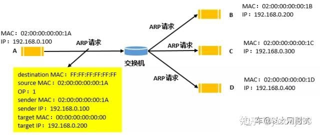
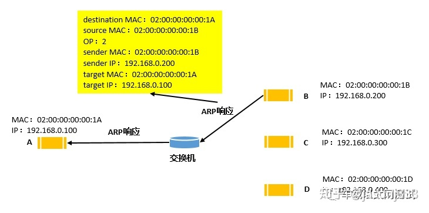

# ARP协议

ARP，Address Resolution Protocol，[地址解析协议](https://www.zhihu.com/search?q=地址解析协议&search_source=Entity&hybrid_search_source=Entity&hybrid_search_extra={"sourceType"%3A"answer"%2C"sourceId"%3A2470119821})，解析IP地址得到MAC地址，基于[数据链路层](https://www.zhihu.com/search?q=数据链路层&search_source=Entity&hybrid_search_source=Entity&hybrid_search_extra={"sourceType"%3A"answer"%2C"sourceId"%3A2470119821})之上的协议，可以看成和网络层同一层级，通常称为2.5层协议，ARP是网络层与数据链路层的重要枢纽，它解决了网络层（软件）到数据链路层（硬件）的映射

## 通信如何获取mac地址

### 同网段通信

主机A想要发送数据给主机B，我们知道发送网络报文是一个封装的过程，数据需要在应用层、传输层、网络层、数据链路层封装，网络层的目的IP是主机B的IP地址192.168.0.200，这个是已知的，数据链路层的目的MAC是主机B的MAC地址，这个主机A不知道，所以它首先会去自己的ARP缓存表内查找（**切记是根据IP找MAC**）

+ 如果之前A和B通信过，A存入过B的IP-MAC的映射关系，且这条目录还未老化删除，此时应该可以查找到，那么把B的MAC地址填充到链路层头部完成封装，发出去即可
+ 可是如果之前A和B并未通信过，A没有存入过B的IP-MAC，或者虽然存入过，但此时已经过了这条条目的老化时间，已经从ARP缓存表内删除了，那么A就无法从ARP缓存表内根据主机B的IP地址查到B的MAC地址，也就无法完成封装报文。

#### 处理方案

此时A会启动ARP协议层程序，让其自动发一条ARP请求报文，以广播的形式发给网段内的其他所有主机。其他主机收到此条ARP请求报文后，会判断是否发给自己，如果不是，则不回复，如果是，则回复一条ARP响应报文给主机A，A收到即知道B的MAC地址

1. 主机A首先在自己的ARP缓存表内查找是否有IP=192.168.0.200这个表项
2. 如果有，把这个表项里MAC地址填入报文[以太网](https://www.zhihu.com/search?q=以太网&search_source=Entity&hybrid_search_source=Entity&hybrid_search_extra={"sourceType"%3A"answer"%2C"sourceId"%3A2470119821})帧头部的目标MAC地址内，然后通过网卡发出去
3. 如果没有，则系统的ARP协议层程序会先发一个ARP广播请求报文出去，请求目标MAC地址

#### 请求报文



```
destination MAC=FF:FF:FF:FF:FF:FF
目标MAC地址字段，FF:FF:FF:FF:FF:FF表明这是一个广播MAC地址，可以让交换机以广播的形式发出去

source MAC=02:00:00:00:00:1A
源MAC地址字段，它是源主机的MAC地址

OP=1
表明它是一条ARP请求报文

target IP=192.168.0.200
目标主机的IP地址，它是为了到达主机后，目标主机ARP协议层程序判断是否发给自己的依据，它是必须要有的，因为目标MAC地址是广播地址，意味着所有主机在数据链路层都能接收，只有通过和它比较，让不是目标主机的其他主机不回复，让目标主机回复。

sender IP=192.168.0.100
sender MAC=02:00:00:00:00:1A
源主机的IP地址和MAC地址，这是让目标主机存入自己IP-MAC映射所使用的字段，也可以利用它们伪造ARP报文

target MAC=00:00:00:00:00:00
目标主机的MAC地址，ARP请求报文就是为了请求目标主机MAC地址，所以它是全0的
```

通过上面的ARP广播请求报文各字段的定义，得知:

- ARP请求报文在送达交换机时，交换机根据目标MAC地址是广播地址，在除了发送方端口外的其他所有端口，都复制一份ARP请求报文，发出去给所有主机
- 接收到ARP请求报文的主机首先在数据链路层比较destination MAC，由于是广播MAC地址，可以接收，然后比较target IP
- 目标主机比较target IP发现一致后，首先会把ARP请求报文的sender IP和sender MAC存入自己的ARP缓存表（windows系统是这样，其他系统有可能先存入）
- 然后目标主机的ARP协议程序会给源主机自动回一个ARP响应报文

#### 响应报文



```
destination MAC=02:00:00:00:00:1A
目标MAC地址字段，02:00:00:00:00:1A是主机A的MAC地址，说明这是以单播的形式发送出去的，为什么是单播？因为已经知道源主机的MAC地址了。

source MAC=02:00:00:00:00:1B
源MAC地址字段，它是源主机的MAC地址

OP=2
表明它是一条ARP响应报文

target IP=192.168.0.100

目标主机的IP地址，主机A收到ARP响应后并不会比较它

sender IP=192.168.0.200
sender MAC=02:00:00:00:00:1B
源主机的IP地址和MAC地址，目标主机收到后，把它们存入自己的ARP缓存表

target MAC=02:00:00:00:00:1A
目标主机的MAC地址“当源主机收到ARP响应报文后，会把senderIP和senderMAC存入自己的ARP缓存表中作为动态条目，不管targetIP是否是自己”
```

### 不同网段通信

假设主机A（135.24.25.23）第一次和不同网段的主机C（135.24.52.123）通信：

1. A封装好要发送的信息，在要写“收件地址”时，

2. A会用子网掩码进行计算先判断B和A自己在不在同一个网段，这时候A知道了B和自己不在一个网段，
   这时候，A知道该用网关把自己的数据传递给C，所以A会发送一个ARP包来获取网关的MAC地址，

3. 网关收到ARP包后，把自己的MAC地址封装在ARP包中，发送给A，

4. A封装报文，目标MAC地址写网关的MAC地址，

5. 网关收到报文，发现是给自己发的，就开始解包，解开之后，发现是给另一个网段的主机发送的，

6. 此时如果网管本身就是路由器就直接把数据报文发送给下一跳路由器，如果网关是普通的PC，就发送给路由器，由路由器发送给下一跳路由器，目标MAC写下一跳路由器的MAC地址，

7. 历经千辛万苦，报文终于到达C的主机的路由器，路由器发送报文到C所在网段的网关，

8. C网段的网关解包之后发现不是给自己，而是给自己网段内的C主机，就发送报给给C

### 总结

+ ARP协议是针对IPv4的寻址协议，IPv6有自己的寻址协议

+ ARP请求报文和ARP响应报文都是不能跨网段的

+ ARP请求报文以广播形式发送，ARP响应报文以单播形式发送

+ ARP请求报文和响应报文的接收方都会把senderIP和senderMAC存入自己的缓存表内，也就是说，请求报文和响应报文都可以让自己主机的ip和mac被对方记录，不同的是，请求报文还会让对方自动给我回一个ARP响应报文，而响应报文只会让对方存入自己的ip和mac，而不会有回复（不是完全准确，免费ARP响应是会有回复的）

+ 只有ARP请求报文和ARP响应报文具有缓存ip和mac的功能，其他协议的message虽然也带有源mac和ip，但是并不能让目标主机把源ip和mac存入ARP缓存表内（当然ARP请求和响应报文存入ip和mac还需要判断其他条件）

## arp命令

```shell
# Windows
arp -a [ip] # 如果后面带着ip地址，就查询ARP表中对应ip的mac地址，如果不带表示查询当前ARP表的所有数据
arp -d [ip] # 如果后面带着ip地址，就删除ARP表中对应ip的mac地址的数据，如果不带或者带*表示删除ARP表
arp -s ip MAC  # 添加主机并且将 Internet 地址 ip地址 与 MAC地址 相关联。物理地址是用连字符分隔的 6 个十六进制字节。该项是永久的。
```

