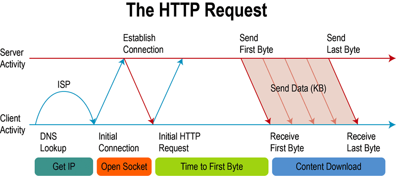
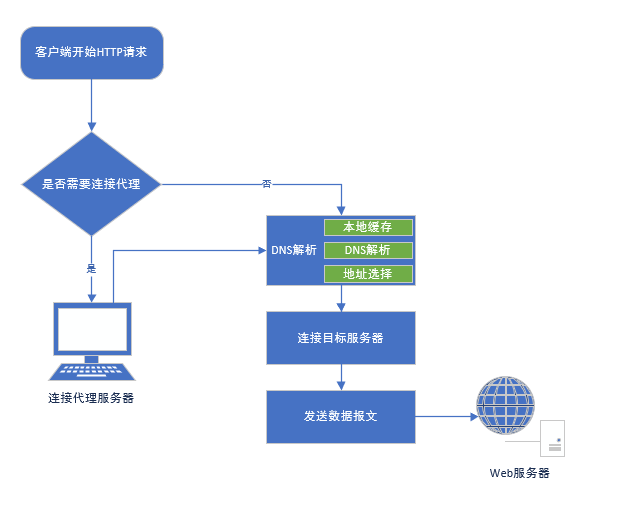
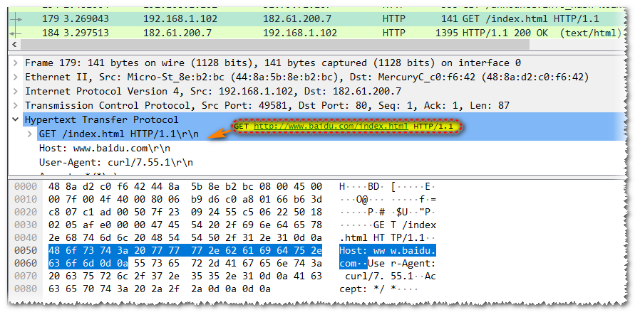
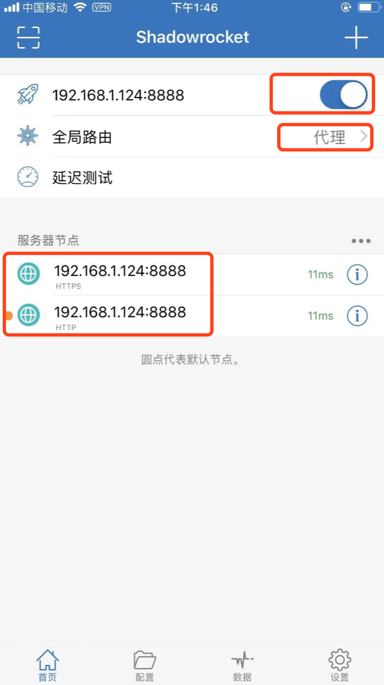

<!-- START doctoc generated TOC please keep comment here to allow auto update -->
<!-- DON'T EDIT THIS SECTION, INSTEAD RE-RUN doctoc TO UPDATE -->
**Table of Contents**  *generated with [DocToc](https://github.com/thlorenz/doctoc)*

- [抓包](#%E6%8A%93%E5%8C%85)
  - [客户端配置](#%E5%AE%A2%E6%88%B7%E7%AB%AF%E9%85%8D%E7%BD%AE)
    - [Android](#android)
      - [Charles](#charles)
      - [问题点总结](#%E9%97%AE%E9%A2%98%E7%82%B9%E6%80%BB%E7%BB%93)
    - [IOS](#ios)
      - [Charles](#charles-1)
      - [Stream（App）](#streamapp)
    - [Mac](#mac)
      - [Charles](#charles-2)
      - [问题点总结](#%E9%97%AE%E9%A2%98%E7%82%B9%E6%80%BB%E7%BB%93-1)
    - [Windows](#windows)
      - [Charles](#charles-3)
      - [问题点总结](#%E9%97%AE%E9%A2%98%E7%82%B9%E6%80%BB%E7%BB%93-2)
  - [其他场景](#%E5%85%B6%E4%BB%96%E5%9C%BA%E6%99%AF)
    - [抓VPN的包（比如开启翻墙和内网测试）](#%E6%8A%93vpn%E7%9A%84%E5%8C%85%E6%AF%94%E5%A6%82%E5%BC%80%E5%90%AF%E7%BF%BB%E5%A2%99%E5%92%8C%E5%86%85%E7%BD%91%E6%B5%8B%E8%AF%95)
      - [Charles配置](#charles%E9%85%8D%E7%BD%AE)
    - [部分应用不能抓包的另类方法](#%E9%83%A8%E5%88%86%E5%BA%94%E7%94%A8%E4%B8%8D%E8%83%BD%E6%8A%93%E5%8C%85%E7%9A%84%E5%8F%A6%E7%B1%BB%E6%96%B9%E6%B3%95)
      - [原因](#%E5%8E%9F%E5%9B%A0)
      - [例子](#%E4%BE%8B%E5%AD%90)
      - [解决方案](#%E8%A7%A3%E5%86%B3%E6%96%B9%E6%A1%88)
        - [Android配置](#android%E9%85%8D%E7%BD%AE)
        - [IOS配置](#ios%E9%85%8D%E7%BD%AE)
  - [抓包工具](#%E6%8A%93%E5%8C%85%E5%B7%A5%E5%85%B7)
    - [Flidder（支持全平台）](#flidder%E6%94%AF%E6%8C%81%E5%85%A8%E5%B9%B3%E5%8F%B0)
    - [Charles（支持全平台）](#charles%E6%94%AF%E6%8C%81%E5%85%A8%E5%B9%B3%E5%8F%B0)
    - [HttpCanary（小黄鸟，只支持安卓）](#httpcanary%E5%B0%8F%E9%BB%84%E9%B8%9F%E5%8F%AA%E6%94%AF%E6%8C%81%E5%AE%89%E5%8D%93)
    - [Stream（只支持IOS）](#stream%E5%8F%AA%E6%94%AF%E6%8C%81ios)
    - [whistle](#whistle)
    - [Wireshark](#wireshark)
    - [tcpdump](#tcpdump)

<!-- END doctoc generated TOC please keep comment here to allow auto update -->

# 抓包

## 抓包原理

Fiddler 或 Charles 这类使用的代理的抓包软件与Wireshark是完全不同的（Wireshark 使用的网卡数据复制，只要是经过指定网卡都会被抓取），其只能对使用代理的应用层网络协议生效，比如常见的HTTP（https），Websocket 。

这里以HTTP为例简单说明下：



客户端需要完成一次HTTP请求，通常需要先找到服务器，客户端会根据http请求中url的主机名（实际会使用host中的主角名）及其端口与目标主机建立tcp连接，建立连接后会将http报文发送给目标服务器 （更多细节参考[HTTP](HTTP.md)）

接下来我来看下HTTP代理是如何运作的，我们启动Fiddler 或 Charles就是启动了一个HTTP代理服务器，这类工具会通知操作系统，“现在我在系统上创建了一个HTTP代理，IP为XXXXXX端口为XX。如果您使用的是linux您可以手动通知操作系统(export http_proxy=ip:port export https_proxy=$http_proxy),如果您使用的是手机等移动设备您可以在当前wifi设置处告诉系统你要使用http代理。 现在我们已经告诉系统我们想要使用代理，这个时候运行在系统上的http客户端再去发送请求的时候，他就不会再去进行DNS解析，去连接目标服务器，而是直接连接系统告诉他代理所在的地址（代理的ip及端口，注意无论是http或https或其他支持代理的协议都会连接同一个端口）。然后代理服务器会与客户端建立连接，再然后代理服务器根据请求信息再去连接真正的服务器。



这里还有个细节正常在没有代理的情况下客户端向服务器发送的请求行里只包含部分URI（实际上是没有方案，主机名及端口的）



如上图如果在没有代理的情况下，对www.baidu.com/index.html的请求的请求行实际上是GET /index.html HTTP/1.1 其实并不是我们常见的完整uri。因为在原始的HTTP设计中没有考虑中间服务器（即代理）的情况，客户端在发送报文前已经知道服务器的地址并与之建立了连接，没有必要再发送方案，主机名及端口。不过代理出现后这种做法就会有问题了，客户端连接了代理服务器，而代理服务器却没有办法连接正确的服务器。因此客户端发送给代理的请求其实稍有不同，客户端会在请求行里使用完整的uri，这样代理服务器才能解析真实的服务器的地址。

现在我们的请求实际上都是通过代理服务器（Fiddler 或 Charles）发送出去的，所以代理抓包软件不仅知道http请求及响应的所有报文，甚至还可以随时修改请求及响应。

## 客户端配置

### Android

#### Charles

1. 安装Charles软件
2. 如果只想抓取手机端的包，在Charles中去掉勾选Proxy -> Windows Proxy（Mac是macOS Proxy），默认都是开启的。
3. 选择Proxy -> Proxy Settings，HTTP Proxy下面两个都勾选。查看当前监听的端口号。
4. 选择Proxy -> SSL Proxy Setting，添加Location，在Host输入自己要抓包的域名；如果想看所有抓包情况，Host中输入\*，Port中输入\*；或者只过滤https的，可以在Host中输入\*，Port中输入443
5. 最后手机设置代理，长按当前Wifi名；高级选项 -> 代理 ->  手动 ，然后输入ip和监听的端口号。然后在手机浏览器中输入 http://chls.pro/ssl 去下载安装证书。

#### 问题点总结

+ 安卓7.0以上部分模拟器无法代理抓包的问题（在高级选项中的代理设置无效 ，比如雷电4.0）

  + 方案一：安装ProxyDroid app，然后打开app去配置全局代理

  + 方案二：使用adb 命令设置全局代理

    ```
    adb shell settings get global http_proxy   //获取当前手机的代理信息
    adb shell settings put global http_proxy 172.20.10.4:8888   //设置当前手机的代理为172.20.10.4:8888
    adb shell settings delete global http_proxy   //删除当前手机的所有代理信息
    ```

+ 关于https证书的安装（7.0以上默认不信任用户的证书，必须要把代理证书移动到系统目录下）

  - 方案一（需要root）：

    1. 先安装证书

       ```
       Charles：
       在手机浏览器中输入http://chls.pro/ssl，然后下载证书，直接在手机上面安装。
       
       小黄鸟（HttpCanary App）：
       打开App，然后设置 -> SSL证书设置 -> 安装HttpCanary根证书
       ```

    2. 进入/data/misc/user/0/cacerts-added目录，这就是用户证书的目录，然后找到你刚才安装的证书（可能有多个.0后缀的证书，可以根据时间来找，或者全部删除重新安装一次），然后将其移动到/system/etc/security/cacerts/目录下。

       ```
       //出现 Read-only file system的问题解决:
       adb root
       adb remount rw /system   //重新挂载让系统目录有读写权限
       ```

  - 方案二（需要root）

    1. 从抓包软件中导出证书

       ```
       Charles：
       Help -> SSL Proxying -> Save Charles Root Certificate 导出pem文件到电脑上
       
       小黄鸟（HttpCanary App）：
       打开App，然后设置 -> SSL证书设置 -> 安装HttpCanary根证书，类型System Trusted (.0) 导出位置在/sdcard/HttpCanary/cert文件夹下面
       ```

    2. 使用[OpenSSL](https://so.csdn.net/so/search?q=OpenSSL&spm=1001.2101.3001.7020)工具来修改证书文件名（Mac/Linux自带这个工具，Windows需要下载）

       ```
       //根据导出的证书类型来执行
       
       1、cer证书转pem
       openssl x509 -inform der -in FiddlerRoot.cer -out file.pem
       
       2、获取pem证书hash（执行完会生成一个hash值）
       openssl x509 -subject_hash_old -in file.pem
       
       3、将file.pem重新命名为hash.0文件
       ```

    3. 将hash.0文件导入到/system/etc/security/cacerts/目录下。

  - 方案三（不要root）

    待完善

    1. 在手机中开启一个虚拟机，可以开启root和使用Xposed插件（如VMOS PRO，[VirtualXposed](https://github.com/android-hacker/VirtualXposed)，[太极](https://github.com/android-hacker/exposed)）
    2. xp插件关闭SSL验证：[JustTrustMe](https://github.com/Fuzion24/JustTrustMe)、JustMePlush、 [TrustMeAlready](https://github.com/ViRb3/TrustMeAlready)

+ Android Studio自带模拟器开启代理抓包

  ```shell
  # 使用如下命令启动模拟器
  # -writable-system 参数表示让系统可以写入，不然挂载不了
  # -http-proxy 参数表示设置当前模拟器的代理
  emulator -avd 模拟器名字 -writable-system -http-proxy http://127.0.0.1:8888 
  ```

+ 安卓7.0以上添加配置文件抓取https（针对自己开发调试的app，当然也可以反编译别人的app加入以下配置）

  1. 在res/xml中新建文件 network_security_config.xml

     ```xml
     <?xml version="1.0" encoding="utf-8"?>
     <network-security-config>
         <!-- 支持 Android 9.0 以上使用部分域名时使用 http -->
         <domain-config cleartextTrafficPermitted="true">
             <domain includeSubdomains="true">sample.domain</domain>
         </domain-config>
         <!-- 支持 Android 7.0 以上调试时，信任 Charles 和 Fiddler 等用户信任的证书 -->
         <base-config cleartextTrafficPermitted="true">
             <trust-anchors>
                 <certificates src="system" />
                 <certificates src="user" />
             </trust-anchors>
         </base-config>
     </network-security-config>
     ```

  2. 在AndroidManifest.xml中的application里面添加如下配置

     ```xml
     android:networkSecurityConfig="@xml/network_security_config"
     ```

### IOS

#### Charles

1. 安装Charles软件
2. 如果只想抓取手机端的包，在Charles中去掉勾选Proxy -> Windows Proxy（Mac是macOS Proxy），默认都是开启的。IOS模拟器如果关闭了这个选项，需要手动去设置代理，不然证书下载不了（见Mac手动设置代理）。
3. 选择Proxy -> Proxy Settings，HTTP Proxy下面两个都勾选。查看当前监听的端口号。
4. 选择Proxy -> SSL Proxy Setting，添加Location，在Host输入自己要抓包的域名；如果想看所有抓包情况，Host中输入\*，Port中输入\*；或者只过滤https的，可以在Host中输入\*，Port中输入443
5. 
   + IOS 模拟器
     + 注意点：Help -> SSL Proxying -> Install Charles Root Certificate in IOS Simulators 这个选项没效果，依然抓不到https的包
     + 直接在浏览器中输入 http://chls.pro/ssl 去下载安装证书。然后在Settings -> General -> About -> Profile 里面去安装证书
     + 最后在Settings -> General -> About -> Certificate Trust Settings中勾选证书。
   + IOS 真机
     + 手机设置代理，点击连接网络的详细信息；配置代理 ->  手动 ，然后输入ip和监听的端口号。然后在手机浏览器中输入 http://chls.pro/ssl 去下载安装证书。
     + 然后在设置-> 通用-> 关于-> 描述文件  里面去安装证书
     + 需要到iPhone设置 -> 关于本机 -> 证书信任设置中启用根证书 

#### Stream（App）

1. 打开Stream App，选择HTTPS抓包，然后点击安装CA证书
2. 弹出添加VPN配置，选择允许，输入密码，在设置 -> 通用 -> VPN与设备管理 -> VPN -> 选择Stream，状态选择连接
3. 再次打开Stream App，选择HTTPS抓包，点击安装CA证书，需要去下一个配置描述文件
4. 在设置 -> 通用 -> VPN与设备管理 中多个一个已下载的描述文件，点进去安装。
5. 最后在设置 -> 通用 -> 关于本机 -> 证书信任设置 把Stream开头的选项打开。然后就可以抓到https的包了。

### Mac

#### Charles

1. 配置Charles证书；选择Help -> SSL Proxying -> install Charles Root Certificate
2. 会自动导入 Charles Proxy CA 证书并打开 Keychain Access，双击新导入的证书弹出证书信息页面，将 Secure Sockets Layer(SSL) 设置为 Always Trust，关闭页面后弹出密码提示，输入密码更新系统信任设置。
3. 然后在Charles中勾选Proxy -> macOS Proxy（这个默认打开了）
4. 最后选择Proxy -> SSL Proxy Setting，添加Location，在Host输入自己要抓包的域名；如果想看所有抓包情况，Host中输入\*，Port中输入\*；或者只过滤https的，可以在Host中输入\*，Port中输入443

#### 问题点总结

+ 如果浏览器还是不能抓https的包，试试下面的方案
  1. 直接在浏览器访问chls.pro/ssl ，去下载证书，
  2. 导入浏览器证书，这里以Chrome浏览器为例，打开设置—高级—管理证书，然后导入
  3. 和工具端一样，将证书存储到“受信任的根证书颁发机构”下，后面直接下一步即可
+ 如果不能抓Chrome的包，可以下载安装Chrome插件[switch sharp](https://www.crx4chrome.com/crx/543/)，手动设置代理
+ 手动设置代理，系统设置 -> 网络 -> 代理 -> Web Proxy和Secure Proxy都设置代理

### Windows

#### Charles

1. 配置Charles证书；选择Help -> SSL Proxying -> install Charles Root Certificate
2. 会出现证书安装的信息，选择安装证书
3. 证书导入，选择本地计算机
4. 将证书安装在“受信任的根证书颁发机构”
5. 然后在Charles中勾选Proxy -> Windows Proxy（这个默认打开了）
6. 最后选择Proxy -> SSL Proxy Setting，添加Location，在Host输入自己要抓包的域名；如果想看所有抓包情况，Host中输入\*，Port中输入\*；或者只过滤https的，可以在Host中输入\*，Port中输入443

#### 问题点总结

+ 如果浏览器还是不能抓https的包，试试下面的方案
  1. 直接在浏览器访问chls.pro/ssl ，去下载证书，
  2. 导入浏览器证书，这里以Chrome浏览器为例，打开设置—高级—管理证书，然后导入
  3. 和工具端一样，将证书存储到“受信任的根证书颁发机构”下，后面直接下一步即可
+ 如果不能抓Chrome的包，可以下载安装Chrome插件[switch sharp](https://www.crx4chrome.com/crx/543/)，手动设置代理
+ 手动设置代理，设置 -> 网络和Internet -> 使用代理服务器

## 其他场景

### 抓VPN的包（比如开启翻墙和内网测试）

抓包软件开启双重代理，抓包软件的数据都走VPN的端口。

#### Charles配置

1. Proxy -> External Proxy Settings 
2. 选中Use external proxy servers
3. 如果是http就选中web proxy(http)，如果是https就选中secure web proxy(https) 
4. 在弹窗右侧填入顶层的代理，比如公司的xxxx:xxxx代理ip和端口，比如使用翻墙软件Clash默认就是127.0.0.1:7890
5. 点击ok 
6. 手机挂上电脑的ip和8888端口。也就是抓包工具的代理。然后就可以愉快的抓包测试了

### 部分应用不能抓包的另类方法

#### 原因

+ 一般情况下我们已经在系统层面上设置了代理，通常http客户端都是按要求去实现的，在进行http请求前会先检查系统代理，如果有设置代理，客户端会直接使用完整uri去连接代理服务器
+ 不同的平台通常会实现自己的的http客户端的，虽然他们都按照协议要求实现了代理功能，但是并不一定在默认情况下会直接使用系统代理。

#### 例子

+ 默认Flutter不会主动使用系统代理，需要单独设置。

+ Android的Okhttp可以配置不走代理

  ```java
  // proxy(Proxy.NO_PROXY) 表示不走系统代理
  OkHttpClient okHttpClient = new OkHttpClient().newBuilder().proxy(Proxy.NO_PROXY).build(); 
  ```

+ Android端可以检测到代理

  ```java
  //方案一：检测是否使用了代理
  private static boolean isWifiProxy() {
      final boolean IS_ICS_OR_LATER = Build.VERSION.SDK_INT >= Build.VERSION_CODES.ICE_CREAM_SANDWICH;
      String proxyAddress;
      int proxyPort;
      if (IS_ICS_OR_LATER) {
          proxyAddress = System.getProperty("http.proxyHost");
          String portStr = System.getProperty("http.proxyPort");
          proxyPort = Integer.parseInt((portStr != null ? portStr : "-1"));
      } else {
          proxyAddress = android.net.Proxy.getHost(mContext);
          proxyPort = android.net.Proxy.getPort(mContext);
      }
      return (!TextUtils.isEmpty(proxyAddress)) && (proxyPort != -1);
  }
  
  //方案二：设置代理
  /**
  System.setProperty(“key”,"value");
  这个方法能够设置代理ip/端口，
  对应的参数为:
  key:http.proxyHost--这里对应的是ip，System.setProperty("http.proxyHost","ip")；
  key:http.proxyPort--这里对应的是端口，同上；
  这里介绍只针对http请求，
  但是打点发现这里也可以设置https的,但是目前没有亲测,不知道能不能行，
  好吧 继续说关于抓数据的事情 你这里可以本机的ip 和端口号，但是你要是不想别      人抓你服务器的数据怎么办？
  你可以把你的http.proxyHost的value设置成自己服务器的ip 比如项目开发过程中服务端童鞋给你的接口：
  http://test.xx.xx.xx/test/list? 你可以把这个url的的test.xx.xx.xx给截取出来，
  当http.proxyHost的value 这样别人在wifi哪里设置的参数就会被这个方法设置的参数所覆盖了，
  在wifi哪里设置代理也就没用了，这个方法记得放在请求发送之前，
  要是你自己在开发过程中需要抓数据，你只需要开个入口动态设置下这个参数就
  **/
  ```

#### 解决方案

使用VPN将终端设备的流量转发到代理服务器（默认会转发所有流量）

##### Android配置

1. 安装[drony](https://files.cnblogs.com/files/lulianqi/Drony_102.apk) ，drony会在你的手机上创建一个VPN，将手机上的所有流量都重定向到drony自身（不是流向vpn服务器） ，这样drony就可以管理所有手机上的网络流量，甚至可以对手机上不同APP的流量进行单独配置。
2. 开启代理抓包软件
3. 配置drony转发，打开Drony（处于OFF状态），滑动到SETING页，点击选择Networks Wi-Fi 进入配置
4. 在网络列表中选择点击当前手机wifi连接的网络 （需要确保该网络与Fiddler代理服务器网络是联通的）
5. 配置要为当前网络使用的代理入口（这里直接填写fiddler代理地址就可以），选择代理模式为手动（Manual）
6. Filter default value 选择 Direct all ，然后点击下面的Rule设置应用规则
7. 默认您的规则里应该是空的，这里直接点击上面的加号添加一个规则（符合规则要求的才会被转发）
8. 在Network id处 选择当前wifi的SSID
   Action 选择 Local proxy chain
   Application 选择需要强制代理的APP
   Hostname 及 Port 不填 表示所有的都会被强制代理，因为APP可能会使用其他的网络协议不一定都是http，可能不希望把所有流量都引流到http代理服务器，这个时候就会使用这个配置指定ip及端口才转发
   完成后保存即可，然后返回到SETTING主页，滑动到LOG页，点击下面按钮，使其处于ON的状态（表示启用）

##### IOS配置

为了完成流量重新定向，Shadowrocket与drony一样会先在设备上创建本地VPN服务，再使用您设置的规则处理流量。不过Shadowrocket的使用会更加方便，直接打开软件如下图配置即可

1. 选择全局路由为「代理」
2. 添加服务节点（类型选择HTTP及HTTPS ，服务器地址及端口为您代理抓包工具的地址与端口）
3. 设置状态为启用 （IOS会同时自动创建VPN）



## 抓包工具

### Flidder（支持全平台）

+ [使用教程](https://www.oschina.net/p/fiddler?hmsr=aladdin1e1)
+ [修改请求和回复数据](https://www.cnblogs.com/kristin/p/8445055.html)
+ [Fiddler抓包和修改WebSocket数据，支持wss](https://blog.csdn.net/weixin_30947043/article/details/97329308)

### Charles（支持全平台）

+ 注册码

  注册用户名: https://zhile.io
  注册码    : 48891cf209c6d32bf4

#### 过滤网络请求

使用方法一做一些临时性的封包过滤，使用方法二做一些经常性的封包过滤。方法三可以临时性的，快速地过滤出一些没有通过关键字的一类网络请求。

+ 方法一：

  在主界面的中部的 Filter 栏中填入需要过滤出来的关键字。例如我们的服务器的地址是：[http://ceshi.com](https://links.jianshu.com/go?to=http%3A%2F%2Fyuantiku.com%2F), 那么只需要在 Filter 栏中填入 ceshi 即可。

+ 方法二：

  在想过滤的网络请求上右击，选择 “Focus”，之后在 Filter 一栏勾选上 Focussed 一项。

+ 方法三：

  在 Charles 的菜单栏选择 Proxy -> Recording Settings，然后选择 Include 栏，选择添加一个项目，然后填入需要监控的协议，主机地址，端口号。这样就可以只截取目标网站的封包了

#### 修改请求和响应

+ 通过compose修改请求报文，这种方式类似postman的模拟请求（只能修改请求）

  选中charles拦截的请求，右键–>compose，右边界面就可以对数据和header进行修改了，修改完成然后点击下面的Execute按钮。

+ 通过本地映射（map local）修改响应值（只能修改响应）

  1. 选中charles拦截的请求，右键选择 save response，可以保存为.json格式
  2. 打开刚刚保存的文件，修改里面的数据
  3. 再次右键这个请求，选择 map local，打开配置窗口
  4. 选择响应的文件，就是刚刚save response保存的文件

+ 通过rewrite 修改请求以及响应报文（功能强大）

  1. 菜单栏选择Tools -> Rewrite
  2. 启用Rewrite，左边选择Add，给配置起个名字
  3. 上面的Add添加规则，配置具体规则，配置请求路径
  4. 下面的Add添加rewrite规则（可以修改其他类型比如响应状态码等数据），一个url规则可以对应多个rewrite规则，可以选择Request或者Reponse，在Replace中的Value输入具体的请求值或者响应值

+ 通过断点修改请求与响应（可以修改请求和响应，但是客户端会超时）

  1. 选中charles拦截的请求，右键选择 breakpoints
  2. 可以选择编辑请求和编辑响应
  3. 修改完成然后点击下面的Execute按钮

#### 请求重定向

+ 网络请求重定向到本地文件（Map Local）

  上面介绍过

+ 网络请求重定向到另一个网址请求地址（Map Remote）

  1. 选中请求，右键选择Map Remote，这时候源地址已经填好了
  2. 然后填写目的地址，对于不需要限制的条件，可以留空。

### HttpCanary（小黄鸟，只支持安卓）

### Stream（只支持IOS）

### whistle

whistle 是一款用 Node 实现的跨平台的 Web 调试代理工具

+ [github地址](https://github.com/avwo/whistle)
+ [官方文档](http://wproxy.org/whistle/)

```
//1、安装
npm install -g whistle

//2、启动和停止
w2 start/w2 stop

//3、打开
使用浏览器打开http://127.0.0.1:8899/界面
```

### Wireshark

+ [Https详解+wireshark抓包演示](https://www.jianshu.com/p/a3a25c6627ee)
+ [Wireshark解密HTTPS流量的两种方法，最新版ssl改成tls](https://www.cnblogs.com/yurang/p/11505741.html)
+ [wireshark 实用过滤表达式（针对ip、协议、端口、长度和内容）](https://www.cnblogs.com/softidea/p/10446388.html)

+ https://apkpure.com/cn/packet-capture/app.greyshirts.sslcapture)

### tcpdump

tcpdump是Linux系统中普遍使用的一款开源网络协议分析工具

+ [安卓的tcpdump下载地址](https://www.androidtcpdump.com/android-tcpdump/downloads)

```
//linux
-a 　　　将网络地址和广播地址转变成名字；
-d 　　　将匹配信息包的代码以人们能够理解的汇编格式给出；
-dd 　　　将匹配信息包的代码以c语言程序段的格式给出；
-ddd 　　　将匹配信息包的代码以十进制的形式给出；
-e 　　　在输出行打印出数据链路层的头部信息，包括源mac和目的mac，以及网络层的协议；
-f 　　　将外部的Internet地址以数字的形式打印出来；
-l 　　　使标准输出变为缓冲行形式；
-n 　　　指定将每个监听到数据包中的域名转换成IP地址后显示，不把网络地址转换成名字；
-nn：    指定将每个监听到的数据包中的域名转换成IP、端口从应用名称转换成端口号后显示
-t 　　　在输出的每一行不打印时间戳；
-v 　　　输出一个稍微详细的信息，例如在ip包中可以包括ttl和服务类型的信息；
-vv 　　　输出详细的报文信息；
-c 　　　在收到指定的包的数目后，tcpdump就会停止；
-F 　　　从指定的文件中读取表达式,忽略其它的表达式；
-i 　　　指定监听的网络接口；
-p    将网卡设置为非混杂模式，不能与host或broadcast一起使用
-r 　　　从指定的文件中读取包(这些包一般通过-w选项产生)；
-w 　　　直接将包写入文件中，并不分析和打印出来；
-s snaplen         snaplen表示从一个包中截取的字节数。0表示包不截断，抓完整的数据包。默认的话 tcpdump 只显示部分数据包,默认68字节。
-T 　　　将监听到的包直接解释为指定的类型的报文，常见的类型有rpc （远程过程调用）和snmp（简单网络管理协议；）
-X            告诉tcpdump命令，需要把协议头和包内容都原原本本的显示出来（tcpdump会以16进制和ASCII的形式显示），这在进行协议分析时是绝对的利器

//android（必须root）
1、push到手机的/data/local/tmp
2、chmod 6755 /data/local/tcpdump
3、/data/local/tcpdump -p -vv -s 0 -w /sdcard/capture.pcap  //生成分析文件
4、使用wireshark打开分析
```

