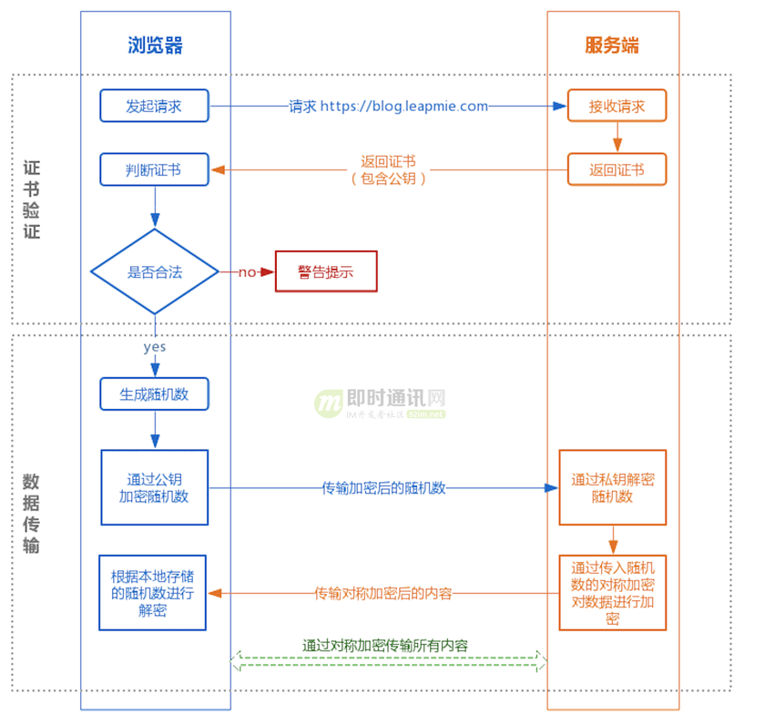
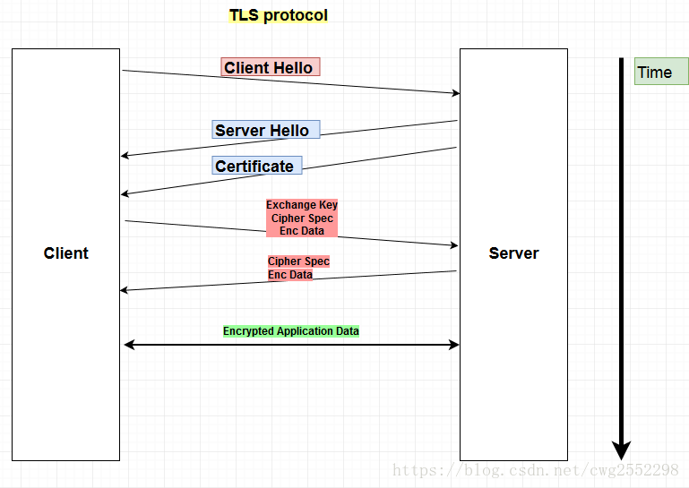
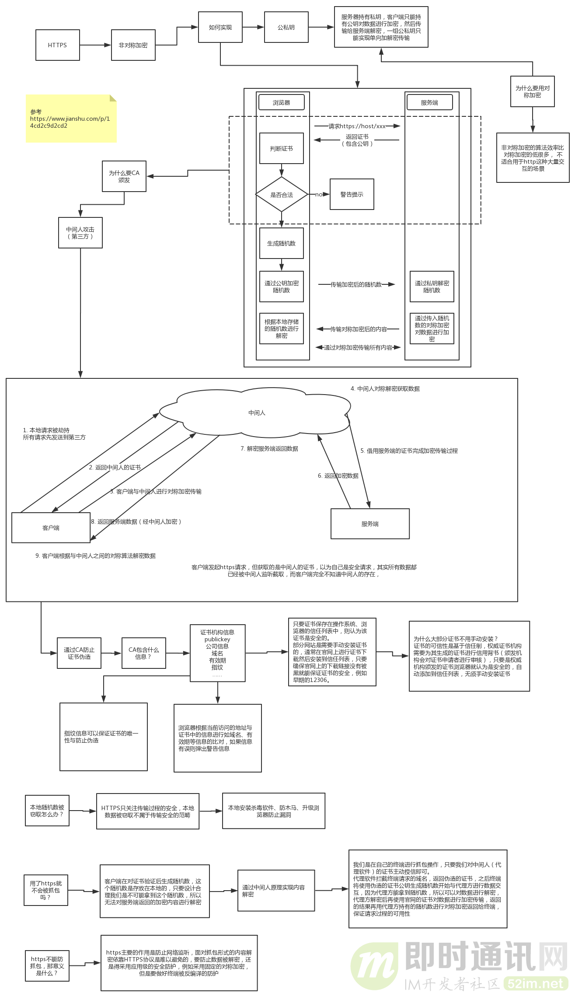
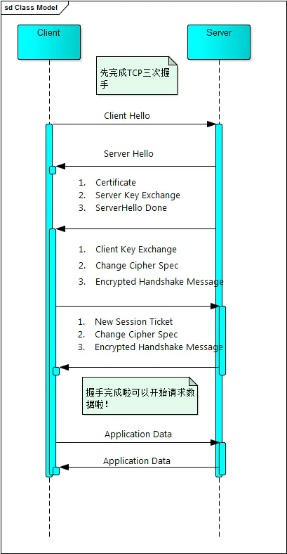

# HTTPS

## 概念

+ HTTPS 协议（HyperText Transfer Protocol over Secure Socket Layer）：可以理解为HTTP+SSL/TLS， 即 HTTP 下加入 SSL 层，HTTPS 的安全基础是 SSL，因此加密的详细内容就需要 SSL。TLS为SSL升级版，目前大部分用的是TLS1.2，用于安全的 HTTP 数据传输。
+ HTTPS的默认端口号是443（HTTP是80）
+ SSL/TLS也可以用在其他协议上，比如FTP->FTPS，SMTP->SMTPS

## OpenSSL

OpenSSL是SSL/TLS协议的开源实现，始于1998年，支持Windows、Mac、Linux等平台

+ Linux、Mac一般自带OpenSSL ,Windows下载安装[OpenSSL](https://slproweb.com/products/Win32OpenSSL.html)

+ 相关命令

  ```
  //生成私钥：
  openssl genrsa -out mj.key 
  
  //生成公钥
  openssl rsa -in mj.key -pubout -out mj.pem
  ```

+ 可以使用OpenSSL构建一套属于自己的CA，自己给自己颁发证书，称为“自签名证书”

## 通信过程

+ [Https详解+wireshark抓包演示](https://www.jianshu.com/p/a3a25c6627ee)









### 1、Client Hello

在TCP完成三次握手之后，开始执行TLS协议。客户端（通常是浏览器）先向服务器发出加密通信的请求

+ 支持的协议版本，比如TLS 1.0版。
+ 一个客户端生成的随机数 random1，稍后用于生成"对话密钥“
+ 支持的加密方法，比如RSA公钥加密。
+ 支持的压缩方法。

### 2、Server Hello

+ 确认使用的加密通信协议版本，比如TLS 1.0版本。如果浏览器与服务器支持的版本不一致，服务器关闭加密通信。
+ 一个服务器生成的随机数random2，稍后用于生成"对话密钥"。
+ 确认使用的加密方法，比如RSA公钥加密。

### 3、Server => Client

服务端向客户端发送Certificate、Server Key Exchange、ServerHello Done，这是个优化过程

#### Certificate

这里主要就是把证书发送给Client。图中可以看到我的证书和证书发放机构。客户端拿到证书后就可以进行验证，同时获取到公钥，用于后面Random3的加密。证书一般采用X.509标准。

#### Server Key Exchange

这个消息是用来发送密钥交换算法相关参数和数据的。这里要提前提一下，就是根据密钥交换算法的不同，传递的参数也是不同的。
 常用的密钥交换算法：RSA、DH（Diffie-Hellman）、ECDH（Ellipticcurve Diffie–Hellman）

#### ServerHello Done

这个就是Server来表示自己说完了。类似电影里别人拿对讲机说完话最后会有一个“完毕！”。

### 4、Client => Server

客户端收到证书之后会首先会进行验证

+ 验证过程

  ```
  1.我们知道CA机构在签发证书的时候，都会使用自己的私钥对证书进行签名
  证书里的签名算法字段 sha256RSA 表示，CA机构使用sha256对证书进行摘要，然后使用RSA算法对摘要进行私钥签名，而我们也知道RSA算法中，使用私钥签名之后，只有公钥才能进行验签。
  
  2.如果我们使用的是购买的证书，那么很有可能，颁发这个证书的CA机构的公钥已经预置在操作系统中。这样浏览器就可以使用CA机构的公钥对服务器的证书进行验签。确定这个证书是不是由正规的CA机构颁发的。验签之后得到CA机构使用sha256得到的证书摘要，然后客户端再使用sha256对证书内容进行一次摘要，如果得到的值和验签之后得到的摘要值相同，则表示证书没有被修改过。
  
  3.如果验证通过，就会显示上面的安全字样，如果服务器购买的证书是更高级的EV类型，就会显示出购买证书的时候提供的企业名称。如果没有验证通过，就会显示不安全的提示。
  ```

+ 生成随机数

  ```
  验证通过之后，客户端会生成一个随机数pre-master secret，然后使用证书中的公钥进行加密，然后传递给服务器端
  ```

客户端验证证书没问题，然后客户端向服务端发送Client Key Exchange、Change Cipher Spec、Encrypted Handshake Message，这是个优化过程

#### Client Key Exchange

这里客户端会再生成一个随机数Random3。然后使用服务端传来的公钥进行加密得到密文PreMaster Key。服务端收到这个值后，使用私钥进行解密，得到Random3。这样客户端和服务端就都拥有了Random1、Random2和Random3。这样两边的秘钥就协商好了。后面数据传输就可以用协商好的秘钥进行加密和解密。

#### Change Cipher Spec

编码改变通知。这一步是客户端通知服务端后面再发送的消息都会使用前面协商出来的秘钥加密了，是一条事件消息。

#### Encrypted Handshake Message

这一步对应的是 Client Finish 消息，客户端将前面的握手消息生成摘要再用协商好的秘钥加密，这是客户端发出的第一条加密消息。服务端接收后会用秘钥解密，能解出来说明前面协商出来的秘钥是一致的。

### 5、Server => Client

包含三部分

- New Session Ticket
- Change Cipher Spec
- Encrypted Handshake Message

#### New Session Ticket

包含了一个加密通信所需要的信息，这些数据采用一个只有服务器知道的密钥进行加密。目标是消除服务器需要维护每个客户端的会话状态缓存的要求。这部分内容在后面的扩展部分会讲到

#### Change Cipher Spec

编码改变通知。这一步是服务端通知客户端后面再发送的消息都会使用加密，也是一条事件消息。

#### Encrypted Handshake Message

这一步对应的是 Server Finish 消息，服务端也会将握手过程的消息生成摘要再用秘钥加密，这是服务端发出的第一条加密消息。客户端接收后会用秘钥解密，能解出来说明协商的秘钥是一致的。

到这里双方SSL/TLS握手完成。