<!-- START doctoc generated TOC please keep comment here to allow auto update -->
<!-- DON'T EDIT THIS SECTION, INSTEAD RE-RUN doctoc TO UPDATE -->
**Table of Contents**  *generated with [DocToc](https://github.com/thlorenz/doctoc)*

- [HTTP](#http)
  - [简介](#%E7%AE%80%E4%BB%8B)
  - [主要特点](#%E4%B8%BB%E8%A6%81%E7%89%B9%E7%82%B9)
  - [URL介绍](#url%E4%BB%8B%E7%BB%8D)
  - [报文](#%E6%8A%A5%E6%96%87)
    - [请求报文和响应报文的结构](#%E8%AF%B7%E6%B1%82%E6%8A%A5%E6%96%87%E5%92%8C%E5%93%8D%E5%BA%94%E6%8A%A5%E6%96%87%E7%9A%84%E7%BB%93%E6%9E%84)
  - [一次HTTP请求的解析](#%E4%B8%80%E6%AC%A1http%E8%AF%B7%E6%B1%82%E7%9A%84%E8%A7%A3%E6%9E%90)
    - [参考文章](#%E5%8F%82%E8%80%83%E6%96%87%E7%AB%A0)
  - [代理服务器](#%E4%BB%A3%E7%90%86%E6%9C%8D%E5%8A%A1%E5%99%A8)
    - [正向代理、反向代理](#%E6%AD%A3%E5%90%91%E4%BB%A3%E7%90%86%E5%8F%8D%E5%90%91%E4%BB%A3%E7%90%86)
      - [正向代理作用](#%E6%AD%A3%E5%90%91%E4%BB%A3%E7%90%86%E4%BD%9C%E7%94%A8)
      - [反向代理作用](#%E5%8F%8D%E5%90%91%E4%BB%A3%E7%90%86%E4%BD%9C%E7%94%A8)
    - [相关头部字段](#%E7%9B%B8%E5%85%B3%E5%A4%B4%E9%83%A8%E5%AD%97%E6%AE%B5)
  - [CDN](#cdn)
    - [使用CDN前后](#%E4%BD%BF%E7%94%A8cdn%E5%89%8D%E5%90%8E)
    - [使用CDN前](#%E4%BD%BF%E7%94%A8cdn%E5%89%8D)
    - [使用CDN后](#%E4%BD%BF%E7%94%A8cdn%E5%90%8E)
  - [缓存（Cache）](#%E7%BC%93%E5%AD%98cache)
    - [响应头](#%E5%93%8D%E5%BA%94%E5%A4%B4)
    - [请求头](#%E8%AF%B7%E6%B1%82%E5%A4%B4)
    - [Last-Modified和ETag](#last-modified%E5%92%8Cetag)
    - [流程图](#%E6%B5%81%E7%A8%8B%E5%9B%BE)
- [HTTPS](#https)
  - [概念](#%E6%A6%82%E5%BF%B5)
  - [OpenSSL](#openssl)
  - [通信过程](#%E9%80%9A%E4%BF%A1%E8%BF%87%E7%A8%8B)
    - [1、Client Hello](#1client-hello)
    - [2、Server Hello](#2server-hello)
    - [3、Server => Client](#3server--client)
      - [Certificate](#certificate)
      - [Server Key Exchange](#server-key-exchange)
      - [ServerHello Done](#serverhello-done)
    - [4、Client => Server](#4client--server)
      - [Client Key Exchange](#client-key-exchange)
      - [Change Cipher Spec](#change-cipher-spec)
      - [Encrypted Handshake Message](#encrypted-handshake-message)
    - [5、Server => Client](#5server--client)
      - [New Session Ticket](#new-session-ticket)
      - [Change Cipher Spec](#change-cipher-spec-1)
      - [Encrypted Handshake Message](#encrypted-handshake-message-1)

<!-- END doctoc generated TOC please keep comment here to allow auto update -->

# [HTTP](https://segmentfault.com/a/1190000015969377)
## 简介
HTTP是一个属于应用层的面向对象的协议，由于其简捷、快速的方式，适用于分布式超媒体信息系统。它于1990年提出，经过几年的使用与发展，得到不断地完善和扩展。在Internet中所有的传输都是通过TCP/IP进行的。HTTP协议作为TCP/IP模型中应用层的协议也不例外。HTTP协议通常承载于TCP协议之上，有时也承载于TLS或SSL协议层之上，这个时候，就成了我们常说的HTTPS。如下图所示：

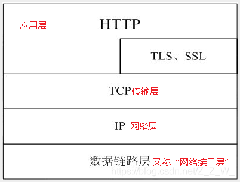

## 主要特点
- 支持C/S（客户/服务器）模式。
- 简单快速：客户向服务器请求服务时，只需传送请求方法和路径。
请求方法常用的有GET、HEAD、POST，每种方法规定了客户与服务器联系的类型不同。
由于HTTP协议简单，使得HTTP服务器的程序规模小，因而通信速度很快。
- 灵活：HTTP允许传输任意类型的数据对象。正在传输的类型由Content-Type加以标记。
- 无连接：无连接的含义是限制每次连接只处理一个请求。
服务器处理完客户的请求，并收到客户的应答后，即断开连接。
采用这种方式可以节省传输时间。
- 无状态：HTTP协议是无状态协议，无状态是指协议对于事务处理没有记忆能力。
缺少状态意味着如果后续处理需要前面的信息，则它必须重传，这样可能导致每次连接传送的数据量增大。另一方面，在服务器不需要先前信息时它的应答就较快。

## URL介绍
在说HTTP协议之前必须要先了解URL（统一资源定位符）统一资源定位符是对可以从互联网上得到的资源的位置和访问方法的一种简洁的表示，是互联网上标准资源的地址。互联网上的每个文件都有一个唯一的URL，它包含的信息指出文件的位置以及浏览器应该怎么处理它。

基本URL包含模式（或称协议）、服务器名称（或IP地址）、路径和文件名，如“协议://授权/路径?查询”。完整的、带有授权部分的普通统一资源标志符语法看上去如下：协议://用户名:密码@子域名.域名.顶级域名:端口号/目录/文件名.文件后缀?参数=值#标志

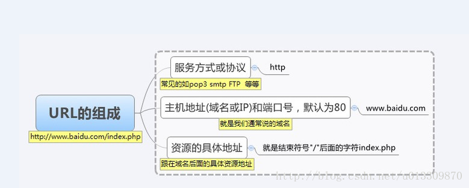
第一部分

模式/协议（scheme）：它告诉浏览器如何处理将要打开的文件。最常用的模式是超文本传输协议（Hypertext Transfer Protocol，缩写为HTTP），这个协议可以用来访问网络。其他协议如下：

http——超文本传输协议资源

https——用安全套接字层传送的超文本传输协议

ftp——文件传输协议

mailto——电子邮件地址

ldap——轻型目录访问协议搜索

file——当地电脑或网上分享的文件

news——Usenet新闻组

gopher——Gopher协议

telnet——Telnet协议

第二部分

文件所在的服务器的名称或IP地址，后面是到达这个文件的路径和文件本身的名称。服务器的名称或IP地址后面有时还跟一个冒号和一个端口号。它也可以包含接触服务器必须的用户名称和密码。路径部分包含等级结构的路径定义，一般来说不同部分之间以斜线（/）分隔。询问部分一般用来传送对服务器上的数据库进行动态询问时所需要的参数。

## 报文
用于HTTP协议交互的信息被称为HTTP报文.请求端(客户端)的HTTP报文称为请求报文,响应端(服务器端)的HTTP报文称为响应报文,HTTP报文本身是由多个数据构成的字符串文本.

HTTP报文可分为报文首部和报文实体两块,二者由最初的空行来划分,通常,并不一定由报文主体。

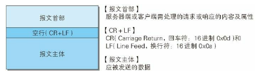

### 请求报文和响应报文的结构
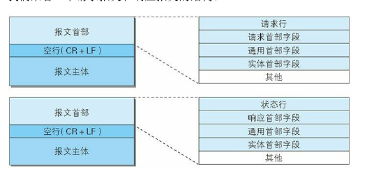

+ 请求行(包含用于请求的方法,请求URI和HTTP版本)
+ 状态行(包含表明响应结果的状态码,原因短句和HTTP版本)
+ [首部字段(包含请求和响应的的各种条件和属性的各类首部)](https://blog.csdn.net/alexshi5/article/details/80379086)

## 一次HTTP请求的解析
### 参考文章
+ https://blog.csdn.net/u013777975/article/details/80496121（DNS解析过程很详细）
+ https://www.jianshu.com/p/ed5735c663d7

给一个简单的实例来看看http协议的执行过程上图中用户点击了一个链接指向清华大学院系设置的页面，其URL是http://www.tsinghua.edu.cn/chn/yxsz/index.htm用http/1.0更具体的说明用户在点击鼠标后发生的事件：

（1）浏览器分析链接指向页面的URL。

（2）浏览器向DNS请求解析http://www.tsinghua.edu.cn的IP地址。

（3）域名系统DNS解析出清华大学的IP地址为166.111.4.100。

（4）浏览器与服务器建立TCP连接（服务器的IP地址是166.111.4.100，端口号是80）。

（5）浏览器发出取文件命令：GET/chn/yxsz/index.htm。

（6）服务器http://www.tsinghua.edu.cn做出响应，把文件index.htm发送给浏览器。

（7）释放TCP连接。

（8）浏览器显示“清华大学院系设置”文件index.htm中的所有文件。

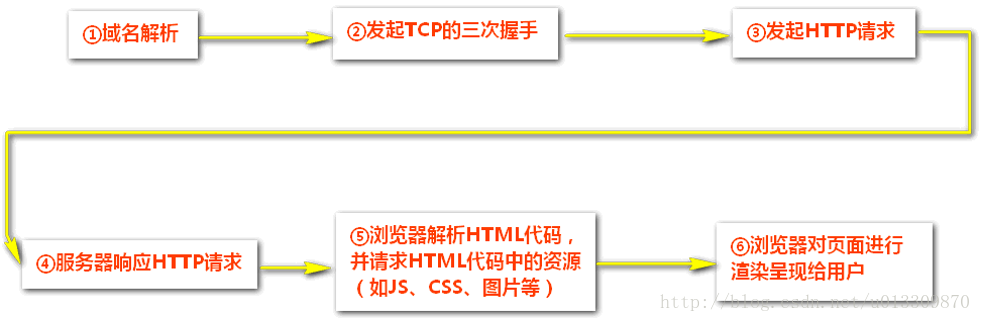

## 代理服务器

### 正向代理、反向代理

+ 正向代理：代理的对象是客户端
+ 反向代理：代理的对象是服务器

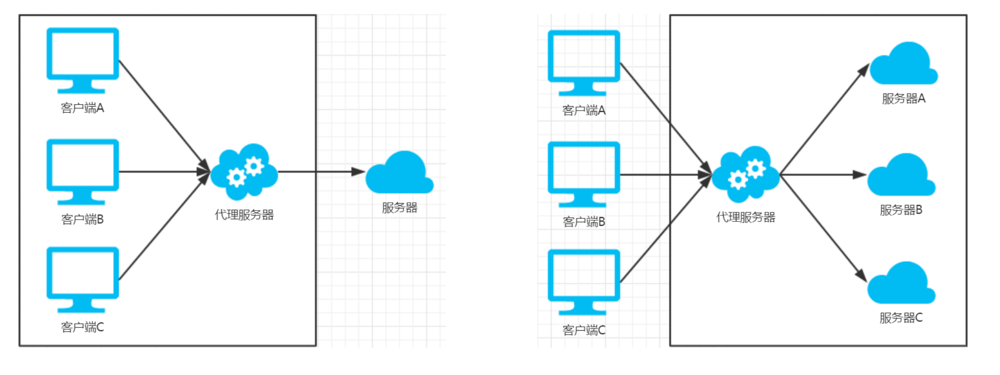

#### 正向代理作用

+ 隐藏客户端身份
+ 绕过防火墙（突破访问限制）
+ Internet访问控制
+ 数据过滤
+ ......

+ 一些免费的正向代理网站
  - https://ip.jiangxianli.com/
  - https://www.kuaidaili.com/free/inha/

#### 反向代理作用

+ 隐藏服务器身份
+ 安全防护
+ 负载均衡

### 相关头部字段


## CDN

CDN（ContentDeliveryNetwork或ContentDistributionNetwork），译为：内容分发网络

+ 利用最靠近每位用户的服务器
+ 更快更可靠地将音乐、图片、视频等资源文件（一般是静态资源）传递给用户

### 使用CDN前后

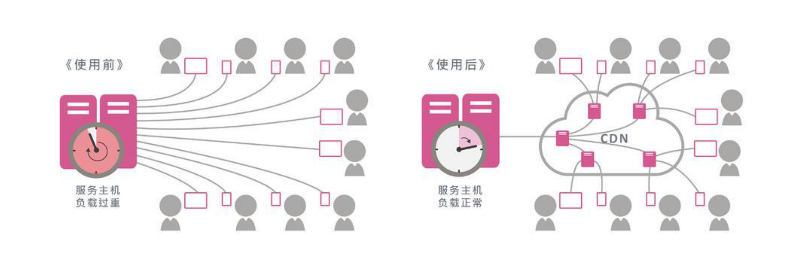

+ CDN运营商在全国、乃至全球的各个大枢纽城市都建立了机房
  - 部署了大量拥有高存储高带宽的节点，构建了一个跨运营商、跨地域的专用网络内容
+ 所有者向CDN运营商支付费用，CDN将其内容交付给最终用户

### 使用CDN前

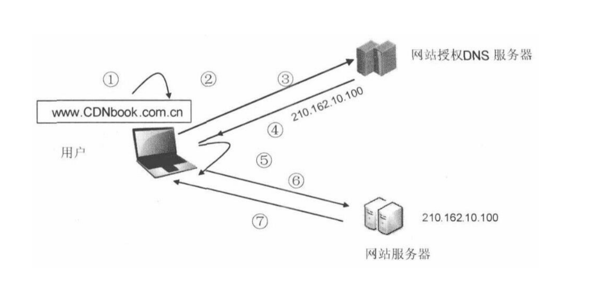

### 使用CDN后

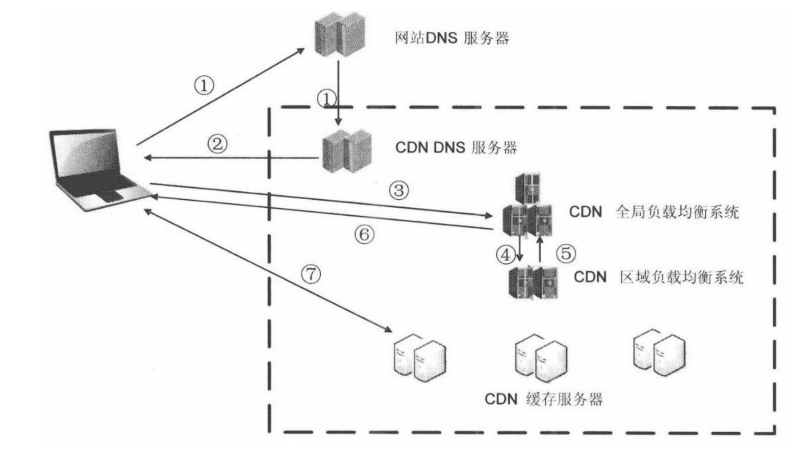

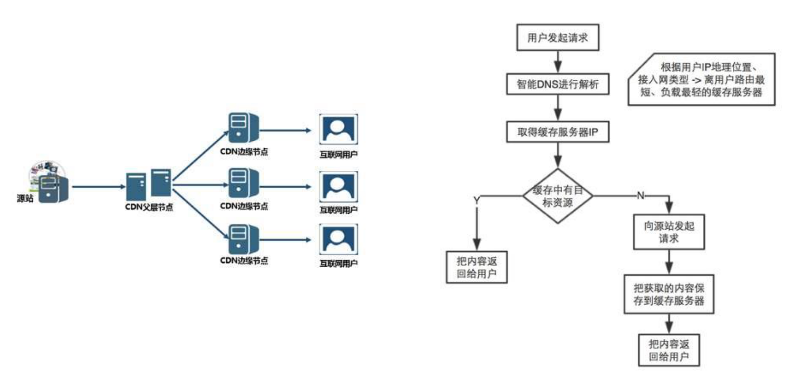

## 缓存（Cache）

### 响应头

+ Pragma

  作用类似于Cache-Control，HTTP/1.0的产物

+ Expires

  缓存的过期时间（GMT格式时间），HTTP/1.0的产物

+ Cache-Control

  设置缓存策略

  - no-storage：不缓存数据到本地
  - public：允许用户、代理服务器缓存数据到本地
  - private：只允许用户缓存数据到本地
  - max-age：缓存的有效时间（多长时间不过期），单位秒
  - no-cache：每次需要发请求给服务器询问缓存是否有变化，再来决定如何使用缓存

+ 优先级：Pragma>Cache-Control>Expires

+ Last-Modified

  资源的最后一次修改时间

+ ETag

  资源的唯一标识（根据文件内容计算出来的摘要值）

+ 优先级：ETag>Last-Modified

### 请求头

+ If-None-Match 
  - 如果上一次的响应头中有ETag，就会将ETag的值作为请求头的值
  - 如果服务器发现资源的最新摘要值跟If-None-Match不匹配，就会返回新的资源（200OK）
  - 否则，就不会返回资源的具体数据（304NotModified）
+ If-Modified-Since 
  - 如果上一次的响应头中没有ETag，有Last-Modified，就会将Last-Modified的值作为请求头的值
  - 如果服务器发现资源的最后一次修改时间晚于If-Modified-Since，就会返回新的资源（200OK）
  - 否则，就不会返回资源的具体数据（304NotModified）

### Last-Modified和ETag

+ Last-Modified的缺陷
  - 只能精确到秒级别，如果资源在1秒内被修改了，客户端将无法获取最新的资源数据
  - 如果某些资源被修改了（最后一次修改时间发生了变化），但是内容并没有任何变化
  - 会导致相同数据重复传输，没有使用到缓存
+ ETag可以办到
  - 只要资源的内容没有变化，就不会重复传输资源数据
  - 只要资源的内容发生了变化，就会返回最新的资源数据给客户端

### 流程图

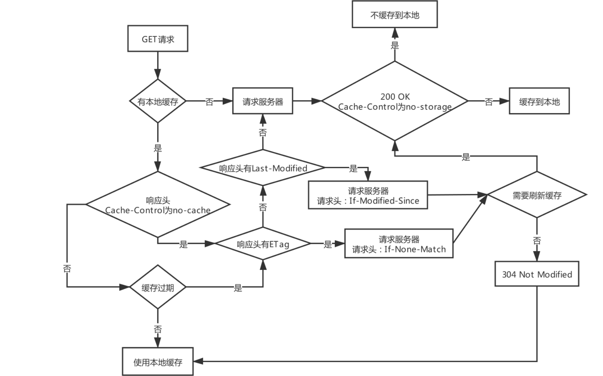

# [HTTPS](https://blog.csdn.net/xiaoming100001/article/details/81109617)

## 概念

+ HTTPS 协议（HyperText Transfer Protocol over Secure Socket Layer）：可以理解为HTTP+SSL/TLS， 即 HTTP 下加入 SSL 层，HTTPS 的安全基础是 SSL，因此加密的详细内容就需要 SSL。TLS为SSL升级版，目前大部分用的是TLS1.2，用于安全的 HTTP 数据传输。
+ HTTPS的默认端口号是443（HTTP是80）
+ SSL/TLS也可以用在其他协议上，比如FTP->FTPS，SMTP->SMTPS

## OpenSSL

OpenSSL是SSL/TLS协议的开源实现，始于1998年，支持Windows、Mac、Linux等平台

+ Linux、Mac一般自带OpenSSL ,Windows下载安装[OpenSSL](https://slproweb.com/products/Win32OpenSSL.html)

+ 相关命令

  ```
  //生成私钥：
  openssl genrsa -out mj.key 
  
  //生成公钥
  openssl rsa -in mj.key -pubout -out mj.pem
  ```

+ 可以使用OpenSSL构建一套属于自己的CA，自己给自己颁发证书，称为“自签名证书”

## 通信过程

+ [Https详解+wireshark抓包演示](https://www.jianshu.com/p/a3a25c6627ee)


### 1、Client Hello

在TCP完成三次握手之后，开始执行TLS协议。客户端（通常是浏览器）先向服务器发出加密通信的请求

+ 支持的协议版本，比如TLS 1.0版。
+ 一个客户端生成的随机数 random1，稍后用于生成"对话密钥“
+ 支持的加密方法，比如RSA公钥加密。
+ 支持的压缩方法。

### 2、Server Hello

+ 确认使用的加密通信协议版本，比如TLS 1.0版本。如果浏览器与服务器支持的版本不一致，服务器关闭加密通信。
+ 一个服务器生成的随机数random2，稍后用于生成"对话密钥"。
+ 确认使用的加密方法，比如RSA公钥加密。

### 3、Server => Client

服务端向客户端发送Certificate、Server Key Exchange、ServerHello Done，这是个优化过程

#### Certificate

这里主要就是把证书发送给Client。图中可以看到我的证书和证书发放机构。客户端拿到证书后就可以进行验证，同时获取到公钥，用于后面Random3的加密。证书一般采用X.509标准。

#### Server Key Exchange

这个消息是用来发送密钥交换算法相关参数和数据的。这里要提前提一下，就是根据密钥交换算法的不同，传递的参数也是不同的。
 常用的密钥交换算法：RSA、DH（Diffie-Hellman）、ECDH（Ellipticcurve Diffie–Hellman）

#### ServerHello Done

这个就是Server来表示自己说完了。类似电影里别人拿对讲机说完话最后会有一个“完毕！”。

### 4、Client => Server

客户端收到证书之后会首先会进行验证

+ 验证过程

  ```
  1.我们知道CA机构在签发证书的时候，都会使用自己的私钥对证书进行签名
  证书里的签名算法字段 sha256RSA 表示，CA机构使用sha256对证书进行摘要，然后使用RSA算法对摘要进行私钥签名，而我们也知道RSA算法中，使用私钥签名之后，只有公钥才能进行验签。
  
  2.如果我们使用的是购买的证书，那么很有可能，颁发这个证书的CA机构的公钥已经预置在操作系统中。这样浏览器就可以使用CA机构的公钥对服务器的证书进行验签。确定这个证书是不是由正规的CA机构颁发的。验签之后得到CA机构使用sha256得到的证书摘要，然后客户端再使用sha256对证书内容进行一次摘要，如果得到的值和验签之后得到的摘要值相同，则表示证书没有被修改过。
  
  3.如果验证通过，就会显示上面的安全字样，如果服务器购买的证书是更高级的EV类型，就会显示出购买证书的时候提供的企业名称。如果没有验证通过，就会显示不安全的提示。
  ```

+ 生成随机数

  ```
  验证通过之后，客户端会生成一个随机数pre-master secret，然后使用证书中的公钥进行加密，然后传递给服务器端
  ```

客户端验证证书没问题，然后客户端向服务端发送Client Key Exchange、Change Cipher Spec、Encrypted Handshake Message，这是个优化过程

#### Client Key Exchange

这里客户端会再生成一个随机数Random3。然后使用服务端传来的公钥进行加密得到密文PreMaster Key。服务端收到这个值后，使用私钥进行解密，得到Random3。这样客户端和服务端就都拥有了Random1、Random2和Random3。这样两边的秘钥就协商好了。后面数据传输就可以用协商好的秘钥进行加密和解密。

#### Change Cipher Spec

编码改变通知。这一步是客户端通知服务端后面再发送的消息都会使用前面协商出来的秘钥加密了，是一条事件消息。

#### Encrypted Handshake Message

这一步对应的是 Client Finish 消息，客户端将前面的握手消息生成摘要再用协商好的秘钥加密，这是客户端发出的第一条加密消息。服务端接收后会用秘钥解密，能解出来说明前面协商出来的秘钥是一致的。

### 5、Server => Client

包含三部分

- New Session Ticket
- Change Cipher Spec
- Encrypted Handshake Message

#### New Session Ticket

包含了一个加密通信所需要的信息，这些数据采用一个只有服务器知道的密钥进行加密。目标是消除服务器需要维护每个客户端的会话状态缓存的要求。这部分内容在后面的扩展部分会讲到

#### Change Cipher Spec

编码改变通知。这一步是服务端通知客户端后面再发送的消息都会使用加密，也是一条事件消息。

#### Encrypted Handshake Message

这一步对应的是 Server Finish 消息，服务端也会将握手过程的消息生成摘要再用秘钥加密，这是服务端发出的第一条加密消息。客户端接收后会用秘钥解密，能解出来说明协商的秘钥是一致的。

到这里双方SSL/TLS握手完成。