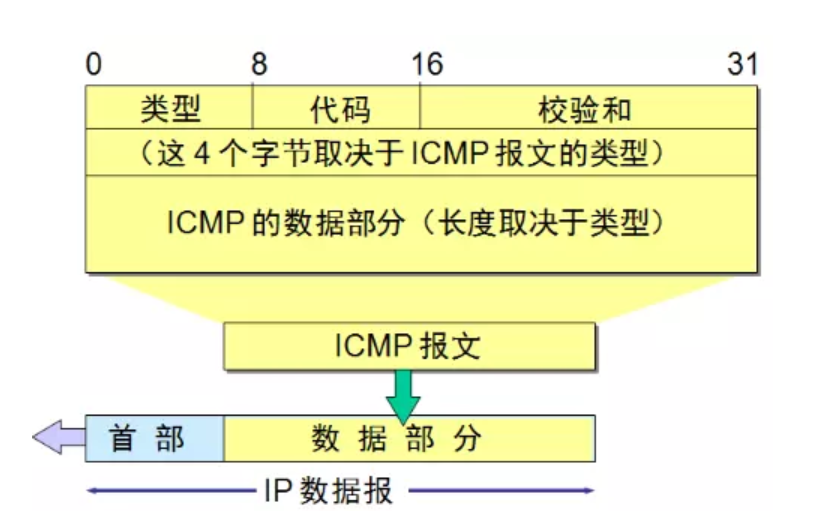
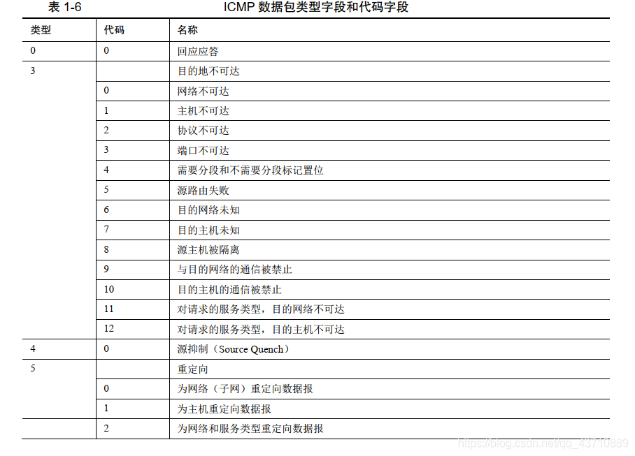
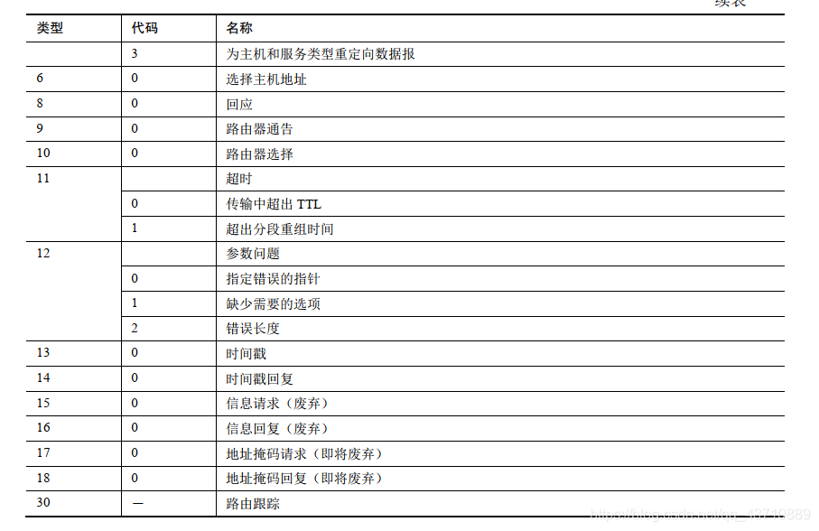

# ICMP协议

网际控制报文协议就是熟悉的ICMP全称。ICMP 消息是通过 IP 进行传输，但它的目的并不是让 IP 成为一种可靠的协议，而是对传输中发生的问题进行反馈。ICMP 消息的传输同样得不到可靠性保证，也有可能在传输过程中丢失。因此 ICMP 不是传输层的补充，应该把它当做**网络层协议**。

## 报文信息



```
类型(type)：
占用了8 bit位，前面我们说，是ICMP报文类型，用于标识错误类型的差错报文或者查询类型的报告报文。

代码(code)：
占用了8 bit位，根据ICMP差错报文的类型，进一步分析错误的原因，代码值不同对应的错误也不同，例如：类型为11且代码为0，表示数据传输过程中超时了，超时的具体原因是TTL值为0，数据报被丢弃。

校验和(checksum)：
占用了16 bit位，数据发送到目的地后需要对ICMP数据报文做一个校验，用于检查数据报文是否有错误。

标识符(Identifier)：
占用了16 bit位，对于每一个发送的数据报进行标识

序列号(Sequence number)：
占用了16 bit位，对于发送的每一个数据报文进行编号，比如：发送的第一个数据报序列号为1，第二个序列号为2。

数据（Data）：
要发送的ICMP数据。
```

### 类型和代码字段





## 应用

### ping

ping 工具只能测试目的设备的连通性

```shell
ping /?   # 查看ping的用法
ping ip地址 -l 数据包大小   # 发送指定大小的数据包
ping ip地址 -f        # 不允许网络层分片
ping ip地址 -i TTL    # 设置TTL的值
```

### tracert

tracert 工具可以查看数据包的**整条传输路径**，包括途中经过的**中间设备**。

```shell
# Windows
# tracert [-d] [-h maximum_hops] [-j computer-list] [-w timeout] 主机名称或IP地址
#参数
-d 指定不对计算机名解析地址。
-h maximum_hops 指定查找目标的跳转的最大数目。
-jcomputer-list 指定在 computer-list 中松散源路由。
-w timeout 等待由 timeout 对每个应答指定的毫秒数。

# Mac/Linux
# traceroute[参数][主机]
# traceroute指令让你追踪网络数据包的路由途径，预设数据包大小是40Bytes，用户可另行设置。
# 具体参数格式：traceroute [-dFlnrvx][-f<存活数值>][-g<网关>...][-i<网络界面>][-m<存活数值>][-p<通信端口>][-s<来源地址>][-t<服务类型>][-w<超时秒数>][主机名称或IP地址][数据包大小]
#命令参数：
-d 使用Socket层级的排错功能。
-f 设置第一个检测数据包的存活数值TTL的大小。
-F 设置勿离断位。
-g 设置来源路由网关，最多可设置8个。
-i 使用指定的网络界面送出数据包。
-I 使用ICMP回应取代UDP资料信息。
-m 设置检测数据包的最大存活数值TTL的大小。
-n 直接使用IP地址而非主机名称。
-p 设置UDP传输协议的通信端口。
-r 忽略普通的Routing Table，直接将数据包送到远端主机上。
-s 设置本地主机送出数据包的IP地址。
-t 设置检测数据包的TOS数值。
-v 详细显示指令的执行过程。
-w 设置等待远端主机回报的时间。
-x 开启或关闭数据包的正确性检验。
```

