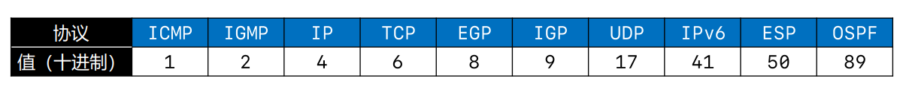

### IP协议

#### 数据包格式

由首部和数据段两部分组成


+ 总长度

  ![]images/network_network_total_length.png)

+ 片偏移

  

+ 生存时间

  

+ 协议

  

```
版本（Version）,占4位
0b0100：IPv4
0b0110：IPv6

首部长度（Header Length）占4位，二进制乘以4才是最终长度
0b0101：20（最小值）
0b1111：60（最大值）

区分服务（Differentiated Services Field）占8位
可以用于提高网络的服务质量（QoS，Quality of Service）

总长度（Total Length）占16位 （图见总长度标签）
首部 + 数据的长度之和，最大值是65535
由于帧的数据不能超过1500字节，所以过大的IP数据包，需要分成片（fragments）传输给数据链路层
每一片都有自己的网络层首部（IP首部）

标识（Identification）占16位
数据包的ID，当数据包过大进行分片时，同一个数据包的所有片的标识都是一样的
有一个计数器专门管理数据包的ID，每发出一个数据包，ID就加1

标志（Flags）占3位
第1位（Reserved Bit）：保留
第2位（Don't Fragment）：1代表不允许分片，0代表允许分片
第3位（More Fragments）：1代表不是最后一片，0代表是最后一片

片偏移（Fragment Offset）占13位（图见片偏移标签）
片偏移乘以8：字节偏移
每一片的长度一定是8的整数倍

生存时间（Time To Live，TTL）占8位（图见生存时间标签）
每个路由器在转发之前会将TTL减1，一旦发现TTL减为0，路由器会返回错误报告
观察使用ping命令后的TTL，能够推测出对方的操作系统、中间经过了多少个路由器

协议（Protocol）占8位 （图见协议标签）
表明所封装的数据是使用了什么协议

首部校验和（Header Checksum）
用于检查首部是否有错误
```

#### ping命令

```
ping /?   //查看ping的用法
ping ip地址 -l 数据包大小   //发送指定大小的数据包
ping ip地址 -f        //不允许网络层分片
ping ip地址 -i TTL    //设置TTL的值

通过tracert、pathping命令，可以跟踪数据包经过了哪些路由器
```
