<!-- START doctoc generated TOC please keep comment here to allow auto update -->
<!-- DON'T EDIT THIS SECTION, INSTEAD RE-RUN doctoc TO UPDATE -->
**Table of Contents**  *generated with [DocToc](https://github.com/thlorenz/doctoc)*

- [网络协议](#%E7%BD%91%E7%BB%9C%E5%8D%8F%E8%AE%AE)
  - [基本概念](#%E5%9F%BA%E6%9C%AC%E6%A6%82%E5%BF%B5)
    - [通信基础](#%E9%80%9A%E4%BF%A1%E5%9F%BA%E7%A1%80)
    - [计算机的连接方式](#%E8%AE%A1%E7%AE%97%E6%9C%BA%E7%9A%84%E8%BF%9E%E6%8E%A5%E6%96%B9%E5%BC%8F)
      - [网线直连](#%E7%BD%91%E7%BA%BF%E7%9B%B4%E8%BF%9E)
      - [同轴电缆(Coaxial)](#%E5%90%8C%E8%BD%B4%E7%94%B5%E7%BC%86coaxial)
      - [集线器(Hub)](#%E9%9B%86%E7%BA%BF%E5%99%A8hub)
      - [网桥(Bridge)](#%E7%BD%91%E6%A1%A5bridge)
      - [交换机(Switch)](#%E4%BA%A4%E6%8D%A2%E6%9C%BAswitch)
      - [路由器(Router)](#%E8%B7%AF%E7%94%B1%E5%99%A8router)
      - [参考地址](#%E5%8F%82%E8%80%83%E5%9C%B0%E5%9D%80)
    - [猫（Modem音译）](#%E7%8C%ABmodem%E9%9F%B3%E8%AF%91)
    - [MAC地址](#mac%E5%9C%B0%E5%9D%80)
    - [IP地址](#ip%E5%9C%B0%E5%9D%80)
      - [组成](#%E7%BB%84%E6%88%90)
      - [分类](#%E5%88%86%E7%B1%BB)
      - [子网划分](#%E5%AD%90%E7%BD%91%E5%88%92%E5%88%86)
      - [超网](#%E8%B6%85%E7%BD%91)
      - [公网IP和私网IP](#%E5%85%AC%E7%BD%91ip%E5%92%8C%E7%A7%81%E7%BD%91ip)
    - [NAT（网络地址转换）](#nat%E7%BD%91%E7%BB%9C%E5%9C%B0%E5%9D%80%E8%BD%AC%E6%8D%A2)
      - [特点](#%E7%89%B9%E7%82%B9)
      - [分类](#%E5%88%86%E7%B1%BB-1)
    - [路由](#%E8%B7%AF%E7%94%B1)
  - [网络模型](#%E7%BD%91%E7%BB%9C%E6%A8%A1%E5%9E%8B)
    - [分层参考图](#%E5%88%86%E5%B1%82%E5%8F%82%E8%80%83%E5%9B%BE)
    - [物理层](#%E7%89%A9%E7%90%86%E5%B1%82)
      - [数字信号和模拟信号](#%E6%95%B0%E5%AD%97%E4%BF%A1%E5%8F%B7%E5%92%8C%E6%A8%A1%E6%8B%9F%E4%BF%A1%E5%8F%B7)
      - [数据通信模型](#%E6%95%B0%E6%8D%AE%E9%80%9A%E4%BF%A1%E6%A8%A1%E5%9E%8B)
      - [信道（Channel）](#%E4%BF%A1%E9%81%93channel)
    - [数据链路层](#%E6%95%B0%E6%8D%AE%E9%93%BE%E8%B7%AF%E5%B1%82)
      - [封装成帧](#%E5%B0%81%E8%A3%85%E6%88%90%E5%B8%A7)
      - [透明传输](#%E9%80%8F%E6%98%8E%E4%BC%A0%E8%BE%93)
      - [差错校验](#%E5%B7%AE%E9%94%99%E6%A0%A1%E9%AA%8C)
      - [CSMA/CD协议](#csmacd%E5%8D%8F%E8%AE%AE)
      - [Ethernet V2](#ethernet-v2)
      - [网卡](#%E7%BD%91%E5%8D%A1)
      - [PPP协议](#ppp%E5%8D%8F%E8%AE%AE)
        - [字节填充](#%E5%AD%97%E8%8A%82%E5%A1%AB%E5%85%85)
    - [网络层](#%E7%BD%91%E7%BB%9C%E5%B1%82)
      - [数据包](#%E6%95%B0%E6%8D%AE%E5%8C%85)
      - [ping命令](#ping%E5%91%BD%E4%BB%A4)
    - [传输层](#%E4%BC%A0%E8%BE%93%E5%B1%82)
      - [UDP](#udp)
        - [数据格式](#%E6%95%B0%E6%8D%AE%E6%A0%BC%E5%BC%8F)
      - [TCP](#tcp)
    - [应用层](#%E5%BA%94%E7%94%A8%E5%B1%82)
  - [工具](#%E5%B7%A5%E5%85%B7)

<!-- END doctoc generated TOC please keep comment here to allow auto update -->

# 网络协议

## 基本概念

### 通信基础

+ 需要知道对方的IP地址
+ 最终是根据MAC地址（网卡地址），最终输送到网卡，被网卡接收
  - 如果网卡发现MAC地址是自己，那么直接将数据送到上一层进行处理
  - 如果网卡发现MAC地址不是自己，就会将数据丢弃，不会传递给上一层进行处理

### 计算机的连接方式

#### 网线直连

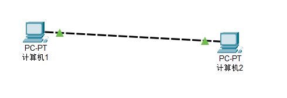

1. 使用交叉线连接两台计算机, 即可实现两台计算之间的通信

#### 同轴电缆(Coaxial)

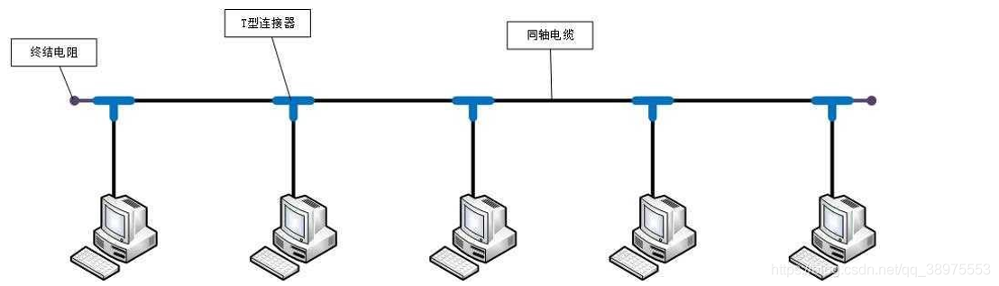

1. 半双工通信
2. 容易冲突
3. 不安全
4. 一旦某段线路出现问题, 整个通信网络都会瘫痪

#### 集线器(Hub)

1. 半双工通信
2. 容易发生冲突
3. 不安全
4. 跟同轴电缆一样, 没有智商

#### 网桥(Bridge)

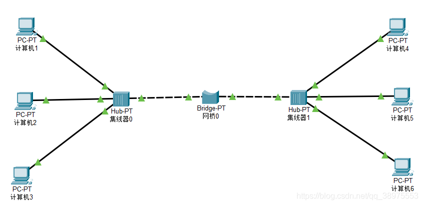

```
在ARP广播中网桥学习到 计算机3(计算机3-ARP->计算机1) 和 计算机1(计算机1-ARP->计算机3) 的MAC地址在网桥左侧, 当发送ICMP请求时, 不会通过网桥向右侧传播, 以此隔绝冲突域
```

1.  网桥可以通过自学习得知每侧接口的MAC地址, 从而起到隔绝冲突域的作用

#### 交换机(Switch)

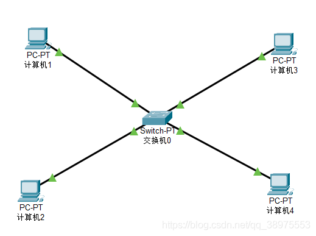

1. 相当于接口更多的网桥（有学习能力，能够学习对应端口的Mac地址）
2. 全双工通信
3. 比集线器更安全
4. 连接的设备必须在同一网段, 即处在同一广播域

#### 路由器(Router)

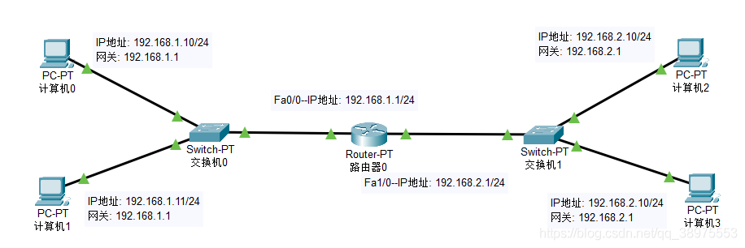

1. 可以在不同网段之间转发数据，路由器两边不能为同一网段（通过路由器的网关口来转发到不同网段，两个不同的网络段通过路由器的两个网关来转发）
2. 隔绝广播域

#### 参考地址

+ [计算机之间的连接方式](https://blog.csdn.net/qq_38975553/article/details/110166561)

### 猫（Modem音译）

其实是叫调制解调器，它的作用是把电话线的信号转换成数字信号，传给电脑，然后把电脑的数字信号转换成电话信号传送出去，从而实现电脑通过它和电话线上网。

### MAC地址

+ 每个网卡都有6个字节（48bit）的MAC地址

+ 全球唯一，固化在ROM中，由IEEE802标准规定

  - 前面三个字节表示组织标识符，由IEEEE的注册管理机构分配
  - 后三个字节表示网络接口标识符，由厂商自由分配。

+ 表示格式

  - Windows

    40-55-82-0A-8C-6D

  - Linux、Android、Mac、IOS

    40:55:82:0A:8C:6D

  - Packet Tracer

    4055.820A.8C6D

  - 当48位全是1，代表广播地址

    FF-FF-FF-FF-FF-FF

+ MAC地址的获取

  - 当不知道对方主机的MAC地址时，可以通过发送ARP广播来获取对方的MAC地址

  - 获取成功后，会缓存IP地址、MAC地址的映射信息，俗称ARP缓存

  - 通过ARP广播获取的MAC地址，属于动态（dynamic）缓存，存储时间比较短（2分钟），过期就会自动删除。

    ```
    //arp命令
    arp -a [主机]  //查询ARP缓存
    arp -d [主机]  //删除ARP缓存
    arp -s 主机地址 MAC地址  //增加一条缓存信息（这是静态存储，存储时间比较长，不同操作系统存储时间不一样）
    ```

### IP地址

#### 组成

+ 网络标识（网络ID）+主机标识（主机ID）

+ 同一网段的计算机，网络ID相同

+ 通过子网掩码可以计算出网络ID：子网掩码 & IP地址

  ```
  //例子
  ip:192.168.1.8
  子网掩码:255.255.255.0
  
    1100 0000.1010 1000.0000 0001.0000 1000
  & 1111 1111.1111 1111.1111 1111.0000 0000 
  ------------------------------------------
    1100 0000.0110 1000.0000 0001.0000 0000 
    
  网络ID=192.168.1.0
  
  //如果A要与B通信，A先计算出自己的网段，然后A拿自己的子网掩码&B的ip，计算出B的网段，然后判断是否在同一网段，是否能进行通信。
  ```

+ 计算机和其他计算机通信前，会先判断目标主机和自己是否在同一网段

  - 同一网段：不需要路由器转发
  - 不同网段：交由路由器转发

#### 分类

只要ABC类地址才能分配给主机，主机ID全为0，表示主机所在的网段，主机ID全为1，表示主机所在网段的全部主机（广播）

+ A类地址

  默认子网掩码255.0.0.0，8位网络ID（必须0开头）+24位的主机ID

+ B类地址

  默认子网掩码255.255.0.0，16位网络ID（必须10开头）+16位的主机ID

+ C类地址

  默认子网掩码255.255.255.0，32位网络ID（必须110开头）+8位的主机ID

+ D类地址

  以1110开头，多播地址

+ E类地址

  以1111开头，保留为今后使用

#### 子网划分

借助主机位作子网位，划分出多个子网

+ 等长子网划分
+ 变长子网划分

#### 超网

跟子网反过来，它是将连续几个网段合并成一个更大的网段

#### 公网IP和私网IP

+ 公网IP
+ 私有IP

### NAT（网络地址转换）

私网IP访问Internet需要进行NAT转换为公网IP，这一步由路由器完成

#### 特点

- 可以节约公网IP资源
- 会隐藏内网真实IP

#### 分类

+ 静态转换

  手动配置NAT的映射表，一对一转换

+ 动态转换

  定义外部地址池，动态随机转换，一对一转换

+ PAT（Port Address Translation）

  多对一转换，最大节约公网IP资源，采用端口多路复用方式，通过端口号标识不同的数据流。目前应用最广泛的NAT实现方式。

### 路由

+ 在不同网段转发数据，需要路由器的支持。

+ 默认情况下，路由器只知道和它直连的网段，非直连的网段需要静态路由、动态路由告诉它。

+ 静态路由

  管理员手动添加路由信息，适用于小规模网络。

+ 动态路由

  路由器通过路由选择协议（比如RIF、OSPF）自动获得路由信息，适用于大规模网络。

## 网络模型

### 分层参考图

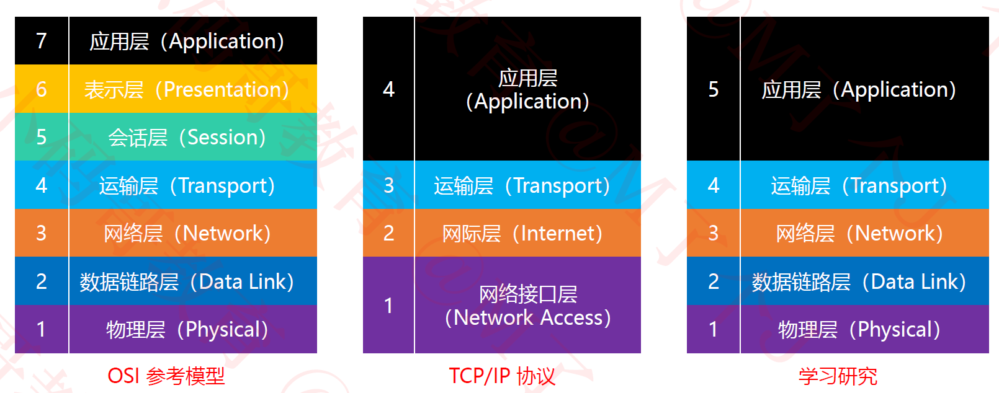

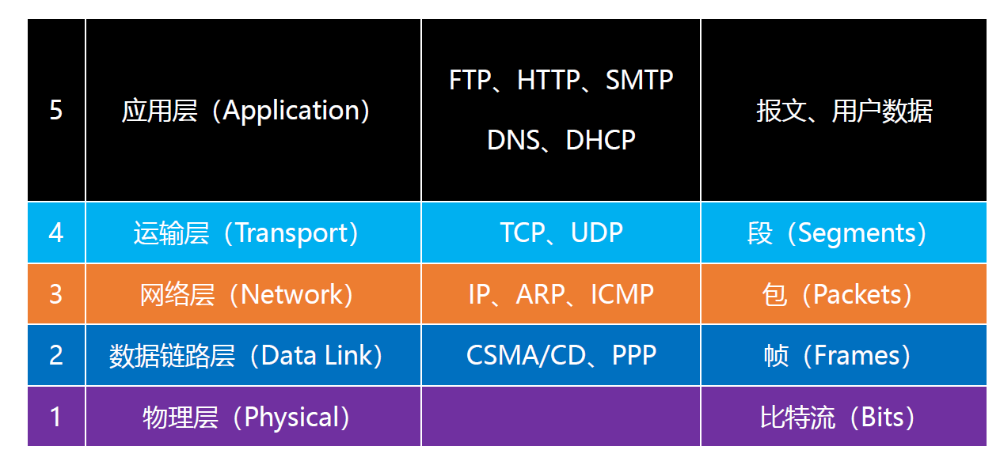


### 物理层

物理层定义了接口标准、线缆标准、传输速率、传输方式等。

#### 数字信号和模拟信号

+ 模拟信号

  连续的信号，适合长距离传输。抗干扰能力差，受到干扰时波形变形很难修正。

+ 数字信号

  离散的信号，适合短距离传输。抗干扰能力强，受到干扰时波形失真可以修复。

#### 数据通信模型

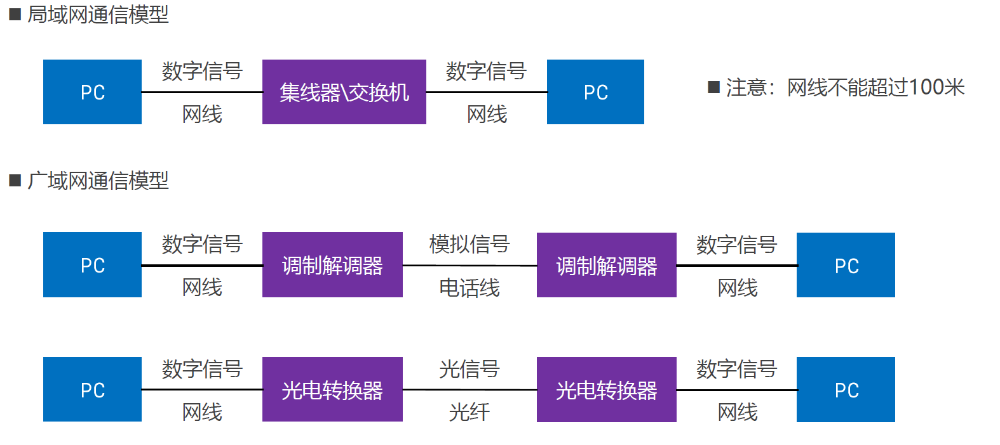

#### 信道（Channel）

传输信息的通道。一条传输介质（比如网线）上可以有多条信道。

+ 单工信道

  信号只能往一个方向传输，任何时候都不能改变传输信号的方向。比如无线电广播，有线电视广播。

+ 半双工信道

  信号可以双向传输，但必须是交替进行。比如对讲机。

+ 全双工信道

  信号可以同时的双向传输。比如手机。

### 数据链路层

数据链路层需要在头部和首部加上.

链路：从一个节点到相邻节点的一段物理线路（有线或者无线），中间没有其他交换节点。

数据链路：在一条链路上传输数据时，需要有对应的通信协议来控制数据的传输

不同类型的链路，使用的通信协议可能不同

+ 广播信道：CSMA/CD协议（比如同轴电缆、集电器等组成的网络）
+ 点对点信道：PPP协议（比如两个路由器之间的信道）

#### 封装成帧

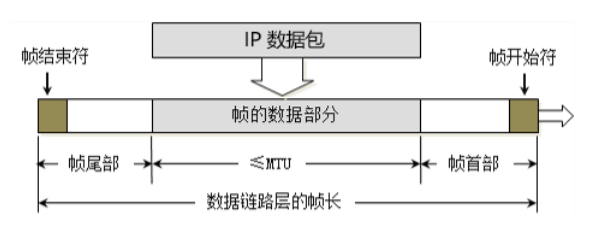

+ 帧的数据部分

  就是网络层传递下来的数据包

+ 最大传输单元MTU

  每一种数据链路层协议都规定了所能够传送的帧的数据长度上限，以太网的MTU长度为1500字节

#### 透明传输

数据部分一旦出现SOH、EOT，就需要转义

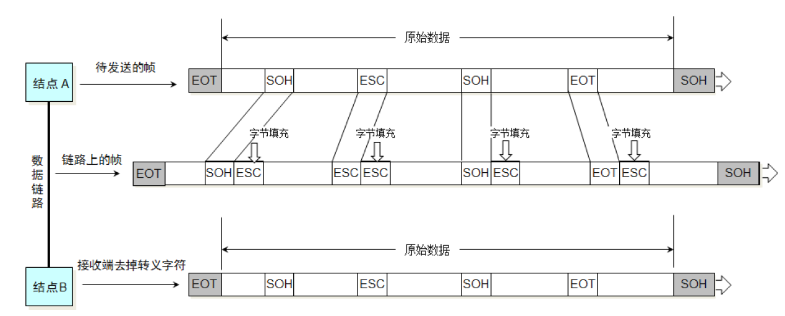

#### 差错校验

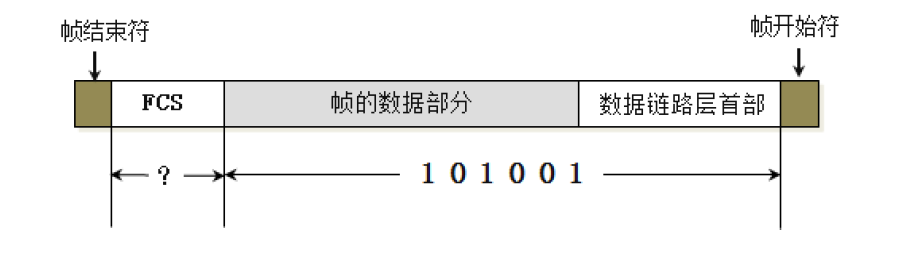

+ FCS部分是根据数据部分+首部计算得出的。

#### CSMA/CD协议

载波侦听多路访问/冲突检测

+ 使用了CSMA/CD的网络可以称为是以太网（Ethernet），它传输的是以太网帧
  - 以太网帧的格式有：Ethernet V2标准、IEEE的802.3标准
  - 使用最多的是：Ethernet V2标准
+ 为了能够检测正在发送的帧是否产生了冲突，以太网的帧至少要64字节
+ 用交换机组建的网络，已经支持全双工通信，不需要再使用CSMA/CD，但它传输的帧依然是以太网帧。所以，用交换机组建的网络，依然可以叫做以太网

#### Ethernet V2

+ Ethernet  V2帧的格式

  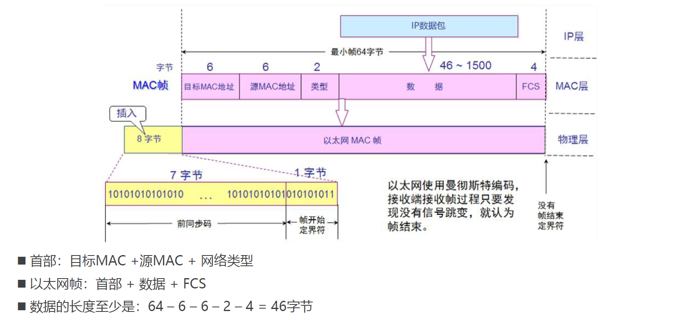

+ Ethernet  V2帧的格式

  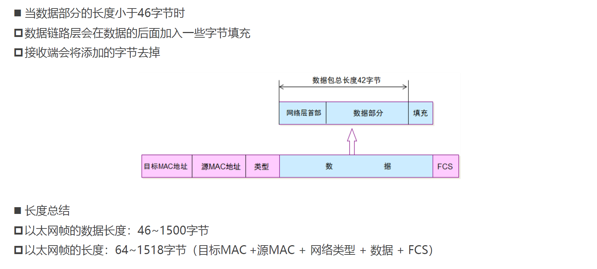

#### 网卡

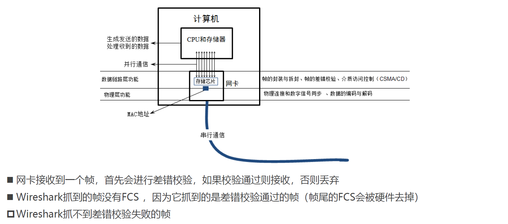

#### PPP协议

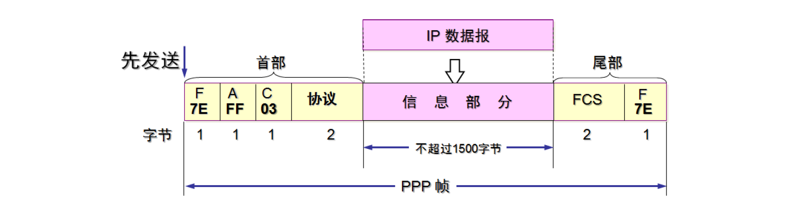

+ Address字段：图中的值是0xFF，形同虚设，点到点信道不需要源MAC、目标MAC地址
+  Control字段：图中的值是0x03，目前没有什么作用
+  Protocol字段：内部用到的协议类型
+  帧开始符、帧结束符：0x7E

##### 字节填充

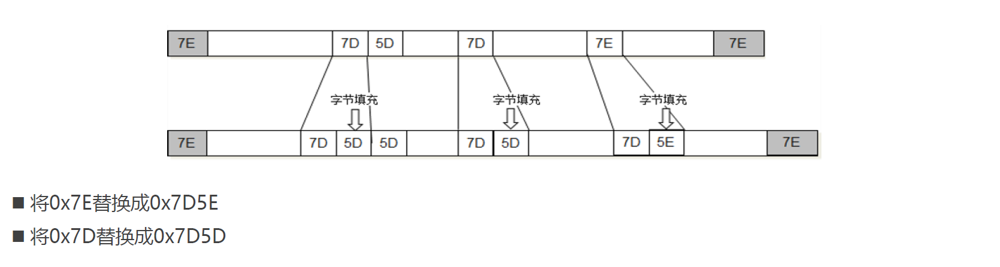

### 网络层

#### 数据包格式

由首部和数据段两部分组成

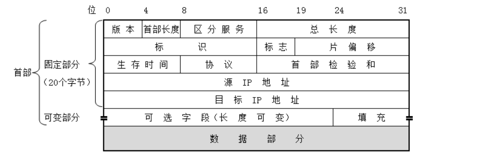

+ 总长度

  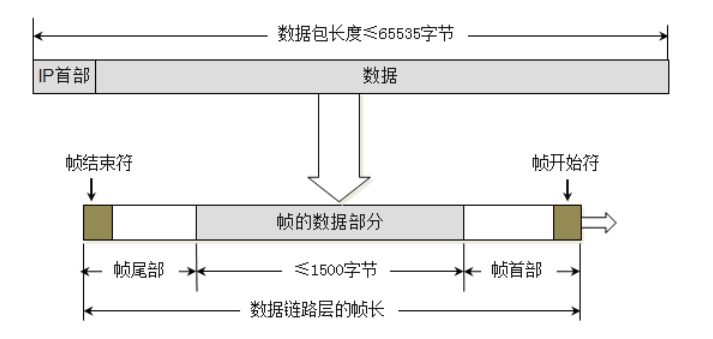

+ 片偏移

  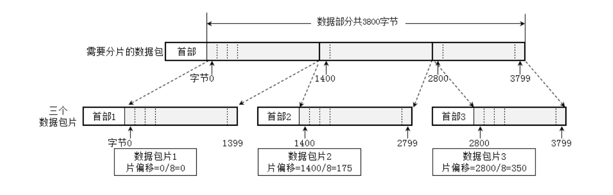

+ 生存时间

  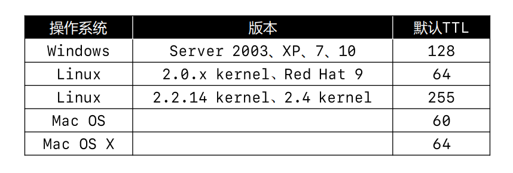

+ 协议

  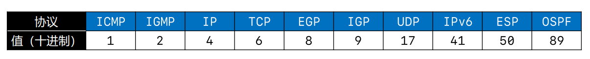

```
版本（Version）,占4位
0b0100：IPv4
0b0110：IPv6

首部长度（Header Length）占4位，二进制乘以4才是最终长度
0b0101：20（最小值）
0b1111：60（最大值）

区分服务（Differentiated Services Field）占8位
可以用于提高网络的服务质量（QoS，Quality of Service）

总长度（Total Length）占16位 （图见总长度标签）
首部 + 数据的长度之和，最大值是65535
由于帧的数据不能超过1500字节，所以过大的IP数据包，需要分成片（fragments）传输给数据链路层
每一片都有自己的网络层首部（IP首部）

标识（Identification）占16位
数据包的ID，当数据包过大进行分片时，同一个数据包的所有片的标识都是一样的
有一个计数器专门管理数据包的ID，每发出一个数据包，ID就加1

标志（Flags）占3位
第1位（Reserved Bit）：保留
第2位（Don't Fragment）：1代表不允许分片，0代表允许分片
第3位（More Fragments）：1代表不是最后一片，0代表是最后一片

片偏移（Fragment Offset）占13位（图见片偏移标签）
片偏移乘以8：字节偏移
每一片的长度一定是8的整数倍

生存时间（Time To Live，TTL）占8位（图见生存时间标签）
每个路由器在转发之前会将TTL减1，一旦发现TTL减为0，路由器会返回错误报告
观察使用ping命令后的TTL，能够推测出对方的操作系统、中间经过了多少个路由器

协议（Protocol）占8位 （图见协议标签）
表明所封装的数据是使用了什么协议

首部校验和（Header Checksum）
用于检查首部是否有错误
```

#### ping命令

```
ping /?   //查看ping的用法
ping ip地址 -l 数据包大小   //发送指定大小的数据包
ping ip地址 -f        //不允许网络层分片
ping ip地址 -i TTL    //设置TTL的值

通过tracert、pathping命令，可以跟踪数据包经过了哪些路由器
```

### 传输层

传输层有2个协议

+ TCP（Transmission Control Protocol），传输控制协议
+ UDP（User Datagram Protocol），用户数据报协议

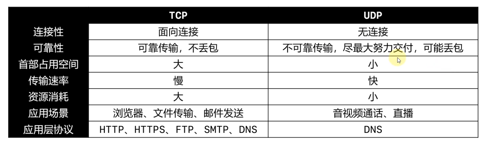

#### UDP

+ UDP是无连接的，减少了建立和释放连接的开销
+ UDP尽最大能力交付，不保证可靠交付
+ 因此不需要维护一些复杂的参数，首部只有8个字节（TCP的首部至少20个字节）

##### 数据包格式

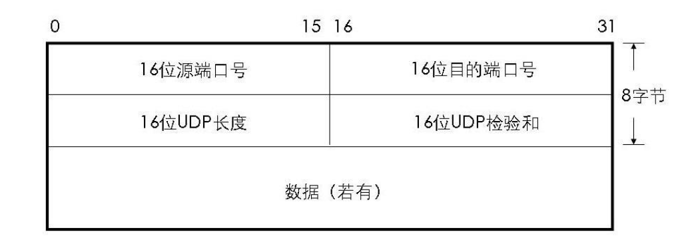

+ UDP长度（Length）占16位

  首部的长度+ 数据的长度

+ 检验和的计算内容：伪首部+ 首部+ 数据

  伪首部：仅在计算检验和时起作用，并不会传递给网络层

  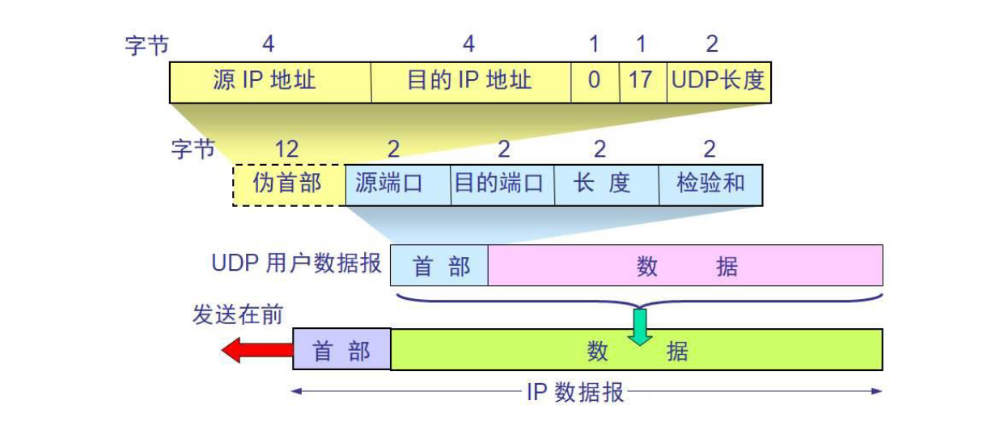

+ 端口（Port）

  - UDP首部中端口是占用2字节，端口范围在0~65535

  - 客户端的源端口是临时开启的随机端口

  - 防火墙可以设置开启\关闭某些端口来提高安全性

  - 常用命令行

    ```
    netstat –an：查看被占用的端口
    netstat –anb：查看被占用的端口、占用端口的应用程序
    telnet 主机端口：查看是否可以访问主机的某个端口
    
    安装telnet：控制面板– 程序– 启用或关闭Windows功能– 勾选“Telnet Client” – 确定
    ```

#### TCP

##### 数据包格式

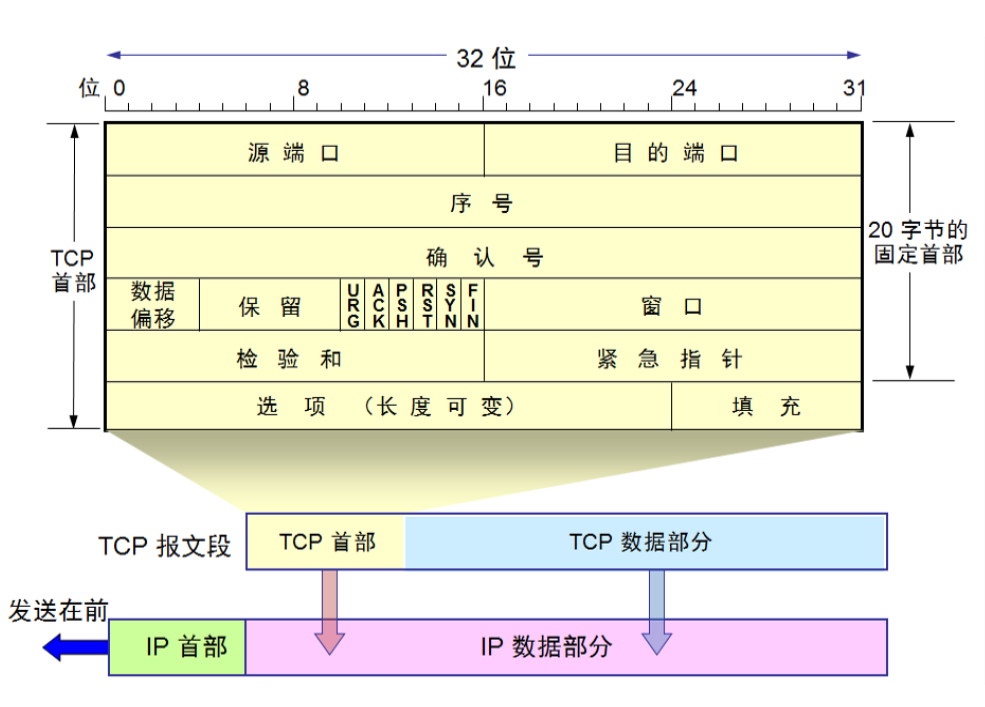

+ 校验和

  和UDP一样，检验和的计算内容：伪首部+ 首部+ 数据，伪首部：12个字节，仅在计算检验和时起作用，并不会传递给网络层

  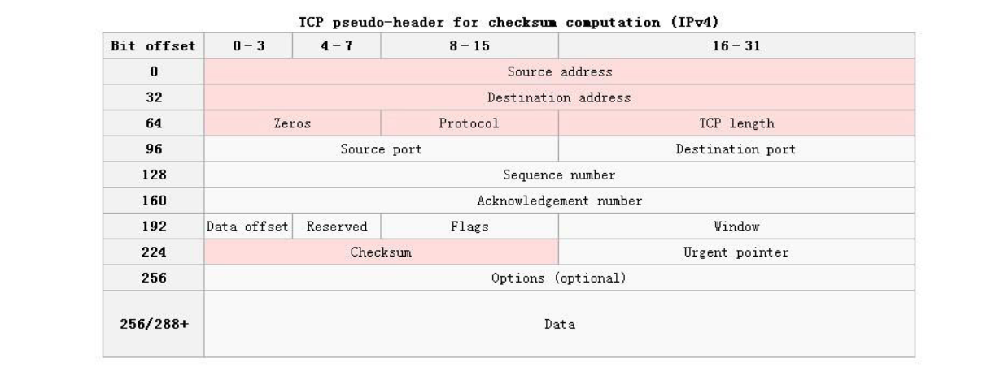

```
数据偏移 4位
取值范围 0x0101~0x1111
乘以4为首部长度，首部长度范围为20～60

保留 6位（也可以说占3位，后面的前三个字节没有用）
目前全为0

标识位（保留位后面的）
1、URG（Urgent）
当URG=1时，紧急指针字段才有效。表明当前报文段中有紧急数据，应优先尽快传送
2、ACK（Acknowledgment）
当ACK=1时，确认号字段才有效
3、PSH（Push）
4、RST（Reset）
当RST=1时，表明连接中出现严重差错，必须释放连接，然后再重新建立连接
5、SYN（Synchronization）
当SYN=1、ACK=0时，表明这是一个建立连接的请求，若对方同意建立连接，则回复SYN=1、ACK=1。
6、FIN（Finish）
当FIN=1时，表明数据已经发送完毕，要求释放连接

序号（Sequence Number）占4字节
首先，在传输过程的每一个字节都会有一个编号
在建立连接后，序号代表：这一次传给对方的TCP数据部分的第一个字节的编号

确认号（Acknowledgment Number）占4字节
在建立连接后，确认号代表：期望对方下一次传过来的TCP数据部分的第一个字节的编号

窗口（Window） 占2字节
这个字段有流量控制功能，用以告知对方下一次允许发送的数据大小（字节为单位）
```

##### 可靠传输

1. 重连机制

    如果有个包重传N次还是失败，不会一直重新传输，取决于系统的设置，有的系统比如传送5次还是失败就会发送reset报文断开TCP连接。

   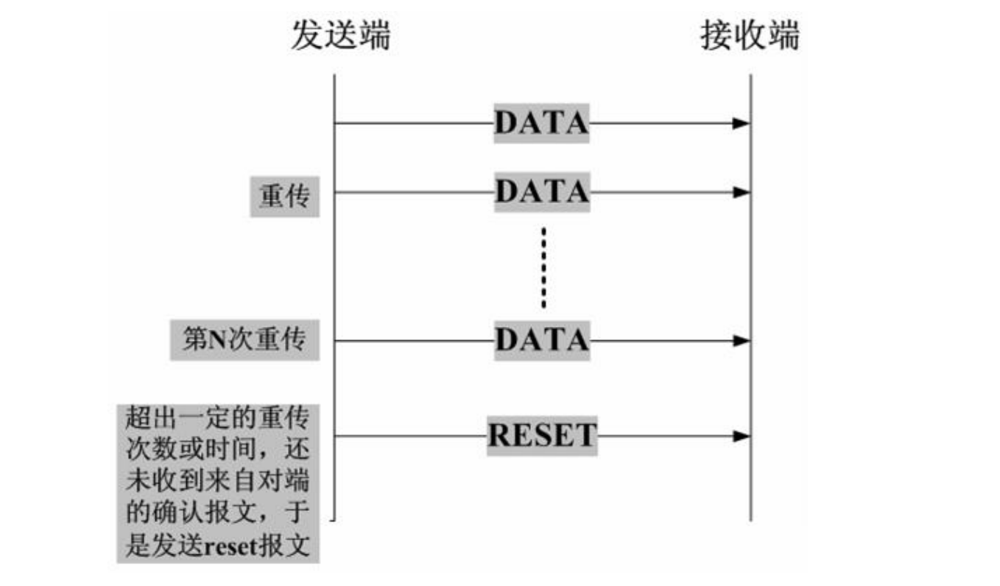

2. 停止等待ARQ协议（ARQ：自动重传请求）（四种情况）

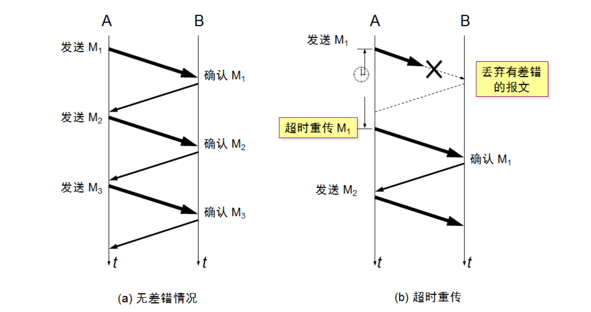

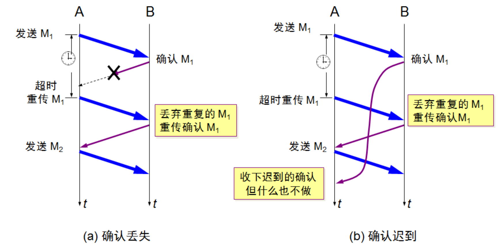

3. 连续ARQ协议+滑动窗口协议

   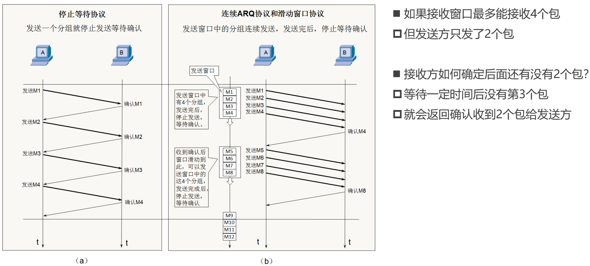

   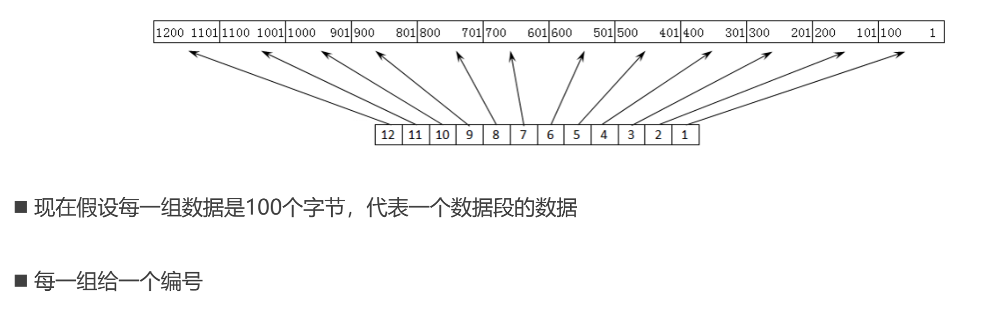

   

4. SACK（选择确认）

   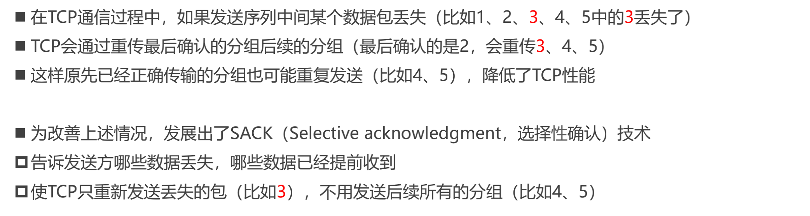

   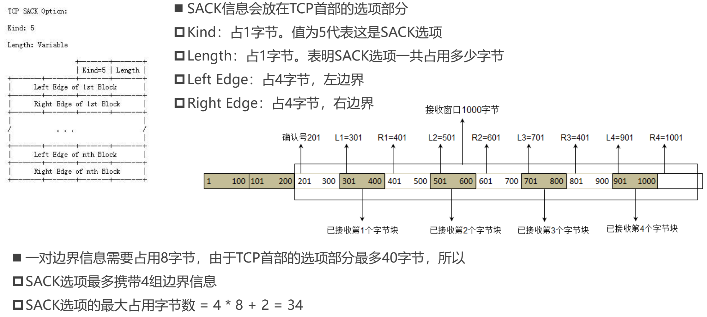

5. 思考

   为什么选择在传输层或者应用层就将数据分成很多段，而不是等到网络层在分片传递给数据链路层

   + 因为可以提高重传的性能

   + 需要明确的是：可靠传输是在传输层进行控制的（网络层和物理链路层没有重传功能）

     如果在传输层不分层，一旦出现数据丢失，整个传输层的数据都必须重传

     如果在传输层分层，一旦出现数据丢失，只需要重传丢失的数据即可

##### 流量控制

rwnd=receive window（接收窗口）

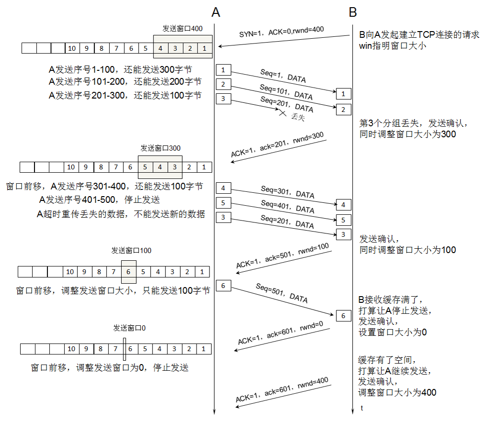

+ 如果接收方的缓存存满了，发送方还在疯狂发数据

  - 接收方只能把接收的数据包丢掉，大量的丢包会极大的浪费网络资源
  - 所以要进行流量控制

+ 什么是流量控制

  让发送方的发送速率不要太快，让接收方来得及接收数据

+ 原理

  - 通过确认报文中接收字段来控制发送方的发送速率
  - 发送方的发送窗口大小不能超过接收方的接收窗口大小
  - 当发送发收到接收方窗口大小为0时，发送方就会停止发送数据

+ 特殊情况

  ```
  一开始，接收方给发送方发送了0窗口的报文段，
  后面接收方又有了一些存储空间，给发送方发送非0窗口的报文段丢失了
  发送方的发送窗口一直为0，双方陷入僵局
  
  //解决方案
  当发送方收到0窗口通知时，这时发送方停止发送报文
  并且同时开启一个定时器，隔一段时间就发个测试报文去询问接收方最新的窗口大小
  如果接收方的窗口大小还是为0，则发送方再次刷新启动定时器
  ```

##### 拥塞控制

防止过多的数据注入网络，避免网络中的路由器或链路过载

+ 拥塞过程是个全局性的过程

  - 涉及到所有主机、路由器
  - 以及与降低网络传输性能有关的所有因素
  - 是大家共同努力的结果

+ 相比而言，流量控制是点对点通信的控制

+ 慢开始（slow start，慢启动）

  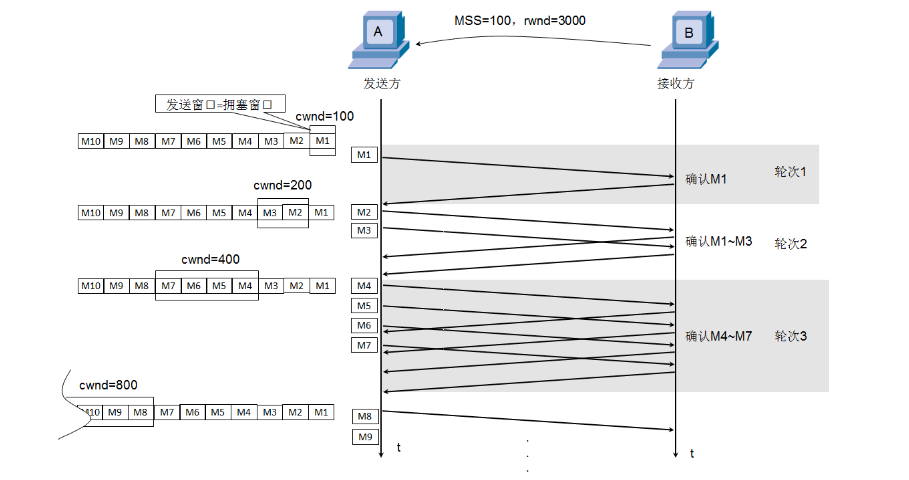

  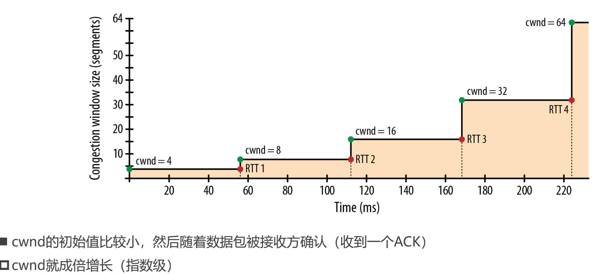

+ 拥塞避免（congestion avoidance）

  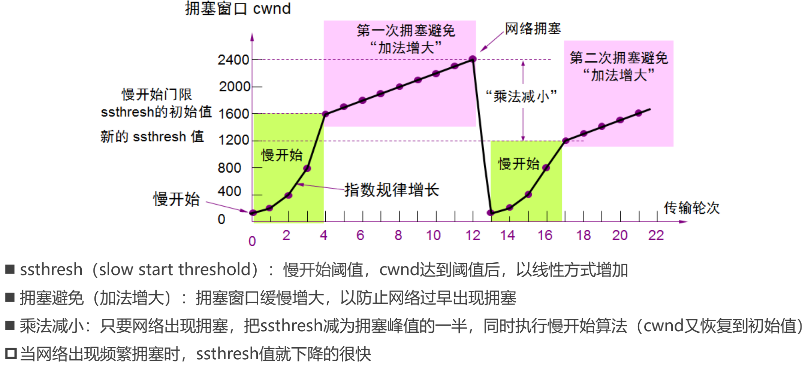

+ 快速重传（fast retransimit）

  ```
  //接收方
  每收到一个失序的分组后就立刻发出重复确认
  使发送方及时知道有分组没有到达
  而不用等待自己发送数据时才进行确认
  
  //发送方
  只要连续收到三个重复确认（总共四个相同的确认），就应当立即重传对方尚未收到的报文段
  而不必等待继续重传计时器到期后再重传
  ```

  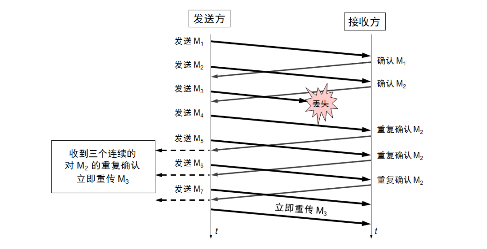

+ 快速恢复（fast recovery）

  ```
  当发送方连续收到三个重复确认，说明网络出现阻塞
  就执行“乘法减小“算法，把ssthresh减小为拥塞峰值的一半
  
  与慢开始不同之处现在不执行慢开始算法，即cwnd现在不恢复到初始值
  而是把cwnd值设置为新的ssthresh值（减小后的值）
  然后开始执行拥塞避免算法（”加分增大“），使拥塞窗口慢慢的线性增大。
  ```

  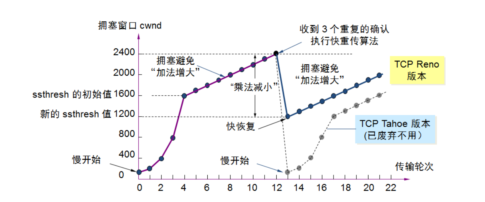

+ 发送窗口的最大值

  ```
  //几个缩写
  MSS（Maximum Segment Size）每个段最大的数据部分大小，在连接时确认
  
  cwnd（congestion window）拥塞窗口
  
  rwnd（receive window）接收窗口
  
  swnd（send window）发送窗口
  swnd=min(cwnd,rwnd)
  当rwnd<cwnd,是接收方的接收能力限制发送窗口的最大值
  当rwnd>cwnd,是网络的拥塞限制发送窗口的最大值
  ```

##### 建立连接

+ 三次握手

  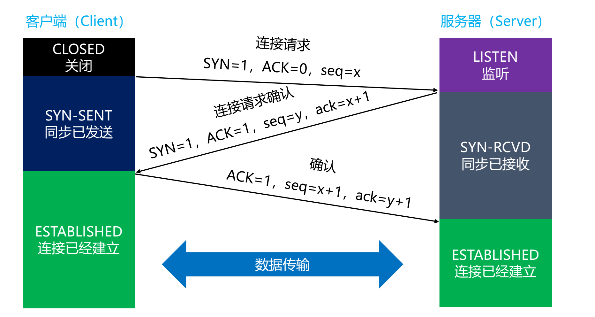

+ 状态解读

  ```
  CLOSED：客户端处于关闭状态
  LISTEN：服务器处于监听状态，等待客户端连接
  SYN-RCVD：表示服务端接收到了SYN报文，当收到客户端的ACK报文后，他会进入到ESTABLISHED状态
  SYN-SENT：表示客户端已发送SYN报文，等待服务端的第二次握手
  ESTABLISHED：表示连接已经建立
  ```

+ 前两次握手特点

  ```
  SYN都设置为1
  
  数据部分长度都为0
  
  TCP头部的长度一般都为32字节，固定头部20字节，选项部分12字节
  
  双方会交换确认一些信息
  比如MSS，是否支持SACK、Windows scale(窗口缩放系数)等
  这些数据都存放在头部信息的选项部分中（12字节）
  ```

+ 为什么需要3次握手，2次不行吗？

  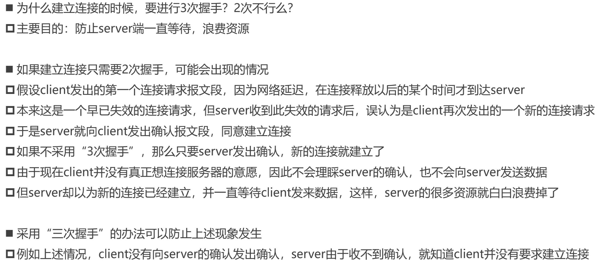

+ 第三次握手失败了，怎么处理？

  ```
  此时服务端的状态为SYN-RCVD，如果等不到客户端的ACK，服务端会重新发送SYN+ACK包
  
  如果服务端多次重发SYN+ACK都等不到客户端的ACK，就会发送RST包，强制关闭连接
  ```

##### 释放连接

+ 四次挥手

  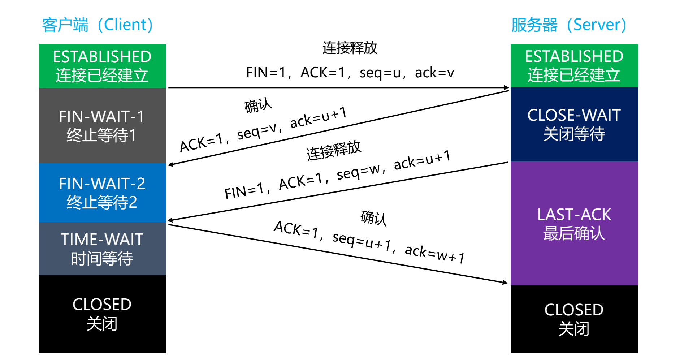

+ 状态解读

  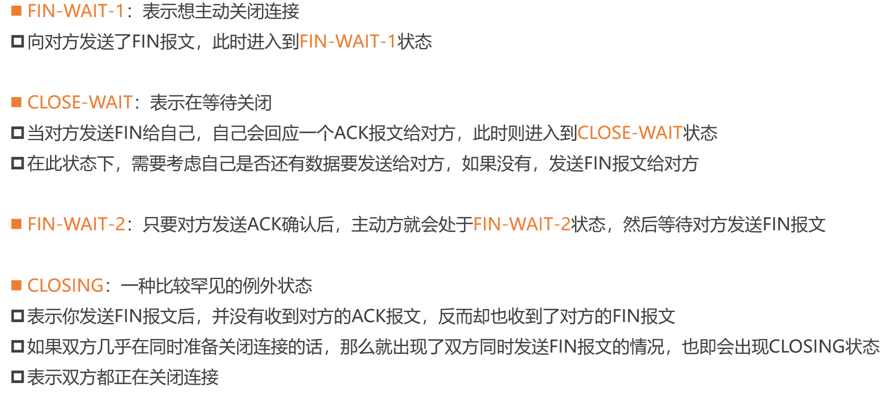

  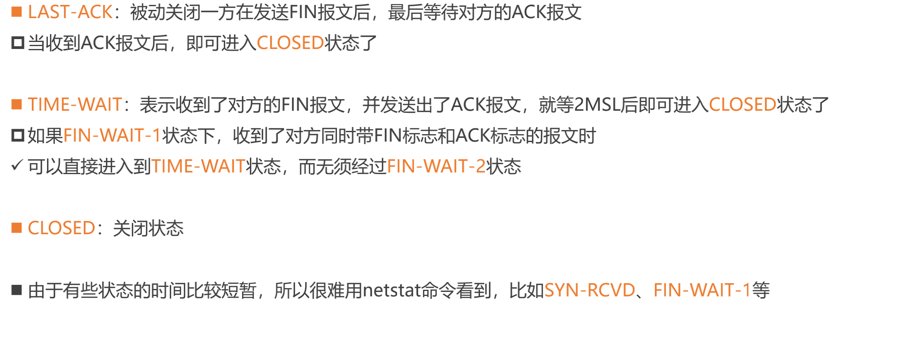

+ 细节

  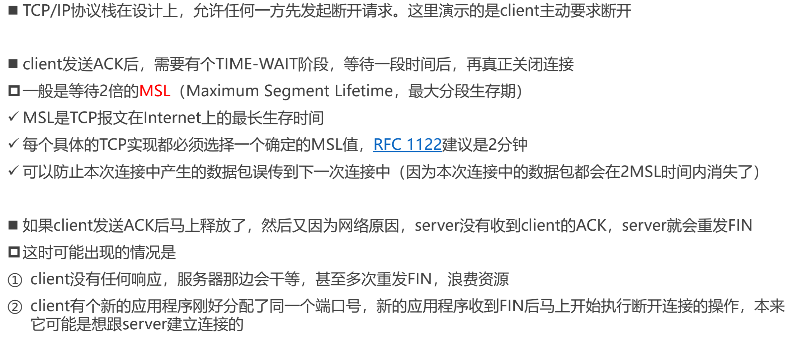

+ 相关疑问

  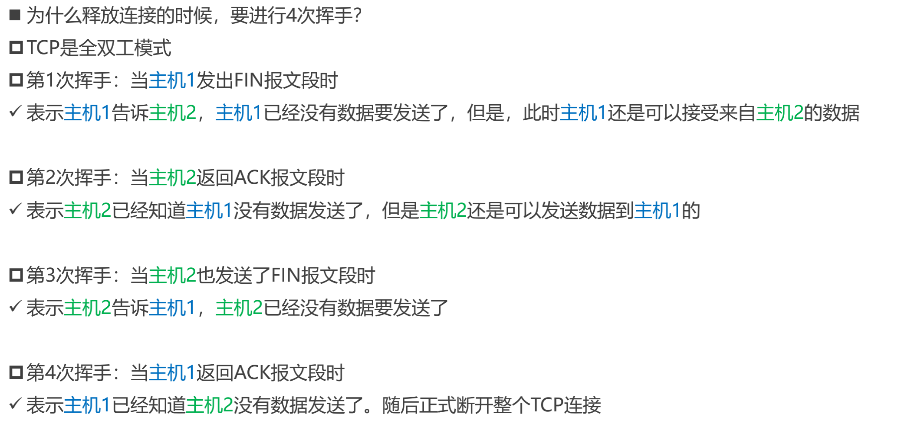

+ 抓包信息

  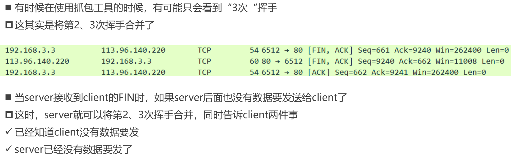

#### 默认端口号

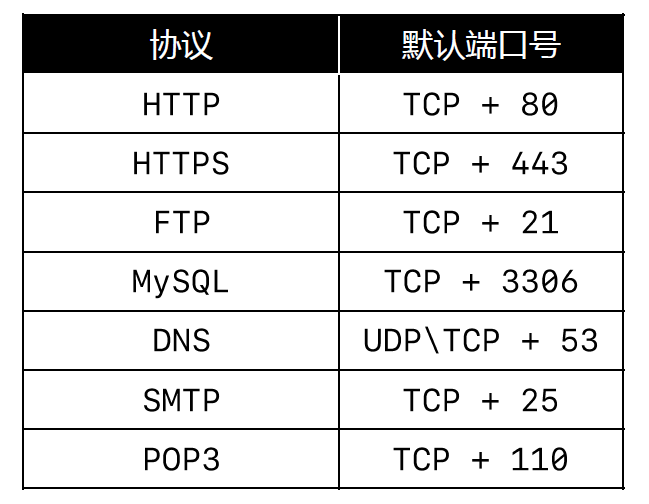

### 应用层

## 工具

+ [Packet Tracer](https://www.packettracernetwork.com/)

  Packet Tracer是一种创新的网络仿真和可视化工具。它可以帮助你通过桌面电脑或基于Android或iOS的移动设备练习网络配置和故障排除技能。Packet Tracer可用于Linux和Windows以及Mac桌面环境。

+ 

