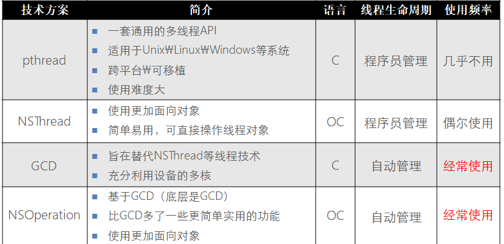

# 一、基础

## 1.1 日志输出

```objective-c
// NSLog用于日志的输出
NSLog(@"Hello, World!");  //直接输出字符串

//NSLog(@"格式化",变量); 格式化类型类似于c语言
NSLog(@"%i",a);  //输出int类型的变量
NSLog(@"%lx",b);  //输出long类型的变量  
NSLog(@"%c",c); //输出char类型的变量
NSLog(@"%f",d); //输出float类型的变量
NSLog(@"%lg",e);  //输出double类型的变量
NSLog(@"%@",c);  //输出对象类型的变量

```

## 1.2 #import指令

- 增强版的#include指令，和include差不多
- #import<>引入系统相关的类，#import “ ”表示引入非系统相关的类，

## 1.3 条件判断和循环

### 1.3.1 条件判断

```objective-c
//oc的条件和其他语言苍差不多类似，除了false和0为假外，其他都为真
if(判断语句){
   //执行逻辑
}else{
   //其他情况下执行的逻辑
}
```

### 1.3.2 循环

```objective-c
/*
     循环和其他语言差不多类似
     for循环
     语法：
     for (表达式1;表达式2;表达式3) {
      表达式4
     }
     1.初始值
     2.循环判断条件
     3.自增或者自减
     4.循环体

     while循环
     语法：
     while (表达式) {
     循环体
     }

     do while循环
     语法:
     do {
     循环体
     } while (表达式);

     //先循环一次，再执行循环条件，如果为真，接着执行循环体，直到循环条件为假时候跳出循环
*/
//例子：
    //求1-10的和
        NSInteger a = 0;
        for(int i=1;i<11; i++) {
            a = a+i;
        }
        NSLog(@"a = %ld",a);
   //while
        int c = 0;
        NSInteger b = 0;
        while(c<=10) {
            b=b+c;//b+=c;
            c++;
        }
        NSLog(@"b = %ld",b);

        int sum = 0;
        NSInteger f = 0;
        do {
            sum+=f;
            f++;
        } while(f<11);
        NSLog(@"sum = %d",sum);


        //breakcontinune
        NSInteger sum1 = 0;
        for(int j=0;j<=10; j++) {
            if(j==5){
//                break;
                continue;
            }
            sum1 +=j;
        }
        NSLog(@"sum1 = %ld",sum1);

    /*
     while和do while循环用于知道循环结束的条件情况下
     for（；；）用于知道循环次数

     三种情况可以相互转换

     break 和 continue
     break 表示终止本层循环
     continue 表示终止本次循环，进入到下次循环
     */

```

# 二、变量类型

## 2.1 数字类型

```objective-c
/**
1、int、NSInteger、NSNumber区别
int,long,NSInteger,NSLong等都是基本数据类型,
NSNumber是数据对象,可以使用NSNumber数据对象来创建和初始化不同类型的数字对象
NSInteger会根据系统的位数（32or64）自动选择int的最大数值（int or long）,官方推荐使用NSInteger
2、NSUInteger
3、@1  //表示NSNumber类型对象
**/
//第一种转换方式
        //long，double，char，float类似
        NSInteger a=6;
        NSNumber *b=[NSNumber numberWithInt:6];  //创建int类型的对象，通过numberWithXXX也可以创建其他数据类型
        
        if(a == [b intValue]){  //intValue将对象转为基本类型
            NSLog(@"true");
        }
        else{
            NSLog(@"false");
        }
//返回为true

//第二种转换方式
        NSNumber *a=@1;  //直接使用@符号来定义NSNumber对象类型
        NSInteger b=3;
        NSNumber *c=@(b);  //将基本数据类型转为NSNumber对象类型
        NSLog(@"%@,%@",a,c);
```

## 2.2 字符串类型

```objective-c
/**
1、字符串前面都需要加@，如定义字符串: NSString *str=@"abc"  //定义一个abc的字符串
2、NSString为不可变字符串
常用方法：
**/

#pragma mark 初始化字符串
void initStr() {
    //1.init
    NSString *str1 = [[NSString alloc ]init];//不可改变的空字符串 无意义
    NSString *str2 = [NSString string];
    NSLog(@"%@-----%@", str1, str2);
    //2.格式化的方式来创建字符串
    NSString *str3 = [[NSString alloc] initWithFormat:@"%iAA",2];
    NSString *str4 = [NSString stringWithFormat:@"%iBB", 3];
    NSLog(@"%@-----%@", str3, str4);
    //3.快捷方式
    NSString *str5 = @"QWE";
    NSLog(@"%@", str5);
    
}
#pragma mark 从文件中获取字符串
void getStrFromFile() {
    NSString *str = [NSString stringWithContentsOfFile:@"/Users/lanou3g/Desktop/a.txt" encoding:NSUTF8StringEncoding error:nil];
    NSLog(@"%@", str);
}
#pragma mark 字符串写入文件
void setStrInFile() {
    NSString *str = @"ABCDEFGHIJKLMNOPQRSTUVWXYZ";
    NSError *error ;
    [str writeToFile:@"/Users/lanou3g/Desktop/a.txt" atomically:YES encoding:NSUTF8StringEncoding error:&error];
    if (error)
        NSLog(@"文件写入失败%@", [error localizedDescription]);
    else
        NSLog(@"文件写入成功");
}

#pragma mark 获取字符串长度
void getStrLength() {
    NSString *str = @"赵延伟";
    str = @"AA";
    NSInteger length = [str length];//1返回的字符个数
    NSLog(@"length = %zi", length);//3
    
    length = [str lengthOfBytesUsingEncoding:NSUTF8StringEncoding];//2 返回指定编码的字节数 （针对汉字）
    NSLog(@"length = %zi", length);//9
    
    length = [str maximumLengthOfBytesUsingEncoding:NSUTF8StringEncoding];//3 返回字节存储接收器在给定的编码所需的最大数目（不知所云）
    NSLog(@"length = %zi", length);
}

#pragma mark 获取字符
void getChar() {
    NSString *str = @"ABC";
    char ch = [str characterAtIndex:1];//根据索引获取字符 ch = c
    
 //  [str getCharacters:'C' range:NSMakeRange(0, 1)];//？？？
    NSLog(@"%c",ch);
}

#

#pragma mark 获取C语言的字符串
void getCStr() {
    NSString *str = @"AAAABBC";
    const char *ch1 = [str UTF8String];//不可变的
    NSLog(@"%s",ch1);
    
  //  BOOL b= [str getCString:"12" maxLength:7 encoding:NSUTF8StringEncoding];不明确
    
    const char *ch2 = [str cStringUsingEncoding:NSUTF8StringEncoding];
    NSLog(@"%s",ch2);
    //NSLog(@"%@", str);
    
}

#pragma mark 拼接字符串
void appendStr() {
    NSString *str = @"AAA";
    NSString *temp = @"BB";
    //1
    NSLog(@"%@", [str stringByAppendingString:temp]);
    //2
    NSLog(@"%@", [str stringByAppendingFormat:@"%iKFC%.2f", 8, 3.14]);
    //3 参数说明 第一个返回的字符串长度 第二个是 追加的字符串 第三个是追加字符串的索引值
    str = [str stringByPaddingToLength:9 withString:@"233" startingAtIndex:2];
    NSLog(@"%@", str);
}

#pragma mark 拆分字符串
void didStr() {
    NSString *list = @"Karin, Carrie, David";
    NSArray *listItems = [list componentsSeparatedByString:@", "];
    NSLog(@"%@",listItems);
    
    NSString *str = @"ABCDEFGHI";
    str = [str substringFromIndex:2];//包括当前位置
    
    NSLog(@"%@",str);
    str = [str substringToIndex:6];//不包括当前位置
   
    NSLog(@"%@",str);
    str = [str substringWithRange:NSMakeRange(1, 3)];
    
    NSLog(@"%@",str);
}

#pragma mark 查找字符串
void findStr() {
    NSString *str = @"1234AAA5678";
    NSRange range = [str rangeOfString:@"AAA"];
    NSLog(@"%@", NSStringFromRange(range));
    
    range = [str rangeOfString:@"AAA" options:1];//1表示并行
    NSLog(@"%@", NSStringFromRange(range));
    
    range = [str rangeOfString:@"AAA" options:1 range:NSMakeRange(0, 6)];
    NSLog(@"%@", NSStringFromRange(range));//不存在时候 判断 range.length == 0
}
#pragma mark 替换字符串
void replaceStr() {
    NSString *str = @"1234AAA5678";
    str = [str stringByReplacingOccurrencesOfString:@"AAA" withString:@"BBB"];
    str = [str stringByReplacingCharactersInRange:NSMakeRange(6, 3) withString:@"CCC"];

    NSLog(@"%@", str);
}
```

## 2.3 布尔类型

```objective-c
/**
1. 布尔可以当做整型来用；BOOL YES NO全部是大写，没有小写；
2. 布尔类型的本质：typedef signed char BOOL;
3. 输出是YES或者NO，还有1和0
**/
BOOL d=TRUE;
if(d){
     NSLog(@"true");
}
else{
     NSLog(@"false");
}
//输出true
```

## 2.4 数字类型和字符串类型转换

```objective-c
NSString *newString="abc";
// 字符转int
int intString = [newString intValue];
// int转字符
NSString *stringInt = [NSString stringWithFormat:@"%d",intString];

// 字符转float
float floatString = [newString floatValue];
// float转字符
NSString *stringFloat = [NSString stringWithFormat:@"%f",intString];
```

# 三、变量类型二

## 3.1 数组类型

### 3.1.1 不可变数组NSArray

```objective-c
/**
1、不可存放基本数据类型，只能存放oc对象
2、可以存放多种对象类型的数据
3、一旦创建成功,内容不可改变
**/

//初始化操作
    //1)创建一个空数组
    NSArray *arr1 = [NSArray array];

    //2)创建数组,只有一个元素
    NSArray *arr2 = [NSArray arrayWithObject:@"1"];

    //3)创建数组,有多个元素
    // nil 表示数组赋值结束
    // 常见写法
    NSArray *arr3 = [NSArray arrayWithObjects:@"one",@"two",@1, nil];
                    NSLog(@"arr3 = %@",arr3);
    //4)调用对象方法,创建数组
    //nil Nil NULL  NSNULL
    NSArray *arr4 = [[NSArray alloc] initWithObjects:@"three",[NSNull null],@"four", nil];
                    NSLog(@"arr4 = %@",arr4);
    //5)用一个数组可以创建另外一个数组
    NSArray *arr5 = [NSArray arrayWithArray:arr3];


//基本使用
    NSArray *arr3 = [NSArray arrayWithObjects:@"one",@"two",@1,@"three", nil];
    NSLog(@"arr3 = %@",arr3);

    //1)获取数组的长度  count获取数组的元素的个数
    NSLog(@"%ld",arr3.count);

    //2)根据下标,获取下标对应的对象
    NSLog(@"%@",[arr3 objectAtIndex:3]);

    //3)返回元素的下标
    NSUInteger loc = [arr3 indexOfObject:@"three"];
    NSLog(@"%ld",loc);

    //4)数组中是否包含了某个元素
    if([arr3 containsObject:@"four"]){
       NSLog(@"包含此元素");
    }else{
       NSLog(@"不包含");
    }


//简化形式
    //用简化的方式,来定义和访问数组元素
    //1)用简化的方式,定义数组
    //格式: @[ 数组元素 ]
    NSArray *arr = @[@"1",@"one",@"3",@4,@"ONE"];
    NSLog(@"arr = %@",arr);
    
    NSString *str =[arr objectAtIndex:2];
    NSLog(@"%@",str);
    
    //2)用简化的方式访问数组元素
    str = arr[1];   //C语言形式的数组元素访问
    NSLog(@"%@",str);
```

#### 3.1.1.1 遍历

```objective-c
    //定义一个数组
    NSArray *arr = @[@"one",@"two",@"three",@"four"];
    
    //对数组进行遍历
    
    //1) 普通的方式,通过下标访问
    for (int i=0; i<arr.count; i++) {
        NSLog(@"-> %@",arr[i]);
    }
    
    //2) 快速枚举法 for循环的增强形式
    for (NSString * str in arr) {
         NSLog(@"---> %@",str);
    }
    

    //3) 使用block的方式,进行访问(目前还未理解该方式)
    //                               数组元素            元素下标     是否停止
    //stop:YES  会停止, stop:NO 不会停止
    [arr enumerateObjectsUsingBlock:^(id obj, NSUInteger idx, BOOL *stop) {
        if(idx == 2){
           *stop = YES;  //停止  // break;     
        }else{
           NSLog(@"idx = %ld,obj = %@",idx,obj);
        }
    }];
```

#### 3.1.1.2 文件读写

```objective-c
//将NSArray写入文件
   NSArray *array = [NSArray arrayWithObjects:@"one",@"zbz",@"cgx",@"sb",@"cjk",@"senni", nil];
   //把NSArray 中的内容,写入到文件中
   //arr.plist 一种特殊的文件格式
   BOOL isWrite =  [array writeToFile:@"/Users/zhaoxiaohu/Desktop/arr.xml" atomically:YES];
   if(isWrite){
      NSLog(@"写入成功");
   }

//从文件中读取NSArray对象
  NSArray *readArr = [NSArray arrayWithContentsOfFile:@"/Users/zhaoxiaohu/Desktop/arr.xml"];
  NSLog(@"readArr = %@",readArr);
```

#### 3.1.1.3 拼接成字符串和拆分成NSArray

```objective-c
//将数组拼接成字符串
  
  //1)需求: 把数组中的元素用 "-" 连接起来
  //  [数组 componentsJoinedByString @"分隔符"];
  // 1-2-3-4
  NSString *str = [arr componentsJoinedByString:@"-"];
  NSLog(@"str = %@",str);

//将字符串拆分成数组
  //2) 给一个字符串,分割成一个数组
  // 400-800-12580 //取得 400 12580 800
  NSString *str2 = @"400-800-12580";
  NSArray *arr2 = [str2 componentsSeparatedByString:@"-"];
  NSLog(@"%@",[arr2 firstObject]);  
  NSLog(@"%@",[arr2 lastObject]);
  NSLog(@"%@",arr2[1]);
```

### 3.1.2 可变数组NSMutableArray

```objective-c
1、可变数组，继承于不变数组NSArry；
2、不可变数组的方法都可以用于可变数组

//初始化
  //创建一个空的可变数组
  NSMutableArray *arr = [[NSMutableArray alloc]init];
  //给一个初始化容量
  NSMutableArray *arr1 = [[NSMutableArray alloc]initWithCapacity:10];
  //类方法
  NSMutableArray *arr2 = [NSMutableArray array]
    
//添加元素
   NSArray *arr = @[@“zjp”,@“ww”,@“jjj”,@“ww”,@“ahk”];
   NSMutableArray *arr1 = [[NSMutableArray alloc]init];
   NSMutableArray *arr2 = [NSMutableArray array];//类方法 
   //增加一个对象
   [arr1 addObject:@"jay"];
   //从数组里增加对象元素
   [arr1 addObjectsFromArray:arr];
   NSLog(@"arr1= %@",arr1);
   //插入
   //插入元素 在指定的下标位置
   [arr1 insertObject:@"hello" atIndex:0];

//删除元素
   //删除 指定下标的元素
   [arr1 removeObjectAtIndex:0];
   NSLog(@"arr1= %@",arr1);
        
   //删除最后 一个元素
   [arr1 removeLastObject];
   NSLog(@"arr1= %@",arr1);
        
   //删除指定元素 如果你数组里有多个相同的元素，也会一起删除
   [arr1  removeObject:@"ww"];
   NSLog(@"arr1= %@",arr1);
        
    //删除指定范围的 元素
    NSRange range = {0,2};
    [arr1 removeObject:@"zjp" inRange:range];
    NSLog(@"arr1= %@",arr1);
        
    //删除指定范围里的 所有元素
    [arr1 removeObjectsInRange:range];
    NSLog(@"arr1= %@",arr1);
        
    //删除指定数组的所有元素
    [arr1 removeObjectsInArray:@[@"zjp"]];
    NSLog(@"arr1= %@",arr1);
        
    //删除指定下标集合的元素
    //下标集合类
    NSMutableIndexSet *indexSet = [[NSMutableIndexSet alloc]init];
    [indexSet addIndex:0];//把下标0放进集合里
    [indexSet addIndex:1];//把下标2放进集合里
    [arr1 removeObjectsAtIndexes:indexSet];
    NSLog(@"arr1= %@",arr1);
        
    //删除数组的所有元素
    [arr1 removeAllObjects];
    NSLog(@"arr1= %@",arr1);

//元素交换
    NSMutableArray *array = [NSMutableArray arrayWithObjects:@"1",@"2",@"3",@"4",@"5",nil]
    //交换元素
    //交换指定下标的数组元素
    NSLog(@"array= %@",array);
    [array exchangeObjectAtIndex:0 withObjectAtIndex:4];
    NSLog(@"array= %@",array);
        
    //替换指定下标的元素   
    [array replaceObjectAtIndex:4 withObject:@"6"];
    NSLog(@"array= %@",array);
```

### 3.1.3 NSSet

```objective-c
/**
1、NSSet集合其实和NSArray集合很类似，只不过NSArray集合时有序的，NSSet集合是无序的。
2、这个方面是和java中的Set是类似的。
3、NSSet和我们常用NSArry区别是：在搜索一个一个元素时NSSet比NSArray效率高，主要是它用到了一个算法hash(散列，也可直译为哈希)
**/
```

## 3.2 字典类型

### 3.2.1 不可变字典NSDictionary

```objective-c
//初始化操作    
    NSDictionary *dic=[NSDictionary dictionaryWithObject:@"卢灿小样" forKey:@"lucan"];
    NSLog(@"%@",dic);
    NSLog(@"%@",[dic objectForKey:@"lucan"]);
    //输出dic键值对个数
    NSLog(@"%d",dic.count);
    
    //用多种方法创建键值对
    NSDictionary *dic1=[NSDictionary dictionaryWithObject:@"卢灿实验2号" forKey:@"小样"];
    NSLog(@"%@",[dic1 objectForKey:@"小样"]);
    
    NSDictionary *dic2=@{@"first":@"2301",@"sec":@"2034"};
    NSDictionary *dic3=[NSDictionary dictionaryWithObjectsAndKeys:@"刘湘",@"name",@"小样",@"name1", nil];
    //输出结果
    NSLog(@"  ----%@%@",dic2,dic3);
    
    //数组把vaule和key放到一个可变数组
    NSArray *values=@[@123,@668,@345];
    NSArray *key=@[@"first",@"swcond",@"third"];
    NSDictionary *dic4=[NSDictionary dictionaryWithObject:values forKey:key];
    NSLog(@"xxxxxxxxxxxx%@",dic4);

    //用一个现有字典对象初始化另一个新字典对象(创建可变对象)
    NSDictionary *arry1=[[NSDictionary alloc]initWithDictionary:dic4 ];
    NSLog(@"ooooooo%@",arry1);
```

#### 3.2.1.1 遍历

```objective-c
    //字典的遍历key1相当于a[i]中的i，dic4就自己定义的字典
    for (id key1 in dic4) {
        id vaule=[dic4 objectForKey:key1];
        NSLog(@"qqqqqq%@%@",key,vaule);
    }
```

#### 3.2.1.2 文件读写

```objective-c
    //保存对象到内容文件
    NSString *path=@"/Users/apple/Desktop/test.plist";
    [dic2 writeToFile:path atomically:YES];
    
    //从以前保存的文件读取到字典对象
    NSDictionary *data=[NSDictionary dictionaryWithContentsOfFile:path];
    NSLog(@"xxxxx%@",data);
```

### 3.2.2 可变字典NSMutableDictionary

```objective-c
    //删除键值对
    NSMutableDictionary  *dic7=[NSMutableDictionary dictionaryWithDictionary:dic2];
    [dic7 removeObjectForKey:@"sec"];
    NSLog(@"%@",dic7);
    
    // 判断key值有就替换没有就添加
    [dic7 setObject:@"3412" forKey:@"sec"];
    NSLog(@"%@",dic7);
    
    //增加dic4  字典无顺序
    [dic7 addEntriesFromDictionary:dic4];
    NSLog(@"%@",dic7);
```

# 四、类

## 入门

### 1.如何声明一个类

- 注意：
    + 1.必须以@interface开头，@end结尾
    + 2.成员变量的声明，必须写在@interface与@end之间的大括号中
    + 3.方法的声明必须在{}下面，不能写在{}中

---

### 2.如何实现一个类
- 格式

```objc
@implementation MyClass

- (id)initWithString:(NSString *)aName
{
    //写代码处
}

+ (MyClass *)myClassWithString:(NSString *)aName
{
    //写代码处
}

@end

```
- 注意：
    + 1.必须以@implementation开头，@end结尾
    + 2.类名必须和声明的一致

##3.如何创建一个对象
- 用类的方式告诉计算机，我们需要一个什么样的对象，之后我们要在程序中使用这个对象，就必须先创建一个对象


- 注意[Car new];做了三件事
    + 1.在堆内存中开辟了一块新的存储空间
    + 2.初始化成员变量(写在类声明大括号中的属性就叫成员变量,也叫实例变量)
    + 3.返回指针地址

- 消息机制
    + 使用对象调用方法就是OC中的消息机制
    + OC中调用方法的格式：[类名或者对象名 方法名];


### 4.对象的注意点
- 可以通过 对象->对象成员(注意声明属性为:@public) 的方式访问对象中的成员,
- 每一个对象中都有一份属于自己的属性。
- 对其中一个对象的成员进行了修改。和另一个对象没有关系

## 对象方法的声明和实现
---

### 1.对象方法声明
- 特征
    + 对象方法以-开头如 -(void)xx;
    + 对象方法只能由对象来调用
    + 对象方法中可以访问当前对象的成员变量
    + 调用格式 [对象名 对象方法名];

- 示例

```objc
//声明没有返回值的对象方法
- (void)method;
//声明有返回值的对象方法
- (int)method;
//声明有返回值有参数的对象方法
- (int)method: (int)var;
//声明有返回值有多个参数的对象方法
- (int)method: (int)var1 andVar2: (int)var2;

```
---

### 2.对象方法实现

    + 必须写在以@implementation开头，@end之间
    + 在声明的后面加上{}即表示实现
    + 将需要实现的代码写在{}中
---

## 类方法的声明和实现
---

### 1.类方法声明
- 特征
    + 类方法以+开头 如+(void)put;
    + 类方法只能由类来调用
    + 类方法中不能访问实例(成员)变量,因为类方法由类来调用,并没有创建存储空间来存储类中的成员变量。

- 类方法的好处:
    + 节省内存空间
    + 不依赖于对象,执行效率更高;
    + 能用类方法解决的问题,尽量使用类方法;

- 类方法的场合:
    + 当方法内部不需要使用到成员变量时,可以改为类方法
    + 类方法一般用于编写工具方法

- 示例

```objc
//声明没有返回值的类方法
+ (void)method;
//声明有返回值的类方法
+ (int)method;
//声明有返回值有参数的类方法
+ (int)method: (int)var;
//声明有返回值有多个参数的类方法
+ (int)method: (int)var1 andVar2: (int)var2;

```
---

### 2.类方法实现
    + 必须写在以@implementation开头，@end之间
    + 在声明的后面加上{}即表示实现
    + 将需要实现的代码写在{}中

---

### 3.对象方法和类方法区别

- 对象方法
    + 对象方法是属于对象的
    + 以减号-开头
    + 只能让对象调用，没有对象，这个方法根本不可能被执行
    + 对象方法能访问实例变量（成员变量）
    + 对象方法中可以调用当前对象的对象方法
    + 对象方法中可以调用其他对象的对象方法
    + 对象方法中不可以调用类方法
- 类方法
    + 类方法是属于类的
    + 以加号+开头
    + 只能用类名调用，对象不能调用
    + 类方法中不能直接访问实例变量（成员变量）
    + 类方法中不能直接调用对象方法，要想调用对象方法，必须创建或传入对象。

- 使用场合：
    + 当不需要访问成员变量的时候，尽量用类方法

- 类方法和对象方法可以同名


## 结构体成员变量
---

### 1.结构体成员变量
```objc
设计一个”学生“类 1> 属性
* 姓名
* 生日
用结构体作为类的实例变量(生日)
```

```objc
#import <Foundation/Foundation.h> //定义生日的结构体
typedef struct{
    int year;
    int month;
    int day;
}MyDate;

@interface Person : NSObject
{
    @public
    NSString *_name;//定义姓名 MyDate _birthday;//定义生日
}
@end

@implementation Person
@end


int main(int argc, const char * argv[]) {
    Person *p = [Person new];
    p->_name = @"sb";

    //因为结构体已经初始化为0了,在次初始化就报错了,但是可以逐个赋值。
    //p->_birthday = {1990,12,3};
    p->_birthday.year = 2014;
    p->_birthday.month = 05;
    p->_birthday.day = 12;
    NSLog(@"%@的生日是:%d年%d月%d 日",p->_name,p->_birthday.year,p->_birthday.month,p->_birthday.day);

    //也可以整体赋值
    MyDate de={1993,11,11};
    p->_birthday = de;
    NSLog(@"%@的生日是:%d年%d月%d 日",p->_name,p->_birthday.year,p->_birthday.month,p->_birthday.day);
    return 0;
}
```
---
## id类型
---


### 1.静态类型和动态类型
- 静态类型
    + 将一个指针变量定义为特定类的对象时,使用的是静态类型,在编译的时候就知道这个指针变量所属的类,这个变量总是存储特定类的对象。

```objc
Person *p = [Person new];
```

- 动态类型
    + 这一特性是程序直到执行时才确定对象所属的类

```objc
id obj = [Person new];
```
---

### 2.为什么要有动态类型?
- 我们知道NSObject是OC中的基类
- 那么任何对象的NSObject类型的指针可以指向任意对象，都没有问题
- 但是NSObject是静态类型，如果通过它直接调用NSObject上面不存在的方法，编译器会报错。
- 你如果想通过NSObject的指针调用特定对象的方法，就必须把NSObject * 这种类型强转成特定类型。然后调用。如下

```objc
//定义NSObject * 类型
 NSObject* obj = [Cat new];
 Cat *c = (Cat*)obj;
 [c eat];
```

- id 是一种通用的对象类型,它可以指向属于任何类的对象,也可以理解为万能指针 ,相当于C语言的 void *
- 因为id是动态类型,所以可以通过id类型直接调用指向对象中的方法, 编译器不会报错

```objc
/// Represents an instance of a class.
struct objc_object {
    Class isa  OBJC_ISA_AVAILABILITY;
};

/// A pointer to an instance of a class.
typedef struct objc_object *id;
```

```objc
 id obj = [C at new];
 [obj eat]; // 不用强制类型转换

 [obj test]; //可以调用私有方法
```
- 注意：
    + 在id的定义中,已经包好了*号。id指针只能指向OC中的对象
    + 为了尽可能的减少编程中出错，Xcode做了一个检查，当使用id 类型的调用本项目中所有类中都没有的方法，编译器会报错
    + id类型不能使用.语法, 因为.语法是编译器特性, 而id是运行时特性

##3.id数据类型与静态类型
- 虽然说id数据类型可以存储任何类型的对象，但是不要养成滥用这种通用类型
    + 如没有使用到多态尽量使用静态类型
    + 静态类型可以更早的发现错误(在编译阶段而不是运行阶段)
    + 静态类型能够提高程序的可读性
    + 使用动态类型前最好判断其真实类型

- 动态类型判断类型
    + \- (BOOL)isKindOfClass:classObj 判断实例对象是否是这个类或者这个类的子类的实例

```objc
    Person *p = [Person new];
    Student *stu = [Student new];

    BOOL res = [p isKindOfClass:[Person class]];
    NSLog(@"res = %i", res); // YES
    res = [stu isKindOfClass:[Person class]];
    NSLog(@"res = %i", res); // YES
```

    - (BOOL) isMemberOfClass: classObj 判断是否是这个类的实例


```objc
    Person *p = [Person new];
    Student *stu = [Student new];

    BOOL res = [p isMemberOfClass:[Person class]];
    NSLog(@"res = %i", res); // YES
    res = [stu isMemberOfClass:[Person class]];
    NSLog(@"res = %i", res); // NO
```

    + (BOOL) isSubclassOfClass:classObj 判断类是否是指定类的子类


```objc
    BOOL res = [Person isSubclassOfClass:[Student class]];
    NSLog(@"res = %i", res); // NO

    res = [Student isSubclassOfClass:[Person class]];
    NSLog(@"res = %i", res); // YES
```


---
## new方法实现原理
---

### 1.new方法实现原理
- 完整的创建一个可用的对象:Person *p=[Person new];
- new方法的内部会分别调用两个方法来完成3件事情:
    + (1)使用alloc方法来分配存储空间(返回分配的对象);
    + (2)使用init方法来对对象进行初始化。
    + (3)返回对象的首地址

```objc
This method is a combination of alloc and init. Like alloc, it initializes the isa instance variable of the new object so it points to the class data structure. It then invokes the init method to complete the initialization process.
```

- 可以把new方法拆开如下:
    + (1)调用类方法+alloc分配存储空间,返回未经初始化的对象```Person *p1=[person alloc];```
    + (2)调用对象方法-init进行初始化,返回对象本身
```Person *p2=[p1 init];```
    + (3)以上两个过程整合为一句:```Person *p=[[Person alloc] init];```

- 说明：
    + alloc 与 init合起来称为构造方法，表示构造一个对象
    + alloc 方法为对象分配存储空间，并将所分配这一块区域全部清0.
```objc
The isa instance variable of the new instance is initialized to a data structure that describes the class; memory for all other instance variables is set to 0.
```
    + init方法是初始化方法（构造方法），用来对象成员变量进行初始化，默认实现是一个空方法。
```
An object isn’t ready to be used until it has been initialized. The init method defined in the NSObject class does no initialization; it simply returns self.
```

- 所以下面两句的作用是等价的
```objc
Person *p1 = [Person new];
Person *p = [[Person alloc] init];
```
- iOS 程序通常使用[[类名 alloc] init] 的方式创建对象，因为这个可以与其他initWithXX:...的初始化方法，统一来。代码更加统一

## 构造方法
---


### 1.重写init方法
- 想在对象创建完毕后，成员变量马上就有一些默认的值就可以重写init方法

- 重写init方法格式:

```objc
- (id)init {
    self = [super init];
    if (self) {
        // Initialize self.
    }
    return self;
}

```


    + [super init]的作用:
面向对象的体现,先利用父类的init方法为子类实例的父类部分属性初始化。
    + self 为什么要赋值为[super init]:
简单来说是为了防止父类的初始化方法release掉了self指向的空间并重新alloc了一块空间。还有[super init]可能alloc失败,这时就不再执行if中的语句。

- 重写init方法其它格式

```objc
- (id)init {
    if (self = [super init]) {
        // Initialize self.
    }
    return self;
}
```
---

### 2.练习
- 要求通过Person类创建出来的人初始化值都是10岁。

```objc
@implementation Person

- (instancetype)init
{
    if (self = [super init]) {
        _age = 10;
    }
    return self;
}
@end
```

- 让学生继承人类,要求学生对象初始化之后,年龄是10,学号是1,怎么办?

```objc
@implementation Person

- (instancetype)init
{
    if (self = [super init]) {
        _age = 10;
    }
    return self;
}
@end

@implementation Student

- (instancetype)init
{
    if (self = [super init]) {
        _no = 1;
    }
    return self;
}
@end
```


### 3.构造方法使用注意
- 子类拥有的成员变量包括自己的成员变量以及从父类继承而来的成员变量,在重写构造方法的时候应该首先对从父类继承而来的成员变量先进行初始化。
    + 原则:先初始化父类的,再初始化子类的。
        * 先调用父类的构造方法[super init];
        * 再进行子类内部成员变量的初始化。
- 千万不要把`self = [super init]`写成self `==` [super init]

- 重写构造方法的目的:为了让对象方法一创建出来,成员变量就会有一些固定的值。


### 4.instancetype的作用
- instancetype与id相似，不过instancetype只能作为方法返回值，它会进行类型检查，如果创建出来的对象，赋值了不相干的对象就会有一个警告信息，防止出错。

```objc
// init此时返回值是id
NSString *str = [[Person alloc] init];
// Person并没有length方法, 但是id是动态类型, 所以编译时不会报错
NSLog(@"length = %i", str.length);
```


```objc
// init此时返回值是instancetype
// 由于instancetype它会进行类型检查, 所以会报警告
NSString *str = [[Person alloc] init];
NSLog(@"length = %i", str.length);
```


```objc
instancetype *p = [[person alloc] init];
// 错误写法instancetype只能作为返回值
```

## 自定义构造方法
---

### 1.自定义构造方法
- 有时候仅仅靠重写构造方法（初始化方法），不能满足需求。比如一个班级中不可能所有学生的年龄都一样，这时候我们需要在创建某个学生的时候能够传入这个学生的年龄。这时候就需要来自定义构造函数（初始化函数）

- 自定义构造方法的规范
    + (1)一定是对象方法,以减号开头
    + (2)返回值一般是instancetype类型
    + (3)方法名必须以initWith开头

- 示例

```objc
@interface Person : NSObject

@property int age;

@property NSString *name;

// 当想让对象一创建就拥有一些指定的值,就可以使用自定义构造方法
- (id)initWithAge:(int)age;

- (id)initWithName:(NSString *)name;

- (id)initWithAge:(int)age andName:(NSString *)name;

@end
```
---

## getter/setter方法
---

### 1.setter方法
- 作用：用来设置成员变量，可以在方法里面过滤掉一些不合理的值

- 命名规范：
    + 必须是对象方法
    + 返回值类型为void
    + 方法名必须以set开头，而且后面跟上成员变量名去掉”_” 首字母必须大写
    + 必须提供一个参数，参数类型必须与所对应的成员变量的类型一致
    + 形参名称和成员变量去掉下划线相同

- 举例：
```objc
如：如果成员变量为int _age 那么与之对应seter方法为
-(void) setAge: (int) age;
```

- setter方法的好处
    + 不让数据暴露在外,保证了数据的安全性
    + 对设置的数据进行过滤

---

### 2.getter方法
- 作用：为调用者返回对象内部的成员变量的值

- 命名规范：
    + 必须是对象方法
    + 必须有返回值,返回值的类型和成员变量的类型一致
    + 方法名必须是成员变量去掉下划线
    + 一定是没有参数的

- 举例

```objc
如：如果成员变量为int _age 那么与之对应geter方法为
- (int) age;
```

- getter方法的优点：
    + 可以让我们在使用getter方法获取数据之前,对数据进行加工；
    + 比如双十一活动，我们希望对全线商品的价格在原来的价格基础上打五折，那么我们只要去改成品类的价格的getter方法就可以了，让他返回的值为价格 * 0.5

---

### 3.getter/setter方法注意
- 在实际的开发中,不一定set和get方法都会提􏰀供,如果内部的成员变量,比如学生的学号或计算出来的数据。这样的数据只允许外界读取，但是不允许修改的情况,则通常只提􏰀供get方法而不􏰀提供set方法
。

- 成员变量名的命名以下划线开头,get方法名不需要带下划线

- 成员变量名使用下划线开头有两个好处
    + 与get方法的方法名区分开来
    + 可以和一些其他的局部变量区分开来,下划线开头的变量,通常都是类的成员变量。当我看到以下划线开头变量，那么他一定是成员变量

---

## 点语法

---
### 1.点语法基本使用

---

### 2.点语法的本质
- 其实点语法的本质还是方法调用
- 当使用点语法时，编译器会自动展开成相应的方法


- 当点语法使用在 “=“赋值符号左侧的时候，点语法会被展开为setter方法的调用，其他情况（等号右侧、直接使用）为点语法展开为getter方法的调用


---

### 3.点语法注意
- 点语法的本质是方法的调用,而不是访问成员变量,当使用点语法时,编译器会自动展开成相应的方法调用。

- 切记点语法的本质是转换成相应的对setter和getter方法调用,如果没有set和get方法,则不能使用点语法。

- 不要在getter 与  setter方法中使用本属性的点语法

```objc
- (void) setAge:(int)age {
    // 下面的代码会引发死循环
    self.age = age;
        //编译器展开后 [self setAge:age]
}


- (int) age {
    // 下面的代码会引发死循环
    return self.age;
          // 编译器展开后 [self   age]
}

```
---
## OC中的私有方法和变量
---

### 1.OC中的私有变量
- 在类的实现即.m文件中也可以声明成员变量,但是因为在其他文件中通常都只是包含头文件而不会包含实现文件,所以在.m文件中声明的成员变量是@private的。在.m中定义的成员变量不能和它的头文件.h中的成员变量同名,在这期间使用@public等关键字也是徒劳的。

```objc
@implementation Dog
{
    @public
    int _age;
}
@end
```
---

### 2.OC中的私有方法
- 私有方法：只有实现没有声明的方法
- 原则上：私有方法只能在本类的方法中才能调用。

    + >注意: OC中没有真正的私有方法

```objc
@interface Dog : NSObject

@end
@implementation Dog

- (void)eat
{
    NSLog(@"啃骨头");
}
@end
int main(int argc, const char * argv[]) {

    Dog *d = [Dog new];
    SEL s1 = @selector(eat);
    [d performSelector:s1];

    return 0;
}
```
## @property和@synthesize关键字
### @property
---

#### 1.什么是@property
- @property是编译器的指令
- 什么是编译器的指令 ？
    + 编译器指令就是用来告诉编译器要做什么！

- @property会让编译器做什么呢？
    + @property 用在声明文件中告诉编译器声明成员变量的的访问器(getter/setter)方法
    + 这样的好处是:免去我们手工书写getter和setter方法繁琐的代码

---

#### 2.@property基本使用
- 在@inteface中,用来自动生成setter和getter的声明

```objc
用@property int age;就可以代替下面的两行
- (int)age;   // getter
- (void)setAge:(int)age;  // setter
```

- @property编写步骤

```objc
1.在@inteface和@end之间写上@property
2.在@property后面写上需要生成getter/setter方法声明的属性名称, 注意因为getter/setter方法名称中得属性不需要_, 所以@property后的属性也不需要_.并且@property和属性名称之间要用空格隔开
3.在@property和属性名字之间告诉需要生成的属性的数据类型, 注意两边都需要加上空格隔开
```
---

### @property增强
---


#### 1.@property增强
- 自从Xcode 4.x后，@property可以同时生成setter和getter的声明和实现

```objc
@interface Person : NSObject
{
    int _age;
}
@property int age;
@end
```
---

#### 2.@property增强注意点
- 默认情况下，setter和getter方法中的实现，会去访问下划线 _ 开头的成员变量。

```objc
@interface Person : NSObject
{
    @public
    int _age;
    int age;
}
@property int age;

@end

int main(int argc, const char * argv[]) {

    Person *p = [Person new];
    [p setAge:30];
    NSLog(@"age = %i, _age = %i", p->age, p->_age);

    return 0;
}
```

- 如果没有会自动生成一个_开头的成员变量,自动生成的成员变量是私有变量, 声明在.m中,在其它文件中无法查看,但当可以在本类中查看


- @property只会生成最简单的getter/setter方法,而不会进行数据判断

```objc
Person *p = [Person new];
[p setAge:-10];
NSLog(@"age = %i", [p age]);
```
- 如果需要对数据进行判断需要我们之间重写getter/setter方法
    + 若手动实现了setter方法，编译器就只会自动生成getter方法
    + 若手动实现了getter方法，编译器就只会自动生成setter方法
    + 若同时手动实现了setter和getter方法，编译器就不会自动生成不存在的成员变量

---
### @property修饰符
---

#### 1.@property修饰符
- 修饰是否生成getter方法的
    + readonly    只生成setter方法，不生成getter方法
    + readwrite  既生成getter 又生成setter方法（默认）

```objc
@property (readonly) int age;
```

- 指定所生成的方法的方法名称
    + getter=你定制的getter方法名称
    + setter=你定义的setter方法名称(注意setter方法必须要有 :)

```objc
@property (getter=isMarried)  BOOL  married;
说明，通常BOOL类型的属性的getter方法要以is开头
```

---
### @property参数
---

#### 1.控制set方法的内存管理
- retain ： release旧值，retain新值（用于OC对象）
- assign ： 直接赋值，不做任何内存管理(默认，用于非OC对象类型)
- copy   ： release旧值，copy新值（一般用于NSString *）

#### 2.控制需不需要生成set方法
- readwrite ：同时生成set方法和get方法（默认）
- readonly  ：只会生成get方法

#### 3.多线程管理
- atomic    ：性能低（默认）
- nonatomic ：性能高

#### 4.控制set方法和get方法的名称
- setter ： 设置set方法的名称，一定有个冒号:
- getter ： 设置get方法的名称


- 注意: 不同类型的参数可以组合在一起使用

### @synthesize基本概念
---

#### 1.什么是@synthesize
- @synthesize是编译器的指令
- 什么是编译器的指令 ？
    + 编译器指令就是用来告诉编译器要做什么！
- @synthesize会让编译器做什么呢？
    + @synthesize 用在实现文件中告诉编译器实现成员变量的的访问器(getter/setter)方法
    + 这样的好处是:免去我们手工书写getterr和setter方法繁琐的代码

---

#### 2.@synthesize基本使用
- 在@implementation中, 用来自动生成setter和getter的实现

```objc
用@synthesize age = _age;就可以代替
- (int)age{
	return _age;
}
- (void)setAge:(int)age{
	_age = age;
}
```

- @synthesize编写步骤

```objc
1.在@implementation和@end之间写上@synthesize
2.在@synthesize后面写上和@property中一样的属性名称, 这样@synthesize就会将@property生成的什么拷贝到@implementation中
3.由于getter/setter方法实现是要将传入的形参 给属性和获取属性的值,所以在@synthesize的属性后面写上要将传入的值赋值给谁和要返回哪个属性的值, 并用等号连接
```

- 以下写法会赋值给谁?

```objc
@interface Person : NSObject
{
    @public
    int _age;
    int _number;
}

@property int age;

@end

@implementation Person

@synthesize age = _number;

@end

int main(int argc, const char * argv[]) {

    Person *p = [Person new];
    [p setAge:30];
    NSLog(@"_number = %i, _age = %i", p->_number, p->_age);

    return 0;
}
```
---

#### 3.@synthesize注意点
- @synthesize age = _age;
    + setter和getter实现中会访问成员变量_age
    + 如果成员变量_age不存在，就会自动生成一个@private的成员变量_age

- @synthesize age;
    + setter和getter实现中会访问@synthesize后同名成员变量age
    + 如果成员变量age不存在，就会自动生成一个@private的成员变量age

- 多个属性可以通过一行@synthesize搞定,多个属性之间用逗号连接

```objc
@synthesize age = _age, number = _number, name  = _name;

```
---
## Self关键字
---

- OC提􏰀供了两个保留字self和super
    + OC语言中的self,就相当于C++、Java中的this指针。
- 要理解什么是self，什么是成员变量，什么是对象方法，什么是类方法
- 成员变量:成员变量是一个实例对象的具体状态特征，并且这些状态特征是可以改变的，如张三的年龄，身高，体重等
- 对象方法：一个实例对象的行为，比如张三具有吃的行为，张三做出这样行为的时候，有可能会影响，自身的某些状态特征，比如张三吃可能会增加张三体重和身高。
- 类方法：类方法是某个类的行为，可以直接通过类名调用；如果在类方法中需要使用某些数据，必须通过参数传入；它不能访问成员变量。

---
### 1.类方法中的self
- 在整个程序运行过程中，`一个类有且仅有一个类对象`。
- 通过`类名`调用方法就是给这个`类对象`发送消息。
- 类方法的self就是这个类对象
- 在类方法中可以通过self来调用其他的类方法
- 不能在类方法中去调用对象方法或成员变量，因为对象方法与成员变量都是属于具体的实例对象的。

### 2.对象方法中的self
- 在整个程序运行过程中，`对象可以有0个或多个`
- 通过`对象`调用方法就是给这个`对象`发送消息
- 对象方法中self就是调用这个方法的当前对象。
- 在对象方法中，可以通过self来调用本对象上的其他方法
- 在对象方法中，可以通过self来访问成员变量

### 3.全局变量成员变量局部变量
- 全局变量：只要是有声明它的地方都能使用
- 成员变量：只能在本类和其子类的对象方法中使用
- 局部变量：只能在本函数或方法中使用
- 从作用域的范围来看：全局变量 > 成员变量 > 局部变量
- 当不同的作用域中出现了同名的变量，内部作用域的变量覆盖外部作用域变量，所以同名变量的覆盖顺序为：局部变量覆盖成员变量，成员变量覆盖全局变量
- 如果在对象方法中出现与成员变量同名的局部变量，如果此时想使用该成员变量可以通过self->成员变量名的方式

---

### 4.self总结
- 谁调用self所在的方法，那么self就是谁
- self在类方法中，就是这个类的类对象，全局只有一个，可通过self调用本类中的其他类方法，但是不能通过self来调用对象方法或访问成员变量
- self在对象方法中，就是调用这个方法的那个对象， 可以通过self调用本类中其他的对象方法，访问成员变量，但不能通过self调用本类的类方法。

- 通过self调用方法的格式：[self  方法名];
- 通过self访问成员变量格式：self->成员变量名

---

### 5.self使用注意
- 同时有对象方法和类方法存在的时候,self不会调错
- self只能在方法中使用;不要使用self来调用函数，也不可以在函数内部使用self；
- 使用self调用本方法，导致死循环调用。

---

## 继承
---

### 1.继承基本概念
---

### 2.OC中的继承关系
- B类继承A类，那么B类将拥有A类的所有属性和方法，此时我们说A类是B类的父类，B类是A类的子类

- C类继承B类，那么C类将拥有B类中的所有属性和方法，包括B类从A类中继承过来的属性和方法，此时我们说B类是C类的父类，C类是B类的子类

- 注意:
    + 基类的私有属性能被继承,不能在子类中访问。
    + OC中的继承是单继承:也就是说一个类只能一个父类,不能继承多个父类
    + 子类与父类的关系也称为isA（是一个）关系，我们说 子类isA父类，也就是子类是一个父类，比如狗类继承动物类，那么我们说狗isA动物，也就是狗是一个动物。在如汽车继承交通工具，那么们说汽车isA交工工具，也就是汽车是一个交通工具
    + 继承的合理性:引用《大话西游》里的一句话来描述继承的。“人是人他妈生的,妖是妖他妈生的!”

---

### 3.OC中如何实现继承
- 在声明子类的时候，在子类名称后面通过：父类名称方式来实现继承

```objc
@interface 子类名称 : 父类名称

@end

```
---
## 继承相关特性
---
### 1.方法重写
- 在子类中实现与父类中同名的方法，称之为方法重写；
- 重写以后当给子类发送这个消息的时候，执行的是在子类中重写的那个方法，而不是父类中的方法。
- 如果想在子类中调用被子类重写的父类的方法，可以通过super关键字
- 使用场景：当从父类继承的某个方法不适合子类,可以在子类中重写父类的这个方法。

### 2.继承中方法调用的顺序
- 1、在自己类中找
- 2、如果没有,去父类中找
- 3、如果父类中没有,就去父类的父类中
- 4、如果父类的父类也没有,就还往上找,直到找到基类(NSObject)
- 5、如果NSObject都没有就报错了
    
    >+ 如果找到了就执行这个方法，就不再往后查找了

---

### 3.继承的注意事项
- 子类不能定义和父类同名的成员变量，私有成员变量也不可以；因为子类继承父类，子类将会拥有父类的所有成员变量，若在子类中定义父类同名成员变量 属于重复定义。

- OC类支持单一继承,不支持多继承；也就是说一个类只能有一个直接父类

- OC类支持多层继承 ,如下图所示


## Super关键字
##本小节知识点:
1.super基本概念
2.super的作用

---
### 1.super基本概念
- super是个编译器的指令符号,只是告诉编译器在执行的时候,去调谁的方法.
    
    >+ self是一个隐私参数;
```objc
self refers to the object receiving a message in objective-C programming.
```
    >+ super 并不是隐藏的参数，它只是一个“编译器指示符”，它和 self 指向的是相同的消息接收者

```objc
super is a flag that tells the compiler to search for the method implementation in a very different place. It begins in the superclass of the class that defines the method where super appears.
```

### 2.super的作用
    + 1.直接调用父类中的某个方法
    + 2.super在对象方法中，那么就会调用父类的对象方法
     super在类方法中，那么就会调用父类的类方法

- 使用场合：
    + 子类重写父类的方法时想保留父类的一些行为

---

## 实例变量修饰符

---

### 1.实例变量的作用域


- 1)@public (公开的)在有对象的前􏰀下,任何地方都可以直接访问。
- 2)@protected (受保护的)只能在当前类和子类的对象方法中访问
- 3)@private (私有的)只能在当前类的对象方法中才能直接访问
- 4)@package (框架级别的)作用域介于私有和公开之间,只要处于同一个框架中相当于@public,在框架外部相当于@private

---

### 2.变量修饰符在子类中的访问
- 1)@private私有成员是能被继承,也不能被外部方法访问。
- 2)@public 公有成员能被继承,也能被外部方法访问。
- 3)@protected 保护成员能够被继承,不能够被外部方法访问。


---

### 3.实例变量作用域使用注意事项
- (1)在@interface @end之间声明的成员变量如果不做特别的说明,那么其默认是protected 的。
- (2)一个类继承了另一个类,那么就拥有了父类的所有成员变量和方法,注意所有的成员变量它都拥有,只是有的它不能直接访问。例如@private的

---
## 继承中的自定义构造方法
---

### 1.继承中的自定义构造方法

- 不能在子类访问父类私有变量

```objc
@interface Person : NSObject

@property int age;

- (id)initWithAge:(int)age;
@end


@interface Student : Person

@property NSString *name;

- (id)initWithAge:(int)age andName:(NSString *)name;
@end

@implementation Student

- (id)initWithAge:(int)age andName:(NSString *)name
{
    if (self = [super init]) {
//        这个_Age是父类中通过property自动在.m中生成的无法继承,不能直接访问
//        _age = age;
        [self setAge:age];
        _name = name;
    }
    return self;
}
@end
```

- 父类的属性交给父类的方法来处理

```objc
@interface Person : NSObject

@property int age;

- (id)initWithAge:(int)age;
@end


@interface Student : Person

@property NSString *name;

- (id)initWithAge:(int)age andName:(NSString *)name;
@end

@implementation Student

- (id)initWithAge:(int)age andName:(NSString *)name
{
    if (self = [super initWithAge:age]) {
        _name = name;
    }
    return self;
}
@end

```


---

### 2.自定义构造方法的使用注意
- (1)自己做自己的事情
- (2)父类的属性交给父类的方法来处理,子类的方法处理子类自己独有的属性

- 自定义构造方法必须以intiWith开头,并且’W’必须大写

---

# 五 线程



## NSThread

### 创建线程的三种方式

```objective-c
//1.alloc init 创建线程,需要手动启动线程
//线程的生命周期:当任务执行完毕之后被释放掉
-(void)createNewThread1
{
    //1.创建线程
    /*
     第一个参数:目标对象  self
     第二个参数:方法选择器 调用的方法
     第三个参数:前面调用方法需要传递的参数 nil
     */
    XMGThread *threadA = [[XMGThread alloc]initWithTarget:self selector:@selector(run:) object:@"ABC"];
    
    //设置属性
    threadA.name = @"线程A";
    //设置优先级  取值范围 0.0 ~ 1.0 之间 最高是1.0 默认优先级是0.5
    threadA.threadPriority = 1.0;
    
    //2.启动线程
    [threadA start];

    
//    NSThread *threadB = [[NSThread alloc]initWithTarget:self selector:@selector(run:) object:@"ABC"];
//    threadB.name = @"线程b";
//    threadB.threadPriority = 0.1;
//    [threadB start];
//    
//    NSThread *threadC = [[NSThread alloc]initWithTarget:self selector:@selector(run:) object:@"ABC"];
//    threadC.name = @"线程C";
//    [threadC start];
}

//2.分离子线程,自动启动线程
-(void)createNewThread2
{
    [NSThread detachNewThreadSelector:@selector(run:) toTarget:self withObject:@"分离子线程"];
}

//3.开启一条后台线程
-(void)createNewThread3
{
    [self performSelectorInBackground:@selector(run:) withObject:@"开启后台线程"];
}

-(void)run:(NSString *)param
{
   NSLog(@"---run----%@---%@",[NSThread currentThread].name,param);
//    for (NSInteger i = 0; i<10000; i++) {
//        NSLog(@"%zd----%@",i,[NSThread currentThread].name);
//    }
}
```

### 线程的状态

```objective-c
-(void)touchesBegan:(NSSet<UITouch *> *)touches withEvent:(UIEvent *)event
{
    //1.创建线程,新建
    NSThread *thread = [[NSThread alloc]initWithTarget:self selector:@selector(task) object:nil];
    
    //2.启动线程,就绪<---->运行
    [thread start];
}

-(void)run
{
    NSLog(@"run----%@",[NSThread currentThread]);
    
    //阻塞线程
    //[NSThread sleepForTimeInterval:2.0];
    [NSThread sleepUntilDate:[NSDate dateWithTimeIntervalSinceNow:3.0]];
    
    NSLog(@"end---");
}

-(void)task
{
    for (NSInteger i = 0; i<100 ;i++) {
        NSLog(@"%zd---%@",i,[NSThread currentThread]);
        
        if (i == 20) {
           // [NSThread exit];  //退出当前线程
            break;              //表示任务已经执行完毕.
        }
    }
}
```

### 线程同步

```objective-c
#import "ViewController.h"

@interface ViewController ()
/** 售票员A */
@property (nonatomic, strong) NSThread *threadA;
/** 售票员B */
@property (nonatomic, strong) NSThread *threadB;
/** 售票员C */
@property (nonatomic, strong) NSThread *threadC;

@property (nonatomic, assign) NSInteger totalCount;
@end

@implementation ViewController

-(void)touchesBegan:(NSSet<UITouch *> *)touches withEvent:(UIEvent *)event
{
    
    //设置中票数
    self.totalCount = 100;
     self.threadA = [[NSThread alloc]initWithTarget:self selector:@selector(saleTicket) object:nil];
     self.threadB = [[NSThread alloc]initWithTarget:self selector:@selector(saleTicket) object:nil];
     self.threadC = [[NSThread alloc]initWithTarget:self selector:@selector(saleTicket) object:nil];
    self.threadA.name = @"售票员A";
    self.threadB.name = @"售票员B";
    self.threadC.name = @"售票员C";
    
    //启动线程
    @synchronized(self) {
        [self.threadA start];
        [self.threadB start];
        [self.threadC start];
    } 
}

-(void)saleTicket
{
    while (1) {
        
    //锁:必须是全局唯一的
    //1.注意枷锁的位置
    //2.注意枷锁的前提条件,多线程共享同一块资源
    //3.注意加锁是需要代价的,需要耗费性能的
    //4.加锁的结果:线程同步
        
    @synchronized(self) {
        //线程1
        //线程2
        //线程3
        NSInteger count = self.totalCount;
        if (count >0) {
            
            for (NSInteger i = 0; i<1000000; i++) {
            }
            
            self.totalCount = count - 1;
            //卖出去一张票
            NSLog(@"%@卖出去了一张票,还剩下%zd张票", [NSThread currentThread].name,self.totalCount);
        }else
        {
            NSLog(@"不要回公司上班了");
            break;
        }
        }
    }
}
@end
```

### 线程间通信

```objective-c
//线程间通信的体现:
1个线程传递数据给另1个线程
在1个线程中执行完特定任务后，转到另1个线程继续执行任务

//线程间通信常用方法
- (void)performSelectorOnMainThread:(SEL)aSelector withObject:(id)arg waitUntilDone:(BOOL)wait;    //回到主线程
- (void)performSelector:(SEL)aSelector onThread:(NSThread *)thr withObject:(id)arg waitUntilDone:(BOOL)wait;  //回到上个线程

-(void)touchesBegan:(NSSet<UITouch *> *)touches withEvent:(UIEvent *)event
{
    [NSThread detachNewThreadSelector:@selector(download) toTarget:self withObject:nil];
}

#pragma mark ----------------------
#pragma Methods

//开子线程下载图片,回到主线程刷新UI
-(void)download
{
    //1.确定URL
    NSURL *url = [NSURL URLWithString:@"http://img4.duitang.com/uploads/blog/201310/18/20131018213446_smUw4.thumb.700_0.jpeg"];
    
    //2.根据url下载图片二进制数据到本地
    NSData *imageData = [NSData dataWithContentsOfURL:url];
    
    //3.转换图片格式
    UIImage *image = [UIImage imageWithData:imageData];
    
    NSLog(@"download----%@",[NSThread currentThread]);
    
    //4.回到主线程显示UI
    /*
     第一个参数:回到主线程要调用哪个方法
     第二个参数:前面方法需要传递的参数 此处就是image
     第三个参数:是否等待
     */
    //[self performSelectorOnMainThread:@selector(showImage:) withObject:image waitUntilDone:NO];
    
//    [self performSelector:@selector(showImage:) onThread:[NSThread mainThread] withObject:image waitUntilDone:YES];
    
    [self.imageView performSelectorOnMainThread:@selector(setImage:) withObject:image waitUntilDone:YES];
    
//    self.imageView.image = image;
    NSLog(@"---end---");
}

//计算代码段执行时间的第一种方法
-(void)download1
{
    //0.000018
    //0.166099
    
    //1.确定URL
    NSURL *url = [NSURL URLWithString:@"http://img4.duitang.com/uploads/blog/201310/18/20131018213446_smUw4.thumb.700_0.jpeg"];

    NSDate *start = [NSDate date];  //获得当前的时间
    
    //2.根据url下载图片二进制数据到本地
    NSData *imageData = [NSData dataWithContentsOfURL:url];
    
    NSDate *end = [NSDate date];  //获得当前的时间
    NSLog(@"%f",[end timeIntervalSinceDate:start]);
    
    //3.转换图片格式
    UIImage *image = [UIImage imageWithData:imageData];
    
    //4.显示UI
    self.imageView.image = image;
}

//计算代码段执行时间的第二种方法
-(void)download2
{
    //1.确定URL
    NSURL *url = [NSURL URLWithString:@"https://img4.duitang.com/uploads/blog/201310/18/20131018213446_smUw4.thumb.700_0.jpeg"];
    
    CFTimeInterval start = CFAbsoluteTimeGetCurrent();
    
    //2.根据url下载图片二进制数据到本地
    NSData *imageData = [NSData dataWithContentsOfURL:url];
    
    CFTimeInterval end = CFAbsoluteTimeGetCurrent();
    NSLog(@"end-start = %f---%f---%f",end - start,end,start);
    
    //3.转换图片格式
    UIImage *image = [UIImage imageWithData:imageData];
    
    //4.显示UI
    self.imageView.image = image;
}

//更新UI操作
-(void)showImage:(UIImage *)image
{
    self.imageView.image = image;
    NSLog(@"UI----%@",[NSThread currentThread]);
}
```


# 六 网络

