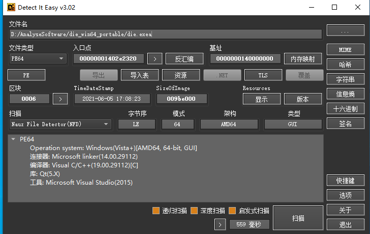
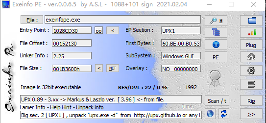

# Windows

## 开发

## 逆向

### PE结构

+ [好文,深度阅读](https://blog.csdn.net/weixin_43655282/article/details/104291312?utm_medium=distribute.pc_relevant.none-task-blog-BlogCommendFromMachineLearnPai2-1.channel_param&depth_1-utm_source=distribute.pc_relevant.none-task-blog-BlogCommendFromMachineLearnPai2-1.channel_param)

### 工具

+ [Detect-It-Easy](https://github.com/horsicq/Detect-It-Easy)（查看exe信息）

  

+ [Exeinfo PE](http://www.exeinfo.xn.pl/)（exe查壳工具）

  

+ [CFF Explorer](https://www.52pojie.cn/thread-321284-1-1.html)（查看PE结构）

+ 静态分析IDA

+ 动态调试x64dbg或者Ollydbg