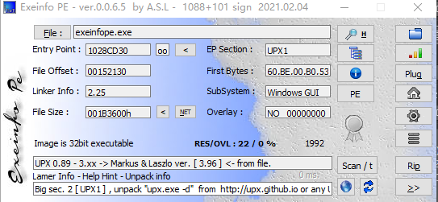

# Windows

目前开发的Windows的有Electron、QT、Flutter、Winform、WPF

## 开发

+ [C#](../C#.md)
+ [C++](C++.md)
+ [精易c#编程助手 是一款辅Zhu c#快速开发的工具](https://bbs.125.la/thread-14394234-1-1.html)

## 逆向

### 学习

+ PE结构
  - [好文,深度阅读](https://blog.csdn.net/weixin_43655282/article/details/104291312?utm_medium=distribute.pc_relevant.none-task-blog-BlogCommendFromMachineLearnPai2-1.channel_param&depth_1-utm_source=distribute.pc_relevant.none-task-blog-BlogCommendFromMachineLearnPai2-1.channel_param)
+ x86以及x86_64汇编
+ Widnows API

### 工具

+ [dnSpy](https://github.com/0xd4d/dnSpy)

  .Net的逆向工具，可以对C#代码修改

+ [Detect-It-Easy](https://github.com/horsicq/Detect-It-Easy)（查看exe信息）

  

+ [Exeinfo PE](http://www.exeinfo.xn.pl/)（exe查壳工具）

  

+ [CFF Explorer](https://www.52pojie.cn/thread-321284-1-1.html)（查看PE结构）

+ 静态分析IDA

+ 动态调试

  - 64位调试：x64dbg或者IDA Pro
  - 32调试：OllyDbg

### Electron软件破解

突破点app.asar资源文件

#### 调试

+ [调试工具](https://github.com/bytedance/debugtron)

+ [插入代码调试

  ```js
  //打开软件会自动调试,类似chrome的devTools
   this.view.webContents.openDevTools();   //在main.js里面加
  ```

#### 破解

+ app.asar

  大部分的页面资源文件都在这里面。

  ```
  //安装asar包
  npm install -g asar
  
  //拆包
  asar extract app.asar <目录名>
  
  //组包
  asar pack <目录名> app.asar
  ```

#### 参考

+ [Electron软件简单破解](https://blue-bird1.github.io/posts/electroncrack/)

