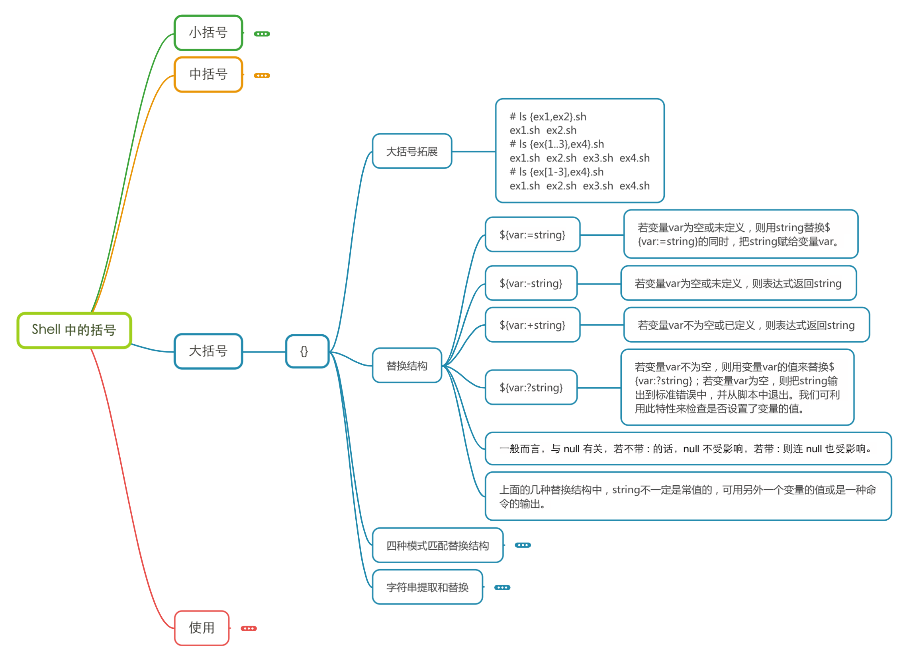
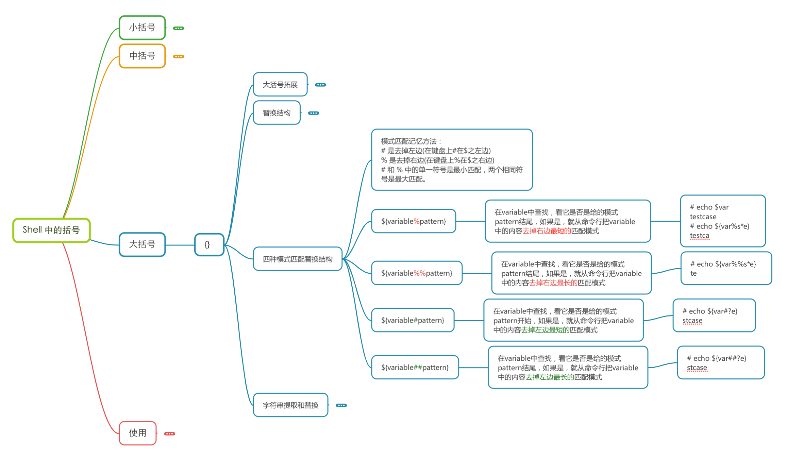

# Shell

## 基础

### 第一个例子

```bash
# Windows下面没有shell，可以借助Git
# sh脚本的第一行表示设置的解释器路径，最开始的#不是注释
#! F:\Git\bin\bash.exe
echo 'Hello,World'

# mac或者linux默认带有shell脚本解释器
#! /bin/bash
echo 'Hello,World'
```

### 注释

```bash
# 通过每一行加一个 # 号设置多行注释

# 多行注释(不太好记)
```

### 知识点

#### 单引号、双引号、反引号

```bash
# 单引号（''）中的所有字符都将保持字面意义。
# 双引号（""）中除了美元符号、单引号、反引号和反斜杠之外，其他所有的字符都将保持字面意义。
# 反引号（``）中的字符将被解释为shell命令

# 1. 打印同一个字符串，反引号中的字符会被解释为shell命令执行。
# 2. 单引号里面的字符就只是普通的字符，不会有任何含义，而双引号里面可以调用变量
# 3. 反引号里面也可以调用变量，但是必须是能运行的shell命令。

```

#### 小括号、中括号、大括号

##### 小括号


##### 中括号


##### 大括号






##### 使用


### 变量

```bash
# 1、系统变量
$HOME（当前用户的家目录）
$USER（当前用户名）
$PWD（当前的目录）
$SHELL（当前使用解释器的路径）

# 2、自定义变量
# 定义变量
# 等号两侧一定不要有空格，
# 变量默认类型都为字符串类型，不能直接进行数值运算
# 变量中如果有空格，一定要使用单引号或者双引号括起来
test=10
test1=11

# 使用变量（前面需要加$符号）
echo $test
# 同时输出两个变量
echo "$test $test1"

# 只读变量
readonly test=10
# 这句报错,只读变量不能修改
test=20 

# 删除变量（不可删除只读变量）
unset test

# 全局环境变量（可把变量提升为全局变量，可以供其他shell使用，比如JAVA_HOME）
export test

# 3、特殊变量
# n为数字，$0表示该脚本名称，$1~$9代表第一到第九个参数，十以上的参数需要使用大括号包含，如${10}
$n
# 获取所有输入参数个数，常用于循环
$#
# 代表命令行中所有的参数，$*把所有的参数看成一个整体
$*
# 代表命令行中所有的参数，$@把每个参数区别对待
$@
# 最后一次执行命令的返回状态，如果这个变量的值为0，证明上一次命令正确执行，如果这个变量的值为非0，则证明上一次命令执行不正确了
$?
```

#### 状态码

Shell中运行的每个命令都使用退出状态码告诉shell它运行完毕。退出状态码：0-255的整数值，在命令结束运行时由命令传给shell。变量$?用于保存上个已执行命令的退出状态码。退出状态码可配合内置变量exit使用。比如exit 0 表示正常退出。

| 状态码 | 描述                       |
| ------ | -------------------------- |
| 0      | 命令成功结束               |
| 1      | 一般性未知错误             |
| 2      | 不适合的shell命令          |
| 126    | 命令不可执行               |
| 127    | 没找到命令                 |
| 128    | 无效的退出                 |
| 128+x  | 与Linux信号x相关的严重错误 |
| 130    | 通过ctrl+c终止的命令       |
| 255    | 正常范围之外的退出状态码   |

### 数据类型

#### 字符串

```bash
# 定义
str='this is a string'   # 单引号定义
str="Hello, I know you are \"$your_name\"! \n" # 双引号定义

# 字符串拼接
your_name="runoob"
# 使用双引号拼接
greeting="hello, "$your_name" !"
greeting_1="hello, ${your_name} !"
echo $greeting  $greeting_1
# 使用单引号拼接
greeting_2='hello, '$your_name' !'
greeting_3='hello, ${your_name} !'
echo $greeting_2  $greeting_3
# 输出结果
hello, runoob ! hello, runoob !
hello, runoob ! hello, ${your_name} !

# 获取字符串长度
string="abcd"
test=${#string}
echo $test #输出 4

# 提取字符串
string="runoob is a great site"
echo ${string:1:4} # 输出 unoo

# 查找子字符串
string="runoob is a great site"
echo `expr index "$string" io`  # 输出 4
```

#### 数组

```bash
# 定义
array_name=(value0 value1 value2 value3)

# 读取数组
${数组名[下标]}

# 获取数组的长度
# 取得数组元素的个数
length=${#array_name[@]}
# 或者
length=${#array_name[*]}
# 取得数组单个元素的长度
lengthn=${#array_name[n]}
```

### 运算符

```bash
# 运算符计算的四种方式
a=10
b=11
# 第一种方式
c="$[$a+$b]"
# 第二种方式
d="$(($a+$b))"
# 第三种方式（expr运算符间要有空格）
e=`expr $a + $b`
# 第四种方式
f=$(expr ${a} + ${b})

# 运算符比较的方式
if [ $a != $b ];then  
   echo "eq"  
fi

# 算数运算符
+	加法	`expr $a + $b` 结果为 30。
-	减法	`expr $a - $b` 结果为 -10。
\*	乘法	`expr $a \* $b` 结果为  200。
/	除法	`expr $b / $a` 结果为 2。
%	取余	`expr $b % $a` 结果为 0。
=	赋值	a=$b 将把变量 b 的值赋给 a。
==	相等。用于比较两个数字，相同则返回 true。	[ $a == $b ] 返回 false。
!=	不相等。用于比较两个数字，不相同则返回 true。	[ $a != $b ] 返回 true。

# 关系运算符
-eq	检测两个数是否相等，相等返回 true。	[ $a -eq $b ] 返回 false。
-ne	检测两个数是否不相等，不相等返回 true。	[ $a -ne $b ] 返回 true。
-gt	检测左边的数是否大于右边的，如果是，则返回 true。	[ $a -gt $b ] 返回 false。
-lt	检测左边的数是否小于右边的，如果是，则返回 true。	[ $a -lt $b ] 返回 true。
-ge	检测左边的数是否大于等于右边的，如果是，则返回 true。	[ $a -ge $b ] 返回 false。
-le	检测左边的数是否小于等于右边的，如果是，则返回 true。	[ $a -le $b ] 返回 true。

# 布尔运算符
!	非运算，表达式为 true 则返回 false，否则返回 true。	[ ! false ] 返回 true。
-o	或运算，有一个表达式为 true 则返回 true。	[ $a -lt 20 -o $b -gt 100 ] 返回 true。
-a	与运算，两个表达式都为 true 才返回 true。	[ $a -lt 20 -a $b -gt 100 ] 返回 false。

# 逻辑运算符
&&	逻辑的 AND	[[ $a -lt 100 && $b -gt 100 ]] 返回 false
||	逻辑的 OR	[[ $a -lt 100 || $b -gt 100 ]] 返回 true

# 字符串运算符
=	检测两个字符串是否相等，相等返回 true。	[ $a = $b ] 返回 false。
!=	检测两个字符串是否不相等，不相等返回 true。	[ $a != $b ] 返回 true。
-z	检测字符串长度是否为0，为0返回 true。	[ -z $a ] 返回 false。
-n	检测字符串长度是否不为 0，不为 0 返回 true。	[ -n "$a" ] 返回 true。
$	检测字符串是否为空，不为空返回 true。	[ $a ] 返回 true。

# 文件测试运算符
-b file	检测文件是否是块设备文件，如果是，则返回 true。	[ -b $file ] 返回 false。
-c file	检测文件是否是字符设备文件，如果是，则返回 true。	[ -c $file ] 返回 false。
-d file	检测文件是否是目录，如果是，则返回 true。	[ -d $file ] 返回 false。
-f file	检测文件是否是普通文件（既不是目录，也不是设备文件），如果是，则返回 true。	[ -f $file ] 返回 true。
-g file	检测文件是否设置了 SGID 位，如果是，则返回 true。	[ -g $file ] 返回 false。
-k file	检测文件是否设置了粘着位(Sticky Bit)，如果是，则返回 true。	[ -k $file ] 返回 false。
-p file	检测文件是否是有名管道，如果是，则返回 true。	[ -p $file ] 返回 false。
-u file	检测文件是否设置了 SUID 位，如果是，则返回 true。	[ -u $file ] 返回 false。
-r file	检测文件是否可读，如果是，则返回 true。	[ -r $file ] 返回 true。
-w file	检测文件是否可写，如果是，则返回 true。	[ -w $file ] 返回 true。
-x file	检测文件是否可执行，如果是，则返回 true。	[ -x $file ] 返回 true。
-s file	检测文件是否为空（文件大小是否大于0），不为空返回 true。	[ -s $file ] 返回 true。
-e file	检测文件（包括目录）是否存在，如果是，则返回 true。	[ -e $file ] 返回 true。
```

###  流程控制

#### if

```bash
# if
if condition
then
    command1 
    command2
    ...
    commandN 
fi

# if else
if condition
then
    command1 
    command2
    ...
    commandN
else
    command
fi

# if else-if else
if condition1
then
    command1
elif condition2 
then 
    command2
else
    commandN
fi
```

#### case

```shell
# case ... esac
case 值 in
模式1)
    command1
    command2
    ...
    commandN
    ;;
模式2）
    command1
    command2
    ...
    commandN
    ;;
esac

# 例子
a=11
case $a in
10)
    echo 'hello,world'
;;
11)
    # 下面这条语句会输出
    echo 'world'
;;
esac
```

#### while

```shell
# while语句
while condition
do
    command
done

# 例子（从1到9的和）
s=0
i=1
while [ $i -le 10 ]; do
    s=$[$s+$i]
    i=$[$i+1]
done
# 输出55
echo "${s}"

# util 循环
until condition
do
    command
done

```

#### for

```shell
# for 循环
# 第1种方式
for((初始值;循环控制条件;变量变化))
do
  程序
done

# 例子
s=0
for((i=0;i<10;i++)) 
do
   s=$[$s+$i]
done
# 输出45
echo "${s}"

# 第2种方式
for var in item1 item2 ... itemN
do
    command1
    command2
    ...
    commandN
done

# 例子（遍历数组）
array=(1 2 3 4 5)
s=0
for i in ${array[@]}
do
   s=$[$s+$i]
done
# 输出15
echo "${s}"
```

#### break和continue

```bash
# break和continue
# break命令允许跳出所有循环（终止执行后面的所有循环）
# continue命令与break命令类似，只有一点差别，它不会跳出所有循环，仅仅跳出当前循环。
```

## 函数

### 系统函数

#### basename

```bash
# 基本语法  basename[string/pathname][suffix]
# 功能描述  basename命令会删除所有的前缀包括最后一个（‘/’）字符,然后将字符串显示出来
# 选项  suffix为后缀，如果suffix被指定了，basename会将string或pathname中的suffix去掉

filepath='/user/home/lijie/1.txt'
# 输出1.txt
basename $filepath
# 输出1
basename $filepath .txt
```

#### dirname

```shell
# 基本语法 dirname 文件绝对路径
# 功能描述 从给定的包含绝对路径的文件名中去除文件名（非目录的部分），然后返回剩下的路径（目录的部分）

filepath='/user/home/lijie/1.txt'
# 输出/user/home/lijie
dirname $filepath
```

### 自定义函数

```shell
# 基本语法
[ function ] funname[()]
{
     Action;
     [return int;]
}
funname

# 注意点
# 1.必须在调用函数之前先声明函数，shell脚本是逐行执行的，不会像其他语言一样先编译
# 2.函数返回值，只能通过$?系统变量获得，可以显示加return 返回，如果不加，将以最后一条命令运行结果作为返回值。return后只能跟数值n（0-255）

sum()
{
   s=0
   # $1和$2表示函数的第一个参数和第二个参数
   s=$[$1+$2]
   echo "${s}"
   # 只能返回0-255的数值
   return $s;
}

# 调用函数,后面跟着两个参数
sum 200 300
# 返回值500大于255，只能输出244
echo $?
```

## 其他

### read读取控制台输入

```shell
# 语法 read (选项) (参数)
# 选项 -p：指定读取值时的提示符； -t：指定读取值时等待的时间（秒）
# 参数 指定读取值的变量名

# 例子
read a
echo "${a}"

# 只等待2秒
read -t 2 -p "Enter the Name in 2 seconds：" Name
echo $Name
```

### shell工具之cut命令

```shell
# cut的工作就是剪，具体的说就是在文件中负责剪切数据用的。cut命令从文件的每一行剪切字节、字符和字段并将这些字符、字节和字段输出
# 基本语法 cut [选项参数] filename
# 选项参数 -f：列号，提取第几列  -d：分隔符，按照指定分隔符指定列（默认分隔符是制表符）

# 分隔出$PATH里面前面两个冒号的字段并输出
echo $PATH | cut -f -3 -d :
# 分隔出$PATH里面后面第二个冒号后面的并输出
echo $PATH | cut -f 3- -d :
# 分隔出$PATH里面后面第一、第二、第三个冒号的字段并输出
echo $PATH | cut -f 1,2,3 -d :
```

### shell工具之sed命令

```shell
# sed是一种流编辑器，它一次处理一行内容，处理时，把当前处理的行存储在临时缓冲区中，称为”模式空间“，接着用sed命令处理缓冲区中的内容，处理完成后，把缓冲区中的内容送到屏幕。接着处理下一行，这样不断重复，直到文件末尾。文件内容并没有改变，除非你使用重定向存储输出。
# 基本语法 sed [选项参数] ‘command’ filename
# 选项参数 -e：直接在指令列模式上进行sed的动作编辑 -i：需要改变文件内容需要添加这个参数
# 命令功能 a：新增（a的后面可以接字符串，在下一行出现） d：删除  s：查找并替换

# 2a表示第二行新增，sed.txt文件中的内容并不会改变
sed "2a li hao" sed.txt
# 删除sed.txt中的wo
sed "/wo/d" sed.txt
# 替换sed.txt文件中的所有的wo为ni，g表示全部替换
sed "s/wo/ni/g" sed.txt
```

### shell工具之awk命令

```shell
# 一个强大的文本分析工具，把文件逐行的读入，以空格为默认分隔符将每行切片，切开的部分再进行处理
# 基本语法 awk [选项参数] ‘pattern1{action1} pattern2{action2} .....’ filename
# pattern：表示awk在数据中查找的内容，就是匹配模式或者条件（条件：BEGIN、END、关系运算符。 内建变量：NF	当前处理的行的字段个数 NR（当前处理的行的行号）FS（列分割符。指定每行文本的字段分隔符，默认为空格或制表位。与-F作用相同）、$0（当前处理的行的整行内容）、$n（当前处理行的第n个字段（第n列））、FILENAME	（被处理的文件名）、RS（行分隔符。awk从文件上读取资料时,将根据RS的定义把资料切割成许多条记录,而awk一次仅读入一条记录,以进行处理。预设值是’\n’）。
）
# action：在找到匹配内容时所执行的一系列命令
# 选项参数 -F：指定输入文件拆分隔符  -v：赋值用户一个定义变量

# 打印第2行到第4行的内容
awk 'NR==2,NR==4{print}' 2.txt
```

### shell工具之sort命令

```shell
# sort命令在Linux中非常常用，他将文件进行排序，并将排序结果标准输出
# 基本语法：sort (选项) (参数)
# 选项 -n：依照数值的大小排序  -r：以相反的顺序排序  -t：设置排序时分隔的字符  -k：指定需要排序的列
# 参数 指定待排序的文件列表
```

