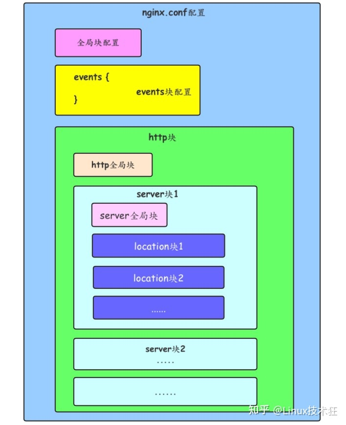

<!-- START doctoc generated TOC please keep comment here to allow auto update -->
<!-- DON'T EDIT THIS SECTION, INSTEAD RE-RUN doctoc TO UPDATE -->
**Table of Contents**  *generated with [DocToc](https://github.com/thlorenz/doctoc)*

- [Nginx](#nginx)
  - [安装](#%E5%AE%89%E8%A3%85)
    - [Mac](#mac)
    - [Windows](#windows)
    - [Linux](#linux)
  - [配置文件](#%E9%85%8D%E7%BD%AE%E6%96%87%E4%BB%B6)
    - [整体结构](#%E6%95%B4%E4%BD%93%E7%BB%93%E6%9E%84)
    - [全局配置](#%E5%85%A8%E5%B1%80%E9%85%8D%E7%BD%AE)
    - [events块配置](#events%E5%9D%97%E9%85%8D%E7%BD%AE)
    - [http块](#http%E5%9D%97)
      - [http全局块](#http%E5%85%A8%E5%B1%80%E5%9D%97)
      - [server块](#server%E5%9D%97)
        - [server全局块](#server%E5%85%A8%E5%B1%80%E5%9D%97)
        - [location块](#location%E5%9D%97)
        - [配置https](#%E9%85%8D%E7%BD%AEhttps)
  - [应用](#%E5%BA%94%E7%94%A8)
    - [动静分离](#%E5%8A%A8%E9%9D%99%E5%88%86%E7%A6%BB)
    - [反向代理](#%E5%8F%8D%E5%90%91%E4%BB%A3%E7%90%86)
    - [负载均衡](#%E8%B4%9F%E8%BD%BD%E5%9D%87%E8%A1%A1)
    - [正向代理](#%E6%AD%A3%E5%90%91%E4%BB%A3%E7%90%86)

<!-- END doctoc generated TOC please keep comment here to allow auto update -->

# Nginx

## 安装

### Mac

```shell
# M1或者M2安装方式
# nginx安装位置：/opt/homebrew/Cellar/nginx/版本号/
# 配置文件位置：/opt/homebrew/etc/nginx/nginx.conf
# 服务器目录：/usr/local/var/www 
brew install nginx  # 使用brew安装nginx
brew info nginx
sudo nginx #启动服务
sudo nginx -s stop #停止服务（直接走）
sudo nginx -s reload  #重新加载
sudo nginx -s reopen #重新启动
sudo nginx -s quit #退出（处理完事情走）
sudo nginx -c 配置文件路径  # 手动指定nginx的路径位置
```

### Windows

### Linux

## 配置文件

### 整体结构



### 全局配置

```nginx
# user是个主模块指令，指定Nginx Worker进程运行用户以及用户组，默认由nobody账号运行。
user nobody nobody;
# worker_processes是个主模块指令，指定了Nginx要开启的进程数。每个Nginx进程平均耗费10M~12M内存。建议指定和CPU的数量一致即可。
worker_processes 2;
# error_log是个主模块指令，用来定义全局错误日志文件。日志输出级别有debug、info、notice、warn、error、crit可供选择，其中，debug输出日志最为最详细，而crit输出日志最少。
error_log logs/error.log notice;
# pid是个主模块指令，用来指定进程pid的存储文件位置。
pid logs/nginx.pid;
# worker_rlimit_nofile用于绑定worker进程和CPU， Linux内核2.4以上可用。
worker_rlimit_nofile 65535;
```

### events块配置

```nginx
# events事件指令是设定Nginx的工作模式及连接数上限：
events{
    # use是个事件模块指令，用来指定Nginx的工作模式。Nginx支持的工作模式有select、poll、kqueue、epoll、rtsig和/dev/poll。其中select和poll都是标准的工作模式，kqueue和epoll是高效的工作模式，不同的是epoll用在Linux平台上，而kqueue用在BSD系统中。对于Linux系统，epoll工作模式是首选。
    use epoll;
    # worker_connections也是个事件模块指令，用于定义Nginx每个进程的最大连接数，默认是1024。最大客户端连接数由worker_processes和worker_connections决定，即Max_client=worker_processes*worker_connections。在作为反向代理时，max_clients变为：max_clients = worker_processes * worker_connections/4。进程的最大连接数受Linux系统进程的最大打开文件数限制，在执行操作系统命令“ulimit -n 65536”后worker_connections的设置才能生效
    worker_connections 65536;
}
```

### http块

#### http全局块

```nginx
#设定http服务器
http
{
    # 常用的浏览器中，可以显示的内容有HTML、XML、GIF及Flash等种类繁多的文本、媒体等资源，浏览器为区分这些资源，需要使用MIME        Type。换言之，MIME Type是网络资源的媒体类型。Nginx服务器作为Web服务器，必须能够识别前端请求的资源类型。
    # include指令，用于包含其他的配置文件，可以放在配置文件的任何地方，但是要注意你包含进来的配置文件一定符合配置规范，比如说你include进来的配置是worker_processes指令的配置，而你将这个指令包含到了http块中，着肯定是不行的，上面已经介绍过worker_processes指令只能在全局块中。
    # 下面的指令将mime.types包含进来，mime.types和ngin.cfg同级目录，不同级的话需要指定具体路径
    include mime.types; 
    # 配置默认类型，如果不加此指令，默认值为text/plain。此指令还可以在http块、server块或者location块中进行配置。
    default_type application/octet-stream; 
    charset utf-8; # 默认编码
    server_names_hash_bucket_size 128; #服务器名字的hash表大小
    client_header_buffer_size 32k; #上传文件大小限制
    large_client_header_buffers 4 64k; #设定请求缓
    client_max_body_size 8m; #设定请求缓
    keepalive_timeout 65;  #连接超时时间，默认为75s，可以在http，server，location块。
    # 设置客户端请求头读取超时时间。如果超过这个时间，客户端还没有发送任何数据，Nginx将返回“Request time out（408）”错误；
    client_header_timeout
    # 设置客户端请求主体读取超时时间。如果超过这个时间，客户端还没有发送任何数据，Nginx将返回“Request time out（408）”错误，默认值是60；
    # send_timeout指定响应客户端的超时时间。这个超时仅限于两个连接活动之间的时间，如果超过这个时间，客户端没有任何活动，Nginx将会关闭连接。
    client_body_timeout
  
    # 开启目录列表访问,合适下载服务器,默认关闭.
    autoindex on; # 显示目录
    autoindex_exact_size on; # 显示文件大小 默认为on,显示出文件的确切大小,单位是bytes 改为off后,显示出文件的大概大小,单位是kB或者MB或者GB
    autoindex_localtime on; # 显示文件时间 默认为off,显示的文件时间为GMT时间 改为on后,显示的文件时间为文件的服务器时间
    # 开启高效文件传输模式,sendfile指令指定nginx是否调用sendfile函数来输出文件,对于普通应用设为 on,如果用来进行下载等应用磁盘IO重负载应用,可设置为off,以平衡磁盘与网络I/O处理速度,降低系统的负载.注意：如果图片显示不正常把这个改成off.可以在http块、server块或者location块中进行配置
  
    sendfile on; 
    # 设置sendfile最大数据量,此指令可以在http块、server块或location块中配置
    sendfile_max_chunk size;
    # 其中，size值如果大于0，Nginx进程的每个worker process每次调用sendfile()传输的数据量最大不能超过这个值(这里是128k，所以每次不能超过128k)；如果设置为0，则无限制。默认值为0。
    sendfile_max_chunk 128k;
    # 防止网络阻塞
    tcp_nopush on;
    # 防止网络阻塞
    tcp_nodelay on;
  
    # 日志
    # access_log配置，此指令可以在http块、server块或者location块中进行设置
    # 在全局块中，我们介绍过errer_log指令，其用于配置Nginx进程运行时的日志存放和级别，此处所指的日志与常规的不同，它是指记录Nginx服务器提供服务过程应答前端请求的日志
    access_log path [format [buffer=size]]
    # 如果你要关闭access_log,你可以使用下面的命令
    access_log off;
  
    # log_format指令，用于定义日志格式，此指令只能在http块中进行配置
    log_format  main '$remote_addr - $remote_user [$time_local] "$request" '
                  '$status $body_bytes_sent "$http_referer" '
                  '"$http_user_agent" "$http_x_forwarded_for"';
    # 定义了上面的日志格式后，可以以下面的形式使用日志
    access_log  logs/access.log  main;
    
    
    # FastCGI相关参数是为了改善网站的性能：减少资源占用,提高访问速度.下面参数看字面意思都能理解.
    fastcgi_connect_timeout 300; ## 链接
    fastcgi_send_timeout 300;  ##读取 是指nginx进程向fastcgi进程发送request的整个过程的超时时间
    fastcgi_read_timeout 300;  ##发请求 是指fastcgi进程向nginx进程发送response的整个过程的超时时间
    fastcgi_buffer_size 64k;
    fastcgi_buffers 4 64k;
    fastcgi_busy_buffers_size 128k;
    fastcgi_temp_file_write_size 128k;
    
    # gzip模块设置
    gzip on; # 开启gzip压缩输出
    gzip_min_length 1k; # 允许压缩的页面的最小字节数,页面字节数从header偷得content-length中获取.默认是0,不管页面多大都进行压缩.建议设置成大于1k的字节数,小于1k可能会越压越大
    gzip_buffers 4 16k; # 表示申请4个单位为16k的内存作为压缩结果流缓存,默认值是申请与原始数据大小相同的内存空间来存储gzip压缩结果
    gzip_http_version 1.1; # 压缩版本（默认1.1,目前大部分浏览器已经支持gzip解压.前端如果是squid2.5请使用1.0）
    gzip_comp_level 2; # 压缩等级.1压缩比最小,处理速度快.9压缩比最大,比较消耗cpu资源,处理速度最慢,但是因为压缩比最大,所以包最小,传输速度快
    gzip_types text/plain application/x-javascript text/css application/xml;
    # 压缩类型,默认就已经包含text/html,所以下面就不用再写了,写上去也不会有问题,但是会有一个warn.
    gzip_vary on;#选项可以让前端的缓存服务器缓存经过gzip压缩的页面.例如:用squid缓存经过nginx压缩的数据
    
    # 开启限制IP连接数的时候需要使用
    limit_zone crawler $binary_remote_addr 10m;
}
```

#### server块

server块和“虚拟主机”的概念有密切联系。

每一个http块都可以包含多个server块，而每个server块就相当于一台虚拟主机，它内部可有多台主机联合提供服务，一起对外提供在逻辑上关系密切的一组服务（或网站）。

和http块相同，server块也可以包含自己的全局块，同时可以包含多个location块。在server全局块中，最常见的两个配置项是本虚拟主机的监听配置和本虚拟主机的名称或IP配置。

##### server全局块

1. 客户端通过域名访问服务器时会将域名与被解析的ip一同放在请求中。当请求到了nginx中时。nginx会先去匹配ip，如果listen中没有找到对应的ip，就会通过域名进行匹配，匹配成功以后，再匹配端口。当这三步完成，就会找到对应的server的location对应的资源。
2. 如果server中listen配置了ip，那么我们就使用客户端带来的ip进行匹配，这个时候server_name失效。

```nginx
# listen指令
# server块中最重要的指令就是listen指令，这个指令有三种配置语法。这个指令默认的配置值是：listen *:80 | *:8000；只能在server块种配置这个指令。

# listen的两种语法格式
# 第一种
listen address[:port] [default_server] [ssl] [http2 | spdy] [proxy_protocol] [setfib=number] [fastopen=number] [backlog=number] [rcvbuf=size] [sndbuf=size] [accept_filter=filter] [deferred] [bind] [ipv6only=on|off] [reuseport] [so_keepalive=on|off|[keepidle]:[keepintvl]:[keepcnt]];

# 第二种
listen port [default_server] [ssl] [http2 | spdy] [proxy_protocol] [setfib=number] [fastopen=number] [backlog=number] [rcvbuf=size] [sndbuf=size] [accept_filter=filter] [deferred] [bind] [ipv6only=on|off] [reuseport] [so_keepalive=on|off|[keepidle]:[keepintvl]:[keepcnt]];

# listen指令 例子
listen 127.0.0.1:8000;  #只监听来自127.0.0.1这个IP，请求8000端口的请求
listen 127.0.0.1; #只监听来自127.0.0.1这个IP，请求80端口的请求（不指定端口，默认80）
listen 8000; #监听来自所有IP，请求8000端口的请求
listen *:8000; #和上面效果一样
listen localhost:8000; #和第一种效果一致
# 其他参数
# address：监听的IP地址（请求来源的IP地址），如果是IPv6的地址，需要使用中括号“[]”括起来，比如[fe80::1]等。
# port：端口号，如果只定义了IP地址没有定义端口号，就使用80端口。这边需要做个说明：要是你压根没配置listen指令，那么那么如果nginx以超级用户权限运行，则使用*:80，否则使用*:8000。多个虚拟主机可以同时监听同一个端口,但是server_name需要设置成不一样；
# default_server：假如通过Host没匹配到对应的虚拟主机，则通过这台虚拟主机处理。具体的可以参考这篇文章，写的不错。
# backlog=number：设置监听函数listen()最多允许多少网络连接同时处于挂起状态，在FreeBSD中默认为-1，其他平台默认为511。
# accept_filter=filter，设置监听端口对请求的过滤，被过滤的内容不能被接收和处理。本指令只在FreeBSD和NetBSD 5.0+平台下有效。filter可以设置为dataready或httpready，感兴趣的读者可以参阅Nginx的官方文档。
# bind：标识符，使用独立的bind()处理此address:port；一般情况下，对于端口相同而IP地址不同的多个连接，Nginx服务器将只使用一个监听命令，并使用bind()处理端口相同的所有连接。
# ssl：标识符，设置会话连接使用SSL模式进行，此标识符和Nginx服务器提供的HTTPS服务有关。

# server_name指令
server_name myserver.com www.myserver.com
# Nginx中的server_name指令主要用于配置基于名称的虚拟主机，server_name指令在接到请求后的匹配顺序分别为：
# 1、准确的server_name匹配，例如：
server {
     listen       80;
     server_name  domain.com  www.domain.com;
     ...
}
# 2、以*通配符开始的字符串：
server {
     listen       80;
     server_name  *.domain.com;
     ...
}
# 3、以*通配符结束的字符串：
server {
     listen       80;
     server_name  www.*;
     ...
}
# 4、匹配正则表达式：
server {
     listen       80;
     server_name  ~^(?.+)\.domain\.com$;
     ...
}

# 完整例子
server {
        listen       80;
        server_name  www.test151.com;
 
        access_log   /usr/local/nginx/test/data/logs/www.test151.com.log main;
        error_log    /usr/local/nginx/test/data/logs/www.test151.com.error.log;
 
        location / {
            root   /usr/local/nginx/test/data/www/151;
            index  index.html index.htm;
        }
   }
```

##### location块

location指令的功能是用来匹配不同的url请求，进而对请求做不同的处理和响应，这其中较难理解的是多个location的匹配顺序。

```nginx
# 匹配参数
# 1. “=” ，精确匹配
location = /abc/ {
  .....
 }   
# 只匹配http://abc.com/abc
#http://abc.com/abc [匹配成功]
#http://abc.com/abc/index [匹配失败]

# 2. “~”，执行正则匹配，区分大小写。
location ~ /Abc/ {
  .....
}
#http://abc.com/Abc/ [匹配成功]
#http://abc.com/abc/ [匹配失败]

# 3. “~*”，执行正则匹配，忽略大小写
location ~* /Abc/ {
  .....
}
# 则会忽略 uri 部分的大小写
#http://abc.com/Abc/ [匹配成功]
#http://abc.com/abc/ [匹配成功]

# 4. “^~”，表示普通字符串匹配上以后不再进行正则匹配。
location ^~ /index/ {
  .....
}
#以 /index/ 开头的请求，都会匹配上
#http://abc.com/index/index.page  [匹配成功]
#http://abc.com/error/error.page [匹配失败]

# 5. 不加任何规则时，默认是大小写敏感，前缀匹配，相当于加了“~”与“^~”
location /index/ {
  ......
}
#http://abc.com/index  [匹配成功]
#http://abc.com/index/index.page  [匹配成功]
#http://abc.com/test/index  [匹配失败]
#http://abc.com/Index  [匹配失败]
# 匹配到所有uri

# 6. “@”，nginx内部跳转
location /index/ {
  error_page 404 @index_error;
}
location @index_error {
  .....
}
#以 /index/ 开头的请求，如果链接的状态为 404。则会匹配到 @index_error 这条规则上。


# 匹配优先级
# = > ^~ > ~ | ~* > 最长前缀匹配 > /

# 常用配置指令：alias、root、proxy_pass
# alias
# alias为别名配置，用于访问文件系统，在匹配到URL后，将URL中 匹配到的字段替换成alias 后边的内容。
# 示例一：若 location 配置如下（普通字符串匹配），则请求URL为“/test/file”时，返回文件“/usr/local/file”。
location /test/ {
alias /usr/local/;
}
# root
# 根路径配置，用于访问文件系统，在匹配到URI后，指向root配置的路径，并把请求路径附加到其后。
# 示例一：
# 若 location 配置如下（普通字符串匹配），则请求URL为“/test/file”时，返回文件“/usr/local/test/file”
location /test/ {
root /usr/local/;
}
# proxy_pass
# 代理配置，用于代理请求，匹配到URI后，转发请求到proxy_pass配置的URL。
# 示例一：若 location 配置如下（普通字符串匹配），则请求URL为“/test/hello”时，返回则将请求转发到“http://192.168.1.111:8089/hello”。
location /test/ {
proxy_pass http://192.168.1.111:8089/;
}
```

##### 配置https

```nginx
server {
    listen 443 ssl;
    #配置HTTPS的默认访问端口443。
    #如果未在此处配置HTTPS的默认访问端口，可能会造成Nginx无法启动。
    #如果你使用Nginx 1.15.0及以上版本，请使用listen 443 ssl代替listen 443和ssl on。
    server_name yourdomain.com; #需要将yourdomain.com替换成证书绑定的域名。
    root html;
    index index.html index.htm;
    ssl_certificate cert/cert-file-name.pem;  #需要将cert-file-name.pem替换成已上传的证书文件的名称。
    ssl_certificate_key cert/cert-file-name.key; #需要将cert-file-name.key替换成已上传的证书密钥文件的名称。
    ssl_session_timeout 5m;
    ssl_ciphers ECDHE-RSA-AES128-GCM-SHA256:ECDHE:ECDH:AES:HIGH:!NULL:!aNULL:!MD5:!ADH:!RC4;
    #表示使用的加密套件的类型。
    ssl_protocols TLSv1 TLSv1.1 TLSv1.2; #表示使用的TLS协议的类型。
    ssl_prefer_server_ciphers on;
    location / {
        root html;  #站点目录。
        index index.html index.htm;
    }
}

# 将http重定向https
server {
    listen 80;
    server_name somnus.test.com;
    #将请求转成https
    rewrite ^(.*)$ https://$host$1 permanent;
}
```

## 应用

### 动静分离

### 反向代理

1. 同一个域名下配置多个项目

   ```nginx
   # nginx按不同的目录分发给不同的项目
   server {
       listen    80;
       server_name example.com;
    
       location ^~ /project1 {
           proxy_pass     http://localhost:8081;
           proxy_set_header  Host       $host;
           proxy_set_header  X-Real-IP    $remote_addr;
           proxy_set_header  X-Forwarded-For $proxy_add_x_forwarded_for;
       }
    
       location ^~ /project2 {
           proxy_pass     http://localhost:8082;
           proxy_set_header  Host       $host;
           proxy_set_header  X-Real-IP    $remote_addr;
           proxy_set_header  X-Forwarded-For $proxy_add_x_forwarded_for;
       }
    
       location / {
          proxy_pass     http://localhost:8080;
          proxy_set_header  Host       $host;
          proxy_set_header  X-Real-IP    $remote_addr;
          proxy_set_header  X-Forwarded-For $proxy_add_x_forwarded_for;
       }
   }\
   ```

2. 

### 负载均衡

```nginx
http  {
upstream myserver { 
      server  192.168.24.200:8080;
      server  192.168.24.205:8080;
    }

 server {
        ....
        location  / {         
           proxy_pass  myserver;#请求转向mysvr 定义的服务器列表         
           proxy_redirect off;
            proxy_set_header X-Real-IP $remote_addr;
            #后端的Web服务器可以通过X-Forwarded-For获取用户真实IP
            proxy_set_header X-Forwarded-For $proxy_add_x_forwarded_for;
        }
  }
 
# 1、热备：如果你有2台服务器，当一台服务器发生事故时，才启用第二台服务器给提供服务。服务器处理请求的顺序：如果第一台挂了，再去请求第二台。
upstream myserver { 
   server  http://192.168.24.200:8080;
   server  http://192.168.24.205:8080; backup;  #热备     
}
  
# 2、轮询：nginx默认权重就是轮询,都默认为1，服务器处理请求的顺序：ABABABABAB....
upstream myserver { 
      server  192.168.24.200:8080;
      server  192.168.24.205:8080;       
}
  
# 3、加权轮询：跟据配置的权重的大小而分发给不同服务器不同数量的请求。如果不设置，则默认为1。下面服务器的请求顺序为：ABBABBABBABBABB....
upstream myserver { 
     server  192.168.24.200:8080 weight=1;
     server  192.168.24.205:8080 weight=2;
}
  
# 4、ip_hash:nginx会让相同的客户端ip请求相同的服务器。
upstream myserver { 
      server  192.168.24.200:8080
      server  192.168.24.205:8080
      ip_hash;
    }
  
# 关于nginx负载均衡配置的几个状态参数讲解。
# down，表示当前的server暂时不参与负载均衡。
# backup，预留的备份机器。当其他所有的非backup机器出现故障或者忙的时候，才会请求backup机器，因此这台机器的压力最轻。
# max_fails，允许请求失败的次数，默认为1。当超过最大次数时，返回proxy_next_upstream 模块定义的错误。
# fail_timeout，在经历了max_fails次失败后，暂停服务的时间。max_fails可以和fail_timeout一起使用。
# weight 默认为1.weight越大，负载的权重就越大。
```

### 正向代理